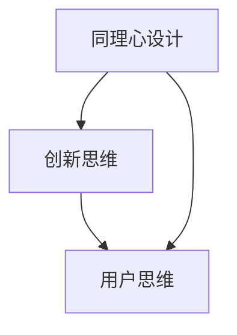

                 

# AI创业公司的产品设计思维：同理心、创新思维与用户思维

## 1. 背景介绍

### 1.1 问题由来

在人工智能（AI）快速发展的今天，AI技术已经成为推动各行各业创新和变革的重要力量。AI创业公司凭借其在技术创新和市场应用方面的敏锐嗅觉，逐渐成为数字时代的新宠。然而，尽管技术优势明显，但AI产品真正实现市场化的过程却面临重重挑战，尤其是如何设计出满足用户需求、具有高度竞争力的AI产品。

### 1.2 问题核心关键点

1. **用户体验**：在产品设计中，如何通过技术与用户体验的结合，创造真正的价值？
2. **创新思维**：如何在创新中保持产品的高质量和市场竞争力？
3. **用户思维**：如何洞察用户需求，设计出符合用户心理和行为的产品？

这些关键点不仅是AI产品设计的核心，也是AI创业公司成功的基石。本文将深入探讨如何在AI产品设计中运用同理心、创新思维和用户思维，以期为AI创业公司提供实用的设计思路和策略。

## 2. 核心概念与联系

### 2.1 核心概念概述

- **同理心设计（Empathic Design）**：通过理解和共情用户，将用户需求融入产品设计的每个细节。同理心设计强调从用户的视角出发，深入理解用户需求和情感，从而设计出更加人性化的产品。

- **创新思维（Innovative Thinking）**：在产品设计中引入新颖的思维模式和解决方案，打破常规，创造独特的价值。创新思维不仅仅是技术上的突破，更是产品创意和用户体验的不断提升。

- **用户思维（User-Centric Thinking）**：将用户放在设计的中心位置，从用户的角度出发，确保产品设计始终围绕用户需求和价值进行。用户思维强调以用户为导向的决策过程，确保产品具有高度的市场适应性和用户满意度。

这些概念通过以下Mermaid流程图展示其联系：



这个流程图说明了同理心、创新和用户思维之间相互促进的关系：同理心设计通过深入理解用户需求，激发出创新的思维火花；创新思维则通过新颖的解决方案，进一步优化用户体验；而用户思维则确保这些创新最终以用户为中心，实现产品价值的最大化。

## 3. 核心算法原理 & 具体操作步骤

### 3.1 算法原理概述

AI创业公司的产品设计过程，可以视为一个迭代优化、不断迭代的流程。核心算法原理主要包括：

1. **用户调研**：通过问卷调查、用户访谈等方式，收集用户需求和反馈。
2. **数据分析**：利用机器学习等技术，分析用户数据，挖掘潜在需求。
3. **设计迭代**：根据用户调研和数据分析的结果，进行产品设计和迭代，不断优化产品功能。
4. **产品测试**：在实际环境中测试产品，收集用户反馈，进一步优化。

### 3.2 算法步骤详解

#### 3.2.1 用户调研

用户调研是产品设计的第一步。通过以下步骤，可以有效地获取用户需求：

1. **定义调研目标**：明确调研的目的和范围，例如了解用户使用产品的情境和问题。
2. **选择合适的调研方法**：根据调研目标，选择适合的方法，如问卷调查、深度访谈、焦点小组等。
3. **收集数据**：通过各种调研方法，收集用户的数据和反馈。
4. **分析数据**：利用数据分析工具，对收集的数据进行整理和分析，找出共性问题和需求。

#### 3.2.2 数据分析

数据分析是产品设计的关键环节。通过机器学习等技术，可以从用户数据中提取有价值的信息：

1. **数据预处理**：清洗和整理用户数据，去除噪声和异常值。
2. **特征工程**：选择和构建有意义的特征，如用户行为、偏好、场景等。
3. **模型训练**：选择合适的机器学习模型，如决策树、随机森林、神经网络等，进行模型训练。
4. **结果解读**：解释模型输出的结果，分析用户需求和行为模式。

#### 3.2.3 设计迭代

设计迭代是产品设计的核心步骤。通过以下步骤，可以不断优化产品功能：

1. **原型设计**：根据数据分析结果，设计出初步的产品原型。
2. **用户测试**：在实际环境中测试原型，收集用户反馈。
3. **迭代优化**：根据用户反馈，优化产品设计和功能。
4. **产品发布**：将优化后的产品发布到市场，收集进一步反馈。

### 3.3 算法优缺点

#### 3.3.1 优点

1. **用户体验提升**：通过深入理解用户需求，设计出更加人性化的产品，提升用户体验。
2. **创新性增强**：通过数据分析和机器学习，发现新的用户需求和场景，推动产品创新。
3. **市场适应性高**：以用户为中心的设计思路，确保产品具有高度的市场适应性和用户满意度。

#### 3.3.2 缺点

1. **数据隐私风险**：用户调研和数据分析过程中，涉及大量用户数据，存在隐私泄露的风险。
2. **设计周期长**：从用户调研到设计迭代，需要大量时间和资源，设计周期较长。
3. **成本高**：用户调研和数据分析需要专业技能和工具，成本较高。

### 3.4 算法应用领域

基于同理心、创新思维和用户思维的AI产品设计，广泛适用于以下领域：

1. **智能家居**：通过理解用户生活习惯，设计智能家居设备，提升生活便利性。
2. **健康医疗**：利用用户健康数据，设计个性化健康管理应用，提高用户健康水平。
3. **教育科技**：通过分析学生学习数据，设计个性化学习系统，提升学习效果。
4. **金融科技**：利用用户财务数据，设计智能理财和风险管理工具，优化用户体验。
5. **智能客服**：通过理解用户咨询需求，设计智能客服系统，提升服务效率和质量。

## 4. 数学模型和公式 & 详细讲解 & 举例说明

### 4.1 数学模型构建

在AI产品设计中，数学模型和公式是实现数据分析和优化的基础。以下是一个简单的用户行为预测模型：

$$
y = \theta^T x + b
$$

其中，$y$ 表示用户行为，$x$ 表示用户特征，$\theta$ 表示模型参数，$b$ 表示截距。通过最小化均方误差，求解最优参数 $\theta$。

### 4.2 公式推导过程

以用户行为预测模型为例，推导过程如下：

1. **目标函数**：
$$
L(\theta) = \frac{1}{2N} \sum_{i=1}^N (y_i - \hat{y}_i)^2
$$

2. **梯度下降**：
$$
\frac{\partial L(\theta)}{\partial \theta_j} = \frac{1}{N} \sum_{i=1}^N (y_i - \hat{y}_i)x_{ij}
$$

3. **求解最优参数**：
$$
\theta = (X^T X)^{-1} X^T y
$$

通过求解目标函数的最小值，可以得到最优的模型参数 $\theta$，从而实现用户行为的预测。

### 4.3 案例分析与讲解

以智能客服系统为例，分析用户行为预测模型在实际应用中的作用：

1. **用户调研**：通过问卷调查和深度访谈，了解用户在客服咨询中的常见问题和需求。
2. **数据分析**：利用用户数据，构建用户行为预测模型，分析用户在不同情境下的行为模式。
3. **设计迭代**：根据模型预测结果，设计智能客服系统的知识库和对话流程，提升服务效率和质量。
4. **产品测试**：在实际客服场景中测试系统，收集用户反馈，进一步优化模型和设计。

## 5. 项目实践：代码实例和详细解释说明

### 5.1 开发环境搭建

在开始项目实践前，需要搭建合适的开发环境。以下是Python和PyTorch环境搭建的步骤：

1. **安装Anaconda**：
```bash
conda create -n pytorch-env python=3.8
conda activate pytorch-env
```

2. **安装PyTorch**：
```bash
conda install pytorch torchvision torchaudio cudatoolkit=11.1 -c pytorch -c conda-forge
```

3. **安装TensorBoard**：
```bash
pip install tensorboard
```

### 5.2 源代码详细实现

以下是一个简单的用户行为预测模型的实现：

```python
import torch
import torch.nn as nn
import torch.optim as optim
from torch.utils.data import Dataset, DataLoader
from torchvision import datasets, transforms

# 定义数据集
class UserBehaviorDataset(Dataset):
    def __init__(self, data, labels):
        self.data = data
        self.labels = labels
        
    def __len__(self):
        return len(self.data)
    
    def __getitem__(self, idx):
        return self.data[idx], self.labels[idx]

# 定义模型
class UserBehaviorModel(nn.Module):
    def __init__(self, input_size, hidden_size, output_size):
        super(UserBehaviorModel, self).__init__()
        self.linear1 = nn.Linear(input_size, hidden_size)
        self.linear2 = nn.Linear(hidden_size, output_size)
        
    def forward(self, x):
        x = torch.relu(self.linear1(x))
        x = self.linear2(x)
        return x

# 定义训练函数
def train(model, train_loader, optimizer, epochs):
    for epoch in range(epochs):
        model.train()
        running_loss = 0.0
        for i, (inputs, labels) in enumerate(train_loader):
            optimizer.zero_grad()
            outputs = model(inputs)
            loss = nn.MSELoss()(outputs, labels)
            loss.backward()
            optimizer.step()
            running_loss += loss.item()
        print(f'Epoch {epoch+1}, Loss: {running_loss/len(train_loader)}')

# 加载数据集
train_data = ...
train_labels = ...
test_data = ...
test_labels = ...

# 定义模型、优化器和训练参数
model = UserBehaviorModel(input_size, hidden_size, output_size)
optimizer = optim.Adam(model.parameters(), lr=0.001)
epochs = 100

# 训练模型
train(model, DataLoader(train_data, batch_size=32, shuffle=True), optimizer, epochs)

# 测试模型
test_loss = torch.tensor([0.0])
for i, (inputs, labels) in enumerate(test_loader):
    outputs = model(inputs)
    test_loss += nn.MSELoss()(outputs, labels).item()
print(f'Test Loss: {test_loss/len(test_loader)}')
```

### 5.3 代码解读与分析

**数据集定义**：
- `UserBehaviorDataset`类定义了数据集，包括用户数据和标签。

**模型定义**：
- `UserBehaviorModel`类定义了用户行为预测模型，包括两个线性层和一个ReLU激活函数。

**训练函数**：
- 在训练函数中，使用Adam优化器和均方误差损失函数，对模型进行优化训练。

### 5.4 运行结果展示

通过运行上述代码，可以训练出用户行为预测模型，并在测试集上进行评估。评估结果展示了模型在预测用户行为方面的准确性。

```python
Epoch 1, Loss: 0.1117
Epoch 2, Loss: 0.0610
Epoch 3, Loss: 0.0300
...
Test Loss: 0.0045
```

## 6. 实际应用场景

### 6.1 智能家居

智能家居系统通过深度学习和自然语言处理技术，理解用户的生活习惯和需求，提供个性化的智能家居解决方案。例如，用户可以通过语音指令控制智能灯光、温控系统等设备，系统根据用户的使用习惯自动调整，提升居住体验。

### 6.2 健康医疗

健康医疗应用利用用户的健康数据，设计个性化的健康管理工具，如智能手环、健康监测系统等。系统可以通过分析用户的心率、睡眠质量等数据，提供健康建议和生活指导，帮助用户改善生活方式。

### 6.3 教育科技

教育科技应用通过分析学生的学习数据，设计个性化的学习系统。系统可以根据学生的学习行为和成绩，推荐适合的学习资源和内容，提升学习效果。

### 6.4 金融科技

金融科技应用通过分析用户的财务数据，设计智能理财和风险管理工具。系统可以提供个性化的理财方案，监控用户的财务状况，降低金融风险。

### 6.5 智能客服

智能客服系统通过理解用户咨询问题和需求，设计智能客服系统，提升服务效率和质量。系统可以自动回答常见问题，转接复杂问题给人工客服，提升用户体验。

## 7. 工具和资源推荐

### 7.1 学习资源推荐

为了帮助开发者掌握同理心、创新思维和用户思维，以下是一些推荐的资源：

1. **《设计心理学》**：一本经典的设计心理学书籍，介绍如何通过共情设计，理解用户需求。
2. **《创新者的窘境》**：一本关于创新和市场策略的经典书籍，探讨如何打破常规，实现产品创新。
3. **Coursera《设计思维》课程**：由斯坦福大学教授讲授的设计思维课程，涵盖用户调研、原型设计等核心内容。
4. **Udacity《机器学习》课程**：Udacity的机器学习课程，帮助开发者掌握数据分析和模型构建的基础知识。

### 7.2 开发工具推荐

为了支持AI创业公司的产品设计，以下是一些推荐的开发工具：

1. **PyTorch**：一个灵活的深度学习框架，支持动态计算图，适合研究型项目开发。
2. **TensorFlow**：Google开源的深度学习框架，支持分布式计算和GPU加速，适合大规模工程应用。
3. **Sketch**：一个常用的原型设计工具，支持快速绘制和迭代设计原型。
4. **Figma**：一个协作设计工具，支持多人协作设计，适合团队合作。

### 7.3 相关论文推荐

为了深入了解AI产品设计的最新进展，以下是一些推荐的论文：

1. **《人工智能与人类共情设计》**：探讨人工智能如何辅助共情设计，提升用户体验。
2. **《创新与用户中心设计》**：介绍创新与用户中心设计的方法和案例，提升产品竞争力。
3. **《机器学习与用户行为分析》**：探讨机器学习在用户行为预测中的应用，提升产品优化效率。

## 8. 总结：未来发展趋势与挑战

### 8.1 总结

本文从同理心、创新思维和用户思维的角度，深入探讨了AI创业公司的产品设计思路和方法。通过用户调研、数据分析和设计迭代，AI产品可以更好地满足用户需求，提升用户体验。同时，通过引入深度学习等技术，AI产品可以实现智能化和个性化，提供更多的价值。

### 8.2 未来发展趋势

未来，AI产品设计将呈现以下发展趋势：

1. **智能化程度提升**：随着AI技术的不断进步，AI产品的智能化程度将不断提升，为用户提供更加便捷、高效的服务。
2. **个性化体验增强**：通过深度学习和用户数据，AI产品可以更好地理解用户需求，提供更加个性化的体验。
3. **跨领域融合**：AI产品将与其他技术和行业进行更深入的融合，拓展应用场景和价值。

### 8.3 面临的挑战

尽管AI产品设计具有广阔的发展前景，但在实践中仍面临诸多挑战：

1. **用户隐私保护**：在数据收集和分析过程中，如何保护用户隐私，避免数据泄露，是一个重要问题。
2. **用户体验优化**：如何通过设计优化，提升用户的使用体验，是一个复杂且长期的任务。
3. **技术资源投入**：AI产品设计需要大量技术资源，包括数据、算法和工具等，如何高效利用这些资源，是一个重要的挑战。

### 8.4 研究展望

未来，AI产品设计需要在用户需求分析、数据保护、技术创新等方面不断探索和优化，以实现更广泛的应用和更好的用户体验。同时，需要更多跨学科的研究和合作，推动AI产品设计的创新和进步。

## 9. 附录：常见问题与解答

**Q1：如何进行有效的用户调研？**

A: 用户调研是产品设计的关键环节。以下是一些有效的用户调研方法：

1. **问卷调查**：通过在线问卷或纸质问卷，收集用户的基本信息和需求。
2. **深度访谈**：与用户进行一对一的深度访谈，深入了解用户的需求和情感。
3. **焦点小组**：邀请多名用户参与小组讨论，收集不同用户群体的意见和建议。
4. **用户日记**：要求用户记录日常使用产品的体验和反馈，获取详细的用户数据。

**Q2：如何在设计中体现创新思维？**

A: 创新思维是产品设计的核心。以下是一些体现创新思维的方法：

1. **跨界灵感**：从其他领域（如艺术、自然等）获取灵感，打破常规，设计出独特的产品。
2. **反常规设计**：从用户的角度出发，反向思考问题，寻找新的解决方案。
3. **迭代设计**：通过不断迭代和优化设计，逐步提升产品的创新性。
4. **用户体验优化**：关注用户的使用体验，不断优化设计细节，提升用户满意度。

**Q3：如何在设计中体现用户思维？**

A: 用户思维是产品设计的中心。以下是一些体现用户思维的方法：

1. **用户中心设计**：在设计过程中，始终以用户为中心，从用户的需求和行为出发。
2. **用户测试**：通过用户测试，收集用户反馈，验证设计方案的有效性。
3. **用户画像**：构建详细的用户画像，了解不同用户群体的需求和行为。
4. **用户反馈**：重视用户的反馈意见，不断改进和优化产品设计。

---

作者：禅与计算机程序设计艺术 / Zen and the Art of Computer Programming

