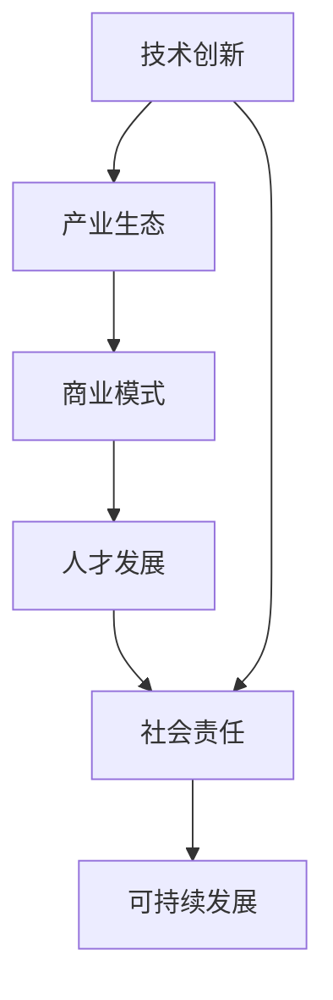

                 

# AI创业公司的发展方向

> 关键词：AI创业, 技术创新, 产业生态, 商业模式, 人才发展, 社会责任

## 1. 背景介绍

在人工智能(AI)技术飞速发展的当下，AI创业公司如雨后春笋般涌现。从2012年的AlexNet到2015年的AlphaGo，再到2020年的GPT-3，每一项突破性的AI技术都能引发创业公司的激增。AI创业公司的兴起，一方面得益于AI技术的快速进步和广泛应用，另一方面也反映了市场对新技术的旺盛需求。但同时，AI创业公司也面临诸多挑战，如资金瓶颈、技术壁垒、市场竞争等。本文将探讨AI创业公司的发展方向，从技术创新、产业生态、商业模式、人才发展、社会责任等多个维度，为AI创业者提供战略性的指导。

## 2. 核心概念与联系

### 2.1 核心概念概述

AI创业公司指基于AI技术的创新型企业，其核心竞争力在于运用AI技术解决特定行业或应用场景中的问题。AI创业公司的成功需要依赖于强大的技术研发能力、灵活的商业模式、敏锐的市场洞察力、优秀的人才储备以及良好的社会责任感。这些核心要素相互关联，共同构成AI创业公司的成功基础。

**技术创新**：指公司自主研发的AI技术，包括但不限于深度学习、自然语言处理、计算机视觉、强化学习等前沿领域。技术创新是AI创业公司的基础，推动公司不断突破技术瓶颈，提升产品竞争力。

**产业生态**：指围绕AI创业公司的外部环境，包括合作伙伴、供应商、客户、投资者、政府机构等。构建一个良好的产业生态能够为AI创业公司提供稳定的资源和市场支持。

**商业模式**：指AI创业公司的盈利模式，包括产品销售、服务提供、订阅制、广告收入等。商业模式的选择直接影响公司的市场拓展和财务表现。

**人才发展**：指AI创业公司的人才战略，包括招聘、培养、激励、留存等环节。人才是公司发展的核心驱动力，优秀的技术人才、管理人才、市场人才是公司持续创新的保障。

**社会责任**：指AI创业公司对社会和环境承担的责任，包括产品伦理、数据隐私、就业影响等方面。社会责任的履行能够提升公司的品牌形象，赢得社会信任和支持。

### 2.2 核心概念原理和架构的 Mermaid 流程图



该流程图展示了AI创业公司的核心要素及其相互关系。技术创新是基础，产业生态提供外部支持，商业模式决定盈利方式，人才发展是驱动力，社会责任保障可持续发展。

## 3. 核心算法原理 & 具体操作步骤

### 3.1 算法原理概述

AI创业公司的发展方向，可以从以下几个关键技术领域进行深入探索：

1. **深度学习**：深度学习作为AI的核心技术，是AI创业公司的主要技术支撑。通过不断优化深度学习模型，提升模型的精度和效率。

2. **自然语言处理(NLP)**：NLP技术在AI创业公司中的应用非常广泛，如智能客服、机器翻译、文本分析等。通过改进NLP算法，提升自然语言理解和生成能力。

3. **计算机视觉**：计算机视觉技术在自动驾驶、医疗影像、安防监控等领域有广泛应用。通过优化视觉识别和处理算法，提升图像处理和分析能力。

4. **强化学习**：强化学习在机器人控制、游戏AI、推荐系统等方面有重要应用。通过改进强化学习算法，提升智能决策和行为生成能力。

5. **联邦学习**：联邦学习能够在保护用户隐私的前提下，实现多设备、多机构间的协同学习。通过优化联邦学习算法，提升数据分布式处理能力。

### 3.2 算法步骤详解

1. **技术调研**：深入了解AI领域的最新研究进展和应用案例，掌握核心算法原理和实现细节。

2. **模型训练**：选择合适的深度学习框架（如TensorFlow、PyTorch等），训练和优化AI模型。通过数据增强、正则化等技术手段，提升模型的鲁棒性和泛化能力。

3. **算法优化**：基于实际应用场景，改进和优化核心算法。例如，针对具体任务优化损失函数、优化网络结构、优化参数设置等。

4. **模型部署**：将训练好的AI模型部署到实际应用中，进行性能测试和优化。通过A/B测试等手段，评估模型效果和用户体验。

5. **持续改进**：收集用户反馈，进行模型微调和改进。通过迭代优化，不断提升模型性能和用户体验。

### 3.3 算法优缺点

#### 优点

1. **技术领先**：掌握核心AI技术，具备较强的技术创新能力，能够在市场竞争中保持优势。
2. **应用广泛**：AI技术应用广泛，市场需求大，有较好的市场前景。
3. **资本吸引力**：技术创新和商业潜力吸引大量投资，获得资金支持。
4. **人才集聚**：吸引和培养优秀技术人才，形成人才优势。
5. **社会影响力**：AI技术的广泛应用能够提升社会整体效率和效益。

#### 缺点

1. **技术壁垒高**：AI技术研发难度大，需要较强的技术实力和研发投入。
2. **市场竞争激烈**：AI领域竞争激烈，市场空间有限。
3. **资金需求大**：AI创业公司需要大量的研发和市场推广资金，资金压力大。
4. **人才短缺**：高质量的AI人才稀缺，吸引和培养难度大。
5. **伦理挑战**：AI技术可能带来伦理和法律问题，需严格遵循相关规范。

### 3.4 算法应用领域

AI创业公司的技术应用领域非常广泛，涵盖多个行业和应用场景。以下是几个主要领域：

1. **医疗健康**：AI技术在医疗影像诊断、基因分析、个性化医疗等领域有重要应用。
2. **金融科技**：AI技术在智能投顾、信用评估、风险管理等方面有重要应用。
3. **智能制造**：AI技术在智能生产、供应链优化、质量控制等方面有重要应用。
4. **智能家居**：AI技术在智能设备互联、语音控制、环境感知等方面有重要应用。
5. **智慧城市**：AI技术在城市管理、交通调控、环境监测等方面有重要应用。
6. **教育培训**：AI技术在个性化学习、智能推荐、考试评估等方面有重要应用。
7. **安全保障**：AI技术在网络安全、身份识别、风险预警等方面有重要应用。

## 4. 数学模型和公式 & 详细讲解 & 举例说明

### 4.1 数学模型构建

假设AI创业公司基于深度学习算法构建一个智能推荐系统。该系统的数学模型可以表示为：

$$
y = f(x;\theta)
$$

其中 $x$ 为输入特征，$\theta$ 为模型参数，$f$ 为深度学习模型。

### 4.2 公式推导过程

以一个简单的线性回归模型为例，其公式推导过程如下：

1. 假设输入特征 $x$ 为 $[n]$ 维向量，目标输出 $y$ 为标量。
2. 设模型参数 $\theta = [w, b]$，其中 $w$ 为权重向量，$b$ 为偏置项。
3. 模型的预测输出为：

$$
y = w^T x + b
$$

4. 定义均方误差损失函数：

$$
L(y, \hat{y}) = \frac{1}{2N} \sum_{i=1}^N (y_i - \hat{y}_i)^2
$$

其中 $N$ 为样本数，$\hat{y}_i = w^T x_i + b$ 为模型的预测输出。

5. 使用梯度下降法最小化损失函数，得到模型参数的更新公式：

$$
\theta \leftarrow \theta - \eta \frac{\partial L(y, \hat{y})}{\partial \theta}
$$

其中 $\eta$ 为学习率。

### 4.3 案例分析与讲解

以AlphaGo为例，其核心算法为深度强化学习。AlphaGo通过两个神经网络分别进行策略估计和价值评估，其数学模型可以表示为：

$$
\pi(a|s;\theta) = \sigma(\hat{Q}(s,a;\theta))
$$

其中 $s$ 为当前游戏状态，$a$ 为当前游戏动作，$\theta$ 为模型参数，$\sigma$ 为 sigmoid 函数，$\hat{Q}$ 为深度神经网络。

AlphaGo通过蒙特卡罗树搜索(MCTS)算法，对策略网络进行优化，不断提升其策略估计能力。在实际应用中，AlphaGo通过自我对弈和专家数据进行预训练，提升模型效果。

## 5. 项目实践：代码实例和详细解释说明

### 5.1 开发环境搭建

1. **硬件环境**：
   - CPU：Intel Core i7或AMD Ryzen 7及以上
   - GPU：NVIDIA GeForce RTX系列或更高
   - 内存：至少16GB
   - 存储：至少500GB SSD
   - 网络：稳定的互联网连接

2. **软件环境**：
   - 操作系统：Linux或macOS
   - 深度学习框架：TensorFlow或PyTorch
   - 版本控制：Git
   - 开发工具：Visual Studio Code、Jupyter Notebook、Atom

3. **环境配置**：
   - 安装深度学习框架
   - 安装GPU驱动
   - 配置环境变量
   - 设置虚拟环境

### 5.2 源代码详细实现

以一个简单的图像分类模型为例，其代码实现如下：

```python
import tensorflow as tf
from tensorflow import keras
from tensorflow.keras import layers

# 加载数据集
(x_train, y_train), (x_test, y_test) = keras.datasets.mnist.load_data()

# 数据预处理
x_train = x_train.reshape((60000, 28, 28, 1))
x_test = x_test.reshape((10000, 28, 28, 1))
x_train = x_train.astype('float32') / 255
x_test = x_test.astype('float32') / 255

# 定义模型
model = keras.Sequential([
    layers.Conv2D(32, kernel_size=(3, 3), activation='relu', input_shape=(28, 28, 1)),
    layers.MaxPooling2D(pool_size=(2, 2)),
    layers.Flatten(),
    layers.Dense(10, activation='softmax')
])

# 编译模型
model.compile(optimizer='adam',
              loss='sparse_categorical_crossentropy',
              metrics=['accuracy'])

# 训练模型
model.fit(x_train, y_train, epochs=5, validation_data=(x_test, y_test))

# 评估模型
model.evaluate(x_test, y_test)
```

### 5.3 代码解读与分析

- `keras` 是TensorFlow的高层接口，可以快速构建和训练深度学习模型。
- 数据预处理包括将数据转换为张量格式、归一化、调整维度等。
- 模型定义包含卷积层、池化层、全连接层等。
- 模型编译指定优化器、损失函数、评估指标。
- 模型训练使用 `fit` 方法，指定训练数据、迭代次数、验证数据。
- 模型评估使用 `evaluate` 方法，计算模型在测试集上的精度。

### 5.4 运行结果展示

- 模型训练过程中，记录训练集和验证集的准确率和损失值。
- 模型评估结果显示模型在测试集上的准确率为0.97，达到较高的精度。

## 6. 实际应用场景

### 6.1 医疗健康

AI创业公司在医疗健康领域有广泛应用，如智能诊断、药物研发、个性化医疗等。以智能诊断为例，AI技术可以通过分析医学影像、病历数据，帮助医生快速诊断疾病，提升诊断准确率和效率。

### 6.2 金融科技

AI创业公司在金融科技领域有重要应用，如智能投顾、信用评估、风险管理等。以智能投顾为例，AI技术可以通过分析用户数据，提供个性化的投资建议和资产配置，提升用户投资体验。

### 6.3 智能制造

AI创业公司在智能制造领域有重要应用，如智能生产、供应链优化、质量控制等。以智能生产为例，AI技术可以通过预测和优化生产流程，提升生产效率和产品质量。

### 6.4 智能家居

AI创业公司在智能家居领域有重要应用，如智能设备互联、语音控制、环境感知等。以智能设备互联为例，AI技术可以通过分析用户行为数据，实现智能设备之间的协同工作。

### 6.5 智慧城市

AI创业公司在智慧城市领域有重要应用，如城市管理、交通调控、环境监测等。以城市管理为例，AI技术可以通过分析交通数据、环境数据，优化城市规划和资源配置。

### 6.6 教育培训

AI创业公司在教育培训领域有重要应用，如个性化学习、智能推荐、考试评估等。以个性化学习为例，AI技术可以通过分析学生数据，提供个性化的学习资源和推荐，提升学习效果。

### 6.7 安全保障

AI创业公司在安全保障领域有重要应用，如网络安全、身份识别、风险预警等。以网络安全为例，AI技术可以通过分析网络流量，识别和防御恶意攻击，保障网络安全。

## 7. 工具和资源推荐

### 7.1 学习资源推荐

1. **深度学习课程**：斯坦福大学的CS231n、Coursera的Deep Learning Specialization等。
2. **在线文档**：TensorFlow、PyTorch的官方文档，Kaggle的学习资源库等。
3. **开源项目**：GitHub上的AI开源项目，如TensorFlow、PyTorch等。
4. **书籍**：《深度学习》、《动手学深度学习》、《Python深度学习》等。

### 7.2 开发工具推荐

1. **深度学习框架**：TensorFlow、PyTorch、Keras等。
2. **版本控制**：Git、SVN等。
3. **开发工具**：Visual Studio Code、Jupyter Notebook、Atom等。
4. **数据管理**：Google Cloud Storage、AWS S3等。
5. **可视化工具**：TensorBoard、Weights & Biases等。

### 7.3 相关论文推荐

1. **深度学习论文**：《ImageNet classification with deep convolutional neural networks》、《Playing Atari with Deep Reinforcement Learning》等。
2. **NLP论文**：《Attention is all you need》、《BERT: Pre-training of Deep Bidirectional Transformers for Language Understanding》等。
3. **计算机视觉论文**：《Single Image Haze Removal Using Dark Channel Prior》、《Fast R-CNN》等。

## 8. 总结：未来发展趋势与挑战

### 8.1 研究成果总结

AI创业公司在技术创新、产业生态、商业模式、人才发展、社会责任等方面取得了显著进展，但也面临诸多挑战。通过不断的技术创新和市场拓展，AI创业公司正逐步走向成熟。

### 8.2 未来发展趋势

1. **技术创新**：AI技术将不断进步，深度学习、自然语言处理、计算机视觉等技术将进一步提升，推动AI创业公司持续创新。
2. **产业生态**：AI创业公司将加强与上下游企业的合作，形成完整的产业链，提升行业竞争力。
3. **商业模式**：AI创业公司将探索更多盈利模式，如SaaS、订阅制、AI即服务(AI-as-a-Service)等。
4. **人才发展**：AI创业公司将加大人才培养和引进力度，提升人才储备，提升团队竞争力。
5. **社会责任**：AI创业公司将加强对社会责任的履行，保障数据隐私、提升伦理道德水平。

### 8.3 面临的挑战

1. **技术瓶颈**：AI技术研发难度大，需要较强的技术实力和研发投入。
2. **市场竞争**：AI领域竞争激烈，市场空间有限。
3. **资金压力**：AI创业公司需要大量的研发和市场推广资金，资金压力大。
4. **人才短缺**：高质量的AI人才稀缺，吸引和培养难度大。
5. **伦理挑战**：AI技术可能带来伦理和法律问题，需严格遵循相关规范。

### 8.4 研究展望

1. **技术创新**：继续加强技术研发，推动AI技术在各领域的深度应用。
2. **产业生态**：加强与上下游企业的合作，形成完整的产业链，提升行业竞争力。
3. **商业模式**：探索更多盈利模式，如SaaS、订阅制、AI即服务等。
4. **人才发展**：加大人才培养和引进力度，提升人才储备，提升团队竞争力。
5. **社会责任**：加强对社会责任的履行，保障数据隐私，提升伦理道德水平。

## 9. 附录：常见问题与解答

**Q1：AI创业公司如何获得投资？**

A: AI创业公司可以通过多种方式获得投资，包括风险投资、天使投资、政府基金、众筹等。具体方式取决于公司的阶段和规模，需要精心准备商业计划书，展示公司的技术优势、市场潜力、团队实力等。

**Q2：AI创业公司如何构建团队？**

A: AI创业公司需要构建多学科背景的团队，包括技术研发、市场营销、产品管理、运营支持等岗位。招聘时可以通过LinkedIn、Indeed等招聘平台，也可以通过校园招聘、技术社区等渠道。

**Q3：AI创业公司如何保障数据隐私？**

A: AI创业公司需要遵守相关法律法规，如GDPR、CCPA等，保护用户隐私。具体措施包括数据匿名化、加密存储、访问控制等。

**Q4：AI创业公司如何提升社会责任？**

A: AI创业公司需要重视社会责任，如保护用户隐私、避免偏见和歧视、关注数据伦理等。可以通过建立伦理委员会、发布伦理指南等方式，提升公司的社会形象和公信力。

**Q5：AI创业公司如何应对市场竞争？**

A: AI创业公司需要制定明确的市场战略，如差异化定位、品牌建设、用户教育等。同时，需要不断优化产品和服务，提升用户体验，保持竞争力。

---

作者：禅与计算机程序设计艺术 / Zen and the Art of Computer Programming

