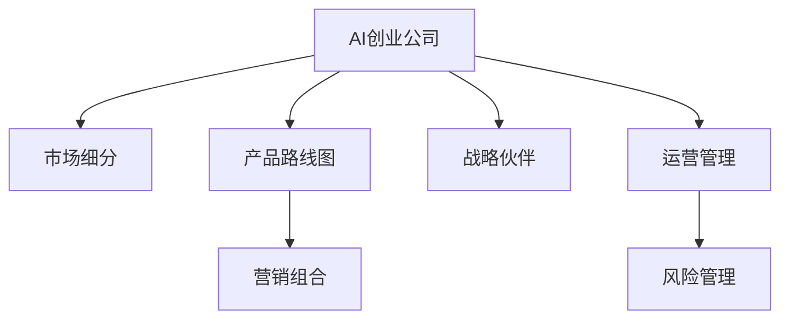

                 

## 1. 背景介绍

### 1.1 问题由来

随着人工智能(AI)技术的快速发展，越来越多的创业公司开始聚焦于AI领域的市场机会，希望通过AI技术提升产品竞争力，拓展市场份额。然而，相比于传统的技术创业，AI创业公司在市场策略上具有一定的特殊性和复杂性。AI技术的复杂性和不确定性要求创业公司在市场定位、产品规划、合作伙伴选择等方面，需要更加谨慎和系统化的策略。

### 1.2 问题核心关键点

AI创业公司市场策略的核心关键点在于如何有效利用AI技术，结合市场环境和自身资源，制定出符合企业发展目标的战略规划。这些关键点包括：

- 市场定位：明确企业的目标市场和目标客户，制定市场细分策略。
- 产品规划：基于市场需求和技术趋势，制定产品路线图和时间表。
- 合作伙伴选择：评估潜在的合作伙伴，选择合适的战略伙伴，形成共赢生态。
- 营销策略：制定切实可行的市场推广计划，提升品牌影响力和市场占有率。
- 运营管理：建立高效的内部管理体系，确保产品开发和市场运营的协调一致。
- 风险管理：识别和评估潜在的市场和产品风险，制定风险应对策略。

这些关键点共同构成AI创业公司的市场策略框架，指导企业在激烈的市场竞争中，做出正确的决策，实现可持续发展。

## 2. 核心概念与联系

### 2.1 核心概念概述

为了更好地理解AI创业公司的市场策略，本节将介绍几个密切相关的核心概念：

- **AI创业公司**：以AI技术为核心竞争力，提供创新产品或服务，致力于市场和商业成功的创业企业。
- **市场细分**：将市场划分为若干子市场，针对不同的子市场制定差异化的市场策略。
- **产品路线图**：根据市场需求和技术趋势，制定产品的研发和迭代计划。
- **战略伙伴**：在特定领域或技术方向上，与其它企业或组织建立合作关系，共同推动技术和市场的进步。
- **营销组合**：包括产品、价格、渠道、促销等营销要素，构成一整套市场推广策略。
- **运营管理**：涉及企业内部资源配置、流程优化、绩效评估等，确保企业的各项活动高效协同。
- **风险管理**：识别、评估和应对企业在市场和产品开发过程中可能面临的风险。

这些核心概念之间的逻辑关系可以通过以下Mermaid流程图来展示：



这个流程图展示了下文所介绍的AI创业公司市场策略的关键环节：

1. 从AI创业公司出发，首先进行市场细分。
2. 基于市场细分，制定产品路线图。
3. 与战略伙伴建立合作关系，形成共赢生态。
4. 制定营销组合，提升品牌影响力和市场占有率。
5. 进行高效运营管理，确保各项活动协同一致。
6. 识别和评估潜在风险，制定风险应对策略。

这些概念共同构成了AI创业公司市场策略的理论基础，有助于指导企业在实际操作中做出科学决策。

## 3. 核心算法原理 & 具体操作步骤

### 3.1 算法原理概述

AI创业公司的市场策略制定涉及多个领域，包括市场营销、产品管理、合作管理等。这些策略制定过程虽然不直接涉及算法，但可以通过一些方法论和策略模型进行辅助分析。以下是几种常用的策略制定方法：

- **PEST分析**：通过分析政治、经济、社会、技术等宏观环境因素，评估市场机会和挑战。
- **SWOT分析**：分析企业自身的优势、劣势、机会、威胁，制定合适的市场策略。
- **市场细分**：基于客户需求、行为、特征等维度，将市场划分为不同的细分市场，提供定制化的产品和服务。
- **产品生命周期管理**：通过不同阶段的产品策略，保持产品竞争力和市场份额。
- **客户关系管理(CRM)**：通过系统化的客户数据管理，提升客户满意度和忠诚度。
- **竞争分析**：分析竞争对手的市场表现、产品优劣势、市场策略等，制定竞争应对策略。
- **数据驱动决策**：通过数据分析和预测，支持市场策略的制定和优化。

### 3.2 算法步骤详解

尽管市场策略的制定不直接涉及算法，但可以通过一些模型和方法来辅助决策分析。以下是几个步骤详解：

1. **PEST分析**：
   - **政治(Political)**：分析政府政策、法律法规、政治稳定性等对市场的影响。
   - **经济(Economic)**：分析宏观经济环境、市场需求、货币政策等。
   - **社会(Social)**：分析社会文化、人口结构、消费者行为等。
   - **技术(Technological)**：分析技术创新、行业趋势、技术成熟度等。

2. **SWOT分析**：
   - **优势(Strengths)**：评估企业的内部资源和能力。
   - **劣势(Weaknesses)**：识别企业的不足之处。
   - **机会(Opportunities)**：寻找市场中的潜在机会。
   - **威胁(Threats)**：分析市场中的潜在风险和竞争压力。

3. **市场细分**：
   - **客户需求**：通过调查问卷、数据分析等方式，了解客户的需求和偏好。
   - **行为特征**：分析客户的购买行为、使用习惯等。
   - **产品分类**：基于产品特性和服务差异，将市场划分为不同的细分市场。
   - **市场定位**：为每个细分市场制定差异化的市场策略。

4. **产品生命周期管理**：
   - **引入期**：通过市场推广和产品优化，建立品牌认知和客户基础。
   - **成长期**：通过扩大市场份额、提升产品性能等手段，扩大市场影响力。
   - **成熟期**：通过产品迭代和市场细分，保持市场份额。
   - **衰退期**：通过产品替代或市场退出，调整战略。

5. **客户关系管理(CRM)**：
   - **客户数据管理**：建立客户数据库，记录客户行为、偏好和反馈。
   - **客户服务**：提供高效的服务响应和支持，提升客户满意度。
   - **客户忠诚度**：通过积分、优惠等方式，增强客户忠诚度。

6. **竞争分析**：
   - **竞争对手分析**：分析竞争对手的市场份额、产品特点、定价策略等。
   - **市场份额变化**：监测市场份额的变化趋势，及时调整市场策略。
   - **竞争优势**：识别和构建企业的竞争优势，提升市场竞争力。

7. **数据驱动决策**：
   - **数据分析**：通过数据收集和分析，支持市场策略的制定和优化。
   - **预测模型**：基于历史数据和市场趋势，预测未来的市场表现和机会。
   - **A/B测试**：通过多版本测试，评估不同市场策略的效果。

### 3.3 算法优缺点

AI创业公司的市场策略制定方法论和模型，具有以下优点：

- **系统性**：通过系统化的分析方法，能够全面评估市场机会和挑战，制定科学的市场策略。
- **客观性**：基于数据和事实的分析和评估，减少主观偏差，提高决策的客观性和科学性。
- **动态性**：通过持续监测市场变化和客户反馈，能够灵活调整和优化市场策略。

同时，这些方法也存在一些缺点：

- **复杂性**：分析和模型制定过程较为复杂，需要多学科知识和技术支持。
- **数据依赖**：依赖于高质量的数据和分析工具，数据缺失或不准确会影响结果。
- **时间成本**：分析和模型制定过程需要时间和资源投入，短期内可能难以见到明显效果。
- **执行难度**：复杂的方法和模型需要专业的团队和技术支持，执行难度较大。

尽管存在这些限制，但系统化和数据驱动的市场策略制定，仍然是AI创业公司获取市场竞争优势的重要手段。

### 3.4 算法应用领域

AI创业公司的市场策略制定方法，在多个领域得到了广泛应用，包括但不限于：

- **电子商务**：通过市场细分和个性化推荐，提升用户体验和购买转化率。
- **金融科技**：通过数据分析和风险管理，提高金融服务的准确性和安全性。
- **医疗健康**：通过智能诊断和客户关系管理，提高医疗服务的质量和效率。
- **智能制造**：通过供应链分析和运营管理，优化生产流程和降低成本。
- **智能交通**：通过智能分析和数据驱动决策，提升交通管理和服务水平。
- **教育培训**：通过个性化学习和数据反馈，提升学习效果和用户体验。

这些领域的应用，展示了市场策略制定方法在AI创业公司中的广泛性和有效性。

## 4. 数学模型和公式 & 详细讲解 & 举例说明

尽管AI创业公司的市场策略制定不涉及数学模型和公式，但可以通过一些数据分析和预测模型来辅助决策。以下是几个常见的数据分析和预测模型：

### 4.1 数学模型构建

- **回归分析**：通过历史数据预测未来趋势，支持市场预测和产品优化。
- **聚类分析**：基于客户数据和行为特征，进行市场细分和个性化营销。
- **时间序列分析**：分析时间序列数据，预测市场变化和趋势。
- **优化模型**：通过优化算法，如线性规划、整数规划等，优化资源配置和市场策略。
- **蒙特卡洛模拟**：通过随机抽样和模拟，评估市场策略的风险和不确定性。

### 4.2 公式推导过程

以回归分析为例，其基本公式如下：

$$
y = \beta_0 + \beta_1 x_1 + \beta_2 x_2 + \epsilon
$$

其中，$y$ 为目标变量，$x_1, x_2$ 为自变量，$\beta_0, \beta_1, \beta_2$ 为回归系数，$\epsilon$ 为误差项。

通过最小二乘法，求解回归系数 $\beta_0, \beta_1, \beta_2$，可得线性回归模型：

$$
\hat{y} = \hat{\beta}_0 + \hat{\beta}_1 x_1 + \hat{\beta}_2 x_2
$$

在实际应用中，可以通过Python的Scikit-Learn库进行回归分析，示例代码如下：

```python
from sklearn.linear_model import LinearRegression
import pandas as pd

# 读取数据
data = pd.read_csv('data.csv')

# 定义目标变量和自变量
y = data['target']
X = data[['feature1', 'feature2']]

# 建立线性回归模型
model = LinearRegression()
model.fit(X, y)

# 预测新数据
new_data = pd.DataFrame({'feature1': [1.2, 3.4], 'feature2': [2.5, 4.8]})
predictions = model.predict(new_data)
print(predictions)
```

### 4.3 案例分析与讲解

假设某AI创业公司提供基于AI的市场预测服务，主要应用于电商行业的库存管理和商品定价。该公司需要根据历史销售数据和市场趋势，预测未来的销售量和价格，以优化库存管理和定价策略。

首先，收集电商平台的销售数据，包括历史销售量、销售价格、促销活动、季节性因素等。通过回归分析模型，建立销售量和价格之间的关系，预测未来的销售趋势和价格变化。

其次，分析市场趋势和竞争环境，包括宏观经济指标、行业趋势、竞争对手的市场表现等。通过时间序列分析模型，预测市场变化趋势，及时调整库存和定价策略。

最后，进行数据驱动的A/B测试，评估不同市场策略的效果。通过优化模型，如线性规划，优化库存分配和促销活动，提升市场竞争力。

## 5. 项目实践：代码实例和详细解释说明

### 5.1 开发环境搭建

在进行市场策略制定实践前，我们需要准备好开发环境。以下是使用Python进行市场策略制定的环境配置流程：

1. 安装Anaconda：从官网下载并安装Anaconda，用于创建独立的Python环境。

2. 创建并激活虚拟环境：
```bash
conda create -n market-env python=3.8 
conda activate market-env
```

3. 安装必要的Python库：
```bash
conda install pandas numpy matplotlib scikit-learn jupyter notebook
```

4. 安装分析工具：
```bash
conda install statsmodels seaborn
```

完成上述步骤后，即可在`market-env`环境中开始市场策略制定实践。

### 5.2 源代码详细实现

下面以电商库存管理为例，给出使用Python进行市场策略制定的代码实现。

首先，导入必要的库和数据：

```python
import pandas as pd
import numpy as np
import matplotlib.pyplot as plt
from statsmodels.tsa.stattools import adfuller

# 读取数据
data = pd.read_csv('sales_data.csv')
```

然后，进行数据预处理和探索性分析：

```python
# 数据清洗
data = data.dropna()

# 探索性分析
data.describe()
data.corr()
```

接着，进行时间序列分析和回归分析：

```python
# 时间序列分析
adfuller(data['sales'])
```

最后，进行回归分析并预测未来销售量：

```python
# 线性回归模型
from sklearn.linear_model import LinearRegression

X = data[['promotion', 'seasonality', 'temperature']]
y = data['sales']

model = LinearRegression()
model.fit(X, y)

# 预测未来销售量
new_data = pd.DataFrame({'promotion': [1, 0], 'seasonality': [1, 0], 'temperature': [25, 30]})
predictions = model.predict(new_data)
print(predictions)
```

### 5.3 代码解读与分析

让我们再详细解读一下关键代码的实现细节：

**数据预处理**：
- `data.dropna()`：删除缺失数据，确保数据完整性。
- `data.describe()`：提供数据的基本统计信息，如均值、中位数、标准差等。
- `data.corr()`：计算数据各特征之间的相关系数，理解特征之间的关系。

**时间序列分析**：
- `adfuller(data['sales'])`：使用ADF检验，检验时间序列是否平稳。

**回归分析**：
- `X = data[['promotion', 'seasonality', 'temperature']]`：选择影响销售量的关键特征。
- `y = data['sales']`：定义目标变量。
- `model = LinearRegression()`：建立线性回归模型。
- `model.fit(X, y)`：训练模型。
- `predictions = model.predict(new_data)`：预测新数据。

以上代码展示了如何进行数据预处理、探索性分析和回归分析，最终得到预测结果。在实际应用中，需要根据具体情况进行调整和优化。

## 6. 实际应用场景

### 6.1 电商市场策略

AI创业公司可以提供基于AI的市场策略咨询服务，帮助电商企业优化库存管理和商品定价。具体应用场景包括：

- **库存管理**：通过预测未来的销售量和库存水平，合理规划库存数量，避免库存积压或缺货。
- **商品定价**：通过分析市场趋势和竞争对手价格，制定最优的商品定价策略，提升销售额和利润率。
- **促销活动**：通过分析促销活动的效果，优化促销策略，提升用户转化率和复购率。

### 6.2 金融市场策略

金融科技公司可以提供基于AI的市场策略咨询服务，帮助金融机构优化投资组合和风险管理。具体应用场景包括：

- **投资组合优化**：通过分析市场趋势和资产价格，优化投资组合，提升投资回报率和风险控制能力。
- **风险管理**：通过分析市场风险和波动性，制定风险管理策略，降低投资风险。
- **交易策略**：通过分析历史交易数据和市场情绪，制定交易策略，提高交易成功率和收益水平。

### 6.3 智能制造市场策略

智能制造公司可以提供基于AI的市场策略咨询服务，帮助制造企业优化生产流程和供应链管理。具体应用场景包括：

- **生产计划优化**：通过分析市场需求和生产能力，优化生产计划，提高生产效率和资源利用率。
- **供应链管理**：通过分析供应链数据和市场变化，优化供应链管理，降低库存成本和运输成本。
- **设备维护**：通过分析设备运行数据和故障历史，制定设备维护策略，提高设备利用率和设备寿命。

### 6.4 未来应用展望

随着AI技术的不断发展和应用，AI创业公司将在更多领域提供基于AI的市场策略咨询服务。以下是几个未来应用展望：

- **医疗市场策略**：通过分析医疗数据和市场趋势，优化医疗资源配置和患者服务，提升医疗服务质量和效率。
- **教育市场策略**：通过分析教育数据和市场变化，优化教育资源配置和教学方法，提升教育效果和学生满意度。
- **智能交通市场策略**：通过分析交通数据和市场变化，优化交通管理和服务，提升交通效率和安全性。
- **环保市场策略**：通过分析环境数据和市场变化，优化环保资源配置和政策制定，提升环境保护效果和可持续发展能力。

## 7. 工具和资源推荐

### 7.1 学习资源推荐

为了帮助AI创业公司系统掌握市场策略的理论基础和实践技巧，这里推荐一些优质的学习资源：

1. **《市场细分与定位》系列课程**：由知名市场营销专家开设的课程，详细讲解市场细分的理论和实践。
2. **《产品管理》书籍**：介绍产品管理的基本概念和实践，帮助企业制定有效的产品路线图。
3. **《数据驱动的决策分析》书籍**：讲解数据分析和预测模型的原理和应用，提升企业的决策能力。
4. **《营销组合》书籍**：介绍营销组合的各个要素，帮助企业制定系统化的市场推广策略。
5. **《运营管理》书籍**：讲解企业运营管理的各个方面，提升企业的运营效率和资源利用率。
6. **《风险管理》书籍**：介绍风险管理的理论和实践，帮助企业识别和应对潜在风险。

通过学习这些资源，相信你一定能够系统掌握AI创业公司的市场策略，并在实际操作中取得更好的效果。

### 7.2 开发工具推荐

高效的开发离不开优秀的工具支持。以下是几款用于市场策略制定开发的常用工具：

1. **Jupyter Notebook**：基于Web的交互式编程环境，支持Python、R等语言，便于数据探索和分析。
2. **Tableau**：数据可视化工具，支持多种数据源和图表类型，方便数据展示和分析。
3. **Power BI**：微软推出的商业智能工具，支持数据连接、可视化分析和报告生成，适用于企业决策支持。
4. **Excel**：电子表格软件，支持数据分析、图表生成和数据可视化，适用于基础的数据分析和处理。
5. **Google Analytics**：网站分析工具，提供详细的流量和转化数据，帮助企业优化网站运营。
6. **SurveyMonkey**：在线问卷调查工具，支持大规模问卷设计和数据收集，方便客户需求分析。

合理利用这些工具，可以显著提升市场策略制定的开发效率，加快创新迭代的步伐。

### 7.3 相关论文推荐

市场策略制定的研究涉及多个领域，以下是几篇奠基性的相关论文，推荐阅读：

1. **《市场细分与定位：理论与实践》**：详细讲解市场细分和定位的原理和应用，提供系统化的市场策略制定方法。
2. **《数据驱动的决策分析》**：介绍数据分析和预测模型的原理和应用，支持企业基于数据做出科学决策。
3. **《营销组合策略》**：介绍营销组合的各个要素，帮助企业制定系统化的市场推广策略。
4. **《运营管理理论与实践》**：讲解企业运营管理的各个方面，提升企业的运营效率和资源利用率。
5. **《风险管理：理论与实践》**：介绍风险管理的理论和实践，帮助企业识别和应对潜在风险。

这些论文代表了大市场策略制定的发展脉络，通过学习这些前沿成果，可以帮助企业更好地把握市场策略的制定方向，优化市场表现。

## 8. 总结：未来发展趋势与挑战

### 8.1 总结

本文对AI创业公司的市场策略进行了全面系统的介绍。首先阐述了AI创业公司的市场策略研究背景和意义，明确了市场策略在企业发展中的重要地位。其次，从原理到实践，详细讲解了市场策略的各个环节，包括市场细分、产品规划、合作伙伴选择、营销策略、运营管理和风险管理等。同时，本文还广泛探讨了市场策略在电商、金融、智能制造等诸多领域的应用前景，展示了市场策略的巨大潜力。

通过本文的系统梳理，可以看到，AI创业公司的市场策略制定，是一个系统化的、数据驱动的过程，需要从多个维度进行全面考虑和优化。只有通过科学的市场策略制定，AI创业公司才能在激烈的市场竞争中占据有利地位，实现可持续发展。

### 8.2 未来发展趋势

展望未来，AI创业公司的市场策略制定将呈现以下几个发展趋势：

1. **数据驱动决策**：随着大数据和人工智能技术的发展，市场策略制定将更加依赖于数据驱动的决策分析。
2. **个性化市场策略**：通过深度学习和数据挖掘技术，实现客户需求和偏好的个性化分析，制定更加精准的市场策略。
3. **动态市场策略**：市场环境瞬息万变，AI创业公司需要具备灵活的策略调整能力，根据市场变化及时优化市场策略。
4. **多渠道整合**：通过多渠道的数据整合和分析，实现全渠道的市场策略制定，提升市场覆盖率和客户满意度。
5. **人工智能应用**：AI技术将在市场策略制定中扮演越来越重要的角色，提供更加智能化的分析工具和策略模型。
6. **全球化市场策略**：随着全球化的深入发展，AI创业公司需要具备全球化视角，制定符合国际市场特点的市场策略。

以上趋势凸显了AI创业公司市场策略制定的广阔前景。这些方向的探索发展，必将进一步提升市场策略的科学性和有效性，助力企业在全球市场中占据一席之地。

### 8.3 面临的挑战

尽管市场策略制定方法在AI创业公司中得到了广泛应用，但在迈向更加智能化、系统化的过程中，仍面临诸多挑战：

1. **数据质量问题**：数据质量差、不完整或不准确，会影响市场策略的制定和执行效果。
2. **市场环境复杂**：市场环境瞬息万变，单一策略难以适应多种市场变化。
3. **技术门槛高**：市场策略制定涉及多学科知识，需要跨领域的人才和技术支持。
4. **执行难度大**：市场策略需要跨部门协作，执行过程中可能遇到沟通和协调问题。
5. **效果评估难**：市场策略的效果评估标准不统一，难以客观衡量市场策略的实施效果。

正视市场策略制定面临的这些挑战，积极应对并寻求突破，将使AI创业公司市场策略制定更加科学和高效。

### 8.4 研究展望

面对市场策略制定的诸多挑战，未来的研究需要在以下几个方面寻求新的突破：

1. **数据质量提升**：通过数据清洗、数据增强等技术手段，提升数据的完整性和准确性。
2. **多渠道数据整合**：实现多渠道数据的整合和统一分析，提供更加全面的市场信息。
3. **跨领域知识融合**：通过跨学科知识融合，提升市场策略制定的科学性和可行性。
4. **动态策略优化**：通过机器学习和深度学习技术，实现动态策略的优化和调整。
5. **效果评估指标**：制定统一的、可量化的市场策略效果评估指标，提升市场策略的可衡量性和可执行性。

这些研究方向的探索，必将引领AI创业公司市场策略制定走向更高的台阶，为企业的市场竞争力提供坚实的基础。面向未来，AI创业公司需要持续创新和优化市场策略，方能在激烈的市场竞争中取得长足发展。

## 9. 附录：常见问题与解答

**Q1：如何评估市场策略的效果？**

A: 市场策略效果的评估可以从多个维度进行，包括：

1. **销售额和市场份额**：通过比较策略实施前后的销售额和市场份额变化，评估市场策略的直接效果。
2. **客户满意度和忠诚度**：通过客户反馈和调查问卷，评估客户对策略的满意度和忠诚度。
3. **成本和效率**：通过分析成本变化和效率提升情况，评估策略对企业运营的影响。
4. **竞争力提升**：通过比较策略实施前后的市场竞争力和市场地位变化，评估策略的间接效果。

以上指标可以通过定量或定性方式进行评估，帮助企业全面了解市场策略的效果。

**Q2：如何选择合作伙伴？**

A: 选择合作伙伴需要考虑多个因素，包括：

1. **业务互补性**：选择与自身业务具有高度互补性的合作伙伴，实现共赢。
2. **市场影响力和品牌效应**：选择具有市场影响力和品牌效应的合作伙伴，提升自身品牌知名度。
3. **资源和能力**：选择具有丰富资源和强大能力的合作伙伴，提升自身资源和能力。
4. **文化和价值观**：选择具有相似文化和价值观的合作伙伴，确保合作的顺利进行。
5. **合作意愿和承诺**：选择具有强烈合作意愿和承诺的合作伙伴，确保合作的持久性和稳定性。

通过综合考虑这些因素，选择最合适的合作伙伴，可以提升市场策略的实施效果。

**Q3：如何应对市场策略中的风险？**

A: 应对市场策略中的风险，可以从以下几个方面进行：

1. **风险评估**：通过系统化的风险评估，识别和评估潜在风险，制定相应的应对措施。
2. **应急预案**：制定应急预案，一旦风险发生，能够迅速采取行动，降低损失。
3. **多样化策略**：通过制定多样化的市场策略，降低单一策略的风险。
4. **持续监测**：通过持续监测市场变化和策略执行效果，及时调整策略，降低风险。
5. **专业团队**：建立专业的风险管理团队，确保风险管理的专业性和有效性。

这些方法可以帮助企业应对市场策略中的风险，确保市场策略的顺利实施。

---

作者：禅与计算机程序设计艺术 / Zen and the Art of Computer Programming

