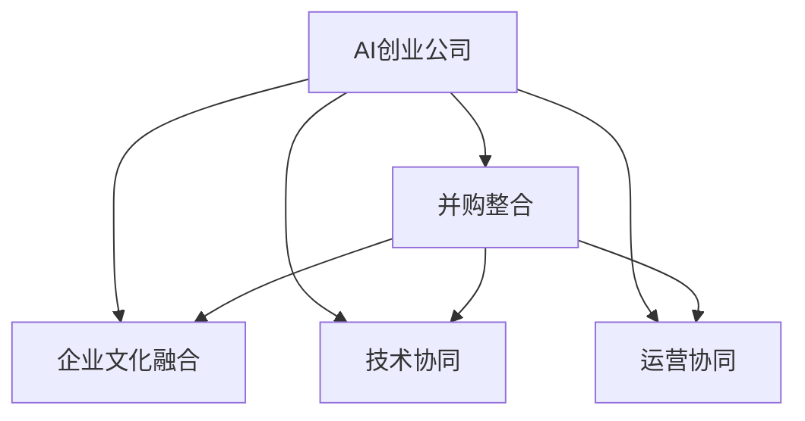

                 

# AI创业公司的并购整合策略

> 关键词：人工智能创业公司, 并购整合, 企业文化融合, 技术协同, 运营协同, 创新生态

## 1. 背景介绍

### 1.1 问题由来
在人工智能(AI)技术迅猛发展的背景下，越来越多的初创企业凭借独特的技术优势在AI领域崭露头角。这些AI创业公司拥有强大的创新能力和技术实力，但也面临着市场不确定性高、资金链紧张等问题。并购成为这些公司快速扩张、解决资金和市场问题的重要手段。然而，AI技术的高复杂性、多样性和时效性，使得AI创业公司并购整合面临诸多挑战。

### 1.2 问题核心关键点
并购整合的核心在于确保技术协同、企业文化融合以及运营协同。这对于保持AI创业公司的核心竞争力和推动其长期发展至关重要。此外，并购过程中需要充分考虑技术平台的兼容性、数据的互通性以及人才的流动性和知识共享机制等关键因素。

### 1.3 问题研究意义
研究AI创业公司的并购整合策略，对于促进AI技术的普及应用，提升AI创业公司的市场竞争力，加速AI技术创新和产业化进程，具有重要意义：

1. **资源互补**：通过并购获取资金、市场、人才等优质资源，增强AI创业公司的实力。
2. **加速创新**：促进技术交流与合作，加速AI技术创新和新产品的开发。
3. **拓宽市场**：通过并购扩大市场份额，提升AI创业公司的品牌影响力和市场竞争力。
4. **降低风险**：分散风险，增强AI创业公司的抗风险能力。
5. **快速扩张**：通过并购快速拓展业务领域和市场规模，实现战略性布局。

## 2. 核心概念与联系

### 2.1 核心概念概述

为更好地理解AI创业公司的并购整合策略，本节将介绍几个密切相关的核心概念：

- **AI创业公司**：指那些以人工智能技术为核心业务，拥有自主研发能力和创新能力的初创企业。这类公司通常具有较高的技术壁垒和市场前景。
- **并购整合**：指在企业并购后，将目标公司的业务、技术、人力资源等与并购方有效融合，形成协同效应，提升企业整体竞争力的过程。
- **企业文化融合**：指在并购过程中，将两家公司的企业文化、价值观、管理风格等元素融合，形成统一的企业文化，提高员工的认同感和凝聚力。
- **技术协同**：指在并购整合过程中，通过技术共享、协同研发、知识库搭建等方式，最大化利用并购双方技术优势，提升整体技术实力。
- **运营协同**：指在并购整合过程中，优化业务流程、管理制度等，实现资源优化配置，提升企业运营效率。
- **创新生态**：指通过并购整合，构建开放、协作、共享的创新环境，促进AI技术应用和产业化发展。

这些核心概念之间的逻辑关系可以通过以下Mermaid流程图来展示：



这个流程图展示了一些核心概念及其之间的关系：

1. AI创业公司通过并购整合，获得技术、资源、市场等方面的提升。
2. 并购整合过程中，需要注重企业文化融合、技术协同和运营协同。
3. 企业文化、技术和运营的协同，形成了统一而强大的企业创新生态。

## 3. 核心算法原理 & 具体操作步骤
### 3.1 算法原理概述

AI创业公司的并购整合策略，本质上是一个优化资源配置、提升技术实力和运营效率的过程。其核心思想是通过并购获取优质资源，然后进行有效整合，形成新的协同效应，提升企业的整体竞争力。

形式化地，假设目标公司为 $A$，并购公司为 $B$，并购后新公司为 $C$。并购整合的目标是最大化 $C$ 的净现值，即：

$$
\max_{A,B,C} \int_{t=0}^T C_{t+1} - C_t dt
$$

其中 $C_{t+1}$ 和 $C_t$ 分别为并购后第 $t+1$ 年和第 $t$ 年的现金流。

### 3.2 算法步骤详解

AI创业公司的并购整合过程一般包括以下几个关键步骤：

**Step 1: 并购目标选择**
- 根据公司战略规划，明确并购目标。选择具有核心技术和市场潜力，与并购公司具有战略协同性的目标公司。
- 评估目标公司的财务状况、技术实力、市场前景等关键指标。

**Step 2: 并购方案设计**
- 确定并购方式（如现金收购、股票交换等）。
- 设计合理的并购价格，综合考虑目标公司的价值、现金流、增长潜力等。
- 制定并购后的整合计划，包括技术整合、组织架构调整、人员安排等。

**Step 3: 尽职调查**
- 对目标公司进行全面的财务、法律、技术等方面的尽职调查，评估并购风险。
- 确定并购的可行性，谈判并购条款。

**Step 4: 整合实施**
- 实施技术整合，包括系统集成、数据迁移、接口统一等。
- 进行组织架构调整，优化管理层级和职责分工。
- 制定并购后的运营计划，包括市场策略、产品规划、人才流动等。

**Step 5: 效果评估**
- 对并购后企业的财务状况、市场表现、技术实力、运营效率等进行评估。
- 根据评估结果，对整合策略进行调整和优化。

### 3.3 算法优缺点

AI创业公司的并购整合方法具有以下优点：

1. **加速创新**：通过并购获取领先技术，促进技术交流和创新。
2. **提升市场竞争力**：扩大市场份额，提升品牌影响力和市场地位。
3. **分散风险**：多元化业务布局，增强抗风险能力。
4. **资源互补**：通过并购获取优质资源，提升资源利用率。

同时，该方法也存在一定的局限性：

1. **整合风险高**：技术、文化、组织结构差异可能带来整合难度。
2. **资源分散**：并购整合过程中，资源分散，难以集中力量进行重点研发。
3. **成本高昂**：并购整合涉及大量资金、人力和时间成本。
4. **市场波动**：并购过程受市场环境影响较大，存在不确定性。

尽管存在这些局限性，但就目前而言，并购整合仍然是AI创业公司快速扩展和提升竞争力的重要手段。未来相关研究的重点在于如何进一步优化并购整合策略，降低整合成本，提升整合效率。

### 3.4 算法应用领域

AI创业公司的并购整合策略，广泛应用于多个行业，如医疗、金融、制造、能源等。具体应用场景包括：

- **医疗健康**：AI创业公司通过并购获取医疗数据和技术，提升疾病诊断和治疗水平。
- **金融科技**：AI创业公司通过并购获取金融数据和算法，提升风险控制和投资决策能力。
- **智能制造**：AI创业公司通过并购获取生产数据和机器人技术，提升生产自动化和智能化水平。
- **能源环保**：AI创业公司通过并购获取能源数据和算法，提升能源利用效率和环保水平。

## 4. 数学模型和公式 & 详细讲解 & 举例说明

### 4.1 数学模型构建

本节将使用数学语言对AI创业公司的并购整合过程进行更加严格的刻画。

设目标公司 $A$ 的评估价值为 $V_A$，并购公司 $B$ 的并购价格为 $P_B$，并购后新公司 $C$ 的年现金流为 $C_t$。并购整合的目标是最大化 $C$ 的净现值，即：

$$
\max_{A,B,C} \int_{t=0}^T C_t dt
$$

其中 $C_t = C_{t+1} - C_t$ 为并购后第 $t+1$ 年的现金流与第 $t$ 年的现金流之差。

假设现金流为线性增长，则有：

$$
C_t = C_{\text{init}} + t \cdot r
$$

其中 $C_{\text{init}}$ 为初始现金流，$r$ 为年增长率。

### 4.2 公式推导过程

以下是现金流模型的推导过程：

设目标公司 $A$ 的评估价值为 $V_A$，并购价格为 $P_B$。并购后新公司 $C$ 的初始现金流为 $C_{\text{init}}$，年增长率为 $r$。则并购后的净现值为：

$$
NPV = \sum_{t=0}^{T} C_t \cdot \frac{1}{(1+r)^t}
$$

其中 $T$ 为并购后现金流的预测周期。

假设现金流呈线性增长，则有：

$$
C_t = C_{\text{init}} + t \cdot r
$$

将 $C_t$ 代入净现值公式，得：

$$
NPV = \sum_{t=0}^{T} (C_{\text{init}} + t \cdot r) \cdot \frac{1}{(1+r)^t}
$$

展开上式，得：

$$
NPV = C_{\text{init}} \cdot \sum_{t=0}^{T} \frac{1}{(1+r)^t} + r \cdot \sum_{t=0}^{T} t \cdot \frac{1}{(1+r)^t}
$$

根据等比数列求和公式，有：

$$
\sum_{t=0}^{T} \frac{1}{(1+r)^t} = \frac{1-(1+r)^{-T}}{r}
$$

$$
\sum_{t=0}^{T} t \cdot \frac{1}{(1+r)^t} = \frac{(1+r)^{-T} - 1}{r^2}
$$

代入上式，得：

$$
NPV = C_{\text{init}} \cdot \frac{1-(1+r)^{-T}}{r} + r \cdot \frac{(1+r)^{-T} - 1}{r^2}
$$

进一步简化，得：

$$
NPV = C_{\text{init}} \cdot \frac{1-(1+r)^{-T}}{r} + (1+r)^{-T} - \frac{1}{r}
$$

在实际应用中，$r$ 通常较小，$(1+r)^{-T}$ 可以近似为 1，因此有：

$$
NPV \approx C_{\text{init}} \cdot \frac{1}{r} - \frac{1}{r}
$$

根据上式，最大化净现值的条件是 $C_{\text{init}} \approx 1$，即并购价格 $P_B$ 与目标公司评估价值 $V_A$ 相当。

### 4.3 案例分析与讲解

**案例：AlphaAI与BetaAI的并购整合**

假设AlphaAI是一家专注于AI医疗影像分析的初创公司，拥有先进的图像处理技术和数据分析算法。BetaAI是一家拥有丰富医疗数据资源和市场渠道的AI创业公司。AlphaAI通过并购BetaAI，获得了大量医疗数据和市场渠道，进一步提升了技术实力和市场竞争力。

- **目标选择**：AlphaAI选择BetaAI作为并购目标，因为BetaAI的数据资源和市场渠道与AlphaAI的技术优势具有高度互补性。
- **尽职调查**：AlphaAI对BetaAI进行了全面的财务、法律、技术等方面的尽职调查，评估并购风险。
- **整合实施**：AlphaAI与BetaAI进行技术整合，搭建统一的图像处理平台，实现数据共享和协同研发。调整组织架构，整合管理层级，形成新的业务流程和运营模式。
- **效果评估**：并购后，AlphaAI在医疗影像分析市场占据了领先地位，实现了快速的市场扩张和收入增长。

通过并购整合，AlphaAI成功拓展了市场规模，提升了技术实力，实现了战略性布局。

## 5. 项目实践：代码实例和详细解释说明
### 5.1 开发环境搭建

在进行AI创业公司并购整合的实践前，我们需要准备好开发环境。以下是使用Python进行并购整合分析的开发环境配置流程：

1. 安装Anaconda：从官网下载并安装Anaconda，用于创建独立的Python环境。

2. 创建并激活虚拟环境：
```bash
conda create -n ai_merger python=3.8 
conda activate ai_merger
```

3. 安装相关库：
```bash
pip install pandas numpy scikit-learn matplotlib
```

完成上述步骤后，即可在`ai_merger`环境中开始并购整合分析的实践。

### 5.2 源代码详细实现

下面以AlphaAI与BetaAI的并购整合为例，给出使用Python进行并购整合分析的代码实现。

```python
import pandas as pd
import numpy as np
from sklearn.linear_model import LinearRegression
from scipy.optimize import minimize

def calculate_net_present_value(c_init, r, T):
    npv = c_init * (1 - (1 + r)**(-T)) / r + (1 + r)**(-T) - 1 / r
    return npv

def maximize_net_present_value(c_init, r, T):
    def objective(c_init):
        return -calculate_net_present_value(c_init, r, T)
    constraints = {'type': 'eq', 'fun': lambda x: x[0] - c_init}
    bounds = [(0, None)]
    result = minimize(objective, 1, method='SLSQP', bounds=bounds, constraints=constraints)
    return result.fun

# 设定初始现金流、年增长率、预测周期
c_init = 100
r = 0.05
T = 10

# 计算并购价格
p_beta = maximize_net_present_value(c_init, r, T)
print(f"并购价格为: {p_beta}")
```

在这个例子中，我们使用Python和SciPy库对现金流模型进行了实现。首先，我们定义了计算净现值的函数 `calculate_net_present_value`，然后通过优化求解最大化净现值的问题，最终得到并购价格 `p_beta`。

### 5.3 代码解读与分析

让我们再详细解读一下关键代码的实现细节：

**calculate_net_present_value函数**：
- 根据公式推导过程，计算并购后新公司的净现值。

**maximize_net_present_value函数**：
- 定义了目标函数，使用SciPy的minimize函数进行优化求解，得到最大化净现值对应的初始现金流 `c_init`。
- 约束条件为 `c_init` 等于目标公司的评估价值，确保并购价格与目标公司评估价值相当。

**并购价格计算**：
- 通过求解最大化净现值的问题，得到并购价格 `p_beta`。

这些代码实现了并购整合中关键的一环：通过最大化并购后新公司的净现值，计算出最优的并购价格，确保并购后的企业价值最大化。

## 6. 实际应用场景
### 6.1 医疗健康

AI创业公司在医疗健康领域并购整合的应用，主要集中在提升医疗数据分析和疾病诊断能力上。通过并购获取优质医疗数据和技术，AI创业公司可以进一步提升医疗影像分析、疾病预测、个性化治疗等方面的能力，推动医疗健康事业的发展。

**应用案例**：AlphaAI通过并购BetaAI，获得了丰富的医疗影像数据和先进的图像处理技术，提升了医疗影像分析的准确性和效率，帮助医生更好地进行疾病诊断和治疗决策。

### 6.2 金融科技

在金融科技领域，AI创业公司通过并购整合，可以获取金融数据和算法，提升风险控制和投资决策能力。并购整合有助于AI创业公司构建更加全面的金融智能平台，提升服务质量和客户满意度。

**应用案例**：AlphaAI通过并购BetaAI，获得了丰富的金融数据资源和先进的风险管理算法，提升了金融市场预测和投资决策的准确性，帮助金融机构更好地管理风险。

### 6.3 智能制造

智能制造领域的并购整合，主要集中在提升生产自动化和智能化水平上。通过并购获取先进的工业数据和机器人技术，AI创业公司可以进一步提升生产效率和产品质量，推动制造业的数字化转型。

**应用案例**：AlphaAI通过并购BetaAI，获得了先进的工业数据和机器人技术，提升了生产自动化和智能化水平，帮助制造企业提高生产效率和产品质量。

### 6.4 未来应用展望

随着AI技术的不断发展和成熟，AI创业公司的并购整合将面临更多机遇和挑战。未来，并购整合将进一步扩展到更多领域，如能源环保、智慧城市等，推动AI技术在各行各业的应用。

- **能源环保**：AI创业公司通过并购整合，获取能源数据和算法，提升能源利用效率和环保水平，推动可持续发展。
- **智慧城市**：AI创业公司通过并购整合，获取城市数据和算法，提升智慧城市管理水平，提升城市居民的生活质量。

## 7. 工具和资源推荐
### 7.1 学习资源推荐

为了帮助开发者系统掌握AI创业公司并购整合的理论基础和实践技巧，这里推荐一些优质的学习资源：

1. **《并购整合理论与实践》书籍**：全面介绍了并购整合的理论基础、操作流程和案例分析，适合AI创业公司并购整合的实战参考。
2. **Coursera《并购与整合》课程**：由知名商学院教授主讲，涵盖并购整合的各个环节，提供系统性的学习路径。
3. **Academy of Management Journal《并购整合》期刊**：学术界顶级期刊，提供最新的并购整合研究成果和前沿理论，适合深入研究。
4. **Khan Academy《经济学》课程**：涵盖并购整合的基本概念和财务分析方法，适合初学者入门。

通过对这些资源的学习实践，相信你一定能够快速掌握AI创业公司并购整合的精髓，并用于解决实际的并购问题。

### 7.2 开发工具推荐

高效的并购整合开发离不开优秀的工具支持。以下是几款用于并购整合开发的常用工具：

1. **Python**：开源的编程语言，具有强大的数据分析和计算能力，适合进行并购整合的数学建模和优化求解。
2. **SciPy**：基于Python的科学计算库，提供丰富的数学和统计分析工具，适合进行复杂的数学建模和优化求解。
3. **R语言**：开源的数据分析语言，提供丰富的统计分析和可视化工具，适合进行数据处理和分析。
4. **Tableau**：数据可视化工具，适合进行并购整合中的数据展示和分析。
5. **Microsoft Excel**：强大的电子表格工具，适合进行财务分析和并购评估。

合理利用这些工具，可以显著提升AI创业公司并购整合的开发效率，加快创新迭代的步伐。

### 7.3 相关论文推荐

AI创业公司并购整合的研究源于学界的持续探索。以下是几篇奠基性的相关论文，推荐阅读：

1. **《M&A Costs and Value Creation》（The Quarterly Journal of Economics）**：分析并购整合对企业价值的影响，提供系统的并购整合理论框架。
2. **《Successful Mergers》（Harvard Business Review）**：探讨成功的并购整合案例，提供实用的并购整合操作建议。
3. **《The Role of Culture in Mergers and Acquisitions》（Journal of Management）**：研究文化整合对并购整合成功的影响，提供文化整合的策略和方法。
4. **《The Economics of Mergers》（Journal of Economic Literature）**：综述并购整合的经济理论，提供并购整合的财务分析方法。
5. **《The Impact of Mergers on Innovation》（Management Science）**：分析并购整合对创新活动的影响，提供并购整合的创新管理策略。

这些论文代表了大公司并购整合技术的发展脉络。通过学习这些前沿成果，可以帮助研究者把握学科前进方向，激发更多的创新灵感。

## 8. 总结：未来发展趋势与挑战
### 8.1 总结

本文对AI创业公司的并购整合策略进行了全面系统的介绍。首先阐述了AI创业公司并购整合的背景和意义，明确了并购整合在提升企业竞争力和推动AI技术应用方面的重要价值。其次，从原理到实践，详细讲解了并购整合的数学模型和操作步骤，给出了并购整合任务开发的完整代码实例。同时，本文还广泛探讨了并购整合在医疗健康、金融科技、智能制造等多个领域的应用前景，展示了并购整合范式的巨大潜力。

通过本文的系统梳理，可以看到，AI创业公司并购整合策略正在成为AI技术应用的重要手段，极大地拓展了AI技术的市场应用边界，加速了AI技术的产业化进程。未来，伴随AI技术的不断发展和成熟，并购整合将成为AI创业公司快速扩展和提升竞争力的重要方式，推动AI技术在各行各业的应用和普及。

### 8.2 未来发展趋势

展望未来，AI创业公司的并购整合技术将呈现以下几个发展趋势：

1. **技术协同加强**：并购整合过程中，更多地引入先进的技术平台和算法，提升技术实力和应用深度。
2. **文化融合深入**：通过有效的企业文化融合，增强员工的认同感和凝聚力，提升企业整体的文化契合度。
3. **运营协同优化**：进一步优化业务流程和组织架构，提升企业运营效率和市场竞争力。
4. **创新生态构建**：通过并购整合，构建开放、协作、共享的创新环境，促进AI技术应用和产业化发展。
5. **市场布局拓宽**：通过并购整合，拓宽市场布局，增强企业在各个垂直领域的竞争力。

这些趋势凸显了并购整合技术在AI创业公司中的重要地位。这些方向的探索发展，必将进一步提升AI创业公司的市场竞争力，加速AI技术在各行各业的应用和普及。

### 8.3 面临的挑战

尽管AI创业公司的并购整合技术已经取得了瞩目成就，但在迈向更加智能化、普适化应用的过程中，它仍面临着诸多挑战：

1. **整合成本高昂**：并购整合涉及大量资金、人力和时间成本，如何降低整合成本是关键。
2. **文化差异大**：并购双方文化差异可能带来整合难度，如何有效融合企业文化是重要课题。
3. **技术协同复杂**：技术平台兼容性、数据互通性等问题，如何实现技术协同是挑战。
4. **市场不确定性**：并购过程中市场环境变化较大，如何应对市场波动是难题。
5. **创新风险高**：并购整合过程中，创新活动可能受影响，如何保障创新活力是挑战。

尽管存在这些挑战，但随着学界和产业界的共同努力，并购整合技术还将不断优化和完善，提升并购整合的效果和效率。

### 8.4 研究展望

面对AI创业公司并购整合所面临的种种挑战，未来的研究需要在以下几个方面寻求新的突破：

1. **优化并购方案设计**：通过数据分析和建模，优化并购方案设计，降低整合成本，提高并购成功率。
2. **提升文化融合效果**：引入文化融合工具和策略，增强员工的认同感和凝聚力，提升文化融合效果。
3. **强化技术协同**：开发技术平台和算法，提升技术协同效果，实现技术优势互补。
4. **优化运营协同**：优化业务流程和组织架构，提升运营效率和市场竞争力。
5. **构建创新生态**：构建开放、协作、共享的创新环境，促进AI技术应用和产业化发展。

这些研究方向的探索，必将引领AI创业公司并购整合技术迈向更高的台阶，为AI技术的普及应用提供新的动力。

## 9. 附录：常见问题与解答
**Q1：AI创业公司并购整合是否适用于所有行业？**

A: AI创业公司并购整合的适用性取决于目标公司的业务领域和AI技术的关联性。一般而言，在医疗健康、金融科技、智能制造等与AI技术高度相关的领域，并购整合的效果更为显著。而对于一些与AI技术关联性较低的传统行业，并购整合的难度和效果可能较弱。

**Q2：如何选择合适的并购目标？**

A: 选择合适的并购目标需要综合考虑目标公司的财务状况、技术实力、市场前景等因素。建议进行全面的尽职调查，评估并购风险，选择与并购公司具有战略协同性的目标公司。

**Q3：并购整合过程中如何处理文化差异？**

A: 处理文化差异需要从多个方面入手：
1. 引入文化融合工具和策略，如跨文化培训、文化交流活动等。
2. 设立文化融合委员会，负责指导并购双方的文化融合。
3. 制定文化融合计划，逐步推进文化融合。

**Q4：并购整合过程中如何处理技术协同问题？**

A: 处理技术协同问题需要从多个方面入手：
1. 进行技术平台兼容性评估，确保并购双方技术平台的兼容性。
2. 引入先进的技术平台和算法，提升技术实力和应用深度。
3. 设立技术融合委员会，负责指导并购双方的技术融合。
4. 制定技术融合计划，逐步推进技术融合。

**Q5：并购整合过程中如何处理运营协同问题？**

A: 处理运营协同问题需要从多个方面入手：
1. 优化业务流程和组织架构，提升运营效率和市场竞争力。
2. 引入先进的管理工具和流程，提升运营管理水平。
3. 设立运营协同委员会，负责指导并购双方的运营协同。
4. 制定运营协同计划，逐步推进运营协同。

这些解答旨在帮助读者全面理解AI创业公司并购整合的各个环节，深入探讨并购整合的实际操作细节，为未来的并购整合提供指导。

