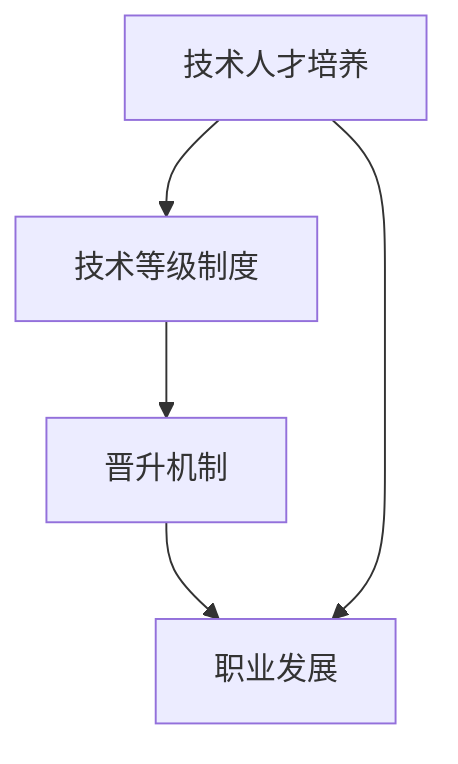

                 

# AI创业公司的技术人才培养与晋升通道：技术等级、晋升机制与职业发展

## 1. 背景介绍

在AI创业公司的快速成长过程中，如何构建高效的技术人才培养与晋升通道，对于保持公司的创新力和竞争力至关重要。本文将深入探讨AI创业公司的技术人才培养机制，并详细设计晋升通道和职业发展规划，以助力公司持续发展。

## 2. 核心概念与联系

### 2.1 核心概念概述

在讨论技术人才培养与晋升通道之前，首先需要明确一些核心概念：

- **技术人才培养**：是指通过系统的教育和实践活动，提升团队成员的专业技能和综合素质，使其能够胜任更高难度的工作任务。

- **晋升机制**：是指根据个人能力、业绩和表现，通过一定的评估标准和流程，将员工从较低岗位晋升到更高岗位的制度安排。

- **职业发展**：涉及员工的职业规划、目标设定、技能提升、岗位调整等，旨在帮助员工实现个人职业成长，同时推动公司整体发展。

- **技术等级制度**：是按照技术能力的高低设立的不同级别，每个级别对应着不同的职责、权限和薪酬标准。

这些概念之间相互关联，共同构成了AI创业公司技术人才的管理体系。

### 2.2 核心概念原理和架构的 Mermaid 流程图



该流程图展示了技术人才培养与晋升通道的基本流程：
- 技术人才培养是晋升机制的基础，通过提升技术能力，员工才能有机会获得晋升。
- 晋升机制根据技术等级，决定员工的职业晋升路径。
- 职业发展为员工提供多样化的职业选择和成长机会，丰富其职业体验。

## 3. 核心算法原理 & 具体操作步骤

### 3.1 算法原理概述

AI创业公司技术人才培养与晋升通道的构建，涉及算法原理、操作步骤和具体实施细节。该体系主要包括以下几个核心环节：

1. **技术能力评估**：通过设定明确的评估标准，对员工的技术能力进行量化评估，从而确定其技术等级。
2. **晋升评估**：定期评估员工的技术等级，并根据其表现进行晋升决策。
3. **职业发展规划**：根据员工的职业目标和公司的需求，制定个性化的职业发展路径。
4. **技能培训**：针对不同技术等级，提供相应的技能培训，确保员工能够胜任更高职责。
5. **激励与奖励**：通过物质奖励和精神激励，鼓励员工持续提升技术能力。

### 3.2 算法步骤详解

#### 3.2.1 技术能力评估

1. **设定评估标准**：根据不同技术岗位的职责，设定技能、知识、项目经验和创新能力等方面的评估标准。
2. **定期评估**：通过季度或年度评估，全面衡量员工的技术能力，确定其技术等级。
3. **评估方法**：采用自评、同事评议、上级考核和项目评审等多种方法，确保评估结果的客观性和全面性。

#### 3.2.2 晋升评估

1. **定期评估**：根据技术能力评估结果，定期评估员工是否具备晋升条件。
2. **晋升标准**：设定明确的晋升标准，如项目成功完成次数、创新成果数量、技术论文发表情况等。
3. **晋升流程**：包括申请、初审、复审和审批等环节，确保晋升过程的公正性和透明性。

#### 3.2.3 职业发展规划

1. **设定职业目标**：与员工共同设定中短期和长期职业目标，并制定具体的职业发展计划。
2. **职业路径设计**：根据不同技术等级，设计多样化的职业发展路径，如技术专家、项目经理、技术总监等。
3. **职业辅导与支持**：提供个性化的职业辅导，包括导师制、职业咨询、内部培训等，帮助员工实现职业目标。

#### 3.2.4 技能培训

1. **技能评估**：评估员工当前技能水平与目标技能之间的差距。
2. **定制培训计划**：根据差距，制定个性化的培训计划，包括线上课程、内训和外部培训等。
3. **跟踪评估**：定期评估培训效果，确保员工能够有效掌握新技能。

#### 3.2.5 激励与奖励

1. **薪酬体系**：建立与技术等级挂钩的薪酬体系，根据不同等级提供相应的薪酬待遇。
2. **晋升激励**：设定晋升激励政策，鼓励员工通过技术提升实现职业晋升。
3. **精神激励**：通过表彰奖励、荣誉称号等方式，增强员工的工作动力和归属感。

### 3.3 算法优缺点

#### 3.3.1 优点

- **系统化管理**：通过设定明确的评估标准和晋升流程，使技术人才的培养和晋升管理更加规范化和系统化。
- **公平透明**：通过多维度的评估方法，确保技术能力评估和晋升决策的公平性和透明性。
- **职业发展多样化**：提供多样化的职业路径和成长机会，丰富员工职业体验，促进个人和公司共同发展。
- **激励机制完善**：通过薪酬、晋升和精神激励等多种手段，激发员工的技术创新和职业成长。

#### 3.3.2 缺点

- **实施成本高**：系统化管理需要大量的资源投入，包括人力、时间和资金。
- **评估复杂**：技术能力评估和晋升决策涉及多方面因素，评估过程复杂且耗时。
- **灵活性不足**：统一的技术等级和晋升标准可能难以适应个体差异和特殊需求。

### 3.4 算法应用领域

该技术等级和晋升机制不仅适用于AI创业公司，也适用于所有需要进行技术人才培养和管理的科技企业。在实际应用中，需要根据公司规模、业务特点和员工结构，进行灵活调整和优化。

## 4. 数学模型和公式 & 详细讲解 & 举例说明

### 4.1 数学模型构建

为了量化技术能力的评估和晋升决策，可以构建以下数学模型：

设员工的技术等级为 $L$，技术能力评分为 $S$，绩效评分为 $P$，职业发展目标为 $T$。

其中，技术能力评分 $S$ 可以分解为技能水平 $S_{sk}$、知识深度 $S_{kd}$、项目经验 $S_{px}$ 和创新能力 $S_{ic}$ 的加权和：

$$ S = \alpha S_{sk} + \beta S_{kd} + \gamma S_{px} + \delta S_{ic} $$

绩效评分 $P$ 可以分解为工作质量 $P_{q}$、项目成功次数 $P_{cs}$ 和创新成果数量 $P_{ic}$ 的加权和：

$$ P = \alpha' P_{q} + \beta' P_{cs} + \gamma' P_{ic} $$

职业发展目标 $T$ 可以根据员工的技术等级和绩效评分，设定中短期和长期目标。

### 4.2 公式推导过程

根据上述模型，员工的技术等级 $L$ 可以表示为：

$$ L = f(S, P, T) $$

其中 $f$ 为非线性映射函数，可以设计为多层次的非线性神经网络模型，输入为技术能力评分、绩效评分和职业发展目标，输出为技术等级。

技术等级 $L$ 与晋升机会 $R$ 的关系可以表示为：

$$ R = g(L, P, T) $$

其中 $g$ 为非线性映射函数，输入为技术等级、绩效评分和职业发展目标，输出为晋升机会。

### 4.3 案例分析与讲解

假设某员工的技术能力评分为 $S=90$，绩效评分为 $P=85$，职业发展目标为 $T$，根据上述模型，可以计算其技术等级 $L$ 和晋升机会 $R$。

## 5. 项目实践：代码实例和详细解释说明

### 5.1 开发环境搭建

为了实现上述技术等级和晋升机制，需要搭建开发环境，包括数据管理、系统架构、编程语言和工具等。

#### 5.1.1 数据管理

1. **数据采集**：通过企业内部系统、在线评估工具等方式，采集员工的技术能力评分、绩效评分等数据。
2. **数据存储**：使用关系型数据库或NoSQL数据库，存储员工数据、评估标准和晋升规则等。
3. **数据清洗**：对采集的数据进行清洗和预处理，确保数据质量。

#### 5.1.2 系统架构

1. **前端界面**：开发用户友好的界面，用于员工自评、同事评议、上级考核和职业规划等功能。
2. **后端服务**：开发后端服务，负责数据管理、评估和晋升决策等核心逻辑。
3. **数据库**：使用关系型数据库或NoSQL数据库，存储员工数据和系统配置。

#### 5.1.3 编程语言和工具

1. **编程语言**：选择Python或Java等常用编程语言，开发后端服务。
2. **工具和框架**：使用Flask、Django等Web框架，开发前端界面；使用MySQL、PostgreSQL或MongoDB等数据库，存储和管理数据。

### 5.2 源代码详细实现

以下是使用Python和Flask开发技术等级和晋升机制的示例代码：

#### 5.2.1 后端服务

```python
from flask import Flask, request, jsonify

app = Flask(__name__)

@app.route('/evaluate', methods=['POST'])
def evaluate():
    # 获取员工数据
    data = request.json
    # 调用技术能力评估算法，计算技术等级
    L = evaluate_skill(data)
    # 调用绩效评分算法，计算绩效评分
    P = evaluate_performance(data)
    # 根据技术等级和绩效评分，计算晋升机会
    R = calculate_promotion(L, P)
    return jsonify({'L': L, 'R': R})

def evaluate_skill(data):
    # 实现技术能力评估算法
    pass

def evaluate_performance(data):
    # 实现绩效评分算法
    pass

def calculate_promotion(L, P):
    # 实现晋升机会计算算法
    pass
```

#### 5.2.2 前端界面

```html
<!DOCTYPE html>
<html>
<head>
    <title>技术等级与晋升管理</title>
</head>
<body>
    <h1>技术等级与晋升管理</h1>
    <form id="evaluation-form">
        <label for="name">姓名：</label>
        <input type="text" id="name" name="name"><br><br>
        <label for="skill">技术能力评分：</label>
        <input type="number" id="skill" name="skill"><br><br>
        <label for="performance">绩效评分：</label>
        <input type="number" id="performance" name="performance"><br><br>
        <button type="submit">提交</button>
    </form>
    <div id="result"></div>
    <script src="main.js"></script>
</body>
</html>

<script>
// 实现前端界面交互逻辑
var form = document.getElementById('evaluation-form');
form.addEventListener('submit', function(event) {
    event.preventDefault();
    var name = document.getElementById('name').value;
    var skill = parseFloat(document.getElementById('skill').value);
    var performance = parseFloat(document.getElementById('performance').value);
    // 发送评估数据到后端服务
    fetch('/evaluate', {
        method: 'POST',
        headers: {'Content-Type': 'application/json'},
        body: JSON.stringify({name: name, skill: skill, performance: performance})
    })
    .then(function(response) {
        return response.json();
    })
    .then(function(data) {
        // 显示评估结果
        document.getElementById('result').innerHTML = '技术等级：' + data.L + '<br>' + '晋升机会：' + data.R;
    });
});
</script>
```

### 5.3 代码解读与分析

#### 5.3.1 后端服务

后端服务通过Flask框架，实现了技术等级和晋升机会的计算。

- `evaluate_skill`函数：实现技术能力评估算法，输入员工数据，输出技术等级。
- `evaluate_performance`函数：实现绩效评分算法，输入员工数据，输出绩效评分。
- `calculate_promotion`函数：实现晋升机会计算算法，输入技术等级和绩效评分，输出晋升机会。

#### 5.3.2 前端界面

前端界面通过HTML和JavaScript，实现了员工数据输入和评估结果显示的功能。

- `evaluate-form`表单元素：包含员工姓名、技术能力评分和绩效评分等输入字段。
- `main.js`脚本：实现表单提交逻辑，将员工数据发送至后端服务，并显示评估结果。

### 5.4 运行结果展示

运行上述代码后，员工可以在前端界面上输入技术能力评分和绩效评分，提交后端服务计算技术等级和晋升机会。结果将展示在界面下方的`result`区域。

## 6. 实际应用场景

### 6.1 智能团队管理

AI创业公司通常需要构建一支具备创新能力和技术深度的团队。通过技术等级和晋升机制，可以激励团队成员不断提升技术能力，实现自我价值和职业成长。

#### 6.1.1 技术能力提升

通过系统化的培训和评估，团队成员可以逐步提升技术能力，胜任更高难度的工作。例如，可以设计专门的编程竞赛、技术分享会和内部培训等活动，鼓励员工学习新技术和新方法。

#### 6.1.2 晋升机会公平

透明公开的晋升机制，确保每个员工都有公平的晋升机会。通过定期评估和晋升决策，公司可以识别出有潜力的技术人才，给予其更多的责任和资源，推动公司整体发展。

#### 6.1.3 职业发展多样化

通过个性化的职业规划，员工可以设定中短期和长期职业目标，选择适合自己的职业路径，如技术专家、项目经理、技术总监等。

### 6.2 高效项目管理

技术等级和晋升机制可以帮助公司更高效地进行项目管理，确保每个项目都有合适的人才负责。

#### 6.2.1 项目需求匹配

通过技术等级评估，公司可以匹配项目需求与团队成员的技术能力，确保每个项目都有合适的技术负责人。例如，对于需要高级技术能力的项目，可以优先考虑技术等级高的员工。

#### 6.2.2 团队协作优化

通过晋升机制，激励员工提升技术能力，同时增强团队协作。例如，晋升到更高职位的员工可以担任项目导师，指导其他成员，提升团队整体技术水平。

#### 6.2.3 项目管理优化

通过技术等级评估和晋升机制，公司可以优化项目管理流程，确保每个项目都有合适的人才负责，提升项目成功率。

### 6.3 持续技术创新

技术等级和晋升机制可以推动公司持续技术创新，保持竞争优势。

#### 6.3.1 创新激励

通过晋升机制，激励员工进行技术创新和探索，推动公司产品和服务不断升级。例如，可以设定技术论文发表、专利申请等创新激励政策，奖励有贡献的员工。

#### 6.3.2 技术积累

通过技术等级评估，公司可以识别出技术骨干和专家，建立技术传承机制，确保公司技术积累和传承。例如，可以设立技术专家委员会，选拔技术专家，传承技术经验。

#### 6.3.3 创新生态构建

通过技术等级和晋升机制，构建创新生态，吸引和留住顶尖技术人才，提升公司技术实力。

## 7. 工具和资源推荐

### 7.1 学习资源推荐

为了帮助开发者系统掌握技术等级和晋升机制的理论基础和实践技巧，这里推荐一些优质的学习资源：

1. **《敏捷软件开发：原则、模式与实践》**：介绍敏捷软件开发的方法和实践，帮助开发者提升项目管理能力。
2. **《Scrum敏捷项目管理》**：详细介绍Scrum敏捷项目管理方法，帮助团队高效管理项目。
3. **《软件开发生命周期》**：涵盖软件开发的各个阶段，帮助开发者全面了解软件开发流程。
4. **《项目管理和项目管理》**：介绍项目管理和项目管理的基本概念、方法和工具，帮助团队提升管理水平。

### 7.2 开发工具推荐

为了提高技术等级和晋升机制的开发效率，推荐使用以下工具：

1. **JIRA**：项目管理工具，支持敏捷开发和任务管理。
2. **GitLab**：代码托管和版本控制工具，支持DevOps和CI/CD流程。
3. **Confluence**：知识管理工具，帮助团队共享和协作。
4. **Trello**：任务管理工具，支持看板和卡片管理。

### 7.3 相关论文推荐

技术等级和晋升机制的研究源于学界的持续研究。以下是几篇奠基性的相关论文，推荐阅读：

1. **《敏捷开发中的团队管理》**：讨论敏捷开发中的团队管理方法和技术，提升团队协作和项目管理能力。
2. **《Scrum敏捷项目管理实践》**：详细介绍Scrum敏捷项目管理方法，帮助团队高效管理项目。
3. **《软件开发生命周期管理》**：涵盖软件开发的各个阶段，帮助开发者全面了解软件开发流程。
4. **《项目管理和项目管理案例分析》**：介绍项目管理和项目管理的基本概念、方法和工具，帮助团队提升管理水平。

## 8. 总结：未来发展趋势与挑战

### 8.1 研究成果总结

本文通过详细探讨技术等级和晋升机制的理论基础和实践技巧，为AI创业公司提供了一套系统化的人才培养与晋升方案。该方案涵盖了技术能力评估、晋升机制设计和职业发展规划等多个环节，旨在帮助公司构建高效的人才管理体系。

### 8.2 未来发展趋势

随着AI技术的不断进步，技术等级和晋升机制也在不断演变和完善，呈现出以下几个发展趋势：

1. **智能化评估**：通过机器学习和人工智能技术，实现更精准的技术能力评估，提升评估结果的准确性和公正性。
2. **多样化激励**：引入多样化的激励机制，如股权激励、期权激励等，增强员工的动力和归属感。
3. **跨部门协作**：促进跨部门协作，提升团队整体技术实力和创新能力。
4. **持续学习和成长**：推动持续学习和成长，鼓励员工不断提升技能和知识。

### 8.3 面临的挑战

尽管技术等级和晋升机制在实践中取得了一定的成效，但在实际应用中，仍面临以下挑战：

1. **评估复杂性**：技术能力评估涉及多方面因素，评估过程复杂且耗时。
2. **公平性问题**：评估结果的公平性和透明性需要进一步提升，避免人为因素干扰。
3. **晋升机会有限**：晋升机会的公平性和竞争性需要平衡，避免员工过度竞争。
4. **技术创新压力**：持续的技术创新对员工提出了更高的要求，需要加强培训和支持。

### 8.4 研究展望

面对技术等级和晋升机制面临的挑战，未来的研究需要在以下几个方面寻求新的突破：

1. **智能化评估**：通过机器学习和人工智能技术，实现更精准的技术能力评估。
2. **多样化激励**：引入多样化的激励机制，如股权激励、期权激励等，增强员工的动力和归属感。
3. **跨部门协作**：促进跨部门协作，提升团队整体技术实力和创新能力。
4. **持续学习和成长**：推动持续学习和成长，鼓励员工不断提升技能和知识。

## 9. 附录：常见问题与解答

**Q1：如何设定技术能力评估标准？**

A: 技术能力评估标准应根据不同技术岗位的职责和工作内容进行设定。主要包括以下几个方面：

1. **技能水平**：评估员工掌握的编程语言、开发框架和工具等技术技能。
2. **知识深度**：评估员工对技术原理、架构设计和最佳实践等知识掌握情况。
3. **项目经验**：评估员工在实际项目中担任的职责和贡献。
4. **创新能力**：评估员工在技术创新、专利申请和论文发表等方面的贡献。

**Q2：如何设计晋升机制？**

A: 晋升机制的设计应考虑以下几个关键因素：

1. **晋升标准**：设定明确的晋升标准，如项目成功完成次数、创新成果数量和技术论文发表情况等。
2. **晋升流程**：包括申请、初审、复审和审批等环节，确保晋升过程的公正性和透明性。
3. **晋升周期**：设定合理的晋升周期，如半年、一年或两年等。

**Q3：如何实现技术等级的动态调整？**

A: 技术等级的动态调整可以通过以下方式实现：

1. **定期评估**：定期进行技术能力评估，根据评估结果调整技术等级。
2. **灵活调整**：根据员工的表现和公司需求，灵活调整技术等级和晋升机会。
3. **激励机制**：引入激励机制，鼓励员工持续提升技术能力，实现动态调整。

**Q4：如何提升晋升机会的公平性？**

A: 提升晋升机会的公平性可以采取以下措施：

1. **透明评估**：制定透明的评估标准和流程，确保评估结果的公正性。
2. **多方参与**：引入多方参与的评估机制，如同事评议和上级考核等。
3. **公开结果**：公开晋升结果和评估标准，增强员工的信任感和归属感。

**Q5：如何增强技术创新的激励？**

A: 增强技术创新的激励可以采取以下措施：

1. **奖励政策**：设立技术论文发表、专利申请等奖励政策，鼓励员工进行技术创新。
2. **项目激励**：将技术创新作为项目评估的重要指标，给予项目团队更多激励。
3. **晋升激励**：将技术创新作为晋升的重要依据，给予有贡献的员工更多晋升机会。

---

作者：禅与计算机程序设计艺术 / Zen and the Art of Computer Programming

