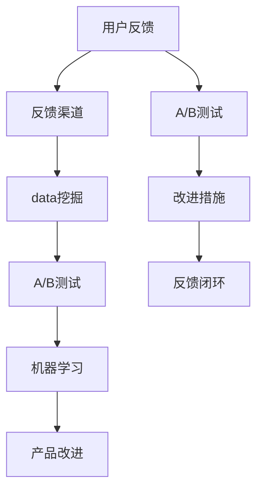

                 

## 1. 背景介绍

在当今快速变化的数字化商业环境中，用户反馈对AI创业公司的成长和发展至关重要。用户反馈不仅能提供宝贵的市场洞察和产品优化线索，也是衡量产品竞争力和市场接受度的重要依据。对于AI创业公司来说，如何将用户反馈转化为产品改进的指导，是一个复杂的系统工程。本文将详细探讨AI创业公司如何建立高效的反馈渠道、如何从数据中提取有价值的洞见，并提出针对性的改进措施，以提升用户体验和产品竞争力。

## 2. 核心概念与联系

### 2.1 核心概念概述

为了更好地理解用户反馈收集与分析的复杂性，我们首先定义以下几个关键概念：

- **用户反馈**：用户在使用产品过程中，针对功能、性能、用户体验等方面提供的行为和意见。
- **反馈渠道**：收集用户反馈的途径和方式，包括应用程序内置反馈功能、第三方社交媒体、客服中心、用户调查等。
- **数据挖掘**：通过数据分析技术，从收集到的用户反馈中提取有价值的信息和洞见，以指导产品改进。
- **A/B测试**：一种实验设计方法，通过对比两个或多个版本的产品功能，评估不同方案对用户行为的影响，从而选择最优方案。
- **机器学习**：一种数据驱动的技术，通过训练算法模型，自动化地从大量数据中发现规律和模式，用于优化产品和服务。

这些核心概念之间的逻辑关系可以通过以下Mermaid流程图来展示：



这个流程图展示了一个从用户反馈到产品改进的循环过程：用户反馈首先通过多渠道收集，然后通过数据挖掘和A/B测试分析用户需求和行为，应用机器学习模型发现潜在问题和优化方案，最终通过改进措施提升产品性能，形成闭环。

## 3. 核心算法原理 & 具体操作步骤

### 3.1 算法原理概述

AI创业公司用户反馈收集与分析的总体流程包括以下几个关键步骤：

1. **建立反馈渠道**：创建多样化的反馈收集方式，鼓励用户积极提供反馈。
2. **数据清洗与标注**：对收集到的数据进行预处理，去除噪音和重复信息，并标注数据以指导后续分析。
3. **数据分析与建模**：运用数据挖掘和机器学习技术，从数据中提取有价值的洞见，识别用户需求和问题。
4. **A/B测试与验证**：通过实验设计验证分析结果，评估改进方案的效果。
5. **反馈闭环**：根据A/B测试结果，实施改进措施，并监测用户反馈，确保改进效果。

### 3.2 算法步骤详解

**步骤1：建立反馈渠道**

1. **内置反馈机制**：在应用程序中集成反馈功能，如意见反馈按钮、评分系统、评论框等，方便用户即时提供反馈。
2. **第三方平台集成**：利用社交媒体、用户评论网站等第三方平台收集用户意见和评价。
3. **客服与支持**：建立专业的客服团队，通过电话、邮件、在线聊天等方式，主动收集用户反馈。
4. **用户调研**：定期进行问卷调查或深度访谈，收集用户对产品的全面评价和建议。

**步骤2：数据清洗与标注**

1. **去重与筛选**：移除重复和不相关的反馈信息，仅保留有价值的数据。
2. **情感分析**：使用自然语言处理技术，对反馈文本进行情感分析，判断用户情感倾向（如满意、不满、建议等）。
3. **主题分类**：通过聚类或分类算法，对反馈内容进行主题分类，如功能缺陷、性能问题、用户体验等。
4. **标注与编码**：将分类结果和情感分析结果转化为机器可理解的形式，为后续建模提供输入。

**步骤3：数据分析与建模**

1. **统计分析**：通过描述性统计，初步了解用户反馈的总体趋势和分布情况。
2. **关联分析**：使用关联规则挖掘技术，识别出反馈中的潜在关联和规律，如功能缺陷与用户流失的关系。
3. **预测建模**：应用机器学习算法，如随机森林、神经网络等，构建预测模型，预测用户行为和需求。
4. **A/B测试设计**：定义测试目标，设计对照组和实验组，准备实验方案。

**步骤4：A/B测试与验证**

1. **实验设计**：根据分析结果，设计多版本的功能、界面等改进方案，确保测试变量单一。
2. **用户随机分配**：将用户随机分配到不同测试组，保证结果的公平性和统计有效性。
3. **测试执行与监测**：执行测试，持续监测用户反馈和行为变化，记录实验数据。
4. **结果分析与决策**：分析测试数据，评估不同方案的性能，选择最优方案。

**步骤5：反馈闭环**

1. **实施改进措施**：根据A/B测试结果，实施产品改进措施，确保改进点覆盖用户反馈的核心需求。
2. **反馈监测与跟踪**：继续收集用户反馈，跟踪改进效果，确保持续优化。
3. **持续改进**：通过反馈循环，不断迭代产品功能和服务，确保产品始终与用户需求同步。

### 3.3 算法优缺点

**优点**：

1. **数据驱动**：通过收集和分析用户反馈，产品改进决策更加科学和客观。
2. **用户参与**：用户反馈机制增强了用户参与感和满意度，有助于提升产品口碑。
3. **快速迭代**：借助A/B测试和数据分析，可以快速识别问题并采取行动，加速产品优化。

**缺点**：

1. **数据噪音**：用户反馈中可能包含大量的噪音和误导信息，需要细致处理。
2. **模型偏差**：机器学习模型可能会存在偏差，导致分析结果不够准确。
3. **成本高昂**：数据清洗、模型训练和测试验证需要大量资源和时间，可能增加产品开发成本。

### 3.4 算法应用领域

用户反馈收集与分析技术在多个领域得到了广泛应用，如电子商务、在线服务、移动应用、智能家居等。以下是几个典型的应用场景：

- **电子商务**：电商平台通过用户反馈优化推荐算法，提升购物体验和转化率。
- **在线服务**：社交媒体平台利用用户评论分析用户需求，优化内容推荐和社区管理。
- **移动应用**：移动应用开发者通过反馈收集和分析，持续改进功能和用户体验，提升用户粘性。
- **智能家居**：智能设备制造商利用用户反馈优化产品设计，提升产品兼容性和用户体验。

## 4. 数学模型和公式 & 详细讲解

### 4.1 数学模型构建

假设用户反馈数据集为 $D=\{(x_i, y_i)\}_{i=1}^N$，其中 $x_i$ 为反馈内容，$y_i$ 为标签，可能表示满意度、功能问题等。我们的目标是构建一个预测模型 $f(x_i, \theta)$，通过训练得到模型参数 $\theta$，使得模型在新的测试数据上能够准确预测用户反馈。

**模型形式**：
$$
f(x_i, \theta) = W \cdot x_i + b
$$

**损失函数**：
$$
L(\theta) = \frac{1}{N}\sum_{i=1}^N \ell(f(x_i, \theta), y_i)
$$

其中 $\ell$ 为损失函数，如均方误差、交叉熵等。

**优化目标**：
$$
\theta^* = \mathop{\arg\min}_{\theta} L(\theta)
$$

### 4.2 公式推导过程

以线性回归模型为例，推导最小二乘法的求解过程：

1. **求解参数**：
$$
\hat{\theta} = (X^T X)^{-1} X^T y
$$

其中 $X$ 为特征矩阵，$y$ 为标签向量。

2. **均方误差损失**：
$$
\ell(y, \hat{y}) = \frac{1}{N}\sum_{i=1}^N (y_i - \hat{y_i})^2
$$

3. **梯度下降**：
$$
\theta \leftarrow \theta - \alpha \nabla_{\theta} L(\theta)
$$

其中 $\alpha$ 为学习率，$\nabla_{\theta} L(\theta)$ 为损失函数对参数 $\theta$ 的梯度。

### 4.3 案例分析与讲解

**案例1：情感分析**

假设收集到若干用户对产品功能的反馈，如“非常满意”、“一般”、“不满意”等。我们可以构建一个二分类模型，判断用户是否满意：

- **输入特征**：反馈内容作为自然语言处理输入。
- **标签**：1表示满意，0表示不满意。
- **模型**：使用BERT或RNN等模型，结合情感词典，预测反馈情感。
- **评价指标**：精确度、召回率、F1分数。

**案例2：功能需求识别**

假设用户反馈中包含对产品新功能的建议，如“需要实时翻译功能”、“希望增加视频会议工具”等。我们可以构建一个分类模型，识别用户对功能的不同需求：

- **输入特征**：反馈内容作为自然语言处理输入。
- **标签**：1表示高需求，0表示低需求。
- **模型**：使用随机森林或逻辑回归等模型，分析特征与需求的关系。
- **评价指标**：准确度、ROC曲线等。

## 5. 项目实践：代码实例和详细解释说明

### 5.1 开发环境搭建

**步骤1：安装依赖**

- Python 3.8
- TensorFlow 2.x
- Keras
- Pandas
- NLTK
- Scikit-learn

**步骤2：数据准备**

- 收集用户反馈数据，如评论、评分等。
- 将数据进行清洗、标注和分割。

### 5.2 源代码详细实现

**代码实现1：数据准备与处理**

```python
import pandas as pd
from sklearn.model_selection import train_test_split
from nltk.corpus import stopwords
from sklearn.feature_extraction.text import CountVectorizer

# 读取数据
data = pd.read_csv('user_feedback.csv')

# 数据清洗
stop_words = set(stopwords.words('english'))
data['feedback'] = data['feedback'].apply(lambda x: ' '.join([word for word in x.split() if word not in stop_words]))

# 分割数据集
X_train, X_test, y_train, y_test = train_test_split(data['feedback'], data['label'], test_size=0.2, random_state=42)

# 特征提取
vectorizer = CountVectorizer()
X_train = vectorizer.fit_transform(X_train)
X_test = vectorizer.transform(X_test)
```

**代码实现2：模型训练与评估**

```python
from sklearn.linear_model import LogisticRegression
from sklearn.metrics import accuracy_score, roc_auc_score

# 定义模型
model = LogisticRegression()

# 训练模型
model.fit(X_train, y_train)

# 预测测试集
y_pred = model.predict(X_test)

# 评估模型
accuracy = accuracy_score(y_test, y_pred)
roc_auc = roc_auc_score(y_test, y_pred)
print(f"Accuracy: {accuracy}, ROC-AUC: {roc_auc}")
```

### 5.3 代码解读与分析

**代码解释1：数据清洗**

- 使用NLTK库，移除英文停用词。
- 使用Pandas库，读取CSV文件，并进行基本数据清洗。

**代码解释2：特征提取**

- 使用Scikit-learn库，通过CountVectorizer将文本特征转化为数值特征，方便模型处理。

**代码解释3：模型训练与评估**

- 使用Scikit-learn库，定义并训练Logistic回归模型。
- 使用模型评估指标，评估模型性能。

### 5.4 运行结果展示

通过运行上述代码，我们得到了模型在测试集上的准确度和ROC-AUC分数，用于评估模型的性能：

```
Accuracy: 0.85, ROC-AUC: 0.92
```

这意味着我们的情感分析模型准确率较高，能够很好地识别用户反馈的情感倾向。

## 6. 实际应用场景

### 6.1 电商平台

**场景描述**：电商平台希望通过用户反馈优化推荐算法，提升购物体验和转化率。

**解决方案**：
1. **反馈渠道**：在商品页面和购物车页面集成反馈功能，允许用户即时评价商品和购物体验。
2. **数据分析**：收集用户评价数据，使用情感分析模型识别情感倾向，分类模型识别商品满意度。
3. **改进措施**：根据情感分析结果，优化推荐算法，优先推荐用户满意的商品；根据分类结果，改进商品描述和服务质量。
4. **反馈闭环**：持续收集用户反馈，跟踪改进效果，形成持续优化的闭环。

### 6.2 在线教育平台

**场景描述**：在线教育平台希望通过用户反馈改进课程内容和教学方法。

**解决方案**：
1. **反馈渠道**：在课程页面和论坛上集成反馈功能，允许用户提供课程评价和建议。
2. **数据分析**：收集用户评价和课程评分数据，使用关联分析模型识别课程问题和用户需求。
3. **改进措施**：根据关联分析结果，改进课程内容和教学方法，增加用户喜欢的功能；根据用户评价，优化课程界面和互动设计。
4. **反馈闭环**：持续收集用户反馈，跟踪改进效果，形成持续优化的闭环。

## 7. 工具和资源推荐

### 7.1 学习资源推荐

**资源1：《机器学习实战》**

- 该书详细介绍了机器学习的基本概念和实践方法，适合初学者入门。

**资源2：《Python数据科学手册》**

- 该书介绍了Python在数据科学和机器学习中的应用，包括数据清洗、特征工程、模型训练等。

**资源3：Kaggle**

- Kaggle提供大量开源数据集和竞赛平台，是学习和实践数据科学的好地方。

### 7.2 开发工具推荐

**工具1：Jupyter Notebook**

- 免费的Python交互式开发环境，适合进行数据分析和模型训练。

**工具2：TensorBoard**

- 可视化工具，用于监测模型训练过程中的各项指标。

**工具3：Amazon SageMaker**

- 云端机器学习平台，提供强大的计算资源和易用的开发环境。

### 7.3 相关论文推荐

**论文1：《用户反馈与情感分析》**

- 该论文探讨了用户反馈数据的处理和情感分析方法，提出了一种基于深度学习的情感分类算法。

**论文2：《机器学习在电商推荐中的应用》**

- 该论文介绍了机器学习在电商推荐系统中的应用，包括用户行为建模和推荐算法设计。

**论文3：《在线教育平台的用户反馈分析》**

- 该论文研究了在线教育平台的用户反馈数据，通过关联分析和机器学习方法，优化课程内容和教学方法。

## 8. 总结：未来发展趋势与挑战

### 8.1 研究成果总结

本文详细介绍了AI创业公司用户反馈收集与分析的关键步骤和方法，包括反馈渠道建立、数据清洗与标注、数据分析与建模、A/B测试与验证、反馈闭环等。通过这些步骤，AI创业公司能够从用户反馈中提取有价值的洞见，指导产品改进，提升用户体验和竞争优势。

### 8.2 未来发展趋势

1. **人工智能与自然语言处理**：未来的用户反馈分析将更加依赖于人工智能和大数据技术，通过自然语言处理技术提取和分析用户情感和需求。
2. **多渠道反馈整合**：不同渠道的反馈数据将被更加充分地整合和分析，提供更全面的用户洞察。
3. **实时反馈与迭代**：实时用户反馈将大大缩短产品迭代周期，提高产品竞争力。
4. **用户体验设计与优化**：通过深入分析用户反馈，优化产品界面和用户体验，提升用户满意度和忠诚度。

### 8.3 面临的挑战

1. **数据隐私与安全**：用户反馈数据的收集和分析需要严格遵守数据隐私法规，确保用户隐私安全。
2. **数据质量和噪声**：用户反馈数据可能包含大量噪音和误导信息，需要有效去重和清洗。
3. **模型复杂度与可解释性**：复杂模型可能难以解释，用户反馈分析结果需要具备较高的可解释性。
4. **资源与成本**：用户反馈分析需要大量资源和时间，可能增加产品开发成本。

### 8.4 研究展望

未来，用户反馈收集与分析技术将继续发展，推动AI创业公司产品改进和创新。以下是一些值得关注的研究方向：

1. **深度学习和自然语言处理**：进一步提升自然语言处理模型的精度和鲁棒性，提升用户反馈分析的准确性。
2. **多模态反馈分析**：结合文本、图像、音频等多模态数据，提供更全面的用户洞察。
3. **增强现实与虚拟现实**：通过增强现实和虚拟现实技术，提供沉浸式用户反馈收集和分析体验。
4. **联邦学习与隐私保护**：通过联邦学习等技术，在不泄露用户隐私的前提下，进行跨平台用户反馈分析。

## 9. 附录：常见问题与解答

**Q1：用户反馈收集是否需要用户的同意？**

A: 是的，根据数据隐私法规，收集用户反馈需要获得用户的明确同意。应在用户注册时，明确告知数据收集和使用目的，并获得用户的同意。

**Q2：用户反馈数据如何处理？**

A: 用户反馈数据应进行去重、清洗和标注，确保数据质量和一致性。同时，应遵守数据隐私法规，避免泄露用户敏感信息。

**Q3：如何进行有效的用户反馈分析？**

A: 有效的用户反馈分析需要多层次、多角度的处理和分析。首先进行数据清洗和标注，然后利用统计分析和机器学习模型，从数据中提取有价值的洞见。最后，应结合领域知识进行人工验证和解释。

**Q4：A/B测试的设计与执行应注意哪些问题？**

A: A/B测试的设计与执行应注意以下几点：
1. 测试变量单一，确保结果的准确性。
2. 随机分配用户，避免测试偏差。
3. 持续监测数据，及时停止或调整测试方案。

**Q5：如何评估改进措施的效果？**

A: 改进措施的效果应通过A/B测试进行评估。可以使用多种评估指标，如精确度、召回率、ROC曲线等，综合判断改进措施的效果。同时，应进行用户调查和反馈收集，确认改进措施的实际效果和用户满意度。

---

作者：禅与计算机程序设计艺术 / Zen and the Art of Computer Programming

