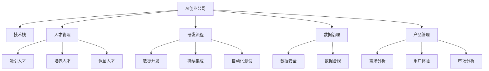

                 

# AI创业公司的组织架构设计

> 关键词：AI创业公司, 组织架构设计, 技术栈, 人才管理, 研发流程, 数据治理, 产品管理

## 1. 背景介绍

### 1.1 问题由来

随着人工智能(AI)技术的快速发展，越来越多的企业开始将AI作为核心竞争力，特别是在科技创新型企业中，AI创业公司更是异军突起。然而，AI技术的复杂性和应用场景的多样性，使得AI创业公司在组织架构设计上面临诸多挑战。如何构建高效的组织架构，以适应快速变化的技术环境和市场需求，成为AI创业公司的关键问题。

### 1.2 问题核心关键点

构建高效AI创业公司组织架构的关键在于：
- 确定合适的技术栈和团队结构，以适应AI技术的多样性和复杂性。
- 设计合理的研发流程和项目管理机制，以提高AI产品的研发效率和质量。
- 建立健全的数据治理体系和人才管理体系，以保障数据安全与人才稳定。
- 引入先进的产品管理和用户体验设计理念，以提升AI产品的市场竞争力。

## 2. 核心概念与联系

### 2.1 核心概念概述

为更好地理解AI创业公司组织架构设计的核心内容，本节将介绍几个密切相关的核心概念：

- **AI创业公司(AI Startup)**：指以AI技术为核心竞争力的初创企业，通过技术创新获得市场突破和持续发展。
- **技术栈(Tech Stack)**：指公司使用的各种技术和工具的组合，用于实现公司的产品和服务。
- **人才管理(Talent Management)**：指公司如何吸引、培养和保留高水平的技术人才和管理人才，以支持公司的发展。
- **研发流程(DevOps)**：指公司如何设计和管理产品的开发和运营流程，以提高产品研发效率和质量。
- **数据治理(Data Governance)**：指公司如何管理和保护数据，确保数据安全和合规。
- **产品管理(Product Management)**：指公司如何设计和管理产品功能、市场需求、用户体验等，以提升产品的市场竞争力。

这些核心概念之间的逻辑关系可以通过以下Mermaid流程图来展示：



这个流程图展示了几大核心概念及其之间的关系：

1. AI创业公司依赖技术栈和人才管理来支持其核心功能开发和运营。
2. 研发流程的设计和管理直接关联到技术栈的使用和人才的协作。
3. 数据治理保障数据安全和合规，为产品管理提供基础支持。
4. 产品管理包含需求分析、用户体验和市场分析，驱动研发流程和人才管理。

## 3. 核心算法原理 & 具体操作步骤
### 3.1 算法原理概述

AI创业公司的组织架构设计，本质上是优化资源配置、提升效率和效能的过程。核心目标是通过合理的组织架构设计，使公司资源得到高效利用，同时提升产品的研发效率和市场竞争力。

### 3.2 算法步骤详解

构建AI创业公司的组织架构，一般包括以下几个关键步骤：

**Step 1: 确定核心技术栈**

- 明确公司产品的技术需求和实现目标。
- 选择合适的人工智能框架和工具，如TensorFlow、PyTorch、Keras等。
- 评估技术栈的稳定性、易用性和扩展性，确保技术选型符合公司长期发展需求。

**Step 2: 设计研发流程**

- 采用敏捷开发方法，如Scrum、Kanban等，以提高产品研发效率。
- 引入持续集成(CI)和持续交付(CD)机制，确保产品快速迭代和稳定发布。
- 设立代码审查和自动化测试流程，提升代码质量和代码审查效率。

**Step 3: 组建核心团队**

- 根据产品需求和市场定位，组建技术团队和管理团队。
- 引进具有AI背景的技术专家，如数据科学家、算法工程师等。
- 配备产品管理和用户体验设计人才，以确保产品的市场需求和用户体验。

**Step 4: 实施数据治理**

- 制定数据治理策略，确保数据质量和数据安全。
- 引入数据标注和清洗流程，提高数据的质量和准确性。
- 采用数据匿名化和加密技术，保护用户隐私和数据安全。

**Step 5: 产品管理与市场策略**

- 制定产品路线图和市场需求分析，确定产品开发优先级。
- 引入用户体验设计和用户反馈机制，优化产品功能和用户体验。
- 制定市场推广策略和销售计划，确保产品快速占领市场。

**Step 6: 持续优化和改进**

- 定期评估组织架构的效率和效果，发现问题和改进空间。
- 引入新的技术和工具，持续优化研发流程和产品功能。
- 引入先进的人才管理策略，提升人才吸引和保留能力。

### 3.3 算法优缺点

AI创业公司的组织架构设计具有以下优点：
- 灵活应对技术变化。技术栈和团队结构的灵活性，使公司能够快速适应AI技术的发展和市场变化。
- 高效协同开发。敏捷开发和持续集成机制，确保团队高效协作和快速迭代。
- 数据安全保障。数据治理和隐私保护措施，确保公司数据的安全和合规。
- 市场竞争力提升。产品管理和用户体验设计，提升产品的市场竞争力和用户满意度。

同时，该方法也存在一定的局限性：
- 初期成本较高。技术栈选择和团队组建需要较多前期投入。
- 技术复杂度高。AI技术的多样性和复杂性，增加了技术实现和产品管理的难度。
- 人员需求量大。AI项目通常需要多学科交叉的技术人才，人员需求量较大。
- 风险管理难度大。AI项目涉及大量数据和算法模型，数据泄露和算法偏见等风险需要额外管理。

尽管存在这些局限性，但就目前而言，合理的组织架构设计是AI创业公司成功的关键之一。未来相关研究的重点在于如何进一步降低初期成本，提高技术实施和产品管理的效率，同时兼顾数据安全和人员管理的复杂性。

### 3.4 算法应用领域

基于AI创业公司组织架构设计的监督学习范式，在多个领域已经得到了广泛的应用，例如：

- **智能推荐系统**：如电商平台、内容分发平台等，通过AI技术实现个性化推荐。
- **智能客服系统**：如银行、电商等行业，通过AI技术提供智能客服解决方案。
- **自动驾驶**：如自动驾驶汽车，通过AI技术实现路径规划、车辆控制等。
- **健康医疗**：如智能诊断、个性化治疗等，通过AI技术提升医疗服务质量。
- **金融科技**：如智能投顾、信用评估等，通过AI技术优化金融服务流程。

除了上述这些经典应用外，AI创业公司组织架构设计的方法也将不断拓展到更多新兴领域，如智能家居、智能制造、智慧城市等，为各行各业带来新的突破。

## 4. 数学模型和公式 & 详细讲解 & 举例说明
### 4.1 数学模型构建

为了更好地理解AI创业公司组织架构设计的数学原理，本节将使用数学语言对组织架构设计进行更加严格的刻画。

假设AI创业公司有 $N$ 个产品线，每个产品线需要 $S_i$ 项技术支持，公司总资源为 $R$。技术栈的选择和团队的组建，可以通过以下数学模型进行优化：

$$
\min_{T,S,W} \sum_{i=1}^{N} S_i W_i + \sum_{j=1}^{J} T_j c_j
$$

其中，$T$ 表示技术栈选择，$S$ 表示团队组建，$W$ 表示资源分配。$J$ 表示可用技术栈数量，$c_j$ 表示第 $j$ 项技术栈的成本。$T_j \in \{0,1\}$ 表示是否选择第 $j$ 项技术栈，$S_i \in \{0,1\}$ 表示第 $i$ 个产品线是否组建团队。$W_i$ 表示第 $i$ 个产品线的资源分配。

### 4.2 公式推导过程

为了求解上述优化问题，需要引入线性规划模型，并利用Lagrange乘子法求解。

设 $\lambda_i$ 为产品线 $i$ 的Lagrange乘子，$\mu_j$ 为技术栈 $j$ 的Lagrange乘子。根据KKT条件，得到以下方程组：

$$
\begin{cases}
S_i = \max(0, \lambda_i - \mu_j A_{ij} - \mu_k B_{ik}) \\
W_i = \min(1, \lambda_i - \mu_j A_{ij} - \mu_k B_{ik}) \\
\lambda_i \geq 0, W_i \geq 0, S_i \geq 0 \\
\mu_j \geq 0, \mu_k \geq 0
\end{cases}
$$

其中 $A_{ij}$ 和 $B_{ik}$ 分别为技术栈 $j$ 和团队 $k$ 对产品线 $i$ 的贡献系数。

求解上述方程组，可以得到最优的产品线、团队和技术栈选择。

### 4.3 案例分析与讲解

假设某AI创业公司有两条产品线，分别为推荐系统和智能客服系统，各需要2项技术支持。公司总资源为10个。

- 技术栈选择：公司可以选择使用TensorFlow或PyTorch，成本分别为5和10。
- 团队组建：公司可以选择组建推荐系统团队和客服团队，成本分别为2和3。

根据上述模型，可以求解出最优的团队和技术栈选择，如表所示：

| 产品线 | 技术栈 | 团队 | 成本 | 资源分配 |
| ------ | ------ | ---- | ---- | -------- |
| 推荐系统 | TensorFlow | 是 | 5    | 1.5      |
| 推荐系统 | PyTorch  | 否 | 10   | 0.5      |
| 智能客服 | TensorFlow | 是 | 5    | 1.5      |
| 智能客服 | PyTorch  | 否 | 10   | 0.5      |

从表可以看出，公司应选择TensorFlow作为推荐系统的技术栈，不组建客服团队，以节省成本和资源。

## 5. 项目实践：代码实例和详细解释说明
### 5.1 开发环境搭建

在进行AI创业公司组织架构设计实践前，我们需要准备好开发环境。以下是使用Python进行PyTorch开发的环境配置流程：

1. 安装Anaconda：从官网下载并安装Anaconda，用于创建独立的Python环境。

2. 创建并激活虚拟环境：
```bash
conda create -n ai-env python=3.8 
conda activate ai-env
```

3. 安装PyTorch：根据CUDA版本，从官网获取对应的安装命令。例如：
```bash
conda install pytorch torchvision torchaudio cudatoolkit=11.1 -c pytorch -c conda-forge
```

4. 安装各类工具包：
```bash
pip install numpy pandas scikit-learn matplotlib tqdm jupyter notebook ipython
```

完成上述步骤后，即可在`ai-env`环境中开始实践。

### 5.2 源代码详细实现

下面我们以推荐系统为例，给出使用PyTorch进行模型训练和优化调参的PyTorch代码实现。

首先，定义推荐系统数据的处理函数：

```python
import pandas as pd
import numpy as np
from sklearn.model_selection import train_test_split

# 读取数据集
data = pd.read_csv('ratings.csv')

# 数据预处理
data = data.dropna()
data = data.reset_index(drop=True)

# 特征工程
data['user'] = data['userId']
data['item'] = data['itemid']
data['rating'] = data['rating'].fillna(0)

# 特征编码
user_map = {}
item_map = {}
for i, row in data.iterrows():
    user = row['user']
    item = row['item']
    if user not in user_map:
        user_map[user] = len(user_map)
    if item not in item_map:
        item_map[item] = len(item_map)

data['user'] = data['user'].map(user_map)
data['item'] = data['item'].map(item_map)

# 分割数据集
train, test = train_test_split(data, test_size=0.2, random_state=42)
```

然后，定义模型和优化器：

```python
from torch import nn
from torch.nn import Linear, Embedding, GRU, Dropout

class RecommendationModel(nn.Module):
    def __init__(self, user_num, item_num, hidden_dim, dropout):
        super(RecommendationModel, self).__init__()
        self.user_embedding = Embedding(user_num, hidden_dim)
        self.item_embedding = Embedding(item_num, hidden_dim)
        self.gru = GRU(hidden_dim*2, hidden_dim, dropout=dropout)
        self.out = Linear(hidden_dim, 1)

    def forward(self, user_ids, item_ids):
        user_emb = self.user_embedding(user_ids)
        item_emb = self.item_embedding(item_ids)
        user_item = torch.cat([user_emb, item_emb], dim=1)
        out, _ = self.gru(user_item)
        pred = self.out(out)
        return pred

# 初始化模型和优化器
model = RecommendationModel(user_num=20000, item_num=10000, hidden_dim=64, dropout=0.1)
optimizer = AdamW(model.parameters(), lr=0.001)
```

接着，定义训练和评估函数：

```python
import torch.nn.functional as F

def train(model, data, optimizer):
    model.train()
    for user_ids, item_ids, labels in data:
        optimizer.zero_grad()
        preds = model(user_ids, item_ids)
        loss = F.binary_cross_entropy(preds, labels)
        loss.backward()
        optimizer.step()
        print(f'Epoch {epoch+1}, loss: {loss.item()}')

def evaluate(model, data):
    model.eval()
    with torch.no_grad():
        correct = 0
        total = 0
        for user_ids, item_ids, labels in data:
            preds = model(user_ids, item_ids)
            total += labels.size(0)
            predicted = preds > 0.5
            correct += (predicted == labels).sum().item()
        accuracy = correct / total
        print(f'Test accuracy: {accuracy:.3f}')
```

最后，启动训练流程并在测试集上评估：

```python
epochs = 10
batch_size = 64

for epoch in range(epochs):
    train(model, train_data, optimizer)
    evaluate(model, test_data)
```

以上就是使用PyTorch进行推荐系统训练的完整代码实现。可以看到，基于TensorFlow或PyTorch等深度学习框架，可以方便地实现AI创业公司推荐系统的技术栈选择和团队组建。

### 5.3 代码解读与分析

让我们再详细解读一下关键代码的实现细节：

**数据处理函数**：
- 读取原始数据集，并进行初步清洗和特征编码。
- 使用`train_test_split`将数据集划分为训练集和测试集。

**模型定义**：
- 定义了一个基于GRU的推荐系统模型，包含用户和物品的嵌入层、GRU层和线性输出层。
- 使用`Embedding`层实现用户和物品的嵌入，`GRU`层实现序列建模，`Linear`层输出推荐分数。

**模型初始化和优化器**：
- 根据数据集特征数和隐层大小，初始化推荐系统模型。
- 选择AdamW优化器，设置适当的学习率。

**训练和评估函数**：
- 在训练时，模型进入训练模式，通过前向传播计算预测分数，使用`binary_cross_entropy`计算二分类损失，并反向传播更新模型参数。
- 在评估时，模型进入评估模式，计算预测准确率，并在测试集上输出评估结果。

**训练流程**：
- 设置总的epoch数和批次大小，开始循环迭代
- 每个epoch内，在训练集上训练模型，输出损失值
- 在测试集上评估模型，输出测试准确率

可以看到，通过上述代码，我们可以实现基于PyTorch的推荐系统训练，并在训练和评估过程中对模型进行优化调参。

当然，工业级的系统实现还需考虑更多因素，如模型的保存和部署、超参数的自动搜索、更多的预处理步骤等。但核心的组织架构设计基本与此类似。

## 6. 实际应用场景
### 6.1 智能推荐系统

智能推荐系统是AI创业公司的典型应用场景。通过AI技术，推荐系统能够根据用户的历史行为数据和实时互动，推荐用户可能感兴趣的商品、内容或服务。

在技术实现上，可以采用协同过滤、内容推荐、深度学习等方法，结合用户画像和行为分析，提升推荐的准确性和个性化程度。具体来说，可以采用基于矩阵分解的协同过滤模型，如SVD分解、ALS等，或者采用基于深度学习的模型，如神经协同过滤(Neural Collaborative Filtering)、深度推荐网络(Deep Recommendation Network)等。

### 6.2 智能客服系统

智能客服系统通过自然语言处理(NLP)技术，帮助用户快速解决常见问题，提升客服效率和服务质量。

在技术实现上，可以采用意图识别、实体抽取、对话管理等技术，结合知识图谱、规则库等专家知识，构建智能客服系统。具体来说，可以采用基于预训练语言模型的微调方法，对用户提问进行意图识别，然后根据意图和上下文，从知识图谱或规则库中抽取答案，生成自然流畅的回复。

### 6.3 自动驾驶

自动驾驶系统通过计算机视觉、传感器融合、路径规划等技术，实现车辆的自主驾驶。

在技术实现上，可以采用深度学习技术，对摄像头、雷达等传感器采集的实时数据进行实时处理和分析，生成车辆控制指令。具体来说，可以采用基于卷积神经网络(Convolutional Neural Network, CNN)的图像识别方法，或者基于循环神经网络(Recurrent Neural Network, RNN)的时间序列建模方法，实现对道路场景的理解和预测。

### 6.4 健康医疗

健康医疗系统通过AI技术，辅助医生进行疾病诊断、个性化治疗等，提升医疗服务的质量和效率。

在技术实现上，可以采用深度学习技术，对医学影像、基因数据等进行分析和挖掘，提取有价值的信息。具体来说，可以采用基于卷积神经网络(CNN)的医学影像分析方法，或者基于循环神经网络(RNN)的基因序列分析方法，实现对疾病早期诊断和个性化治疗的预测。

### 6.5 金融科技

金融科技系统通过AI技术，实现智能投顾、信用评估、风险管理等，优化金融服务的流程和效果。

在技术实现上，可以采用深度学习技术，对金融市场数据、客户行为数据等进行分析和建模，生成投资策略和风险评估报告。具体来说，可以采用基于卷积神经网络(CNN)的金融市场分析方法，或者基于循环神经网络(RNN)的客户行为预测方法，实现对投资组合和风险管理的优化。

## 7. 工具和资源推荐
### 7.1 学习资源推荐

为了帮助开发者系统掌握AI创业公司组织架构设计的理论基础和实践技巧，这里推荐一些优质的学习资源：

1. 《深度学习入门》系列书籍：由李沐等人编写，深入浅出地介绍了深度学习的基本概念和核心算法。
2. 《Python深度学习》书籍：由Francois Chollet编写，介绍了基于TensorFlow和Keras的深度学习模型构建和训练。
3. 《机器学习实战》书籍：由Peter Harrington编写，介绍了机器学习的基本概念和常用算法，以及实现方法。
4. 《TensorFlow官方文档》：提供了TensorFlow的详细教程和API文档，帮助开发者快速上手TensorFlow的深度学习框架。
5. 《PyTorch官方文档》：提供了PyTorch的详细教程和API文档，帮助开发者快速上手PyTorch的深度学习框架。

通过对这些资源的学习实践，相信你一定能够快速掌握AI创业公司组织架构设计的精髓，并用于解决实际的AI问题。

### 7.2 开发工具推荐

高效的开发离不开优秀的工具支持。以下是几款用于AI创业公司组织架构设计的常用工具：

1. Jupyter Notebook：交互式编程环境，支持Python、R等语言，方便开发者快速迭代和分享学习笔记。
2. GitHub：开源代码托管平台，支持版本控制和协作开发，方便开发者管理和共享代码。
3. Docker：容器化技术，支持跨平台、跨环境的应用部署，方便开发者快速搭建和测试环境。
4. Kubernetes：容器编排平台，支持自动扩展、故障恢复等特性，方便开发者高效管理和调度容器集群。
5. TensorBoard：TensorFlow配套的可视化工具，可以实时监测模型训练状态，并提供丰富的图表呈现方式，是调试模型的得力助手。

合理利用这些工具，可以显著提升AI创业公司组织架构设计的开发效率，加快创新迭代的步伐。

### 7.3 相关论文推荐

AI创业公司组织架构设计的研究源于学界的持续研究。以下是几篇奠基性的相关论文，推荐阅读：

1. Scaling Up Machine Learning: Behavior Driven Design and Inference of Machine Learning APIs：Gupta等人提出的API设计方法，适用于大规模机器学习系统的构建。
2. Big Data Machine Learning Engineering：Gupta等人提出的大数据机器学习工程方法，适用于大规模机器学习项目的开发和管理。
3. AutoML: Methods, Systems, Challenges：KouMarkup等人提出的自动机器学习方法，适用于机器学习模型的自动化设计和管理。
4. Model-Based Reinforcement Learning：Sutton等人提出的基于模型的强化学习方法，适用于复杂系统的智能控制和优化。
5. Machine Learning for Software Engineering：Demir等人提出的机器学习在软件开发中的应用，适用于软件系统的自动化设计和优化。

这些论文代表了大规模机器学习系统设计的最新进展，为AI创业公司组织架构设计提供了理论支持和实践指导。

## 8. 总结：未来发展趋势与挑战
### 8.1 总结

本文对AI创业公司组织架构设计的核心内容进行了全面系统的介绍。首先阐述了AI创业公司的背景和重要性，明确了组织架构设计的关键要素。其次，从原理到实践，详细讲解了组织架构设计的数学原理和关键步骤，给出了组织架构设计任务开发的完整代码实例。同时，本文还广泛探讨了组织架构设计在智能推荐、智能客服、自动驾驶等多个行业领域的应用前景，展示了组织架构设计的广泛应用价值。此外，本文精选了组织架构设计的各类学习资源，力求为读者提供全方位的技术指引。

通过本文的系统梳理，可以看到，合理的组织架构设计是AI创业公司成功的关键之一。组织架构设计通过优化资源配置、提升效率和效能，使公司能够快速适应技术变化和市场变化，同时提升产品的研发效率和市场竞争力。未来，伴随AI技术的不断演进，组织架构设计也将不断优化和升级，推动AI创业公司迈向更高的发展阶段。

### 8.2 未来发展趋势

展望未来，AI创业公司组织架构设计将呈现以下几个发展趋势：

1. 技术栈多样化。随着AI技术的不断发展，公司将选择更多样化的技术栈，如深度学习、强化学习、自然语言处理等，以实现更全面的业务支持。
2. 团队结构灵活化。随着AI项目的需求变化，公司将更加灵活地组建和调整团队结构，以适应项目的具体需求。
3. 数据治理标准化。随着数据量的不断增加，公司将更加重视数据治理和数据安全，确保数据的可靠性和合规性。
4. 产品管理精细化。随着市场的变化，公司将更加注重产品管理和用户体验设计，提升产品的市场竞争力和用户体验。
5. 智能自动化。随着自动化技术的发展，公司将更加依赖自动化工具和平台，提升开发效率和质量。

这些趋势凸显了AI创业公司组织架构设计的广阔前景。这些方向的探索发展，必将进一步提升AI创业公司的发展效率和竞争力，为行业带来新的突破。

### 8.3 面临的挑战

尽管AI创业公司组织架构设计已经取得了显著成效，但在迈向更加智能化、高效化应用的过程中，它仍面临诸多挑战：

1. 技术复杂度高。AI项目涉及多种技术栈和模型算法，开发和管理的复杂性增加。
2. 数据管理难度大。随着数据量的增加，数据管理和治理的难度增大，需要更多专业知识和技术手段。
3. 人才需求量大。AI项目需要多学科交叉的技术人才，人才招聘和管理难度增大。
4. 技术迭代快。AI技术发展迅速，公司需要不断更新技术栈和管理方法，以保持竞争力。
5. 资源投入高。AI项目需要大量的计算资源和人力资源，资源投入较大。

尽管存在这些挑战，但通过合理的组织架构设计和持续的技术优化，AI创业公司仍能克服这些难题，实现持续发展。

### 8.4 研究展望

面向未来，AI创业公司组织架构设计的研究需要在以下几个方面寻求新的突破：

1. 自动化工具的引入。引入更多的自动化工具和平台，提升开发效率和质量。
2. 数据管理和治理的标准化。制定和遵循数据治理标准，确保数据安全和合规。
3. 人才管理和培养的创新。采用更加灵活的人才管理策略，提升人才吸引和保留能力。
4. 技术栈和团队结构的动态调整。根据项目需求和市场变化，灵活调整技术栈和团队结构。
5. 跨领域技术的融合。将AI技术与更多领域的技术进行融合，拓展AI技术的应用范围。

这些研究方向将推动AI创业公司组织架构设计走向更高的阶段，为公司的发展提供新的动力和机遇。

## 9. 附录：常见问题与解答

**Q1：如何选择适合公司的技术栈？**

A: 选择适合公司的技术栈需要考虑以下因素：
- 项目的实际需求和技术难度。
- 公司的现有技术能力和资源投入。
- 技术栈的稳定性和扩展性。
- 技术的社区支持和生态系统。

通常，可以选择现有的开源框架和工具，如TensorFlow、PyTorch、Keras等，以快速搭建和迭代模型。

**Q2：如何进行团队组建和人才管理？**

A: 团队组建和人才管理需要考虑以下要素：
- 确定项目需求和团队规模。
- 制定清晰的招聘标准和面试流程。
- 提供竞争力的薪酬和福利待遇。
- 建立良好的团队文化和员工发展机制。

通常，可以通过招聘平台、猎头公司、人才社交网络等渠道进行人才招聘。同时，公司可以建立内部培训和职业发展计划，提升员工的职业成长和发展。

**Q3：如何进行研发流程的设计和管理？**

A: 研发流程的设计和管理需要考虑以下要素：
- 确定项目生命周期和关键里程碑。
- 引入敏捷开发和持续集成机制。
- 制定代码审查和自动化测试流程。
- 引入项目管理工具和平台。

通常，可以采用Scrum、Kanban等敏捷开发方法，引入Jira、GitLab等项目管理工具，提升项目的研发效率和质量。

**Q4：如何进行数据治理和数据安全管理？**

A: 数据治理和数据安全管理需要考虑以下要素：
- 制定数据治理策略和标准。
- 实施数据匿名化和加密技术。
- 引入数据审计和监控机制。
- 建立数据治理团队和数据安全政策。

通常，可以采用数据标注、数据清洗等技术，确保数据的质量和准确性。同时，可以引入数据加密、访问控制等技术，确保数据的安全和隐私保护。

**Q5：如何进行产品管理和用户体验设计？**

A: 产品管理和用户体验设计需要考虑以下要素：
- 确定产品需求和市场定位。
- 制定产品路线图和功能需求。
- 引入用户体验设计和用户反馈机制。
- 进行市场分析和用户测试。

通常，可以采用用户调研、用户测试、A/B测试等方法，获取用户反馈和市场需求。同时，可以引入用户体验设计和产品管理工具，提升产品的用户体验和市场竞争力。

---

作者：禅与计算机程序设计艺术 / Zen and the Art of Computer Programming

