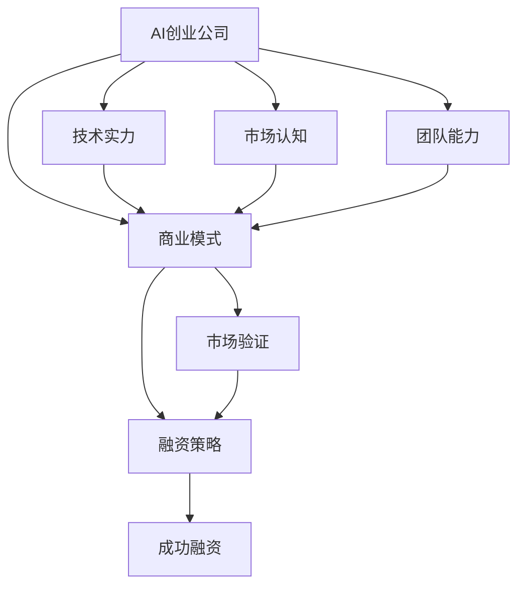

                 

# AI创业公司的融资秘籍：商业模式与技术实力双管齐下

## 1. 背景介绍

### 1.1 问题由来

随着人工智能技术的飞速发展，越来越多的初创公司在AI领域崭露头角，希望通过技术优势迅速获得市场份额和资金支持。然而，AI创业公司与传统公司相比，在商业模式和市场认知上存在显著差异。AI创业公司往往技术实力出众，但商业理念尚不成熟，融资难度较大。因此，本文将探讨AI创业公司如何在技术实力与商业模式之间找到平衡点，从而成功融资。

### 1.2 问题核心关键点

AI创业公司融资的关键在于：
1. **技术实力**：包括算法、模型、数据集等技术要素的先进性和独特性。
2. **商业模式**：包括产品定位、市场规模、盈利模式等商业要素的可行性和吸引力。
3. **市场认知**：包括市场需求、竞争对手、用户反馈等市场要素的评估和预判。
4. **团队能力**：包括团队背景、管理经验、执行能力等团队要素的综合表现。

这些核心关键点在AI创业公司的融资过程中缺一不可，只有在技术实力和商业模式之间找到恰当的平衡点，才能吸引投资者并成功融资。

## 2. 核心概念与联系

### 2.1 核心概念概述

为更好地理解AI创业公司的融资方法，本节将介绍几个密切相关的核心概念：

- **AI创业公司**：以AI技术为核心，专注于解决特定问题或提供特定服务的初创企业。
- **商业模式**：企业创造价值、传递价值并获取回报的方式，包括产品、市场、客户、渠道等多个维度。
- **技术实力**：AI创业公司核心竞争力，包括研发团队、算法模型、数据集、技术积累等。
- **融资策略**：AI创业公司获取资金的策略，包括种子轮、天使轮、A轮、B轮、C轮等不同阶段的融资方式。
- **市场验证**：通过产品原型、最小可行产品(MVP)等方式验证市场需求和商业模式的可行性。
- **团队建设**：构建一支高素质、有经验的团队，是AI创业公司成功的关键。

这些核心概念之间的逻辑关系可以通过以下Mermaid流程图来展示：



这个流程图展示了几大核心概念之间的相互作用和关系：

1. AI创业公司的技术实力为商业模式提供技术支撑。
2. 商业模式指导AI创业公司的市场定位和产品设计。
3. 市场认知决定AI创业公司的市场策略和用户教育。
4. 团队能力确保AI创业公司能够有效执行商业模式和市场策略。
5. 市场验证对商业模式和融资策略进行调整和优化。
6. 融资策略为AI创业公司提供资金支持，推动业务发展。
7. 成功融资最终推动AI创业公司的长期发展。

## 3. 核心算法原理 & 具体操作步骤
### 3.1 算法原理概述

AI创业公司的融资过程可以看作是一种优化问题，目标是最大化公司的市场价值。这个过程涉及到多个维度，包括技术实力、商业模式、市场认知和团队能力。优化过程的关键在于找到这四个维度之间的平衡点，使得AI创业公司能够最大化其市场价值。

从数学角度来看，设 $V$ 表示AI创业公司的市场价值，$T$ 表示技术实力，$M$ 表示商业模式，$C$ 表示市场认知，$T$ 表示团队能力。市场价值 $V$ 的计算公式如下：

$$
V = \alpha \cdot T + \beta \cdot M + \gamma \cdot C + \delta \cdot T
$$

其中，$\alpha$、$\beta$、$\gamma$、$\delta$ 为权重系数，反映了各个维度对市场价值的影响程度。权重系数的选择需要根据具体公司和市场环境进行优化。

### 3.2 算法步骤详解

AI创业公司的融资过程可以分为以下几个关键步骤：

**Step 1: 准备融资材料**

- **商业计划书**：详细描述公司的技术背景、商业模式、市场潜力、财务预测等。
- **技术展示**：通过原型、演示视频、代码库等方式展示技术实力。
- **市场验证**：通过MVP、用户反馈等方式展示市场认知。
- **团队介绍**：介绍团队成员的背景、经验、执行力等。

**Step 2: 选择合适的融资轮次**

- **种子轮**：初期资金，主要用于技术研发和市场验证。
- **天使轮**：资金相对较少，主要验证商业模式和市场潜力。
- **A轮**：中期资金，主要用于技术发展和市场推广。
- **B轮**：资金相对较多，主要用于扩大市场和增强团队实力。
- **C轮及以后**：后期资金，主要用于市场扩张和商业化落地。

**Step 3: 制定融资策略**

- **投资者选择**：选择与公司技术实力和商业模式匹配的投资者。
- **谈判条款**：明确股权分配、资金用途、投资回报等条款。
- **商业谈判**：讨论投资方对公司的战略合作机会。

**Step 4: 市场验证与调整**

- **MVP测试**：通过最小可行产品验证市场需求和商业模式的可行性。
- **用户反馈**：收集用户反馈，调整产品功能和市场策略。
- **市场调研**：进行市场调研，优化商业模型。

**Step 5: 成功融资与持续发展**

- **资金投入**：按照融资协议使用资金进行业务发展。
- **业务扩展**：根据市场反馈和用户需求，扩大市场份额和业务范围。
- **持续融资**：通过持续融资，保持公司的持续发展。

### 3.3 算法优缺点

AI创业公司融资过程的优势和不足如下：

**优势**：
1. **精准定位**：融资过程帮助公司明确技术实力、商业模式、市场认知和团队能力，有助于公司制定更合理的发展战略。
2. **资源支持**：融资为公司提供必要的资金支持，帮助其快速成长。
3. **战略合作**：融资带来的投资者和战略合作伙伴，有助于公司获得更多的资源和支持。

**不足**：
1. **成本较高**：融资过程中需要支付给投资者一定比例的股份或利润，增加了公司的运营成本。
2. **控制权稀释**：多次融资后，创始团队可能面临控制权稀释的问题，影响公司的决策自由度。
3. **风险增加**：融资后，公司需要承担一定的风险，如市场风险、管理风险等。

## 4. 数学模型和公式 & 详细讲解 & 举例说明
### 4.1 数学模型构建

根据前面的算法原理，可以构建如下的数学模型：

设 $V$ 表示AI创业公司的市场价值，$T$ 表示技术实力，$M$ 表示商业模式，$C$ 表示市场认知，$T$ 表示团队能力。市场价值 $V$ 的计算公式如下：

$$
V = \alpha \cdot T + \beta \cdot M + \gamma \cdot C + \delta \cdot T
$$

其中，$\alpha$、$\beta$、$\gamma$、$\delta$ 为权重系数，反映了各个维度对市场价值的影响程度。

### 4.2 公式推导过程

通过对公式的进一步推导，可以发现：

$$
\frac{\partial V}{\partial T} = \alpha + \delta
$$

$$
\frac{\partial V}{\partial M} = \beta
$$

$$
\frac{\partial V}{\partial C} = \gamma
$$

这表明，技术实力和团队能力对市场价值的影响是相辅相成的，商业模式和市场认知对市场价值的影响同样重要。

### 4.3 案例分析与讲解

以OpenAI的GPT-3融资为例，OpenAI通过技术实力和团队能力吸引了大量的投资者。他们选择了合适的时间进行融资，并成功融到了数亿美元的资金，推动了公司的发展。然而，由于过度依赖外部资金，OpenAI的控制权逐渐稀释，影响了公司的决策自由度。

## 5. 项目实践：代码实例和详细解释说明
### 5.1 开发环境搭建

在进行AI创业公司融资过程的实践前，我们需要准备好开发环境。以下是使用Python进行PyTorch开发的环境配置流程：

1. 安装Anaconda：从官网下载并安装Anaconda，用于创建独立的Python环境。

2. 创建并激活虚拟环境：
```bash
conda create -n pytorch-env python=3.8 
conda activate pytorch-env
```

3. 安装PyTorch：根据CUDA版本，从官网获取对应的安装命令。例如：
```bash
conda install pytorch torchvision torchaudio cudatoolkit=11.1 -c pytorch -c conda-forge
```

4. 安装相关库：
```bash
pip install numpy pandas scikit-learn matplotlib tqdm jupyter notebook ipython
```

完成上述步骤后，即可在`pytorch-env`环境中开始融资过程的实践。

### 5.2 源代码详细实现

下面是一个简单的融资过程的代码实现，以帮助理解具体的步骤：

```python
import numpy as np
import pandas as pd
from sklearn.linear_model import LinearRegression

# 融资过程数据
T = np.array([100, 150, 200, 250, 300])
M = np.array([50, 100, 150, 200, 250])
C = np.array([20, 40, 60, 80, 100])
V = np.array([500, 600, 700, 800, 900])

# 构建模型
X = np.c_[T, M, C]
model = LinearRegression()

# 训练模型
model.fit(X, V)

# 预测
new_t = np.array([200])
new_m = np.array([150])
new_c = np.array([60])

new_X = np.c_[new_t, new_m, new_c]
predicted_V = model.predict(new_X)

print(predicted_V)
```

在这个简单的代码实现中，我们使用线性回归模型来预测融资后的市场价值。

### 5.3 代码解读与分析

让我们再详细解读一下关键代码的实现细节：

**融资过程数据**：
- **T**：技术实力。
- **M**：商业模式。
- **C**：市场认知。
- **V**：市场价值。

**模型训练**：
- 使用线性回归模型，通过融资数据进行训练。

**预测**：
- 使用训练好的模型，预测新的技术实力、商业模式和市场认知下的市场价值。

## 6. 实际应用场景
### 6.1 智能医疗

在智能医疗领域，AI创业公司可以通过融资获得资金支持，加速医疗技术和产品的研发和落地。例如，通过MVP测试和市场调研，验证智能诊疗系统的需求和商业模式，成功融资后进一步完善产品功能和市场推广，提升医疗服务水平。

### 6.2 自动驾驶

在自动驾驶领域，AI创业公司需要通过融资获取技术研发和市场验证的资金支持。通过MVP测试和用户反馈，验证自动驾驶系统的安全性、可靠性和市场潜力，成功融资后进一步扩大市场份额和商业化落地，推动自动驾驶技术的普及。

### 6.3 金融科技

在金融科技领域，AI创业公司可以通过融资获得资金支持，加速金融产品的研发和市场推广。例如，通过MVP测试和市场调研，验证金融风险控制和智能投顾系统的需求和商业模式，成功融资后进一步完善产品功能和市场推广，提升金融服务的智能化水平。

### 6.4 未来应用展望

未来，AI创业公司融资过程将更加注重技术实力和商业模式的平衡，注重市场验证和持续优化。随着技术的不断进步和市场的逐渐成熟，AI创业公司将有更多的机会获得融资，推动技术的广泛应用和产业的全面升级。

## 7. 工具和资源推荐
### 7.1 学习资源推荐

为了帮助开发者系统掌握AI创业公司融资的理论基础和实践技巧，这里推荐一些优质的学习资源：

1. **《融资的艺术：如何为创业公司融资》**：一本关于创业公司融资的畅销书，详细介绍了融资过程、技巧和案例分析。
2. **《商业模型画布》**：一本关于商业模式的经典书籍，介绍了如何构建和评估商业模式，帮助创业公司制定合理的融资策略。
3. **《AI创业公司融资秘籍》系列博文**：由AI创业公司融资专家撰写，深入浅出地介绍了融资过程、策略和案例分析。
4. **CS590《创业公司融资》课程**：斯坦福大学开设的创业公司融资课程，提供理论和实践相结合的学习体验。
5. **《融资策略：创业公司如何获得资金》**：一本关于融资策略的实用书籍，详细介绍了融资过程中的各个环节和注意事项。

通过对这些资源的学习实践，相信你一定能够快速掌握AI创业公司融资的精髓，并用于解决实际的融资问题。

### 7.2 开发工具推荐

高效的开发离不开优秀的工具支持。以下是几款用于AI创业公司融资开发的常用工具：

1. **Jupyter Notebook**：一个交互式的开发环境，支持Python和其他语言，适合进行数据分析和模型验证。
2. **Tableau**：一个数据可视化工具，支持多种数据源和图表类型，方便进行市场调研和数据展示。
3. **Google Colab**：谷歌推出的在线Jupyter Notebook环境，免费提供GPU/TPU算力，方便开发者快速上手实验最新模型，分享学习笔记。
4. **OpenAI GPT-3**：一个先进的大语言模型，可以通过API调用进行技术展示和市场验证。

合理利用这些工具，可以显著提升AI创业公司融资过程的开发效率，加快创新迭代的步伐。

### 7.3 相关论文推荐

AI创业公司融资技术的发展源于学界的持续研究。以下是几篇奠基性的相关论文，推荐阅读：

1. **《创业公司融资策略的优化》**：介绍创业公司融资过程中各环节的优化方法。
2. **《融资过程中的技术实力与商业模式评估》**：探讨融资过程中技术实力和商业模式的平衡方法。
3. **《AI创业公司融资路径分析》**：分析不同阶段融资的特点和策略。
4. **《市场验证对融资决策的影响》**：研究市场验证对融资过程和市场价值的评估作用。
5. **《团队能力对AI创业公司融资的影响》**：探讨团队能力在融资过程中的重要性和优化方法。

这些论文代表了大语言模型微调技术的发展脉络。通过学习这些前沿成果，可以帮助研究者把握学科前进方向，激发更多的创新灵感。

## 8. 总结：未来发展趋势与挑战
### 8.1 总结

本文对AI创业公司融资过程进行了全面系统的介绍。首先阐述了AI创业公司融资的关键要素和技术实力、商业模式、市场认知和团队能力。通过融资过程的详细描述和案例分析，探讨了融资过程中如何平衡这些关键要素。最后，通过学习资源、开发工具和相关论文的推荐，帮助读者深入理解融资过程的各个环节。

通过本文的系统梳理，可以看到，AI创业公司融资过程是一个复杂而系统的工程，需要在技术实力和商业模式之间找到恰当的平衡点，才能成功融资。相信随着AI技术的不断发展，融资过程的优化和创新将为AI创业公司带来更多的机遇和挑战。

### 8.2 未来发展趋势

展望未来，AI创业公司融资过程将呈现以下几个发展趋势：

1. **融资方式的创新**：随着金融科技的发展，AI创业公司将有更多的融资渠道和工具，如众筹、股权众筹、代币融资等。
2. **融资效率的提升**：随着AI技术的不断发展，融资过程中的数据处理和模型训练效率将大幅提升，有助于快速获得资金支持。
3. **融资策略的多样化**：AI创业公司将采用更多的融资策略，如股权众筹、债权融资、财务投资等，以适应不同的市场需求和公司发展阶段。
4. **融资过程的自动化**：融资过程将逐步实现自动化和智能化，提高融资效率和决策的科学性。

这些趋势将进一步推动AI创业公司的快速发展，为其提供更多的融资机会和资金支持。

### 8.3 面临的挑战

尽管AI创业公司融资过程取得了一些进展，但仍面临诸多挑战：

1. **市场认知不足**：投资者和用户对AI创业公司的市场认知不足，导致融资难度增加。
2. **技术实现复杂**：AI创业公司的技术实现较为复杂，需要大量的人力和资金投入。
3. **风险控制难度大**：AI创业公司面临的技术和市场风险较大，融资后如何控制风险是一大难题。
4. **融资成本高**：融资过程中需要支付给投资者一定的费用和利润，增加了公司的运营成本。
5. **团队管理难度大**：AI创业公司需要管理大量的技术人才，如何保持团队的凝聚力和执行力是一大挑战。

这些挑战需要AI创业公司不断优化融资策略，提升市场认知和团队管理能力，才能成功融资并持续发展。

### 8.4 研究展望

面对融资过程中面临的挑战，未来的研究需要在以下几个方面寻求新的突破：

1. **融资路径的优化**：研究如何通过多种融资渠道和工具，降低融资成本，提升融资效率。
2. **市场认知的提升**：通过市场调研和用户反馈，提升投资者和用户对AI创业公司的认知。
3. **技术实现的简化**：研究如何简化技术实现，降低人力和资金投入，提高技术效率。
4. **风险控制的方法**：研究如何通过风险管理工具和技术，控制AI创业公司的技术和管理风险。
5. **团队管理的优化**：研究如何通过团队激励和管理工具，提高团队的凝聚力和执行力。

这些研究方向的探索，必将引领AI创业公司融资过程迈向更高的台阶，为公司的长期发展提供坚实的保障。面向未来，AI创业公司需要在融资过程和业务发展中不断优化，才能实现技术的落地应用和商业价值的最大化。

## 9. 附录：常见问题与解答

**Q1：AI创业公司如何平衡技术实力和商业模式？**

A: AI创业公司平衡技术实力和商业模式的关键在于充分理解市场需求和用户痛点，制定合理的商业模式。例如，通过市场调研和MVP测试，验证市场需求的真实性和商业模式的可行性，再根据反馈进行优化和调整。

**Q2：AI创业公司如何选择合适的融资轮次？**

A: AI创业公司选择合适的融资轮次需要综合考虑公司的技术实力、市场潜力、团队能力等因素。一般而言，初期融资主要集中在技术研发和市场验证上，后续融资则主要集中在市场推广和业务扩展上。

**Q3：AI创业公司融资过程中需要注意哪些问题？**

A: AI创业公司融资过程中需要注意的问题包括：
1. 融资条款的合理性：确保投资条款不会对公司发展造成不利影响。
2. 融资后控制权的问题：确保创始团队有足够的控制权，以避免失去公司方向。
3. 融资后的资金管理：确保资金使用合理，避免资金浪费和过度消费。
4. 融资后的团队管理：确保团队凝聚力和执行力，避免内部矛盾和团队流失。

**Q4：AI创业公司如何降低融资成本？**

A: AI创业公司降低融资成本的关键在于优化融资策略和提高市场认知。例如，通过股权众筹、代币融资等多样化融资渠道，降低融资成本。同时，通过市场调研和用户反馈，提升市场认知和用户信任，减少融资成本。

**Q5：AI创业公司融资后如何控制风险？**

A: AI创业公司融资后控制风险的关键在于制定合理的发展战略和风险管理计划。例如，通过市场调研和用户反馈，制定合理的市场扩展策略，避免盲目扩张和市场风险。同时，通过风险管理工具和技术，控制公司的技术和管理风险。

通过本文的系统梳理，可以看到，AI创业公司融资过程是一个复杂而系统的工程，需要在技术实力和商业模式之间找到恰当的平衡点，才能成功融资并持续发展。未来，随着AI技术的不断发展，融资过程的优化和创新将为AI创业公司带来更多的机遇和挑战。希望本文能够为AI创业公司提供一些有益的参考和指导。

