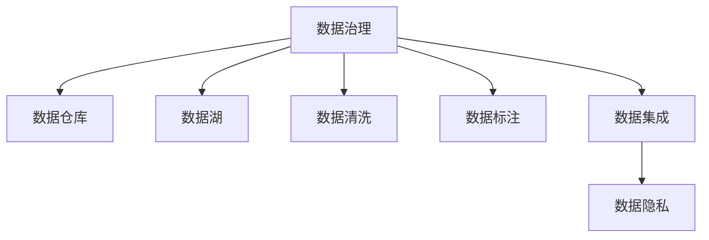

                 

# AI创业：数据管理的核心最佳实践

> 关键词：AI创业, 数据管理, 核心最佳实践, 数据治理, 数据仓库, 数据湖, 数据清洗, 数据标注, 数据集成

## 1. 背景介绍

### 1.1 问题由来

在当今的AI创业浪潮中，数据管理的重要性愈发凸显。AI技术的本质是数据的映射和转换，高效、可靠的数据管理不仅是实现AI算法创新的基础，更是推动AI创业成功的核心动力。然而，在实际应用中，数据管理的复杂性、数据质量的不确定性以及数据处理的瓶颈，常常成为制约AI项目成功落地的关键因素。

### 1.2 问题核心关键点

本文将重点讨论以下几个核心问题：

- 数据治理：如何确保数据的质量、安全、合规和一致性？
- 数据仓库与数据湖：哪种数据存储方式更适合创业企业？
- 数据清洗与标注：如何快速、有效地处理海量数据？
- 数据集成：如何构建高效、可扩展的数据管道？
- 数据隐私与安全：如何在AI应用中保护用户隐私？

这些问题不仅决定了AI项目的成败，更是对创业企业数据管理能力的考验。通过深入分析这些问题，本文旨在为AI创业者提供实用的数据管理建议，助力企业在AI技术的道路上行稳致远。

## 2. 核心概念与联系

### 2.1 核心概念概述

为更好地理解AI创业中的数据管理，本节将介绍几个关键概念：

- **数据治理(Data Governance)**：确保数据的准确性、完整性、一致性和安全性，从而为数据驱动的AI应用奠定基础。
- **数据仓库(Data Warehouse)**：一种专门用于存储和查询数据的集中式数据库系统，常用于支持复杂的数据分析和决策支持。
- **数据湖(Data Lake)**：一种弹性、灵活的数据存储技术，可以存储和处理结构化和非结构化数据，适用于大数据分析。
- **数据清洗(Data Cleaning)**：清洗数据中的噪音和错误，提取和转换有用的信息，提升数据质量。
- **数据标注(Data Labeling)**：给数据打上标签，用于监督学习模型的训练，提高模型的准确性和泛化能力。
- **数据集成(Data Integration)**：将多个数据源的数据合并成一个统一的数据集，供数据分析和模型训练使用。
- **数据隐私(Data Privacy)**：在数据处理和应用中保护用户隐私，遵循相关法律法规和行业标准。

这些概念之间通过以下Mermaid流程图来展示：



这个流程图展示了数据治理与其他数据管理概念之间的逻辑关系：

1. 数据治理贯穿数据管理的全过程，确保数据的质量和安全。
2. 数据仓库和数据湖是数据存储的主要方式，各有优缺点，需根据企业需求选择。
3. 数据清洗和标注是提升数据质量的关键步骤，数据集成是数据融合的基础。
4. 数据隐私是数据管理的重要考量，确保合规性和用户信任。

## 3. 核心算法原理 & 具体操作步骤

### 3.1 算法原理概述

AI创业中的数据管理，本质上是一个多步骤、多层次的管理流程，涉及数据的收集、存储、清洗、标注、集成和隐私保护等多个环节。其核心在于通过数据治理策略和实践，确保数据的可用性和质量，从而支撑AI应用的持续优化和创新。

### 3.2 算法步骤详解

#### 3.2.1 数据收集

- **步骤1：选择数据源**
  - 确定数据来源，包括企业内部数据、公共数据集、第三方API等。
  - 评估数据源的质量、时效性和可获得性。

- **步骤2：数据集成**
  - 使用ETL工具（Extract, Transform, Load）将不同数据源的数据合并到一个统一的存储库中。
  - 处理数据格式和结构不统一的问题，进行数据标准化。

#### 3.2.2 数据清洗

- **步骤1：初步筛选**
  - 删除重复、无效或不符合规范的数据记录。
  - 处理缺失值和异常值，填充或删除不完整的数据。

- **步骤2：深入清洗**
  - 识别并修正数据中的噪音和错误，如拼写错误、格式错误等。
  - 使用数据清洗工具和算法自动化处理复杂清洗任务。

#### 3.2.3 数据标注

- **步骤1：选择标注工具**
  - 根据数据类型和任务需求选择合适的标注工具，如Labelbox、Tagglio等。
  - 确保标注工具易于使用，支持多种数据格式和标注类型。

- **步骤2：数据标注**
  - 通过人工标注或自动标注工具，为数据打上标签，如分类标签、关系标签等。
  - 使用机器学习模型进行辅助标注，提升标注效率和准确性。

#### 3.2.4 数据存储

- **步骤1：选择存储方式**
  - 根据企业需求和数据类型，选择数据仓库或数据湖作为数据存储方式。
  - 评估存储成本、扩展性和安全性等因素。

- **步骤2：数据分区和索引**
  - 对数据进行分区和索引，提高查询和分析的效率。
  - 使用列式存储或列群式存储提升读写性能。

#### 3.2.5 数据治理

- **步骤1：制定数据治理策略**
  - 制定数据质量管理、数据安全和隐私保护等政策。
  - 明确数据所有权、数据使用和访问权限。

- **步骤2：实施数据治理**
  - 使用数据治理工具监控数据质量和安全。
  - 定期审计数据治理效果，改进治理策略。

### 3.3 算法优缺点

AI创业中的数据管理具有以下优点：

- **高效性**：通过自动化数据清洗和标注，快速提升数据质量。
- **灵活性**：数据仓库和数据湖提供灵活的数据存储和查询方式。
- **可扩展性**：能够处理大规模数据集，支持多种数据类型。

然而，也存在以下缺点：

- **复杂性**：数据清洗和标注任务复杂，需要投入大量人力。
- **成本高**：高质量的数据源和存储设施成本较高。
- **隐私风险**：数据隐私保护需要严格遵守法律法规，防止数据泄露。

### 3.4 算法应用领域

AI创业中的数据管理技术，广泛应用于以下领域：

- **金融科技(FinTech)**：通过数据治理和分析，提高金融产品的个性化推荐和风险控制。
- **医疗健康**：利用数据清洗和标注，提升医学影像分析和患者病历管理。
- **智能制造**：通过数据集成和治理，优化生产流程和设备维护。
- **零售电商**：通过数据清洗和分析，提高客户行为预测和个性化营销。
- **智慧城市**：通过数据集成和治理，优化城市交通、公共安全和环境监测。

这些领域的数据管理需求各不相同，但都依赖于高效的数据治理和分析来支撑AI应用的创新和发展。

## 4. 数学模型和公式 & 详细讲解

### 4.1 数学模型构建

数据管理的核心在于对数据质量、安全性和隐私性的控制。下面我们将通过数学模型来形式化地描述这一过程。

设 $D$ 为数据集，$T$ 为数据治理策略集合，$L$ 为数据标注过程，$S$ 为数据存储方式。数据管理的数学模型可表示为：

$$
M(D, T, L, S) = \min \{ f(D, T, L, S) \}
$$

其中，$f(D, T, L, S)$ 为数据管理的损失函数，衡量数据处理过程中各个环节的效率和效果。

### 4.2 公式推导过程

以数据清洗为例，假设数据集 $D$ 中存在 $N$ 个数据点，每个数据点包含 $d$ 个特征，其中 $n$ 个数据点存在缺失值。数据清洗的损失函数可定义为：

$$
\mathcal{L}_{clean}(D) = \sum_{i=1}^{N} \sum_{j=1}^{d} \mathbb{I}_{m_j}(x_i)
$$

其中，$\mathbb{I}_{m_j}$ 为缺失值检测函数，当特征 $j$ 存在缺失值时，$\mathbb{I}_{m_j}=1$，否则为0。

### 4.3 案例分析与讲解

假设一个电商平台的销售数据集，包含用户行为、产品信息、订单信息等。数据清洗的步骤如下：

1. **初步筛选**：
   - 删除重复订单记录。
   - 去除无效交易信息。

2. **深入清洗**：
   - 填补缺失的订单价格。
   - 修正拼写错误的用户ID。

3. **数据标注**：
   - 为订单打上标签，如订单状态（已付款、已发货、已收货）。
   - 标注用户行为（浏览、点击、购买）。

4. **数据存储**：
   - 将清洗后的数据存入数据仓库或数据湖中。
   - 对数据进行分区和索引，提高查询效率。

## 5. 项目实践：代码实例和详细解释说明

### 5.1 开发环境搭建

为便于读者理解数据管理的实现过程，本文将提供一个基于Python和Pandas的数据清洗示例。

**步骤1：安装Python和Pandas**
```bash
pip install pandas
```

**步骤2：准备数据集**
```python
import pandas as pd

# 读取数据集
data = pd.read_csv('sales_data.csv')
```

### 5.2 源代码详细实现

以下是一个数据清洗的Python代码实现：

```python
import pandas as pd
import numpy as np

# 读取数据集
data = pd.read_csv('sales_data.csv')

# 初步筛选
data.drop_duplicates(inplace=True)
data = data[data['transaction_date'].notna()]

# 深入清洗
data.fillna(method='ffill', inplace=True)

# 数据标注
data['order_status'] = data['transaction_status'].apply(lambda x: '已付款' if x == 1 else '未付款')
data['user_behavior'] = data['user_activity'].apply(lambda x: '浏览' if x == 0 else '购买')

# 数据存储
data.to_csv('cleaned_data.csv', index=False)
```

### 5.3 代码解读与分析

- **初步筛选**：
  - 使用 `drop_duplicates()` 删除重复记录。
  - 使用 `notna()` 过滤缺失日期的数据。

- **深入清洗**：
  - 使用 `fillna()` 函数进行前向填充，填补缺失价格。

- **数据标注**：
  - 使用 `apply()` 函数进行自定义标注，将交易状态转换为订单状态，将用户行为标记为浏览或购买。

- **数据存储**：
  - 使用 `to_csv()` 将清洗后的数据存入本地文件。

## 6. 实际应用场景

### 6.1 金融科技

在金融科技领域，数据管理对风险控制和个性化推荐至关重要。通过数据治理和清洗，金融机构能够构建准确的风险评估模型，及时识别和防范潜在的金融风险。同时，利用数据标注和分析，金融机构可以为用户提供个性化贷款、投资和理财建议。

### 6.2 医疗健康

在医疗健康领域，数据管理对于疾病诊断和治疗方案的制定起着关键作用。通过数据清洗和标注，医疗机构能够提高医学影像分析的准确性，优化患者病历管理，提升医疗服务的质量和效率。

### 6.3 智能制造

在智能制造领域，数据管理对生产流程优化和设备维护至关重要。通过数据集成和治理，企业能够实时监控生产状态，预测设备故障，优化生产计划，提高生产效率和产品质量。

### 6.4 未来应用展望

未来，随着数据管理的不断发展，数据驱动的AI应用将变得更加智能化和普及化。通过提升数据治理的自动化和智能化水平，数据管理将能够更好地支持AI创新，助力更多行业实现数字化转型。

## 7. 工具和资源推荐

### 7.1 学习资源推荐

为帮助读者全面掌握数据管理技术，推荐以下学习资源：

1. **《数据治理之道》**：一本详细介绍数据治理策略和实践的书籍，涵盖数据质量管理、数据安全和隐私保护等内容。
2. **《数据湖与大数据技术》**：介绍数据湖的基本概念和设计原则，适合初学者学习。
3. **Coursera《数据清洗与预处理》课程**：由知名高校和专家教授的在线课程，系统讲解数据清洗和预处理技巧。
4. **Hugging Face的博客和文档**：提供大量数据管理工具和案例的详细讲解和代码示例。

### 7.2 开发工具推荐

以下是几款常用的数据管理工具：

1. **ETL工具**：如Apache Nifi、Talend、AWS Glue等，支持数据集成、清洗和转换。
2. **数据标注工具**：如Labelbox、Tagglio、SAM等，提供高效的数据标注和审核功能。
3. **数据仓库工具**：如Apache Hive、Amazon Redshift、Google BigQuery等，支持大规模数据存储和分析。
4. **数据治理工具**：如Collibra、Informatica、IBM InfoSphere等，提供数据质量监控和治理功能。

### 7.3 相关论文推荐

以下是几篇重要的数据管理相关论文：

1. **《数据治理：从概念到实践》**：探讨数据治理的策略和实践，提供实际案例和最佳实践。
2. **《数据仓库技术的发展与未来》**：介绍数据仓库的基本概念和技术发展历程，展望未来发展方向。
3. **《大数据中的数据清洗技术》**：详细讲解数据清洗的方法和工具，适合实践应用。
4. **《数据隐私保护技术综述》**：总结数据隐私保护的技术和挑战，提供前沿研究成果。

## 8. 总结：未来发展趋势与挑战

### 8.1 总结

本文对AI创业中的数据管理进行了全面系统介绍，从数据治理、数据存储、数据清洗、数据标注、数据集成和数据隐私等多个方面进行了详细讲解。通过案例分析和技术实现，展示了数据管理在AI创业中的核心价值。

### 8.2 未来发展趋势

未来，数据管理技术将呈现以下发展趋势：

1. **自动化和智能化**：自动化数据清洗和标注技术将逐渐成熟，人工智能算法将进一步提升数据处理效率。
2. **实时化和即时化**：实时数据管理和即时数据处理将成为主流，满足业务需求的实时响应。
3. **融合和协同**：数据管理将与其他AI技术（如自然语言处理、计算机视觉等）深度融合，形成更加智能的数据生态系统。
4. **隐私保护和合规性**：数据隐私保护将受到更多重视，符合GDPR等法律法规的数据治理框架将进一步完善。

### 8.3 面临的挑战

尽管数据管理技术不断进步，但在实际应用中仍面临以下挑战：

1. **数据质量的不稳定性**：数据源的多样性和复杂性导致数据质量难以保证，需要进行持续监控和治理。
2. **数据安全和隐私保护**：数据隐私泄露和数据滥用问题依然严峻，需要制定严格的安全策略和措施。
3. **数据整合和协同**：多源数据整合和协同处理技术需要进一步提升，以支持复杂的数据应用场景。
4. **资源和成本问题**：高质量的数据源和存储设施成本较高，需要平衡成本和收益。
5. **技术复杂性和落地难度**：数据治理和管理的复杂性要求团队具备高水平的技术和经验。

### 8.4 研究展望

面对数据管理中的挑战，未来的研究需要在以下几个方面寻求新的突破：

1. **自动化和智能化技术**：开发更加智能的数据清洗和标注工具，提升数据处理效率和质量。
2. **实时数据处理技术**：研究实时数据流处理和存储技术，支持即时数据管理和分析。
3. **隐私保护和合规技术**：提出更加有效的隐私保护算法和合规策略，确保数据安全。
4. **数据整合和协同工具**：开发数据融合和协同工具，支持复杂的数据应用场景。
5. **资源优化和成本控制**：研究高效的数据存储和压缩技术，降低数据管理成本。

## 9. 附录：常见问题与解答

**Q1：如何选择数据源和数据存储方式？**

A: 选择数据源和数据存储方式应考虑企业需求和数据特性。数据仓库适用于结构化数据，能够提供强大的查询和分析能力；数据湖适用于非结构化数据，能够灵活存储和处理大规模数据。在选择时，需综合考虑数据量、数据类型、查询需求、存储成本等因素。

**Q2：如何进行高效的数据清洗？**

A: 数据清洗需要结合具体场景和数据特点，使用多种技术手段。首先进行初步筛选，删除重复和无效记录；然后进行深入清洗，填补缺失值和修正错误；最后进行数据标注，提升数据质量。可以使用自动化工具如Pandas、Apache Nifi等进行清洗和标注。

**Q3：如何在数据治理中确保数据隐私和安全？**

A: 数据隐私和安全是数据管理的重要考量。需制定严格的数据访问和处理规则，使用加密技术和匿名化处理保护数据；同时定期进行安全审计和风险评估，及时发现和修复安全漏洞。

**Q4：如何进行数据标注和训练？**

A: 数据标注可以通过人工标注或机器学习模型辅助进行。选择适合的标注工具，如Labelbox、Tagglio等，进行数据标注。标注完成后，使用监督学习算法训练模型，提升模型准确性和泛化能力。

**Q5：如何在AI应用中保护用户隐私？**

A: 数据隐私保护需遵循GDPR等法律法规，使用数据匿名化和脱敏技术。在设计AI应用时，应明确用户数据的使用范围和权限，避免不当使用和泄露。同时，建立数据使用和访问的监管机制，确保数据处理的透明性和可追溯性。

通过本文的深入分析，我们看到了数据管理在AI创业中的重要性和复杂性。只有在数据治理、数据存储、数据清洗、数据标注、数据集成和数据隐私等方面做好管理，才能真正发挥数据驱动的AI应用的潜力，助力企业取得成功。

