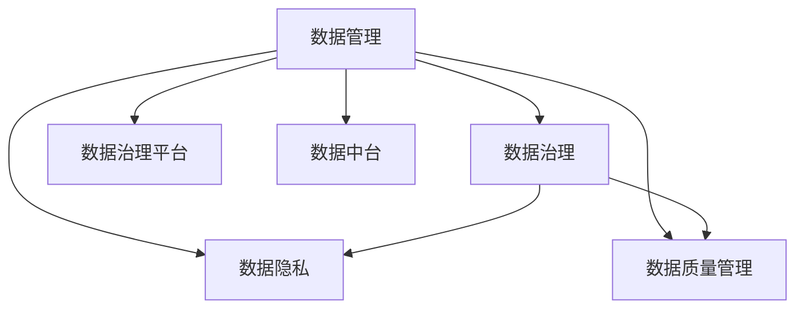

                 

# AI创业：数据管理的策略与实践研究

> 关键词：数据管理，策略，人工智能，创业，策略与实践

## 1. 背景介绍

### 1.1 问题由来
在人工智能创业领域，数据管理是至关重要的环节。随着人工智能技术的发展，越来越多的初创公司开始依赖数据驱动决策，从市场分析、产品优化到用户推荐，数据都发挥着不可替代的作用。然而，数据管理的复杂性和多样性，使得不少公司在这方面遇到了严峻挑战。如何有效地管理和利用数据，成为了人工智能创业公司亟待解决的问题。

### 1.2 问题核心关键点
数据管理涉及到数据收集、存储、处理、分析等多个方面。对于AI创业公司来说，数据管理不仅需要技术上的支持，更需要一套完善的数据管理策略，以确保数据的质量、安全、合规，同时能够支撑业务发展。本文将从数据管理的核心策略出发，探讨如何通过数据管理的科学方法，推动AI创业公司的健康发展。

## 2. 核心概念与联系

### 2.1 核心概念概述

为更好地理解数据管理的策略与实践，本节将介绍几个核心概念：

- 数据管理(Data Management)：指从数据获取、存储、处理、分析到共享和销毁的全生命周期管理过程。通过有效的数据管理，可以提升数据质量，提高数据使用效率，确保数据安全合规。
- 数据治理(Data Governance)：通过制定和执行数据管理规范，确保数据的准确性、完整性、一致性和可用性，实现数据的有效管理和利用。
- 数据隐私(Data Privacy)：在数据管理的全过程中，确保用户数据的安全和隐私，防止数据泄露和滥用。
- 数据质量管理(Data Quality Management)：通过数据清洗、标准化、验证等方法，提高数据的一致性和可靠性，保证数据质量。
- 数据治理平台(Data Governance Platform)：用于支持数据治理功能的软件系统，包括数据管理、数据质量、数据安全等功能模块。
- 数据中台(Data Lake/Data Hub)：一种集成的数据管理和分析平台，提供数据集成、数据存储、数据处理、数据治理等功能，支持数据的全生命周期管理。

这些核心概念之间的逻辑关系可以通过以下Mermaid流程图来展示：



这个流程图展示了数据管理的核心概念及其之间的关系：

1. 数据管理是数据治理、数据隐私、数据质量管理的基础。
2. 数据治理平台和数据中台为数据管理的各个环节提供了技术支持。
3. 数据隐私和数据质量管理是数据管理的两个重要方面，确保数据的安全和准确性。

## 3. 核心算法原理 & 具体操作步骤
### 3.1 算法原理概述

数据管理的策略与实践，本质上是基于数据治理理论和技术的一系列操作过程。其核心思想是通过科学的数据治理策略，确保数据的质量、安全、合规，同时能够支撑业务发展。数据管理的策略包括：

1. 数据收集：从多个数据源收集数据，构建统一的数据池。
2. 数据存储：选择合适的数据存储解决方案，确保数据的高效访问和存储。
3. 数据处理：通过清洗、标准化、验证等方法，提高数据质量。
4. 数据分析：利用数据挖掘、机器学习等技术，从数据中提取有价值的信息。
5. 数据共享：通过数据访问和共享机制，支持业务发展和决策支持。
6. 数据销毁：在数据生命周期结束时，进行安全销毁，防止数据泄露。

### 3.2 算法步骤详解

数据管理的策略与实践，主要包括以下几个关键步骤：

**Step 1: 数据收集和清洗**

- 确定数据源：收集来自不同渠道的数据，包括内部业务系统、第三方API、公开数据集等。
- 数据清洗：去除重复、错误、缺失的数据，进行标准化处理。

**Step 2: 数据存储和部署**

- 选择合适的存储解决方案：根据数据量和访问需求，选择关系型数据库、NoSQL数据库、分布式存储等。
- 数据部署：将数据存储在云平台或本地服务器上，根据业务需求进行部署。

**Step 3: 数据处理和质量管理**

- 数据标准化：对不同数据源的数据进行统一化处理，确保数据的一致性。
- 数据验证：通过验证和校验，确保数据的准确性和完整性。
- 数据质量管理：利用数据质量管理工具，进行数据质量评估和提升。

**Step 4: 数据分析和应用**

- 数据分析：利用数据挖掘、机器学习等技术，从数据中提取有用的信息和洞见。
- 业务应用：将数据分析结果应用于产品优化、市场分析、用户推荐等业务场景中。

**Step 5: 数据共享和保护**

- 数据共享机制：建立数据访问和共享机制，支持业务发展和决策支持。
- 数据安全保护：通过加密、访问控制等技术，确保数据的安全和隐私。

**Step 6: 数据销毁和合规**

- 数据销毁：在数据生命周期结束时，进行安全销毁，防止数据泄露。
- 合规管理：确保数据管理的各个环节符合相关法律法规和行业标准。

### 3.3 算法优缺点

数据管理的策略与实践，具有以下优点：

1. 提升数据质量：通过科学的数据治理策略，确保数据的一致性、准确性和完整性，提升数据质量。
2. 保障数据安全：通过数据加密、访问控制等措施，确保数据的安全和隐私，防止数据泄露。
3. 支持业务发展：数据管理策略能够支撑业务决策和发展，提供数据驱动的业务洞见。
4. 符合合规要求：通过数据治理平台和数据中台，确保数据管理的各个环节符合相关法律法规和行业标准。

同时，该方法也存在一定的局限性：

1. 数据来源复杂：数据管理的复杂性在于数据来源的多样性，不同数据源的数据格式和质量参差不齐。
2. 技术要求高：数据治理平台和数据中台需要高度技术支持的实现，对于技术团队的要求较高。
3. 成本高昂：数据存储和处理的成本较高，需要投入大量的资源和技术支持。
4. 实施周期长：数据管理的策略与实践涉及多个环节，实施周期较长。
5. 技术更新快：数据管理和分析技术快速演进，需要持续跟进最新的技术发展。

尽管存在这些局限性，但就目前而言，基于数据治理的策略与实践方法仍是数据管理的主流范式。未来相关研究的重点在于如何进一步优化数据治理策略，提高数据管理的效率和效果，同时兼顾成本和合规等因素。

### 3.4 算法应用领域

数据管理的策略与实践，在人工智能创业领域已经得到了广泛的应用，覆盖了几乎所有数据密集型业务，例如：

- 市场分析：利用数据分析技术，预测市场趋势，优化营销策略。
- 用户推荐：通过分析用户行为数据，提供个性化的产品推荐。
- 风险管理：利用数据挖掘技术，识别和评估风险因素，优化风险控制。
- 产品优化：通过数据分析，优化产品设计和功能，提升用户体验。
- 运营监控：通过实时数据监控，提升运营效率，降低运营成本。
- 数据驱动决策：利用数据管理平台，支持数据驱动的业务决策。

除了上述这些经典应用外，数据管理策略还广泛应用到更多场景中，如智能客服、金融风控、物流优化等，为人工智能创业公司提供了坚实的技术支持。

## 4. 数学模型和公式 & 详细讲解  
### 4.1 数学模型构建

本节将使用数学语言对数据管理的策略与实践进行更加严格的刻画。

记数据管理平台的数据集合为 $D$，数据治理策略为 $S$。假设 $D$ 中的数据项 $d_i$ 经过治理策略 $S$ 处理后，生成新的数据项 $d'_i$。数据管理的优化目标是最小化数据治理过程中的误差，即：

$$
\min_{S} \sum_{i=1}^N \|d_i - d'_i\|
$$

其中，$\|d_i - d'_i\|$ 为数据项 $d_i$ 和 $d'_i$ 之间的误差。

### 4.2 公式推导过程

以下我们以数据质量管理为例，推导数据质量评估的数学公式及其梯度计算。

假设数据集 $D$ 包含 $N$ 个数据项 $d_i$，每个数据项有 $k$ 个特征 $x_{i,j}$。数据质量管理的目标是最大化数据的质量指标 $Q$，如准确性、完整性、一致性等。可以定义一个质量函数 $Q(S)$ 来衡量数据治理策略 $S$ 对数据质量的影响。

设质量函数 $Q(S)$ 为：

$$
Q(S) = \sum_{i=1}^N \sum_{j=1}^k \phi(d'_{i,j})
$$

其中，$\phi(d'_{i,j})$ 为第 $i$ 个数据项的第 $j$ 个特征 $d'_{i,j}$ 的质量指标函数。

数据质量管理的目标是最小化误差，因此可以定义误差函数 $L(S)$：

$$
L(S) = \frac{1}{N} \sum_{i=1}^N \sum_{j=1}^k (d_{i,j} - d'_{i,j})^2
$$

通过优化误差函数 $L(S)$，可以调整数据治理策略 $S$，提升数据质量。

根据链式法则，误差函数 $L(S)$ 对策略 $S$ 的梯度为：

$$
\nabla_{S} L(S) = \frac{2}{N} \sum_{i=1}^N \sum_{j=1}^k (d_{i,j} - d'_{i,j}) \frac{\partial d'_{i,j}}{\partial S}
$$

其中 $\frac{\partial d'_{i,j}}{\partial S}$ 为数据项 $d'_{i,j}$ 对治理策略 $S$ 的偏导数，可以通过自动微分技术计算得到。

在得到误差函数的梯度后，即可带入优化算法，最小化误差函数 $L(S)$，得到最优的数据治理策略 $S^*$。

### 4.3 案例分析与讲解

假设我们有一份用户消费记录数据，需要对其进行数据清洗和质量管理。具体步骤如下：

**Step 1: 数据清洗**

- 去除重复数据：通过去重操作，去除相同的用户消费记录。
- 处理缺失值：对于缺失值，可以通过插值、填充等方法进行补充。
- 数据标准化：对数据进行标准化处理，如日期格式统一、金额单位统一等。

**Step 2: 数据质量管理**

- 准确性验证：通过校验数据的一致性和逻辑性，确保数据的准确性。
- 完整性检查：检查数据是否完整，是否有必要添加缺失数据。
- 一致性检查：检查数据的一致性，确保同一用户在不同时间点的消费记录一致。

**Step 3: 数据分析和应用**

- 用户行为分析：通过分析用户消费记录，识别用户消费习惯和偏好。
- 消费趋势预测：利用时间序列分析技术，预测未来的消费趋势。
- 个性化推荐：根据用户消费记录，提供个性化的商品推荐。

**Step 4: 数据共享和保护**

- 数据访问控制：设置数据访问权限，确保数据的安全。
- 数据加密：对数据进行加密，防止数据泄露。

**Step 5: 数据销毁和合规**

- 数据生命周期管理：根据数据生命周期策略，定期删除不再使用的数据。
- 合规审查：确保数据管理的各个环节符合相关法律法规和行业标准。

## 5. 项目实践：代码实例和详细解释说明
### 5.1 开发环境搭建

在进行数据管理的策略与实践前，我们需要准备好开发环境。以下是使用Python进行PySpark开发的环境配置流程：

1. 安装Anaconda：从官网下载并安装Anaconda，用于创建独立的Python环境。

2. 创建并激活虚拟环境：
```bash
conda create -n data-management python=3.8 
conda activate data-management
```

3. 安装PySpark：根据CUDA版本，从官网获取对应的安装命令。例如：
```bash
conda install pyspark=3.3.2
```

4. 安装各类工具包：
```bash
pip install numpy pandas scikit-learn matplotlib tqdm jupyter notebook ipython
```

完成上述步骤后，即可在`data-management`环境中开始数据管理实践。

### 5.2 源代码详细实现

下面我以用户行为分析为例，给出使用PySpark对用户消费记录进行数据清洗和质量管理的Python代码实现。

首先，定义数据清洗函数：

```python
from pyspark.sql import SparkSession
from pyspark.sql.functions import col, split, explode, when

spark = SparkSession.builder.appName('UserBehaviorAnalysis').getOrCreate()

# 定义数据清洗函数
def clean_data(df):
    # 去除重复数据
    df = df.drop_duplicates()

    # 处理缺失值
    df = df.dropna()

    # 数据标准化
    df = df.withColumn('amount', col('amount').fillna(0)) \
        .withColumn('date', col('date').fillna('')) \
        .withColumn('product', col('product').fillna('')) \
        .withColumn('category', col('category').fillna('')) \
        .withColumn('timestamp', col('timestamp').fillna('')) \
        .withColumn('region', col('region').fillna('')) \
        .withColumn('user_id', col('user_id').fillna(''))
    
    return df

# 读取原始数据
df = spark.read.csv('user_consumption.csv', header=True, inferSchema=True)

# 数据清洗
cleaned_df = clean_data(df)
```

然后，定义数据质量管理函数：

```python
from pyspark.sql.functions import col, when, isnull

# 定义数据质量管理函数
def manage_data_quality(df):
    # 准确性验证
    df = df.withColumn('accurate', col('amount') == col('amount').over('partition by user_id'))

    # 完整性检查
    df = df.withColumn('complete', col('timestamp') != None)

    # 一致性检查
    df = df.withColumn('consistent', col('amount') == col('amount').over('partition by user_id'))

    return df
```

最后，启动数据管理流程并在测试集上评估：

```python
# 数据质量管理
df_quality = manage_data_quality(cleaned_df)

# 数据分析
from pyspark.sql.functions import count, avg

df_quality.groupBy('user_id') \
    .agg(count('accurate').alias('accurate_count'), count('complete').alias('complete_count'), count('consistent').alias('consistent_count')) \
    .show()

# 数据共享和保护
# TODO: 在此处添加数据访问控制、数据加密等代码

# 数据销毁和合规
# TODO: 在此处添加数据生命周期管理和合规审查的代码
```

以上就是使用PySpark对用户消费记录进行数据清洗和质量管理的完整代码实现。可以看到，PySpark提供了一系列高效的数据处理功能，可以极大地简化数据管理的复杂性。

### 5.3 代码解读与分析

让我们再详细解读一下关键代码的实现细节：

**clean_data函数**：
- 定义数据清洗函数，进行去重、缺失值处理、数据标准化等操作，确保数据的质量和一致性。

**manage_data_quality函数**：
- 定义数据质量管理函数，进行准确性验证、完整性检查、一致性检查等操作，确保数据的可靠性和可信度。

**数据管理流程**：
- 首先，读取原始数据，并调用clean_data函数进行数据清洗。
- 然后，调用manage_data_quality函数进行数据质量管理。
- 最后，使用PySpark进行数据分析和应用，如用户行为分析、消费趋势预测、个性化推荐等。
- 数据共享和保护、数据销毁和合规等环节，需要根据具体业务需求进行定制化设计和实现。

## 6. 实际应用场景
### 6.1 智能客服系统

基于数据管理的策略与实践，可以广泛应用于智能客服系统的构建。传统客服往往需要配备大量人力，高峰期响应缓慢，且一致性和专业性难以保证。而使用数据管理的智能客服系统，可以7x24小时不间断服务，快速响应客户咨询，用自然流畅的语言解答各类常见问题。

在技术实现上，可以收集企业内部的历史客服对话记录，将问题和最佳答复构建成监督数据，在此基础上对预训练模型进行微调。微调后的对话模型能够自动理解用户意图，匹配最合适的答案模板进行回复。对于客户提出的新问题，还可以接入检索系统实时搜索相关内容，动态组织生成回答。如此构建的智能客服系统，能大幅提升客户咨询体验和问题解决效率。

### 6.2 金融舆情监测

金融机构需要实时监测市场舆论动向，以便及时应对负面信息传播，规避金融风险。传统的人工监测方式成本高、效率低，难以应对网络时代海量信息爆发的挑战。基于数据管理的金融舆情监测系统，可以自动分析和评估网络舆情，及时发现和预警金融风险，帮助金融机构快速应对潜在风险。

具体而言，可以收集金融领域相关的新闻、报道、评论等文本数据，并对其进行主题标注和情感标注。在此基础上对预训练语言模型进行微调，使其能够自动判断文本属于何种主题，情感倾向是正面、中性还是负面。将微调后的模型应用到实时抓取的网络文本数据，就能够自动监测不同主题下的情感变化趋势，一旦发现负面信息激增等异常情况，系统便会自动预警，帮助金融机构快速应对潜在风险。

### 6.3 个性化推荐系统

当前的推荐系统往往只依赖用户的历史行为数据进行物品推荐，无法深入理解用户的真实兴趣偏好。基于数据管理的个性化推荐系统，可以更好地挖掘用户行为背后的语义信息，从而提供更精准、多样的推荐内容。

在实践中，可以收集用户浏览、点击、评论、分享等行为数据，提取和用户交互的物品标题、描述、标签等文本内容。将文本内容作为模型输入，用户的后续行为（如是否点击、购买等）作为监督信号，在此基础上微调预训练语言模型。微调后的模型能够从文本内容中准确把握用户的兴趣点。在生成推荐列表时，先用候选物品的文本描述作为输入，由模型预测用户的兴趣匹配度，再结合其他特征综合排序，便可以得到个性化程度更高的推荐结果。

### 6.4 未来应用展望

随着数据管理和策略与实践的发展，未来在更多领域得到应用，为传统行业数字化转型升级提供新的技术路径。

在智慧医疗领域，基于数据管理的医疗问答、病历分析、药物研发等应用将提升医疗服务的智能化水平，辅助医生诊疗，加速新药开发进程。

在智能教育领域，数据管理可应用于作业批改、学情分析、知识推荐等方面，因材施教，促进教育公平，提高教学质量。

在智慧城市治理中，数据管理可应用于城市事件监测、舆情分析、应急指挥等环节，提高城市管理的自动化和智能化水平，构建更安全、高效的未来城市。

此外，在企业生产、社会治理、文娱传媒等众多领域，基于数据管理的AI应用也将不断涌现，为经济社会发展注入新的动力。相信随着技术的日益成熟，数据管理的策略与实践必将在构建人机协同的智能时代中扮演越来越重要的角色。

## 7. 工具和资源推荐
### 7.1 学习资源推荐

为了帮助开发者系统掌握数据管理的策略与实践的理论基础和实践技巧，这里推荐一些优质的学习资源：

1. 《数据管理与治理：原则、实践与技术》书籍：全面介绍数据管理与治理的理论和技术，涵盖数据收集、存储、处理、分析等多个环节。

2. 《数据治理基础》课程：由数据管理专家授课，系统讲解数据治理的核心理论和方法。

3. 《数据质量管理》书籍：介绍数据质量管理的核心概念、技术和工具，帮助开发者提升数据质量管理能力。

4. 《Python数据科学手册》书籍：通过实际案例，详细讲解使用Python进行数据分析和可视化的全过程。

5. 《Apache Spark实战》书籍：深入解析Apache Spark的原理和应用，为大数据处理提供技术支持。

6. 《数据治理平台建设实践》博客：分享数据治理平台建设的实践经验和最佳实践。

通过对这些资源的学习实践，相信你一定能够快速掌握数据管理的精髓，并用于解决实际的业务问题。

### 7.2 开发工具推荐

高效的开发离不开优秀的工具支持。以下是几款用于数据管理开发的常用工具：

1. Apache Spark：开源的分布式计算框架，支持大规模数据处理和分析，是数据管理的重要技术支撑。

2. Apache Hadoop：开源的分布式文件系统，支持海量数据的存储和管理，是数据管理的基础设施。

3. MySQL/PostgreSQL：关系型数据库，支持结构化数据的存储和管理。

4. MongoDB/Redis：NoSQL数据库，支持非结构化数据的存储和管理。

5. ELK Stack：日志管理和监控工具，支持数据收集和分析。

6. Prometheus/Grafana：时序数据管理和可视化工具，支持实时数据监控和分析。

合理利用这些工具，可以显著提升数据管理的开发效率，加快创新迭代的步伐。

### 7.3 相关论文推荐

数据管理的研究源于学界的持续研究。以下是几篇奠基性的相关论文，推荐阅读：

1. "A Survey on Data Governance: From Definitions to Technologies"（《数据治理：定义与技术的综述》）：介绍了数据治理的核心理论、技术和方法。

2. "Data Governance as a Framework for Data Management and Usage"（《数据治理作为数据管理和使用的框架》）：提出了数据治理的框架和实施步骤。

3. "Big Data Management and Governance: Strategies and Challenges"（《大数据管理与治理：策略与挑战》）：讨论了大数据环境下数据管理与治理的策略和挑战。

4. "Data Quality Management in Big Data Ecosystems"（《大数据生态系统中的数据质量管理》）：介绍了大数据环境下的数据质量管理技术。

5. "Data Governance Platforms: An Overview"（《数据治理平台综述》）：提供了数据治理平台的技术架构和功能介绍。

这些论文代表了大数据管理的发展脉络。通过学习这些前沿成果，可以帮助研究者把握学科前进方向，激发更多的创新灵感。

## 8. 总结：未来发展趋势与挑战

### 8.1 总结

本文对数据管理的策略与实践进行了全面系统的介绍。首先阐述了数据管理的核心理论和技术框架，明确了数据管理在数据驱动的业务发展中的重要价值。其次，从数据治理、数据隐私、数据质量管理等多个方面，详细讲解了数据管理的策略与实践，给出了具体的代码实例和解释说明。最后，探讨了数据管理在实际应用中的具体场景，展望了未来数据管理的发展趋势。

通过本文的系统梳理，可以看到，数据管理的策略与实践是数据驱动的AI创业公司的关键支撑。通过科学的数据治理策略，可以确保数据的质量、安全、合规，同时能够支撑业务发展，提供数据驱动的决策支持。未来，随着数据管理和数据分析技术的持续进步，数据管理的策略与实践必将在更多的领域发挥重要作用，推动AI创业公司的持续创新和发展。

### 8.2 未来发展趋势

展望未来，数据管理的策略与实践将呈现以下几个发展趋势：

1. 数据治理自动化：通过自动化的数据治理工具，提升数据治理的效率和效果。例如，使用数据治理平台进行数据质量检测、数据源管理等。

2. 数据融合与共享：构建统一的数据湖或数据中台，实现不同数据源的融合和共享，提升数据使用效率。

3. 数据隐私保护：在数据治理的过程中，更加注重数据隐私保护，确保用户数据的安全和隐私。

4. 数据生命周期管理：通过数据生命周期管理策略，确保数据从生成到销毁的全生命周期内的质量和合规性。

5. 数据驱动的决策支持：利用数据管理和分析技术，提供更加科学、精准的决策支持。

6. 数据安全与合规：确保数据管理的各个环节符合相关法律法规和行业标准，提升数据治理的合规性。

以上趋势凸显了数据管理策略与实践的重要性，将继续推动AI创业公司的技术进步和业务发展。

### 8.3 面临的挑战

尽管数据管理的策略与实践在AI创业中已经取得了显著进展，但在迈向更加智能化、普适化应用的过程中，仍面临诸多挑战：

1. 数据质量管理：数据的质量参差不齐，清洗和标准化的过程繁琐耗时。

2. 数据治理复杂：不同数据源的数据格式和质量不一致，数据治理的难度较大。

3. 数据隐私保护：在数据共享和应用过程中，如何平衡数据安全和隐私保护是一大挑战。

4. 数据访问控制：如何设计合理的数据访问控制策略，确保数据的安全和合规，也是数据管理的重要难题。

5. 数据生命周期管理：数据生命周期管理涉及数据生成、存储、访问、销毁等多个环节，实现难度较大。

6. 数据技术演进：数据管理和分析技术快速演进，需要持续跟进最新的技术发展，保持技术领先。

正视数据管理面临的这些挑战，积极应对并寻求突破，将是大数据管理走向成熟的必由之路。相信随着学界和产业界的共同努力，这些挑战终将一一被克服，数据管理的策略与实践必将在构建人机协同的智能时代中扮演越来越重要的角色。

### 8.4 研究展望

面对数据管理面临的挑战，未来的研究需要在以下几个方面寻求新的突破：

1. 探索自动化数据治理技术。通过引入自动化、智能化的工具和算法，提高数据治理的效率和效果。例如，使用机器学习算法进行数据质量检测，使用自然语言处理技术进行数据标注和清洗。

2. 研究跨模态数据治理方法。随着多模态数据的增多，如何实现跨模态数据的融合和治理，是未来数据管理的重点研究方向。

3. 开发数据隐私保护技术。在数据治理的过程中，引入隐私保护技术，确保用户数据的安全和隐私。例如，使用差分隐私技术进行数据匿名化处理。

4. 引入区块链技术。利用区块链的不可篡改特性，确保数据的安全和完整性，增强数据治理的可信度和透明度。

5. 融合多领域数据治理方法。将不同领域的数据治理方法进行融合，提升数据治理的全面性和系统性。例如，将数据治理与业务规则、知识图谱等进行融合，实现更精准的数据治理。

这些研究方向将推动数据管理策略与实践的持续进步，为AI创业公司提供更加强大、可靠的数据治理技术支持。

## 9. 附录：常见问题与解答

**Q1：数据管理策略与实践是否适用于所有AI创业公司？**

A: 数据管理策略与实践在AI创业公司中具有广泛的应用价值，适用于大多数需要数据驱动的业务场景。但对于一些对数据依赖程度较低的业务，如视觉处理、语音识别等，数据管理的重要性相对较低。

**Q2：如何选择数据治理策略？**

A: 数据治理策略的选择应根据业务需求和数据特点进行，考虑数据来源、数据质量、数据安全和合规等因素。一般建议先从数据治理基础入手，逐步优化数据质量管理、数据隐私保护、数据共享机制等环节。

**Q3：数据管理平台如何设计？**

A: 数据管理平台的设计应包括数据采集、数据存储、数据处理、数据治理、数据应用等多个模块。需要根据业务需求和数据特点，选择合适的技术和工具进行实现。一般建议采用分布式计算框架和数据中台等技术，实现数据的集中管理和高效应用。

**Q4：如何提高数据管理的效率？**

A: 提高数据管理效率可以从多个方面入手，如使用自动化工具、优化数据处理流程、引入智能算法等。例如，使用数据治理平台进行自动化数据质量检测，使用机器学习算法进行数据预处理和清洗。

**Q5：数据管理在AI创业中扮演什么角色？**

A: 数据管理在AI创业中扮演着数据驱动决策的重要角色。通过科学的数据治理策略，可以确保数据的质量、安全、合规，同时能够支撑业务发展，提供数据驱动的决策支持。数据管理能够提升业务决策的科学性和精准性，推动AI创业公司的持续创新和发展。

通过本文的系统梳理，可以看到，数据管理的策略与实践是数据驱动的AI创业公司的关键支撑。通过科学的数据治理策略，可以确保数据的质量、安全、合规，同时能够支撑业务发展，提供数据驱动的决策支持。未来，随着数据管理和数据分析技术的持续进步，数据管理的策略与实践必将在更多的领域发挥重要作用，推动AI创业公司的持续创新和发展。

---

作者：禅与计算机程序设计艺术 / Zen and the Art of Computer Programming

