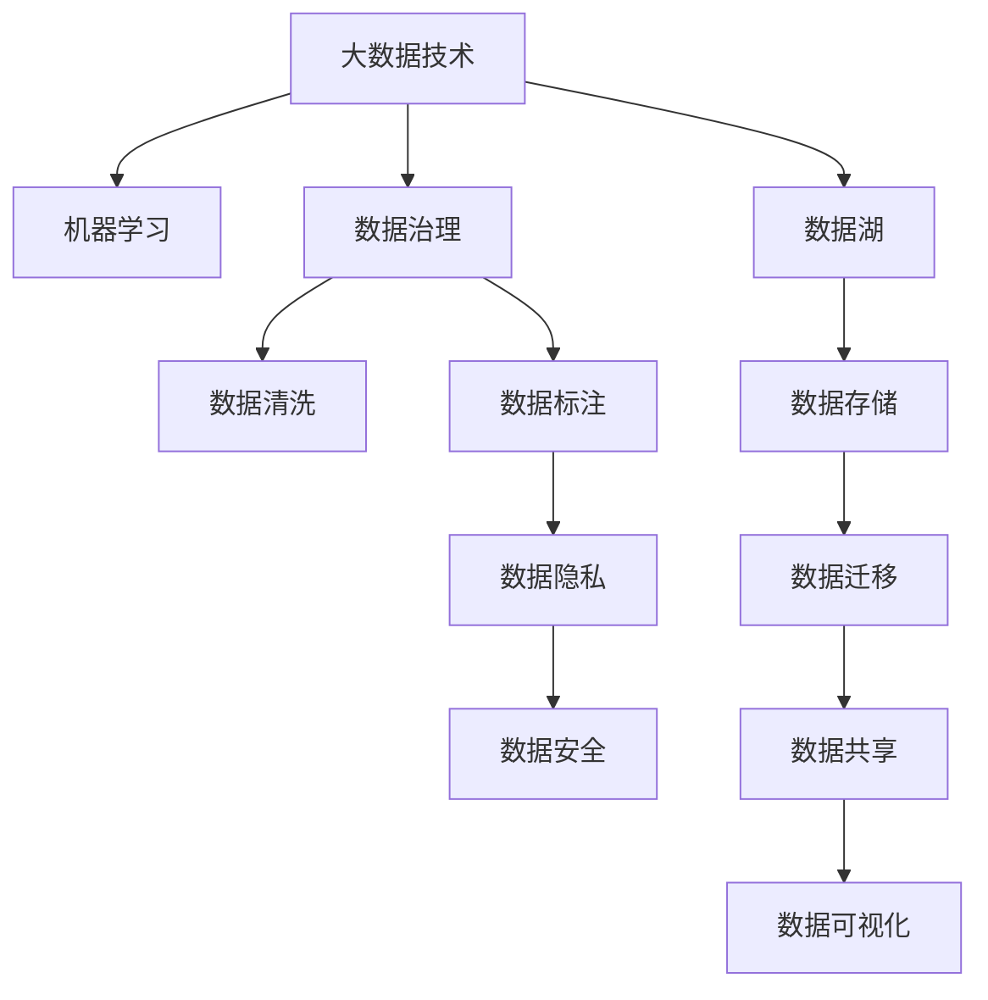

                 

# AI创业：数据管理的策略与工具

> 关键词：AI创业, 数据管理, 策略与工具, 大数据技术, 机器学习, 数据安全, 数据隐私

## 1. 背景介绍

### 1.1 问题由来

在人工智能（AI）的创业浪潮中，数据管理成为了一个不容忽视的关键环节。随着AI技术的不断进步，越来越多的创业公司开始依托数据驱动的AI模型来实现业务创新。然而，面对海量数据的管理挑战，许多创业公司往往陷入了数据管理的泥潭。

数据管理不仅涉及数据的存储、传输和处理，更重要的在于数据的治理和利用。数据的准确性、完整性、及时性和安全性直接决定了AI模型的效果和企业的商业价值。因此，如何在数据管理上取得突破，是AI创业公司成功的关键之一。

### 1.2 问题核心关键点

在AI创业中，数据管理的核心关键点主要包括以下几个方面：

1. **数据的获取与标注**：高质量的数据是AI模型性能提升的基础，如何高效获取、标注和筛选数据是数据管理的首要任务。
2. **数据存储与迁移**：不同数据源和数据格式的数据需要统一存储和管理，如何设计高效的存储架构，实现数据迁移和共享，是数据管理的难点。
3. **数据治理与清洗**：面对复杂多变的业务场景，如何自动发现并纠正数据中的错误，进行清洗和治理，以确保数据的质量和一致性。
4. **数据隐私与安全**：在数据收集和使用过程中，如何保护用户隐私，避免数据泄露和滥用，是数据管理中必须考虑的重要问题。

这些关键点构成了数据管理的核心任务，而如何高效、安全地管理数据，则直接影响了AI创业公司的业务发展和技术创新。

## 2. 核心概念与联系

### 2.1 核心概念概述

为更好地理解AI创业中的数据管理策略与工具，本节将介绍几个核心概念及其相互之间的联系：

- **大数据技术**：指处理海量数据的技术，包括数据采集、存储、分析和可视化等环节。
- **机器学习（ML）**：通过算法和模型，使计算机从数据中学习并做出预测或决策。
- **数据治理**：对数据进行定义、管理和保护，以确保数据的质量、一致性和安全性。
- **数据隐私**：保护个人或组织的数据不被未经授权的访问和使用，保障数据的安全性。
- **数据安全**：通过加密、访问控制等手段，防止数据被未授权访问、篡改或破坏。
- **数据标注**：对原始数据进行标记，为机器学习模型提供训练数据。
- **数据清洗**：清除数据中的错误、重复和不一致性，以提升数据的质量和准确性。
- **数据湖**：大规模、多样化、复杂的数据集合，用于存储和分析各种类型的数据。

这些核心概念之间的逻辑关系可以通过以下Mermaid流程图来展示：



这个流程图展示了大数据技术、机器学习、数据治理等核心概念之间的相互作用和依赖关系。

## 3. 核心算法原理 & 具体操作步骤

### 3.1 算法原理概述

AI创业中的数据管理，主要依赖于以下几个关键算法和原理：

- **数据采样算法**：从原始数据中抽取代表性样本，用于训练和验证机器学习模型。
- **数据标注算法**：对数据进行人工标注，生成监督信号，指导模型学习。
- **数据清洗算法**：通过统计和规则等方法，自动或半自动地清洗数据，去除错误和重复。
- **数据治理框架**：通过元数据管理、数据质量管理等手段，实现数据的规范化和标准化。
- **数据隐私保护算法**：如差分隐私、联邦学习等，保护用户隐私，防止数据泄露。

这些算法和原理构成了AI创业中数据管理的核心技术基础。

### 3.2 算法步骤详解

基于以上算法和原理，AI创业中的数据管理可以按以下步骤进行：

**Step 1: 数据收集与预处理**

1. **数据收集**：通过爬虫、API接口、数据交换等方式，收集和获取业务相关的数据。
2. **数据清洗**：对收集到的数据进行初步清洗，去除重复、错误和无关数据。
3. **数据预处理**：对数据进行标准化、归一化、特征提取等预处理操作，以适应机器学习模型的输入要求。

**Step 2: 数据标注与注释**

1. **数据标注**：对清洗后的数据进行人工标注，生成监督信号，用于模型训练。
2. **注释扩展**：利用自动注释工具，如自然语言处理（NLP）技术，自动扩展和注释数据。
3. **标注验证**：通过交叉验证和众包方式，对标注结果进行验证和校正，确保标注质量。

**Step 3: 数据存储与治理**

1. **数据湖构建**：搭建数据湖，实现不同数据源和数据格式的数据统一存储和管理。
2. **数据治理框架**：制定数据治理策略和规范，确保数据的完整性、一致性和安全性。
3. **数据质量管理**：通过元数据管理和质量监控，实时发现和纠正数据问题。

**Step 4: 数据隐私与安全**

1. **数据加密**：对敏感数据进行加密存储和传输，防止数据泄露。
2. **访问控制**：设置数据访问权限，确保只有授权人员才能访问和操作数据。
3. **差分隐私**：通过在数据中添加噪声，保护用户隐私，防止数据被重新识别。
4. **联邦学习**：在分布式环境中，通过本地模型训练和参数聚合，保护数据隐私。

**Step 5: 数据使用与监控**

1. **模型训练与验证**：使用标注好的数据，训练和验证机器学习模型。
2. **模型部署与监控**：将模型部署到生产环境，进行实时监控和优化。
3. **数据安全审计**：定期审计数据使用情况，确保数据安全和合规。

以上是AI创业中数据管理的主要步骤，每个步骤都需要精心设计和执行，以确保数据的质量和安全性。

### 3.3 算法优缺点

基于以上算法和步骤的数据管理方法，具有以下优点和缺点：

**优点**：

- **全面覆盖数据管理各个环节**：从数据收集、预处理、标注、治理到隐私保护，全面覆盖了数据管理的核心任务。
- **高效性和灵活性**：利用数据治理框架和自动化工具，提高了数据管理的效率和灵活性。
- **隐私保护**：通过差分隐私和联邦学习等技术，有效保护了用户隐私和数据安全。

**缺点**：

- **复杂性**：数据管理涉及多个环节和多种技术，复杂度高，需要专业知识和技能。
- **成本高**：数据收集、清洗和标注等环节需要大量人工和时间投入，成本较高。
- **技术门槛高**：需要具备较高的技术水平，才能有效实施和维护数据管理策略。

尽管存在这些缺点，但综合来看，基于以上算法和步骤的数据管理方法，依然是目前AI创业中最成熟和有效的数据管理策略。

### 3.4 算法应用领域

基于以上算法和步骤的数据管理方法，已经在以下几个领域得到了广泛应用：

- **金融科技**：用于风控、信用评估、金融数据分析等。
- **电子商务**：用于商品推荐、用户行为分析、欺诈检测等。
- **医疗健康**：用于疾病预测、健康数据分析、医疗影像分析等。
- **智能制造**：用于生产流程优化、设备故障预测、质量控制等。
- **智慧城市**：用于交通管理、环境监测、公共安全等。

这些应用领域的数据管理需求各有不同，但都可以通过以上算法和步骤进行有效管理和利用。

## 4. 数学模型和公式 & 详细讲解 & 举例说明

### 4.1 数学模型构建

在AI创业中的数据管理中，数学模型主要用于数据标注、清洗和治理。以下给出几个关键数学模型的构建方法：

1. **数据采样模型**：
   - **有放回抽样**：$X \sim \text{Multinomial}(N, p)$
   - **无放回抽样**：$X \sim \text{Hypergeometric}(N, M, K)$

2. **数据标注模型**：
   - **分类标签标注**：$y_i \sim \text{Bernoulli}(p_i)$
   - **回归标签标注**：$y_i \sim \text{Normal}(\mu_i, \sigma_i)$

3. **数据清洗模型**：
   - **异常值检测**：$y_i \sim \text{Gaussian}(\mu_i, \sigma_i)$
   - **重复数据检测**：$y_i \sim \text{Dirichlet}(\alpha_i)$

4. **数据治理模型**：
   - **元数据分析**：$y_i \sim \text{Multinomial}(N, p_i)$
   - **数据质量评估**：$y_i \sim \text{T-distribution}(\mu_i, \sigma_i)$

### 4.2 公式推导过程

以数据标注模型为例，假设我们有一个二分类任务，数据集大小为 $N$，每个样本 $i$ 的标签 $y_i$ 服从伯努利分布，概率为 $p_i$，则数据标注模型的概率密度函数为：

$$
P(y_i|x_i) = p_i^{y_i}(1-p_i)^{1-y_i}
$$

其中 $y_i \in \{0, 1\}$ 表示样本 $i$ 的真实标签，$x_i$ 为样本特征。通过最大化似然函数，可以得到每个样本的标注概率 $p_i$，从而指导模型训练。

### 4.3 案例分析与讲解

假设我们有一个电商平台的商品推荐系统，需要根据用户行为数据（如浏览记录、购买记录等）来推荐商品。在这个场景下，数据标注可以是用户对商品的评价，数据清洗可以去除异常浏览和购买行为，数据治理可以建立用户画像和商品属性标签，数据隐私保护可以通过差分隐私技术保护用户隐私。

## 5. 项目实践：代码实例和详细解释说明

### 5.1 开发环境搭建

在进行数据管理项目实践前，我们需要准备好开发环境。以下是使用Python进行数据管理项目开发的简单环境配置流程：

1. 安装Python：从官网下载并安装最新版本的Python。
2. 安装数据管理相关库：如pandas、numpy、scikit-learn等，可以使用以下命令安装：
   ```bash
   pip install pandas numpy scikit-learn
   ```
3. 安装数据标注工具：如Labelbox、Supervise等，用于数据标注和管理。
4. 安装数据治理工具：如Airbyte、Stitch等，用于数据集成和治理。
5. 安装数据隐私保护工具：如Amazon GuardDuty、Azure DDoS Protection等，用于数据安全和隐私保护。

完成以上步骤后，即可在Python环境中进行数据管理项目开发。

### 5.2 源代码详细实现

以下是一个简单的数据标注示例代码，用于标注电商商品评价：

```python
import pandas as pd
import numpy as np
import labelbox

# 读取原始数据
data = pd.read_csv('user_based_reviews.csv')

# 数据预处理
# ...

# 数据标注
client = labelbox.create_client(api_key='YOUR_API_KEY', project_id='YOUR_PROJECT_ID')

labels = []
for i in range(len(data)):
    label = data.iloc[i]['label']
    labels.append(label)
    task = client.create_task(labels[i], data.iloc[i]['text'])
    client.add_sample(task.id, data.iloc[i]['text'])

# 标注结果保存
result = client.export_results()
with open('result.csv', 'w') as f:
    f.write(result)
```

### 5.3 代码解读与分析

以上代码实现了数据标注的基本流程，包括数据读取、预处理、标注和结果保存。具体解释如下：

1. **数据读取**：通过pandas库读取原始数据文件，用于后续处理和标注。
2. **数据预处理**：根据具体业务需求，对数据进行清洗和归一化处理，确保数据质量。
3. **数据标注**：利用Labelbox等数据标注工具，对数据进行标注，生成监督信号。
4. **标注结果保存**：将标注结果保存为CSV文件，用于后续的模型训练和验证。

## 6. 实际应用场景

### 6.1 电商推荐系统

电商推荐系统是数据管理在实际应用中的一个典型场景。通过数据标注和治理，电商推荐系统可以实现更精准、个性化的商品推荐，提升用户满意度和销售额。

在电商推荐系统中，数据管理包括以下几个关键环节：

1. **用户行为数据收集**：通过日志、跟踪器等方式收集用户浏览、点击、购买等行为数据。
2. **用户画像建立**：利用数据清洗和治理技术，建立用户画像，包括年龄、性别、消费习惯等。
3. **商品属性标注**：对商品进行属性标注，如价格、类别、品牌等，以便进行匹配和推荐。
4. **推荐模型训练**：利用标注好的数据，训练推荐模型，进行用户行为预测和商品推荐。
5. **推荐结果优化**：通过实时监控和反馈，不断优化推荐结果，提高用户满意度。

### 6.2 金融风控系统

金融风控系统是数据管理在金融领域的一个重要应用。通过数据管理，可以有效防范金融风险，保护用户财产安全。

在金融风控系统中，数据管理包括以下几个关键环节：

1. **信用评估数据收集**：收集用户的基本信息、信用记录、交易记录等数据。
2. **数据清洗和治理**：对数据进行清洗和治理，确保数据的一致性和完整性。
3. **风险评估模型训练**：利用标注好的数据，训练风险评估模型，进行信用评估和风险预测。
4. **风险控制策略制定**：根据风险评估结果，制定风险控制策略，防范金融风险。
5. **异常检测与预警**：通过数据监测和分析，实时发现异常行为和风险，进行预警和处理。

### 6.3 医疗健康数据分析

医疗健康数据分析是数据管理在医疗领域的一个重要应用。通过数据管理，可以有效提高医疗数据的利用率，提升医疗服务的质量和效率。

在医疗健康数据分析中，数据管理包括以下几个关键环节：

1. **医疗数据收集**：收集患者的病历、检查报告、实验室数据等医疗数据。
2. **数据清洗和治理**：对数据进行清洗和治理，确保数据的准确性和一致性。
3. **疾病预测模型训练**：利用标注好的数据，训练疾病预测模型，进行疾病预测和诊断。
4. **健康数据分析**：利用数据分析技术，进行健康数据分析和健康管理。
5. **数据安全与隐私保护**：通过数据加密和隐私保护技术，确保医疗数据的安全性和隐私性。

## 7. 工具和资源推荐

### 7.1 学习资源推荐

为了帮助开发者系统掌握数据管理的理论和实践，以下是一些优质的学习资源：

1. **《数据科学基础》课程**：由Coursera提供，涵盖数据管理、数据处理、数据可视化等内容。
2. **《数据治理实践》书籍**：详细介绍了数据治理的理论和实践，适合数据管理领域的专业人员。
3. **《大数据技术与应用》博客**：介绍大数据技术的最新进展和应用案例，适合技术爱好者阅读。
4. **《机器学习实战》书籍**：介绍了机器学习模型的构建和训练，适合AI创业公司参考。
5. **Kaggle竞赛平台**：提供了大量数据集和机器学习竞赛，适合数据管理实践和验证。

通过对这些资源的学习实践，相信你一定能够快速掌握数据管理的精髓，并用于解决实际的AI问题。

### 7.2 开发工具推荐

合理利用这些工具，可以显著提升数据管理任务的开发效率，加快创新迭代的步伐。以下是几款用于数据管理开发的常用工具：

1. **Pandas**：Python数据处理库，提供了强大的数据清洗、数据操作和数据分析功能。
2. **Scikit-learn**：Python机器学习库，提供了丰富的机器学习算法和工具，适合数据标注和模型训练。
3. **Airbyte**：数据集成平台，支持多种数据源和数据格式的数据集成和治理。
4. **Labelbox**：数据标注工具，支持多种数据标注任务和数据管理功能。
5. **Databricks**：大数据平台，支持大规模数据处理和分析，适合数据湖构建和治理。

### 7.3 相关论文推荐

数据管理技术的发展离不开学界的持续研究。以下是几篇奠基性的相关论文，推荐阅读：

1. **《大数据处理中的数据管理问题》**：介绍了大数据处理中的数据管理挑战和解决方案。
2. **《机器学习中的数据治理》**：讨论了机器学习项目中的数据治理方法和最佳实践。
3. **《数据隐私保护技术》**：介绍了差分隐私、联邦学习等数据隐私保护技术。
4. **《基于区块链的数据治理》**：探讨了区块链技术在数据治理中的应用。
5. **《数据湖构建与管理》**：介绍了数据湖的构建方法和数据治理策略。

这些论文代表了大数据和数据管理技术的最新进展，通过学习这些前沿成果，可以帮助研究者把握学科前进方向，激发更多的创新灵感。

## 8. 总结：未来发展趋势与挑战

### 8.1 总结

本文对AI创业中的数据管理策略与工具进行了全面系统的介绍。首先阐述了数据管理在AI创业中的重要性，明确了数据管理在业务创新中的核心地位。其次，从原理到实践，详细讲解了数据管理的数学模型和操作步骤，给出了数据管理任务开发的完整代码实例。同时，本文还广泛探讨了数据管理方法在电商推荐、金融风控、医疗健康等多个行业领域的应用前景，展示了数据管理范式的巨大潜力。此外，本文精选了数据管理技术的各类学习资源，力求为读者提供全方位的技术指引。

通过本文的系统梳理，可以看到，数据管理在大规模AI创业中具有举足轻重的地位。数据的高效获取、标注和治理，是AI模型性能提升的关键。未来，伴随大数据和AI技术的进一步融合，数据管理必将在AI创业中发挥更加重要的作用，推动AI技术在各行各业的广泛应用。

### 8.2 未来发展趋势

展望未来，数据管理技术将呈现以下几个发展趋势：

1. **自动化与智能化**：数据管理将更加依赖自动化和智能化的工具和算法，减少人工干预，提高数据管理效率。
2. **多源数据整合**：数据管理将更加注重多源数据的整合和融合，实现数据的全面性和一致性。
3. **实时数据处理**：数据管理将更加强调实时数据的处理和分析，提高数据的时效性。
4. **数据隐私保护**：数据隐私保护将更加严格和全面，确保数据安全和个人隐私。
5. **区块链技术应用**：区块链技术将广泛应用于数据管理和治理，提高数据透明度和可信度。
6. **联邦学习与边缘计算**：在分布式环境中，联邦学习和边缘计算技术将更好地保护数据隐私，提升数据利用率。
7. **数据治理平台化**：数据治理将更加平台化，通过统一的数据治理平台，实现数据管理的标准化和规范化。

以上趋势凸显了数据管理技术的广阔前景，这些方向的探索发展，必将进一步提升AI创业公司的数据利用效率和技术创新能力。

### 8.3 面临的挑战

尽管数据管理技术已经取得了显著进展，但在迈向更加智能化、普适化应用的过程中，它仍面临诸多挑战：

1. **数据标注成本高**：数据标注需要大量人工参与，成本高、周期长，制约了数据管理的效率。
2. **数据质量不稳定**：数据来源复杂多样，数据质量参差不齐，如何确保数据的一致性和准确性是一大挑战。
3. **数据隐私和安全**：在数据收集和使用过程中，如何保护用户隐私和数据安全，是数据管理必须考虑的重要问题。
4. **技术复杂度高**：数据管理涉及多个环节和多种技术，复杂度高，需要专业知识和技能。
5. **数据治理难题**：如何制定和执行数据治理策略，确保数据的质量和一致性，是数据管理中的一大难题。

这些挑战需要数据管理技术不断创新和改进，才能适应日益复杂的数据管理需求。

### 8.4 研究展望

面对数据管理所面临的挑战，未来的研究需要在以下几个方面寻求新的突破：

1. **自动化标注技术**：通过自动化标注工具和算法，降低数据标注成本，提高标注效率。
2. **数据质量保证技术**：利用数据清洗和治理技术，提高数据质量和一致性，确保数据可用性。
3. **隐私保护技术**：结合差分隐私、联邦学习等技术，保护用户隐私和数据安全。
4. **区块链技术应用**：利用区块链技术，提高数据治理的透明度和可信度。
5. **边缘计算技术**：在分布式环境中，利用边缘计算技术，提高数据处理的实时性和效率。
6. **数据治理平台**：通过统一的数据治理平台，实现数据管理的标准化和规范化。

这些研究方向将引领数据管理技术迈向更高的台阶，为AI创业公司提供更高效、安全、智能的数据管理解决方案。

## 9. 附录：常见问题与解答

**Q1: 数据管理中的数据标注有什么作用？**

A: 数据标注是数据管理中的一个重要环节，主要用于生成监督信号，指导机器学习模型的训练。通过人工标注，模型能够学习到正确的数据和标签之间的映射关系，从而提升模型的预测准确性。数据标注还可以用于评估和校验模型的性能，确保模型在真实数据上的表现。

**Q2: 数据管理中如何保护用户隐私？**

A: 数据管理中保护用户隐私的方法包括差分隐私、联邦学习和加密存储等。差分隐私通过在数据中添加噪声，保护用户隐私，防止数据被重新识别。联邦学习通过在分布式环境中训练模型，避免数据的集中存储和传输，保护数据隐私。加密存储通过将数据加密存储，防止未经授权的访问和使用。

**Q3: 数据管理中常见的数据治理策略有哪些？**

A: 数据管理中常见的数据治理策略包括元数据管理、数据质量管理、数据生命周期管理等。元数据管理通过定义和记录数据的元数据，实现数据的规范化和标准化。数据质量管理通过检测和纠正数据中的错误和异常，确保数据的质量和一致性。数据生命周期管理通过定义和管理数据的生命周期，确保数据的可用性和合规性。

**Q4: 数据管理中常用的自动化工具有哪些？**

A: 数据管理中常用的自动化工具包括Pandas、Scikit-learn、Airbyte等。Pandas是一个Python数据分析库，提供了强大的数据清洗和操作功能。Scikit-learn是一个Python机器学习库，提供了丰富的数据标注和模型训练工具。Airbyte是一个数据集成平台，支持多种数据源和数据格式的数据集成和治理。

**Q5: 数据管理中常见的数据安全和隐私保护技术有哪些？**

A: 数据管理中常见的数据安全和隐私保护技术包括数据加密、差分隐私、联邦学习等。数据加密通过将数据加密存储和传输，防止数据的泄露和篡改。差分隐私通过在数据中添加噪声，保护用户隐私，防止数据被重新识别。联邦学习通过在分布式环境中训练模型，避免数据的集中存储和传输，保护数据隐私。

---

作者：禅与计算机程序设计艺术 / Zen and the Art of Computer Programming

