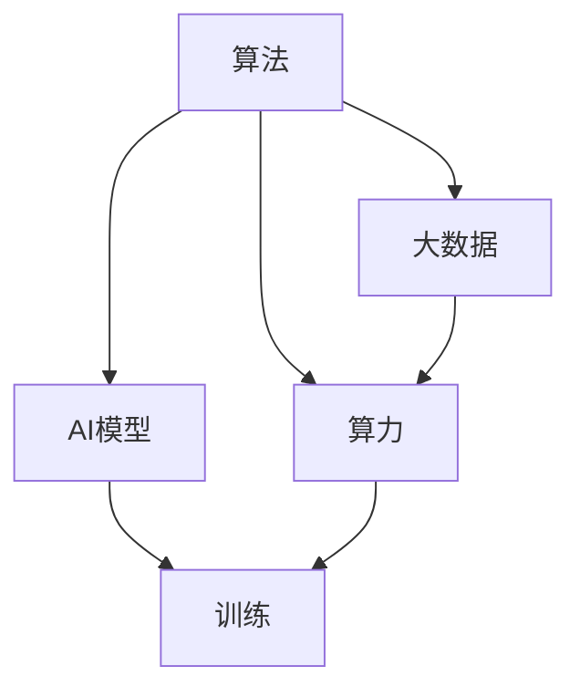

                 

# AI发展的三大支柱：算法、算力与大数据

在人工智能(AI)领域，算法、算力与大数据被公认为其发展的三大支柱。这三个要素相互依存、互为补充，共同驱动了AI技术的飞速进步和广泛应用。本文将从背景介绍、核心概念与联系、核心算法原理及操作步骤、数学模型与公式、项目实践、实际应用场景、工具和资源推荐、总结与展望、常见问题解答等角度，深入探讨这三个支柱的内在联系和实际应用。

## 1. 背景介绍

### 1.1 问题由来

自1956年人工智能概念提出以来，AI领域经历了从弱人工智能到强人工智能的漫长探索。早期的AI技术依赖于规则与符号的逻辑推理，但难以处理复杂的非结构化数据。20世纪80年代，神经网络与深度学习技术的兴起，使得AI开始依赖大量数据进行模型训练，取得了显著的进展。然而，单纯依赖大数据并不能解决所有问题，算力与算法同样至关重要。

### 1.2 问题核心关键点

算法、算力与大数据是AI发展的三大支柱，三者缺一不可：
- **算法**：解决特定问题的数学模型与算法；
- **算力**：支持算法实现与模型训练的计算能力；
- **大数据**：提供训练数据，支持模型学习与优化。

这些支柱之间的协同效应，使得AI技术在多个领域取得了显著的应用效果。例如，在计算机视觉、自然语言处理、推荐系统等诸多领域，算法、算力与大数据三者的高效结合，使AI系统能够实现超强的数据处理与模式识别能力。

### 1.3 问题研究意义

理解算法、算力与大数据的内在联系，对于AI技术的未来发展具有重要意义：
1. **推动技术进步**：明确技术发展方向，指导算法与算力优化，提升数据处理能力。
2. **促进应用落地**：指导实际应用场景，合理配置资源，优化用户体验。
3. **提升经济效益**：优化资源配置，降低开发与运营成本，实现商业价值最大化。
4. **确保技术安全**：合理应用大数据，防范隐私泄露与数据滥用，保障社会公正。

## 2. 核心概念与联系

### 2.1 核心概念概述

为更好地理解算法、算力与大数据的内在联系，本节将介绍几个密切相关的核心概念：

- **算法**：指用于解决特定问题的数学模型与算法。算法的选择与应用直接影响AI系统的性能与效率。
- **算力**：指支持算法实现与模型训练的计算能力。算力大小通常由CPU、GPU、TPU等计算硬件的性能决定。
- **大数据**：指海量、多源、多维的数据集。大数据提供了训练AI模型的基础，支持模型的学习与优化。

这三个概念之间的逻辑关系可以通过以下Mermaid流程图来展示：



这个流程图展示了算法、算力与大数据之间的关系：

1. 算法和大数据结合，形成AI模型。
2. 大数据在算力支持下，训练出高性能的AI模型。
3. 训练好的AI模型部署应用，提供服务。

## 3. 核心算法原理 & 具体操作步骤
### 3.1 算法原理概述

AI算法可以大致分为两类：
- **监督学习(Supervised Learning)**：通过标注数据，训练模型预测新数据的标签。例如，分类、回归等。
- **无监督学习(Unsupervised Learning)**：通过对未标注数据的学习，发现数据的内在结构。例如，聚类、降维等。

此外，还有强化学习(Reinforcement Learning)、生成模型(Generative Models)等，不同算法各有优缺点，适用于不同的应用场景。

### 3.2 算法步骤详解

以监督学习中的线性回归算法为例，展示其操作步骤：
1. **数据准备**：收集标注数据，划分为训练集和测试集。
2. **模型初始化**：选择合适的算法，如线性回归，并设定超参数，如学习率。
3. **模型训练**：通过梯度下降等优化算法，最小化预测误差，更新模型参数。
4. **模型评估**：在测试集上评估模型性能，如均方误差。
5. **模型应用**：使用训练好的模型对新数据进行预测。

以下是使用Python实现线性回归的代码示例：

```python
import numpy as np

# 准备数据
X = np.array([[1, 2], [3, 4], [5, 6]])
y = np.array([2, 4, 6])

# 初始化模型参数
theta = np.zeros((2, 1))

# 设置学习率
alpha = 0.01

# 迭代训练
for i in range(1000):
    y_pred = np.dot(X, theta)
    loss = y_pred - y
    gradient = np.dot(X.T, loss) / len(X)
    theta -= alpha * gradient

# 模型应用
new_X = np.array([[7, 8]])
new_y_pred = np.dot(new_X, theta)
print(new_y_pred)
```

### 3.3 算法优缺点

监督学习算法具有以下优点：
- **效果显著**：适用于标注数据较多的任务，模型能够获得较强的泛化能力。
- **适用范围广**：适用于分类、回归等多种任务。
- **可解释性强**：模型结构简单，决策过程透明。

同时，也存在以下局限性：
- **数据依赖**：标注数据的质量和数量直接影响模型效果。
- **过拟合风险**：模型复杂度较高时，容易发生过拟合。
- **数据成本**：标注数据获取成本较高，尤其是复杂任务。

### 3.4 算法应用领域

监督学习算法在多个领域得到了广泛应用，例如：
- **计算机视觉**：图像分类、目标检测、人脸识别等。
- **自然语言处理**：情感分析、机器翻译、问答系统等。
- **推荐系统**：个性化推荐、用户画像等。
- **金融领域**：信用评分、风险评估等。

这些应用场景中，监督学习算法通过标注数据训练出的模型，能够精准预测目标变量，提供高质量的解决方案。

## 4. 数学模型和公式 & 详细讲解 & 举例说明
### 4.1 数学模型构建

线性回归是一种最简单的监督学习算法，其数学模型可以表示为：

$$
y = \theta_0 + \theta_1 x_1 + \theta_2 x_2 + \cdots + \theta_n x_n
$$

其中，$y$ 为预测值，$\theta$ 为模型参数，$x_i$ 为输入特征。

### 4.2 公式推导过程

最小二乘法是常用的线性回归优化方法，其目标是最小化预测值与真实值之间的误差平方和：

$$
\min_{\theta} \sum_{i=1}^n (y_i - (\theta_0 + \theta_1 x_{1,i} + \theta_2 x_{2,i} + \cdots + \theta_n x_{n,i}))^2
$$

通过求解该最小化问题，可以得到最优的模型参数 $\theta$：

$$
\theta = (\mathbf{X}^T \mathbf{X})^{-1} \mathbf{X}^T \mathbf{y}
$$

其中，$\mathbf{X}$ 为特征矩阵，$\mathbf{y}$ 为标签向量。

### 4.3 案例分析与讲解

假设有一组房价数据，已知房屋面积 $x$ 与房价 $y$ 的关系，使用线性回归模型进行预测：

$$
y = 1000 + 100x
$$

代入测试数据 $x=200$，可以得到预测房价为 $2000$ 元。

## 5. 项目实践：代码实例和详细解释说明
### 5.1 开发环境搭建

在进行项目实践前，我们需要准备好开发环境。以下是使用Python进行TensorFlow开发的环境配置流程：

1. 安装Anaconda：从官网下载并安装Anaconda，用于创建独立的Python环境。

2. 创建并激活虚拟环境：
```bash
conda create -n tf-env python=3.8 
conda activate tf-env
```

3. 安装TensorFlow：根据CUDA版本，从官网获取对应的安装命令。例如：
```bash
conda install tensorflow==2.5 -c conda-forge
```

4. 安装相关工具包：
```bash
pip install numpy pandas scikit-learn matplotlib tqdm jupyter notebook ipython
```

完成上述步骤后，即可在`tf-env`环境中开始项目实践。

### 5.2 源代码详细实现

以下是使用TensorFlow实现线性回归的完整代码：

```python
import tensorflow as tf

# 准备数据
X = tf.constant([[1, 2], [3, 4], [5, 6]], dtype=tf.float32)
y = tf.constant([2, 4, 6], dtype=tf.float32)

# 初始化模型参数
theta = tf.Variable(tf.zeros([2, 1]))

# 设置学习率
alpha = 0.01

# 定义损失函数
def loss_fn():
    y_pred = tf.matmul(X, theta)
    loss = tf.reduce_mean(tf.square(y_pred - y))
    return loss

# 定义优化器
optimizer = tf.optimizers.SGD(learning_rate=alpha)

# 迭代训练
for i in range(1000):
    optimizer.minimize(loss_fn)

# 模型应用
new_X = tf.constant([[7, 8]], dtype=tf.float32)
new_y_pred = tf.matmul(new_X, theta)
print(new_y_pred)
```

### 5.3 代码解读与分析

让我们再详细解读一下关键代码的实现细节：

**X与y**：
- 使用TensorFlow定义输入特征与标签，并将它们转换为张量形式。

**theta**：
- 使用TensorFlow的Variable定义模型参数，用于存储最优的线性回归系数。

**loss_fn**：
- 定义损失函数，计算预测值与真实值之间的误差平方和。

**optimizer**：
- 使用SGD优化器进行模型参数的更新。

**for循环**：
- 在每次迭代中，最小化损失函数，更新模型参数。

**new_X与new_y_pred**：
- 对新的数据进行预测，输出预测结果。

可以看到，TensorFlow使得模型构建与训练过程变得简洁高效，开发者可以将更多精力放在模型设计与参数调整上，而不必过多关注底层的实现细节。

当然，工业级的系统实现还需考虑更多因素，如模型的保存和部署、超参数的自动搜索、更灵活的任务适配层等。但核心的算法与实现流程基本与此类似。

## 6. 实际应用场景
### 6.1 智能推荐系统

智能推荐系统是AI技术的重要应用领域之一。传统推荐系统依赖用户历史行为数据进行推荐，难以捕捉用户深层次需求。基于监督学习的推荐算法，可以更好地利用用户的历史评分数据，提高推荐的精准度。

在实践中，可以收集用户对电影、商品、新闻等的评分数据，并对其进行特征提取。将用户评分作为标注数据，在监督学习算法上进行训练，生成推荐模型。模型根据用户评分预测新物品的评分，提供个性化的推荐结果。

### 6.2 金融风控系统

金融风控系统是另一个典型的AI应用场景。传统风控系统依赖专家规则进行风险评估，难以应对复杂多变的金融环境。基于监督学习的风控算法，可以通过大量历史数据训练模型，实现精准的风险预测与评估。

在实践中，可以收集用户的信用数据、交易记录、社交信息等，对其进行特征提取。将用户是否违约作为标注数据，在监督学习算法上进行训练，生成风险评估模型。模型根据用户特征预测其违约概率，提供个性化的风控策略。

### 6.3 智能医疗诊断系统

智能医疗诊断系统是AI技术的另一个重要应用领域。传统医疗诊断依赖医生的经验与知识，难以应对海量的医疗数据。基于监督学习的诊断算法，可以更好地利用医疗数据，提高诊断的精准度与效率。

在实践中，可以收集患者的病历数据、影像数据、基因数据等，对其进行特征提取。将患者的诊断结果作为标注数据，在监督学习算法上进行训练，生成诊断模型。模型根据患者特征预测其疾病类型，提供个性化的诊断建议。

### 6.4 未来应用展望

随着AI技术的不断进步，基于监督学习的算法将在更多领域得到应用，为各行各业带来变革性影响：

1. **智慧医疗**：基于监督学习的医疗诊断、药物研发等应用，将提升医疗服务的智能化水平，辅助医生诊疗，加速新药开发进程。
2. **智能教育**：基于监督学习的个性化推荐、智能辅助教学等应用，将因材施教，促进教育公平，提高教学质量。
3. **智慧城市治理**：基于监督学习的城市事件监测、舆情分析、应急指挥等环节，将提高城市管理的自动化与智能化水平，构建更安全、高效的未来城市。
4. **智慧工业**：基于监督学习的质量检测、生产优化等应用，将提升工业生产的自动化与智能化水平，实现智能制造。

这些应用场景中，监督学习算法通过标注数据训练出的模型，能够精准预测目标变量，提供高质量的解决方案。未来，随着数据量的增长与算力的提升，监督学习算法将在更多领域发挥更大的作用。

## 7. 工具和资源推荐
### 7.1 学习资源推荐

为了帮助开发者系统掌握监督学习技术的理论基础和实践技巧，这里推荐一些优质的学习资源：

1. 《深度学习》系列博文：由AI专家撰写，深入浅出地介绍了深度学习原理、模型架构、优化算法等前沿话题。

2. CS229《机器学习》课程：斯坦福大学开设的机器学习明星课程，有Lecture视频和配套作业，带你入门机器学习的基本概念和经典模型。

3. 《Pattern Recognition and Machine Learning》书籍：机器学习领域的经典教材，全面介绍了监督学习的基本原理与算法。

4. Kaggle平台：提供海量数据集与竞赛任务，是练习机器学习算法、提升实战能力的重要平台。

5. Coursera平台：提供多门高质量的机器学习课程，涵盖监督学习、无监督学习、强化学习等多个方向，适合系统学习。

通过对这些资源的学习实践，相信你一定能够快速掌握监督学习技术的精髓，并用于解决实际的AI问题。

### 7.2 开发工具推荐

高效的开发离不开优秀的工具支持。以下是几款用于监督学习开发的常用工具：

1. TensorFlow：由Google主导开发的开源深度学习框架，生产部署方便，适合大规模工程应用。支持各种监督学习算法与优化器。

2. PyTorch：基于Python的开源深度学习框架，灵活动态的计算图，适合快速迭代研究。

3. scikit-learn：Python的机器学习库，提供了多种监督学习算法，易于上手。

4. Weights & Biases：模型训练的实验跟踪工具，可以记录和可视化模型训练过程中的各项指标，方便对比和调优。

5. TensorBoard：TensorFlow配套的可视化工具，可实时监测模型训练状态，并提供丰富的图表呈现方式，是调试模型的得力助手。

合理利用这些工具，可以显著提升监督学习任务的开发效率，加快创新迭代的步伐。

### 7.3 相关论文推荐

监督学习技术的发展源于学界的持续研究。以下是几篇奠基性的相关论文，推荐阅读：

1. "Perceptron"：1957年提出的简单监督学习算法，奠定了后续深度学习的基础。

2. "Backpropagation: Application to Feedforward Networks"：1986年提出的反向传播算法，使得神经网络训练变得更加高效。

3. "Support Vector Machines"：1963年提出的支持向量机算法，在许多监督学习任务中表现优异。

4. "Deep Learning"：2015年提出的深度学习框架，通过多层神经网络实现更复杂的监督学习任务。

5. "Random Forests"：2001年提出的随机森林算法，通过多个决策树的学习，提升分类与回归的准确度。

这些论文代表了大数据、算法与算力的演进脉络。通过学习这些前沿成果，可以帮助研究者把握学科前进方向，激发更多的创新灵感。

## 8. 总结：未来发展趋势与挑战
### 8.1 总结

本文对监督学习算法、算力与大数据的内在联系进行了全面系统的介绍。首先阐述了监督学习技术的研究背景和意义，明确了其在AI技术中的重要地位。其次，从原理到实践，详细讲解了监督学习算法的操作步骤，给出了具体的代码实现。同时，本文还广泛探讨了监督学习算法在多个行业领域的应用前景，展示了其广阔的实践价值。此外，本文精选了算法、算力与大数据的相关学习资源，力求为读者提供全方位的技术指引。

通过本文的系统梳理，可以看到，监督学习算法、算力与大数据的内在联系，是AI技术不断进步的重要驱动力。这些元素的协同作用，使得AI技术在多个领域取得了显著的应用效果。未来，随着算力的提升与数据量的增长，监督学习算法将在更多领域发挥更大的作用，为各行各业带来更深入的变革。

### 8.2 未来发展趋势

展望未来，监督学习技术将呈现以下几个发展趋势：

1. **算力与数据规模持续增长**：随着GPU、TPU等高性能硬件的不断更新，算力规模将持续增长。同时，大数据技术的发展将使得数据规模持续扩张。算力与数据的规模化，将为监督学习技术带来更大的应用空间。

2. **模型复杂度与深度不断提升**：随着算法与算力的提升，监督学习模型将不断扩展，实现更深层次的特征学习与模式识别。例如，深度神经网络、卷积神经网络等。

3. **多模态学习成为热点**：未来，监督学习技术将突破单模态数据的限制，实现多模态数据的整合与协同学习。例如，视觉、语音、文本等多模态数据的联合学习，将使得监督学习技术在更多领域发挥更大的作用。

4. **迁移学习与迁移学习的优化**：监督学习技术将更广泛地应用于跨领域、跨任务的学习任务，提升模型的泛化能力。同时，如何更高效地进行迁移学习，减少数据依赖，将是重要的研究方向。

5. **可解释性与公平性成为重要课题**：随着监督学习技术在更多领域的应用，如何提高模型的可解释性、避免偏见与歧视，将是重要的课题。

这些趋势将推动监督学习技术不断进步，实现更广泛的应用与更深入的挖掘。

### 8.3 面临的挑战

尽管监督学习技术已经取得了显著成就，但在迈向更加智能化、普适化应用的过程中，仍面临诸多挑战：

1. **数据质量与标注成本**：尽管监督学习技术可以充分利用标注数据，但高质量标注数据的获取成本较高。对于长尾应用场景，标注数据获取成本更是高昂。如何降低数据依赖，充分利用未标注数据，将是重要的研究方向。

2. **模型过拟合与泛化能力**：监督学习模型容易发生过拟合，特别是在标注数据较少的情况下。如何提高模型的泛化能力，避免过拟合，将是重要的研究方向。

3. **计算资源与计算效率**：监督学习模型通常需要大规模计算资源进行训练与推理。如何提高模型计算效率，降低计算成本，将是重要的研究方向。

4. **模型复杂度与可解释性**：监督学习模型通常较复杂，难以解释其内部工作机制。如何提高模型的可解释性，增强系统的透明度，将是重要的研究方向。

5. **数据隐私与安全**：监督学习模型需要大量数据进行训练，如何保护数据隐私与安全，避免数据泄露与滥用，将是重要的研究方向。

这些挑战需要各界共同努力，积极寻求突破，才能推动监督学习技术的持续进步。

### 8.4 研究展望

面对监督学习技术面临的诸多挑战，未来的研究需要在以下几个方面寻求新的突破：

1. **无监督与半监督学习**：摆脱对大规模标注数据的依赖，利用自监督学习、主动学习等无监督和半监督范式，最大限度利用非结构化数据，实现更加灵活高效的监督学习。

2. **参数高效与计算高效**：开发更加参数高效与计算高效的监督学习算法，在固定大部分预训练参数的同时，只更新极少量的任务相关参数。同时优化模型计算图，减少前向传播和反向传播的资源消耗，实现更加轻量级、实时性的部署。

3. **因果推断与对比学习**：引入因果推断与对比学习思想，增强监督学习模型建立稳定因果关系的能力，学习更加普适、鲁棒的语言表征，从而提升模型泛化性和抗干扰能力。

4. **融合外部知识**：将符号化的先验知识，如知识图谱、逻辑规则等，与神经网络模型进行巧妙融合，引导监督学习过程学习更准确、合理的语言模型。同时加强不同模态数据的整合，实现视觉、语音等多模态信息与文本信息的协同建模。

5. **模型优化与资源优化**：结合因果分析方法，识别出监督学习模型决策的关键特征，增强输出解释的因果性和逻辑性。借助博弈论工具刻画人机交互过程，主动探索并规避模型的脆弱点，提高系统稳定性。

6. **数据保护与隐私保护**：在监督学习目标中引入伦理导向的评估指标，过滤和惩罚有偏见、有害的输出倾向。同时加强人工干预和审核，建立模型行为的监管机制，确保输出符合人类价值观和伦理道德。

这些研究方向的探索，必将引领监督学习技术迈向更高的台阶，为构建安全、可靠、可解释、可控的智能系统铺平道路。面向未来，监督学习技术还需要与其他人工智能技术进行更深入的融合，如知识表示、因果推理、强化学习等，多路径协同发力，共同推动自然语言理解和智能交互系统的进步。只有勇于创新、敢于突破，才能不断拓展监督学习技术的边界，让智能技术更好地造福人类社会。

## 9. 附录：常见问题与解答
**Q1：监督学习是否适用于所有数据集？**

A: 监督学习算法通常需要标注数据进行训练，因此对于标注数据较少的任务，可能效果不佳。对于无标注数据集，可以使用无监督学习或半监督学习等技术，或者结合人工标注和数据增强等方法进行训练。

**Q2：如何优化监督学习模型的泛化能力？**

A: 优化监督学习模型的泛化能力，可以从以下几个方面入手：
1. 数据增强：通过数据扩充、样本重采样等方法，丰富训练集的多样性。
2. 正则化：使用L2正则、Dropout等技术，防止模型过拟合。
3. 模型简化：降低模型复杂度，减少参数数量，提高泛化能力。
4. 交叉验证：通过交叉验证等方法，评估模型在未见过的数据上的性能。

**Q3：如何提高监督学习模型的可解释性？**

A: 提高监督学习模型的可解释性，可以采用以下方法：
1. 简化模型：降低模型复杂度，减少参数数量，提高可解释性。
2. 特征解释：通过特征重要性排序等方法，解释模型预测的依据。
3. 可视化技术：利用可视化工具，展示模型内部结构与决策过程。
4. 辅助工具：使用可解释性工具，如LIME、SHAP等，辅助分析模型行为。

**Q4：监督学习模型在实际应用中需要注意哪些问题？**

A: 将监督学习模型应用于实际问题时，需要注意以下问题：
1. 数据质量：确保训练数据的质量与代表性，避免偏差与错误。
2. 数据隐私：保护用户数据隐私，防止数据泄露与滥用。
3. 计算资源：合理配置计算资源，避免过拟合与计算效率低下。
4. 模型泛化：避免模型在训练集上过拟合，提高泛化能力。
5. 可解释性：提高模型的可解释性，确保系统透明与公正。

这些问题是确保监督学习模型在实际应用中可靠与高效的关键。只有在模型设计、数据处理、计算资源等多个环节进行全面优化，才能最大限度地发挥监督学习模型的威力。

---

作者：禅与计算机程序设计艺术 / Zen and the Art of Computer Programming

