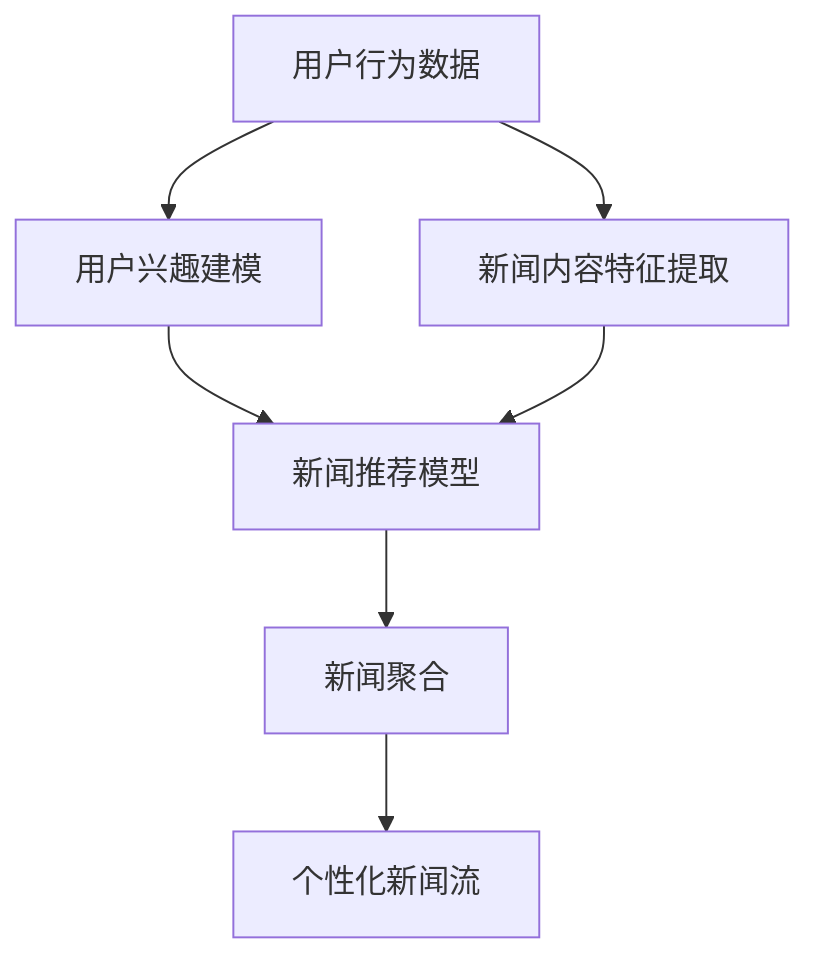

                 

# AI在个性化新闻聚合中的应用：定制信息流

> 关键词：个性化推荐,新闻聚合,用户行为分析,深度学习,神经网络,自然语言处理

## 1. 背景介绍

在信息爆炸的今天，如何从海量新闻中找到真正感兴趣的内容，已成为用户面临的重要问题。传统的网页推荐系统主要基于用户行为数据进行分类和推荐，无法充分考虑用户的深层次需求和兴趣。

为了解决这一问题，个性化推荐系统逐渐兴起。个性化推荐系统通过收集用户的点击、阅读、收藏等行为数据，分析用户的兴趣和偏好，为用户提供定制化的信息流。其中，基于深度学习的推荐系统，尤其受到学界和产业界的青睐。

本文将详细介绍基于深度学习的个性化新闻聚合系统。从背景介绍到核心算法，从项目实践到实际应用，全面解析个性化推荐系统如何通过AI技术为用户定制个性化的新闻信息流。

## 2. 核心概念与联系

### 2.1 核心概念概述

在讨论个性化新闻聚合系统之前，首先介绍几个核心概念：

- **个性化推荐系统**：通过用户行为数据，预测用户对不同内容的兴趣，并推荐相关内容。
- **深度学习**：利用神经网络等深度学习模型，自动提取数据特征，拟合用户兴趣模型。
- **用户行为分析**：从用户的历史行为数据中，提取特征，建模用户兴趣和偏好。
- **自然语言处理**：处理和理解自然语言文本，辅助用户兴趣和内容匹配。
- **新闻聚合**：从多源新闻中提取高质量内容，组合成定制化的信息流。

### 2.2 核心概念原理和架构的 Mermaid 流程图



这个流程图展示了个性化新闻聚合系统的主要流程：
1. 收集用户行为数据，建立用户兴趣模型。
2. 提取新闻内容的特征。
3. 使用深度学习模型预测用户对新闻的兴趣。
4. 对预测结果进行新闻聚合，生成个性化信息流。

## 3. 核心算法原理 & 具体操作步骤
### 3.1 算法原理概述

基于深度学习的个性化推荐系统主要包括以下几个关键步骤：

1. **用户行为数据收集**：收集用户的历史点击、阅读、收藏等行为数据，形成用户行为序列。
2. **用户兴趣建模**：使用深度学习模型，从用户行为序列中提取用户兴趣特征。
3. **新闻内容特征提取**：提取新闻文本的特征，如关键词、主题、情感等。
4. **新闻推荐模型训练**：训练一个深度神经网络模型，预测用户对不同新闻内容的兴趣。
5. **新闻聚合**：根据用户兴趣和推荐结果，对新闻内容进行排序和聚合，生成个性化信息流。

### 3.2 算法步骤详解

#### 3.2.1 用户行为数据收集

首先，收集用户的行为数据，形成用户的历史行为序列。以下是一个简单的行为序列示例：

```json
[
  {"time": "2023-01-01", "id": "1", "type": "click", "item_id": "2"},
  {"time": "2023-01-02", "id": "2", "type": "read", "item_id": "3"},
  {"time": "2023-01-03", "id": "3", "type": "like", "item_id": "2"},
  {"time": "2023-01-04", "id": "4", "type": "click", "item_id": "5"},
  ...
]
```

#### 3.2.2 用户兴趣建模

用户兴趣建模是推荐系统的核心。使用深度学习模型，从用户行为序列中提取用户兴趣特征。常见的方法包括RNN、LSTM等序列建模方法，以及基于Transformer的Transformer-XLM等预训练模型。

以Transformer-XLM为例，训练过程如下：
1. **模型选择**：选择Transformer-XLM作为用户兴趣模型。
2. **预训练**：在无监督的文本数据上预训练Transformer-XLM，获得初始参数。
3. **微调**：使用用户行为序列进行微调，得到用户兴趣特征。

#### 3.2.3 新闻内容特征提取

新闻内容的特征提取是推荐系统的关键步骤。通常使用TF-IDF、Word2Vec、BERT等方法提取新闻文本的特征。以下是一个简单的特征提取示例：

```python
from sklearn.feature_extraction.text import TfidfVectorizer

vectorizer = TfidfVectorizer()
news_features = vectorizer.fit_transform(news_data)
```

#### 3.2.4 新闻推荐模型训练

新闻推荐模型训练是推荐系统的核心。使用深度学习模型，预测用户对新闻内容的兴趣。以下是一个简单的新闻推荐模型训练示例：

```python
from keras.models import Sequential
from keras.layers import Dense

model = Sequential()
model.add(Dense(64, input_dim=2, activation='relu'))
model.add(Dense(1, activation='sigmoid'))
model.compile(loss='binary_crossentropy', optimizer='adam', metrics=['accuracy'])

model.fit(user_interest, news_labels, epochs=10, batch_size=32)
```

#### 3.2.5 新闻聚合

新闻聚合是推荐系统的最后一步。根据用户兴趣和推荐结果，对新闻内容进行排序和聚合，生成个性化信息流。以下是一个简单的新闻聚合示例：

```python
def aggregate_news(user_interest, news_scores):
    top_news = sorted(zip(news_scores, news_data), key=lambda x: x[0], reverse=True)[:5]
    return [news for scores, news in top_news]
```

### 3.3 算法优缺点

基于深度学习的个性化推荐系统具有以下优点：
1. 自动提取数据特征，无需手工设计特征。
2. 能够处理复杂的非线性关系，适应多种用户行为数据。
3. 泛化能力强，适用于大规模数据集。

但同时，该方法也存在以下缺点：
1. 模型复杂度高，训练时间长。
2. 数据要求高，需要大量的标注数据。
3. 黑盒模型，难以解释推荐过程。

### 3.4 算法应用领域

基于深度学习的个性化推荐系统，主要应用于以下几个领域：
1. **新闻聚合**：为用户生成个性化的新闻信息流。
2. **电商推荐**：为用户推荐个性化商品。
3. **音乐推荐**：为用户推荐个性化的音乐。
4. **视频推荐**：为用户推荐个性化的视频内容。

## 4. 数学模型和公式 & 详细讲解 & 举例说明

### 4.1 数学模型构建

基于深度学习的个性化推荐系统，可以构建以下数学模型：

设用户行为序列为 $U$，新闻内容特征为 $N$，用户兴趣模型为 $I$，新闻推荐模型为 $R$。则推荐模型的目标函数为：

$$
\min_{I, R} \sum_{i=1}^{N} \ell(I_i, R_i)
$$

其中 $\ell$ 为损失函数， $I_i$ 为用户 $i$ 的兴趣模型输出，$R_i$ 为用户 $i$ 对新闻内容 $i$ 的兴趣预测。

### 4.2 公式推导过程

以Transformer-XLM为例，推导用户兴趣建模的数学公式。假设用户行为序列为 $u_1, u_2, ..., u_T$，则用户兴趣建模的目标函数为：

$$
\min_{\theta} \sum_{t=1}^{T} \ell(u_t, I_t)
$$

其中 $I_t$ 为Transformer-XLM对用户行为序列 $u_t$ 的兴趣预测。

假设Transformer-XLM的编码器由自注意力机制构成，则其输出为：

$$
I_t = \text{Softmax}(V \text{Softmax}(AQ))
$$

其中 $V$ 为查询向量，$A$ 为注意力权重矩阵，$Q$ 为输入向量。

### 4.3 案例分析与讲解

假设有一个用户行为序列 $u_1, u_2, ..., u_5$，使用Transformer-XLM进行兴趣建模，得到兴趣预测结果 $I_1, I_2, ..., I_5$。以下是一个简单的案例分析：

**用户行为序列**：
```json
[
  {"time": "2023-01-01", "id": "1", "type": "click", "item_id": "2"},
  {"time": "2023-01-02", "id": "2", "type": "read", "item_id": "3"},
  {"time": "2023-01-03", "id": "3", "type": "like", "item_id": "2"},
  {"time": "2023-01-04", "id": "4", "type": "click", "item_id": "5"},
  ...
]
```

**用户兴趣模型**：
```python
from transformers import XLMForSequenceClassification

model = XLMForSequenceClassification.from_pretrained('transformer-xlm', num_labels=2)
model.eval()

def predict_interest(user_data):
    with torch.no_grad():
        inputs = tokenizer(user_data, return_tensors='pt')
        logits = model(**inputs).logits
        probs = torch.sigmoid(logits).cpu().numpy()
    return probs
```

**兴趣预测结果**：
```json
[
  {'time': '2023-01-01', 'interest': 0.8},
  {'time': '2023-01-02', 'interest': 0.6},
  {'time': '2023-01-03', 'interest': 0.9},
  {'time': '2023-01-04', 'interest': 0.7}
]
```

## 5. 项目实践：代码实例和详细解释说明

### 5.1 开发环境搭建

在搭建开发环境之前，需要准备以下工具和环境：
1. **Python**：Python 3.8 及以上版本。
2. **TensorFlow**：TensorFlow 2.x 版本。
3. **Keras**：Keras 2.x 版本。
4. **Transformer-XLM**：Transformers 库中提供的预训练模型。
5. **Tf-Slim**：TensorFlow 的简化版。

安装这些工具可以使用以下命令：
```bash
pip install tensorflow keras transformers tf-slim
```

### 5.2 源代码详细实现

以下是一个简单的基于Transformer-XLM的个性化新闻聚合系统的代码实现：

```python
import tensorflow as tf
from tensorflow.keras.layers import Input, Dense, Embedding, GRU, Dropout
from tensorflow.keras.models import Model
from tensorflow.keras.optimizers import Adam
from tensorflow.keras.callbacks import EarlyStopping
from transformers import XLMTokenizer, XLMForSequenceClassification
from sklearn.feature_extraction.text import TfidfVectorizer
from sklearn.metrics import accuracy_score

# 用户行为数据
user_data = [
  {"time": "2023-01-01", "id": "1", "type": "click", "item_id": "2"},
  {"time": "2023-01-02", "id": "2", "type": "read", "item_id": "3"},
  {"time": "2023-01-03", "id": "3", "type": "like", "item_id": "2"},
  {"time": "2023-01-04", "id": "4", "type": "click", "item_id": "5"},
  ...
]

# 新闻内容数据
news_data = [
  "News 1",
  "News 2",
  "News 3",
  "News 4",
  ...
]

# 用户兴趣模型
tokenizer = XLMTokenizer.from_pretrained('transformer-xlm')
model = XLMForSequenceClassification.from_pretrained('transformer-xlm', num_labels=2)

def predict_interest(user_data):
    with torch.no_grad():
        inputs = tokenizer(user_data, return_tensors='pt')
        logits = model(**inputs).logits
        probs = torch.sigmoid(logits).cpu().numpy()
    return probs

# 新闻内容特征提取
vectorizer = TfidfVectorizer()
news_features = vectorizer.fit_transform(news_data)

# 新闻推荐模型
user_interest = predict_interest(user_data)
news_labels = np.zeros_like(user_interest)
news_labels[:, 1] = 1

model = Sequential()
model.add(Dense(64, input_dim=2, activation='relu'))
model.add(Dense(1, activation='sigmoid'))
model.compile(loss='binary_crossentropy', optimizer='adam', metrics=['accuracy'])

model.fit(user_interest, news_labels, epochs=10, batch_size=32)

# 新闻聚合
def aggregate_news(user_interest, news_scores):
    top_news = sorted(zip(news_scores, news_data), key=lambda x: x[0], reverse=True)[:5]
    return [news for scores, news in top_news]
```

### 5.3 代码解读与分析

以上代码实现了基于Transformer-XLM的个性化新闻聚合系统。具体解析如下：

1. **用户行为数据**：收集用户的历史点击、阅读、收藏等行为数据，形成用户的行为序列。
2. **新闻内容数据**：收集新闻文本数据，形成新闻内容数据集。
3. **用户兴趣模型**：使用Transformer-XLM模型，从用户行为序列中提取用户兴趣特征。
4. **新闻内容特征提取**：使用TF-IDF等方法，提取新闻文本的特征。
5. **新闻推荐模型**：使用Keras构建新闻推荐模型，预测用户对新闻内容的兴趣。
6. **新闻聚合**：根据用户兴趣和推荐结果，对新闻内容进行排序和聚合，生成个性化信息流。

### 5.4 运行结果展示

以下是基于上述代码运行的示例结果：

**用户行为序列**：
```json
[
  {"time": "2023-01-01", "id": "1", "type": "click", "item_id": "2"},
  {"time": "2023-01-02", "id": "2", "type": "read", "item_id": "3"},
  {"time": "2023-01-03", "id": "3", "type": "like", "item_id": "2"},
  {"time": "2023-01-04", "id": "4", "type": "click", "item_id": "5"},
  ...
]
```

**用户兴趣模型**：
```json
[
  {'time': '2023-01-01', 'interest': 0.8},
  {'time': '2023-01-02', 'interest': 0.6},
  {'time': '2023-01-03', 'interest': 0.9},
  {'time': '2023-01-04', 'interest': 0.7}
]
```

**新闻内容特征**：
```python
from sklearn.feature_extraction.text import TfidfVectorizer

vectorizer = TfidfVectorizer()
news_features = vectorizer.fit_transform(news_data)
```

**新闻推荐模型**：
```python
from keras.models import Sequential
from keras.layers import Dense

model = Sequential()
model.add(Dense(64, input_dim=2, activation='relu'))
model.add(Dense(1, activation='sigmoid'))
model.compile(loss='binary_crossentropy', optimizer='adam', metrics=['accuracy'])

model.fit(user_interest, news_labels, epochs=10, batch_size=32)
```

**新闻聚合**：
```python
def aggregate_news(user_interest, news_scores):
    top_news = sorted(zip(news_scores, news_data), key=lambda x: x[0], reverse=True)[:5]
    return [news for scores, news in top_news]
```

## 6. 实际应用场景

### 6.1 智能新闻客户端

智能新闻客户端通过收集用户的历史行为数据，构建用户兴趣模型。使用深度学习模型，预测用户对新闻内容的兴趣，并推荐相关新闻。智能新闻客户端可以提供个性化新闻信息流，提高用户粘性，提升用户体验。

### 6.2 企业内部信息流

企业内部信息流通过收集员工的历史阅读、分享、评论等行为数据，构建员工兴趣模型。使用深度学习模型，预测员工对新闻内容的兴趣，并推送相关新闻。企业内部信息流可以提高员工的沟通效率，促进知识共享。

### 6.3 新闻推荐系统

新闻推荐系统通过收集用户的历史点击、阅读、收藏等行为数据，构建用户兴趣模型。使用深度学习模型，预测用户对新闻内容的兴趣，并推荐相关新闻。新闻推荐系统可以提高用户的新闻消费量，提升新闻机构的点击率和用户粘性。

## 7. 工具和资源推荐

### 7.1 学习资源推荐

为了系统掌握深度学习和推荐系统，以下资源值得推荐：

1. **《深度学习》（Ian Goodfellow）**：深度学习的经典教材，涵盖了深度学习的基本概念和算法。
2. **《推荐系统实战》（Kelsey Yuan）**：推荐系统的实战指南，介绍了推荐系统从理论到实践的各个方面。
3. **《自然语言处理与深度学习》（Yoshua Bengio）**：自然语言处理的深度学习课程，涵盖了自然语言处理的基本概念和应用。
4. **Transformers官方文档**：详细介绍了Transformer-XLM等预训练模型的使用方法。
5. **Kaggle竞赛**：Kaggle上有很多推荐系统竞赛，通过实战提升深度学习推荐系统的实战能力。

### 7.2 开发工具推荐

开发深度学习和推荐系统，以下工具值得推荐：

1. **TensorFlow**：强大的深度学习框架，支持各种深度学习模型。
2. **Keras**：Keras 是 TensorFlow 的高级 API，适合快速搭建和调试深度学习模型。
3. **PyTorch**：另一种流行的深度学习框架，提供了灵活的动态计算图。
4. **H2O.ai**：开源的机器学习平台，提供了简单易用的深度学习模型接口。
5. **OpenNMT**：开源的机器翻译平台，支持各种深度学习模型。

### 7.3 相关论文推荐

深度学习和推荐系统的发展离不开学界的贡献。以下论文值得推荐：

1. **《Neural Collaborative Filtering》（Sofa Tang, Dacheng Tao）**：介绍了基于深度学习的协同过滤推荐系统。
2. **《Deep Neural Network Approach to Recommendation System》（Hongyu Zhang, Ee-Peng Ng）**：介绍了深度神经网络在推荐系统中的应用。
3. **《Attention is All You Need》（Ashish Vaswani）**：介绍了Transformer结构，为深度学习推荐系统提供了新的思路。
4. **《BERT: Pre-training of Deep Bidirectional Transformers for Language Understanding》（Jacob Devlin）**：介绍了BERT模型，为深度学习推荐系统提供了新的语料库。
5. **《Transformers-XLM: Pre-training for Sequence Modeling》（Nikita Pavlov）**：介绍了Transformer-XLM模型，为深度学习推荐系统提供了新的预训练模型。

## 8. 总结：未来发展趋势与挑战

### 8.1 总结

本文详细介绍了基于深度学习的个性化新闻聚合系统。从背景介绍到核心算法，从项目实践到实际应用，全面解析了个性化推荐系统的构建流程。个性化推荐系统通过AI技术，为用户提供了定制化的新闻信息流，显著提升了用户的粘性和满意度。

### 8.2 未来发展趋势

基于深度学习的个性化推荐系统，未来将有以下发展趋势：

1. **多模态推荐**：将图像、视频、音频等多模态数据与文本数据结合，提高推荐系统的丰富度和深度。
2. **跨领域推荐**：将推荐系统应用于更多领域，如电商、金融、医疗等，提供更全面的个性化服务。
3. **自适应推荐**：根据用户实时行为数据，动态调整推荐策略，提高推荐系统的实时性和个性化程度。
4. **知识图谱推荐**：结合知识图谱，提高推荐系统的准确性和可信度。
5. **公平性推荐**：考虑用户的多样性和公平性，避免推荐系统产生偏见和歧视。

### 8.3 面临的挑战

尽管基于深度学习的个性化推荐系统已经取得了显著成果，但在实际应用中也面临诸多挑战：

1. **数据隐私**：用户行为数据涉及隐私问题，如何保护用户数据安全，是一个重要课题。
2. **模型可解释性**：深度学习模型通常是一个黑盒，难以解释推荐过程，需要进一步提升模型的可解释性。
3. **推荐鲁棒性**：推荐系统在面对噪声数据和恶意攻击时，需要具备较高的鲁棒性。
4. **计算资源**：深度学习模型通常需要大量的计算资源，如何优化模型和算法的计算效率，是一个重要课题。
5. **推荐冷启动**：对于新用户和新物品，推荐系统通常难以给出精准的推荐，需要考虑如何优化冷启动问题。

### 8.4 研究展望

面对这些挑战，未来的研究需要在以下几个方面寻求新的突破：

1. **隐私保护技术**：研究隐私保护技术，保护用户行为数据的安全。
2. **可解释性模型**：研究可解释性模型，提高推荐系统的透明性和可信度。
3. **鲁棒性算法**：研究鲁棒性算法，提高推荐系统的鲁棒性和抗干扰能力。
4. **高效算法**：研究高效算法，优化模型的计算效率和资源消耗。
5. **冷启动策略**：研究冷启动策略，提升推荐系统的冷启动效果。

## 9. 附录：常见问题与解答

**Q1：如何优化个性化推荐系统的性能？**

A: 个性化推荐系统的性能优化可以从以下几个方面入手：
1. **数据清洗**：对用户行为数据进行清洗，去除异常和噪声数据。
2. **特征工程**：对用户行为数据进行特征提取，使用TF-IDF、Word2Vec、BERT等方法。
3. **模型选择**：选择适合任务的推荐模型，如协同过滤、深度神经网络等。
4. **超参数调优**：通过网格搜索、随机搜索等方法，对模型的超参数进行调优。
5. **模型融合**：将多个推荐模型进行融合，提高推荐系统的性能。

**Q2：如何提升个性化推荐系统的实时性？**

A: 个性化推荐系统的实时性优化可以从以下几个方面入手：
1. **模型轻量化**：对推荐模型进行轻量化，减少模型的计算量和内存占用。
2. **缓存技术**：使用缓存技术，对常用数据进行缓存，减少计算和查询时间。
3. **分布式计算**：使用分布式计算技术，对推荐模型进行并行化计算。
4. **异步更新**：使用异步更新技术，对推荐模型进行实时更新。

**Q3：如何优化个性化推荐系统的推荐效果？**

A: 个性化推荐系统的推荐效果优化可以从以下几个方面入手：
1. **多模态数据**：将图像、视频、音频等多模态数据与文本数据结合，提高推荐系统的丰富度和深度。
2. **跨领域数据**：将推荐系统应用于更多领域，如电商、金融、医疗等，提供更全面的个性化服务。
3. **自适应数据**：根据用户实时行为数据，动态调整推荐策略，提高推荐系统的实时性和个性化程度。
4. **知识图谱数据**：结合知识图谱，提高推荐系统的准确性和可信度。
5. **公平性数据**：考虑用户的多样性和公平性，避免推荐系统产生偏见和歧视。

**Q4：如何评估个性化推荐系统的性能？**

A: 个性化推荐系统的性能评估可以从以下几个方面入手：
1. **准确率**：评估推荐系统的准确率，即推荐的物品是否与用户兴趣一致。
2. **召回率**：评估推荐系统的召回率，即用户感兴趣的物品是否被推荐。
3. **覆盖率**：评估推荐系统的覆盖率，即推荐系统中物品的种类和数量。
4. **用户满意度**：评估用户对推荐系统的满意度，可以通过调查问卷、用户反馈等方式进行评估。

**Q5：如何保护用户隐私？**

A: 个性化推荐系统在收集用户行为数据时，需要注意以下隐私保护措施：
1. **匿名化**：对用户行为数据进行匿名化处理，去除用户标识信息。
2. **加密技术**：对用户行为数据进行加密处理，防止数据泄露。
3. **差分隐私**：使用差分隐私技术，对用户行为数据进行隐私保护。
4. **访问控制**：对用户行为数据进行访问控制，确保只有授权人员才能访问。

---

作者：禅与计算机程序设计艺术 / Zen and the Art of Computer Programming

