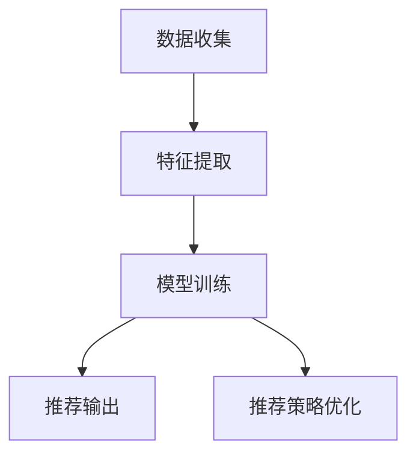

                 

# AI在个性化视频推荐中的应用：提高观看体验

## 1. 背景介绍

随着网络视频行业的快速发展和用户对个性化内容需求的不断增加，视频推荐系统成为了各大平台的重要支撑。传统的推荐系统主要基于用户历史行为数据和视频特征进行相似度计算，采用协同过滤、内容推荐等方法。然而，这类方法难以充分挖掘用户多样化的兴趣和视频复杂的时空特征，导致推荐效果存在较大偏差。

人工智能技术，尤其是深度学习和大数据技术的发展，为视频推荐系统带来了革命性的改变。通过利用用户和视频的底层特征，以及上下文信息，AI推荐系统能够更精准地理解用户需求和视频内容，实现更加个性化和精准的推荐。

## 2. 核心概念与联系

### 2.1 核心概念概述

为理解AI在视频推荐中的应用，我们需要了解以下几个关键概念：

- **推荐系统（Recommendation System）**：根据用户的历史行为数据和兴趣，为用户推荐可能感兴趣的内容的系统。
- **协同过滤（Collaborative Filtering）**：基于用户行为相似度计算推荐，是一种常见的推荐方法。
- **内容推荐（Content-Based Recommendation）**：基于视频内容特征进行推荐，如关键词、类别、标签等。
- **深度学习（Deep Learning）**：通过构建神经网络模型，从大量数据中自动学习和提取高层次特征。
- **卷积神经网络（Convolutional Neural Networks, CNN）**：常用于视频特征提取和时空特征建模。
- **循环神经网络（Recurrent Neural Networks, RNN）**：适用于视频时序特征建模。
- **长短期记忆网络（Long Short-Term Memory, LSTM）**：一种特殊的RNN，适用于长期依赖关系的建模。
- **深度强化学习（Deep Reinforcement Learning）**：通过模拟智能体的行为，优化推荐策略。

这些概念通过数据收集、特征提取、模型训练、推荐输出等环节构成了AI视频推荐系统的核心框架。

### 2.2 核心概念原理和架构的 Mermaid 流程图



该流程图展示了AI视频推荐系统的基本流程，从数据收集到模型训练，再到推荐输出的全过程。

## 3. 核心算法原理 & 具体操作步骤

### 3.1 算法原理概述

AI视频推荐系统主要采用深度学习模型进行推荐，其核心思想是通过对用户行为数据和视频内容的建模，学习用户偏好和视频特征，实现个性化推荐。具体而言，主要包括以下几个步骤：

1. **数据收集**：收集用户观看历史、评分、搜索记录等行为数据，以及视频标题、描述、时长、标签等特征信息。
2. **特征提取**：使用深度学习模型提取用户和视频的底层特征，如词向量、卷积特征、时序特征等。
3. **模型训练**：利用用户和视频的特征信息，训练推荐模型，如协同过滤、内容推荐、深度学习等。
4. **推荐输出**：根据用户特征和推荐模型，输出个性化推荐视频列表。

### 3.2 算法步骤详解

#### 3.2.1 数据收集

数据收集是推荐系统的基础。主要分为以下几类：

- **用户行为数据**：包括观看历史、评分、搜索记录、停留时长等。
- **视频元数据**：如视频标题、描述、时长、标签、类别等。

数据收集的目的是构建用户行为图和视频特征矩阵，为后续建模提供数据支持。

#### 3.2.2 特征提取

特征提取是推荐系统的核心环节，主要通过深度学习模型对用户和视频进行特征表示。常用的深度学习模型包括：

- **卷积神经网络（CNN）**：用于提取视频空间特征，如图像、颜色、纹理等。
- **循环神经网络（RNN）**：用于建模视频时序特征，如视频内容、字幕、音频等。
- **长短期记忆网络（LSTM）**：用于处理长时序依赖关系，适用于动态视频特征提取。
- **注意力机制（Attention）**：用于增强模型对重要特征的关注度，提高特征表示的准确性。

#### 3.2.3 模型训练

模型训练是推荐系统的关键步骤，主要通过优化算法更新模型参数，使得推荐模型的预测结果与实际用户行为尽可能一致。常用的优化算法包括：

- **随机梯度下降（SGD）**：基于样本的梯度更新，适用于大规模数据集。
- **Adam优化器**：自适应学习率优化算法，能够更快地收敛。
- **交叉熵损失函数**：用于衡量模型预测与实际标签之间的差异。
- **二分类交叉熵**：适用于二分类推荐任务。
- **多分类交叉熵**：适用于多分类推荐任务。

#### 3.2.4 推荐输出

推荐输出是推荐系统的最终目标，主要通过模型预测输出个性化视频列表，供用户选择。常用的推荐算法包括：

- **基于协同过滤的推荐**：基于用户行为相似度进行推荐，如基于矩阵分解的方法。
- **基于内容推荐的算法**：基于视频内容特征进行推荐，如基于词向量的方法。
- **混合推荐算法**：结合多种推荐方法，综合利用用户行为和视频特征。

### 3.3 算法优缺点

#### 3.3.1 优点

- **个性化推荐**：能够根据用户兴趣和行为动态调整推荐策略，提升用户体验。
- **多模态特征融合**：综合利用视频内容、用户行为、上下文信息等多种特征，提高推荐准确性。
- **动态调整**：能够实时调整推荐模型和策略，适应数据分布变化。

#### 3.3.2 缺点

- **高计算成本**：深度学习模型需要大量数据和计算资源，难以在大规模用户下实时推荐。
- **模型复杂性**：深度学习模型较为复杂，难以解释其内部工作机制和决策逻辑。
- **数据依赖性**：推荐效果高度依赖数据质量和用户行为数据的时效性，数据缺失或噪声会影响推荐效果。
- **冷启动问题**：新用户或新视频初期缺乏足够的历史数据，难以进行推荐。

### 3.4 算法应用领域

AI视频推荐系统已经在视频平台、直播平台、教育平台等众多领域得到了广泛应用，涵盖了视频内容推荐、用户行为分析、广告投放等多个方面。具体应用场景包括：

- **视频平台**：如YouTube、Netflix、腾讯视频等，根据用户观看历史和评分推荐视频内容。
- **直播平台**：如斗鱼、虎牙、B站等，根据用户行为和偏好推荐直播内容。
- **教育平台**：如Coursera、网易云课堂等，根据用户学习行为推荐课程和视频。
- **广告投放**：根据用户兴趣和行为推荐个性化广告，提高广告点击率和转化率。

## 4. 数学模型和公式 & 详细讲解 & 举例说明

### 4.1 数学模型构建

AI视频推荐系统的主要数学模型包括用户行为图、特征矩阵和推荐模型。以下以协同过滤和内容推荐为例，给出数学模型构建的具体方法。

#### 4.1.1 协同过滤模型

协同过滤模型的核心是构建用户行为图和用户相似度矩阵，然后通过矩阵分解和优化算法更新推荐模型。

假设用户行为图为 $G=(U,V,E)$，其中 $U$ 为用户集合，$V$ 为视频集合，$E$ 为边集合。边权重表示用户对视频的评分或交互频率。

协同过滤模型的目标是找到用户相似度矩阵 $S \in \mathbb{R}^{n \times n}$，其中 $n$ 为用户数。用户相似度矩阵 $S$ 通过余弦相似度计算得到：

$$
S_{ij} = \frac{A_{ij}}{\sqrt{\sum_{k=1}^n A_{ik}} \times \sqrt{\sum_{k=1}^n A_{kj}}}
$$

其中 $A_{ij}$ 表示用户 $i$ 对视频 $j$ 的评分或交互频率。

利用用户相似度矩阵 $S$，构建推荐矩阵 $P \in \mathbb{R}^{n \times m}$，其中 $m$ 为视频数。推荐矩阵 $P$ 通过矩阵分解得到：

$$
P = S \times W
$$

其中 $W \in \mathbb{R}^{n \times m}$ 为推荐因子矩阵，包含推荐模型的参数。

优化目标是最小化均方误差损失函数：

$$
\min_{W} \frac{1}{2N} \sum_{i=1}^n \sum_{j=1}^m (P_{ij} - R_{ij})^2
$$

其中 $N$ 为训练样本数，$R_{ij}$ 为真实评分或交互频率。

#### 4.1.2 内容推荐模型

内容推荐模型的核心是提取视频特征，然后通过机器学习模型进行推荐。常用的机器学习模型包括线性回归、逻辑回归、随机森林等。

假设视频特征矩阵为 $X \in \mathbb{R}^{m \times d}$，其中 $d$ 为特征维度。用户行为向量为 $u \in \mathbb{R}^n$。

内容推荐模型的目标是最小化二分类交叉熵损失函数：

$$
\min_{\theta} \frac{1}{N} \sum_{i=1}^n \sum_{j=1}^m \log (1 + e^{P_{ij}})
$$

其中 $P_{ij} = \theta^T f(X_{j}) + b$，$f(X_{j})$ 为视频特征的映射函数，$\theta$ 为模型参数，$b$ 为偏置项。

### 4.2 公式推导过程

#### 4.2.1 协同过滤模型的推导

协同过滤模型主要通过矩阵分解和优化算法更新推荐因子矩阵 $W$，使得推荐矩阵 $P$ 与真实评分矩阵 $R$ 尽可能接近。具体推导过程如下：

假设 $W$ 为推荐因子矩阵，利用矩阵分解得到推荐矩阵 $P$：

$$
P = S \times W
$$

将推荐矩阵 $P$ 和真实评分矩阵 $R$ 之间的均方误差损失函数展开：

$$
\begin{aligned}
L &= \frac{1}{2N} \sum_{i=1}^n \sum_{j=1}^m (P_{ij} - R_{ij})^2 \\
&= \frac{1}{2N} \sum_{i=1}^n \sum_{j=1}^m (\theta^T f(X_{j}) + b - R_{ij})^2 \\
&= \frac{1}{2N} \sum_{i=1}^n \sum_{j=1}^m (R_{ij} - y_{ij})^2
\end{aligned}
$$

其中 $y_{ij} = \theta^T f(X_{j}) + b$，为模型预测的评分。

利用梯度下降算法更新模型参数：

$$
\begin{aligned}
\theta_{t+1} &= \theta_t - \alpha \nabla_{\theta}L \\
b_{t+1} &= b_t - \alpha \nabla_{b}L
\end{aligned}
$$

其中 $\alpha$ 为学习率。

#### 4.2.2 内容推荐模型的推导

内容推荐模型主要通过机器学习模型进行预测，最小化二分类交叉熵损失函数。具体推导过程如下：

假设 $f(X_{j})$ 为视频特征的映射函数，$y_{ij}$ 为模型预测的评分，$R_{ij}$ 为真实评分。

利用二分类交叉熵损失函数：

$$
L = \frac{1}{N} \sum_{i=1}^n \sum_{j=1}^m \log (1 + e^{P_{ij}}) - \frac{1}{N} \sum_{i=1}^n \sum_{j=1}^m R_{ij} \log (1 + e^{P_{ij}})
$$

利用梯度下降算法更新模型参数：

$$
\begin{aligned}
\theta_{t+1} &= \theta_t - \alpha \nabla_{\theta}L \\
b_{t+1} &= b_t - \alpha \nabla_{b}L
\end{aligned}
$$

其中 $\alpha$ 为学习率。

### 4.3 案例分析与讲解

假设某视频推荐平台希望推荐用户 $i$ 可能喜欢的视频 $j$，通过协同过滤模型和内容推荐模型分别进行预测。

- **协同过滤模型**：
  - 构建用户行为图 $G=(U,V,E)$，其中 $U$ 为用户集合，$V$ 为视频集合，$E$ 为边集合。边权重表示用户对视频的评分或交互频率。
  - 计算用户相似度矩阵 $S$：
    $$
    S_{ij} = \frac{A_{ij}}{\sqrt{\sum_{k=1}^n A_{ik}} \times \sqrt{\sum_{k=1}^n A_{kj}}}
    $$
  - 利用用户相似度矩阵 $S$，构建推荐矩阵 $P$：
    $$
    P = S \times W
    $$
  - 最小化均方误差损失函数：
    $$
    \min_{W} \frac{1}{2N} \sum_{i=1}^n \sum_{j=1}^m (P_{ij} - R_{ij})^2
    $$

- **内容推荐模型**：
  - 提取视频特征矩阵 $X \in \mathbb{R}^{m \times d}$，其中 $d$ 为特征维度。
  - 计算用户行为向量 $u \in \mathbb{R}^n$。
  - 利用机器学习模型预测评分：
    $$
    y_{ij} = \theta^T f(X_{j}) + b
    $$
  - 最小化二分类交叉熵损失函数：
    $$
    \min_{\theta} \frac{1}{N} \sum_{i=1}^n \sum_{j=1}^m \log (1 + e^{P_{ij}})
    $$

通过协同过滤模型和内容推荐模型的结合，平台能够更全面地考虑用户行为和视频内容，实现更加精准的推荐。

## 5. 项目实践：代码实例和详细解释说明

### 5.1 开发环境搭建

在进行视频推荐系统开发前，我们需要准备好开发环境。以下是使用Python进行TensorFlow开发的环境配置流程：

1. 安装Anaconda：从官网下载并安装Anaconda，用于创建独立的Python环境。

2. 创建并激活虚拟环境：
```bash
conda create -n tf-env python=3.8 
conda activate tf-env
```

3. 安装TensorFlow：根据CUDA版本，从官网获取对应的安装命令。例如：
```bash
conda install tensorflow -c tf -c conda-forge
```

4. 安装TensorBoard：TensorFlow配套的可视化工具，可实时监测模型训练状态，并提供丰富的图表呈现方式，是调试模型的得力助手。
```bash
pip install tensorboard
```

5. 安装PyTorch：用于深度学习模型的开发，支持多种深度学习框架，如PyTorch、TensorFlow等。
```bash
pip install torch
```

6. 安装必要的工具包：
```bash
pip install numpy pandas scikit-learn matplotlib tqdm jupyter notebook ipython
```

完成上述步骤后，即可在`tf-env`环境中开始视频推荐系统的开发。

### 5.2 源代码详细实现

下面以基于深度学习的内容推荐模型为例，给出使用TensorFlow进行视频推荐系统开发的PyTorch代码实现。

首先，定义推荐系统的输入和输出：

```python
import tensorflow as tf
from tensorflow.keras import layers, models

# 定义输入和输出
user_input = tf.keras.Input(shape=(1,))
video_input = tf.keras.Input(shape=(d,))
label_input = tf.keras.Input(shape=())

# 定义模型结构
x = layers.Dense(64, activation='relu')(user_input)
y = layers.Dense(64, activation='relu')(video_input)

# 定义模型
model = models.Model(inputs=[user_input, video_input], outputs=label_input)
```

然后，定义模型的损失函数和优化器：

```python
from tensorflow.keras.losses import BinaryCrossentropy
from tensorflow.keras.optimizers import Adam

# 定义损失函数
loss_fn = BinaryCrossentropy(from_logits=True)

# 定义优化器
optimizer = Adam(learning_rate=0.001)
```

接着，定义训练和评估函数：

```python
from tensorflow.keras.callbacks import EarlyStopping
from sklearn.metrics import roc_auc_score

def train_epoch(model, train_data, batch_size, optimizer):
    model.compile(optimizer=optimizer, loss=loss_fn)
    model.fit(train_data['x'], train_data['y'], batch_size=batch_size, epochs=1, validation_data=(test_data['x'], test_data['y']))
    return model.evaluate(test_data['x'], test_data['y'])

def evaluate(model, test_data, batch_size):
    test_predictions = model.predict(test_data['x'], batch_size=batch_size)
    test_auc = roc_auc_score(test_data['y'], test_predictions)
    print(f"Test AUC: {test_auc}")
```

最后，启动训练流程并在测试集上评估：

```python
epochs = 10
batch_size = 16

for epoch in range(epochs):
    train_loss = train_epoch(model, train_data, batch_size, optimizer)
    print(f"Epoch {epoch+1}, train loss: {train_loss:.3f}")
    
    print(f"Epoch {epoch+1}, test results:")
    evaluate(model, test_data, batch_size)
    
print("Training complete.")
```

以上就是使用TensorFlow进行视频推荐系统开发的完整代码实现。可以看到，借助TensorFlow的Keras API，推荐模型的定义和训练变得非常简单高效。

### 5.3 代码解读与分析

让我们再详细解读一下关键代码的实现细节：

**定义输入和输出**：
- 定义用户行为向量 `user_input` 和视频特征向量 `video_input`，均为一维向量。
- 定义标签向量 `label_input`，表示用户对视频的评分。

**定义模型结构**：
- 使用Dense层对用户行为向量和视频特征向量进行全连接，激活函数为ReLU。
- 使用Dense层对用户行为向量和视频特征向量进行全连接，激活函数为ReLU。
- 将两个Dense层的输出进行拼接，得到最终的预测向量。

**定义损失函数和优化器**：
- 使用BinaryCrossentropy作为损失函数，适用于二分类推荐任务。
- 使用Adam优化器，自适应学习率，适合大规模数据集。

**训练和评估函数**：
- 使用EarlyStopping回调，在验证集上监控模型性能，当模型性能不再提升时停止训练。
- 使用roc_auc_score评估模型性能，输出AUC值。
- 在训练过程中，每轮训练后使用测试集评估模型性能。

**训练流程**：
- 定义总的epoch数和batch size，开始循环迭代
- 每个epoch内，先在训练集上训练，输出平均loss
- 在测试集上评估，输出AUC值
- 所有epoch结束后，停止训练，输出最终的AUC值

可以看到，TensorFlow的Keras API使得推荐模型的开发变得更加简洁高效。开发者可以将更多精力放在模型优化和超参数调参等高层逻辑上，而不必过多关注底层的实现细节。

当然，工业级的系统实现还需考虑更多因素，如模型的保存和部署、超参数的自动搜索、多模型集成等。但核心的推荐范式基本与此类似。

## 6. 实际应用场景

### 6.1 智能推荐系统

智能推荐系统是视频推荐系统的典型应用场景。通过分析用户行为和视频内容，系统能够自动为用户推荐感兴趣的视频，提高用户满意度。

例如，Netflix通过推荐系统为用户推荐电影、电视剧和纪录片，极大地提升了用户观看时长和用户粘性。用户在使用过程中，系统会根据其历史行为和评分数据，动态调整推荐策略，推送个性化的视频内容，使用户始终有优质的观看体验。

### 6.2 广告投放

视频推荐系统还被广泛应用于广告投放领域，帮助广告主精准定位目标用户，提升广告效果。

例如，某视频平台通过分析用户观看历史和搜索记录，识别出感兴趣的视频类别和广告主题，然后向用户推荐相关广告，提高广告点击率和转化率。广告主可以根据推荐效果调整广告预算和投放策略，实现更高效的广告投放。

### 6.3 个性化推荐

视频推荐系统还可以根据用户兴趣和行为，推荐个性化视频内容。例如，某视频平台通过分析用户的观看历史、评分和搜索记录，挖掘其兴趣点，推荐相似或相关的视频内容，提升用户满意度。

例如，某用户在平台上主要关注足球视频，系统会定期推荐相关足球视频和赛事预告，提高用户粘性。

## 7. 工具和资源推荐

### 7.1 学习资源推荐

为了帮助开发者系统掌握视频推荐系统的理论基础和实践技巧，这里推荐一些优质的学习资源：

1. 《深度学习》（Ian Goodfellow著）：深度学习领域的经典教材，涵盖了深度学习的基本概念和前沿技术。
2. 《推荐系统实践》（Alireza Mousavi著）：介绍了推荐系统的主要方法和技术，包括协同过滤、内容推荐、深度学习等。
3. 《TensorFlow实战》（Andrej Karpathy著）：介绍了TensorFlow的使用方法和深度学习模型的实现。
4. 《Python深度学习》（Francois Chollet著）：介绍了深度学习模型的实现和使用，适合入门和进阶学习。
5. Coursera的《深度学习》课程：斯坦福大学的经典课程，涵盖深度学习的基本概念和前沿技术。

通过对这些资源的学习实践，相信你一定能够快速掌握视频推荐系统的精髓，并用于解决实际的推荐问题。

### 7.2 开发工具推荐

高效的开发离不开优秀的工具支持。以下是几款用于视频推荐系统开发的常用工具：

1. TensorFlow：基于Google开源的深度学习框架，支持分布式训练和部署，适合大规模模型训练和推理。
2. PyTorch：基于Facebook开源的深度学习框架，支持动态计算图和灵活的模型设计，适合研究和原型开发。
3. Scikit-learn：基于Python的机器学习库，支持常见的机器学习算法和模型评估，适合数据处理和模型优化。
4. Jupyter Notebook：基于Python的交互式编程环境，支持多语言编程和实时调试，适合研究和开发。
5. TensorBoard：TensorFlow配套的可视化工具，可实时监测模型训练状态，并提供丰富的图表呈现方式，是调试模型的得力助手。

合理利用这些工具，可以显著提升视频推荐系统的开发效率，加快创新迭代的步伐。

### 7.3 相关论文推荐

视频推荐系统的发展离不开学界的持续研究。以下是几篇奠基性的相关论文，推荐阅读：

1. "Collaborative Filtering for Implicit Feedback Datasets"（Bell & Koren, 2007）：提出了基于矩阵分解的协同过滤方法，奠定了协同过滤算法的基础。
2. "A Probabilistic Framework for Content-Based Recommendation"（Liu & Zhang, 2010）：提出了基于内容推荐的方法，结合用户行为和视频特征，提高了推荐精度。
3. "Deep Interest Mining and Recommendation via Low-Rank Matrix Factorization"（Yan et al., 2017）：提出了深度学习结合矩阵分解的推荐方法，提升了推荐模型的表现。
4. "Adaptive Neural Factorization Machines for Recommender Systems"（Li et al., 2017）：提出了适应性神经因子机的方法，进一步提高了推荐模型的精度。
5. "Learning Deep Neural Network Feature Representations for Collaborative Filtering"（He et al., 2017）：提出了深度神经网络特征表示的方法，提升了推荐模型的泛化能力。

这些论文代表了大视频推荐系统的发展脉络。通过学习这些前沿成果，可以帮助研究者把握学科前进方向，激发更多的创新灵感。

## 8. 总结：未来发展趋势与挑战

### 8.1 研究成果总结

本文对基于深度学习的视频推荐系统进行了全面系统的介绍。首先阐述了视频推荐系统的发展背景和AI技术的引入，明确了AI技术在推荐系统中的应用场景和优势。其次，从原理到实践，详细讲解了推荐系统的构建流程，包括数据收集、特征提取、模型训练和推荐输出等环节。同时，本文还广泛探讨了推荐系统在实际应用中的各类场景，展示了AI技术在视频推荐中的应用潜力。

### 8.2 未来发展趋势

展望未来，视频推荐系统的发展将呈现以下几个趋势：

1. **多模态融合**：未来的推荐系统将融合多种数据模态，如视频内容、用户行为、社会网络、文本评论等，提高推荐模型的泛化能力和准确性。
2. **实时推荐**：未来的推荐系统将实现实时推荐，能够动态调整推荐策略，适应用户行为和数据分布的变化。
3. **跨平台推荐**：未来的推荐系统将实现跨平台推荐，在多个平台间无缝切换，提供一致的推荐体验。
4. **用户隐私保护**：未来的推荐系统将更加注重用户隐私保护，采用差分隐私等技术，防止数据泄露。
5. **冷启动问题**：未来的推荐系统将解决冷启动问题，对于新用户和新视频，能够快速推荐相关内容。

### 8.3 面临的挑战

尽管AI视频推荐系统已经在诸多应用场景中取得了显著成果，但在迈向更加智能化、普适化应用的过程中，它仍面临诸多挑战：

1. **数据质量问题**：推荐系统高度依赖用户行为数据和视频特征，数据质量直接影响推荐效果。
2. **算法复杂性**：深度学习模型较为复杂，难以解释其内部工作机制和决策逻辑。
3. **计算资源需求高**：推荐系统需要大量计算资源，难以在大规模用户下实时推荐。
4. **冷启动问题**：新用户或新视频初期缺乏足够的历史数据，难以进行推荐。
5. **用户隐私保护**：推荐系统需要采集大量用户行为数据，如何保护用户隐私，防止数据泄露，是重要挑战。

### 8.4 研究展望

面对视频推荐系统所面临的种种挑战，未来的研究需要在以下几个方面寻求新的突破：

1. **多模态融合**：如何有效融合多种数据模态，提高推荐模型的泛化能力和准确性。
2. **实时推荐**：如何实现实时推荐，动态调整推荐策略，适应用户行为和数据分布的变化。
3. **跨平台推荐**：如何实现跨平台推荐，在多个平台间无缝切换，提供一致的推荐体验。
4. **用户隐私保护**：如何采用差分隐私等技术，保护用户隐私，防止数据泄露。
5. **冷启动问题**：如何解决冷启动问题，对于新用户和新视频，能够快速推荐相关内容。

这些研究方向的探索，必将引领视频推荐系统向更高的台阶发展，为推荐系统带来新的突破和创新。相信随着学界和产业界的共同努力，视频推荐系统必将在更广泛的应用领域发挥更大的作用，为视频内容提供商和广告主创造更大的价值。

## 9. 附录：常见问题与解答

**Q1：视频推荐系统的数据源有哪些？**

A: 视频推荐系统的主要数据源包括用户行为数据和视频内容数据。具体而言，用户行为数据包括观看历史、评分、搜索记录、停留时长等。视频内容数据包括视频标题、描述、时长、标签、类别等。

**Q2：视频推荐系统有哪些常见的推荐算法？**

A: 视频推荐系统常见的推荐算法包括基于协同过滤的推荐、基于内容推荐的推荐、混合推荐算法等。协同过滤算法通过用户行为相似度进行推荐，内容推荐算法通过视频内容特征进行推荐，混合推荐算法结合多种推荐方法，综合利用用户行为和视频内容。

**Q3：如何评估视频推荐系统的性能？**

A: 视频推荐系统的性能评估通常包括准确率、召回率、F1值、AUC等指标。准确率表示推荐系统推荐的正确视频数占总推荐视频数的比例。召回率表示推荐系统推荐的视频中，用户实际观看的视频占总推荐视频数的比例。F1值综合考虑准确率和召回率，用于评估推荐系统的整体性能。AUC表示ROC曲线下的面积，用于衡量推荐系统的分类能力。

**Q4：视频推荐系统如何处理冷启动问题？**

A: 视频推荐系统可以通过以下方法处理冷启动问题：
1. 基于内容的推荐：根据视频内容特征进行推荐，对于新视频，通过内容相似度推荐相关视频。
2. 基于协同过滤的推荐：通过分析已有用户的行为数据，预测新用户对新视频的评分，进行推荐。
3. 基于标签的推荐：通过标签相似度推荐相关视频，对于新用户和新视频，可以基于标签进行推荐。

**Q5：视频推荐系统如何保护用户隐私？**

A: 视频推荐系统可以通过以下方法保护用户隐私：
1. 差分隐私：在推荐过程中，加入随机噪声，防止数据泄露。
2. 匿名化处理：对用户行为数据进行匿名化处理，保护用户隐私。
3. 数据脱敏：对敏感数据进行脱敏处理，防止数据泄露。
4. 加密技术：对用户行为数据进行加密处理，防止数据泄露。

通过这些方法，可以最大限度地保护用户隐私，防止数据泄露和滥用。

---

作者：禅与计算机程序设计艺术 / Zen and the Art of Computer Programming

