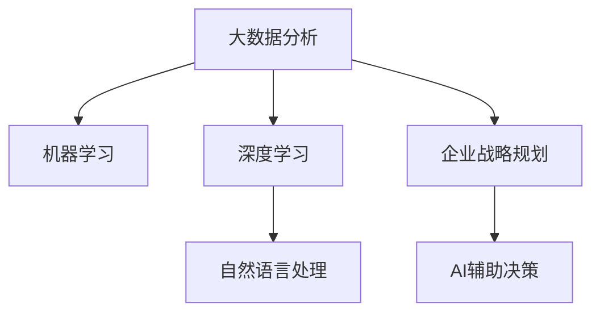

                 

# AI在企业战略规划中的辅助作用

## 1. 背景介绍

### 1.1 问题由来
在现代商业环境中，企业面临着前所未有的竞争压力和复杂挑战。如何制定高效、灵活且符合市场需求的战略规划，成为企业生存与发展的关键。随着人工智能技术的兴起，AI正在成为企业战略规划的重要辅助工具。

AI技术的优势在于，它可以从海量数据中提取有价值的洞察，提供战略决策的支持。通过数据分析、预测模型、自然语言处理等技术，AI能够帮助企业深入理解市场趋势、竞争对手动态、客户需求等关键因素，从而制定出更科学、精准的战略规划。

### 1.2 问题核心关键点
AI在企业战略规划中的核心作用主要体现在以下几个方面：

- **数据驱动决策**：AI能够分析海量数据，挖掘出关键洞察，辅助决策者制定战略。
- **预测未来趋势**：利用机器学习和深度学习模型，AI可以预测未来市场趋势，为企业提供前瞻性视角。
- **优化资源配置**：AI能够优化企业的资源配置，提升效率和效益。
- **增强竞争优势**：通过数据分析和智能预测，AI帮助企业在竞争中占据有利地位。
- **提高响应速度**：AI能够实时分析数据，快速响应市场变化，使企业战略更具灵活性。

## 2. 核心概念与联系

### 2.1 核心概念概述

为更好地理解AI在企业战略规划中的应用，本节将介绍几个关键概念：

- **人工智能(Artificial Intelligence, AI)**：通过算法模拟人类智能，能够进行学习、推理、感知等智能活动的技术。
- **企业战略规划**：企业根据内外环境分析，确定未来发展方向、目标和实施路径的规划过程。
- **大数据分析**：利用先进的数据处理技术，从海量数据中提取有价值的信息和知识。
- **机器学习**：使机器能够从数据中学习规律，实现智能决策。
- **深度学习**：一种高级机器学习方法，通过神经网络实现复杂数据处理和模式识别。
- **自然语言处理(Natural Language Processing, NLP)**：使计算机能够理解和处理人类语言的技术。

这些概念之间的逻辑关系可以通过以下Mermaid流程图来展示：



这个流程图展示了大数据、机器学习、深度学习和自然语言处理等关键技术如何支撑企业战略规划的AI辅助决策。

## 3. 核心算法原理 & 具体操作步骤
### 3.1 算法原理概述

AI在企业战略规划中的应用主要基于以下几个算法原理：

- **数据分析与挖掘**：通过算法对大数据进行分析和挖掘，提取关键洞察，辅助决策。
- **预测建模**：利用机器学习和深度学习模型，对未来市场趋势进行预测。
- **自然语言处理**：通过文本分析技术，提取文本中的关键信息和情感，为战略规划提供辅助。

### 3.2 算法步骤详解

AI在企业战略规划中的应用主要包括以下几个关键步骤：

**Step 1: 数据收集与预处理**
- 收集企业内部和外部相关数据，如市场数据、财务数据、客户反馈、行业报告等。
- 对数据进行清洗、去重、归一化等预处理操作，确保数据质量。

**Step 2: 数据建模与分析**
- 选择合适的模型对数据进行建模和分析，如回归模型、分类模型、聚类模型等。
- 对模型进行训练和调优，确保模型能够准确捕捉数据中的关键信息。

**Step 3: 结果解读与应用**
- 根据模型分析结果，解读关键洞察和趋势。
- 将分析结果应用于企业战略规划，如市场拓展、产品开发、供应链优化等。

**Step 4: 持续优化**
- 根据实时数据和反馈，持续优化和调整模型和分析方法。
- 定期回顾和评估战略规划效果，及时调整策略。

### 3.3 算法优缺点

AI在企业战略规划中的应用具有以下优点：

- **数据驱动决策**：通过数据分析，提供客观、科学的数据支持，减少决策的主观性和随意性。
- **预测未来趋势**：AI能够利用历史数据预测未来趋势，帮助企业提前布局，抓住先机。
- **优化资源配置**：AI能够通过优化算法，合理配置企业资源，提升效率和效益。
- **增强竞争优势**：AI能够帮助企业分析竞争对手动态，制定更具竞争力的策略。
- **提高响应速度**：AI能够实时分析数据，快速响应市场变化，使企业战略更具灵活性。

同时，AI在应用中也存在一些局限性：

- **数据质量和隐私问题**：AI分析结果的准确性依赖于数据质量，数据偏差可能导致分析结果错误。此外，数据隐私问题也需引起重视。
- **模型复杂度**：复杂的AI模型可能难以解释，增加了决策的复杂性。
- **技术门槛高**：AI技术需要专业知识和技术，中小企业可能面临技术门槛问题。
- **持续投入成本高**：AI系统的构建和维护需要持续的资源投入，可能增加企业运营成本。

尽管存在这些局限性，但AI在企业战略规划中的应用已经展现出了巨大的潜力，未来发展空间广阔。

### 3.4 算法应用领域

AI在企业战略规划中的应用广泛，覆盖了多个领域，例如：

- **市场分析**：利用AI分析市场趋势和客户需求，指导企业市场拓展和产品开发。
- **客户关系管理**：通过AI分析客户数据，提升客户满意度和忠诚度。
- **供应链管理**：利用AI优化供应链流程，降低成本，提升效率。
- **金融风险管理**：通过AI分析金融数据，预测风险，制定风险控制策略。
- **人力资源管理**：利用AI分析员工数据，优化人才招聘、培训和绩效管理。
- **研发创新**：通过AI分析技术趋势，指导研发方向，加速技术创新。

## 4. 数学模型和公式 & 详细讲解 & 举例说明
### 4.1 数学模型构建

在企业战略规划中，AI的应用涉及多种数学模型。这里以回归模型和分类模型为例，介绍其构建过程。

**回归模型**：用于预测连续变量的数值，如销售额、利润等。
$$
y = \beta_0 + \beta_1x_1 + \beta_2x_2 + \ldots + \beta_nx_n + \epsilon
$$

**分类模型**：用于分类问题，如市场细分、产品类别等。
$$
P(y=1|x) = \frac{e^{\beta_0 + \beta_1x_1 + \beta_2x_2 + \ldots + \beta_nx_n}}{1 + e^{\beta_0 + \beta_1x_1 + \beta_2x_2 + \ldots + \beta_nx_n}}
$$

### 4.2 公式推导过程

以下是回归模型和分类模型的详细推导过程：

**回归模型推导**：
- 假设数据集为 $(x_i, y_i), i=1,2,\ldots,n$，其中 $x_i = (x_{i1}, x_{i2}, \ldots, x_{in})$，$y_i$ 为连续变量。
- 回归模型的目标是最小化预测值与真实值之间的平方误差，即最小化 $MSE = \frac{1}{n}\sum_{i=1}^n(y_i - \hat{y}_i)^2$。
- 通过求解 $MSE$ 的最小值，可以得到模型参数 $\beta_0, \beta_1, \ldots, \beta_n$。

**分类模型推导**：
- 假设数据集为 $(x_i, y_i), i=1,2,\ldots,n$，其中 $x_i = (x_{i1}, x_{i2}, \ldots, x_{in})$，$y_i$ 为二分类变量。
- 分类模型的目标是最小化交叉熵损失函数，即最小化 $L = -\frac{1}{n}\sum_{i=1}^n[y_i \log \hat{y}_i + (1-y_i) \log (1-\hat{y}_i)]$。
- 通过求解 $L$ 的最小值，可以得到模型参数 $\beta_0, \beta_1, \ldots, \beta_n$。

### 4.3 案例分析与讲解

假设某电商企业希望利用AI预测下一季度的销售额。根据历史销售数据，构建线性回归模型：

- 收集历史销售额数据 $y = (y_1, y_2, \ldots, y_n)$，其中 $y_i$ 为第 $i$ 月的销售额。
- 收集与销售额相关的因素数据 $x = (x_1, x_2, \ldots, x_n)$，如季节、促销活动、节假日等。
- 构建回归模型：$y_i = \beta_0 + \beta_1x_{i1} + \beta_2x_{i2} + \ldots + \beta_nx_{in} + \epsilon$。
- 通过数据拟合，求解模型参数 $\beta_0, \beta_1, \ldots, \beta_n$。
- 使用模型预测下季度的销售额。

## 5. 项目实践：代码实例和详细解释说明
### 5.1 开发环境搭建

在进行AI辅助企业战略规划的应用开发前，我们需要准备好开发环境。以下是使用Python进行Scikit-Learn开发的环境配置流程：

1. 安装Anaconda：从官网下载并安装Anaconda，用于创建独立的Python环境。

2. 创建并激活虚拟环境：
```bash
conda create -n sklearn-env python=3.8 
conda activate sklearn-env
```

3. 安装Scikit-Learn：从官网获取安装命令，如：
```bash
conda install scikit-learn=1.1.3
```

4. 安装各类工具包：
```bash
pip install pandas numpy matplotlib seaborn
```

完成上述步骤后，即可在`sklearn-env`环境中开始AI辅助企业战略规划的实践。

### 5.2 源代码详细实现

以下是一个利用Scikit-Learn进行企业销售额预测的示例代码：

```python
import pandas as pd
import numpy as np
from sklearn.linear_model import LinearRegression
from sklearn.model_selection import train_test_split
from sklearn.metrics import mean_squared_error

# 读取数据
data = pd.read_csv('sales_data.csv')

# 数据预处理
X = data.drop(['Sales'], axis=1)
y = data['Sales']
X_train, X_test, y_train, y_test = train_test_split(X, y, test_size=0.2, random_state=42)

# 构建模型
model = LinearRegression()
model.fit(X_train, y_train)

# 预测并评估
y_pred = model.predict(X_test)
mse = mean_squared_error(y_test, y_pred)
print('MSE:', mse)
```

### 5.3 代码解读与分析

让我们再详细解读一下关键代码的实现细节：

**数据读取与预处理**：
- `pandas`用于读取和处理数据，方便数据操作。
- `numpy`用于数值计算，支持高效数组操作。
- `train_test_split`用于将数据集拆分为训练集和测试集。

**模型构建与训练**：
- `LinearRegression`用于构建线性回归模型。
- `fit`方法用于训练模型，通过最小化均方误差（MSE）来拟合数据。

**模型评估与预测**：
- `predict`方法用于预测测试集结果。
- `mean_squared_error`用于评估模型预测的均方误差。

**代码运行结果展示**：
- 模型训练后，输出MSE值，评估模型预测的准确性。

## 6. 实际应用场景
### 6.1 智能制造

AI在智能制造领域的应用，通过数据分析和预测，帮助企业优化生产流程，提高生产效率和产品质量。例如，利用AI分析生产设备运行数据，预测设备故障，提前进行维护，避免生产线停机。通过实时数据分析，优化生产计划和库存管理，降低生产成本。

### 6.2 金融风险管理

AI在金融领域的应用，通过数据分析和预测，帮助企业识别和控制风险。例如，利用AI分析历史交易数据，预测市场走势，制定投资策略。通过风险评估模型，识别潜在的金融风险，制定风险控制措施。

### 6.3 人力资源管理

AI在人力资源领域的应用，通过数据分析和预测，帮助企业优化招聘、培训和绩效管理。例如，利用AI分析员工数据，预测员工流失率，提前采取措施。通过智能推荐系统，提高招聘效率，匹配合适的候选人。

### 6.4 未来应用展望

未来，AI在企业战略规划中的应用将更加广泛和深入。随着AI技术的不断进步，以下领域将迎来新的突破：

- **自动化决策**：AI将能够自动进行战略规划，提升决策效率和准确性。
- **实时分析**：AI将能够实时分析数据，快速响应市场变化，使企业战略更具灵活性。
- **个性化定制**：AI将能够根据客户需求，定制个性化的战略方案。
- **跨领域整合**：AI将能够整合不同领域的知识，提供更全面的战略洞察。
- **伦理与安全**：AI将更加注重数据隐私和伦理问题，确保安全可靠。

## 7. 工具和资源推荐
### 7.1 学习资源推荐

为了帮助开发者系统掌握AI在企业战略规划中的应用，这里推荐一些优质的学习资源：

1. 《Python数据分析与机器学习》系列书籍：系统介绍Python数据分析和机器学习技术，适合初学者和进阶学习者。
2. 《机器学习实战》书籍：介绍机器学习算法和实践应用，适合了解机器学习基础知识。
3. 《深度学习入门》书籍：介绍深度学习理论和实践应用，适合对深度学习感兴趣的学习者。
4. Kaggle在线学习平台：提供大量的数据分析和机器学习竞赛，帮助开发者提升实战能力。
5. Coursera在线课程：提供多门企业战略规划相关的AI课程，适合系统学习。

通过对这些资源的学习实践，相信你一定能够快速掌握AI在企业战略规划中的应用，并用于解决实际的战略问题。

### 7.2 开发工具推荐

高效的开发离不开优秀的工具支持。以下是几款用于AI辅助企业战略规划开发的常用工具：

1. Python：Python作为一种通用编程语言，具有丰富的数据处理和机器学习库支持。
2. Scikit-Learn：开源机器学习库，提供多种经典算法和模型实现。
3. TensorFlow：开源深度学习框架，支持高效的深度模型构建和训练。
4. PyTorch：开源深度学习框架，支持动态计算图和高效模型构建。
5. Jupyter Notebook：支持实时代码执行和数据可视化，方便开发和分享。

合理利用这些工具，可以显著提升AI辅助企业战略规划的开发效率，加快创新迭代的步伐。

### 7.3 相关论文推荐

AI在企业战略规划中的应用源于学界的持续研究。以下是几篇奠基性的相关论文，推荐阅读：

1. "Data-Driven Business Strategy: A Literature Review" by Itti Xu et al.
2. "Machine Learning for Business Strategy" by Joydeep Ghosh et al.
3. "Artificial Intelligence in Business: From Automation to Autonomy" by James Albrecht et al.
4. "Predictive Analytics in Strategy Formulation and Decision Making" by Andrew Chou et al.
5. "AI for Business Strategy: Leveraging AI to Drive Business Value" by IDC.

这些论文代表了AI在企业战略规划领域的发展脉络。通过学习这些前沿成果，可以帮助研究者把握学科前进方向，激发更多的创新灵感。

## 8. 总结：未来发展趋势与挑战
### 8.1 总结

本文对AI在企业战略规划中的应用进行了全面系统的介绍。首先阐述了AI在企业战略规划中的背景和意义，明确了AI在数据分析、预测和优化决策等方面的独特价值。其次，从原理到实践，详细讲解了AI在战略规划中的应用过程，包括数据收集、建模、分析、应用和优化等环节，提供了完整的代码实例。最后，本文还探讨了AI在智能制造、金融风险管理、人力资源管理等多个领域的应用前景，展示了AI在企业战略规划中的广阔应用空间。

通过本文的系统梳理，可以看到，AI在企业战略规划中的作用日益凸显，成为企业获取竞争优势、优化决策的重要工具。未来，伴随AI技术的持续演进，AI在企业战略规划中的应用将更加深入和广泛，为企业的长期发展提供更加科学、高效的支持。

### 8.2 未来发展趋势

展望未来，AI在企业战略规划中的应用将呈现以下几个发展趋势：

- **自动化决策**：AI将能够自动进行战略规划，提升决策效率和准确性。
- **实时分析**：AI将能够实时分析数据，快速响应市场变化，使企业战略更具灵活性。
- **个性化定制**：AI将能够根据客户需求，定制个性化的战略方案。
- **跨领域整合**：AI将能够整合不同领域的知识，提供更全面的战略洞察。
- **伦理与安全**：AI将更加注重数据隐私和伦理问题，确保安全可靠。

这些趋势凸显了AI在企业战略规划中的巨大潜力，未来发展空间广阔。

### 8.3 面临的挑战

尽管AI在企业战略规划中的应用已经取得了显著进展，但在迈向更加智能化、普适化应用的过程中，仍面临诸多挑战：

- **数据质量与隐私问题**：AI分析结果的准确性依赖于数据质量，数据偏差可能导致分析结果错误。此外，数据隐私问题也需引起重视。
- **模型复杂度**：复杂的AI模型可能难以解释，增加了决策的复杂性。
- **技术门槛高**：AI技术需要专业知识和技术，中小企业可能面临技术门槛问题。
- **持续投入成本高**：AI系统的构建和维护需要持续的资源投入，可能增加企业运营成本。

这些挑战需要通过技术创新和政策支持等多方面努力，才能逐步解决。

### 8.4 研究展望

面向未来，AI在企业战略规划中的应用需要在以下几个方面寻求新的突破：

- **数据增强与清洗**：通过数据增强和清洗技术，提高数据质量，减少数据偏差。
- **模型简化与可解释性**：开发更加简洁和可解释的AI模型，降低决策复杂性。
- **跨领域知识整合**：将跨领域知识整合到AI模型中，提升战略规划的全面性和准确性。
- **伦理与安全保障**：在AI模型训练和应用中，引入伦理导向和安全性评估，确保战略规划的合规和可靠。

这些研究方向的探索，必将引领AI在企业战略规划中迈向更高的台阶，为企业的长期发展和竞争优势提供更可靠的技术支持。

## 9. 附录：常见问题与解答

**Q1: AI在企业战略规划中的应用是否仅限于数据分析和预测？**

A: AI在企业战略规划中的应用不仅限于数据分析和预测，还包括自动化决策、实时分析、个性化定制、跨领域整合等多个方面。AI能够全面辅助企业战略规划，提升决策效率和效果。

**Q2: 企业应该如何选择适合自己的AI技术？**

A: 企业应根据自身业务特点和需求，选择适合自己的AI技术。对于数据驱动的企业，可以选择数据分析和预测类AI技术；对于需要实时响应的企业，可以选择实时分析类AI技术；对于需要个性化定制的企业，可以选择个性化推荐类AI技术。

**Q3: AI在企业战略规划中的应用是否存在风险？**

A: AI在企业战略规划中的应用存在一定的风险，主要来自于数据隐私和伦理问题。企业应注重数据隐私保护，避免数据泄露。同时，应确保AI系统的决策透明和可解释，避免偏见和歧视。

**Q4: AI在企业战略规划中的应用是否需要持续投入？**

A: 是的，AI在企业战略规划中的应用需要持续投入，包括AI模型的构建、训练、调优和维护。持续的投入和优化是保证AI系统效果的必要条件。

通过本文的系统梳理，可以看到，AI在企业战略规划中的应用潜力巨大，但也需要企业在技术、数据和伦理等方面进行持续投入和优化。未来，随着AI技术的不断进步，AI在企业战略规划中的应用将更加深入和广泛，为企业的长期发展提供更加科学、高效的支持。

