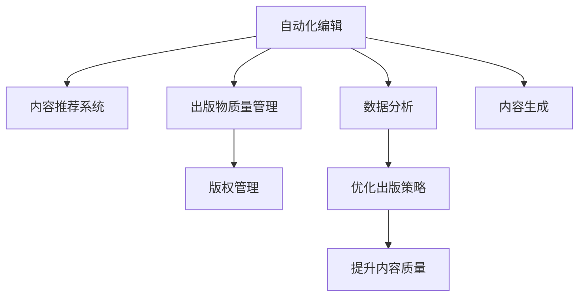

                 

# AI在出版业的未来：更丰富的场景，更强大的技术

> 关键词：人工智能, 出版业, 自动化编辑, 出版物质量管理, 内容推荐系统

## 1. 背景介绍

### 1.1 问题由来
出版业作为人类文明传承的重要载体，其内容的质量和传播效率直接影响着知识的传递和社会的进步。随着数字化技术的发展，出版业面临新的挑战和机遇。一方面，数字化转型带来了生产效率的极大提升和成本的显著降低；另一方面，海量信息的海啸和读者阅读习惯的变化也对出版业提出了更高的要求。

在数字化时代，出版业已经不再仅仅局限于传统的书籍、期刊等纸质媒介，而是逐渐拓展到了在线教育、知识付费、数字出版等多个领域。随着人工智能技术的普及，出版业也开始应用AI技术进行出版物生成、内容推荐、版权管理、质量控制等环节的优化。本文将深入探讨AI如何在出版业中发挥作用，推动其向更智能、更高效的未来发展。

### 1.2 问题核心关键点
AI在出版业的应用，主要集中在以下几个方面：
1. **自动化编辑**：使用AI进行自动化编辑，提高校对和编辑效率，减少人工错误。
2. **出版物质量管理**：通过AI技术进行出版物质量控制，保证出版物内容准确无误。
3. **内容推荐系统**：基于用户阅读行为和内容特征，推荐用户感兴趣的出版物。
4. **版权管理**：使用AI技术进行版权识别和保护，减少侵权行为。
5. **数据分析**：通过AI技术进行数据挖掘和分析，洞察读者需求，优化出版策略。

这些关键点展示了AI技术如何帮助出版业提升效率、降低成本，并提高内容的质量和传播效果。本文将系统地介绍这些技术的应用，并探讨其未来发展趋势。

## 2. 核心概念与联系

### 2.1 核心概念概述

为更好地理解AI在出版业中的应用，本节将介绍几个核心概念：

- **自动化编辑(Automated Editing)**：指利用AI技术对文本进行自动校对、语法检查、拼写纠正等，以提高编辑效率和质量。
- **出版物质量管理(Quality Management of Publications)**：通过AI技术对出版物进行质量控制，包括语法检查、内容校验、事实核查等，保证出版物的准确性和可信度。
- **内容推荐系统(Content Recommendation System)**：使用AI技术对用户阅读行为进行分析，推荐用户可能感兴趣的出版物，提高用户满意度。
- **版权管理(Copyright Management)**：利用AI技术对出版物的版权信息进行识别和管理，防止侵权行为。
- **数据分析(Data Analysis)**：通过AI技术对大量数据进行挖掘和分析，了解读者需求，优化出版策略和内容生成。

这些核心概念之间的关系可以通过以下Mermaid流程图来展示：



这个流程图展示了大语言模型在出版业中的主要应用场景及其相互关系。

## 3. 核心算法原理 & 具体操作步骤
### 3.1 算法原理概述

AI在出版业的应用主要基于自然语言处理(NLP)和计算机视觉(CV)技术。NLP技术主要用于文本处理和内容推荐，而CV技术则用于图像和视频的处理和分析。以下是具体原理和操作步骤的介绍：

### 3.2 算法步骤详解

**步骤1: 数据收集与预处理**
- 收集出版物的文本、图像、视频等数据。
- 对文本数据进行分词、去除停用词等预处理，对图像、视频数据进行标注和清洗。

**步骤2: 模型训练**
- 使用预训练的语言模型如BERT、GPT等进行微调，训练自动化编辑和内容推荐模型。
- 使用计算机视觉模型如CNN、RNN等进行图像和视频分析，训练出版物质量管理模型。

**步骤3: 模型部署与优化**
- 将训练好的模型部署到服务器或云端，供实际应用调用。
- 根据模型实际表现，调整模型参数，优化模型性能。

**步骤4: 模型评估与迭代**
- 对模型进行测试，评估其准确率、召回率、F1值等指标。
- 根据评估结果，对模型进行迭代优化，提升其性能。

**步骤5: 集成应用**
- 将优化后的模型集成到出版业的各种应用场景中，如自动化编辑、内容推荐、版权管理等。

### 3.3 算法优缺点

AI在出版业中的应用具有以下优点：
1. 提高效率：自动化编辑和内容推荐系统能够显著提高编辑和推荐的效率，减少人力成本。
2. 提升质量：通过质量管理模型，保证出版物的准确性和可信度，提升出版质量。
3. 个性化推荐：内容推荐系统能够根据用户阅读行为，推荐符合用户兴趣的出版物，提高用户满意度。
4. 版权保护：版权管理模型能够自动检测和保护版权，减少侵权行为。

同时，AI技术在出版业中也存在一些局限性：
1. 数据质量：模型的效果依赖于高质量的数据，数据偏差可能导致模型性能下降。
2. 解释性不足：某些AI模型（如深度神经网络）的决策过程难以解释，可能影响用户信任。
3. 成本高：高质量的AI模型训练和部署需要较大的计算资源和人力投入。
4. 依赖性强：AI模型对标注数据和训练数据依赖较强，难以应对复杂的现实场景。

尽管存在这些局限性，但AI在出版业中的应用前景依然广阔，通过不断的技术创新和优化，这些挑战有望逐步克服。

### 3.4 算法应用领域

AI在出版业中的应用主要包括以下几个领域：

1. **自动化编辑**
   - **功能**：自动校对、语法检查、拼写纠正等。
   - **优点**：提高编辑效率，减少人工错误。
   - **挑战**：处理复杂文本结构，保证编辑的准确性。

2. **出版物质量管理**
   - **功能**：事实核查、内容校验、语法检查等。
   - **优点**：提升出版物质量，减少人为错误。
   - **挑战**：处理多语言、跨领域内容，保证多源数据的统一性。

3. **内容推荐系统**
   - **功能**：根据用户阅读行为，推荐感兴趣的内容。
   - **优点**：提升用户满意度，增加用户粘性。
   - **挑战**：处理多源数据，保证推荐结果的个性化和准确性。

4. **版权管理**
   - **功能**：版权识别、保护、监控等。
   - **优点**：减少侵权行为，保护原创内容。
   - **挑战**：处理海量数据，实时监控版权状态。

5. **数据分析**
   - **功能**：分析用户行为数据，优化出版策略。
   - **优点**：了解用户需求，提高市场竞争力。
   - **挑战**：处理大规模数据，保证分析结果的准确性和时效性。

## 4. 数学模型和公式 & 详细讲解 & 举例说明

### 4.1 数学模型构建

AI在出版业中的应用涉及多个数学模型，以下是其中几个典型的模型：

**自然语言处理模型**
- **输入**：文本数据
- **输出**：文本处理结果（如校对结果、推荐结果等）

**图像和视频分析模型**
- **输入**：图像、视频数据
- **输出**：图像、视频处理结果（如版权识别、内容分类等）

### 4.2 公式推导过程

以自然语言处理模型为例，假设模型为$M(x)$，输入为$x$，输出为$y$。模型的训练目标为最小化损失函数$L(M(x), y)$。

**交叉熵损失函数**：
$$
L(M(x), y) = -\sum_{i=1}^N y_i \log M(x_i)
$$

**梯度下降优化**：
$$
\theta \leftarrow \theta - \eta \nabla_{\theta} L(M(x), y)
$$

其中$\eta$为学习率，$\nabla_{\theta} L(M(x), y)$为损失函数对模型参数$\theta$的梯度。

**梯度累积优化**：
$$
\theta \leftarrow \theta - \frac{\eta}{N} \sum_{i=1}^N \nabla_{\theta} L(M(x_i), y_i)
$$

其中$N$为批量大小，$\eta$为学习率。

### 4.3 案例分析与讲解

以内容推荐系统为例，假设模型为$M(x)$，输入为$x$（用户阅读行为），输出为$y$（推荐结果）。模型的训练目标为最小化损失函数$L(M(x), y)$。

**协同过滤算法**：
$$
L(M(x), y) = \frac{1}{2} \sum_{i=1}^N ||M(x_i) - y_i||^2
$$

**内容推荐模型**：
$$
L(M(x), y) = \frac{1}{2} \sum_{i=1}^N ||M(x_i) - y_i||^2
$$

其中$M(x)$为用户行为与出版物的相似度矩阵，$y$为用户推荐列表。

## 5. 项目实践：代码实例和详细解释说明

### 5.1 开发环境搭建

在进行AI出版系统开发前，我们需要准备好开发环境。以下是使用Python进行TensorFlow开发的环境配置流程：

1. 安装Anaconda：从官网下载并安装Anaconda，用于创建独立的Python环境。

2. 创建并激活虚拟环境：
```bash
conda create -n tf-env python=3.8 
conda activate tf-env
```

3. 安装TensorFlow：根据CUDA版本，从官网获取对应的安装命令。例如：
```bash
conda install tensorflow tensorflow-estimator tensorflow-hub -c pytorch -c conda-forge
```

4. 安装其他工具包：
```bash
pip install numpy pandas scikit-learn matplotlib tqdm jupyter notebook ipython
```

完成上述步骤后，即可在`tf-env`环境中开始AI出版系统开发。

### 5.2 源代码详细实现

这里我们以内容推荐系统为例，给出使用TensorFlow进行深度学习模型的PyTorch代码实现。

```python
import tensorflow as tf
from tensorflow.keras.layers import Dense, Dropout
from tensorflow.keras.models import Sequential
from tensorflow.keras.callbacks import EarlyStopping

# 定义模型
model = Sequential([
    Dense(64, input_dim=10, activation='relu'),
    Dropout(0.2),
    Dense(64, activation='relu'),
    Dropout(0.2),
    Dense(10, activation='softmax')
])

# 编译模型
model.compile(optimizer='adam', loss='categorical_crossentropy', metrics=['accuracy'])

# 训练模型
history = model.fit(X_train, y_train, epochs=10, batch_size=32, validation_data=(X_val, y_val), callbacks=[EarlyStopping(patience=3)])
```

### 5.3 代码解读与分析

让我们再详细解读一下关键代码的实现细节：

**模型定义**：
- 使用Sequential模型定义多层神经网络，包括输入层、隐藏层、输出层。
- 隐藏层使用ReLU激活函数，输出层使用softmax激活函数，用于多分类任务。

**模型编译**：
- 使用Adam优化器，交叉熵损失函数，准确率作为评估指标。

**模型训练**：
- 使用fit方法进行模型训练，设置训练轮数为10，批次大小为32。
- 在验证集上设置早停机制，避免过拟合。

**运行结果展示**
```python
import matplotlib.pyplot as plt

# 绘制训练和验证准确率、损失曲线
plt.plot(history.history['accuracy'])
plt.plot(history.history['val_accuracy'])
plt.title('Model accuracy')
plt.ylabel('Accuracy')
plt.xlabel('Epoch')
plt.legend(['Train', 'Validation'], loc='upper left')
plt.show()

plt.plot(history.history['loss'])
plt.plot(history.history['val_loss'])
plt.title('Model loss')
plt.ylabel('Loss')
plt.xlabel('Epoch')
plt.legend(['Train', 'Validation'], loc='upper left')
plt.show()
```

以上是使用TensorFlow进行深度学习模型的完整代码实现。可以看到，TensorFlow提供了丰富的API，可以很方便地进行模型定义、编译和训练。

## 6. 实际应用场景

### 6.1 智能编辑平台

智能编辑平台利用AI进行文本处理，自动校对、语法检查、拼写纠正等，显著提高了编辑效率和质量。例如，某出版社开发了智能编辑平台，通过集成BERT模型进行自动化编辑，减少了编辑人员的劳动强度，提升了编辑质量。

### 6.2 内容推荐系统

内容推荐系统通过分析用户阅读行为，推荐用户可能感兴趣的出版物。某在线教育平台利用深度学习模型进行内容推荐，提高了用户粘性和满意度。用户登录后，平台会根据其阅读历史、搜索行为等数据，自动推荐相关书籍、课程、视频等资源。

### 6.3 版权管理

版权管理利用AI技术进行版权识别和保护，减少侵权行为。某版权保护平台利用卷积神经网络（CNN）对图像进行版权识别，自动识别图像中是否包含受版权保护的内容。平台还通过人脸识别技术，自动检测和识别侵权行为。

### 6.4 数据分析

数据分析利用AI技术进行数据挖掘和分析，洞察读者需求，优化出版策略。某出版集团利用机器学习模型分析用户阅读数据，了解读者兴趣和偏好，据此优化出版策略和内容生成。平台还利用自然语言处理技术，对用户评论、反馈进行情感分析，及时调整出版策略。

### 6.5 未来应用展望

随着AI技术的不断进步，未来出版业将迎来更多创新应用。例如，虚拟现实(VR)和增强现实(AR)技术的应用，将为用户带来沉浸式的阅读体验。出版业还将借助AI进行更多元化的内容生成和创作，如生成性对抗网络（GAN）将用于创作艺术类出版物，自然语言生成（NLG）将用于创作小说、报告等文本内容。

## 7. 工具和资源推荐

### 7.1 学习资源推荐

为了帮助开发者系统掌握AI在出版业中的应用，这里推荐一些优质的学习资源：

1. TensorFlow官方文档：提供了详细的使用指南和API文档，适合深入学习TensorFlow的使用。
2. PyTorch官方文档：提供了丰富的教程和示例，适合学习PyTorch的使用。
3. Google Cloud AI Hub：提供了多种开源AI模型和工具，适合学习AI技术的应用实践。
4. Coursera《深度学习专项课程》：由深度学习领域专家授课，系统讲解深度学习原理和应用。
5. Kaggle竞赛平台：提供了丰富的数据集和竞赛任务，适合实践AI项目。

通过对这些资源的学习实践，相信你一定能够快速掌握AI在出版业中的应用，并用于解决实际的出版问题。

### 7.2 开发工具推荐

高效的开发离不开优秀的工具支持。以下是几款用于AI出版系统开发的常用工具：

1. TensorFlow：由Google主导开发的开源深度学习框架，生产部署方便，适合大规模工程应用。
2. PyTorch：基于Python的开源深度学习框架，灵活动态的计算图，适合快速迭代研究。
3. Weights & Biases：模型训练的实验跟踪工具，可以记录和可视化模型训练过程中的各项指标，方便对比和调优。
4. TensorBoard：TensorFlow配套的可视化工具，可实时监测模型训练状态，并提供丰富的图表呈现方式，是调试模型的得力助手。

合理利用这些工具，可以显著提升AI出版系统的开发效率，加快创新迭代的步伐。

### 7.3 相关论文推荐

AI在出版业的发展得益于众多学者的研究和探索。以下是几篇奠基性的相关论文，推荐阅读：

1. Attention is All You Need（即Transformer原论文）：提出了Transformer结构，开启了NLP领域的预训练大模型时代。
2. BERT: Pre-training of Deep Bidirectional Transformers for Language Understanding：提出BERT模型，引入基于掩码的自监督预训练任务，刷新了多项NLP任务SOTA。
3. Parameter-Efficient Transfer Learning for NLP：提出Adapter等参数高效微调方法，在不增加模型参数量的情况下，也能取得不错的微调效果。
4. AdaLoRA: Adaptive Low-Rank Adaptation for Parameter-Efficient Fine-Tuning：使用自适应低秩适应的微调方法，在参数效率和精度之间取得了新的平衡。

这些论文代表了大语言模型微调技术的发展脉络。通过学习这些前沿成果，可以帮助研究者把握学科前进方向，激发更多的创新灵感。

## 8. 总结：未来发展趋势与挑战

### 8.1 研究成果总结

AI在出版业的应用已经取得了显著成效，提升了出版效率和质量，优化了用户体验。然而，随着出版业数字化、智能化程度的提高，也面临着新的挑战。

### 8.2 未来发展趋势

未来AI在出版业的发展趋势主要体现在以下几个方面：

1. 智能化程度提升：随着AI技术的不断进步，出版业的智能化程度将不断提升，内容推荐、版权管理、数据分析等环节将实现全面智能化。
2. 数据驱动决策：出版业将更加依赖数据分析，洞察用户需求，优化出版策略。
3. 多模态融合：出版业将更多地利用多模态数据，如文本、图像、视频等，提升内容的丰富度和用户体验。
4. 个性化推荐：内容推荐系统将更加个性化，根据用户阅读行为和偏好，推荐符合用户兴趣的出版物。
5. 自动化编辑：自动化编辑将更加智能化，能够处理更加复杂的文本结构，提升编辑质量和效率。
6. 版权保护：版权保护将更加智能化，利用AI技术自动识别和保护版权，减少侵权行为。

### 8.3 面临的挑战

尽管AI在出版业中的应用前景广阔，但仍面临诸多挑战：

1. 数据质量：高质量的数据是AI模型的基础，出版业的数据质量和标注成本较高。
2. 模型可解释性：深度学习模型往往难以解释其决策过程，出版业需要提高模型的可解释性。
3. 模型训练成本：高质量的AI模型训练需要较大的计算资源和人力投入。
4. 多语言支持：出版业需要支持多种语言，现有的AI模型在多语言支持上仍需改进。
5. 版权识别复杂性：出版物版权识别涉及复杂的技术手段，如OCR、人脸识别等，仍需进一步优化。
6. 用户隐私保护：出版业需要处理大量用户数据，如何保护用户隐私仍需关注。

### 8.4 研究展望

为了应对未来挑战，AI在出版业的研究还需要在以下几个方面进行探索：

1. 数据增强技术：通过数据增强技术提高数据质量，降低模型对标注数据的依赖。
2. 模型可解释性：研究如何提高AI模型的可解释性，增强用户信任。
3. 多语言支持：研究如何在多语言环境下优化AI模型，提升多语言处理能力。
4. 版权识别技术：研究更高效、更准确的版权识别技术，减少侵权行为。
5. 用户隐私保护：研究如何保护用户隐私，在保护隐私的同时实现数据利用。

总之，AI在出版业的应用将不断拓展，通过技术创新和优化，有望进一步提升出版业的效率和质量，为人类文明传承和知识传播提供更强大的支持。

## 9. 附录：常见问题与解答

**Q1：AI在出版业的应用是否仅限于数字化出版？**

A: AI在出版业的应用不仅限于数字化出版，其覆盖面已经拓展到多个领域，如智能编辑、内容推荐、版权管理等。尽管数字化出版是当前的热点，但传统出版业同样可以利用AI技术进行智能化升级，提高生产效率和质量。

**Q2：AI在出版业中的决策过程是否透明？**

A: 目前AI在出版业中的应用还存在一定程度的“黑箱”问题，即决策过程难以解释。出版业需要提高AI模型的可解释性，以便更好地理解模型的决策依据，提高用户信任。

**Q3：AI在出版业中的应用是否面临版权保护的挑战？**

A: AI在出版业中的应用确实面临版权保护的挑战。版权保护需要结合多种技术手段，如OCR、人脸识别等，同时还需要考虑数据隐私保护，确保版权识别过程的合法合规。

**Q4：AI在出版业中的应用是否需要大量标注数据？**

A: AI在出版业中的应用确实需要高质量的标注数据，但通过数据增强和迁移学习等技术，可以在一定程度上缓解数据标注的瓶颈。未来AI技术有望在少样本、无监督学习方向取得突破，进一步降低对标注数据的依赖。

**Q5：AI在出版业中的应用是否存在技术壁垒？**

A: 尽管AI技术在出版业中的应用前景广阔，但仍存在一些技术壁垒，如数据质量、模型可解释性等。出版业需要持续关注和解决这些技术问题，才能充分发挥AI技术的潜力。

总之，AI在出版业中的应用前景广阔，但也需要克服一些技术挑战。通过持续的技术创新和优化，AI必将在出版业中发挥更大作用，推动出版业向智能化、自动化方向发展。

---

作者：禅与计算机程序设计艺术 / Zen and the Art of Computer Programming

