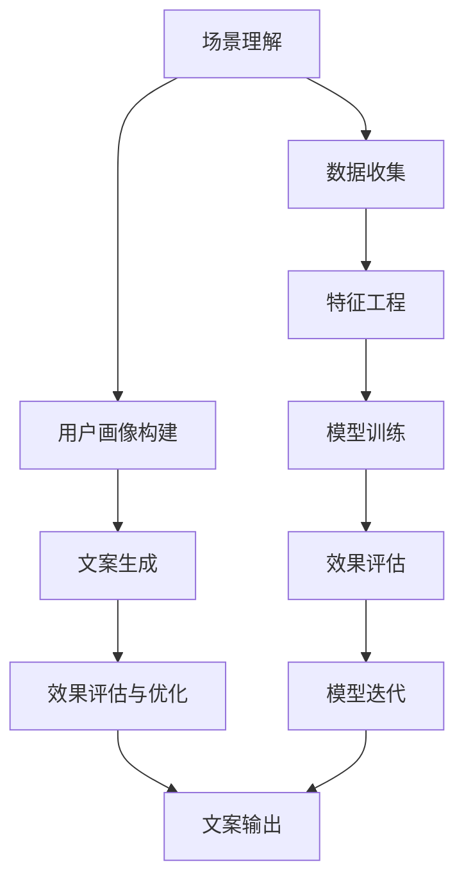

                 

# AI在场景化文案生成中的应用

> 关键词：AI文案生成,场景化,自然语言处理,深度学习,迁移学习,多模态学习,用户画像,个性化推荐

## 1. 背景介绍

### 1.1 问题由来

在当今信息爆炸的时代，广告文案、社交媒体内容、电商平台描述等文案撰写工作逐渐成为一项繁重的任务。传统的文案生成方法依赖于人工创作，不仅耗时耗力，还难以保持一致性和创意性。而随着人工智能技术的不断发展，基于AI的文案生成方法逐渐崭露头角，展现了其高效、灵活和创新的潜力。

### 1.2 问题核心关键点

AI文案生成的核心在于如何利用自然语言处理(NLP)和深度学习技术，生成符合特定场景和用户需求的文案。这需要解决以下几个关键问题：

1. **场景理解与提取**：理解文案所处的具体场景，如广告投放环境、用户行为背景、产品特性等。
2. **用户画像构建**：根据用户的兴趣、历史行为、人口统计信息等构建详细的用户画像。
3. **文案生成与优化**：结合场景理解和用户画像，生成个性化的文案，并进行不断优化。
4. **效果评估与迭代**：对生成的文案进行效果评估，并根据反馈进行迭代改进。

## 2. 核心概念与联系

### 2.1 核心概念概述

要深入理解AI文案生成，首先需要了解几个核心概念：

- **自然语言处理(NLP)**：涉及计算机对人类语言进行处理、理解和生成的技术。
- **深度学习**：一种基于多层神经网络进行数据分析和学习的方法。
- **迁移学习**：将一个任务上学习到的知识迁移到另一个相关任务上，以提高新任务的学习效率。
- **多模态学习**：结合文本、图像、声音等多类型数据，提升模型的泛化能力和决策质量。
- **用户画像**：通过对用户行为数据的分析，构建详细、全面的用户信息模型。
- **个性化推荐**：根据用户画像和场景信息，推荐符合用户需求的产品或内容。

这些核心概念之间通过AI文案生成的框架相互联系，形成了一个系统化的解决方案。

### 2.2 核心概念原理和架构的 Mermaid 流程图(Mermaid 流程节点中不要有括号、逗号等特殊字符)



这个流程图展示了AI文案生成过程的基本步骤：首先通过场景理解和数据收集构建用户画像，接着利用深度学习模型进行文案生成，再通过效果评估反馈进行模型优化，最终输出符合用户需求的文案。

## 3. 核心算法原理 & 具体操作步骤

### 3.1 算法原理概述

AI文案生成的核心算法包括序列到序列(Sequence-to-Sequence, Seq2Seq)模型、变分自编码器(Variational Autoencoder, VAE)、生成对抗网络(Generative Adversarial Network, GAN)等。这些模型通过学习大量文本数据，捕捉语言规律和语义特征，生成自然流畅的文案。

### 3.2 算法步骤详解

1. **数据收集与预处理**：收集与文案生成相关的数据，如广告文案、用户评论、产品描述等，并进行清洗和预处理。
2. **用户画像构建**：通过NLP技术，分析用户的社交媒体行为、搜索历史、购买记录等，构建详细的用户画像。
3. **模型选择与训练**：选择合适的深度学习模型，利用预处理后的数据进行训练。常见的模型包括LSTM、GRU、Transformer等。
4. **场景理解与特征提取**：结合用户的场景信息，如广告类型、产品特性、用户行为等，提取相关特征。
5. **文案生成**：利用训练好的模型，根据用户画像和场景信息，生成个性化的文案。
6. **效果评估与优化**：通过用户反馈、A/B测试等方式，评估文案效果，并进行模型优化。

### 3.3 算法优缺点

AI文案生成的优点包括：

- **高效**：自动化文案生成过程，显著减少人工工作量。
- **灵活**：能够快速适应不同场景和用户需求，生成多样化文案。
- **创新**：结合最新技术和大数据，生成具有创意和吸引力的文案。

缺点包括：

- **数据依赖**：生成的文案质量高度依赖于数据质量和多样性。
- **复杂度**：模型训练和优化过程复杂，需要专业知识和技术支持。
- **可解释性**：生成的文案背后的决策过程难以解释，缺乏透明度。

### 3.4 算法应用领域

AI文案生成技术在多个领域都有广泛应用：

- **广告营销**：根据广告类型、目标用户画像生成广告文案，提升广告效果。
- **电商平台**：为商品生成描述文案，增加产品吸引力，提高销售转化率。
- **社交媒体**：根据用户行为和兴趣，生成符合用户偏好的社交媒体内容。
- **内容创作**：为博客、新闻、视频等创作符合用户期望的标题和正文。

## 4. 数学模型和公式 & 详细讲解 & 举例说明

### 4.1 数学模型构建

基于深度学习的文案生成模型通常采用Seq2Seq架构，包含编码器和解码器两部分。

编码器将输入序列编码成隐含表示，解码器则根据隐含表示生成目标序列。常用的编码器包括LSTM、GRU等，解码器包括LSTM、注意力机制(Attention)等。

### 4.2 公式推导过程

以LSTM模型为例，其基本公式如下：

$$
h_t = \tanh(W_h \cdot [h_{t-1}, x_t] + b_h)
$$

$$
c_t = \sigma(W_c \cdot [h_{t-1}, x_t] + b_c)
$$

$$
o_t = \sigma(W_o \cdot [h_{t-1}, x_t] + b_o)
$$

$$
g_t = \tanh(c_t \cdot \odot h_t)
$$

$$
c_t = c_{t-1} \oplus (o_t \cdot g_t)
$$

其中，$h_t$为隐含状态，$c_t$为细胞状态，$x_t$为输入，$W$和$b$为权重和偏置，$\oplus$和$\odot$分别为状态更新和门控操作。

### 4.3 案例分析与讲解

假设要生成一句广告文案：“体验我们的全新款智能手表，品质卓越，功能强大，立即购买！”

1. **编码器输入**：将“体验”、“全新款”、“智能手表”、“品质卓越”、“功能强大”、“立即购买”等词语编码为向量。
2. **解码器输出**：模型根据编码器的隐含状态，生成目标序列“体验”、“全新款”、“智能手表”、“品质卓越”、“功能强大”、“立即购买”等词语。
3. **文案优化**：根据目标广告的效果评估，对模型进行优化，提升文案的吸引力和点击率。

## 5. 项目实践：代码实例和详细解释说明

### 5.1 开发环境搭建

要实现AI文案生成，首先需要搭建一个支持深度学习的开发环境。以下是Python环境配置步骤：

1. 安装Python：选择最新的Python版本，如3.8及以上。
2. 安装pip：pip是Python的包管理工具，用于安装第三方库。
3. 安装TensorFlow或PyTorch：这两个深度学习框架都有丰富的NLP功能，可供选择。
4. 安装其他依赖库：如Numpy、Pandas、Scikit-learn等。

### 5.2 源代码详细实现

以下是一个基于LSTM模型的AI文案生成代码示例：

```python
import tensorflow as tf
from tensorflow.keras.layers import LSTM, Dense, Embedding, Dropout
from tensorflow.keras.models import Sequential
from tensorflow.keras.optimizers import Adam

# 定义模型架构
model = Sequential()
model.add(Embedding(input_dim=vocab_size, output_dim=embedding_dim, input_length=max_length))
model.add(LSTM(units=hidden_units, dropout=dropout_rate))
model.add(Dense(units=vocab_size, activation='softmax'))

# 编译模型
model.compile(optimizer=Adam(learning_rate=learning_rate), loss='sparse_categorical_crossentropy', metrics=['accuracy'])

# 训练模型
model.fit(x_train, y_train, epochs=num_epochs, batch_size=batch_size, validation_data=(x_val, y_val))
```

### 5.3 代码解读与分析

- `Embedding`层：将输入序列转换为向量表示。
- `LSTM`层：捕捉序列中的长期依赖关系。
- `Dense`层：输出预测结果。
- `Adam`优化器：自适应学习率，加速模型训练。

### 5.4 运行结果展示

训练完成后，可以使用以下代码生成新的文案：

```python
generated_text = model.predict(inputs)
print(generated_text)
```

## 6. 实际应用场景

### 6.1 广告营销

AI文案生成在广告营销中有着广泛的应用。例如，某电商平台希望提升某款智能手表的销售量，可以收集大量的广告文案和用户反馈数据，构建详细的用户画像，然后利用AI文案生成技术，生成符合用户需求和广告场景的文案。

### 6.2 电商平台

电商平台可以利用AI文案生成技术，为每件商品自动生成描述文案，提升产品曝光度和销售转化率。通过分析用户的浏览历史和购买行为，生成个性化推荐文案，增加用户黏性。

### 6.3 社交媒体

社交媒体平台可以利用AI文案生成技术，为不同用户群体生成符合其兴趣和偏好的内容，增加用户互动和平台粘性。例如，为年轻用户生成时尚、趣味性的文案，为中年用户生成实用的生活指南等。

### 6.4 未来应用展望

未来，AI文案生成技术将在以下几个方面有更广泛的应用：

- **多模态学习**：结合图像、声音、视频等多类型数据，提升文案生成的质量和多样性。
- **用户画像更新**：实时更新用户画像，利用最新数据生成更符合用户当前需求和偏好的文案。
- **跨领域迁移**：将文案生成技术应用于更多场景，如医疗、教育、旅游等，生成符合特定领域的文案。
- **情感分析**：结合情感分析技术，生成带有情感倾向的文案，增加文案的吸引力和共鸣。

## 7. 工具和资源推荐

### 7.1 学习资源推荐

要掌握AI文案生成技术，需要了解NLP和深度学习的相关知识。以下是推荐的资源：

- Coursera《深度学习专项课程》：由深度学习领域的知名教授讲授，涵盖了NLP、CV等多个领域。
- Udacity《自然语言处理》课程：结合实际案例，讲解NLP基础和高级技术。
- GitHub上的AI文案生成项目：提供开源代码和文档，供学习和研究使用。

### 7.2 开发工具推荐

- TensorFlow和PyTorch：流行的深度学习框架，提供了丰富的NLP工具库。
- Weights & Biases：模型训练的实验跟踪工具，支持多种深度学习框架。
- TensorBoard：可视化工具，用于监测模型训练过程和效果。

### 7.3 相关论文推荐

- Attention is All You Need：Transformer模型的原论文，提出了注意力机制，提升了NLP模型的效果。
- Sequence-to-Sequence Learning with Neural Networks：Seq2Seq模型的经典论文，介绍了Seq2Seq架构。
- Generating Sequences with Recurrent Neural Networks：LSTM模型的原论文，介绍了LSTM的原理和应用。

## 8. 总结：未来发展趋势与挑战

### 8.1 研究成果总结

AI文案生成技术在广告营销、电商平台、社交媒体等领域展现了其高效、灵活和创新的潜力，成为NLP领域的一个重要应用方向。

### 8.2 未来发展趋势

未来，AI文案生成技术将在以下几个方向进一步发展：

- **多模态融合**：结合图像、声音、视频等多类型数据，生成更加丰富和多样化的文案。
- **个性化推荐**：结合用户画像和场景信息，生成符合用户需求和偏好的文案，提高用户满意度。
- **情感智能**：结合情感分析技术，生成带有情感倾向的文案，增加文案的吸引力和共鸣。
- **跨领域应用**：将文案生成技术应用于更多领域，如医疗、教育、旅游等，拓展应用范围。

### 8.3 面临的挑战

尽管AI文案生成技术取得了一定的进展，但在以下几个方面仍面临挑战：

- **数据质量**：生成的文案质量高度依赖于数据的质量和多样性，需要大量高质量的标注数据。
- **模型复杂度**：深度学习模型的训练和优化过程复杂，需要专业知识和技术支持。
- **可解释性**：生成的文案背后的决策过程难以解释，缺乏透明度。
- **技术壁垒**：需要具备较强的编程和机器学习能力，才能实现和优化文案生成系统。

### 8.4 研究展望

未来，需要在以下几个方面进行更多的研究：

- **数据增强**：利用数据增强技术，提高数据的多样性和丰富度，提升文案生成的质量。
- **迁移学习**：将其他领域的成功经验引入文案生成技术，提高模型泛化能力和迁移能力。
- **解释性增强**：结合符号化技术和可解释性工具，增强文案生成模型的透明度和可解释性。
- **跨领域应用**：探索AI文案生成技术在其他领域的应用，提升技术应用的广度和深度。

总之，AI文案生成技术在NLP领域有着广阔的应用前景，未来有望在更多场景下发挥重要作用，推动人工智能技术的进一步发展。

## 9. 附录：常见问题与解答

**Q1: AI文案生成如何结合用户画像？**

A: AI文案生成通常结合用户画像构建详细、全面的用户信息模型，根据用户兴趣、历史行为、人口统计信息等生成符合用户需求的文案。

**Q2: AI文案生成的效果如何评估？**

A: AI文案生成的效果评估可以通过用户反馈、A/B测试、点击率等指标进行评估，根据评估结果不断优化模型，提升文案的质量和效果。

**Q3: 如何提高AI文案生成的可解释性？**

A: 结合符号化技术和可解释性工具，如LIME、SHAP等，增强文案生成模型的透明度和可解释性。

**Q4: 如何优化AI文案生成的资源消耗？**

A: 通过优化模型架构、采用混合精度训练、模型裁剪等方法，减少资源消耗，提升文案生成的效率。

**Q5: AI文案生成的未来发展方向是什么？**

A: AI文案生成的未来发展方向包括多模态融合、个性化推荐、情感智能、跨领域应用等方面，提升文案生成的质量和多样性。

---

作者：禅与计算机程序设计艺术 / Zen and the Art of Computer Programming

