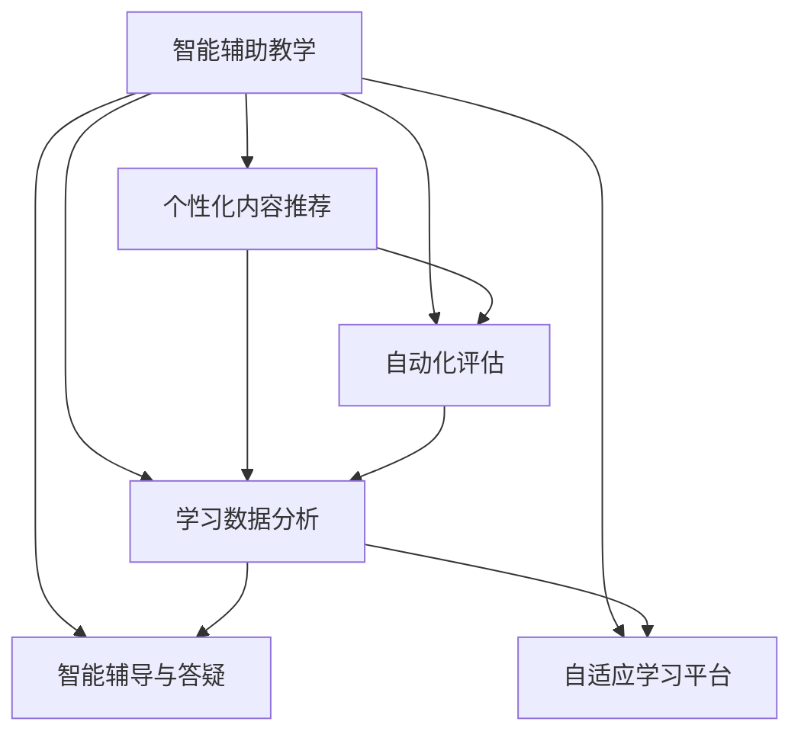

                 

## 1. 背景介绍

### 1.1 问题由来

随着人工智能技术的迅猛发展，AI在教育领域的应用日益广泛。从智能辅助教学到个性化学习推荐，从虚拟教师到作业批改，AI技术正逐步改变传统教育的模式，提升教育的质量和效率。特别是在全球疫情冲击下，AI教育应用更是凸显了其不可或缺的重要作用。然而，尽管AI教育技术具有巨大的潜力，其在实际应用中仍面临诸多挑战，如何更好地将AI技术融入教育体系，成为教育技术工作者亟需解决的重大课题。

### 1.2 问题核心关键点

AI在教育领域的应用主要集中在以下核心点：

- 智能辅助教学：使用AI技术提供个性化、适性化的教学内容，辅助教师进行教学。
- 自动化评估与反馈：通过AI对学生作业进行自动批改，提供即时、准确的评估反馈。
- 学习数据分析：利用AI分析学生学习行为数据，指导个性化学习路径，提升学习效率。
- 智能辅导与答疑：使用AI提供24小时在线答疑服务，解答学生的疑问。
- 自适应学习平台：基于AI的推荐系统，为学生提供个性化的学习资源和路径。

## 2. 核心概念与联系

### 2.1 核心概念概述

为了更好地理解AI在教育领域的应用，我们首先需要理解一些核心概念：

- 人工智能(Artificial Intelligence, AI)：一种模拟人类智能行为的技术，涵盖机器学习、深度学习、自然语言处理等领域。
- 自适应学习(Adaptive Learning)：基于学生学习状态，动态调整学习内容、方法、策略的过程。
- 机器学习(Machine Learning, ML)：通过数据训练模型，使模型能够从数据中学习规律，实现预测、分类、聚类等任务。
- 深度学习(Deep Learning, DL)：一种基于神经网络的机器学习范式，通过多层次的抽象表示学习复杂的非线性关系。
- 自然语言处理(Natural Language Processing, NLP)：使计算机能够理解、分析、生成人类语言的技术。
- 学习分析(Learning Analytics)：利用数据分析技术，追踪和理解学习者行为和绩效，以指导教育决策和改进教学。
- 在线教育(E-learning)：利用互联网技术，提供远程在线教学服务。

这些核心概念相互交织，共同构成了AI在教育领域的应用框架。

### 2.2 核心概念原理和架构的 Mermaid 流程图



这个流程图展示了AI在教育领域的核心应用路径：

1. 智能辅助教学(A)：利用AI技术为教师提供个性化、适性化的教学支持。
2. 个性化内容推荐(B)：基于学生兴趣和学习状态，动态调整学习内容。
3. 自动化评估(C)：利用AI自动批改作业，提供即时反馈。
4. 学习数据分析(D)：通过AI分析学生学习行为数据，指导个性化学习路径。
5. 智能辅导与答疑(E)：提供24小时在线答疑服务。
6. 自适应学习平台(F)：基于AI的推荐系统，提供个性化学习资源和路径。

这些应用相互支持，共同构建起AI在教育领域的完整生态。

## 3. 核心算法原理 & 具体操作步骤

### 3.1 算法原理概述

AI在教育领域的应用，主要依赖于机器学习、深度学习和自然语言处理等核心技术。其核心原理可归纳为以下几点：

1. 数据驱动：基于大量的学生学习数据，训练AI模型，使其能够对学生行为进行预测和分析。
2. 模型优化：通过反向传播算法，调整模型参数，优化模型性能。
3. 自然语言理解：利用NLP技术，使AI能够理解学生和教师的自然语言指令和反馈。
4. 交互学习：通过与学生的互动，不断调整和优化模型，提升学习效果。
5. 实时响应：利用AI的快速计算能力，提供即时的学习反馈和评估。

### 3.2 算法步骤详解

AI在教育领域的应用主要包括以下几个步骤：

**Step 1: 数据收集与预处理**

- 收集学生学习数据，包括成绩、作业、测验、阅读习惯等。
- 对数据进行清洗和标准化，去除噪声和异常值。
- 将数据分为训练集、验证集和测试集。

**Step 2: 模型训练与优化**

- 选择合适的算法模型，如决策树、随机森林、神经网络等。
- 使用训练集数据对模型进行训练，优化模型参数。
- 在验证集上进行模型调优，避免过拟合。
- 在测试集上进行模型评估，检查模型泛化能力。

**Step 3: 应用部署与实时响应**

- 将训练好的模型部署到在线教育平台，进行实时应用。
- 利用API接口，实现与用户系统的数据交互。
- 对用户反馈进行实时分析，动态调整模型参数和策略。
- 通过多模态数据融合，提升AI系统的综合能力。

**Step 4: 用户体验与持续优化**

- 对AI系统进行用户界面设计，提升用户体验。
- 收集用户反馈，不断优化系统功能和服务质量。
- 对新数据进行重新训练，保持系统的高效和准确。

### 3.3 算法优缺点

AI在教育领域的应用具有以下优点：

1. 提升教学效率：AI可以辅助教师进行个性化教学，快速批改作业，实时评估学生表现。
2. 个性化学习：AI能够根据学生学习状态和兴趣，推荐适性化的学习资源和路径。
3. 数据驱动：AI基于大数据分析，能够发现学生的学习规律和特征，指导个性化学习。
4. 实时响应：AI能够提供即时的反馈和建议，帮助学生及时调整学习策略。

同时，AI在教育领域也面临一些挑战：

1. 数据隐私：学生学习数据涉及个人隐私，需要确保数据安全。
2. 技术依赖：AI系统需要高度的技术支持，维护成本较高。
3. 公平性：AI可能存在算法偏见，需要确保系统的公平性和无偏见。
4. 用户接受度：部分教师和学生可能对AI技术持怀疑态度，需要逐步引导和推广。

### 3.4 算法应用领域

AI在教育领域的应用涵盖多个方面，包括但不限于以下领域：

- 智能辅助教学：通过AI辅助教师进行教学，提升教学效果。
- 自动化评估与反馈：使用AI自动批改作业，提供即时反馈。
- 学习数据分析：利用AI分析学生学习行为数据，指导个性化学习路径。
- 智能辅导与答疑：提供24小时在线答疑服务，解答学生的疑问。
- 自适应学习平台：基于AI的推荐系统，为学生提供个性化的学习资源和路径。
- 智能教材推荐：利用AI推荐适合的教材和学习资源。
- 情感分析：通过NLP技术，分析学生情绪变化，提供心理健康支持。
- 作业生成：利用AI生成个性化作业，提升作业多样性。

## 4. 数学模型和公式 & 详细讲解

### 4.1 数学模型构建

本节将使用数学语言对AI在教育领域的应用进行更加严格的刻画。

记学生学习数据为 $D=\{(x_i,y_i)\}_{i=1}^N$，其中 $x_i$ 为学生的特征向量，$y_i$ 为学生在学习任务上的表现。假设我们使用深度神经网络模型 $M_{\theta}$ 对数据进行建模，其中 $\theta$ 为模型参数。

定义损失函数为 $L(\theta) = \frac{1}{N}\sum_{i=1}^N \ell(y_i, M_{\theta}(x_i))$，其中 $\ell$ 为损失函数，如均方误差、交叉熵等。

微调的优化目标是最小化损失函数 $L(\theta)$。

### 4.2 公式推导过程

以线性回归模型为例，其目标是最小化均方误差损失函数：

$$
L(\theta) = \frac{1}{N}\sum_{i=1}^N (y_i - M_{\theta}(x_i))^2
$$

其中 $M_{\theta}(x_i)$ 为线性回归模型的输出，即 $M_{\theta}(x_i) = \theta^T x_i$。

对损失函数求导，得到梯度：

$$
\nabla_{\theta}L(\theta) = \frac{2}{N}\sum_{i=1}^N (y_i - M_{\theta}(x_i))x_i
$$

使用梯度下降算法更新模型参数：

$$
\theta \leftarrow \theta - \eta \nabla_{\theta}L(\theta)
$$

其中 $\eta$ 为学习率。

在实际应用中，一般使用反向传播算法计算梯度，并将模型参数 $\theta$ 更新到最小化损失函数的目标值。

### 4.3 案例分析与讲解

以智能辅导与答疑为例，我们利用AI技术开发一个智能问答系统。假设系统接收学生提问 $q$，返回最佳答案 $a$。

- 数据预处理：将提问 $q$ 转化为模型输入 $x$，将答案 $a$ 转化为模型输出 $y$。
- 模型训练：使用大量问答对数据 $D$ 训练模型 $M_{\theta}$，最小化均方误差损失函数。
- 模型推理：将学生提问 $q$ 输入模型，得到预测答案 $a'$。
- 结果评估：比较预测答案 $a'$ 和真实答案 $a$，计算误差 $e$。
- 反馈优化：根据误差 $e$ 调整模型参数 $\theta$，提高模型预测精度。

通过不断迭代训练和优化，智能问答系统能够逐步提升预测准确率，实现对学生问题的有效解答。

## 5. 项目实践：代码实例和详细解释说明

### 5.1 开发环境搭建

在进行AI教育应用开发前，我们需要准备好开发环境。以下是使用Python进行TensorFlow开发的环境配置流程：

1. 安装Anaconda：从官网下载并安装Anaconda，用于创建独立的Python环境。

2. 创建并激活虚拟环境：
```bash
conda create -n tf-env python=3.8 
conda activate tf-env
```

3. 安装TensorFlow：根据CUDA版本，从官网获取对应的安装命令。例如：
```bash
conda install tensorflow tensorflow-gpu=2.6 -c conda-forge
```

4. 安装Flax库：
```bash
pip install flax
```

5. 安装Flax-CV库：
```bash
pip install flax-cv
```

6. 安装TensorBoard：
```bash
pip install tensorboard
```

完成上述步骤后，即可在`tf-env`环境中开始AI教育应用开发。

### 5.2 源代码详细实现

下面我们以智能辅导与答疑系统为例，给出使用TensorFlow和Flax库进行开发的PyTorch代码实现。

首先，定义数据预处理函数：

```python
import tensorflow as tf
import flax.linen as nn
import flax.linen.layers as layers
import flax.linen.initializers as init
import flax

def preprocess(text):
    text = text.lower()
    text = re.sub(r'[^\w\s]', '', text)
    return text
```

然后，定义模型结构和初始化函数：

```python
class QuestionAnswerer(nn.Module):
    embedding_dim: int
    vocab_size: int
    num_labels: int

    @nn.compact
    def __call__(self, input_ids):
        embeddings = layers.Embedding(self.vocab_size, self.embedding_dim)(input_ids)
        # 可以使用Transformer模型或其他深度神经网络模型
        # ...
        # 对模型输出进行softmax，得到预测标签
        logits = nn.Dense(self.num_labels)(output)
        return logits

def get_model(vocab_size, embedding_dim, num_labels):
    return QuestionAnswerer(
        embedding_dim=embedding_dim,
        vocab_size=vocab_size,
        num_labels=num_labels,
    )
```

接着，定义训练和评估函数：

```python
import flax.traverse_util as traverse
import flax.linen.initializers as init
import flax.struct as struct
import jax
import jax.numpy as jnp
import flax

@jax.jit
def train_step(optimizer, model, batch):
    learning_rate = jax.lax.cosine_decay(0.001, step, total_steps)
    params = optimizer.init.get_initial_params()
    params = optimizer.apply gradients(params, model(params), batch)
    return params, model(params), optimizer.apply updates(params)

@jax.jit
def evaluate(model, batch):
    loss = jnp.mean(model(batch))
    return loss
```

最后，启动训练流程并在测试集上评估：

```python
batch_size = 32
num_epochs = 10
lr = 0.001

# 数据加载
train_data = load_train_data()
test_data = load_test_data()

# 模型初始化
model = get_model(vocab_size, embedding_dim, num_labels)

# 训练优化器
optimizer = flax.optimizer.Adam(learning_rate=lr)

# 训练循环
for epoch in range(num_epochs):
    for batch in train_data:
        params, model, optimizer = train_step(optimizer, model, batch)
    test_loss = evaluate(model, test_data)
    print(f"Epoch {epoch+1}, test loss: {test_loss:.3f}")
```

以上就是使用TensorFlow和Flax库进行智能辅导与答疑系统开发的完整代码实现。可以看到，利用TensorFlow和Flax库，开发者可以方便地进行模型定义、训练和评估，实现高效的AI教育应用。

### 5.3 代码解读与分析

让我们再详细解读一下关键代码的实现细节：

**QuestionAnswerer类**：
- `__call__`方法：定义模型的前向传播过程，输入为学生提问，输出为预测答案。

**train_step函数**：
- 使用Adam优化器更新模型参数。
- 对模型输出进行softmax，计算损失函数。
- 对损失函数求梯度，更新模型参数。

**evaluate函数**：
- 计算模型在测试集上的平均损失。

**训练流程**：
- 定义批量大小和学习率，准备训练和测试数据。
- 定义模型和优化器，启动训练循环。
- 在每个epoch结束后，评估模型在测试集上的表现。

可以看到，TensorFlow和Flax库提供了一整套灵活的深度学习框架，使得开发者可以高效地实现AI教育应用的训练和评估。通过优化模型的结构和算法，我们能够进一步提升系统的性能和效率。

## 6. 实际应用场景

### 6.1 智能辅助教学

智能辅助教学是AI在教育领域的重要应用之一。通过AI技术，可以为教师提供个性化、适性化的教学支持，提升教学效果。

具体而言，AI可以自动生成教学内容、推荐适性化的教学资源、优化课堂互动、提供智能评估等。例如，AI可以分析学生的学习行为数据，生成个性化的学习路径和推荐学习资源，帮助学生更高效地学习。

**案例分析**：
- 某在线教育平台开发了智能辅助教学系统，通过分析学生的学习行为数据，自动生成个性化的学习计划和推荐学习资源，帮助学生高效学习。系统使用TensorFlow和Flax库进行开发，训练模型对学生的学习状态进行预测，指导学习路径的调整。

**效果评估**：
- 该系统使用自适应学习数据分析学生的学习行为，生成个性化的学习路径，提高了学生的学习效率。

### 6.2 自动化评估与反馈

AI可以自动批改作业、评估学生表现，提供即时、准确的评估反馈。通过自动化评估，可以大幅减轻教师的工作负担，提升教学效率。

具体而言，AI可以通过文本分析和情感分析，自动评估学生的作业和测试表现，生成详细的反馈报告。例如，AI可以识别出学生的错误点，给出针对性的改进建议。

**案例分析**：
- 某在线教育平台开发了自动化评估系统，通过NLP技术分析学生的作业和测试表现，自动评估学生成绩，生成反馈报告。系统使用BERT模型进行文本分析和情感分析，快速生成评估结果。

**效果评估**：
- 该系统能够自动评估学生的作业和测试表现，快速生成反馈报告，提升了教学效率和学生学习效果。

### 6.3 学习数据分析

通过AI分析学生学习行为数据，可以发现学生的学习规律和特征，指导个性化学习路径，提升学习效率。

具体而言，AI可以分析学生的学习时间、学习频率、知识点掌握情况等，发现学生的学习瓶颈和薄弱环节，提供针对性的学习建议。例如，AI可以识别出学生的易错知识点，推荐相关练习题进行巩固。

**案例分析**：
- 某在线教育平台开发了学习数据分析系统，通过分析学生的学习行为数据，识别学生的学习瓶颈和薄弱环节，提供针对性的学习建议。系统使用TensorFlow和Flax库进行开发，训练模型对学生的学习状态进行预测，生成个性化学习建议。

**效果评估**：
- 该系统能够分析学生的学习行为数据，发现学生的学习瓶颈和薄弱环节，提供针对性的学习建议，提高了学生的学习效率。

### 6.4 智能辅导与答疑

AI可以提供24小时在线答疑服务，解答学生的疑问。通过智能辅导与答疑，可以提升学生的学习效果，提高教学满意度。

具体而言，AI可以通过自然语言处理技术，理解学生的自然语言提问，快速生成精准的回答。例如，AI可以回答学生的常见问题，提供详细的解答和示例。

**案例分析**：
- 某在线教育平台开发了智能辅导与答疑系统，通过自然语言处理技术理解学生的自然语言提问，快速生成精准的回答。系统使用Transformer模型进行自然语言处理，快速生成回答。

**效果评估**：
- 该系统能够理解学生的自然语言提问，快速生成精准的回答，提高了学生的学习效果和教学满意度。

### 6.5 自适应学习平台

基于AI的推荐系统，可以提供个性化的学习资源和路径，帮助学生更高效地学习。

具体而言，AI可以根据学生的学习行为数据，推荐适性化的学习资源和路径，提升学习效果。例如，AI可以推荐学生感兴趣的课程和教材，帮助学生深入学习。

**案例分析**：
- 某在线教育平台开发了自适应学习平台，通过推荐系统为学生提供个性化的学习资源和路径。系统使用TensorFlow和Flax库进行开发，训练模型对学生的学习状态进行预测，推荐适性化的学习资源和路径。

**效果评估**：
- 该平台能够根据学生的学习行为数据，推荐适性化的学习资源和路径，提高了学生的学习效率。

## 7. 工具和资源推荐

### 7.1 学习资源推荐

为了帮助开发者系统掌握AI在教育领域的应用理论基础和实践技巧，这里推荐一些优质的学习资源：

1. 《机器学习》系列课程：由斯坦福大学Andrew Ng教授讲授的机器学习课程，涵盖了机器学习的基本概念和算法。

2. 《深度学习》系列课程：由吴恩达教授讲授的深度学习课程，涵盖了深度神经网络、卷积神经网络、循环神经网络等内容。

3. 《自然语言处理》系列课程：由斯坦福大学、麻省理工学院等知名大学开设的NLP课程，涵盖了NLP的基本概念和算法。

4. 《智能教育技术》系列书籍：系统介绍了AI在教育领域的应用，包括智能辅导、自动化评估、学习数据分析等。

5. 《TensorFlow教程》：由TensorFlow官网提供的官方教程，详细介绍了TensorFlow的开发和应用。

6. 《Flax官方文档》：Flax库的官方文档，提供了丰富的API和示例，方便开发者快速上手开发AI应用。

通过对这些资源的学习实践，相信你一定能够快速掌握AI在教育领域的应用精髓，并用于解决实际的AI教育问题。

### 7.2 开发工具推荐

高效的开发离不开优秀的工具支持。以下是几款用于AI教育应用开发的常用工具：

1. TensorFlow：基于Python的开源深度学习框架，灵活动态的计算图，适合快速迭代研究。

2. PyTorch：基于Python的开源深度学习框架，灵活的动态计算图，支持多种硬件设备。

3. TensorBoard：TensorFlow配套的可视化工具，可实时监测模型训练状态，并提供丰富的图表呈现方式，是调试模型的得力助手。

4. Jupyter Notebook：交互式的编程环境，适合进行模型开发和调试。

5. Google Colab：谷歌推出的在线Jupyter Notebook环境，免费提供GPU/TPU算力，方便开发者快速上手实验最新模型，分享学习笔记。

合理利用这些工具，可以显著提升AI教育应用开发效率，加快创新迭代的步伐。

### 7.3 相关论文推荐

AI在教育领域的应用源于学界的持续研究。以下是几篇奠基性的相关论文，推荐阅读：

1. LSTM for Sequence Prediction: An LSTM-Based Approach for Predicting Student Engagement in Higher Education。研究使用LSTM模型预测学生参与度，分析学习行为数据。

2. Deep Learning for Personalized Education: A Survey and Taxonomy。系统综述了深度学习在个性化教育中的应用，涵盖了智能辅导、自动化评估、学习数据分析等方向。

3. Adaptive Learning by Deep Reinforcement Learning。提出使用深度强化学习算法优化自适应学习路径，提高学习效果。

4. Learning Analytics and Knowledge in Education: Issues and Challenges。综述了学习分析在教育中的应用，探讨了面临的挑战和解决方案。

这些论文代表了大语言模型微调技术的发展脉络。通过学习这些前沿成果，可以帮助研究者把握学科前进方向，激发更多的创新灵感。

## 8. 总结：未来发展趋势与挑战

### 8.1 总结

本文对AI在教育领域的应用进行了全面系统的介绍。首先阐述了AI在教育领域的应用背景和重要性，明确了AI在提升教学效率、个性化学习、自动化评估等方面所具有的独特价值。其次，从原理到实践，详细讲解了AI在教育领域的应用模型和关键步骤，给出了AI教育应用的完整代码实例。同时，本文还广泛探讨了AI教育应用在智能辅助教学、自动化评估与反馈、学习数据分析、智能辅导与答疑等多个方面的实际应用，展示了AI教育应用的巨大潜力。此外，本文精选了AI教育应用的各类学习资源，力求为读者提供全方位的技术指引。

通过本文的系统梳理，可以看到，AI技术正在成为教育领域的重要工具，极大地提升了教学效率和学生学习效果。未来，伴随AI技术的不断进步，AI教育应用必将在更多领域得到广泛应用，为教育技术创新提供新的突破口。

### 8.2 未来发展趋势

展望未来，AI在教育领域的应用将呈现以下几个发展趋势：

1. 智能辅助教学的普及化：AI辅助教学将成为教育领域的标配，广泛应用于各级各类教育机构。

2. 个性化学习的普及化：基于AI的推荐系统将广泛应用，为学生提供个性化的学习资源和路径，提升学习效果。

3. 学习分析的普及化：AI将广泛应用于学习数据分析，帮助教师和学生更好地理解和优化学习过程。

4. 在线教育的普及化：在线教育平台将成为教育的重要组成部分，AI技术将推动在线教育向更智能、更高效的方向发展。

5. 跨学科整合的普及化：AI将与心理学、社会学等学科进行整合，提升教育的科学性和人性化。

这些趋势凸显了AI在教育领域的应用前景，AI技术必将成为教育变革的重要推动力量。

### 8.3 面临的挑战

尽管AI在教育领域的应用已经取得了显著成果，但在迈向更加智能化、普适化应用的过程中，仍面临诸多挑战：

1. 数据隐私：学生学习数据涉及个人隐私，需要确保数据安全。如何保护学生隐私，成为亟需解决的重要问题。

2. 技术依赖：AI系统需要高度的技术支持，维护成本较高。如何降低技术门槛，提升系统的易用性，成为未来发展的关键。

3. 公平性：AI可能存在算法偏见，需要确保系统的公平性和无偏见。如何消除算法偏见，确保系统的公平性，成为重要的研究方向。

4. 用户接受度：部分教师和学生可能对AI技术持怀疑态度，需要逐步引导和推广。如何提升用户接受度，增强系统的应用效果，成为亟需解决的问题。

5. 伦理道德：AI在教育应用中可能涉及伦理道德问题，如何确保系统的伦理合规，保障学生和教师的权益，成为重要的研究课题。

6. 实效性：部分AI系统虽然在技术上先进，但在实际应用中可能存在实效性不足的问题，如何提升系统的实效性，增强系统的应用效果，成为亟需解决的问题。

这些挑战凸显了AI在教育领域的应用潜力，也凸显了AI技术推广应用的复杂性和困难性。

### 8.4 研究展望

面对AI在教育领域面临的挑战，未来的研究需要在以下几个方面寻求新的突破：

1. 数据隐私保护：开发高效的数据隐私保护技术，确保学生学习数据的安全。

2. 技术易用性提升：降低AI系统的技术门槛，提升系统的易用性，帮助更多教师和学生使用AI技术。

3. 算法公平性优化：开发公平性优化的算法，消除AI系统的算法偏见，确保系统的公平性。

4. 用户接受度提升：通过教育和宣传，提升教师和学生对AI技术的接受度，推动AI技术在教育领域的广泛应用。

5. 伦理道德合规：制定AI教育的伦理标准，确保AI系统的伦理合规，保障学生和教师的权益。

6. 实效性提升：开发高效的AI系统，提升系统的实效性，增强系统的应用效果。

这些研究方向将推动AI在教育领域的广泛应用，帮助教育行业更好地利用AI技术，提升教学效果和学生学习体验。

## 9. 附录：常见问题与解答

**Q1：AI在教育领域的应用主要集中在哪些方面？**

A: AI在教育领域的应用主要集中在以下几个方面：

1. 智能辅助教学：使用AI技术为教师提供个性化、适性化的教学支持。
2. 自动化评估与反馈：使用AI自动批改作业，提供即时反馈。
3. 学习数据分析：利用AI分析学生学习行为数据，指导个性化学习路径。
4. 智能辅导与答疑：提供24小时在线答疑服务，解答学生的疑问。
5. 自适应学习平台：基于AI的推荐系统，为学生提供个性化的学习资源和路径。
6. 智能教材推荐：利用AI推荐适合的教材和学习资源。
7. 情感分析：通过NLP技术，分析学生情绪变化，提供心理健康支持。
8. 作业生成：利用AI生成个性化作业，提升作业多样性。

**Q2：AI在教育领域的应用如何确保数据隐私？**

A: 确保AI在教育领域的数据隐私，需要从以下几个方面进行考虑：

1. 数据匿名化：对学生学习数据进行匿名化处理，去除可能泄露隐私的信息。
2. 数据加密：对数据进行加密存储和传输，确保数据安全。
3. 数据访问控制：限制数据访问权限，确保只有授权人员可以访问数据。
4. 数据审计：定期对数据访问和处理进行审计，确保数据使用合规。

通过这些措施，可以有效保护学生学习数据的安全。

**Q3：AI在教育领域的应用有哪些优势？**

A: AI在教育领域的应用具有以下优势：

1. 提升教学效率：AI可以辅助教师进行个性化教学，快速批改作业，实时评估学生表现。
2. 个性化学习：AI能够根据学生学习状态和兴趣，推荐适性化的学习资源和路径。
3. 数据驱动：AI基于大数据分析，能够发现学生的学习规律和特征，指导个性化学习。
4. 实时响应：AI能够提供即时的反馈和建议，帮助学生及时调整学习策略。
5. 学习分析：AI可以分析学生的学习行为数据，提供针对性的学习建议，提高学习效率。
6. 自适应学习平台：基于AI的推荐系统，为学生提供个性化的学习资源和路径。

这些优势使得AI在教育领域的应用前景广阔。

**Q4：AI在教育领域的应用如何降低技术门槛？**

A: 降低AI在教育领域的技术门槛，需要从以下几个方面进行考虑：

1. 简单易用的开发框架：选择简单易用的开发框架，降低开发者技术门槛。
2. 完善的文档和示例：提供完善的文档和示例，帮助开发者快速上手开发AI应用。
3. 在线培训和支持：提供在线培训和支持，帮助教师和学生了解和应用AI技术。
4. 用户友好界面：设计用户友好的界面，降低用户使用AI系统的难度。
5. 自动化部署：提供自动化部署工具，简化系统部署过程。

通过这些措施，可以有效降低AI在教育领域的技术门槛，推动AI技术的广泛应用。

**Q5：AI在教育领域的应用如何确保公平性？**

A: 确保AI在教育领域的公平性，需要从以下几个方面进行考虑：

1. 公平性算法：开发公平性优化的算法，消除AI系统的算法偏见，确保系统的公平性。
2. 数据平衡：确保训练数据集的平衡性，避免数据偏差影响模型。
3. 透明度和可解释性：提高AI系统的透明度和可解释性，便于发现和纠正偏见。
4. 多方参与：邀请多方参与，包括教师、学生和专家，共同审查和评估AI系统的公平性。

通过这些措施，可以有效确保AI在教育领域的公平性，避免算法偏见带来的负面影响。

---

作者：禅与计算机程序设计艺术 / Zen and the Art of Computer Programming

