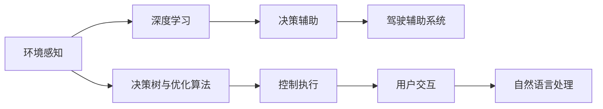

                 

# AI在智能汽车中的应用:提升驾驶体验

## 1. 背景介绍

### 1.1 问题由来

随着人工智能技术的迅速发展，智能汽车已逐步成为未来汽车产业的核心方向。智能汽车能够利用各种先进的技术，提升驾驶安全性、舒适性和便利性，为用户带来全新的驾驶体验。其中，人工智能（AI）技术在智能汽车中的应用广泛而深入，涉及从感知、决策到控制等各个环节，成为提升智能汽车性能的关键。

### 1.2 问题核心关键点

AI在智能汽车中的应用主要体现在以下几个方面：

- **环境感知**：通过摄像头、雷达、激光雷达等传感器，感知周围环境和道路条件，实现实时环境监测。
- **决策辅助**：利用深度学习等技术，对感知到的信息进行分析和处理，辅助驾驶员做出决策，如自动紧急制动（AEB）、自适应巡航控制（ACC）等。
- **控制执行**：通过自动驾驶技术，实现车辆自主控制，包括转向、加速、制动等功能，提升驾驶安全性。
- **用户交互**：通过自然语言处理（NLP）、语音识别和合成等技术，实现人与车的智能交互，如语音控制导航、智能信息提示等。

这些应用展示了AI技术在智能汽车中的巨大潜力和广阔应用前景。本文将深入探讨AI在智能汽车中的核心概念、算法原理及实际操作，以及其未来发展趋势与面临的挑战。

## 2. 核心概念与联系

### 2.1 核心概念概述

为了更好地理解AI在智能汽车中的应用，我们先对相关核心概念进行概述：

- **感知技术**：通过摄像头、雷达、激光雷达等传感器，捕捉车辆周围环境数据，实现实时环境感知。
- **深度学习**：利用神经网络模型对传感器数据进行处理和分析，识别交通标志、车辆、行人等目标。
- **决策树与优化算法**：结合决策树、强化学习等算法，对感知到的信息进行决策处理，优化行驶策略。
- **自然语言处理**：利用NLP技术实现语音识别和自然语言交互，提升驾驶体验。
- **自动驾驶**：通过AI技术实现车辆自主控制，包括L2/L3/L4级别的自动驾驶功能。
- **驾驶辅助系统**：利用AI技术辅助驾驶员驾驶，包括自适应巡航控制（ACC）、车道保持辅助（LKA）等功能。

这些核心概念之间存在着紧密的联系，共同构成了AI在智能汽车中的完整应用体系。

### 2.2 核心概念原理和架构的 Mermaid 流程图



这个流程图展示了AI在智能汽车中的应用流程：

1. 环境感知通过传感器收集数据。
2. 深度学习对感知数据进行处理，识别目标和环境特征。
3. 决策树与优化算法对感知和识别结果进行决策处理。
4. 决策辅助系统根据决策结果，辅助驾驶员驾驶。
5. 控制执行系统实现车辆自主控制。
6. 用户交互系统提供智能语音和文本交互。

这些环节共同构成了一个智能汽车的核心应用框架，为驾驶安全性和便利性提供了有力支持。

## 3. 核心算法原理 & 具体操作步骤

### 3.1 算法原理概述

AI在智能汽车中的应用，主要依赖于深度学习和自动驾驶技术。深度学习通过神经网络模型，对传感器数据进行处理和分析，实现环境感知、目标识别和决策辅助等功能。自动驾驶技术则通过AI控制执行系统，实现车辆自主导航和驾驶。

以下是深度学习在智能汽车中的关键算法原理：

- **卷积神经网络（CNN）**：用于图像处理和目标检测，如利用CNN识别交通标志、车辆、行人等目标。
- **循环神经网络（RNN）**：用于序列数据处理，如利用LSTM进行驾驶行为预测和轨迹规划。
- **生成对抗网络（GAN）**：用于图像生成和增强，如通过GAN生成更清晰的车辆前视图像。

### 3.2 算法步骤详解

AI在智能汽车中的应用，通常包括以下关键步骤：

**Step 1: 数据收集与预处理**
- 通过摄像头、雷达、激光雷达等传感器，收集车辆周围环境数据。
- 对传感器数据进行滤波、归一化和增强等预处理，以提升模型训练效果。

**Step 2: 模型训练与优化**
- 利用深度学习模型对预处理后的数据进行训练，识别交通标志、车辆、行人等目标。
- 结合决策树、强化学习等算法，对识别结果进行决策处理，优化行驶策略。
- 采用对抗训练、正则化等技术，提升模型的鲁棒性和泛化能力。

**Step 3: 系统集成与测试**
- 将训练好的模型集成到智能驾驶系统中，实现感知、决策和控制等功能。
- 在测试环境中进行系统测试，评估模型性能和安全可靠性。
- 根据测试结果，不断优化模型参数和系统配置，确保系统的稳定性和安全性。

### 3.3 算法优缺点

AI在智能汽车中的应用，具有以下优点：

- **提升驾驶安全性**：通过AI技术辅助驾驶，能够有效降低交通事故发生率。
- **提升驾驶舒适性**：通过自动驾驶和驾驶辅助系统，减轻驾驶员负担，提升驾驶体验。
- **提升驾驶便利性**：通过自然语言处理和智能交互技术，实现语音控制和信息提示，提升用户交互体验。

同时，AI在智能汽车中的应用也存在一些局限性：

- **依赖传感器**：智能汽车需要配备大量的传感器，成本较高。
- **环境适应性**：AI系统在某些复杂环境下（如极端天气、交通拥堵）可能表现不佳。
- **技术复杂性**：AI系统的开发和部署需要较高的技术门槛，难以快速普及。
- **安全与伦理**：AI系统在决策过程中可能存在一定的偏差和风险，需要严格的安全和伦理审查。

### 3.4 算法应用领域

AI在智能汽车中的应用，主要包括以下几个领域：

- **自动驾驶**：利用AI技术实现车辆自主导航和驾驶，包括L2/L3/L4级别的自动驾驶功能。
- **驾驶辅助**：利用AI技术辅助驾驶员驾驶，包括自适应巡航控制（ACC）、车道保持辅助（LKA）等功能。
- **环境感知**：利用AI技术感知车辆周围环境和道路条件，实现实时环境监测。
- **智能交互**：利用NLP技术实现语音识别和自然语言交互，提升驾驶体验。
- **驾驶行为分析**：利用AI技术分析驾驶员驾驶行为，提供驾驶建议和健康监控。

这些应用领域展示了AI技术在智能汽车中的广泛应用，为提升驾驶体验提供了坚实的技术基础。

## 4. 数学模型和公式 & 详细讲解 & 举例说明

### 4.1 数学模型构建

在智能汽车中，AI技术主要通过深度学习模型实现环境感知、目标识别和决策辅助等功能。以下是一个基本的深度学习模型结构：

```python
import torch
import torch.nn as nn
import torch.optim as optim

class CNN(nn.Module):
    def __init__(self):
        super(CNN, self).__init__()
        self.conv1 = nn.Conv2d(3, 32, 3, 1, 1)
        self.conv2 = nn.Conv2d(32, 64, 3, 1, 1)
        self.pool = nn.MaxPool2d(2, 2)
        self.fc1 = nn.Linear(64*30*30, 128)
        self.fc2 = nn.Linear(128, 2) # 2类：停车/行驶

    def forward(self, x):
        x = self.pool(F.relu(self.conv1(x)))
        x = self.pool(F.relu(self.conv2(x)))
        x = x.view(-1, 64*30*30)
        x = F.relu(self.fc1(x))
        x = self.fc2(x)
        return x
```

### 4.2 公式推导过程

在CNN模型中，输入数据 $x$ 经过卷积层、池化层和全连接层，最终输出一个二维的特征向量 $y$，用于表示停车和行驶两类目标的概率分布。推导过程如下：

1. 卷积层：将输入数据 $x$ 通过多个卷积核进行卷积操作，提取局部特征。

2. 池化层：对卷积层输出的特征图进行最大池化操作，减少特征维度。

3. 全连接层：将池化层输出的特征向量进行线性变换，得到最终的分类结果。

### 4.3 案例分析与讲解

以智能交通标志识别为例，CNN模型通过多层次的卷积操作，提取交通标志的局部特征，并通过全连接层进行分类。模型训练时，采用交叉熵损失函数和随机梯度下降（SGD）优化算法。在测试时，通过模型前向传播计算输出结果，进行预测。

## 5. 项目实践：代码实例和详细解释说明

### 5.1 开发环境搭建

在智能汽车AI应用开发中，通常需要以下开发环境：

1. 深度学习框架：如TensorFlow、PyTorch、Caffe等。
2. 传感器设备：如摄像头、雷达、激光雷达等。
3. 数据集：如KITTI、Cityscapes等，用于模型训练和验证。

### 5.2 源代码详细实现

以下是一个基于PyTorch的交通标志识别代码示例：

```python
import torch
import torch.nn as nn
import torch.optim as optim
from torch.utils.data import DataLoader
from torchvision import transforms

# 数据预处理
transform = transforms.Compose([
    transforms.ToTensor(),
    transforms.Normalize([0.5], [0.5])
])

# 加载数据集
train_dataset = datasets.ImageFolder(root='train', transform=transform)
test_dataset = datasets.ImageFolder(root='test', transform=transform)

# 模型定义
model = CNN()

# 训练循环
for epoch in range(num_epochs):
    for i, (inputs, labels) in enumerate(train_loader):
        # 前向传播
        outputs = model(inputs)
        # 计算损失
        loss = nn.CrossEntropyLoss()(outputs, labels)
        # 反向传播和参数更新
        optimizer.zero_grad()
        loss.backward()
        optimizer.step()

# 测试循环
with torch.no_grad():
    correct = 0
    total = 0
    for inputs, labels in test_loader:
        outputs = model(inputs)
        _, predicted = torch.max(outputs.data, 1)
        total += labels.size(0)
        correct += (predicted == labels).sum().item()

print('Accuracy of the network on the test images: {} %'.format(100 * correct / total))
```

### 5.3 代码解读与分析

该代码实现了基于CNN模型的交通标志识别功能。通过定义CNN模型、加载数据集和训练循环，实现了模型的训练和测试。代码中，使用了PyTorch的自动微分功能，简化了模型的反向传播和参数更新过程。

## 6. 实际应用场景

### 6.1 智能交通管理

智能交通管理是AI在智能汽车中应用的重要场景之一。通过AI技术，可以实现交通流量监测、事故预警和交通信号优化等功能，提升城市交通管理水平。

例如，智能交通系统可以通过摄像头和雷达实时监测道路交通状况，利用深度学习模型进行交通流量分析和预测，优化交通信号控制，减少交通拥堵。

### 6.2 智能停车辅助

智能停车辅助是AI在智能汽车中应用的另一个重要场景。通过AI技术，可以实现自动寻找停车位、自动泊车和辅助驾驶员停车等功能，提升停车体验。

例如，智能停车系统可以通过摄像头和雷达感知周围环境，利用深度学习模型进行目标检测和路径规划，自动寻找停车位并协助驾驶员泊车。

### 6.3 智能导航

智能导航是AI在智能汽车中的核心应用之一。通过AI技术，可以实现精准导航、语音控制和智能推荐等功能，提升驾驶便利性。

例如，智能导航系统可以通过GPS和地图数据，结合深度学习模型进行路径规划和导航优化，并提供语音控制和信息提示，提升驾驶体验。

### 6.4 未来应用展望

随着AI技术的不断进步，AI在智能汽车中的应用将更加广泛和深入。未来，AI在智能汽车中的应用将涵盖以下几个方向：

- **无人驾驶**：实现全自主驾驶，提升驾驶安全性和舒适性。
- **自动维修**：通过AI技术实现车辆自主诊断和维修，提升车辆维护效率。
- **智能交互**：通过AI技术提升车辆智能交互水平，实现更自然的驾驶体验。
- **个性化定制**：通过AI技术实现车辆个性化定制，满足用户多样化需求。

这些应用方向展示了AI技术在智能汽车中的巨大潜力和广泛应用前景，为未来智能汽车的全面普及奠定了坚实基础。

## 7. 工具和资源推荐

### 7.1 学习资源推荐

1. **深度学习课程**：如DeepLearning.ai、Coursera等，系统学习深度学习理论和实践。
2. **AI书籍**：如《深度学习》（Ian Goodfellow等）、《神经网络与深度学习》（Michael Nielsen）等，深入理解深度学习算法。
3. **AI论文**：如arXiv、Google Scholar等，获取最新AI研究进展和技术突破。
4. **开源项目**：如GitHub上的TensorFlow、PyTorch等，获取AI应用开发资源和代码示例。

### 7.2 开发工具推荐

1. **深度学习框架**：如TensorFlow、PyTorch、Caffe等，支持深度学习模型的训练和推理。
2. **传感器设备**：如摄像头、雷达、激光雷达等，用于环境感知和目标检测。
3. **数据集**：如KITTI、Cityscapes等，用于模型训练和验证。

### 7.3 相关论文推荐

1. **无人驾驶**：如"End to End Learning for Self-Driving Cars"（Bengio等），系统介绍无人驾驶技术。
2. **智能导航**：如"Semantic Segmentation with Fully Convolutional Networks for Autonomous Vehicles"（Chen等），介绍智能导航技术。
3. **自动维修**：如"A Survey of Deep Learning in Manufacturing: An Enabling Technology for Smart Manufacturing"（Guo等），介绍AI在制造业中的应用。

## 8. 总结：未来发展趋势与挑战

### 8.1 总结

AI在智能汽车中的应用，通过深度学习和自动驾驶技术，实现了环境感知、决策辅助和控制执行等功能，提升了驾驶安全性和便利性。本文从核心概念、算法原理和实际操作等方面，详细探讨了AI在智能汽车中的应用。通过实际项目实践，展示了AI技术的强大实力和广泛应用前景。

### 8.2 未来发展趋势

未来，AI在智能汽车中的应用将呈现以下几个发展趋势：

1. **高度自主驾驶**：随着技术进步，全自主驾驶将逐步普及，实现高度自主驾驶。
2. **多模态融合**：结合视觉、雷达、激光雷达等多模态数据，提升感知和决策精度。
3. **实时计算**：采用高效的计算架构，实现实时数据处理和决策。
4. **边缘计算**：利用边缘计算技术，提升数据处理效率和系统响应速度。
5. **智能化交互**：通过NLP技术实现更自然的智能交互，提升用户体验。

这些趋势展示了AI技术在智能汽车中的广阔应用前景，为未来智能汽车的全面普及奠定了坚实基础。

### 8.3 面临的挑战

AI在智能汽车中的应用，仍面临以下几个挑战：

1. **高昂成本**：智能汽车需要配备大量传感器和计算设备，成本较高。
2. **技术复杂性**：AI系统开发和部署需要较高技术门槛，难以快速普及。
3. **安全与伦理**：AI系统在决策过程中可能存在一定的偏差和风险，需要严格的安全和伦理审查。
4. **数据隐私**：智能汽车涉及大量个人数据，需要严格保护数据隐私。

### 8.4 研究展望

未来，AI在智能汽车中的应用需要解决以下几个问题：

1. **降低成本**：通过技术创新，降低智能汽车的生产和维护成本。
2. **简化技术**：提升AI技术的易用性和可移植性，降低技术门槛。
3. **强化安全**：通过算法优化和数据审查，提升AI系统的安全性和可靠性。
4. **保护隐私**：采用隐私保护技术，保障用户数据安全。

通过不断突破和创新，AI在智能汽车中的应用将变得更加高效和普及，为未来智能汽车的全面普及奠定坚实基础。

## 9. 附录：常见问题与解答

**Q1：智能汽车中的AI技术有哪些主要应用？**

A: 智能汽车中的AI技术主要应用于以下几个方面：

1. **环境感知**：通过摄像头、雷达、激光雷达等传感器，感知周围环境和道路条件，实现实时环境监测。
2. **决策辅助**：利用深度学习等技术，对感知到的信息进行分析和处理，辅助驾驶员做出决策，如自动紧急制动（AEB）、自适应巡航控制（ACC）等。
3. **控制执行**：通过自动驾驶技术，实现车辆自主控制，包括转向、加速、制动等功能，提升驾驶安全性。
4. **用户交互**：通过自然语言处理（NLP）、语音识别和合成等技术，实现语音控制和智能信息提示，提升驾驶体验。

**Q2：智能汽车中的AI技术如何提升驾驶安全性？**

A: AI技术在智能汽车中提升驾驶安全性的主要方式包括：

1. **环境感知**：通过摄像头、雷达、激光雷达等传感器，实时感知周围环境和道路条件，减少视觉盲区。
2. **决策辅助**：利用深度学习模型进行目标检测和识别，提前预测潜在危险，辅助驾驶员做出决策。
3. **自动驾驶**：通过自动驾驶技术实现车辆自主导航和控制，减少人为错误。
4. **驾驶行为分析**：利用AI技术分析驾驶员驾驶行为，提供驾驶建议和健康监控，预防交通事故。

**Q3：智能汽车中的AI技术面临哪些挑战？**

A: 智能汽车中的AI技术面临以下几个挑战：

1. **高昂成本**：智能汽车需要配备大量传感器和计算设备，成本较高。
2. **技术复杂性**：AI系统开发和部署需要较高技术门槛，难以快速普及。
3. **安全与伦理**：AI系统在决策过程中可能存在一定的偏差和风险，需要严格的安全和伦理审查。
4. **数据隐私**：智能汽车涉及大量个人数据，需要严格保护数据隐私。

通过不断突破和创新，AI在智能汽车中的应用将变得更加高效和普及，为未来智能汽车的全面普及奠定坚实基础。

---

作者：禅与计算机程序设计艺术 / Zen and the Art of Computer Programming

