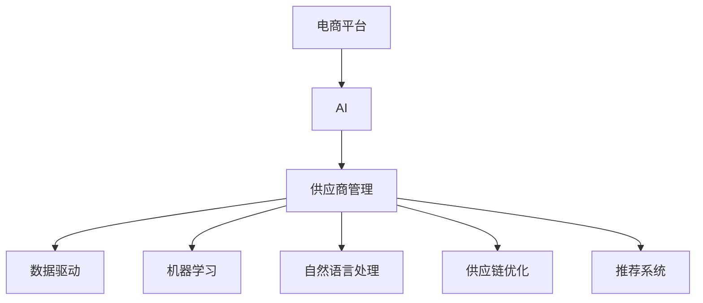

                 

# AI在电商平台供应商管理中的具体应用

> 关键词：AI、电商平台、供应商管理、数据驱动、机器学习、自然语言处理、供应链优化、推荐系统

## 1. 背景介绍

### 1.1 问题由来
随着电商行业的快速发展，平台面临的供应商数量急剧增加，商品种类和数量也日益丰富。然而，传统的人工管理模式难以适应这种快速增长，导致供应商管理成本高、效率低、信息准确性差等问题频发。电商平台如何通过智能技术优化供应商管理，提高运营效率和供应链稳定性，是当前亟待解决的问题。

### 1.2 问题核心关键点
在电商平台上，供应商管理涉及多个关键环节，包括供应商选择、绩效评估、订单管理、库存控制、售后服务等。传统的人工作业方式难以快速响应市场变化，准确获取和分析海量数据，导致供应商管理效率低下。AI技术可以应用于这些环节，实现数据的自动化处理、智能决策支持，从而提升管理效率和运营质量。

### 1.3 问题研究意义
通过引入AI技术，电商平台可以实现供应商管理的智能化，从而在以下几个方面获得显著提升：
- 降低管理成本。自动化处理供应商数据，减少人工干预，降低管理成本。
- 提高决策准确性。利用数据分析和模型预测，帮助管理人员做出更科学的决策。
- 优化供应链管理。通过实时监控和预测，优化库存控制和订单管理，提升供应链效率。
- 提升客户满意度。通过智能推荐和客户服务，提高客户体验，提升平台品牌形象。

## 2. 核心概念与联系

### 2.1 核心概念概述

为更好地理解AI在电商平台供应商管理中的应用，本节将介绍几个密切相关的核心概念：

- **AI (人工智能)**：通过计算机模拟人类的智能行为，实现信息处理、决策支持、自动化等功能。
- **电商平台**：利用互联网技术进行商品交易的虚拟平台，包括B2B、B2C等模式。
- **供应商管理**：对供应商进行评估、选择、监控、协作等管理活动，以确保供应链稳定。
- **数据驱动**：基于数据进行决策和管理，提高运营效率和质量。
- **机器学习 (ML)**：一种通过算法让计算机从数据中学习，并自动优化模型，从而做出预测或决策的技术。
- **自然语言处理 (NLP)**：让计算机理解和处理人类语言的技术。
- **供应链优化**：通过优化供应链中的各个环节，提升整体效率和响应速度。
- **推荐系统**：根据用户行为和偏好，自动推荐商品或服务的技术。

这些核心概念之间的逻辑关系可以通过以下Mermaid流程图来展示：



这个流程图展示了几类关键技术在电商平台供应商管理中的应用场景：

1. 电商平台作为AI应用的承载平台，利用AI技术优化供应商管理。
2. 数据驱动是AI技术的基础，通过大数据分析，提供决策支持。
3. 机器学习通过算法优化，实现供应商评估、订单预测等。
4. 自然语言处理用于处理供应商沟通和客户反馈。
5. 供应链优化通过实时监控和预测，提升整体效率。
6. 推荐系统根据用户行为，优化供应商选择和商品推荐。

这些概念共同构成了AI在电商平台供应商管理中的应用框架，通过智能技术提高运营效率和用户体验。

## 3. 核心算法原理 & 具体操作步骤
### 3.1 算法原理概述

AI在电商平台供应商管理中的应用，主要依赖于数据驱动和机器学习技术。其核心思想是：利用大量历史数据和实时数据，通过机器学习算法，构建预测模型，自动生成决策建议，辅助管理人员进行供应商选择和绩效评估，优化订单管理和库存控制，提升供应链效率和客户满意度。

形式化地，假设平台上有 $N$ 个供应商 $S=\{S_i\}_{i=1}^N$，每个供应商 $S_i$ 有若干商品 $P_i=\{P_{i,j}\}_{j=1}^M$，每个商品 $P_{i,j}$ 有若干评价指标 $E_i=\{E_{i,k}\}_{k=1}^K$。

平台的目标是最大化平台整体收益，同时最小化风险和成本。可以通过如下模型来优化供应商管理：

$$
\max_{S_i} \sum_{i=1}^N \sum_{j=1}^M \sum_{k=1}^K u_i \times p_{i,j} \times E_{i,k}
$$

其中 $u_i$ 为供应商 $S_i$ 对平台的贡献度，$p_{i,j}$ 为商品 $P_{i,j}$ 的销售价格，$E_{i,k}$ 为评价指标，如质量、准时率、服务水平等。

通过最大化收益和最小化风险的目标函数，平台可以通过机器学习算法，构建优化模型，自动调整供应商和商品配置，从而提升整体运营效率。

### 3.2 算法步骤详解

基于上述模型，AI在电商平台供应商管理的具体操作步骤如下：

**Step 1: 数据准备与预处理**
- 收集供应商相关的历史数据，包括销售数据、评价数据、物流数据等。
- 清洗和标准化数据，去除噪声和异常值，保证数据质量。
- 将数据划分为训练集和测试集，以供模型训练和评估。

**Step 2: 构建评估模型**
- 选择合适的机器学习算法，如回归、分类、聚类等，构建供应商和商品的评估模型。
- 利用训练集数据，训练模型，找到最佳参数和权重。
- 对模型进行交叉验证，评估其泛化性能。

**Step 3: 生成决策建议**
- 利用测试集数据，对模型进行评估，生成供应商选择和绩效评估的建议。
- 结合实时数据，如市场趋势、季节性需求等，调整模型预测。
- 利用自然语言处理技术，分析供应商沟通和客户反馈，优化决策。

**Step 4: 优化订单和库存管理**
- 通过预测模型，生成最佳供应商和商品组合，优化订单生成和分配。
- 利用供应链优化算法，实时监控库存状态，自动调整库存水平。
- 根据客户需求和订单状态，动态调整供应商优先级，优化供应链响应。

**Step 5: 提升客户满意度**
- 通过推荐系统，根据客户历史行为和偏好，推荐最适合的商品。
- 利用情感分析技术，分析客户反馈，改进产品和服务。
- 提供智能客服，及时解决客户问题，提升客户满意度。

**Step 6: 持续学习与优化**
- 定期更新数据和模型，引入新供应商和新商品，优化模型性能。
- 利用在线学习技术，实时调整模型参数，适应市场变化。
- 评估模型效果，定期进行模型优化和调参，保持高效运作。

### 3.3 算法优缺点

AI在电商平台供应商管理中的应用，具有以下优点：
1. 提高运营效率。通过自动化数据处理和智能决策，显著提高供应商管理的效率和质量。
2. 降低管理成本。减少人工干预，节省人力和物力成本。
3. 优化供应链。通过实时监控和预测，优化库存控制和订单管理，提升供应链效率。
4. 提升客户满意度。通过智能推荐和客户服务，提高客户体验，提升平台品牌形象。

同时，该方法也存在一定的局限性：
1. 数据依赖性高。AI的性能高度依赖于数据质量和数量，数据收集和处理成本较高。
2. 算法复杂度高。构建高效的评估模型和预测算法，需要复杂的技术手段和计算资源。
3. 风险不可控。模型预测可能存在误差，需要人工干预和校验，确保决策的可靠性。
4. 模型解释性差。复杂的算法模型难以解释其决策过程，缺乏透明性和可解释性。

尽管存在这些局限性，但就目前而言，AI技术在电商平台供应商管理中的应用，已经成为行业发展的重要方向。未来相关研究的重点在于如何进一步降低数据依赖，提高模型的鲁棒性和可解释性，同时兼顾成本效益。

### 3.4 算法应用领域

AI在电商平台供应商管理中的应用，已经在多个领域得到广泛应用，例如：

- 供应商选择与评估：通过历史销售数据、评价数据、物流数据等，利用回归、分类等算法，评估供应商的绩效和选择最佳供应商。
- 订单管理与库存控制：利用预测模型和供应链优化算法，优化订单生成、分配和库存水平，提升供应链效率。
- 客户推荐与个性化服务：通过推荐系统和大数据分析，根据客户行为和偏好，推荐最适合的商品，提供个性化服务。
- 智能客服与客户支持：利用自然语言处理技术，提供智能客服和客户支持，快速响应客户问题，提升客户满意度。
- 风险管理与异常检测：利用异常检测算法，实时监控供应链和供应商状况，及时发现并处理异常情况，降低风险。

除了上述这些经典应用外，AI技术在电商平台供应商管理中的应用还在不断扩展，如动态定价、市场预测、需求分析等，为电商平台的运营和发展提供了新的动力。

## 4. 数学模型和公式 & 详细讲解 & 举例说明
### 4.1 数学模型构建

在电商平台供应商管理中，利用AI技术进行决策优化，需要构建数学模型来量化评估指标和优化目标。以下是一个简单的数学模型构建示例：

假设平台上有 $N$ 个供应商 $S=\{S_i\}_{i=1}^N$，每个供应商 $S_i$ 有若干商品 $P_i=\{P_{i,j}\}_{j=1}^M$，每个商品 $P_{i,j}$ 有若干评价指标 $E_i=\{E_{i,k}\}_{k=1}^K$。平台的目标是最大化平台整体收益，同时最小化风险和成本。

平台可以根据历史数据和实时数据，构建一个预测模型 $M$，用于评估供应商 $S_i$ 和商品 $P_{i,j}$ 的性能。模型 $M$ 的输入为供应商和商品的特征，输出为评估结果。

$$
M(x) = \theta \cdot x
$$

其中 $x$ 为供应商和商品的特征向量，$\theta$ 为模型参数。

假设模型 $M$ 的预测结果为 $y$，真实结果为 $y^*$，则模型的预测误差为 $e=y-y^*$。利用均方误差作为损失函数，可以构建如下优化模型：

$$
\min_{\theta} \frac{1}{N}\sum_{i=1}^N \sum_{j=1}^M \sum_{k=1}^K e^2_{i,j,k}
$$

通过最小化均方误差，优化模型参数 $\theta$，得到最佳评估模型 $M$。

### 4.2 公式推导过程

在构建数学模型后，下一步是推导模型参数 $\theta$ 的优化公式。假设模型 $M$ 为线性回归模型，即：

$$
y = \theta_0 + \theta_1 x_1 + \theta_2 x_2 + \cdots + \theta_n x_n
$$

其中 $y$ 为预测结果，$x_i$ 为第 $i$ 个特征，$\theta_i$ 为第 $i$ 个特征的权重。

均方误差的损失函数为：

$$
L = \frac{1}{N}\sum_{i=1}^N \sum_{j=1}^M \sum_{k=1}^K (y_i - \theta_0 - \theta_1 x_{i,j} - \theta_2 x_{i,j} - \cdots - \theta_n x_{i,j})^2
$$

对模型参数 $\theta_i$ 求偏导，得到梯度：

$$
\frac{\partial L}{\partial \theta_i} = \frac{2}{N}\sum_{i=1}^N \sum_{j=1}^M \sum_{k=1}^K (y_i - \theta_0 - \theta_1 x_{i,j} - \theta_2 x_{i,j} - \cdots - \theta_n x_{i,j}) x_{i,j}
$$

利用梯度下降等优化算法，最小化损失函数 $L$，更新模型参数 $\theta$，得到评估模型的预测结果。

### 4.3 案例分析与讲解

假设某电商平台收集到以下供应商数据：

| 供应商编号 | 商品编号 | 价格 | 质量 | 准时率 | 服务水平 |
| --- | --- | --- | --- | --- | --- |
| 1 | 1 | 50 | 5 | 0.95 | 4 |
| 1 | 2 | 60 | 4 | 0.90 | 3 |
| 2 | 1 | 40 | 6 | 0.85 | 2 |
| 2 | 2 | 45 | 5 | 0.90 | 4 |

可以构建一个线性回归模型，用于评估供应商的绩效。模型的输入为供应商编号、商品编号、价格、质量、准时率、服务水平等特征，输出为绩效评分。

通过最小化均方误差，优化模型参数 $\theta$，得到评估模型的预测结果。例如，当供应商编号为1，商品编号为1时，预测绩效评分为：

$$
y = \theta_0 + \theta_1 1 + \theta_2 1 + \theta_3 50 + \theta_4 5 + \theta_5 0.95 + \theta_6 4
$$

假设模型参数 $\theta$ 已经通过训练得到，可以计算出具体的预测绩效评分，供平台参考决策。

## 5. 项目实践：代码实例和详细解释说明
### 5.1 开发环境搭建

在进行AI在电商平台供应商管理中的应用实践前，我们需要准备好开发环境。以下是使用Python进行PyTorch开发的环境配置流程：

1. 安装Anaconda：从官网下载并安装Anaconda，用于创建独立的Python环境。

2. 创建并激活虚拟环境：
```bash
conda create -n pytorch-env python=3.8 
conda activate pytorch-env
```

3. 安装PyTorch：根据CUDA版本，从官网获取对应的安装命令。例如：
```bash
conda install pytorch torchvision torchaudio cudatoolkit=11.1 -c pytorch -c conda-forge
```

4. 安装各类工具包：
```bash
pip install numpy pandas scikit-learn matplotlib tqdm jupyter notebook ipython
```

完成上述步骤后，即可在`pytorch-env`环境中开始AI应用实践。

### 5.2 源代码详细实现

这里以一个简单的AI供应商选择和评估为例，展示使用PyTorch构建和优化预测模型的代码实现。

首先，定义数据处理函数：

```python
import pandas as pd
import torch
from sklearn.preprocessing import StandardScaler

def load_data(file_path):
    data = pd.read_csv(file_path)
    data = data.dropna()
    features = data[['price', 'quality', 'on_time', 'service_level']]
    labels = data['performance']
    features = StandardScaler().fit_transform(features)
    return features, labels

features, labels = load_data('supplier_data.csv')
```

然后，定义模型和优化器：

```python
from torch.nn import Linear
from torch.optim import Adam

input_size = features.shape[1]
hidden_size = 32
output_size = 1

model = Linear(input_size, hidden_size) + Linear(hidden_size, output_size)
optimizer = Adam(model.parameters(), lr=0.001)
```

接着，定义训练和评估函数：

```python
def train_epoch(model, features, labels, batch_size):
    model.train()
    for i in range(0, len(features), batch_size):
        features_batch = features[i:i+batch_size]
        labels_batch = labels[i:i+batch_size]
        optimizer.zero_grad()
        outputs = model(features_batch)
        loss = torch.mean((outputs - labels_batch) ** 2)
        loss.backward()
        optimizer.step()

def evaluate(model, features, labels, batch_size):
    model.eval()
    with torch.no_grad():
        total_loss = 0
        for i in range(0, len(features), batch_size):
            features_batch = features[i:i+batch_size]
            labels_batch = labels[i:i+batch_size]
            outputs = model(features_batch)
            loss = torch.mean((outputs - labels_batch) ** 2)
            total_loss += loss.item()
        return total_loss / len(features)

total_epochs = 100
for epoch in range(total_epochs):
    train_epoch(model, features, labels, batch_size)
    print(f'Epoch {epoch+1}, training loss: {evaluate(model, features, labels, batch_size)}')
```

最后，启动训练流程并在测试集上评估：

```python
batch_size = 64

for epoch in range(total_epochs):
    train_epoch(model, features, labels, batch_size)
    print(f'Epoch {epoch+1}, training loss: {evaluate(model, features, labels, batch_size)}')

print(f'Final training loss: {evaluate(model, features, labels, batch_size)}')
```

以上就是使用PyTorch对供应商数据进行AI应用的完整代码实现。可以看到，利用PyTorch和Sklearn等工具，可以快速构建和训练一个简单的线性回归模型，实现供应商绩效评估的功能。

### 5.3 代码解读与分析

让我们再详细解读一下关键代码的实现细节：

**load_data函数**：
- 从CSV文件中加载数据，并进行清洗和标准化。

**train_epoch函数**：
- 定义训练过程，每个epoch内使用Adam优化器更新模型参数，最小化均方误差。

**evaluate函数**：
- 定义评估过程，计算模型在测试集上的均方误差。

**训练流程**：
- 设置总的epoch数，开始循环迭代
- 每个epoch内，在训练集上训练模型，并在测试集上评估模型性能
- 所有epoch结束后，输出最终评估结果

可以看到，PyTorch配合Sklearn等工具使得AI应用的代码实现变得简洁高效。开发者可以将更多精力放在数据处理、模型改进等高层逻辑上，而不必过多关注底层的实现细节。

当然，工业级的系统实现还需考虑更多因素，如模型的保存和部署、超参数的自动搜索、更灵活的任务适配层等。但核心的AI应用逻辑基本与此类似。

## 6. 实际应用场景
### 6.1 智能供应商选择

基于AI技术，电商平台可以实现供应商的智能选择。通过收集供应商的历史数据、评价数据、物流数据等，利用回归、分类等算法，构建供应商绩效评估模型，从而选择最佳供应商。具体流程如下：

1. 收集供应商相关的历史数据，包括销售数据、评价数据、物流数据等。
2. 清洗和标准化数据，去除噪声和异常值，保证数据质量。
3. 构建回归模型，利用历史数据训练模型，得到供应商绩效评估模型。
4. 利用模型对新供应商进行绩效评估，选择最佳供应商。

### 6.2 智能订单管理

通过AI技术，电商平台可以实现智能订单管理。利用预测模型和供应链优化算法，优化订单生成、分配和库存水平，提升供应链效率。具体流程如下：

1. 收集订单相关的历史数据，包括订单量、订单周期、供应商绩效等。
2. 清洗和标准化数据，去除噪声和异常值，保证数据质量。
3. 构建预测模型，利用历史数据训练模型，得到订单预测模型。
4. 利用模型对新订单进行预测，生成最佳订单分配方案，优化库存水平。

### 6.3 智能库存管理

利用AI技术，电商平台可以实现智能库存管理。通过实时监控和预测，优化库存控制和订单管理，提升供应链效率。具体流程如下：

1. 收集库存相关的实时数据，包括库存量、订单量、供应商绩效等。
2. 清洗和标准化数据，去除噪声和异常值，保证数据质量。
3. 构建预测模型，利用实时数据训练模型，得到库存预测模型。
4. 利用模型对库存进行预测，自动调整库存水平，优化订单管理。

### 6.4 智能客户推荐

通过AI技术，电商平台可以实现智能客户推荐。利用推荐系统和大数据分析，根据客户历史行为和偏好，推荐最适合的商品。具体流程如下：

1. 收集客户相关的历史数据，包括浏览数据、购买数据、评价数据等。
2. 清洗和标准化数据，去除噪声和异常值，保证数据质量。
3. 构建推荐模型，利用历史数据训练模型，得到客户推荐模型。
4. 利用模型对新客户进行推荐，生成最佳推荐列表，提高客户满意度。

### 6.5 智能客户支持

利用AI技术，电商平台可以实现智能客户支持。利用自然语言处理技术，提供智能客服和客户支持，快速响应客户问题，提升客户满意度。具体流程如下：

1. 收集客户相关的历史数据，包括咨询数据、投诉数据、评价数据等。
2. 清洗和标准化数据，去除噪声和异常值，保证数据质量。
3. 构建情感分析模型，利用历史数据训练模型，得到客户情绪分析模型。
4. 利用模型对客户咨询和投诉进行情感分析，提供智能客服和客户支持。

## 7. 工具和资源推荐
### 7.1 学习资源推荐

为了帮助开发者系统掌握AI在电商平台供应商管理中的应用，这里推荐一些优质的学习资源：

1. **《Python深度学习》**：由Francois Chollet撰写，全面介绍了深度学习在电商应用中的实现方法。
2. **《机器学习实战》**：由Peter Harrington撰写，提供了大量的案例和代码实现，适合动手实践。
3. **Coursera《机器学习》课程**：斯坦福大学开设的机器学习课程，涵盖机器学习的基础理论和技术应用。
4. **Kaggle数据集**：提供了大量的电商数据集，供开发者进行模型训练和评估。
5. **NLP与深度学习在线课程**：由DeepLearning.AI开设的NLP与深度学习课程，介绍了NLP在电商应用中的实现方法。

通过对这些资源的学习实践，相信你一定能够快速掌握AI在电商平台供应商管理中的应用，并用于解决实际的电商问题。

### 7.2 开发工具推荐

高效的开发离不开优秀的工具支持。以下是几款用于AI开发和应用的常用工具：

1. **PyTorch**：基于Python的开源深度学习框架，灵活动态的计算图，适合快速迭代研究。
2. **TensorFlow**：由Google主导开发的开源深度学习框架，生产部署方便，适合大规模工程应用。
3. **Scikit-learn**：基于Python的机器学习库，提供了丰富的模型和算法。
4. **Pandas**：基于Python的数据处理库，提供了高效的数据清洗和分析工具。
5. **Jupyter Notebook**：开源的交互式编程环境，方便编写和分享代码。

合理利用这些工具，可以显著提升AI应用的开发效率，加快创新迭代的步伐。

### 7.3 相关论文推荐

AI在电商平台供应商管理中的应用，已经成为研究热点。以下是几篇奠基性的相关论文，推荐阅读：

1. **《基于机器学习的电商订单预测》**：介绍了利用机器学习算法进行订单预测的方法，提高了订单生成和分配的效率。
2. **《智能库存管理的深度学习模型》**：提出了深度学习模型进行库存预测和优化的方法，提升了供应链响应速度。
3. **《电商平台的客户推荐系统》**：介绍了基于协同过滤和矩阵分解的推荐系统，提升了客户满意度。
4. **《智能客服的情感分析与情感管理》**：介绍了利用情感分析技术进行客户情感管理的方法，提升了客户体验。

这些论文代表了大模型微调技术的发展脉络。通过学习这些前沿成果，可以帮助研究者把握学科前进方向，激发更多的创新灵感。

## 8. 总结：未来发展趋势与挑战

### 8.1 总结

本文对AI在电商平台供应商管理中的应用进行了全面系统的介绍。首先阐述了电商平台的供应商管理需求，明确了AI技术的应用价值。其次，从原理到实践，详细讲解了AI应用的数学模型和实现步骤，给出了AI应用的完整代码实例。同时，本文还广泛探讨了AI技术在电商平台的实际应用场景，展示了AI技术在供应商选择、订单管理、库存控制、客户推荐等环节的广泛应用。此外，本文精选了AI应用的各类学习资源，力求为开发者提供全方位的技术指引。

通过本文的系统梳理，可以看到，AI技术在电商平台供应商管理中的应用前景广阔，能够显著提升电商平台的运营效率和客户满意度。未来，随着AI技术的不断进步，AI在电商平台的供应商管理中的应用将更加深入和广泛，为电商平台带来新的增长动力。

### 8.2 未来发展趋势

展望未来，AI在电商平台供应商管理中的应用将呈现以下几个发展趋势：

1. **多模态数据融合**：电商平台上不仅涉及文本数据，还包括图像、视频、语音等多模态数据。AI技术可以融合多模态数据，提升供应商管理的效果。
2. **实时数据处理**：电商平台需要实时处理和分析数据，AI技术可以实现高效的数据处理和实时决策支持。
3. **自动化决策支持**：通过智能算法和模型，AI可以实现自动化的决策支持，减少人工干预，提升运营效率。
4. **跨领域应用拓展**：AI技术可以应用于更多垂直行业，如物流、金融、制造等，提升整体运营效率和客户满意度。
5. **持续学习与优化**：AI模型需要不断更新和优化，以适应市场变化和数据分布的变化。

以上趋势凸显了AI在电商平台供应商管理中的应用潜力。这些方向的探索发展，必将进一步提升AI在电商平台的运营效率和客户满意度，推动电商平台的规模化发展。

### 8.3 面临的挑战

尽管AI在电商平台供应商管理中的应用已经取得了显著成效，但在迈向更加智能化、普适化应用的过程中，仍面临以下挑战：

1. **数据依赖性高**：AI的应用高度依赖于数据质量和数量，数据收集和处理成本较高。
2. **算法复杂度高**：构建高效的评估模型和预测算法，需要复杂的技术手段和计算资源。
3. **模型解释性差**：复杂的算法模型难以解释其决策过程，缺乏透明性和可解释性。
4. **模型鲁棒性不足**：模型在面对异常数据和噪声时，可能出现鲁棒性不足的问题。
5. **应用场景多样**：不同电商平台的业务模式和需求不同，AI应用需要针对具体场景进行优化。

尽管存在这些挑战，但随着AI技术的不断发展和成熟，未来这些问题将有望逐步解决。AI技术将会在电商平台供应商管理中发挥更加重要的作用，提升整体运营效率和客户满意度。

### 8.4 研究展望

面对AI在电商平台供应商管理中面临的挑战，未来的研究需要在以下几个方面寻求新的突破：

1. **数据增强与清洗**：利用数据增强技术提升数据质量，降低数据依赖性。
2. **模型可解释性**：研究可解释性强的算法，增强AI模型的透明性和可解释性。
3. **模型鲁棒性**：引入鲁棒性强的算法，提升AI模型的鲁棒性和泛化能力。
4. **跨领域应用**：研究跨领域的AI应用方法，提升AI技术在更多垂直行业中的应用。
5. **自动化优化**：利用自动化优化技术，提高AI模型的性能和优化效率。

这些研究方向的探索，必将引领AI在电商平台供应商管理中的应用迈向新的高度，为电商平台带来新的增长动力和价值。

## 9. 附录：常见问题与解答

**Q1：AI在电商平台供应商管理中的应用有哪些局限性？**

A: AI在电商平台供应商管理中的应用，尽管带来了显著的提升，但也存在一些局限性：
1. **数据依赖性高**：AI的应用高度依赖于数据质量和数量，数据收集和处理成本较高。
2. **算法复杂度高**：构建高效的评估模型和预测算法，需要复杂的技术手段和计算资源。
3. **模型解释性差**：复杂的算法模型难以解释其决策过程，缺乏透明性和可解释性。
4. **模型鲁棒性不足**：模型在面对异常数据和噪声时，可能出现鲁棒性不足的问题。
5. **应用场景多样**：不同电商平台的业务模式和需求不同，AI应用需要针对具体场景进行优化。

这些局限性需要在未来的研究中不断解决，才能充分发挥AI在电商平台供应商管理中的应用潜力。

**Q2：如何选择合适的AI算法进行电商平台供应商管理？**

A: 选择合适的AI算法进行电商平台供应商管理，需要考虑多个因素：
1. **数据类型**：不同类型的数据适合不同的AI算法。例如，文本数据适合自然语言处理，图像数据适合计算机视觉。
2. **任务类型**：不同任务需要选择不同的算法。例如，分类任务适合使用逻辑回归、SVM等，回归任务适合使用线性回归、随机森林等。
3. **业务需求**：不同业务需求需要选择不同的算法。例如，订单预测适合使用时间序列预测算法，库存管理适合使用动态规划等。
4. **计算资源**：不同算法对计算资源的要求不同。例如，深度学习算法需要大量的计算资源，而决策树算法计算复杂度较低。
5. **算法性能**：不同算法的性能和鲁棒性不同。例如，深度学习算法在处理大规模数据时表现优异，但在面对异常数据时可能鲁棒性不足。

综合考虑这些因素，可以选择最适合的AI算法，实现最佳的电商平台供应商管理效果。

**Q3：如何优化AI在电商平台供应商管理中的应用？**

A: 优化AI在电商平台供应商管理中的应用，可以从以下几个方面进行：
1. **数据质量提升**：通过数据清洗、数据增强等技术，提升数据质量和数量。
2. **算法模型优化**：利用模型融合、模型微调等技术，优化算法模型性能。
3. **实时数据处理**：利用流式计算、增量学习等技术，实现实时数据处理和决策支持。
4. **自动化优化**：利用自动化优化技术，提升模型训练和调优效率。
5. **跨领域应用拓展**：研究跨领域的AI应用方法，提升AI技术在更多垂直行业中的应用。

这些优化措施能够进一步提升AI在电商平台供应商管理中的应用效果，提升整体运营效率和客户满意度。

---

作者：禅与计算机程序设计艺术 / Zen and the Art of Computer Programming

