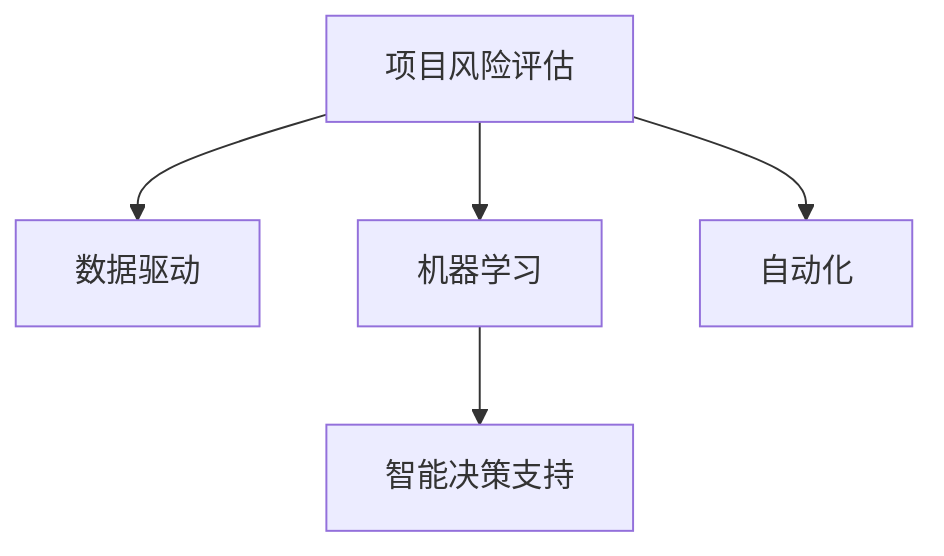

                 

# AI在项目风险评估中的作用

> 关键词：AI, 项目风险评估, 数据驱动, 机器学习, 智能决策, 风险管理

## 1. 背景介绍

### 1.1 问题由来
在当今快速变化和不确定性的商业环境中，项目风险管理已经成为一个至关重要的部分。无论是软件开发、基础设施建设，还是商业策略制定，成功的项目都离不开有效的风险管理。传统的项目风险评估方法往往依赖于专家经验和主观判断，其结果常常带有较大的偏差和不确定性。而人工智能(AI)的崛起，尤其是机器学习(ML)和数据科学领域的突破，为项目风险评估带来了新的视角和方法。通过利用AI的强大分析能力，能够从大数据中挖掘出潜在的风险因素，提供更加科学和精确的风险评估结果。

### 1.2 问题核心关键点
AI在项目风险评估中的应用，主要集中在以下几个关键点：

1. **数据驱动**：AI依赖于大量的数据，可以自动提取和分析数据中的模式和趋势，从而提供更加客观的风险评估结果。
2. **机器学习模型**：通过训练各种机器学习模型，如决策树、随机森林、神经网络等，AI可以识别出潜在的风险因素，并预测项目执行过程中可能出现的风险。
3. **智能决策支持**：AI系统能够实时分析项目进展情况，提供即时的风险预警和应对策略。
4. **自动化**：AI可以自动化地处理大量重复和繁琐的评估任务，提高评估效率。

### 1.3 问题研究意义
AI在项目风险评估中的应用，对于提升项目管理效率、降低风险成本、提高决策质量具有重要意义。以下是几个方面的具体说明：

1. **提高决策质量**：AI可以综合考虑各种复杂的因素，提供更加全面和精确的风险评估。
2. **降低成本**：通过自动化的风险评估和预警，减少了人工干预的需求，降低了项目风险管理的人力成本。
3. **提升效率**：AI可以快速处理大量数据，提供即时风险评估结果，显著提高项目管理的效率。
4. **优化资源配置**：AI可以帮助项目经理更科学地分配资源，优化项目执行方案。

## 2. 核心概念与联系

### 2.1 核心概念概述

为更好地理解AI在项目风险评估中的应用，我们首先介绍几个核心概念：

- **项目风险评估**：通过对项目执行过程中可能出现的风险进行识别、分析和预测，为项目管理者提供决策依据的过程。
- **数据驱动**：利用大量的历史数据，通过机器学习模型进行风险因素的挖掘和预测。
- **机器学习**：一种使计算机通过数据学习并做出决策的技术，广泛应用于模式识别、预测分析等领域。
- **智能决策支持系统**：通过集成AI算法，为决策者提供实时的风险评估和应对策略。
- **自动化**：使用AI技术自动执行风险评估、预警等任务，提高管理效率。

这些核心概念通过以下Mermaid流程图来展示：



这个流程图展示了项目风险评估的各个环节，以及AI在这些环节中的应用：

1. **数据驱动**：通过大量历史数据的分析，识别潜在的风险因素。
2. **机器学习**：训练模型，预测项目风险。
3. **智能决策支持**：提供即时的风险评估和应对策略。
4. **自动化**：自动执行风险评估任务，提高效率。

这些概念之间的逻辑关系，为AI在项目风险评估中的应用提供了清晰的框架。

## 3. 核心算法原理 & 具体操作步骤
### 3.1 算法原理概述

AI在项目风险评估中的应用，主要基于数据驱动和机器学习模型。其核心思想是通过大量历史数据，训练出能够预测项目风险的模型。

### 3.2 算法步骤详解

AI在项目风险评估中的具体操作步骤如下：

**Step 1: 数据收集与预处理**
- 收集项目相关的历史数据，包括项目进展、风险事件、成本、时间等信息。
- 对数据进行清洗和预处理，如缺失值处理、异常值检测、特征工程等。

**Step 2: 特征选择与工程**
- 根据业务需求，选择相关的特征变量，如成本超支、进度延误、质量缺陷等。
- 对特征进行工程化处理，如数据标准化、特征提取、降维等。

**Step 3: 模型训练与评估**
- 选择合适的机器学习模型，如线性回归、决策树、随机森林、神经网络等。
- 使用历史数据对模型进行训练，并进行交叉验证和参数调优。
- 评估模型在历史数据上的表现，选择性能最佳的模型。

**Step 4: 风险预警与决策支持**
- 使用训练好的模型，对当前项目的风险进行评估和预测。
- 根据模型预测结果，提供风险预警和应对策略。
- 实时监控项目进展，及时调整风险管理策略。

**Step 5: 模型优化与迭代**
- 定期收集新数据，对模型进行重新训练和优化。
- 根据最新的业务需求，调整特征选择和模型架构。

### 3.3 算法优缺点

AI在项目风险评估中的优势包括：

1. **客观性**：AI模型能够自动提取数据中的模式和趋势，减少人为因素的干扰。
2. **精确性**：机器学习模型可以处理大量的数据，提供精确的风险预测。
3. **自动化**：AI能够自动执行风险评估任务，提高管理效率。
4. **动态性**：AI模型可以实时更新，适应项目变化。

然而，AI在项目风险评估中也有一定的局限性：

1. **数据依赖**：AI的效果高度依赖于数据的质量和量。数据不足或数据偏差可能导致模型预测不准确。
2. **模型复杂性**：某些机器学习模型（如深度神经网络）可能需要大量的计算资源和复杂的设置。
3. **解释性问题**：AI模型的决策过程缺乏可解释性，难以理解和调试。

### 3.4 算法应用领域

AI在项目风险评估中的应用广泛，以下是几个典型的应用领域：

1. **软件开发项目**：识别代码缺陷、需求变更、资源不足等风险，提供预警和应对策略。
2. **基础设施建设**：识别预算超支、进度延误、质量问题等风险，优化项目管理方案。
3. **商业策略制定**：识别市场变化、竞争压力、客户需求变化等风险，支持战略调整。
4. **金融投资**：识别市场波动、政策变化、信用风险等，提供风险预警和投资建议。
5. **供应链管理**：识别供应链中断、供应商失信等风险，优化供应链管理策略。

## 4. 数学模型和公式 & 详细讲解 & 举例说明

### 4.1 数学模型构建

AI在项目风险评估中的数学模型主要基于统计学习和机器学习。这里以线性回归模型为例进行讲解。

假设我们有一组历史数据 $\{(x_i, y_i)\}_{i=1}^N$，其中 $x_i$ 为特征向量，$y_i$ 为对应的风险值。我们的目标是通过训练线性回归模型，预测新项目 $x$ 的风险值 $y$。

**模型形式**：
$$ y = \beta_0 + \beta_1 x_1 + \beta_2 x_2 + ... + \beta_k x_k + \epsilon $$

其中，$\beta_0, \beta_1, \beta_2, ..., \beta_k$ 为模型参数，$\epsilon$ 为随机误差项。

### 4.2 公式推导过程

线性回归模型的最小二乘法求解公式为：

$$ \hat{\beta} = (\mathbf{X}^T\mathbf{X})^{-1}\mathbf{X}^T\mathbf{y} $$

其中 $\mathbf{X}$ 为特征矩阵，$\mathbf{y}$ 为风险值向量。求解过程中，我们需要最小化损失函数：

$$ \mathcal{L}(\beta) = \frac{1}{2N} \sum_{i=1}^N (y_i - \beta_0 - \sum_{j=1}^k \beta_j x_{ij})^2 $$

求解得到参数 $\hat{\beta}$，就可以使用该模型进行风险预测。

### 4.3 案例分析与讲解

假设我们有一个软件开发项目，历史数据包含成本、进度、需求变更次数等特征。使用线性回归模型进行训练，得到一个风险预测模型。我们可以使用该模型对新项目的成本超支风险进行评估。例如，如果新项目的成本为100万，进度延误次数为3次，需求变更次数为2次，那么模型的预测结果为：

$$ y = \beta_0 + \beta_1 \times 100 + \beta_2 \times 3 + \beta_3 \times 2 $$

通过评估模型的预测结果，可以判断新项目是否存在成本超支的风险，并采取相应的应对措施。

## 5. 项目实践：代码实例和详细解释说明
### 5.1 开发环境搭建

在进行项目风险评估的AI实践前，我们需要准备好开发环境。以下是使用Python进行PyTorch开发的环境配置流程：

1. 安装Anaconda：从官网下载并安装Anaconda，用于创建独立的Python环境。

2. 创建并激活虚拟环境：
```bash
conda create -n pytorch-env python=3.8 
conda activate pytorch-env
```

3. 安装PyTorch：根据CUDA版本，从官网获取对应的安装命令。例如：
```bash
conda install pytorch torchvision torchaudio cudatoolkit=11.1 -c pytorch -c conda-forge
```

4. 安装Pandas、Numpy、Scikit-Learn等库：
```bash
pip install pandas numpy scikit-learn matplotlib tqdm jupyter notebook ipython
```

完成上述步骤后，即可在`pytorch-env`环境中开始项目实践。

### 5.2 源代码详细实现

以下是一个使用PyTorch实现线性回归模型的示例代码：

```python
import torch
import torch.nn as nn
import torch.optim as optim
import pandas as pd
from sklearn.model_selection import train_test_split
from sklearn.preprocessing import StandardScaler

# 数据加载
data = pd.read_csv('project_data.csv')
X = data[['cost', 'schedule', '变更次数']]
y = data['风险值']

# 数据预处理
scaler = StandardScaler()
X_scaled = scaler.fit_transform(X)

# 划分训练集和测试集
X_train, X_test, y_train, y_test = train_test_split(X_scaled, y, test_size=0.2, random_state=42)

# 模型定义
class LinearRegression(nn.Module):
    def __init__(self, input_dim):
        super(LinearRegression, self).__init__()
        self.linear = nn.Linear(input_dim, 1)

    def forward(self, x):
        return self.linear(x)

# 模型训练
model = LinearRegression(X_train.shape[1])
criterion = nn.MSELoss()
optimizer = optim.SGD(model.parameters(), lr=0.01, momentum=0.9)

for epoch in range(1000):
    optimizer.zero_grad()
    y_pred = model(X_train)
    loss = criterion(y_pred, y_train)
    loss.backward()
    optimizer.step()

    if (epoch+1) % 100 == 0:
        print(f'Epoch {epoch+1}, Loss: {loss.item()}')

# 模型评估
model.eval()
with torch.no_grad():
    y_pred = model(X_test)
    mse_loss = criterion(y_pred, y_test)
    print(f'Test Loss: {mse_loss.item()}')

# 风险预测
new_project = [[100, 3, 2]]
new_project_scaled = scaler.transform(new_project)
y_pred_new = model(new_project_scaled)
print(f'新项目风险预测：{y_pred_new.item()}')
```

### 5.3 代码解读与分析

**数据加载与预处理**：
- 使用Pandas加载项目数据，提取特征和风险值。
- 对特征进行标准化处理，使用StandardScaler进行归一化。

**模型定义与训练**：
- 定义线性回归模型，使用SGD优化器进行训练。
- 在训练过程中，每100个epoch输出一次损失值，进行监控。

**模型评估**：
- 在测试集上评估模型性能，使用均方误差(MSE)作为评估指标。
- 使用模型对新项目的风险进行预测。

可以看到，PyTorch的TensorFlow实现使得模型的构建和训练过程非常简洁高效。开发者可以将更多精力放在数据处理、模型改进等高层逻辑上，而不必过多关注底层的实现细节。

## 6. 实际应用场景
### 6.1 智能制造

在智能制造领域，AI的风险评估技术可以应用于设备故障预测、生产异常监控、供应链管理等方面，显著提高生产效率和产品质量。

例如，使用AI模型对设备的历史运行数据进行分析，识别出可能出现故障的特征，并预测故障发生的时间和原因。根据预测结果，提前进行维护和替换，避免生产线停工。

### 6.2 金融风险管理

金融行业对风险管理的需求尤为迫切，AI的风险评估技术可以帮助金融机构识别和预测市场风险、信用风险等。

例如，通过分析历史交易数据，识别出潜在的市场波动和风险因素，提供即时的风险预警和投资建议。AI系统还可以监控新闻、舆情等外部因素，评估其对市场的影响。

### 6.3 环境保护

环境保护领域面临许多不确定性和风险，AI的风险评估技术可以帮助政府和企业识别和预测环境风险。

例如，通过分析历史环境数据，识别出潜在的污染源和环境变化趋势，预测未来的环境风险。AI系统还可以监控实时环境数据，提供即时的预警和应对策略。

### 6.4 公共安全

在公共安全领域，AI的风险评估技术可以应用于城市监控、交通安全、灾害预测等方面，提高社会治理能力。

例如，通过分析历史事故数据，识别出潜在的安全风险和事故模式，提供即时的预警和应对策略。AI系统还可以监控实时数据，预测突发事件的可能性，优化资源分配。

## 7. 工具和资源推荐
### 7.1 学习资源推荐

为了帮助开发者系统掌握AI在项目风险评估中的应用，以下是一些优质的学习资源：

1. 《机器学习》课程：斯坦福大学开设的机器学习经典课程，由Andrew Ng教授主讲，涵盖机器学习的基本概念和算法。

2. 《深度学习》课程：斯坦福大学开设的深度学习课程，由Ian Goodfellow、Yoshua Bengio和Aaron Courville共同撰写，深入浅出地介绍了深度学习的原理和应用。

3. 《Python机器学习》书籍：由Sebastian Raschka和Vahid Mirjalili合著，全面介绍了使用Python进行机器学习开发的方法和技巧。

4. Kaggle：著名的数据科学竞赛平台，提供大量的公开数据集和案例研究，帮助开发者提升实战能力。

5. PyTorch官方文档：PyTorch的官方文档，提供了丰富的教程和样例代码，是学习PyTorch的必备资料。

通过这些资源的学习实践，相信你一定能够快速掌握AI在项目风险评估中的使用方法，并用于解决实际的业务问题。

### 7.2 开发工具推荐

高效的开发离不开优秀的工具支持。以下是几款用于AI项目风险评估开发的常用工具：

1. PyTorch：基于Python的开源深度学习框架，灵活动态的计算图，适合快速迭代研究。

2. TensorFlow：由Google主导开发的开源深度学习框架，生产部署方便，适合大规模工程应用。

3. Scikit-Learn：Python中的机器学习库，提供了丰富的算法和工具，适合快速原型开发。

4. Weights & Biases：模型训练的实验跟踪工具，可以记录和可视化模型训练过程中的各项指标，方便对比和调优。

5. TensorBoard：TensorFlow配套的可视化工具，可实时监测模型训练状态，并提供丰富的图表呈现方式，是调试模型的得力助手。

合理利用这些工具，可以显著提升AI项目风险评估任务的开发效率，加快创新迭代的步伐。

### 7.3 相关论文推荐

AI在项目风险评估技术的发展源于学界的持续研究。以下是几篇奠基性的相关论文，推荐阅读：

1. "Introduction to Statistical Learning" by Gareth James, Daniela Witten, Trevor Hastie, Robert Tibshirani：介绍了统计学习的原理和方法，涵盖了线性回归、决策树、支持向量机等经典算法。

2. "Deep Learning" by Ian Goodfellow, Yoshua Bengio, Aaron Courville：全面介绍了深度学习的理论基础和实际应用，包括神经网络、卷积神经网络、循环神经网络等。

3. "Predictive Analytics with Neural Networks" by Kun Khui：介绍了神经网络在预测分析中的应用，包括时间序列预测、回归预测等。

4. "Anomaly Detection in Data Mining: A Survey" by Jie Wu, Chunwei Li, Jianxiong Ren：综述了异常检测的算法和方法，涵盖了统计方法、机器学习算法等。

这些论文代表了大数据和机器学习在项目风险评估中的应用趋势，通过学习这些前沿成果，可以帮助研究者把握学科前进方向，激发更多的创新灵感。

## 8. 总结：未来发展趋势与挑战
### 8.1 总结

本文对AI在项目风险评估中的应用进行了全面系统的介绍。首先阐述了AI在项目风险评估中的作用和意义，明确了AI技术如何提升风险管理的效率和精度。其次，从原理到实践，详细讲解了AI在项目风险评估中的数学模型和操作步骤，给出了详细的代码实现和分析。同时，本文还探讨了AI在多个行业领域的应用场景，展示了AI技术的广泛应用前景。此外，本文精选了AI相关的学习资源和工具，力求为读者提供全方位的技术指引。

通过本文的系统梳理，可以看到，AI在项目风险评估中的作用日益重要，未来将有更多的AI技术应用于风险管理领域，提升决策质量和效率。

### 8.2 未来发展趋势

展望未来，AI在项目风险评估中的应用将呈现以下几个发展趋势：

1. **深度学习与传统方法的结合**：未来AI系统将结合深度学习和传统统计方法，提供更加全面和精确的风险评估。
2. **自动化与人工干预的协同**：AI系统将自动执行风险评估任务，同时保留人工干预机制，提高风险管理的灵活性。
3. **实时性与动态性**：未来AI系统将能够实时更新模型，适应项目的变化，提供动态的风险预警和应对策略。
4. **多模态数据的融合**：AI系统将融合多种数据类型（如文本、图像、音频等），提高风险评估的准确性和全面性。
5. **个性化与定制化**：未来AI系统将能够根据不同项目的需求，提供个性化的风险评估模型。

### 8.3 面临的挑战

尽管AI在项目风险评估中已经取得了显著进展，但在应用过程中仍面临一些挑战：

1. **数据质量和数量**：高质量、大规模的数据是AI系统发挥作用的基础，数据不足或数据偏差可能导致模型预测不准确。
2. **模型复杂性和计算资源**：深度学习模型需要大量的计算资源，如何优化模型结构，提高计算效率，是一个重要研究方向。
3. **可解释性问题**：AI模型的决策过程缺乏可解释性，难以理解和调试，如何提高模型可解释性，是未来需要解决的重要问题。
4. **安全性与隐私保护**：AI系统在处理敏感数据时，需要考虑数据安全和隐私保护问题，如何确保数据安全和合规性，是未来需要重点关注的问题。

### 8.4 研究展望

面对AI在项目风险评估中面临的挑战，未来的研究需要在以下几个方面寻求新的突破：

1. **数据增强与扩充**：通过数据增强技术，生成更多的训练样本，提高模型的泛化能力。
2. **模型简化与优化**：研究更轻量级的模型架构，减少计算资源消耗，提高模型的可部署性。
3. **可解释性技术**：引入可解释性技术，如LIME、SHAP等，提高模型的可解释性和可信度。
4. **隐私保护技术**：引入隐私保护技术，如差分隐私、联邦学习等，保护数据的隐私和安全。
5. **多模态融合**：研究如何融合多种数据类型，提高风险评估的全面性和准确性。

这些研究方向的探索，将引领AI在项目风险评估领域的技术进步，为风险管理带来新的突破。

## 9. 附录：常见问题与解答

**Q1：AI在项目风险评估中的应用是否适用于所有项目类型？**

A: AI在项目风险评估中的应用，主要适用于数据量大、结构化程度高的项目。对于数据稀少、结构化程度低的项目，需要结合人工经验和专业知识，进行综合判断。

**Q2：AI在项目风险评估中如何处理数据偏差？**

A: 数据偏差是AI系统面临的主要问题之一。为处理数据偏差，可以采用以下方法：
1. 数据清洗：识别并处理数据中的异常值和噪声。
2. 特征选择：选择与项目相关的关键特征，忽略不相关或噪声特征。
3. 模型校正：通过校正算法（如回归校准、逆概率加权等）处理数据偏差。
4. 多重插补：使用多重插补技术，生成缺失数据的合理预测值。

**Q3：AI在项目风险评估中的优势是什么？**

A: AI在项目风险评估中的优势包括：
1. 客观性：自动提取数据中的模式和趋势，减少人为因素的干扰。
2. 精确性：机器学习模型可以处理大量的数据，提供精确的风险预测。
3. 自动化：自动执行风险评估任务，提高管理效率。
4. 动态性：实时更新模型，适应项目变化。

**Q4：AI在项目风险评估中如何进行实时预警？**

A: AI系统可以通过以下方法进行实时预警：
1. 实时数据采集：使用传感器、监控设备等，实时采集项目数据。
2. 异常检测：使用异常检测算法，识别异常数据点。
3. 模型预测：使用训练好的模型，对实时数据进行预测，识别潜在的风险。
4. 预警系统：根据模型预测结果，自动发送预警信息，通知相关人员采取措施。

这些方法结合起来，可以实现AI在项目风险评估中的实时预警功能，提高风险管理的及时性和有效性。

---

作者：禅与计算机程序设计艺术 / Zen and the Art of Computer Programming

