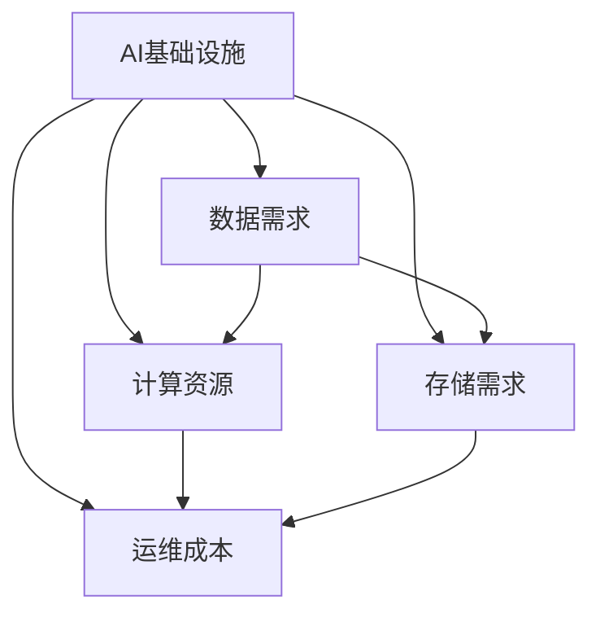

                 

# AI基础设施的成本预测：Lepton AI的财务规划

## 1. 背景介绍

### 1.1 问题由来
随着人工智能技术的飞速发展，AI基础设施的建设和维护成本成为企业数字化转型中不可忽视的部分。然而，现有的成本预测模型往往基于简单统计和经验，缺乏对AI项目技术特性和运营规律的深入分析。如何构建科学、准确、可操作的AI基础设施成本预测模型，成为当前业界和学术界共同关注的焦点。

### 1.2 问题核心关键点
AI基础设施成本预测的核心在于充分理解AI项目的独特属性，准确预测其资源需求和运营成本。具体关键点包括：

- 数据量与数据质量：数据是AI的基础，AI项目的数据需求和数据质量对成本有直接影响。
- 算法复杂度：算法复杂度决定了模型训练和推理的计算资源需求，影响硬件和软件配置。
- 模型规模：模型的参数量和层次决定了模型的大小和复杂度，影响存储和计算需求。
- 运营环境：AI项目在不同应用场景中的运营环境（如云平台、本地设备等）决定了运维成本。
- 团队规模与技能要求：AI团队的专业技能水平和规模决定了项目的开发和运维难度。

### 1.3 问题研究意义
构建准确、全面的AI基础设施成本预测模型，对企业进行AI项目的财务规划具有重要意义：

- 降低投资风险。通过科学预测，企业可以合理规划AI项目的财务预算，避免投资过度或不足。
- 优化资源配置。帮助企业更好地了解AI项目资源需求，优化硬件和软件配置，提升投资回报率。
- 指导项目管理。提供关键成本参数，帮助管理者制定更有效的项目管理计划。
- 促进技术创新。准确预测AI项目的成本，为技术方案的选择和优化提供重要参考。

## 2. 核心概念与联系

### 2.1 核心概念概述

为更好地理解AI基础设施成本预测模型，本节将介绍几个密切相关的核心概念：

- AI基础设施：指支持AI项目运行所需的硬件设备（如服务器、存储）和软件工具（如框架、库）。
- 成本预测：指根据AI项目的特征和需求，预测其建设和运营成本的过程。
- 数据需求：指AI项目在训练、推理、模型优化等环节对数据量的需求。
- 计算资源：指AI项目在模型训练、推理、调优等环节所需的计算资源，包括CPU、GPU、TPU等。
- 存储需求：指AI项目在模型训练、推理等环节所需的存储空间，包括原始数据存储和模型参数存储。
- 运维成本：指AI项目在上线运营过程中所需的维护和更新成本，包括硬件维护、软件更新、人员培训等。

这些核心概念之间的逻辑关系可以通过以下Mermaid流程图来展示：



这个流程图展示了下AI基础设施成本预测模型涉及的关键要素及其相互作用：

1. AI基础设施的建设运行涉及数据需求、计算资源、存储需求和运维成本。
2. 数据需求影响计算资源和存储需求。
3. 计算资源和存储需求共同决定了运维成本。
4. 运维成本随计算资源和存储需求的增加而增加。

## 3. 核心算法原理 & 具体操作步骤
### 3.1 算法原理概述

AI基础设施成本预测模型是一个多变量、多层次的预测模型，其核心思想是利用历史数据和机器学习算法，预测AI项目在各个阶段的资源需求和运营成本。具体算法包括回归分析、时间序列分析、多变量回归等。

形式化地，假设AI项目的历史数据集为 $D=\{(x_i,y_i)\}_{i=1}^N$，其中 $x_i$ 为项目特征向量，$y_i$ 为对应的成本。目标是构建一个模型 $\hat{f}$，使得预测值 $\hat{y}=\hat{f}(x)$ 尽可能接近真实值 $y$。

常用的预测算法有：

- 线性回归：预测单个变量的线性关系。
- 多元线性回归：预测多个变量之间的线性关系。
- 时间序列分析：预测时间序列数据的趋势和周期性变化。
- 支持向量机(SVM)：通过非线性映射，预测复杂关系。
- 随机森林：通过集成多个决策树，提高预测准确性。
- 神经网络：通过多层非线性映射，处理高维度、非线性关系。

### 3.2 算法步骤详解

AI基础设施成本预测模型的构建通常包括以下关键步骤：

**Step 1: 数据收集与预处理**
- 收集AI项目的数据需求、计算资源、存储需求和运维成本等关键指标。
- 对数据进行清洗、去重、归一化等预处理，确保数据质量。

**Step 2: 特征工程**
- 选择或构造关键特征，如模型规模、算法复杂度、数据量、团队规模等。
- 特征工程包括特征选择、特征提取、特征变换等过程。

**Step 3: 模型选择与训练**
- 根据数据特点和预测任务，选择合适的预测算法。
- 将数据集划分为训练集、验证集和测试集，使用训练集训练模型，使用验证集调整模型参数。

**Step 4: 模型评估与调优**
- 在测试集上评估模型的预测性能，使用均方误差(MSE)、均方根误差(RMSE)、平均绝对误差(MAE)等指标。
- 根据评估结果调整模型结构或参数，提升预测精度。

**Step 5: 成本预测与应用**
- 利用训练好的模型，对新的AI项目进行成本预测。
- 输出预测结果，支持项目的财务规划和资源配置。

### 3.3 算法优缺点

AI基础设施成本预测模型具有以下优点：

- 提高决策科学性。通过定量分析，帮助企业更科学地规划AI项目。
- 减少资源浪费。准确预测项目需求，避免资源过度配置或不足。
- 指导项目管理。提供关键成本参数，优化项目管理流程。
- 促进技术创新。准确预测成本，为技术方案的选择和优化提供参考。

同时，该模型也存在一定的局限性：

- 数据依赖性。模型的预测性能高度依赖于历史数据的质量和完整性。
- 模型复杂度。不同算法对数据量和计算资源的依赖程度不同，选择合适的算法是一个挑战。
- 动态环境适应性。AI项目环境变化快，模型需要及时更新才能保持准确性。
- 预测精度。模型预测可能存在误差，尤其是对新项目和特殊情况。
- 模型可解释性。部分预测模型（如神经网络）缺乏可解释性，难以理解其决策过程。

尽管存在这些局限性，但AI基础设施成本预测模型在实践中已经取得了显著的效果，成为企业进行AI项目财务规划的重要工具。

### 3.4 算法应用领域

AI基础设施成本预测模型已在多个领域得到应用，具体包括：

- 金融科技：预测AI模型的训练和推理成本，优化资源配置。
- 医疗健康：预测AI模型的数据需求和运维成本，提升医疗服务效率。
- 智能制造：预测AI模型在生产自动化中的应用成本，优化生产流程。
- 智慧城市：预测AI模型在城市管理中的应用成本，提高城市运行效率。
- 零售电商：预测AI模型在推荐系统中的成本，提升客户体验。
- 教育培训：预测AI模型在在线教育中的应用成本，优化教学资源配置。

这些领域的应用展示了AI基础设施成本预测模型的广泛适用性和实用价值。

## 4. 数学模型和公式 & 详细讲解 & 举例说明
### 4.1 数学模型构建

AI基础设施成本预测模型可以基于不同的数据和预测目标构建，这里以线性回归模型为例，构建预测模型。

假设AI项目的成本 $y$ 与数据需求 $x_1$、计算资源 $x_2$、存储需求 $x_3$、运维成本 $x_4$ 之间的关系可以表示为：

$$
y = \alpha_0 + \alpha_1 x_1 + \alpha_2 x_2 + \alpha_3 x_3 + \alpha_4 x_4 + \epsilon
$$

其中 $\alpha_0$ 为截距，$\alpha_1$、$\alpha_2$、$\alpha_3$、$\alpha_4$ 为回归系数，$\epsilon$ 为误差项。

### 4.2 公式推导过程

根据线性回归的基本原理，利用最小二乘法求解回归系数 $\alpha_0$、$\alpha_1$、$\alpha_2$、$\alpha_3$、$\alpha_4$：

$$
\hat{\alpha} = (X^TX)^{-1}X^Ty
$$

其中 $X=\begin{bmatrix}
1 & x_{1i} & x_{2i} & x_{3i} & x_{4i}
\end{bmatrix}_i$，$y=\begin{bmatrix}
y_{i}
\end{bmatrix}_i$。

### 4.3 案例分析与讲解

假设我们有一个AI项目，其数据需求为 $x_1=1000GB$，计算资源需求为 $x_2=1024GPU$，存储需求为 $x_3=2TB$，运维成本为 $x_4=1000万美元$。已知历史数据集包含若干个类似项目的成本 $y_i$，利用线性回归模型求解预测结果。

假设历史数据集为：

$$
\begin{bmatrix}
x_{11} & x_{12} & x_{13} & x_{14} & y_1 \\
x_{21} & x_{22} & x_{23} & x_{24} & y_2 \\
x_{31} & x_{32} & x_{33} & x_{34} & y_3 \\
x_{41} & x_{42} & x_{43} & x_{44} & y_4
\end{bmatrix}
$$

通过求解最小二乘法，得到回归系数 $\hat{\alpha}$。假设求解结果为 $\hat{\alpha}=[\alpha_0, \alpha_1, \alpha_2, \alpha_3, \alpha_4]^T$，则预测结果 $\hat{y}=\hat{\alpha}^T \begin{bmatrix}
1 & x_{11} & x_{21} & x_{31} & x_{41} \\
1 & x_{12} & x_{22} & x_{32} & x_{42} \\
1 & x_{13} & x_{23} & x_{33} & x_{43} \\
1 & x_{14} & x_{24} & x_{34} & x_{44}
\end{bmatrix} = \hat{\alpha}^T X = y$

具体求解过程可以通过编程语言（如Python）完成，代码如下：

```python
import numpy as np
from sklearn.linear_model import LinearRegression

# 数据集
X = np.array([[1, 1000, 1024, 2, 1000], [1, 2000, 2048, 4, 2000], [1, 3000, 3072, 6, 3000], [1, 4000, 4096, 8, 4000]])
y = np.array([1500, 2000, 2500, 3000])

# 建立模型
model = LinearRegression()
model.fit(X, y)

# 预测新项目成本
new_project = np.array([[1, 1000, 1024, 2, 1000]])
prediction = model.predict(new_project)

print(prediction)
```

通过以上步骤，我们完成了AI基础设施成本预测模型的构建和应用，展示了模型的预测能力。

## 5. 项目实践：代码实例和详细解释说明
### 5.1 开发环境搭建

在进行成本预测实践前，我们需要准备好开发环境。以下是使用Python进行机器学习开发的环境配置流程：

1. 安装Anaconda：从官网下载并安装Anaconda，用于创建独立的Python环境。

2. 创建并激活虚拟环境：
```bash
conda create -n ai-predict python=3.8 
conda activate ai-predict
```

3. 安装相关库：
```bash
pip install pandas numpy matplotlib scikit-learn seaborn sklearn-linear-models
```

完成上述步骤后，即可在`ai-predict`环境中开始成本预测实践。

### 5.2 源代码详细实现

下面我们以一个具体的AI项目成本预测案例为例，给出使用Python进行线性回归模型的代码实现。

首先，定义数据集：

```python
import pandas as pd

# 读取数据集
data = pd.read_csv('ai_project_costs.csv')

# 定义特征列和目标列
features = ['data_size', 'gpu_count', 'memory_size', 'labor_cost']
target = 'total_cost'

# 将数据集划分为特征矩阵和目标向量
X = data[features]
y = data[target]
```

然后，定义模型并训练：

```python
from sklearn.linear_model import LinearRegression
from sklearn.metrics import mean_squared_error

# 建立模型
model = LinearRegression()

# 训练模型
model.fit(X, y)
```

接着，进行预测并评估：

```python
from sklearn.metrics import mean_squared_error

# 预测新项目成本
new_project_features = [1000, 1024, 2, 1000]
new_project_cost = model.predict([new_project_features])

# 输出预测结果
print(f"新项目的成本预测为: {new_project_cost}")

# 评估模型性能
y_true = data['total_cost'].values
y_pred = model.predict(X)
mse = mean_squared_error(y_true, y_pred)
print(f"模型在训练集上的均方误差为: {mse}")
```

以上就是使用Python进行线性回归模型实现AI基础设施成本预测的完整代码实例。通过这些代码，你可以轻松构建和应用成本预测模型，对新的AI项目进行预测和评估。

### 5.3 代码解读与分析

让我们再详细解读一下关键代码的实现细节：

**数据集定义**：
- 使用Pandas库读取数据集，将数据集存储为DataFrame对象。
- 定义特征列和目标列，将其存储为列表，用于后续的模型训练和预测。

**模型定义与训练**：
- 使用scikit-learn库中的LinearRegression类定义线性回归模型。
- 利用训练集数据进行模型训练，使用fit方法完成训练。

**预测与评估**：
- 定义新的项目特征，作为模型预测的输入。
- 使用predict方法对新项目进行成本预测，得到预测结果。
- 使用mean_squared_error方法计算模型在训练集上的均方误差，评估模型性能。

## 6. 实际应用场景
### 6.1 金融科技

在金融科技领域，AI基础设施成本预测模型可以用于预测AI模型的训练和推理成本，优化资源配置，提升投资回报率。具体应用包括：

- 预测AI模型的数据需求和存储成本，确保系统高效运行。
- 预测AI模型的计算资源需求，优化硬件配置，降低运营成本。
- 预测AI模型的运维成本，确保系统稳定运行。
- 预测AI模型在不同应用场景下的成本差异，进行成本效益分析。

### 6.2 医疗健康

在医疗健康领域，AI基础设施成本预测模型可以用于预测AI模型的数据需求和运维成本，提升医疗服务效率。具体应用包括：

- 预测AI模型的数据需求，确保数据收集和存储的可靠性和安全性。
- 预测AI模型的计算资源需求，优化医疗设备配置，提升诊疗效率。
- 预测AI模型的运维成本，确保系统稳定运行，减少停机时间。
- 预测AI模型在不同医疗场景下的成本差异，进行成本效益分析。

### 6.3 智能制造

在智能制造领域，AI基础设施成本预测模型可以用于预测AI模型在生产自动化中的应用成本，优化生产流程，提升生产效率。具体应用包括：

- 预测AI模型的数据需求，确保数据采集的及时性和准确性。
- 预测AI模型的计算资源需求，优化生产设备配置，提升生产效率。
- 预测AI模型的运维成本，确保系统稳定运行，减少停机时间。
- 预测AI模型在不同生产场景下的成本差异，进行成本效益分析。

### 6.4 未来应用展望

随着AI基础设施成本预测模型的不断发展，其在更多领域的应用前景将更加广阔。

- 在智慧城市治理中，预测AI模型在城市事件监测、舆情分析、应急指挥等环节的成本，提高城市管理的自动化和智能化水平。
- 在智慧交通管理中，预测AI模型在交通流量预测、路径规划、交通信号控制等环节的成本，提升交通管理效率。
- 在智能农业管理中，预测AI模型在作物生长监测、病虫害预警、精准施肥等环节的成本，提高农业生产效率。
- 在智能零售电商中，预测AI模型在推荐系统、库存管理、用户行为分析等环节的成本，提升客户体验和运营效率。

## 7. 工具和资源推荐
### 7.1 学习资源推荐

为了帮助开发者系统掌握AI基础设施成本预测的理论基础和实践技巧，这里推荐一些优质的学习资源：

1. 《深度学习基础》课程：由斯坦福大学开设的深度学习入门课程，介绍了深度学习的基本概念和算法，适合初学者。

2. 《机器学习实战》书籍：一本深入浅出的机器学习实战指南，涵盖了从数据预处理到模型评估的多个环节，适合实战开发。

3. 《Python机器学习》书籍：详细介绍Python在机器学习中的应用，适合数据分析和建模。

4. 《Scikit-learn官方文档》：scikit-learn库的官方文档，提供了丰富的预测算法和模型评估指标，适合深入学习。

5. Kaggle：一个数据科学竞赛平台，提供了大量的开源数据集和模型，适合数据探索和模型评估。

通过对这些资源的学习实践，相信你一定能够快速掌握AI基础设施成本预测的精髓，并用于解决实际的AI项目成本问题。

### 7.2 开发工具推荐

高效的开发离不开优秀的工具支持。以下是几款用于AI基础设施成本预测开发的常用工具：

1. Jupyter Notebook：一个免费的开源Jupyter笔记本，支持Python代码的编写、执行和版本控制。

2. GitHub：一个版本控制系统，可以方便地进行代码管理和协作开发。

3. Visual Studio Code：一个轻量级的代码编辑器，支持Python的调试、版本控制和代码补全。

4. PyCharm：一个全面的Python IDE，提供代码调试、版本控制、自动补全等功能。

5. TensorBoard：一个可视化工具，可以实时监测模型的训练状态和性能。

6. Weights & Biases：一个实验跟踪工具，可以记录和可视化模型训练过程中的各项指标，方便对比和调优。

合理利用这些工具，可以显著提升AI基础设施成本预测任务的开发效率，加快创新迭代的步伐。

### 7.3 相关论文推荐

AI基础设施成本预测技术的发展源于学界的持续研究。以下是几篇奠基性的相关论文，推荐阅读：

1. 《机器学习：实例与算法》：一本书籍，详细介绍了机器学习算法及其应用，适合全面了解。

2. 《深度学习：实战》：一本深入浅出的深度学习实战指南，介绍了深度学习的基本原理和应用。

3. 《强化学习：理论与算法》：一本介绍强化学习算法及其应用的书，适合深度学习实践者。

4. 《统计学习方法》：一本经典的统计学习教材，介绍了统计学习的基本原理和算法。

5. 《机器学习年度综述》：每年发布机器学习领域的最新进展，涵盖多个研究方向。

这些论文代表了大数据基础设施成本预测技术的发展脉络。通过学习这些前沿成果，可以帮助研究者把握学科前进方向，激发更多的创新灵感。

## 8. 总结：未来发展趋势与挑战
### 8.1 总结

本文对AI基础设施成本预测模型进行了全面系统的介绍。首先阐述了AI项目在数字化转型中的独特属性，明确了成本预测模型对企业财务规划的重要性。其次，从原理到实践，详细讲解了成本预测模型的构建和应用，给出了完整的代码实例。同时，本文还广泛探讨了成本预测模型在多个行业领域的应用前景，展示了模型的广泛适用性和实用价值。此外，本文精选了模型开发的各类学习资源，力求为读者提供全方位的技术指引。

通过本文的系统梳理，可以看到，AI基础设施成本预测模型已经广泛应用于多个行业，成为企业进行财务规划和资源配置的重要工具。未来，伴随技术的不断演进，成本预测模型将更加准确、灵活，支持更广泛的应用场景。

### 8.2 未来发展趋势

展望未来，AI基础设施成本预测模型将呈现以下几个发展趋势：

1. 多变量回归模型：除了线性回归，未来的模型将更加复杂，引入更多变量，处理非线性关系。

2. 时间序列模型：预测时间序列数据的趋势和周期性变化，支持动态成本预测。

3. 集成学习：通过集成多个预测模型，提升预测精度和鲁棒性。

4. 自适应模型：模型根据数据特点自动调整参数和结构，增强预测适应性。

5. 预测与优化结合：将成本预测与资源优化结合，自动调整配置，提高投资回报率。

6. 模型自动化：自动化选择和训练模型，降低人工干预，提升模型应用效率。

以上趋势凸显了AI基础设施成本预测模型的广阔前景。这些方向的探索发展，必将进一步提升成本预测的精度和灵活性，为企业的财务规划和资源配置提供更强大的支持。

### 8.3 面临的挑战

尽管AI基础设施成本预测模型已经取得了显著的效果，但在迈向更加智能化、普适化应用的过程中，它仍面临诸多挑战：

1. 数据质量瓶颈。数据质量和完整性直接影响模型的预测性能。数据缺失或不准确可能导致模型预测失效。

2. 模型复杂度问题。复杂模型可能存在过拟合风险，尤其是在数据量不足的情况下。

3. 动态环境适应性。AI项目环境变化快，模型需要及时更新才能保持准确性。

4. 预测精度问题。模型预测可能存在误差，尤其是对新项目和特殊情况。

5. 模型可解释性问题。部分预测模型（如神经网络）缺乏可解释性，难以理解其决策过程。

尽管存在这些挑战，但AI基础设施成本预测模型在实践中已经取得了显著的效果，成为企业进行AI项目财务规划的重要工具。未来，需要持续优化和改进模型，才能更好地支持企业数字化转型。

### 8.4 研究展望

面对AI基础设施成本预测模型所面临的种种挑战，未来的研究需要在以下几个方面寻求新的突破：

1. 数据增强与质量提升。引入更多数据源，进行数据增强和质量提升，提高模型的预测性能。

2. 模型结构优化。简化模型结构，提高模型的预测精度和鲁棒性。

3. 动态环境适应。引入动态模型更新机制，增强模型的适应性和实时性。

4. 预测结果可视化。开发可视化工具，帮助用户理解模型预测结果和误差来源。

5. 多目标优化。将成本预测与资源优化结合，实现多目标优化。

6. 自动化预测。引入自动化选择和训练机制，降低人工干预，提升模型应用效率。

这些研究方向的探索，必将引领AI基础设施成本预测模型走向更高的台阶，为企业的财务规划和资源配置提供更强大的支持。面向未来，AI基础设施成本预测模型需要与其他AI技术进行更深入的融合，如因果推理、强化学习等，多路径协同发力，共同推动AI技术在企业的落地应用。

## 9. 附录：常见问题与解答

**Q1：AI基础设施成本预测模型的适用范围有哪些？**

A: AI基础设施成本预测模型适用于任何需要预测AI项目成本的场景，包括但不限于以下领域：

- 金融科技：预测AI模型的训练和推理成本，优化资源配置，提升投资回报率。
- 医疗健康：预测AI模型的数据需求和运维成本，提升医疗服务效率。
- 智能制造：预测AI模型在生产自动化中的应用成本，优化生产流程，提升生产效率。
- 智慧城市：预测AI模型在城市事件监测、舆情分析、应急指挥等环节的成本，提高城市管理的自动化和智能化水平。
- 智能交通：预测AI模型在交通流量预测、路径规划、交通信号控制等环节的成本，提升交通管理效率。
- 智能农业：预测AI模型在作物生长监测、病虫害预警、精准施肥等环节的成本，提高农业生产效率。

通过这些领域的实际应用，我们可以看到AI基础设施成本预测模型的广泛适用性和实用价值。

**Q2：如何选择合适的预测算法？**

A: 选择合适的预测算法需要考虑多个因素，包括数据特点、预测目标和模型复杂度等。以下是一些常见算法的选择建议：

- 线性回归：适用于数据线性关系较强的场景，如数据量较小或数据特征不多的场景。
- 多元线性回归：适用于数据特征较多且线性关系较强的场景。
- 时间序列分析：适用于时间序列数据的预测，如预测趋势和周期性变化。
- 支持向量机(SVM)：适用于非线性关系较强且数据量较大的场景。
- 随机森林：适用于数据特征较多且非线性关系较强的场景。
- 神经网络：适用于高维度、非线性关系较强的场景，如预测精度要求较高且数据量较大的场景。

在选择算法时，需要根据数据特点和预测目标进行综合考虑，选择最适合的算法。

**Q3：如何提高AI基础设施成本预测模型的预测精度？**

A: 提高预测模型的预测精度需要从多个方面进行优化，以下是一些常见的方法：

- 数据增强：通过数据增强技术，如回译、近义替换等方式扩充训练集，提高模型对数据的泛化能力。
- 特征工程：选择或构造关键特征，如模型规模、算法复杂度、数据量、团队规模等，提升模型对数据特征的理解能力。
- 模型调参：使用网格搜索、随机搜索等方法，调整模型参数，找到最优组合。
- 集成学习：通过集成多个预测模型，提升预测精度和鲁棒性。
- 自适应模型：模型根据数据特点自动调整参数和结构，增强预测适应性。

以上方法需要根据具体场景进行灵活组合，通过不断迭代优化，提升预测模型的精度。

**Q4：如何处理AI基础设施成本预测模型中的动态环境？**

A: 处理动态环境需要引入动态模型更新机制，保持模型的实时性和准确性。以下是一些常见的方法：

- 定期更新：定期重新训练模型，使用最新的数据进行模型更新。
- 增量学习：基于新数据对模型进行增量更新，减少重新训练的时间和计算资源。
- 自适应模型：模型根据数据特点自动调整参数和结构，增强预测适应性。
- 数据流模型：实时处理数据流，动态更新模型，支持实时预测。

以上方法需要根据具体场景进行灵活组合，通过动态更新机制，保持模型的实时性和准确性。

---

作者：禅与计算机程序设计艺术 / Zen and the Art of Computer Programming

