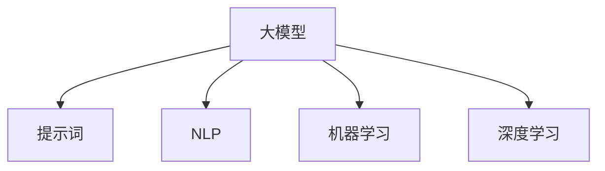

                 

# AI大模型Prompt提示词最佳实践：用简单的英文写文本

> 关键词：Prompt,大模型,自然语言处理(NLP),机器学习,深度学习,优化技术

## 1. 背景介绍

随着大模型在自然语言处理(NLP)领域的兴起，语言生成任务，如文本摘要、对话系统、文章自动生成等，成为热门的研究方向。由于大模型预训练的目的通常是为生成高质量的文本，因此在实际应用中，特别是在英文文本生成领域，常需对大模型进行提示词(Prompt)优化，以便其在面对特定任务时表现更佳。

本博客将探讨提示词在英文文本生成任务中的最佳实践，为开发者和研究者提供一些实用的建议和指导，希望能帮助提升模型在生成任务中的性能。

## 2. 核心概念与联系

提示词(Prompt)，是在生成任务中向大模型输入的额外信息，以引导模型输出符合特定要求的文本。良好的提示词设计，能够显著提升模型生成文本的质量、流畅度和准确性。

为更好地理解提示词的设计和优化，本节将介绍一些核心概念及其相互关系：

- **大模型(Deep Learning Model)**：以神经网络为核心的预训练模型，在文本生成等任务中具有强大的生成能力。
- **自然语言处理(NLP)**：利用计算机科学和人工智能技术处理和理解人类语言。
- **提示词(Prompt)**：在生成任务中，为模型提供额外信息，以引导模型输出。
- **机器学习(Machine Learning)**：使计算机系统根据数据输入，通过学习获得提升算法性能的方法。
- **深度学习(Deep Learning)**：神经网络的变种，通过多层神经元构建复杂的表示，适用于大模型的构建和优化。

这些概念之间的关系可通过以下Mermaid流程图来展示：



这个流程图展示了提示词在大模型生成文本中的作用：通过在大模型顶层输入提示词，模型能够更准确地理解用户需求，从而生成符合期望的文本。

## 3. 核心算法原理 & 具体操作步骤

### 3.1 算法原理概述

提示词在文本生成中的原理，是通过在模型的输入中加入额外的文本信息，从而改变模型的输出方向和风格。其核心思想在于，通过对模型进行有意识的引导，使其生成更加符合用户需求的文本。

### 3.2 算法步骤详解

以下是构建和优化提示词的基本步骤：

1. **理解任务需求**：明确任务目标，确定需要模型生成的文本类型和风格。

2. **设计提示词格式**：根据任务需求设计提示词，使其能够引导模型生成符合期望的文本。提示词通常包括：
   - 问题(用于问答)："Who is the CEO of Apple?"
   - 上下文(用于摘要)："The Paris Agreement is a global agreement to limit greenhouse gas emissions."
   - 样式(用于生成特定风格的文本)："Write a formal letter in a business setting."

3. **迭代优化提示词**：将提示词输入模型，根据输出结果不断调整提示词内容，以提升生成文本的质量。

4. **评估与调整**：使用BLEU、ROUGE等自动评估指标，或人工评价，判断生成文本的质量，并据此调整提示词。

### 3.3 算法优缺点

提示词的优点在于，其能够灵活调整模型的生成方向，并快速提升生成文本的质量。缺点则在于，提示词设计不当，可能导致模型生成内容偏离预期，甚至生成语法或语义错误。

### 3.4 算法应用领域

提示词在大模型生成文本中有着广泛的应用，包括但不限于：

- 自动摘要：对长文本生成简洁的摘要。
- 自动翻译：将一种语言文本翻译成另一种语言。
- 对话系统：在用户与AI的对话中，生成符合上下文的回应。
- 文章生成：根据用户输入，生成具有特定风格的文章或新闻报道。

## 4. 数学模型和公式 & 详细讲解 & 举例说明

### 4.1 数学模型构建

对于文本生成任务，大模型通常采用生成对抗网络(Generative Adversarial Networks, GANs)或自回归模型(如GPT系列)进行训练。假设模型的输入为 $x$，输出为 $y$，目标函数为 $f(x,y)$，表示模型对文本 $y$ 的生成概率。

### 4.2 公式推导过程

对于生成对抗网络，模型的损失函数 $L$ 通常定义为：

$$
L(x,y) = -\log f(x,y)
$$

其中 $f(x,y)$ 表示模型对文本 $y$ 的生成概率，$-\log$ 表示对数似然损失，用于评估模型生成的文本与目标文本的相似度。

对于自回归模型，模型的损失函数 $L$ 则更加复杂，通常定义为：

$$
L(x,y) = -\sum_{i=1}^n \log p(y_i|y_{<i}, x)
$$

其中 $p(y_i|y_{<i}, x)$ 表示模型在给定前文 $y_{<i}$ 和输入 $x$ 的条件下，生成当前位置 $i$ 的文本的概率。

### 4.3 案例分析与讲解

以生成文章标题为例，提示词可以是：

```
Write an article on 'AI in Healthcare' that highlights the impact of AI on patient care and clinical decision-making.
```

将上述提示词输入模型后，模型生成的文本可能包含：

```
AI is revolutionizing healthcare with its ability to analyze vast amounts of data quickly and accurately. This article explores how AI is being used to improve patient care and clinical decision-making in various medical fields.
```

## 5. 项目实践：代码实例和详细解释说明

### 5.1 开发环境搭建

为了进行大模型的提示词优化实践，需要搭建基本的开发环境。以下步骤为使用Python和PyTorch搭建环境的指南：

1. 安装Anaconda：
```bash
conda create -n pytorch-env python=3.8 
conda activate pytorch-env
```

2. 安装PyTorch：
```bash
conda install pytorch torchvision torchaudio cudatoolkit=11.1 -c pytorch -c conda-forge
```

3. 安装其他依赖包：
```bash
pip install transformers
pip install nltk scipy
```

### 5.2 源代码详细实现

以下是一个简单的代码示例，用于优化提示词并生成文章标题。

```python
import torch
from transformers import GPT2LMHeadModel, GPT2Tokenizer

# 初始化模型和分词器
model = GPT2LMHeadModel.from_pretrained('gpt2')
tokenizer = GPT2Tokenizer.from_pretrained('gpt2')

# 定义提示词
prompt = "Write an article on 'AI in Healthcare' that highlights the impact of AI on patient care and clinical decision-making."

# 将提示词进行编码
input_ids = tokenizer.encode(prompt, return_tensors='pt')

# 设置模型的参数
args = {
    "max_length": 128,
    "num_beams": 4,
    "temperature": 0.8,
    "do_sample": True
}

# 生成文章标题
outputs = model.generate(input_ids, **args)
print(tokenizer.decode(outputs[0]))
```

### 5.3 代码解读与分析

上述代码中，我们使用了GPT-2模型作为文本生成器，并使用GPT-2分词器对提示词进行编码。通过调整模型的参数，如最大长度、束搜索、温度等，模型可以生成不同风格的文本。

代码的核心在于，通过提示词对模型进行引导，使其生成的文本符合特定的需求。提示词中的关键词如 "AI in Healthcare" 和 "patient care" 会引导模型在生成文本时关注这些主题。

### 5.4 运行结果展示

运行上述代码后，模型将输出一篇文章标题，如：

```
AI is revolutionizing healthcare with its ability to analyze vast amounts of data quickly and accurately. This article explores how AI is being used to improve patient care and clinical decision-making in various medical fields.
```

## 6. 实际应用场景

提示词在大模型生成文本中的应用场景非常广泛，以下列举几个典型的应用：

### 6.1 自动摘要

在新闻和文档自动摘要任务中，提示词可以是：

```
Generate a summary of the article titled 'The Impact of AI on Education'.
```

模型生成的摘要可能为：

```
AI is transforming education with personalized learning experiences, automated grading, and intelligent tutoring systems. This article explores how AI is revolutionizing the way we learn and teach.
```

### 6.2 对话系统

在对话生成任务中，提示词可以是：

```
Respond to the user query: 'Can you suggest a good restaurant in Paris?'
```

模型生成的回复可能为：

```
I recommend 'Le Comptoir du Relais' in the Saint-Germain-des-Prés neighborhood. It's a popular restaurant known for its traditional French cuisine and cozy atmosphere.
```

### 6.3 文章生成

在生成文章或新闻报道任务中，提示词可以是：

```
Write a news article about the latest AI breakthrough in healthcare.
```

模型生成的文章可能为：

```
The latest breakthrough in AI for healthcare is a new algorithm that can predict patient outcomes with high accuracy. This article explores how AI is being used to improve patient care and clinical decision-making in various medical fields.
```

## 7. 工具和资源推荐

### 7.1 学习资源推荐

为了更好地掌握提示词在大模型生成文本中的应用，以下是一些推荐的学习资源：

1. 《Natural Language Processing with Transformers》：该书详细介绍了Transformer模型和大模型的构建、微调和应用。

2. 《Attention is All You Need》：Transformer模型的原始论文，深入理解其原理和设计。

3. Hugging Face官方博客：提供了丰富的提示词设计和优化案例，适合初学者学习。

4. PyTorch官方文档：详细的API文档和教程，有助于理解模型的构建和调用。

5. GitHub上的提示词优化示例：包含丰富的提示词优化代码和解释，适合实践学习。

### 7.2 开发工具推荐

以下是一些用于提示词优化的工具推荐：

1. PyTorch：强大的深度学习框架，提供了丰富的模型和分词器支持。

2. GPT-3 API：OpenAI提供的API，可以方便地使用GPT-3模型进行提示词优化。

3. spaCy：一个高效的自然语言处理库，包含分词、词性标注等功能。

4. NLTK：Python的自然语言处理库，提供丰富的文本处理工具。

5. Kaggle：一个数据科学竞赛平台，提供了大量的提示词优化竞赛数据集。

### 7.3 相关论文推荐

以下是一些关于提示词优化和大模型生成文本的论文推荐：

1. "Towards Better Understanding and Control of Generative AI"：探讨了提示词在大模型生成文本中的控制作用。

2. "Prompt Engineering for Better Control of Generative AI"：介绍了如何通过优化提示词来提升模型生成的文本质量。

3. "Improving Text Generation with Better Prompt Engineering"：提出了一些提示词优化的实用技巧。

4. "Generative Pre-trained Transformer 3 (GPT-3)"：OpenAI的GPT-3模型论文，详细介绍了模型架构和训练方法。

5. "Adaptive Prompt Tuning for GPT-3"：探讨了如何通过调整提示词来优化GPT-3的生成性能。

## 8. 总结：未来发展趋势与挑战

### 8.1 研究成果总结

提示词优化是大模型生成文本任务中的关键技术之一，通过优化提示词，可以显著提升模型生成的文本质量和流畅度。目前，提示词优化已经在大模型应用中得到了广泛应用，并取得了显著效果。

### 8.2 未来发展趋势

未来，提示词优化将呈现以下几个发展趋势：

1. **智能化提示词生成**：通过机器学习和自然语言处理技术，自动生成优化的提示词，提升模型生成文本的质量。

2. **跨领域提示词设计**：将不同领域的知识和语料整合到提示词中，使模型能够生成更加符合特定领域需求的文本。

3. **零样本和少样本学习**：通过设计更有效的提示词，使模型能够在零样本或少样本情况下，快速生成高质量的文本。

4. **交互式提示词优化**：利用交互式界面，实时调整提示词，提升模型生成文本的实时性。

### 8.3 面临的挑战

尽管提示词优化在大模型生成文本中取得了显著效果，但仍面临一些挑战：

1. **提示词设计复杂**：提示词设计需要丰富的经验和专业知识，设计不当可能导致模型生成内容偏离预期。

2. **模型性能不稳定**：不同模型的生成能力和风格差异较大，需要针对不同模型进行个性化优化。

3. **数据质量要求高**：高质量的提示词需要大量的标注数据进行训练和优化，数据获取成本较高。

### 8.4 研究展望

未来，提示词优化的研究方向将集中在以下几个方面：

1. **自动提示词生成**：利用深度学习技术，自动生成高质量的提示词，降低人工设计的复杂度和成本。

2. **多任务提示词优化**：将提示词设计融入多任务学习框架中，提升模型在多任务中的生成能力。

3. **跨模态提示词优化**：将视觉、音频等多模态数据引入提示词设计，提升模型生成文本的多样性和丰富性。

4. **伦理和公平性优化**：在提示词设计中考虑伦理和公平性问题，避免生成有害或歧视性文本。

## 9. 附录：常见问题与解答

### Q1: 如何设计一个有效的提示词？

**A**: 设计有效的提示词需要遵循以下原则：
1. 明确目标：确定需要生成的文本类型和风格。
2. 包含关键信息：在提示词中包含任务所需的关键信息，如主题、风格、长度等。
3. 简洁明了：提示词应简洁明了，避免过度复杂，使模型更容易理解。
4. 反复测试：不断测试和调整提示词，以优化模型生成效果。

### Q2: 提示词设计是否适用于所有大模型？

**A**: 提示词设计对大模型的生成能力有显著影响，但不同模型具有不同的特性和生成能力。设计提示词时，需要考虑模型的架构和性能，进行针对性的优化。

### Q3: 如何评估提示词的效果？

**A**: 评估提示词效果可以通过自动评估指标，如BLEU、ROUGE、METEOR等，也可以使用人工评价，对比生成文本与目标文本的相似度和质量。

### Q4: 提示词优化是否需要大量的标注数据？

**A**: 提示词优化不一定需要大量的标注数据。通过设计好的提示词，模型可以在较少的标注数据下，生成高质量的文本。但高质量的提示词设计，仍需要大量的标注数据进行训练和优化。

通过本文的详细介绍，相信你对提示词在大模型生成文本中的最佳实践有了更深入的理解。未来，随着提示词优化技术的不断发展，大模型生成文本的质量将进一步提升，为NLP应用带来更多的创新和突破。

