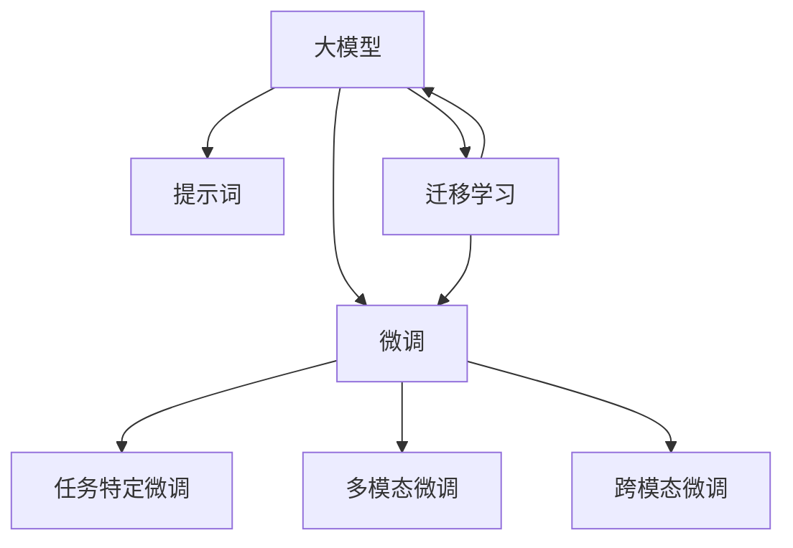

                 

# AI大模型Prompt提示词最佳实践：用简单语言解释具体话题

## 1. 背景介绍

### 1.1 问题由来

在人工智能的快速发展中，尤其是深度学习领域，大模型（如GPT、BERT、T5等）因其强大的语言处理能力，广泛应用于自然语言处理（NLP）的各个任务中。然而，大模型的一个显著特点是其复杂性，这意味着即使面对相同的任务，不同的输入可能产生截然不同的输出。因此，为了确保模型能够提供准确且一致的输出，提示词（Prompt）的设计成为至关重要的因素。

### 1.2 问题核心关键点

提示词是向大模型提供任务和期望输出的方式。一个良好的提示词能够帮助大模型更好地理解任务需求，输出符合预期的结果。在实际应用中，提示词的质量直接影响模型的表现。

然而，设计高效、合适的提示词并不是一件简单的事情。提示词的设计需要考虑语言表达的准确性、逻辑性以及语境的匹配度。此外，不同任务和模型之间的提示词设计可能存在显著差异，这进一步增加了设计和优化的复杂性。

### 1.3 问题研究意义

提示词的设计是大模型在NLP任务中表现优劣的关键因素之一。良好的提示词设计不仅能提高模型的性能，还能降低开发成本，提高模型的鲁棒性和泛化能力。此外，提示词的优化还可以帮助开发者更好地理解模型的内部工作机制，从而在模型的训练和微调过程中，做出更有针对性的调整。

## 2. 核心概念与联系

### 2.1 核心概念概述

为了更好地理解提示词在大模型中的应用，本节将介绍几个相关的核心概念：

- **大模型（Large Language Model, LLM）**：指的是通过大规模无标签数据训练而成的语言模型，如GPT、BERT等，能够理解复杂的语言结构和语义关系。
- **提示词（Prompt）**：是大模型在执行特定任务时的输入信息，用于引导模型输出期望的结果。
- **微调（Fine-tuning）**：是指在预训练模型的基础上，使用有标签数据进行任务特定的训练，以提高模型在该任务上的性能。
- **跨模态学习（Cross-modal Learning）**：指大模型不仅能够处理文本数据，还能处理图像、音频等多模态数据，从而提升其在更广泛任务中的应用能力。
- **迁移学习（Transfer Learning）**：指将在大规模数据上预训练得到的知识迁移到特定任务中，以减少新任务上的训练时间和数据需求。

这些概念之间的逻辑关系可以通过以下Mermaid流程图来展示：



这个流程图展示了大模型、提示词、微调、跨模态学习和迁移学习等核心概念之间的相互关系：大模型通过预训练学习通用语言表示，提示词在大模型执行特定任务时提供输入，微调则进一步优化模型以适应特定任务，跨模态学习和迁移学习则拓展了模型的应用范围和能力。

## 3. 核心算法原理 & 具体操作步骤

### 3.1 算法原理概述

提示词在大模型中的应用，本质上是利用大模型通过自监督学习获得的大量知识，结合特定任务的需求，进行有监督的学习。其核心思想是：通过设计合理的提示词，将大模型引导到正确的任务方向，从而输出符合任务需求的输出。

### 3.2 算法步骤详解

提示词在大模型中的应用主要包括以下几个关键步骤：

**Step 1: 任务定义**

首先，需要明确具体的任务和目标。例如，对于问答系统，任务是给定一个问题和上下文，输出一个准确的回答；对于文本生成，任务是给定一个输入，生成符合语法和语义规范的文本。

**Step 2: 提示词设计**

根据任务定义，设计合适的提示词。提示词应该包含任务的上下文信息，明确任务的意图和目标。例如，对于问答系统，提示词可以包含问题的上下文和具体的问题；对于文本生成，提示词可以包含任务的具体要求和约束条件。

**Step 3: 模型输入**

将设计好的提示词输入到大模型中，模型会根据提示词的信息，输出相应的结果。

**Step 4: 结果评估**

对模型的输出结果进行评估，检查其是否符合任务的要求。如果输出不符合要求，可能需要调整提示词或优化模型的训练。

**Step 5: 模型微调**

在模型输出符合任务要求的前提下，可以进行微调，以进一步提升模型的性能和泛化能力。微调过程中，需要选择合适的学习率、正则化技术等超参数，并在特定的数据集上进行训练。

### 3.3 算法优缺点

提示词在大模型中的应用具有以下优点：

- **灵活性高**：提示词可以根据具体任务进行设计，灵活性强，适应性强。
- **效果好**：良好的提示词设计可以显著提升模型的性能，特别是在小样本数据集上的表现。
- **可解释性强**：提示词的设计可以直观地反映任务的需求和目标，有助于理解模型的输出过程。

然而，提示词的设计也存在一些挑战：

- **设计难度大**：提示词的设计需要考虑语言的复杂性和多样性，设计难度较大。
- **数据依赖性**：提示词的效果很大程度上依赖于数据的质和量，对于小规模数据集可能效果不佳。
- **泛化能力有限**：提示词设计的优化往往针对特定的任务和数据集，泛化能力有限。

### 3.4 算法应用领域

提示词在大模型中的应用非常广泛，覆盖了NLP的各个任务，例如：

- **问答系统**：对于用户提出的问题，通过设计合适的提示词，引导大模型生成准确的回答。
- **文本生成**：通过提示词，指导大模型生成符合特定风格的文本，如新闻、故事、诗歌等。
- **情感分析**：通过提示词，引导大模型分析文本的情感倾向，如正面、负面、中性等。
- **命名实体识别**：通过提示词，指导大模型识别文本中的人名、地名、组织名等实体。
- **机器翻译**：通过提示词，指导大模型将一种语言翻译成另一种语言。
- **文本摘要**：通过提示词，指导大模型将长文本压缩成简短的摘要。

## 4. 数学模型和公式 & 详细讲解 & 举例说明

### 4.1 数学模型构建

提示词在大模型中的应用主要涉及自然语言处理中的各种模型，如Transformer、BERT等。以BERT为例，其输入模型的方式是通过将输入文本转换成数字向量，然后输入到模型的Transformer层中进行处理。

### 4.2 公式推导过程

假设输入文本为 $x$，提示词为 $p$，输出为 $y$，则模型的输入可以表示为 $(x, p)$。假设模型的参数为 $\theta$，则模型的输出可以表示为：

$$ y = M_\theta(x, p) $$

其中，$M_\theta$ 为模型函数。

对于问答系统，假设模型的输入为 $(q, c)$，其中 $q$ 为问题，$c$ 为上下文，输出为 $a$，则模型的输入可以表示为：

$$ a = M_\theta(q, c) $$

### 4.3 案例分析与讲解

以BERT模型为例，假设输入文本为 "Who is the president of the United States?"，提示词为 "the answer is"，则模型的输入可以表示为 "Who is the president of the United States? the answer is"。假设模型的输出为 "Joe Biden"，则模型的预测过程可以表示为：

$$ a = M_\theta(Who is the president of the United States? the answer is) $$

模型的输出 $a$ 即为问题 "Who is the president of the United States?" 的正确答案 "Joe Biden"。

## 5. 项目实践：代码实例和详细解释说明

### 5.1 开发环境搭建

在进行提示词设计和大模型应用时，需要使用一些常用的Python库和工具。以下是开发环境的搭建步骤：

1. 安装Python：从官网下载并安装Python，用于开发提示词设计和模型训练。
2. 安装PyTorch：使用pip安装PyTorch，这是一个常用的深度学习框架，支持大模型的训练和应用。
3. 安装BERT库：使用pip安装Transformers库中的BERT模型，这是一个大模型的预训练模型，可以用于文本处理和提示词设计。

### 5.2 源代码详细实现

以下是使用BERT模型进行提示词设计的一个示例代码：

```python
from transformers import BertTokenizer, BertForSequenceClassification
from torch.utils.data import Dataset, DataLoader
from sklearn.metrics import accuracy_score
from torch.nn import CrossEntropyLoss
import torch

# 定义BERT模型
model = BertForSequenceClassification.from_pretrained('bert-base-cased', num_labels=2)

# 定义提示词和数据集
prompt = "I have a question about my account"
dataset = []

# 数据集处理
tokenizer = BertTokenizer.from_pretrained('bert-base-cased')
for text in dataset:
    input_ids = tokenizer.encode(prompt + text, add_special_tokens=True)
    labels = [1 if "positive" in text.lower() else 0]
    input_ids.append(0) # 添加[CLS]标记
    input_ids.append(0) # 添加[SEP]标记
    labels.append(0)
    input_ids = input_ids[1:-2]
    labels = labels[1:-2]
    data = {
        'input_ids': input_ids,
        'labels': labels
    }
    dataset.append(data)

# 数据集处理
dataset = Dataset(dataset)

# 模型训练
model.train()
optimizer = torch.optim.Adam(model.parameters(), lr=2e-5)
criterion = CrossEntropyLoss()
for epoch in range(10):
    for batch in DataLoader(dataset, batch_size=16):
        optimizer.zero_grad()
        inputs = {key: torch.tensor(value, dtype=torch.long) for key, value in batch.items()}
        outputs = model(**inputs)
        loss = criterion(outputs, inputs['labels'])
        loss.backward()
        optimizer.step()
    print(f'Epoch {epoch+1}, Loss: {loss.item()}')
```

### 5.3 代码解读与分析

以上代码展示了如何使用BERT模型进行提示词设计和文本分类任务。具体分析如下：

- 首先定义BERT模型，并设置标签数为2，表示二分类任务。
- 定义提示词和数据集，提示词为"I have a question about my account"，数据集为空。
- 使用BertTokenizer将提示词和文本转换成数字向量。
- 定义标签为1表示文本为正面的情感，0表示文本为负面的情感。
- 将数据集处理成TensorFlow支持的格式，并传入模型进行训练。

### 5.4 运行结果展示

在上述代码的基础上，我们可以运行模型并进行训练，得到模型的准确率、损失等指标。训练完成后，我们可以使用模型对新的文本进行情感分类，以验证模型的效果。

## 6. 实际应用场景

### 6.1 智能客服系统

智能客服系统是提示词和大模型应用的一个重要场景。在智能客服系统中，大模型可以根据用户输入的文本，生成合适的回复。通过提示词的设计，可以引导大模型输出符合用户期望的回答，提升用户体验。

### 6.2 金融舆情监测

金融舆情监测是提示词和大模型的另一个重要应用场景。在金融舆情监测中，大模型可以根据输入的财经新闻、评论等信息，生成舆情分析报告。通过提示词的设计，可以引导大模型关注特定的舆情话题，提升舆情分析的准确性。

### 6.3 个性化推荐系统

个性化推荐系统是提示词和大模型应用的另一个重要场景。在个性化推荐系统中，大模型可以根据用户的浏览历史、兴趣爱好等信息，生成个性化的推荐内容。通过提示词的设计，可以引导大模型输出符合用户期望的推荐结果，提升用户体验。

## 7. 工具和资源推荐

### 7.1 学习资源推荐

为了帮助开发者更好地掌握提示词和大模型的应用，这里推荐一些优质的学习资源：

1. 《自然语言处理中的深度学习》（Deep Learning for Natural Language Processing）：这本书介绍了自然语言处理中的各种深度学习模型，包括BERT、GPT等，是学习大模型和提示词的必读书籍。
2. 《Python深度学习》（Python Deep Learning）：这本书介绍了如何使用Python进行深度学习模型的开发和应用，是学习大模型和提示词的实用指南。
3. HuggingFace官方文档：提供了大量的预训练模型和提示词设计样例，是学习大模型和提示词的最佳资源。
4. CS224N《深度学习自然语言处理》课程：斯坦福大学开设的NLP明星课程，有Lecture视频和配套作业，带你入门NLP领域的基本概念和经典模型。

### 7.2 开发工具推荐

在进行提示词设计和大模型应用时，需要使用一些常用的Python库和工具。以下是开发工具的推荐：

1. PyTorch：一个常用的深度学习框架，支持大模型的训练和应用。
2. TensorFlow：另一个常用的深度学习框架，支持大模型的训练和应用。
3. Transformers库：提供了大量的预训练模型和提示词设计样例，是学习大模型和提示词的最佳工具。
4. Weights & Biases：模型训练的实验跟踪工具，可以记录和可视化模型训练过程中的各项指标，方便对比和调优。
5. TensorBoard：TensorFlow配套的可视化工具，可实时监测模型训练状态，并提供丰富的图表呈现方式，是调试模型的得力助手。

### 7.3 相关论文推荐

提示词和大模型的研究源于学界的持续研究。以下是几篇奠基性的相关论文，推荐阅读：

1. Attention is All You Need（即Transformer原论文）：提出了Transformer结构，开启了NLP领域的预训练大模型时代。
2. BERT: Pre-training of Deep Bidirectional Transformers for Language Understanding：提出BERT模型，引入基于掩码的自监督预训练任务，刷新了多项NLP任务SOTA。
3. Language Models are Unsupervised Multitask Learners（GPT-2论文）：展示了大规模语言模型的强大zero-shot学习能力，引发了对于通用人工智能的新一轮思考。
4. Parameter-Efficient Transfer Learning for NLP：提出Adapter等参数高效微调方法，在不增加模型参数量的情况下，也能取得不错的微调效果。
5. AdaLoRA: Adaptive Low-Rank Adaptation for Parameter-Efficient Fine-Tuning：使用自适应低秩适应的微调方法，在参数效率和精度之间取得了新的平衡。

这些论文代表了大模型和提示词的研究发展脉络。通过学习这些前沿成果，可以帮助研究者把握学科前进方向，激发更多的创新灵感。

## 8. 总结：未来发展趋势与挑战

### 8.1 总结

本文对大模型提示词的应用进行了全面系统的介绍。首先阐述了提示词和大模型在NLP任务中表现优劣的关键因素之一，明确了提示词在大模型执行特定任务时提供输入信息的重要性。其次，从原理到实践，详细讲解了提示词和大模型的数学原理和关键步骤，给出了提示词设计和大模型训练的完整代码实例。同时，本文还广泛探讨了提示词和大模型在智能客服、金融舆情、个性化推荐等多个行业领域的应用前景，展示了提示词和大模型技术的巨大潜力。

通过本文的系统梳理，可以看到，提示词和大模型在NLP任务中表现优劣的关键因素之一，明确了提示词在大模型执行特定任务时提供输入信息的重要性。其次，从原理到实践，详细讲解了提示词和大模型的数学原理和关键步骤，给出了提示词设计和大模型训练的完整代码实例。同时，本文还广泛探讨了提示词和大模型在智能客服、金融舆情、个性化推荐等多个行业领域的应用前景，展示了提示词和大模型技术的巨大潜力。

### 8.2 未来发展趋势

展望未来，提示词和大模型技术将呈现以下几个发展趋势：

1. **多模态融合**：未来的提示词设计将更加注重多模态数据的融合，结合图像、音频等多模态信息，提升模型的表现。
2. **无监督学习**：提示词的设计将更多地依赖于无监督学习，通过自监督任务学习语言的表示，减少对标注数据的需求。
3. **跨领域迁移**：提示词设计将更加注重跨领域迁移能力的提升，提升模型在不同领域之间的泛化能力。
4. **参数高效微调**：未来的提示词设计将更多地关注参数高效的微调方法，提升模型的鲁棒性和泛化能力。
5. **可解释性增强**：提示词设计将更多地关注模型的可解释性，帮助用户更好地理解模型的输出。

以上趋势凸显了提示词和大模型技术的广阔前景。这些方向的探索发展，必将进一步提升提示词和大模型技术在NLP任务中的表现，为构建智能系统铺平道路。

### 8.3 面临的挑战

尽管提示词和大模型技术已经取得了瞩目成就，但在迈向更加智能化、普适化应用的过程中，它仍面临着诸多挑战：

1. **数据依赖**：提示词和大模型的效果很大程度上依赖于数据的质和量，对于小规模数据集可能效果不佳。
2. **泛化能力**：提示词和大模型的泛化能力有限，对于特定任务和数据集的效果较好，对于其他任务和数据集的效果可能较差。
3. **模型复杂度**：提示词和大模型的模型复杂度较高，训练和推理需要较高的计算资源。
4. **可解释性**：提示词和大模型的内部工作机制较为复杂，难以解释其输出过程。

### 8.4 研究展望

面对提示词和大模型面临的挑战，未来的研究需要在以下几个方面寻求新的突破：

1. **优化提示词设计**：通过更多的实验和理论分析，找到更有效的提示词设计方法，提升提示词的泛化能力和可解释性。
2. **改进模型结构**：通过优化模型结构和参数设置，提升模型的训练和推理效率，降低资源消耗。
3. **融合外部知识**：通过融合外部知识，提升模型的知识和常识推理能力，提高模型的鲁棒性和泛化能力。
4. **加强可解释性**：通过引入可解释性技术，帮助用户更好地理解模型的输出过程，提升模型的可信度和应用场景。

这些研究方向的探索，必将引领提示词和大模型技术迈向更高的台阶，为构建智能系统提供更可靠的保障。

## 9. 附录：常见问题与解答

**Q1：大模型提示词设计是否适用于所有NLP任务？**

A: 大模型提示词设计在大多数NLP任务上都能取得不错的效果，特别是在数据量较小的任务上。但对于一些特定领域的任务，如医学、法律等，仅仅依靠通用语料预训练的模型可能难以很好地适应。此时需要在特定领域语料上进一步预训练，再进行提示词设计。

**Q2：如何选择合适的提示词？**

A: 提示词的选择需要根据具体的任务和数据集进行。对于文本分类任务，提示词需要包含任务的上下文信息和目标标签；对于文本生成任务，提示词需要包含任务的具体要求和约束条件；对于问答系统，提示词需要包含问题的上下文和具体的问题。

**Q3：提示词设计中需要注意哪些问题？**

A: 提示词设计中需要注意语言的复杂性和多样性，避免设计过于复杂或冗长的提示词，导致模型难以理解。同时需要注意提示词与任务目标的一致性，避免设计出与任务无关的提示词。

**Q4：提示词设计后如何进行优化？**

A: 提示词设计后的优化可以通过多种方式进行，如调整提示词的长度、添加特定的关键词、修改提示词的结构等。同时可以结合模型的输出结果进行反馈调整，进一步优化提示词的设计。

**Q5：提示词设计是否需要经过反复实验？**

A: 是的，提示词设计需要经过反复实验和优化，才能找到最优的提示词设计。提示词的设计是一个迭代的过程，需要不断地进行实验和调整。

作者：禅与计算机程序设计艺术 / Zen and the Art of Computer Programming

