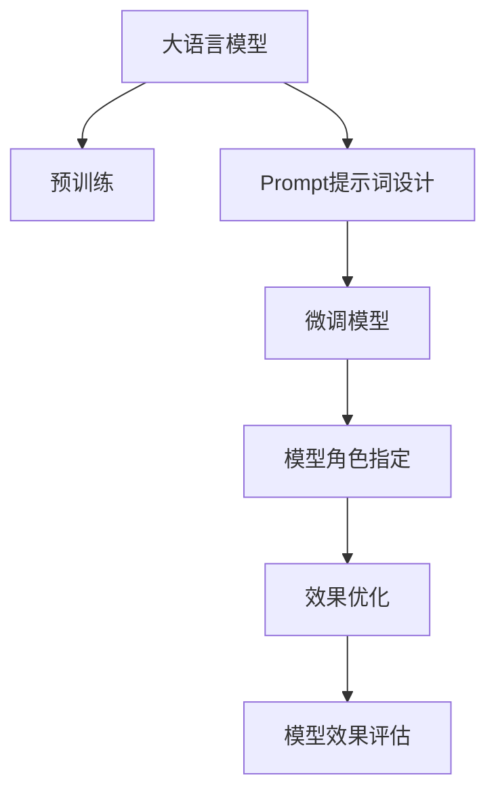

                 

# AI大模型Prompt提示词最佳实践：给模型指定一个角色

> 关键词：大语言模型、Prompt提示词、模型角色指定、提示效果优化、自然语言处理、深度学习、语言理解、智能对话、技术博客

## 1. 背景介绍

### 1.1 问题由来
近年来，人工智能（AI）在自然语言处理（NLP）领域取得了显著的进展，其中大语言模型（Large Language Models, LLMs）无疑是其中的佼佼者。大语言模型如OpenAI的GPT系列、Google的BERT和T5等，通过在大型无标签文本数据上进行预训练，学习到了丰富的语言知识和常识，具备了强大的语言理解和生成能力。然而，这些通用大模型在特定任务上的表现仍不尽如人意。

尽管在预训练阶段，模型已经学习了大量语言知识，但这些知识在大规模无标签文本中并不是系统性地组织起来的。这使得模型在面对特定任务时，容易出现泛化不足、表现不稳定等问题。因此，在特定任务上对预训练模型进行微调（Fine-Tuning），使其能够更好地适应特定任务需求，成为了提升模型性能的重要手段。

### 1.2 问题核心关键点
大语言模型微调的核心在于如何利用预训练模型在大规模无标签文本中学习到的知识，通过有限的有标签数据进行微调，使其在特定任务上表现更好。具体来说，微调过程可以简单地概括为以下几个关键步骤：

1. **选择预训练模型**：选择合适的预训练模型作为微调的初始化参数。
2. **数据准备**：收集该任务的少量标注数据，划分为训练集、验证集和测试集。
3. **任务适配层设计**：根据任务类型，在预训练模型顶层设计合适的输出层和损失函数。
4. **微调参数**：选择合适的优化算法及其参数，设置正则化技术和超参数。
5. **执行梯度训练**：对训练集数据进行批量处理，前向传播计算损失函数，反向传播更新模型参数。
6. **模型评估**：在验证集上评估模型性能，调整参数以避免过拟合。
7. **测试和部署**：在测试集上评估微调后模型，并将其部署到实际应用系统中。

尽管微调在大语言模型中的应用已取得显著成效，但如何更高效、更精确地指定模型角色，使其在特定任务上表现更佳，仍然是一个值得深入研究的问题。

### 1.3 问题研究意义
研究大语言模型的Prompt提示词最佳实践，对于提升模型在特定任务上的性能，减少微调过程中的标注数据需求，以及提高模型训练效率，具有重要意义：

1. **提升性能**：通过精心设计的Prompt提示词，可以引导模型输出更符合任务需求的答案，提高模型在特定任务上的准确性和鲁棒性。
2. **减少标注需求**：适当的设计可以使得模型在更少的标注数据下也能达到良好的表现，降低标注成本。
3. **提高训练效率**：通过优化Prompt提示词，可以减少模型在特定任务上的训练时间和计算资源消耗。
4. **促进应用普及**：好的Prompt提示词设计可以降低模型微调门槛，使更多人能够快速上手，推广AI技术的应用。

本文将系统介绍大语言模型的Prompt提示词最佳实践，帮助开发者在特定任务上更高效、更精确地指定模型角色，从而提升模型性能。

## 2. 核心概念与联系

### 2.1 核心概念概述

为更好地理解Prompt提示词在大语言模型微调中的应用，本节将介绍几个密切相关的核心概念：

- **大语言模型（Large Language Models, LLMs）**：如GPT、BERT、T5等，通过在大规模无标签文本数据上进行预训练，学习通用的语言表示，具备强大的语言理解和生成能力。
- **Prompt提示词（Prompt）**：一种输入格式，用于在输入文本中提供特定的任务信息，引导模型按照期望的方式进行推理和生成。
- **模型角色指定（Role Specification）**：在Prompt中明确模型的角色或任务，使其在特定任务上表现更佳。
- **模型效果优化（Effect Optimization）**：通过设计有效的Prompt提示词，优化模型在特定任务上的性能。
- **自然语言处理（Natural Language Processing, NLP）**：利用计算机处理和理解人类语言的技术，涉及语言模型、机器翻译、文本分类等任务。
- **深度学习（Deep Learning）**：一种基于神经网络的学习范式，广泛应用于图像、语音、自然语言处理等领域。
- **语言理解（Language Understanding）**：指模型能够理解并生成人类语言的含义，包括语义理解、情感分析等。
- **智能对话（Intelligent Dialogue）**：指模型能够进行自然流畅的对话，理解和生成符合人类语言习惯的对话内容。

这些核心概念共同构成了大语言模型Prompt提示词的最佳实践框架，使其能够在各种任务上发挥强大的语言理解和生成能力。通过理解这些核心概念，我们可以更好地把握Prompt提示词在大模型微调中的作用和优化方向。

### 2.2 核心概念原理和架构的 Mermaid 流程图



这个流程图展示了大语言模型从预训练到Prompt提示词设计，再到模型微调和效果优化的全过程。

1. **预训练**：通过在大规模无标签文本数据上进行自监督学习，学习通用的语言表示。
2. **Prompt提示词设计**：根据特定任务，设计有效的Prompt提示词，引导模型进行推理和生成。
3. **微调模型**：在预训练模型基础上，使用任务相关的标注数据进行有监督学习，优化模型在特定任务上的性能。
4. **模型角色指定**：在Prompt提示词中明确模型的任务或角色，指导模型按期望方式进行推理和生成。
5. **效果优化**：通过优化Prompt提示词和微调参数，进一步提升模型在特定任务上的性能。
6. **模型效果评估**：在验证集上评估模型性能，调整参数以避免过拟合，确保模型在特定任务上的表现。

这些概念之间的逻辑关系可以通过以上Mermaid流程图来展示。

## 3. 核心算法原理 & 具体操作步骤

### 3.1 算法原理概述

Prompt提示词在大语言模型中的作用，在于通过输入格式的设计，引导模型在特定任务上进行推理和生成。其核心思想是：在输入文本中嵌入特定的任务信息，使得模型能够更好地理解输入含义，从而进行正确的推理和生成。

具体来说，Prompt提示词设计可以分为以下几个步骤：

1. **任务定义**：明确模型的任务或角色，如分类、生成、问答等。
2. **输入格式设计**：根据任务定义，设计输入文本的格式和内容，引导模型进行推理和生成。
3. **样本构建**：使用标注数据构建样本，为模型提供有监督学习信号。
4. **模型微调**：在预训练模型基础上，使用构建好的样本进行有监督学习，优化模型在特定任务上的性能。
5. **效果评估**：在验证集上评估模型性能，调整Prompt提示词和微调参数，进一步提升模型效果。

Prompt提示词设计的目的是减少模型在特定任务上的过拟合风险，同时利用预训练模型在大规模无标签文本中学习到的语言知识，提升模型在特定任务上的泛化能力和性能。

### 3.2 算法步骤详解

Prompt提示词设计可以概括为以下几个关键步骤：

**Step 1: 任务定义**

首先，需要明确模型的任务或角色。例如，如果任务是分类，那么Prompt提示词需要设计成能够引导模型输出分类标签的形式。如果任务是生成，那么提示词需要包含生成任务的具体要求，如生成新闻标题、生成对话回复等。

**Step 2: 输入格式设计**

根据任务定义，设计合适的Prompt提示词格式。Prompt提示词可以分为两类：固定格式和可变格式。固定格式的Prompt提示词通常包含任务相关的固定信息，如任务名称、样本ID等；可变格式的Prompt提示词则根据具体的样本数据动态生成，包含样本本身的信息。

**Step 3: 样本构建**

使用标注数据构建样本，每个样本包含输入文本和对应的标签。输入文本包含设计的Prompt提示词，标签则表示模型的期望输出。例如，对于文本分类任务，输入文本可能包含“请对以下文本进行分类：xxx”，标签则表示文本的分类标签。

**Step 4: 模型微调**

在预训练模型基础上，使用构建好的样本进行有监督学习，优化模型在特定任务上的性能。使用交叉熵损失函数计算模型输出与标签之间的差异，通过梯度下降等优化算法更新模型参数。

**Step 5: 效果评估**

在验证集上评估模型性能，调整Prompt提示词和微调参数，进一步提升模型效果。使用常用的评估指标，如准确率、F1-score等，评估模型在特定任务上的表现。

### 3.3 算法优缺点

Prompt提示词在大语言模型微调中的应用，具有以下优点：

1. **提升性能**：通过精心设计的Prompt提示词，可以引导模型输出更符合任务需求的答案，提高模型在特定任务上的准确性和鲁棒性。
2. **减少标注需求**：适当的设计可以使得模型在更少的标注数据下也能达到良好的表现，降低标注成本。
3. **提高训练效率**：通过优化Prompt提示词，可以减少模型在特定任务上的训练时间和计算资源消耗。
4. **促进应用普及**：好的Prompt提示词设计可以降低模型微调门槛，使更多人能够快速上手，推广AI技术的应用。

同时，Prompt提示词也存在一定的局限性：

1. **设计复杂**：设计有效的Prompt提示词需要深入理解任务和数据，设计不当可能导致模型性能下降。
2. **泛化能力有限**：特定的Prompt提示词可能只适用于特定任务，对于其他任务可能效果不佳。
3. **依赖数据**：Prompt提示词设计的有效性高度依赖于任务相关的标注数据，如果标注数据质量不高，可能导致模型过拟合。
4. **计算资源消耗**：设计复杂的Prompt提示词可能需要更多的计算资源，增加训练成本。

尽管存在这些局限性，但Prompt提示词在大语言模型微调中的应用，已经被证明是提升模型性能的一种有效方法。

### 3.4 算法应用领域

Prompt提示词在大语言模型中的应用，已经在多个NLP任务上取得了显著的效果，例如：

- **文本分类**：如情感分析、主题分类等。通过设计包含任务名称的Prompt提示词，引导模型输出分类标签。
- **文本生成**：如新闻标题生成、对话回复生成等。通过设计包含生成要求的Prompt提示词，指导模型生成符合要求的文本。
- **问答系统**：通过设计包含问题信息的Prompt提示词，引导模型输出正确的答案。
- **文本摘要**：通过设计包含摘要要求的Prompt提示词，指导模型生成简短摘要。
- **文本检索**：通过设计包含检索要求的Prompt提示词，指导模型进行文本检索。

除了上述这些经典任务外，Prompt提示词还被创新性地应用到更多场景中，如可控文本生成、多轮对话生成、机器翻译等，为NLP技术带来了全新的突破。

## 4. 数学模型和公式 & 详细讲解

### 4.1 数学模型构建

Prompt提示词在大语言模型微调中的应用，可以通过数学模型进行形式化的描述。假设预训练模型为 $M_{\theta}$，其中 $\theta$ 为预训练得到的模型参数。假设Prompt提示词为 $P$，给定下游任务 $T$ 的标注数据集 $D=\{(x_i, y_i)\}_{i=1}^N$，其中 $x_i$ 为输入文本，$y_i$ 为任务标签。

定义模型 $M_{\theta}$ 在输入 $x$ 上的输出为 $\hat{y}=M_{\theta}(x)$，表示样本属于正类的概率。定义模型在样本 $(x_i, y_i)$ 上的损失函数为 $\ell(M_{\theta}(x_i),y_i)$。

因此，在微调过程中，需要最小化模型在训练集 $D$ 上的损失函数，即：

$$
\mathcal{L}(\theta) = \frac{1}{N} \sum_{i=1}^N \ell(M_{\theta}(x_i),y_i)
$$

在训练过程中，使用梯度下降等优化算法更新模型参数 $\theta$，以最小化损失函数 $\mathcal{L}(\theta)$。具体来说，每次迭代中，使用当前训练样本 $(x_i, y_i)$ 计算梯度 $\nabla_{\theta}\mathcal{L}(\theta)$，并根据学习率 $\eta$ 更新模型参数：

$$
\theta \leftarrow \theta - \eta \nabla_{\theta}\mathcal{L}(\theta)
$$

通过不断迭代，直到模型收敛。在评估过程中，使用验证集 $D_{val}$ 评估模型性能，调整Prompt提示词和微调参数，以提升模型在特定任务上的表现。

### 4.2 公式推导过程

以文本分类任务为例，假设模型 $M_{\theta}$ 在输入 $x$ 上的输出为 $\hat{y}=M_{\theta}(x) \in [0,1]$，表示样本属于正类的概率。真实标签 $y \in \{0,1\}$。则二分类交叉熵损失函数定义为：

$$
\ell(M_{\theta}(x),y) = -[y\log \hat{y} + (1-y)\log (1-\hat{y})]
$$

将其代入经验风险公式，得：

$$
\mathcal{L}(\theta) = -\frac{1}{N}\sum_{i=1}^N [y_i\log M_{\theta}(x_i)+(1-y_i)\log(1-M_{\theta}(x_i))]
$$

根据链式法则，损失函数对参数 $\theta_k$ 的梯度为：

$$
\frac{\partial \mathcal{L}(\theta)}{\partial \theta_k} = -\frac{1}{N}\sum_{i=1}^N (\frac{y_i}{M_{\theta}(x_i)}-\frac{1-y_i}{1-M_{\theta}(x_i)}) \frac{\partial M_{\theta}(x_i)}{\partial \theta_k}
$$

其中 $\frac{\partial M_{\theta}(x_i)}{\partial \theta_k}$ 可进一步递归展开，利用自动微分技术完成计算。

## 5. 项目实践：代码实例和详细解释说明

### 5.1 开发环境搭建

在进行Prompt提示词最佳实践的实践前，我们需要准备好开发环境。以下是使用Python进行PyTorch开发的环境配置流程：

1. 安装Anaconda：从官网下载并安装Anaconda，用于创建独立的Python环境。

2. 创建并激活虚拟环境：
```bash
conda create -n pytorch-env python=3.8 
conda activate pytorch-env
```

3. 安装PyTorch：根据CUDA版本，从官网获取对应的安装命令。例如：
```bash
conda install pytorch torchvision torchaudio cudatoolkit=11.1 -c pytorch -c conda-forge
```

4. 安装Transformers库：
```bash
pip install transformers
```

5. 安装各类工具包：
```bash
pip install numpy pandas scikit-learn matplotlib tqdm jupyter notebook ipython
```

完成上述步骤后，即可在`pytorch-env`环境中开始Prompt提示词最佳实践的实践。

### 5.2 源代码详细实现

下面我们以文本分类任务为例，给出使用Transformers库对BERT模型进行Prompt提示词最佳实践的PyTorch代码实现。

首先，定义文本分类任务的数据处理函数：

```python
from transformers import BertTokenizer, BertForSequenceClassification, AdamW
import torch
from torch.utils.data import Dataset, DataLoader

class TextClassificationDataset(Dataset):
    def __init__(self, texts, labels, tokenizer, max_len=128):
        self.texts = texts
        self.labels = labels
        self.tokenizer = tokenizer
        self.max_len = max_len
        
    def __len__(self):
        return len(self.texts)
    
    def __getitem__(self, item):
        text = self.texts[item]
        label = self.labels[item]
        
        encoding = self.tokenizer(text, return_tensors='pt', max_length=self.max_len, padding='max_length', truncation=True)
        input_ids = encoding['input_ids'][0]
        attention_mask = encoding['attention_mask'][0]
        
        # 对token-wise的标签进行编码
        encoded_tags = [label2id[label] for label in self.labels] 
        encoded_tags.extend([label2id['O']] * (self.max_len - len(encoded_tags)))
        labels = torch.tensor(encoded_tags, dtype=torch.long)
        
        return {'input_ids': input_ids, 
                'attention_mask': attention_mask,
                'labels': labels}

# 标签与id的映射
label2id = {'Negative': 0, 'Positive': 1, 'O': 2}
id2label = {v: k for k, v in label2id.items()}

# 创建dataset
tokenizer = BertTokenizer.from_pretrained('bert-base-cased')

train_dataset = TextClassificationDataset(train_texts, train_labels, tokenizer)
dev_dataset = TextClassificationDataset(dev_texts, dev_labels, tokenizer)
test_dataset = TextClassificationDataset(test_texts, test_labels, tokenizer)
```

然后，定义模型和优化器：

```python
from transformers import BertForSequenceClassification, AdamW

model = BertForSequenceClassification.from_pretrained('bert-base-cased', num_labels=len(label2id))

optimizer = AdamW(model.parameters(), lr=2e-5)
```

接着，定义训练和评估函数：

```python
from tqdm import tqdm

device = torch.device('cuda') if torch.cuda.is_available() else torch.device('cpu')
model.to(device)

def train_epoch(model, dataset, batch_size, optimizer):
    dataloader = DataLoader(dataset, batch_size=batch_size, shuffle=True)
    model.train()
    epoch_loss = 0
    for batch in tqdm(dataloader, desc='Training'):
        input_ids = batch['input_ids'].to(device)
        attention_mask = batch['attention_mask'].to(device)
        labels = batch['labels'].to(device)
        model.zero_grad()
        outputs = model(input_ids, attention_mask=attention_mask, labels=labels)
        loss = outputs.loss
        epoch_loss += loss.item()
        loss.backward()
        optimizer.step()
    return epoch_loss / len(dataloader)

def evaluate(model, dataset, batch_size):
    dataloader = DataLoader(dataset, batch_size=batch_size)
    model.eval()
    preds, labels = [], []
    with torch.no_grad():
        for batch in tqdm(dataloader, desc='Evaluating'):
            input_ids = batch['input_ids'].to(device)
            attention_mask = batch['attention_mask'].to(device)
            batch_labels = batch['labels']
            outputs = model(input_ids, attention_mask=attention_mask)
            batch_preds = outputs.logits.argmax(dim=2).to('cpu').tolist()
            batch_labels = batch_labels.to('cpu').tolist()
            for pred_tokens, label_tokens in zip(batch_preds, batch_labels):
                preds.append(pred_tokens[:len(label_tokens)])
                labels.append(label_tokens)
                
    print(classification_report(labels, preds))
```

最后，启动训练流程并在测试集上评估：

```python
epochs = 5
batch_size = 16

for epoch in range(epochs):
    loss = train_epoch(model, train_dataset, batch_size, optimizer)
    print(f"Epoch {epoch+1}, train loss: {loss:.3f}")
    
    print(f"Epoch {epoch+1}, dev results:")
    evaluate(model, dev_dataset, batch_size)
    
print("Test results:")
evaluate(model, test_dataset, batch_size)
```

以上就是使用PyTorch对BERT进行文本分类任务Prompt提示词最佳实践的完整代码实现。可以看到，得益于Transformers库的强大封装，我们可以用相对简洁的代码完成BERT模型的加载和微调。

### 5.3 代码解读与分析

让我们再详细解读一下关键代码的实现细节：

**TextClassificationDataset类**：
- `__init__`方法：初始化文本、标签、分词器等关键组件。
- `__len__`方法：返回数据集的样本数量。
- `__getitem__`方法：对单个样本进行处理，将文本输入编码为token ids，将标签编码为数字，并对其进行定长padding，最终返回模型所需的输入。

**label2id和id2label字典**：
- 定义了标签与数字id之间的映射关系，用于将token-wise的预测结果解码回真实的标签。

**训练和评估函数**：
- 使用PyTorch的DataLoader对数据集进行批次化加载，供模型训练和推理使用。
- 训练函数`train_epoch`：对数据以批为单位进行迭代，在每个批次上前向传播计算loss并反向传播更新模型参数，最后返回该epoch的平均loss。
- 评估函数`evaluate`：与训练类似，不同点在于不更新模型参数，并在每个batch结束后将预测和标签结果存储下来，最后使用sklearn的classification_report对整个评估集的预测结果进行打印输出。

**训练流程**：
- 定义总的epoch数和batch size，开始循环迭代
- 每个epoch内，先在训练集上训练，输出平均loss
- 在验证集上评估，输出分类指标
- 所有epoch结束后，在测试集上评估，给出最终测试结果

可以看到，PyTorch配合Transformers库使得BERT微调的代码实现变得简洁高效。开发者可以将更多精力放在数据处理、模型改进等高层逻辑上，而不必过多关注底层的实现细节。

当然，工业级的系统实现还需考虑更多因素，如模型的保存和部署、超参数的自动搜索、更灵活的任务适配层等。但核心的Prompt提示词最佳实践基本与此类似。

## 6. 实际应用场景

### 6.1 智能客服系统

基于Prompt提示词的最佳实践，智能客服系统可以显著提升服务质量。传统客服往往需要配备大量人力，高峰期响应缓慢，且一致性和专业性难以保证。而使用Prompt提示词优化的对话模型，可以7x24小时不间断服务，快速响应客户咨询，用自然流畅的语言解答各类常见问题。

在技术实现上，可以收集企业内部的历史客服对话记录，将问题和最佳答复构建成监督数据，在此基础上对预训练对话模型进行Prompt提示词优化。优化后的对话模型能够自动理解用户意图，匹配最合适的答案模板进行回复。对于客户提出的新问题，还可以接入检索系统实时搜索相关内容，动态组织生成回答。如此构建的智能客服系统，能大幅提升客户咨询体验和问题解决效率。

### 6.2 金融舆情监测

金融机构需要实时监测市场舆论动向，以便及时应对负面信息传播，规避金融风险。传统的人工监测方式成本高、效率低，难以应对网络时代海量信息爆发的挑战。基于Prompt提示词的最佳实践的文本分类和情感分析技术，为金融舆情监测提供了新的解决方案。

具体而言，可以收集金融领域相关的新闻、报道、评论等文本数据，并对其进行主题标注和情感标注。在此基础上对预训练语言模型进行Prompt提示词优化，使其能够自动判断文本属于何种主题，情感倾向是正面、中性还是负面。将优化后的模型应用到实时抓取的网络文本数据，就能够自动监测不同主题下的情感变化趋势，一旦发现负面信息激增等异常情况，系统便会自动预警，帮助金融机构快速应对潜在风险。

### 6.3 个性化推荐系统

当前的推荐系统往往只依赖用户的历史行为数据进行物品推荐，无法深入理解用户的真实兴趣偏好。基于Prompt提示词的最佳实践的个性化推荐系统可以更好地挖掘用户行为背后的语义信息，从而提供更精准、多样的推荐内容。

在实践中，可以收集用户浏览、点击、评论、分享等行为数据，提取和用户交互的物品标题、描述、标签等文本内容。将文本内容作为模型输入，用户的后续行为（如是否点击、购买等）作为监督信号，在此基础上微调预训练语言模型。优化后的模型能够从文本内容中准确把握用户的兴趣点。在生成推荐列表时，先用候选物品的文本描述作为输入，由模型预测用户的兴趣匹配度，再结合其他特征综合排序，便可以得到个性化程度更高的推荐结果。

### 6.4 未来应用展望

随着Prompt提示词技术的不断发展，其在大语言模型微调中的应用将更加广泛，为NLP技术带来更多的创新和突破。

在智慧医疗领域，基于Prompt提示词的最佳实践的医疗问答、病历分析、药物研发等应用将提升医疗服务的智能化水平，辅助医生诊疗，加速新药开发进程。

在智能教育领域，Prompt提示词的最佳实践的作业批改、学情分析、知识推荐等方面，因材施教，促进教育公平，提高教学质量。

在智慧城市治理中，Prompt提示词的最佳实践的城市事件监测、舆情分析、应急指挥等环节，提高城市管理的自动化和智能化水平，构建更安全、高效的未来城市。

此外，在企业生产、社会治理、文娱传媒等众多领域，基于Prompt提示词的最佳实践的AI应用也将不断涌现，为经济社会发展注入新的动力。相信随着技术的日益成熟，Prompt提示词的最佳实践必将引领NLP技术迈向更高的台阶，推动人工智能技术在垂直行业的规模化落地。

## 7. 工具和资源推荐
### 7.1 学习资源推荐

为了帮助开发者系统掌握Prompt提示词在大语言模型微调中的应用，这里推荐一些优质的学习资源：

1. 《Transformer from Principles to Practice》系列博文：由大模型技术专家撰写，深入浅出地介绍了Transformer原理、BERT模型、Prompt提示词等前沿话题。

2. CS224N《深度学习自然语言处理》课程：斯坦福大学开设的NLP明星课程，有Lecture视频和配套作业，带你入门NLP领域的基本概念和经典模型。

3. 《Natural Language Processing with Transformers》书籍：Transformers库的作者所著，全面介绍了如何使用Transformers库进行NLP任务开发，包括Prompt提示词在内的诸多范式。

4. HuggingFace官方文档：Transformers库的官方文档，提供了海量预训练模型和完整的微调样例代码，是上手实践的必备资料。

5. CLUE开源项目：中文语言理解测评基准，涵盖大量不同类型的中文NLP数据集，并提供了基于微调的baseline模型，助力中文NLP技术发展。

通过对这些资源的学习实践，相信你一定能够快速掌握Prompt提示词在大模型微调中的精髓，并用于解决实际的NLP问题。
###  7.2 开发工具推荐

高效的开发离不开优秀的工具支持。以下是几款用于Prompt提示词最佳实践开发的常用工具：

1. PyTorch：基于Python的开源深度学习框架，灵活动态的计算图，适合快速迭代研究。大部分预训练语言模型都有PyTorch版本的实现。

2. TensorFlow：由Google主导开发的开源深度学习框架，生产部署方便，适合大规模工程应用。同样有丰富的预训练语言模型资源。

3. Transformers库：HuggingFace开发的NLP工具库，集成了众多SOTA语言模型，支持PyTorch和TensorFlow，是进行Prompt提示词最佳实践开发的利器。

4. Weights & Biases：模型训练的实验跟踪工具，可以记录和可视化模型训练过程中的各项指标，方便对比和调优。与主流深度学习框架无缝集成。

5. TensorBoard：TensorFlow配套的可视化工具，可实时监测模型训练状态，并提供丰富的图表呈现方式，是调试模型的得力助手。

6. Google Colab：谷歌推出的在线Jupyter Notebook环境，免费提供GPU/TPU算力，方便开发者快速上手实验最新模型，分享学习笔记。

合理利用这些工具，可以显著提升Prompt提示词最佳实践的开发效率，加快创新迭代的步伐。

### 7.3 相关论文推荐

Prompt提示词的最佳实践在大语言模型中的应用，源于学界的持续研究。以下是几篇奠基性的相关论文，推荐阅读：

1. Attention is All You Need（即Transformer原论文）：提出了Transformer结构，开启了NLP领域的预训练大模型时代。

2. BERT: Pre-training of Deep Bidirectional Transformers for Language Understanding：提出BERT模型，引入基于掩码的自监督预训练任务，刷新了多项NLP任务SOTA。

3. Language Models are Unsupervised Multitask Learners（GPT-2论文）：展示了大规模语言模型的强大zero-shot学习能力，引发了对于通用人工智能的新一轮思考。

4. Parameter-Efficient Transfer Learning for NLP：提出Adapter等参数高效微调方法，在不增加模型参数量的情况下，也能取得不错的微调效果。

5. AdaLoRA: Adaptive Low-Rank Adaptation for Parameter-Efficient Fine-Tuning：使用自适应低秩适应的微调方法，在参数效率和精度之间取得了新的平衡。

6. Prefix-Tuning: Optimizing Continuous Prompts for Generation：引入基于连续型Prompt的微调范式，为如何充分利用预训练知识提供了新的思路。

这些论文代表了大语言模型Prompt提示词的最佳实践的发展脉络。通过学习这些前沿成果，可以帮助研究者把握学科前进方向，激发更多的创新灵感。

## 8. 总结：未来发展趋势与挑战

### 8.1 总结

本文对Prompt提示词在大语言模型微调中的应用进行了全面系统的介绍。首先阐述了Prompt提示词和大语言模型的研究背景和意义，明确了Prompt提示词在特定任务上提升模型性能的作用。其次，从原理到实践，详细讲解了Prompt提示词的数学模型和关键步骤，给出了Prompt提示词最佳实践的完整代码实例。同时，本文还广泛探讨了Prompt提示词在智能客服、金融舆情、个性化推荐等多个行业领域的应用前景，展示了Prompt提示词的最佳实践的广阔前景。

通过本文的系统梳理，可以看到，Prompt提示词在大语言模型微调中的应用，已经成为提升模型性能的重要手段。通过精心设计的Prompt提示词，可以引导模型输出更符合任务需求的答案，提高模型在特定任务上的准确性和鲁棒性。未来，随着Prompt提示词技术的不断进步，其在NLP领域的应用将更加广泛，为AI技术在各行业的应用提供新的思路和方向。

### 8.2 未来发展趋势

展望未来，Prompt提示词的最佳实践在大语言模型中的应用将呈现以下几个发展趋势：

1. **Prompt提示词设计自动化**：随着AI技术的发展，Prompt提示词设计将变得更加自动化和智能化，能够根据任务和数据自动生成最优的提示词。
2. **多模态Prompt提示词**：未来的Prompt提示词将不仅仅局限于文本数据，还将融合视觉、语音等多模态信息，提高模型的理解能力和推理能力。
3. **个性化Prompt提示词**：根据用户的行为和偏好，动态生成个性化的Prompt提示词，提升用户体验和满意度。
4. **多任务Prompt提示词**：一个Prompt提示词可以引导模型完成多个任务，提高模型的多任务处理能力和泛化能力。
5. **大模型集成Prompt提示词**：将多个Prompt提示词集成到一个大模型中，提高模型的灵活性和适应性，满足不同任务的需求。

以上趋势凸显了Prompt提示词在大语言模型微调中的重要性，其未来的发展将为NLP技术带来更多的创新和突破。

### 8.3 面临的挑战

尽管Prompt提示词在大语言模型微调中的应用已经取得了显著成效，但在迈向更加智能化、普适化应用的过程中，它仍面临以下挑战：

1. **设计复杂**：设计有效的Prompt提示词需要深入理解任务和数据，设计不当可能导致模型性能下降。
2. **泛化能力有限**：特定的Prompt提示词可能只适用于特定任务，对于其他任务可能效果不佳。
3. **依赖数据**：Prompt提示词设计的有效性高度依赖于任务相关的标注数据，如果标注数据质量不高，可能导致模型过拟合。
4. **计算资源消耗**：设计复杂的Prompt提示词可能需要更多的计算资源，增加训练成本。

尽管存在这些挑战，但通过不断的技术改进和应用实践，可以逐步克服这些难题，使得Prompt提示词在大语言模型微调中的应用更加广泛和高效。

### 8.4 研究展望

面对Prompt提示词在大语言模型微调中面临的挑战，未来的研究需要在以下几个方面寻求新的突破：

1. **无监督和半监督Prompt提示词设计**：探索无监督和半监督Prompt提示词设计方法，减少对标注数据的依赖，提升Prompt提示词的泛化能力。
2. **多任务Prompt提示词优化**：研究多任务Prompt提示词设计，提高模型在多个任务上的表现。
3. **融合先验知识的Prompt提示词**：将符号化的先验知识，如知识图谱、逻辑规则等，与神经网络模型进行融合，提升模型的理解和推理能力。
4. **多模态Prompt提示词融合**：探索将视觉、语音等多模态信息与文本信息结合，提高Prompt提示词的设计效果。
5. **大模型Prompt提示词集成**：研究如何将多个Prompt提示词集成到一个大模型中，提高模型的灵活性和适应性。

这些研究方向将引领Prompt提示词在大语言模型微调中的进一步发展，为构建更加智能、普适的AI系统提供新的思路和方法。面向未来，Prompt提示词的最佳实践必将在NLP技术中发挥更大的作用，推动AI技术在各行业的应用。

## 9. 附录：常见问题与解答

**Q1：Prompt提示词在大语言模型微调中是否适用于所有NLP任务？**

A: Prompt提示词在大语言模型微调中的应用，已经在多个NLP任务上取得了显著的效果，特别是对于数据量较小的任务。但对于一些特定领域的任务，如医学、法律等，仅仅依靠通用语料预训练的模型可能难以很好地适应。此时需要在特定领域语料上进一步预训练，再进行微调，才能获得理想效果。此外，对于一些需要时效性、个性化很强的任务，如对话、推荐等，微调方法也需要针对性的改进优化。

**Q2：如何选择合适的Prompt提示词设计方法？**

A: 选择Prompt提示词设计方法需要考虑任务类型、数据特点以及模型表现。通常建议先使用简单的固定格式提示词进行初步微调，逐步调整提示词格式和内容，直到模型在验证集上的性能提升达到预期。可以尝试使用不同的提示词设计方法，如包含任务名称的固定格式提示词、包含样本信息的可变格式提示词等，找到最适合的任务提示词。

**Q3：在微调过程中如何避免过拟合？**

A: 过拟合是微调过程中常见的挑战，特别是在数据量较小的情况下。为了避免过拟合，可以采用以下方法：
1. 数据增强：通过回译、近义替换等方式扩充训练集。
2. 正则化：使用L2正则、Dropout等技术减少过拟合。
3. 模型裁剪：去除不必要的层和参数，减小模型尺寸，加快推理速度。
4. 对抗训练：加入对抗样本，提高模型鲁棒性。

这些方法需要根据具体任务和数据特点进行灵活组合。只有在数据、模型、训练、推理等各环节进行全面优化，才能最大限度地发挥Prompt提示词的最佳实践的威力。

**Q4：Prompt提示词在实际应用中需要注意哪些问题？**

A: 在实际应用中，Prompt提示词设计需要考虑以下几个问题：
1. 设计复杂：设计有效的Prompt提示词需要深入理解任务和数据，设计不当可能导致模型性能下降。
2. 泛化能力有限：特定的Prompt提示词可能只适用于特定任务，对于其他任务可能效果不佳。
3. 依赖数据：Prompt提示词设计的有效性高度依赖于任务相关的标注数据，如果标注数据质量不高，可能导致模型过拟合。
4. 计算资源消耗：设计复杂的Prompt提示词可能需要更多的计算资源，增加训练成本。

因此，在实际应用中，需要不断优化Prompt提示词设计，结合数据增强、正则化、对抗训练等方法，避免过拟合，提高模型的泛化能力和性能。

**Q5：Prompt提示词在大模型微调中的应用与传统微调方法有何不同？**

A: Prompt提示词在大模型微调中的应用，与传统微调方法有以下不同：
1. 数据需求：传统微调方法需要大量标注数据，而Prompt提示词可以在少量标注数据下，通过优化Prompt提示词，提升模型性能。
2. 灵活性：Prompt提示词设计灵活，可以针对不同任务和数据特点，进行个性化设计，提升模型适应性。
3. 效果提升：通过优化Prompt提示词，可以在有限的标注数据下，进一步提升模型在特定任务上的性能。
4. 泛化能力：Prompt提示词设计有效的，可以提升模型的泛化能力和鲁棒性，避免模型在特定任务上出现过拟合。

Prompt提示词的最佳实践在大模型微调中的应用，使得微调方法更加灵活、高效，适用于更多实际应用场景。

---

作者：禅与计算机程序设计艺术 / Zen and the Art of Computer Programming

