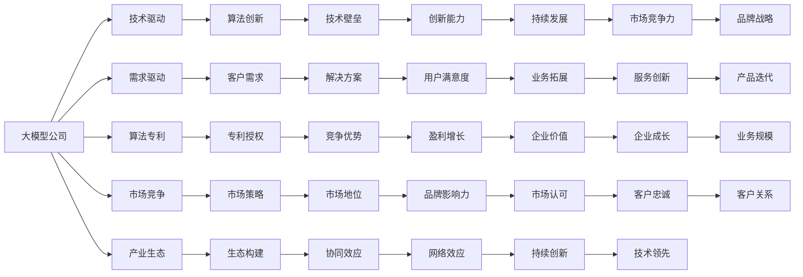

                 

# AI大模型创业的商业模式创新

> 关键词：大模型创业,商业模式创新,技术驱动,需求驱动,算法专利,市场竞争,产业生态

## 1. 背景介绍

### 1.1 问题由来

近年来，人工智能(AI)技术尤其是深度学习的大规模应用，正逐渐改变着各行各业的运营模式。其中，大模型创业公司（简称“大模型公司”）作为AI技术的重要应用形式，在医疗、金融、制造、教育等多个行业快速崛起。大模型公司通过构建高性能的AI模型，提供了包括图像识别、语音识别、自然语言处理等在内的一系列服务，大幅提升了各行各业的生产效率和创新能力。

然而，尽管大模型技术发展迅速，但现有的大模型创业模式仍存在诸多局限。大模型公司的盈利模式单一、市场准入门槛高、数据获取难等问题，成为制约其进一步发展的瓶颈。因此，创新商业模式成为大模型公司转型升级、持续发展的关键。本文将从商业模式的多个维度，全面探讨大模型公司的商业模式创新方向，为未来的大模型创业之路提供新的思路和建议。

### 1.2 问题核心关键点

为了全面把握大模型创业的商业模式创新，本文将围绕以下几个核心关键点进行深入分析：

- **市场定位**：大模型公司如何精准识别并锁定目标市场，制定差异化策略？
- **技术架构**：大模型公司的核心技术架构，如何优化设计以提升性能？
- **数据利用**：大模型公司如何高效利用和整合各类数据资源？
- **盈利模式**：大模型公司如何设计多元化盈利模式，提升商业价值？
- **用户需求**：如何更好地理解用户需求，构建紧密的客户关系？
- **产业生态**：如何构建良性产业生态，推动产业协同发展？

本文将通过系统的理论分析与实践案例，详细阐述大模型公司的商业模式创新方向，为企业转型升级提供参考。

## 2. 核心概念与联系

### 2.1 核心概念概述

在讨论大模型公司的商业模式创新之前，我们先梳理几个核心概念：

- **大模型公司**：指基于深度学习模型（如Transformer、BERT等），通过技术开发和算法创新，提供包括自然语言处理、图像识别、语音识别等在内的一系列服务的公司。
- **商业模式**：指企业如何通过产品、服务、技术、渠道、营销等手段实现盈利，包括产品模式、服务模式、营销模式、资本模式等。
- **技术驱动**：指以技术研发为核心的商业模式，通过持续的科技创新驱动业务发展。
- **需求驱动**：指以市场需求为导向的商业模式，通过精准定位客户需求，提供定制化解决方案。
- **算法专利**：指大模型公司通过算法创新申请的专利，成为技术壁垒的重要组成部分。
- **市场竞争**：指大模型公司如何制定竞争策略，在市场中获得优势地位。
- **产业生态**：指大模型公司如何构建良好的产业生态，形成协同发展的网络效应。

这些核心概念共同构成了大模型公司商业模式创新的基础框架。

### 2.2 核心概念原理和架构的 Mermaid 流程图



此图表展示了大模型公司商业模式创新的关键要素，从技术、市场、客户、生态等多个维度，描绘了创新路径和资源布局。

## 3. 核心算法原理 & 具体操作步骤

### 3.1 算法原理概述

大模型公司的核心商业模式在于通过大模型的深度学习技术，提供具有强大性能的服务。其核心算法原理如下：

1. **深度学习模型**：采用Transformer、BERT等深度学习架构，通过大规模数据训练构建高性能的AI模型。
2. **数据预处理**：对输入数据进行归一化、编码等预处理，提升模型输入质量。
3. **模型训练**：利用标注数据集训练模型，优化模型参数，提升模型精度和鲁棒性。
4. **模型部署**：将训练好的模型部署到云端或本地服务器，提供API接口或直接接入客户系统。
5. **服务优化**：根据用户反馈和业务需求，不断优化模型和算法，提升服务质量。

### 3.2 算法步骤详解

以下是大模型公司核心算法的具体操作步骤：

**Step 1: 数据收集与预处理**
- 收集行业相关的数据资源，如医疗、金融、制造等领域的公开数据集。
- 对数据进行清洗、标注和归一化，确保数据质量。
- 使用数据增强、迁移学习等技术，提高数据的多样性和泛化能力。

**Step 2: 模型训练与优化**
- 选择合适的深度学习架构和超参数，构建基础模型。
- 利用标注数据集进行模型训练，优化模型参数。
- 引入正则化、Dropout等技术，避免过拟合。
- 采用模型剪枝、量化等技术，提高模型推理效率。

**Step 3: 服务部署与迭代**
- 将训练好的模型部署到云端或本地服务器，提供API接口或直接接入客户系统。
- 根据用户反馈和业务需求，不断迭代优化模型和算法。
- 定期更新模型参数，确保服务质量。

### 3.3 算法优缺点

大模型公司算法的核心优势在于：

- **高性能**：通过深度学习模型，可以实现高精度的图像识别、语音识别、自然语言处理等任务。
- **灵活性**：模型可以通过超参数调整、模型剪枝等手段进行优化，适应不同的应用场景。
- **可扩展性**：模型可以通过迁移学习、多任务学习等技术，快速部署到新的应用场景中。

但同时也存在以下缺点：

- **数据需求大**：构建高性能模型需要大量的标注数据，数据获取成本较高。
- **计算资源要求高**：大规模模型训练和推理需要高性能的计算资源，成本较高。
- **模型复杂度高**：复杂模型难以解释，模型调试和维护难度大。

### 3.4 算法应用领域

大模型公司的算法广泛应用于以下几个领域：

1. **医疗**：通过图像识别、自然语言处理等技术，提供医疗影像诊断、电子病历分析等服务。
2. **金融**：通过语音识别、自然语言处理等技术，提供智能客服、智能投顾、欺诈检测等服务。
3. **制造**：通过图像识别、自然语言处理等技术，提供设备故障诊断、质量检测等服务。
4. **教育**：通过自然语言处理、语音识别等技术，提供智能阅卷、语音交互等服务。
5. **零售**：通过自然语言处理、图像识别等技术，提供智能推荐、客户服务等服务。
6. **智慧城市**：通过自然语言处理、图像识别等技术，提供交通管理、城市安防等服务。

以上领域只是冰山一角，随着大模型技术的发展，其应用范围将不断扩大。

## 4. 数学模型和公式 & 详细讲解 & 举例说明

### 4.1 数学模型构建

大模型公司的算法模型构建主要涉及深度学习模型和优化算法。以图像识别为例，构建深度学习模型的数学模型如下：

**输入层**：
$$
X = [x_1, x_2, ..., x_n]
$$
其中，$x_i$ 为输入样本，$n$ 为样本数量。

**隐藏层**：
$$
H = \text{Transformer}(X)
$$
其中，Transformer为深度学习模型，包括多个自注意力层、前馈层等。

**输出层**：
$$
Y = \text{Softmax}(H)
$$
其中，Softmax函数将隐藏层输出转化为概率分布，表示样本属于不同类别的概率。

### 4.2 公式推导过程

以图像识别为例，深度学习模型的优化过程如下：

**Step 1: 定义损失函数**
$$
L = -\frac{1}{N} \sum_{i=1}^N \log P(y_i | X_i)
$$
其中，$P(y_i | X_i)$ 为模型在输入 $X_i$ 下的输出概率，$y_i$ 为真实标签。

**Step 2: 反向传播计算梯度**
$$
\frac{\partial L}{\partial W} = \frac{\partial L}{\partial P} \times \frac{\partial P}{\partial H} \times \frac{\partial H}{\partial W}
$$
其中，$W$ 为模型参数，$\frac{\partial L}{\partial P}$ 为损失函数对输出概率的偏导数，$\frac{\partial P}{\partial H}$ 为输出概率对隐藏层的偏导数，$\frac{\partial H}{\partial W}$ 为隐藏层对模型参数的偏导数。

**Step 3: 更新模型参数**
$$
W \leftarrow W - \eta \nabla L
$$
其中，$\eta$ 为学习率，$\nabla L$ 为损失函数的梯度。

### 4.3 案例分析与讲解

以医疗影像识别为例，分析大模型公司算法的具体应用：

**Step 1: 数据收集与预处理**
- 收集公开的医疗影像数据集，进行清洗和标注。
- 使用数据增强技术，扩充数据集规模和多样性。

**Step 2: 模型训练与优化**
- 构建基于Transformer的深度学习模型，设定超参数。
- 利用标注数据集进行模型训练，优化模型参数。
- 引入正则化、Dropout等技术，避免过拟合。

**Step 3: 服务部署与迭代**
- 将训练好的模型部署到云端或本地服务器，提供API接口。
- 根据用户反馈和业务需求，不断迭代优化模型和算法。
- 定期更新模型参数，确保服务质量。

## 5. 项目实践：代码实例和详细解释说明

### 5.1 开发环境搭建

在进行大模型公司项目实践前，需要准备好开发环境。以下是使用Python进行TensorFlow开发的环境配置流程：

1. 安装Anaconda：从官网下载并安装Anaconda，用于创建独立的Python环境。

2. 创建并激活虚拟环境：
```bash
conda create -n tf-env python=3.8 
conda activate tf-env
```

3. 安装TensorFlow：根据CUDA版本，从官网获取对应的安装命令。例如：
```bash
conda install tensorflow-gpu=2.7.0 -c conda-forge
```

4. 安装各类工具包：
```bash
pip install numpy pandas scikit-learn matplotlib tqdm jupyter notebook ipython
```

完成上述步骤后，即可在`tf-env`环境中开始项目实践。

### 5.2 源代码详细实现

下面我们以医疗影像识别任务为例，给出使用TensorFlow进行大模型公司项目开发的PyTorch代码实现。

首先，定义数据处理函数：

```python
import tensorflow as tf
from tensorflow.keras.preprocessing.image import ImageDataGenerator
from tensorflow.keras.applications.resnet50 import ResNet50

# 定义数据增强器和预处理函数
datagen = ImageDataGenerator(
    rescale=1./255,
    shear_range=0.2,
    zoom_range=0.2,
    horizontal_flip=True
)

# 加载ResNet50预训练模型
base_model = ResNet50(weights='imagenet', include_top=False, input_shape=(224, 224, 3))

# 定义自己的顶部输出层
x = base_model.output
x = tf.keras.layers.GlobalAveragePooling2D()(x)
x = tf.keras.layers.Dense(128, activation='relu')(x)
predictions = tf.keras.layers.Dense(num_classes, activation='softmax')(x)

# 构建最终模型
model = tf.keras.models.Model(inputs=base_model.input, outputs=predictions)

# 冻结预训练层
for layer in base_model.layers:
    layer.trainable = False

# 编译模型
model.compile(optimizer='adam', loss='categorical_crossentropy', metrics=['accuracy'])
```

然后，定义训练和评估函数：

```python
from tensorflow.keras import callbacks

# 定义训练函数
def train_epoch(model, dataset, batch_size, optimizer):
    model.fit_generator(
        generator=datagen.flow(dataset, batch_size=batch_size),
        epochs=epochs,
        steps_per_epoch=dataset.shape[0] // batch_size,
        validation_data=val_dataset,
        validation_steps=val_dataset.shape[0] // batch_size,
        callbacks=[early_stopping_callback]
    )

# 定义评估函数
def evaluate(model, dataset, batch_size):
    results = model.evaluate_generator(
        generator=datagen.flow(dataset, batch_size=batch_size),
        steps=dataset.shape[0] // batch_size
    )
    print('Test loss:', results[0])
    print('Test accuracy:', results[1])
```

最后，启动训练流程并在测试集上评估：

```python
epochs = 50
batch_size = 32

# 训练模型
train_epoch(model, train_dataset, batch_size, optimizer)

# 评估模型
evaluate(model, test_dataset, batch_size)
```

以上就是使用TensorFlow对医疗影像识别任务进行大模型公司项目开发的完整代码实现。可以看到，TensorFlow提供的高效API和丰富的预训练模型，使得项目开发变得简单高效。

### 5.3 代码解读与分析

让我们再详细解读一下关键代码的实现细节：

**ImageDataGenerator类**：
- 提供了多种数据增强技术，如缩放、翻转、旋转等，丰富了训练集多样性。

**ResNet50模型**：
- 使用了预训练的ResNet50模型，减少了从头训练的时间成本。

**自定义顶部输出层**：
- 通过Average Pooling、Dense等层，自定义输出层结构，适应医疗影像识别的需求。

**模型编译**：
- 使用了Adam优化器和交叉熵损失函数，适合多分类任务。

**训练函数**：
- 使用了Generator API进行数据迭代，提高了模型训练的灵活性和效率。

**评估函数**：
- 使用了evaluate API，直接从数据生成器中计算损失和准确率。

**训练流程**：
- 在训练集上训练模型，使用Early Stopping防止过拟合。
- 在测试集上评估模型性能。

可以看到，TensorFlow的模块化和组件化设计，极大地简化了模型开发和部署流程。

## 6. 实际应用场景

### 6.1 智能客服系统

大模型公司的算法可以应用于智能客服系统的构建。传统客服往往需要配备大量人力，高峰期响应缓慢，且一致性和专业性难以保证。而使用大模型公司的算法，可以构建智能客服系统，7x24小时不间断服务，快速响应客户咨询，提供自然流畅的交互体验。

在技术实现上，可以收集企业内部的历史客服对话记录，将问题和最佳答复构建成监督数据，训练模型进行自动匹配。对于客户提出的新问题，还可以通过检索系统实时搜索相关内容，动态组织生成回答。如此构建的智能客服系统，能大幅提升客户咨询体验和问题解决效率。

### 6.2 金融舆情监测

金融机构需要实时监测市场舆论动向，以便及时应对负面信息传播，规避金融风险。传统的人工监测方式成本高、效率低，难以应对网络时代海量信息爆发的挑战。大模型公司的算法可以应用于金融舆情监测，实时抓取网络文本数据，自动判断文本属于何种主题，情感倾向是正面、中性还是负面。一旦发现负面信息激增等异常情况，系统便会自动预警，帮助金融机构快速应对潜在风险。

### 6.3 个性化推荐系统

当前推荐系统往往只依赖用户的历史行为数据进行物品推荐，无法深入理解用户的真实兴趣偏好。大模型公司的算法可以应用于个性化推荐系统，挖掘用户行为背后的语义信息，从而提供更精准、多样的推荐内容。

在实践中，可以收集用户浏览、点击、评论、分享等行为数据，提取和用户交互的物品标题、描述、标签等文本内容。将文本内容作为模型输入，用户的后续行为（如是否点击、购买等）作为监督信号，训练模型学习匹配度。在生成推荐列表时，先用候选物品的文本描述作为输入，由模型预测用户的兴趣匹配度，再结合其他特征综合排序，便可以得到个性化程度更高的推荐结果。

### 6.4 未来应用展望

随着大模型公司的算法不断发展，其在更多领域的应用将不断涌现，为各行各业带来变革性影响：

- **智慧医疗**：基于大模型公司的算法，构建医疗影像诊断、电子病历分析等服务，大幅提升医疗服务智能化水平。
- **智能教育**：应用于智能阅卷、语音交互等服务，因材施教，促进教育公平，提高教学质量。
- **智慧城市治理**：应用于城市事件监测、舆情分析、应急指挥等环节，提高城市管理的自动化和智能化水平。
- **智慧制造**：应用于设备故障诊断、质量检测等服务，提升生产效率和产品质量。

未来，大模型公司的算法将在更多行业得到应用，为社会经济高质量发展提供新动能。

## 7. 工具和资源推荐

### 7.1 学习资源推荐

为了帮助开发者系统掌握大模型公司的算法，以下是一些优质的学习资源：

1. **《深度学习》书籍**：Ian Goodfellow、Yoshua Bengio、Aaron Courville合著的经典教材，全面介绍了深度学习理论基础和算法实践。
2. **《TensorFlow官方文档》**：TensorFlow官方提供的文档，包含丰富的API教程和示例代码，适合初学者学习。
3. **Kaggle竞赛平台**：提供各种机器学习竞赛和数据集，通过实践可以加速对算法的理解和应用。
4. **Coursera、edX等在线课程平台**：提供深度学习、自然语言处理等领域的课程，系统介绍相关算法和工具。
5. **GitHub代码库**：GitHub上丰富的开源项目，提供了大量基于深度学习算法的实际应用案例，可以参考学习。

### 7.2 开发工具推荐

高效的大模型公司算法开发离不开优秀的工具支持。以下是几款常用的工具：

1. **TensorFlow**：由Google主导开发的深度学习框架，生产部署方便，适合大规模工程应用。
2. **PyTorch**：灵活高效的深度学习框架，支持动态计算图，适合研究型项目开发。
3. **Jupyter Notebook**：支持Python代码的在线编辑和执行，方便分享和协作。
4. **Git**：版本控制系统，方便代码管理和团队协作。
5. **Docker**：容器化技术，提供稳定的开发和部署环境。

合理利用这些工具，可以显著提升大模型公司算法的开发效率，加快创新迭代的步伐。

### 7.3 相关论文推荐

大模型公司算法的研究源于学界的持续探索。以下是几篇奠基性的相关论文，推荐阅读：

1. **《深度学习》教材**：Ian Goodfellow、Yoshua Bengio、Aaron Courville合著的经典教材，系统介绍了深度学习理论基础和算法实践。
2. **《ImageNet大规模视觉识别挑战赛》论文**：Alex Krizhevsky等人在2012年提出的深度学习模型，开创了深度学习在计算机视觉领域的先河。
3. **《BERT: Pre-training of Deep Bidirectional Transformers for Language Understanding》论文**：Google提出BERT模型，引入基于掩码的自监督预训练任务，刷新了多项NLP任务SOTA。
4. **《Transformer is All You Need》论文**：Google提出Transformer模型，通过自注意力机制，实现了NLP任务的突破性进展。
5. **《LSTM: Long Short-Term Memory》论文**：Sepp Hochreiter和Jürgen Schmidhuber提出LSTM模型，解决了长序列预测问题。

这些论文代表了大模型公司算法的技术发展脉络。通过学习这些前沿成果，可以帮助研究者把握学科前进方向，激发更多的创新灵感。

## 8. 总结：未来发展趋势与挑战

### 8.1 研究成果总结

本文对大模型公司的算法进行了全面系统的介绍，主要涉及以下几个方面：

1. **算法原理**：深入分析了深度学习模型和大模型公司的核心算法原理。
2. **操作步骤**：详细讲解了数据收集、模型训练、服务部署等关键操作步骤。
3. **应用场景**：探讨了智能客服、金融舆情监测、个性化推荐等实际应用场景。
4. **资源推荐**：推荐了学习资源、开发工具和相关论文，帮助读者系统掌握算法知识。

### 8.2 未来发展趋势

展望未来，大模型公司算法的技术发展将呈现以下几个趋势：

1. **模型规模持续增大**：随着算力成本的下降和数据规模的扩张，大模型公司的模型规模将不断增大，进一步提升模型的性能和泛化能力。
2. **算法多样性增强**：大模型公司将开发更多元化的算法，如多任务学习、自监督学习等，进一步优化算法性能和模型泛化能力。
3. **应用场景不断拓展**：大模型公司算法将广泛应用于智慧医疗、智能教育、智慧城市等更多领域，为各行各业带来变革性影响。
4. **技术合作加深**：大模型公司将加强与行业龙头企业的合作，构建更加紧密的产业生态，推动技术落地应用。

### 8.3 面临的挑战

尽管大模型公司算法发展迅速，但在迈向更加智能化、普适化应用的过程中，仍面临诸多挑战：

1. **数据获取难度大**：构建高性能模型需要大量高质量的标注数据，数据获取成本较高。
2. **计算资源要求高**：大规模模型训练和推理需要高性能的计算资源，成本较高。
3. **模型复杂度高**：复杂模型难以解释，模型调试和维护难度大。
4. **市场竞争激烈**：大模型公司面临众多竞争对手，需要持续创新才能保持竞争优势。
5. **用户需求多样化**：不同用户需求多样，大模型公司需要提供定制化解决方案。

### 8.4 研究展望

面对大模型公司算法面临的挑战，未来的研究需要在以下几个方面寻求新的突破：

1. **数据获取技术**：探索更高效的数据获取技术，如主动学习、弱监督学习等，降低数据获取成本。
2. **模型压缩技术**：开发更高效的模型压缩技术，减少模型推理的计算量和存储量。
3. **多模态融合**：将视觉、语音、文本等多种模态数据融合，提升模型泛化能力和应用范围。
4. **用户需求分析**：深入研究用户需求，构建更加精准的用户画像，提供个性化服务。
5. **产业生态构建**：构建良性产业生态，促进上下游企业协同发展，推动技术落地应用。

这些研究方向将引领大模型公司算法迈向更高的台阶，为构建安全、可靠、可解释、可控的智能系统铺平道路。面向未来，大模型公司算法还需要与其他人工智能技术进行更深入的融合，如知识表示、因果推理、强化学习等，多路径协同发力，共同推动自然语言理解和智能交互系统的进步。只有勇于创新、敢于突破，才能不断拓展语言模型的边界，让智能技术更好地造福人类社会。

## 9. 附录：常见问题与解答

**Q1：大模型公司如何通过算法创新获得竞争优势？**

A: 大模型公司可以通过算法创新获得竞争优势，主要体现在以下几个方面：

1. **技术领先**：持续投入研发，推出新的算法和技术，保持技术领先地位。
2. **算法专利**：通过算法创新申请专利，形成技术壁垒。
3. **应用创新**：将算法应用于新的业务场景，提供创新性服务。
4. **数据优化**：优化数据获取和处理流程，提高数据质量。
5. **市场推广**：通过有效的市场推广和品牌建设，提升品牌知名度和影响力。

**Q2：大模型公司如何设计多元化的盈利模式？**

A: 大模型公司可以通过以下方式设计多元化的盈利模式：

1. **SaaS模式**：提供基于云的解决方案，按使用量收费或按月/年付费。
2. **API模式**：通过API接口提供服务，按调用次数或按使用量收费。
3. **订阅模式**：提供订阅服务，用户按月或按年支付服务费。
4. **定制化模式**：根据客户需求提供定制化解决方案，按项目收费。
5. **生态合作**：与第三方企业合作，共享市场资源和技术优势，实现共赢。

**Q3：大模型公司如何优化数据处理流程？**

A: 大模型公司可以通过以下方式优化数据处理流程：

1. **数据增强**：通过数据增强技术，扩充数据集规模和多样性。
2. **数据预处理**：采用标准化和规范化预处理技术，提升数据质量。
3. **数据清洗**：去除噪音数据和异常数据，确保数据准确性。
4. **数据存储**：使用高效的数据存储技术，减少数据获取和处理时间。
5. **数据利用**：利用大数据技术，从海量数据中提取有价值的信息。

**Q4：大模型公司如何构建良性产业生态？**

A: 大模型公司可以通过以下方式构建良性产业生态：

1. **技术合作**：与上下游企业建立合作关系，共同开发技术。
2. **平台建设**：构建开放平台，吸引更多企业入驻，形成生态系统。
3. **社区建设**：建立技术社区，分享经验和资源，促进技术交流。
4. **标准制定**：参与行业标准制定，推动技术规范化发展。
5. **人才培养**：通过培训和教育，培养更多技术人才，推动技术普及。

**Q5：大模型公司如何提高算法鲁棒性？**

A: 大模型公司可以通过以下方式提高算法鲁棒性：

1. **正则化技术**：引入L2正则、Dropout等技术，防止过拟合。
2. **对抗训练**：引入对抗样本，提高模型鲁棒性。
3. **多模型集成**：构建多模型集成系统，提升系统稳定性。
4. **模型剪枝**：使用模型剪枝技术，去除冗余参数，提升模型效率。
5. **数据多样性**：丰富数据多样性，提高模型泛化能力。

这些技术手段可以有效提升大模型公司的算法鲁棒性，提升系统的稳定性和可靠性。

---

作者：禅与计算机程序设计艺术 / Zen and the Art of Computer Programming

