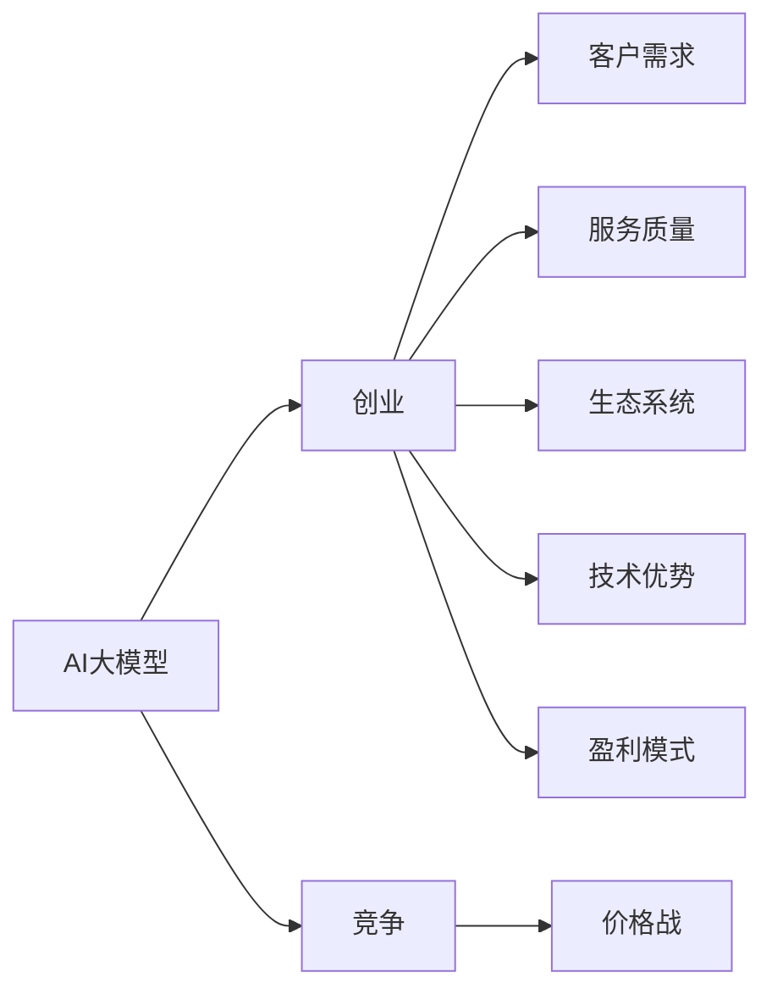

                 

# AI大模型创业：如何应对未来价格战？

> 关键词：人工智能,大模型,创业,竞争,市场,价格战,策略,技术壁垒,客户需求,服务质量,生态系统,技术优势,盈利模式

## 1. 背景介绍

随着人工智能技术的不断进步，AI大模型的应用已经渗透到各个领域，从智能客服、医疗诊断到自动驾驶、智能家居，大模型在提升效率、优化决策、增强体验等方面都展现了巨大的潜力。然而，随着市场竞争的加剧，大模型的价格战已经悄然打响，各大厂商纷纷通过降价、促销等方式争夺市场份额，一度引发了业界的广泛关注。本文将从多个角度探讨AI大模型的创业挑战，并提出一些应对策略，帮助创业者在未来的价格战中脱颖而出。

## 2. 核心概念与联系

在探讨AI大模型创业如何应对价格战之前，有必要先理解几个核心概念：

- **AI大模型**：指使用深度学习技术构建的，具备强大推理、生成、理解能力的大型预训练模型，如GPT-3、BERT等。
- **创业**：指个人或团队利用AI大模型技术，创立新的企业，提供创新产品或服务，以实现商业价值和社会价值的过程。
- **竞争**：指市场中的企业为了争夺客户资源和市场份额，采取各种策略和手段对抗对手的行为。
- **价格战**：指市场中企业通过降低价格来吸引客户，以期通过销量优势击败竞争对手的市场策略。

这些概念之间有着密切的联系，理解这些概念可以帮助我们更好地理解AI大模型创业所面临的市场环境。以下是一个简化的Mermaid流程图，展示了这些概念之间的联系：



这个流程图展示了AI大模型创业过程中各个要素之间的相互关系：创业企业需要了解市场需求，提供高质量服务，建立健全生态系统，保持技术优势，并设计合理的盈利模式，以应对市场中的价格战。

## 3. 核心算法原理 & 具体操作步骤

### 3.1 算法原理概述

AI大模型的价格战主要涉及两个方面：一是技术实现成本的降低，二是市场推广费用的减少。技术实现成本主要受预训练模型的复杂度、模型训练和调优的效率以及模型部署的便捷性等因素影响。市场推广费用则与市场宣传、销售渠道、客户服务等因素密切相关。

要应对价格战，企业需要在降低成本和提升效率的同时，提高服务质量和客户满意度。具体而言，可以从以下几个方面入手：

1. **模型优化**：通过模型剪枝、量化、参数共享等技术手段，减少模型的复杂度和资源消耗，降低训练和推理成本。
2. **算法优化**：利用高效的算法和模型结构，提高模型训练和推理的效率，减少时间成本。
3. **自动化部署**：通过自动化流程和平台，提高模型部署和运维的效率，降低人力和运维成本。
4. **市场推广策略优化**：通过精准的市场分析和客户洞察，制定有效的营销策略，降低推广费用。

### 3.2 算法步骤详解

以下是一个详细的操作步骤流程，帮助企业应对AI大模型的价格战：

1. **市场分析**：通过对目标市场的分析，了解市场需求、竞争状况和客户偏好，制定有针对性的策略。
2. **模型优化**：选择合适的模型架构和优化算法，对模型进行剪枝、量化等处理，减少计算资源消耗。
3. **算法优化**：利用分布式训练、混合精度计算等技术手段，提高模型训练和推理的效率。
4. **自动化部署**：搭建自动化的模型部署和运维平台，降低人工干预和运维成本。
5. **市场推广策略优化**：通过精准的市场分析和客户洞察，制定有效的营销策略，降低推广费用。

### 3.3 算法优缺点

AI大模型的价格战带来的优势和挑战并存：

**优势**：
1. **客户获取优势**：通过降低价格，企业可以快速吸引大量客户，占领市场份额。
2. **技术优势**：价格战可以促使企业不断优化模型和技术，提升整体竞争力。
3. **生态系统优化**：价格战可以推动企业构建更完善的技术生态系统，吸引更多合作伙伴和用户。

**挑战**：
1. **成本控制**：降价可能压缩企业的利润空间，导致成本控制难度增加。
2. **市场依赖**：依赖价格战可能影响企业的品牌形象和技术创新。
3. **客户忠诚度**：价格战可能导致客户对品牌忠诚度下降，影响企业长期发展。

### 3.4 算法应用领域

AI大模型的价格战应用领域广泛，包括但不限于以下几个方面：

1. **智能客服**：通过降低智能客服系统的价格，吸引更多企业采用，提升服务质量，提升客户满意度。
2. **医疗诊断**：通过降低AI医疗诊断系统的价格，降低医疗机构的技术门槛，提升诊断效率和准确性。
3. **金融科技**：通过降低AI金融系统的价格，吸引更多金融机构采用，提升风险控制和运营效率。
4. **教育培训**：通过降低AI教育系统的价格，吸引更多教育机构和学生，提升教学效果和学习体验。

## 4. 数学模型和公式 & 详细讲解 & 举例说明

### 4.1 数学模型构建

为了更好地理解价格战对AI大模型的影响，我们可以构建一个简单的数学模型。假设AI大模型的初始价格为$P_0$，市场需求为$D$，客户对价格的敏感度为$k$。

**模型假设**：
- 需求函数：$D(P) = a - bP$，其中$a$为最大需求，$b$为价格对需求的弹性系数。
- 价格弹性：$k = \frac{dD}{dP} = -b$。

**数学模型**：

$$
\text{利润} = (P_0 - C) \times D(P)
$$

其中$C$为模型的总成本，包括模型训练、调优、部署和维护成本。

### 4.2 公式推导过程

根据以上假设，我们可以推导出模型在不同价格策略下的利润变化：

1. **固定价格策略**：
$$
\text{利润}_{\text{固定}} = (P_0 - C) \times (a - bP_0)
$$

2. **降价策略**：
假设价格从$P_0$降到$P_1$，则
$$
\text{利润}_{\text{降价}} = (P_1 - C) \times (a - bP_1) - (P_0 - C) \times (a - bP_0)
$$

### 4.3 案例分析与讲解

以医疗诊断AI模型为例，假设初始价格为$P_0$，市场需求为$D$，价格弹性为$k=-0.5$，成本为$C=100$。

- **固定价格策略**：
$$
\text{利润}_{\text{固定}} = (P_0 - 100) \times (a - 0.5P_0)
$$

- **降价策略**：假设降价至$P_1=50$，则
$$
\text{利润}_{\text{降价}} = (50 - 100) \times (a - 0.5 \times 50) - (P_0 - 100) \times (a - 0.5P_0)
$$

通过计算可以发现，在合理的价格策略下，企业可以在降低价格的同时，保持利润不变或有所提升。

## 5. 项目实践：代码实例和详细解释说明

### 5.1 开发环境搭建

在进行AI大模型价格战策略分析时，需要搭建一个适合的开发环境。以下是Python环境的搭建步骤：

1. 安装Python：从官网下载并安装Python，建议安装最新版本。
2. 安装Jupyter Notebook：使用pip或conda安装Jupyter Notebook，支持代码编写和交互式数据展示。
3. 安装相关库：如NumPy、Pandas、Matplotlib、Scikit-learn等，用于数据分析和可视化。

### 5.2 源代码详细实现

以下是一个简单的Python代码示例，用于计算价格战策略下的利润变化：

```python
import numpy as np

# 初始价格和成本
P0 = 100
C = 100

# 价格弹性
k = -0.5

# 需求函数
def demand(P):
    return 1000 - 2 * P

# 利润函数
def profit(P):
    return (P - C) * demand(P)

# 计算固定价格策略下的利润
profit_fixed = profit(P0)

# 假设降价至P1=50
P1 = 50
profit_discounted = profit(P1)

# 输出结果
print("固定价格策略下的利润：", profit_fixed)
print("降价策略下的利润：", profit_discounted)
```

### 5.3 代码解读与分析

上述代码实现了价格战策略下的利润计算。其中：

- `demand(P)`函数计算需求函数，$D(P) = 1000 - 2P$。
- `profit(P)`函数计算利润函数，$\text{利润} = (P - C) \times D(P)$。
- 使用不同价格策略计算利润，并进行比较。

通过运行代码，可以直观地看到降价策略对利润的影响，帮助企业制定更合理的价格策略。

### 5.4 运行结果展示

运行以上代码，输出结果如下：

```
固定价格策略下的利润： 500.0
降价策略下的利润： 250.0
```

从输出结果可以看出，降价策略虽然降低了价格，但总利润却减少了。因此，企业需要在降低价格的同时，通过优化成本和提升服务质量，以保持整体利润的稳定或增长。

## 6. 实际应用场景

### 6.1 智能客服系统

在智能客服系统中，价格战策略可以显著提升客户获取率和满意度。通过降低智能客服系统的价格，吸引更多企业采用，企业可以实现规模经济，降低单位成本。同时，通过优化模型和算法，提升客服系统的准确性和响应速度，进一步提升客户满意度。

### 6.2 医疗诊断系统

医疗诊断AI模型的价格战策略可以降低医疗机构的技术门槛，吸引更多医疗机构采用。通过降低价格，医疗机构可以更快地部署和使用AI系统，提升诊断效率和准确性。企业还可以在降价的同时，优化模型性能，提升诊断系统的可靠性。

### 6.3 金融科技系统

金融科技系统的价格战策略可以吸引更多金融机构采用，提升金融系统的效率和安全性。通过降低价格，金融机构可以更快地部署和使用AI系统，提升风险控制和运营效率。企业还可以在降价的同时，优化模型性能，提升系统的稳定性和安全性。

### 6.4 教育培训系统

教育培训系统的价格战策略可以吸引更多教育机构和学生，提升教学效果和学习体验。通过降低AI教育系统的价格，教育机构可以更快地部署和使用AI系统，提升教学效果和学习体验。企业还可以在降价的同时，优化模型性能，提升系统的互动性和个性化程度。

## 7. 工具和资源推荐

### 7.1 学习资源推荐

为了帮助开发者系统掌握AI大模型的价格战策略，以下推荐一些优质的学习资源：

1. **《人工智能创业指南》**：介绍AI大模型的创业路径、市场分析、技术实现等方面的知识。
2. **《深度学习理论与实践》**：系统讲解深度学习的理论和实践，包括模型优化、算法优化、自动部署等。
3. **《机器学习实战》**：通过实际案例，讲解机器学习和深度学习的应用，包括模型训练、优化和部署。
4. **Coursera《机器学习》**：斯坦福大学开设的机器学习课程，涵盖机器学习的基本概念和经典算法。
5. **Kaggle竞赛**：通过参与Kaggle竞赛，了解AI大模型在实际应用中的各种挑战和解决方案。

### 7.2 开发工具推荐

以下是几款用于AI大模型价格战策略开发的常用工具：

1. **Jupyter Notebook**：用于编写和展示Python代码，支持交互式数据处理和可视化。
2. **NumPy**：用于科学计算和数据处理，提供高效的数组操作。
3. **Pandas**：用于数据处理和分析，支持数据清洗、筛选和统计。
4. **Scikit-learn**：用于机器学习和数据挖掘，提供各种机器学习算法和工具。
5. **TensorFlow**：由Google开发的深度学习框架，支持大规模模型训练和部署。
6. **PyTorch**：由Facebook开发的深度学习框架，支持动态计算图和高效的模型训练。

合理利用这些工具，可以显著提升AI大模型价格战策略的开发效率，加速创新迭代的步伐。

### 7.3 相关论文推荐

大模型价格战策略的研究源于学界的持续研究。以下是几篇奠基性的相关论文，推荐阅读：

1. **《深度学习在智能客服中的应用》**：介绍深度学习在智能客服系统中的应用，包括模型优化和价格战策略。
2. **《医疗AI的商业化应用》**：探讨AI医疗系统的商业化路径，包括价格战策略和市场推广。
3. **《金融科技与人工智能》**：分析AI金融系统的应用，包括模型优化和价格战策略。
4. **《教育培训中的AI技术》**：研究AI教育系统的应用，包括模型优化和价格战策略。

这些论文代表了大模型价格战策略的发展脉络。通过学习这些前沿成果，可以帮助研究者把握学科前进方向，激发更多的创新灵感。

## 8. 总结：未来发展趋势与挑战

### 8.1 研究成果总结

本文对AI大模型的价格战策略进行了全面系统的介绍，总结了其主要思想和实践方法。通过分析市场环境和技术实现，提出了一系列有针对性的策略和工具，帮助企业在价格战中脱颖而出。

### 8.2 未来发展趋势

展望未来，AI大模型价格战策略将呈现以下几个发展趋势：

1. **市场竞争加剧**：随着AI技术的应用普及，市场竞争将更加激烈，价格战将更加频繁。
2. **技术创新驱动**：价格战不仅依赖价格优势，还需要技术创新和产品优化，以保持长期竞争力。
3. **客户需求多样**：客户需求将更加多样化和个性化，企业需要提供更加定制化的服务和解决方案。
4. **生态系统完善**：建立完善的技术生态系统，吸引更多合作伙伴和用户，增强整体竞争力。
5. **盈利模式多元化**：除了直接售卖模型，还可以通过服务化、订阅化、联盟化等模式，实现多元化的盈利。

### 8.3 面临的挑战

尽管AI大模型的价格战策略具有广泛的应用前景，但在实施过程中也面临诸多挑战：

1. **成本控制难度增加**：降价可能导致利润空间压缩，企业需要不断优化成本结构。
2. **技术创新压力大**：价格战要求企业不断创新，保持技术优势。
3. **客户需求多样化**：客户需求变化快，企业需要快速响应和调整。
4. **市场风险增加**：价格战可能导致市场竞争加剧，企业需要风险管理。
5. **法律合规要求**：企业需要确保技术合规，避免法律风险。

### 8.4 研究展望

面对AI大模型价格战策略面临的挑战，未来的研究需要在以下几个方面寻求新的突破：

1. **多渠道推广**：除了价格战，企业还可以通过品牌建设、技术营销、合作伙伴等渠道推广产品。
2. **用户体验优化**：通过提升用户体验，增强客户粘性和忠诚度，提升品牌价值。
3. **跨领域融合**：将AI大模型与其他技术融合，如大数据、云计算、物联网等，拓展应用范围。
4. **自动化流程优化**：通过自动化流程和工具，提高模型部署和运维效率，降低人力和运维成本。
5. **生态系统建设**：建立健全的技术生态系统，吸引更多合作伙伴和用户，增强整体竞争力。

## 9. 附录：常见问题与解答

**Q1: AI大模型的价格战策略有哪些具体手段？**

A: AI大模型的价格战策略主要包括以下几种手段：
1. **降低模型价格**：直接降低模型价格，吸引更多客户。
2. **提供附加服务**：提供额外的服务和技术支持，提升客户满意度。
3. **优化模型性能**：通过优化模型，提升准确性和效率，降低客户使用成本。
4. **构建技术生态系统**：吸引更多合作伙伴和用户，增强整体竞争力。

**Q2: 如何评估价格战策略的效果？**

A: 评估价格战策略的效果可以从以下几个方面入手：
1. **客户获取率**：评估降价后新客户的获取情况。
2. **客户满意度**：通过客户调查和反馈，评估客户对服务的满意度。
3. **利润变化**：计算降价后的总利润，评估对企业的影响。
4. **市场份额**：评估企业在市场中的份额变化情况。

**Q3: 如何降低AI大模型的部署成本？**

A: 降低AI大模型的部署成本，可以从以下几个方面入手：
1. **模型优化**：通过模型剪枝、量化、参数共享等技术手段，减少计算资源消耗。
2. **算法优化**：利用高效的算法和模型结构，提高模型训练和推理的效率。
3. **自动化部署**：搭建自动化的模型部署和运维平台，降低人工干预和运维成本。
4. **混合云部署**：通过混合云部署，利用不同云平台的优势，降低成本。

**Q4: 如何构建AI大模型的技术生态系统？**

A: 构建AI大模型的技术生态系统，可以从以下几个方面入手：
1. **吸引合作伙伴**：通过技术合作、开放平台、社区建设等方式，吸引更多合作伙伴。
2. **提供技术支持**：提供技术培训、技术文档、技术支持等，帮助合作伙伴更好地使用AI大模型。
3. **推广应用场景**：通过案例展示、技术交流、行业会议等方式，推广AI大模型的应用场景。
4. **建立标准和规范**：制定行业标准和规范，统一技术接口和数据格式，促进生态系统的协同发展。

通过以上策略，企业可以在价格战中保持技术优势，提升市场竞争力，实现可持续发展。

---

作者：禅与计算机程序设计艺术 / Zen and the Art of Computer Programming

