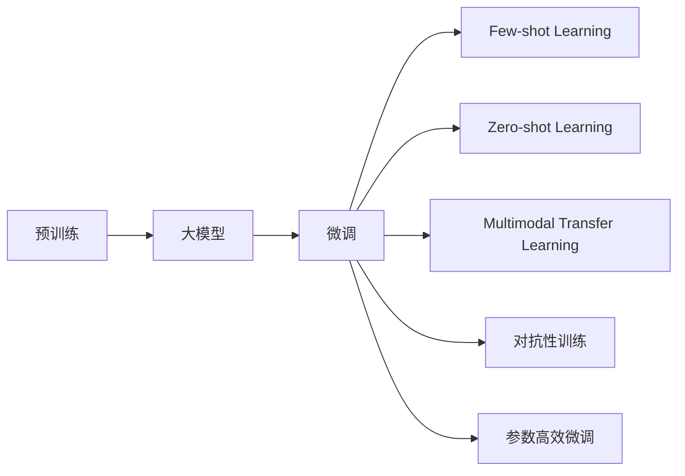

                 

# AI大模型创业：如何应对未来技术挑战？

> 关键词：人工智能, 创业, 大模型, 未来技术, 挑战, 解决方案

## 1. 背景介绍

在人工智能（AI）领域，大模型（Large Models）的崛起已经引发了一场革命。从预训练的语言模型到视觉大模型，大模型凭借其强大的学习能力和广泛的适用性，在各个行业领域逐步崭露头角。然而，随着技术的深入和应用的广泛，大模型也面临着一系列技术和市场挑战。本文将从背景、核心概念、算法原理和操作步骤、实际应用场景等多个方面，详细探讨如何应对未来的大模型创业技术挑战。

## 2. 核心概念与联系

### 2.1 核心概念概述

1. **大模型（Large Models）**：指具有数百亿参数的深度学习模型，如BERT、GPT、ViT等。这些模型通常在大规模无标签数据上预训练，并在特定任务上进行微调，以实现高精度的预测和推理能力。

2. **预训练（Pre-training）**：指在大规模无标签数据上对模型进行训练，使其学习到通用的语言或视觉表示。预训练是大模型性能提升的关键步骤。

3. **微调（Fine-tuning）**：在预训练的基础上，使用小规模标注数据对模型进行进一步训练，使其适应特定任务，如问答、文本生成等。微调是大模型广泛应用于下游任务的必要步骤。

4. **迁移学习（Transfer Learning）**：通过在大规模任务上预训练的模型，在小规模任务上进行微调，以实现知识迁移和性能提升。

5. **对抗性训练（Adversarial Training）**：在模型训练过程中引入对抗样本，提高模型的鲁棒性和泛化能力。

6. **参数高效微调（Parameter-Efficient Fine-tuning）**：仅微调模型中与任务相关的参数，减少计算资源消耗。

7. **少样本学习（Few-shot Learning）**：在大模型基础上，使用少量标注样本进行训练，实现快速适应新任务。

8. **零样本学习（Zero-shot Learning）**：无需任何标注数据，模型仅凭任务描述即可进行推理和生成。

### 2.2 核心概念原理和架构的 Mermaid 流程图



## 3. 核心算法原理 & 具体操作步骤

### 3.1 算法原理概述

大模型的预训练和微调过程基于监督学习。预训练阶段，模型通过无标签数据学习到通用的语言或视觉表示。在微调阶段，模型通过有标签数据学习特定任务的目标，实现对任务的高效适应。

### 3.2 算法步骤详解

#### 3.2.1 预训练阶段

1. **数据准备**：收集大规模无标签数据，如英文维基百科、大规模图像库等。
2. **模型选择**：选择适合的模型架构，如BERT、GPT、ViT等。
3. **训练**：在预训练数据集上进行训练，通常使用自监督任务，如语言建模、图像分类等。
4. **保存预训练权重**：保存训练得到的权重，用于后续微调。

#### 3.2.2 微调阶段

1. **数据准备**：收集特定任务的标注数据，如问答、文本生成等。
2. **模型加载**：加载预训练模型，使用其保存权重。
3. **任务适配**：根据特定任务，设计合适的输出层和损失函数。
4. **训练**：在标注数据集上训练模型，通常使用小批量梯度下降等优化算法。
5. **评估和调优**：使用验证集评估模型性能，进行超参数调整。
6. **测试和部署**：在测试集上评估模型性能，部署到实际应用中。

### 3.3 算法优缺点

**优点**：

1. **性能提升显著**：通过预训练和微调，大模型能在下游任务上获得显著的性能提升。
2. **数据需求相对较低**：相比于从头训练，微调需要较少的标注数据。
3. **适用性广**：适用于各类NLP、计算机视觉任务。

**缺点**：

1. **计算资源消耗大**：大模型通常需要强大的计算资源进行预训练和微调。
2. **过拟合风险高**：微调过程中，模型容易过拟合小规模训练数据。
3. **部署成本高**：实际应用中，大模型的部署和维护成本较高。

### 3.4 算法应用领域

大模型微调技术广泛应用于NLP、计算机视觉、语音识别等多个领域：

1. **NLP**：文本分类、问答、机器翻译、文本生成等。
2. **计算机视觉**：图像分类、目标检测、图像生成等。
3. **语音识别**：语音转文本、文本转语音、语音合成等。

## 4. 数学模型和公式 & 详细讲解

### 4.1 数学模型构建

以BERT微调为例，其基本框架如下：

1. **预训练阶段**：
   - 输入：无标签文本序列 $x$。
   - 输出：表示向量 $h$。
   - 损失函数：语言建模损失 $L_{\text{lm}}(h)$。

2. **微调阶段**：
   - 输入：标注数据 $(x, y)$。
   - 输出：任务特定表示 $h_{\text{task}}$。
   - 损失函数：任务损失 $L_{\text{task}}(h_{\text{task}}, y)$。

### 4.2 公式推导过程

1. **预训练阶段**：
   - 语言建模损失 $L_{\text{lm}}(h)$。
   - 表示为：$L_{\text{lm}}(h) = -\sum_{i=1}^{n} \log P(w_i | w_{i-1}, \dots, w_1)$。

2. **微调阶段**：
   - 任务损失 $L_{\text{task}}(h_{\text{task}}, y)$。
   - 表示为：$L_{\text{task}}(h_{\text{task}}, y) = -\sum_{i=1}^{N} \log P(y_i | h_{\text{task}}(x_i))$。

### 4.3 案例分析与讲解

以BERT微调进行情感分析为例：

1. **数据准备**：收集情感标注数据集。
2. **模型选择**：选择BERT模型。
3. **任务适配**：在顶层添加一个线性分类器，用于二分类任务。
4. **训练**：在标注数据集上使用小批量梯度下降训练。
5. **评估和调优**：在验证集上评估模型性能，调整学习率等超参数。
6. **测试和部署**：在测试集上评估模型性能，部署到实际应用中。

## 5. 项目实践：代码实例和详细解释说明

### 5.1 开发环境搭建

1. **安装Python**：使用Anaconda或Miniconda安装Python 3.8及以上版本。
2. **安装PyTorch**：使用pip安装PyTorch。
3. **安装Transformers库**：使用pip安装Transformers库。
4. **安装Pandas、NumPy等库**：使用pip安装相关库。
5. **安装TensorBoard**：使用pip安装TensorBoard，用于模型训练和评估的可视化。

### 5.2 源代码详细实现

```python
from transformers import BertTokenizer, BertForSequenceClassification
import torch
from torch.utils.data import DataLoader
from torch.optim import AdamW
from sklearn.metrics import accuracy_score, precision_recall_fscore_support

# 定义数据集
class SentimentDataset(Dataset):
    def __init__(self, texts, labels):
        self.texts = texts
        self.labels = labels
        self.tokenizer = BertTokenizer.from_pretrained('bert-base-uncased')

    def __len__(self):
        return len(self.texts)

    def __getitem__(self, idx):
        text = self.texts[idx]
        label = self.labels[idx]

        encoding = self.tokenizer(text, truncation=True, padding=True, max_length=256)
        input_ids = encoding['input_ids']
        attention_mask = encoding['attention_mask']

        return {
            'input_ids': input_ids,
            'attention_mask': attention_mask,
            'labels': torch.tensor(label, dtype=torch.long)
        }

# 加载模型和优化器
model = BertForSequenceClassification.from_pretrained('bert-base-uncased', num_labels=2)
optimizer = AdamW(model.parameters(), lr=2e-5)

# 加载数据集
train_dataset = SentimentDataset(train_texts, train_labels)
val_dataset = SentimentDataset(val_texts, val_labels)
test_dataset = SentimentDataset(test_texts, test_labels)

# 训练模型
def train_epoch(model, data_loader, optimizer):
    model.train()
    for batch in data_loader:
        input_ids = batch['input_ids'].to(device)
        attention_mask = batch['attention_mask'].to(device)
        labels = batch['labels'].to(device)

        model.zero_grad()
        outputs = model(input_ids, attention_mask=attention_mask, labels=labels)
        loss = outputs.loss
        loss.backward()
        optimizer.step()

# 评估模型
def evaluate(model, data_loader):
    model.eval()
    preds, labels = [], []
    with torch.no_grad():
        for batch in data_loader:
            input_ids = batch['input_ids'].to(device)
            attention_mask = batch['attention_mask'].to(device)
            labels = batch['labels'].to(device)
            outputs = model(input_ids, attention_mask=attention_mask)
            preds.append(outputs.logits.argmax(dim=1).to('cpu').tolist())
            labels.append(labels.to('cpu').tolist())

    acc = accuracy_score(labels, preds)
    return acc

# 训练和评估
device = torch.device('cuda' if torch.cuda.is_available() else 'cpu')
train_loader = DataLoader(train_dataset, batch_size=16, shuffle=True)
val_loader = DataLoader(val_dataset, batch_size=16, shuffle=False)
test_loader = DataLoader(test_dataset, batch_size=16, shuffle=False)

epochs = 5
for epoch in range(epochs):
    train_epoch(model, train_loader, optimizer)
    acc = evaluate(model, val_loader)
    print(f'Epoch {epoch+1}, Val Accuracy: {acc:.3f}')

acc = evaluate(model, test_loader)
print(f'Test Accuracy: {acc:.3f}')
```

### 5.3 代码解读与分析

1. **SentimentDataset类**：定义情感数据集，将文本和标签转换为模型需要的格式。
2. **模型选择和优化器**：使用预训练的BERT模型和AdamW优化器。
3. **训练和评估函数**：在数据集上进行训练和评估，输出准确率。
4. **训练流程**：在多轮迭代中进行模型训练和验证集评估。

## 6. 实际应用场景

### 6.1 自然语言处理（NLP）

大模型微调在NLP领域应用广泛，包括文本分类、情感分析、问答系统、机器翻译等。以情感分析为例，使用预训练的BERT模型，微调得到情感分类器，对客户评论进行情感倾向判断。

### 6.2 计算机视觉（CV）

在CV领域，大模型微调主要用于图像分类、目标检测等任务。例如，使用预训练的ViT模型，微调得到目标检测器，对实时监控视频进行物体识别。

### 6.3 语音识别

大模型微调在语音识别领域也有重要应用，如语音转文本、文本转语音等。使用预训练的Wav2Vec2模型，微调得到语音识别模型，实现对语音命令的准确识别。

### 6.4 未来应用展望

未来，大模型微调技术将在更多领域得到应用，为行业带来革命性变革：

1. **医疗健康**：在电子病历、医学影像、药物研发等领域，使用大模型进行疾病预测、药物设计等。
2. **金融行业**：使用大模型进行市场分析、风险评估、欺诈检测等。
3. **智能制造**：使用大模型进行质量检测、设备维护等。

## 7. 工具和资源推荐

### 7.1 学习资源推荐

1. **《深度学习入门》**：一本非常适合初学者学习深度学习的书籍。
2. **CS231n《卷积神经网络》**：斯坦福大学开设的计算机视觉课程，涵盖深度学习在图像处理中的应用。
3. **自然语言处理综述**：介绍NLP领域的最新研究成果和应用。

### 7.2 开发工具推荐

1. **PyTorch**：深度学习框架，支持GPU加速，使用方便。
2. **TensorFlow**：另一个深度学习框架，适合大规模工程应用。
3. **Transformers库**：NLP领域的核心库，提供多种预训练模型和微调方法。
4. **TensorBoard**：可视化工具，用于监控和调试模型训练。

### 7.3 相关论文推荐

1. **《Attention is All You Need》**：Transformer模型的原始论文，奠定了现代大模型技术的基础。
2. **《BERT: Pre-training of Deep Bidirectional Transformers for Language Understanding》**：BERT模型的论文，开创了预训练和微调的新范式。
3. **《GPT-2: Language Models are Unsupervised Multitask Learners》**：GPT-2模型的论文，展示了语言模型的强大能力。

## 8. 总结：未来发展趋势与挑战

### 8.1 总结

大模型微调技术正在推动人工智能的快速发展。通过预训练和微调，大模型在NLP、CV、语音识别等多个领域展现出强大的潜力。然而，大模型也面临着计算资源消耗大、过拟合风险高等挑战。未来，需要进一步优化模型结构和算法，降低计算成本，提高模型泛化能力。

### 8.2 未来发展趋势

1. **计算效率提升**：随着硬件算力提升，大模型的计算效率将显著提高。
2. **多模态融合**：大模型将更多地融合多模态信息，提升模型的感知和推理能力。
3. **自动化调参**：使用自动化调参技术，减少手动调参的工作量。
4. **模型压缩**：通过模型压缩技术，减小模型规模，降低部署成本。
5. **联邦学习**：使用联邦学习技术，多方合作训练大模型，提升模型泛化能力。

### 8.3 面临的挑战

1. **计算资源瓶颈**：大模型的计算资源消耗大，难以在个人和小团队中普及。
2. **过拟合风险**：微调过程中容易过拟合小规模数据，影响模型泛化能力。
3. **模型可解释性不足**：大模型通常缺乏可解释性，难以解释其决策过程。
4. **模型安全性**：大模型可能学习有害信息，影响应用安全性。
5. **数据分布变化**：随着数据分布的变化，模型需要持续训练以保持性能。

### 8.4 研究展望

未来，需要在以下几个方面进行研究：

1. **参数高效微调**：开发更多参数高效的微调方法，减少计算资源消耗。
2. **多模态融合**：研究多模态信息的整合，提升模型的感知和推理能力。
3. **模型压缩**：研究模型压缩技术，减小模型规模，降低部署成本。
4. **自动化调参**：使用自动化调参技术，减少手动调参的工作量。
5. **联邦学习**：使用联邦学习技术，多方合作训练大模型，提升模型泛化能力。

## 9. 附录：常见问题与解答

**Q1: 大模型微调和从头训练相比，哪种方式更优？**

A: 大模型微调通常需要较少的标注数据，训练时间短，效果显著。从头训练需要大规模数据和高计算资源，效果可能不如微调，但可以获得更纯净的模型表示。

**Q2: 大模型微调中如何处理过拟合问题？**

A: 过拟合问题可以通过以下方法解决：
1. 数据增强：增加数据多样性。
2. 正则化：使用L2正则、Dropout等。
3. 早停法：在验证集上监测性能，提前停止训练。
4. 参数高效微调：只微调模型中与任务相关的参数。

**Q3: 大模型微调过程中如何避免灾难性遗忘？**

A: 避免灾难性遗忘可以通过以下方法解决：
1. 逐步微调：分阶段进行微调，保持预训练模型的稳定。
2. 知识蒸馏：使用预训练模型的知识蒸馏微调新模型。
3. 多任务学习：同时进行多个任务的微调，保持预训练模型的通用性。

**Q4: 大模型微调在实际应用中需要注意哪些问题？**

A: 实际应用中，大模型微调需要注意以下几个问题：
1. 模型部署：选择合适的模型压缩和剪枝技术，降低推理资源消耗。
2. 数据隐私：保护用户数据隐私，避免数据泄露。
3. 模型更新：定期更新模型，保持性能。

**Q5: 大模型微调在创业中如何定位？**

A: 大模型微调可以应用于多个领域，如NLP、CV、语音识别等。在创业中，需要根据具体应用场景选择合适的模型和微调方法。同时，需要考虑模型的部署成本和计算效率，选择合适的硬件平台。

---

作者：禅与计算机程序设计艺术 / Zen and the Art of Computer Programming

