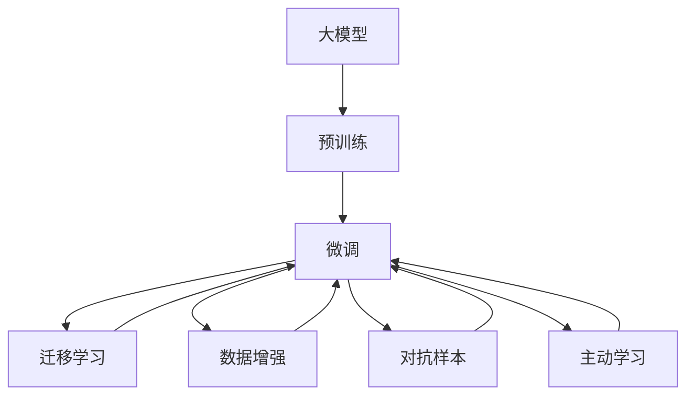

                 

## 1. 背景介绍

随着人工智能技术的迅猛发展，大模型（Large Models）在各行各业的应用场景中展现出了巨大的潜力。从自然语言处理（NLP）到图像识别，从自动驾驶到金融预测，大模型都取得了令人瞩目的成果。然而，在实际应用中，大模型也面临着一系列挑战，尤其是如何高效地处理和利用数据的问题。

### 1.1 数据驱动的AI大模型

大模型本质上是深度神经网络，通过大量数据的预训练来提取特征，并在下游任务中进行微调，以适应具体应用需求。这种数据驱动的方法在大模型训练和应用中起着至关重要的作用。然而，数据的质量、数量和多样性直接决定了模型的性能和泛化能力。因此，如何应对未来数据挑战，是大模型创业公司必须解决的核心问题之一。

### 1.2 数据处理与利用

数据处理是大模型创业中不可或缺的一环。传统的监督学习需要大量的标注数据，这不仅增加了成本，还可能导致数据偏差和过拟合。因此，探索新的数据处理方法和技术，降低对标注数据的依赖，是大模型创业公司面临的重要挑战。

## 2. 核心概念与联系

### 2.1 核心概念概述

为了深入理解如何应对未来数据挑战，我们先介绍几个关键概念：

- **大模型（Large Models）**：指的是具有大规模参数的深度学习模型，如BERT、GPT等。
- **预训练（Pre-training）**：在大规模无标注数据上训练模型，提取通用特征。
- **微调（Fine-tuning）**：将预训练模型在下游任务上进行有监督训练，调整模型参数以适应具体任务。
- **迁移学习（Transfer Learning）**：将预训练模型的知识迁移到下游任务中，减少任务特定的训练成本。
- **数据增强（Data Augmentation）**：通过各种方法扩充训练数据，提高模型泛化能力。
- **对抗样本（Adversarial Samples）**：设计特定数据来攻击模型的鲁棒性，增强模型的鲁棒性。
- **主动学习（Active Learning）**：通过选择性地标注数据，最大化训练样本的多样性和代表性。

### 2.2 核心概念原理和架构的 Mermaid 流程图



这个流程图展示了从预训练到微调的大模型训练流程，以及数据增强和对抗样本等技术如何辅助微调过程。

## 3. 核心算法原理 & 具体操作步骤

### 3.1 算法原理概述

大模型的训练和应用主要分为预训练和微调两个阶段。预训练是在大规模无标注数据上进行的，通过自监督学习任务来提取通用特征。微调是在预训练的基础上，在特定任务的数据上进行有监督训练，调整模型参数以适应该任务。

### 3.2 算法步骤详解

1. **预训练阶段**：
   - 选择适合的任务，如自回归语言模型（如GPT）或自编码器（如BERT）。
   - 收集大规模无标注数据集，如维基百科、新闻等。
   - 设计合适的自监督学习任务，如掩码语言模型、下一句预测等。
   - 使用反向传播算法更新模型参数，最小化损失函数。

2. **微调阶段**：
   - 选择适合的下游任务，如文本分类、命名实体识别等。
   - 收集特定任务的数据集，并进行标注。
   - 添加任务适配层，如全连接层、Softmax层等。
   - 设置合适的超参数，如学习率、批大小等。
   - 使用反向传播算法更新模型参数，最小化损失函数。
   - 在验证集上评估模型性能，防止过拟合。
   - 在测试集上评估模型性能，比较微调前后的提升。

### 3.3 算法优缺点

**优点**：
- 大规模数据驱动，提取通用特征，性能优越。
- 可以利用迁移学习，减少任务特定的训练成本。
- 利用数据增强和对抗样本，提高模型泛化能力。

**缺点**：
- 数据需求量大，成本高。
- 对数据标注依赖强，标注质量直接影响模型性能。
- 模型复杂度高，资源消耗大。

### 3.4 算法应用领域

大模型在多个领域都有广泛的应用，如：

- **自然语言处理**：文本分类、命名实体识别、情感分析等。
- **计算机视觉**：图像识别、目标检测、图像生成等。
- **语音处理**：语音识别、说话人识别、情感分析等。
- **医疗健康**：疾病诊断、药物发现、基因组分析等。
- **金融预测**：市场预测、信用评估、欺诈检测等。

## 4. 数学模型和公式 & 详细讲解 & 举例说明

### 4.1 数学模型构建

以自然语言处理中的文本分类任务为例，我们可以构建如下的数学模型：

设输入文本为 $x = (x_1, x_2, ..., x_n)$，输出为 $y = (y_1, y_2, ..., y_n)$，模型参数为 $\theta$，损失函数为 $L$。预训练后的模型表示为 $M_{\theta}$。微调的目标是最小化损失函数 $L$，即：

$$
\theta^* = \mathop{\arg\min}_{\theta} L(M_{\theta}(x), y)
$$

### 4.2 公式推导过程

假设我们使用softmax函数作为输出层的激活函数，损失函数为交叉熵损失，则：

$$
L = -\frac{1}{N}\sum_{i=1}^N \sum_{j=1}^C y_j \log M_{\theta}(x_i, j)
$$

其中 $N$ 为样本数量，$C$ 为类别数。在反向传播算法中，损失函数对模型参数 $\theta$ 的梯度为：

$$
\frac{\partial L}{\partial \theta} = \frac{\partial L}{\partial M_{\theta}(x)} \cdot \frac{\partial M_{\theta}(x)}{\partial \theta}
$$

在实际应用中，我们可以通过自动微分工具（如TensorFlow、PyTorch等）自动计算梯度，并使用优化算法（如AdamW、SGD等）更新模型参数。

### 4.3 案例分析与讲解

以BERT模型为例，其预训练任务包括掩码语言模型和下一句预测。在微调时，我们可以在输出层添加一个全连接层和softmax层，使用交叉熵损失函数。具体代码如下：

```python
import torch
import torch.nn as nn
from transformers import BertForSequenceClassification, BertTokenizer, AdamW

class Model(nn.Module):
    def __init__(self, num_labels):
        super(Model, self).__init__()
        self.bert = BertForSequenceClassification.from_pretrained('bert-base-uncased', num_labels=num_labels)
        self.dropout = nn.Dropout(0.1)

    def forward(self, input_ids, attention_mask, labels=None):
        outputs = self.bert(input_ids, attention_mask=attention_mask)
        logits = outputs[0]
        probabilities = nn.functional.softmax(logits, dim=-1)
        if labels is not None:
            loss_fct = nn.CrossEntropyLoss()
            loss = loss_fct(logits.view(-1, logits.size(-1)), labels.view(-1))
            return loss
        else:
            return probabilities

tokenizer = BertTokenizer.from_pretrained('bert-base-uncased')
model = Model(num_labels)
optimizer = AdamW(model.parameters(), lr=1e-5)
input_ids = tokenizer(text, return_tensors='pt').input_ids
attention_mask = tokenizer(text, return_tensors='pt').attention_mask
labels = torch.tensor(y)
loss = model(input_ids, attention_mask, labels).loss
loss.backward()
optimizer.step()
```

## 5. 项目实践：代码实例和详细解释说明

### 5.1 开发环境搭建

在使用大模型进行微调时，首先需要搭建好开发环境。以下是搭建开发环境的详细步骤：

1. **安装Python和PyTorch**：
   ```bash
   conda create -n pytorch-env python=3.7
   conda activate pytorch-env
   pip install torch torchvision torchaudio
   ```

2. **安装Transformers库**：
   ```bash
   pip install transformers
   ```

3. **安装数据预处理工具**：
   ```bash
   pip install pandas numpy scikit-learn
   ```

4. **安装可视化工具**：
   ```bash
   pip install matplotlib seaborn jupyter notebook
   ```

### 5.2 源代码详细实现

以BERT模型进行情感分析为例，以下是完整的代码实现：

```python
import torch
import torch.nn as nn
from transformers import BertForSequenceClassification, BertTokenizer, AdamW

class Model(nn.Module):
    def __init__(self, num_labels):
        super(Model, self).__init__()
        self.bert = BertForSequenceClassification.from_pretrained('bert-base-uncased', num_labels=num_labels)
        self.dropout = nn.Dropout(0.1)

    def forward(self, input_ids, attention_mask, labels=None):
        outputs = self.bert(input_ids, attention_mask=attention_mask)
        logits = outputs[0]
        probabilities = nn.functional.softmax(logits, dim=-1)
        if labels is not None:
            loss_fct = nn.CrossEntropyLoss()
            loss = loss_fct(logits.view(-1, logits.size(-1)), labels.view(-1))
            return loss
        else:
            return probabilities

tokenizer = BertTokenizer.from_pretrained('bert-base-uncased')
model = Model(num_labels)
optimizer = AdamW(model.parameters(), lr=1e-5)
input_ids = tokenizer(text, return_tensors='pt').input_ids
attention_mask = tokenizer(text, return_tensors='pt').attention_mask
labels = torch.tensor(y)
loss = model(input_ids, attention_mask, labels).loss
loss.backward()
optimizer.step()
```

### 5.3 代码解读与分析

上述代码中，我们使用了BERT模型进行情感分析任务的微调。首先，定义了一个包含BERT模型和Dropout层的神经网络模型。然后，使用AdamW优化器进行模型训练，并设置学习率为1e-5。在训练过程中，我们使用了交叉熵损失函数，并在模型输出后进行了softmax函数处理，得到概率分布。最后，我们计算损失函数，并使用反向传播算法更新模型参数。

## 6. 实际应用场景

### 6.4 未来应用展望

未来，大模型将在更多领域得到应用，并面临新的数据挑战。以下是一些可能的未来应用场景：

1. **自动驾驶**：大模型可以用于图像识别和路径规划，通过收集大量的驾驶数据，提升自动驾驶的智能化水平。
2. **智能家居**：通过分析用户的语音和行为数据，大模型可以用于家庭自动化和智能推荐。
3. **医疗健康**：大模型可以用于疾病预测、基因组分析等，通过收集大量的医学数据，提升医疗诊断和治疗的准确性。
4. **金融预测**：大模型可以用于市场预测、信用评估等，通过收集大量的金融数据，提升金融预测的准确性。
5. **环境保护**：大模型可以用于环境监测和预测，通过收集大量的环境数据，提升环境保护的智能化水平。

## 7. 工具和资源推荐

### 7.1 学习资源推荐

为了帮助开发者更好地理解大模型的微调和应用，我们推荐以下学习资源：

1. **《深度学习》课程**：斯坦福大学开设的深度学习课程，涵盖深度学习的基本概念和经典模型。
2. **《Natural Language Processing with Transformers》书籍**：介绍Transformer及其应用，是大模型微调的重要参考资料。
3. **CS224N《深度学习自然语言处理》课程**：斯坦福大学开设的自然语言处理课程，涵盖NLP的基本概念和前沿技术。
4. **Transformers官方文档**：提供了详细的API和代码示例，是大模型微调的重要参考资料。

### 7.2 开发工具推荐

以下是一些常用的开发工具：

1. **PyTorch**：深度学习框架，支持动态图和静态图，适合快速迭代研究。
2. **TensorFlow**：深度学习框架，支持分布式训练和模型部署，适合大规模工程应用。
3. **Transformers库**：提供预训练模型的封装和微调接口，是大模型微调的重要工具。
4. **Jupyter Notebook**：数据可视化、代码编写和执行的工具，适合研究和实验。
5. **TensorBoard**：模型训练的可视化工具，帮助调试和优化模型。

### 7.3 相关论文推荐

以下是几篇关于大模型微调和应用的经典论文：

1. **《Attention is All You Need》**：Transformer模型的开创性论文，提出了自注意力机制，是预训练大模型的重要基础。
2. **《BERT: Pre-training of Deep Bidirectional Transformers for Language Understanding》**：提出了BERT模型，通过掩码语言模型和下一句预测进行预训练，是自然语言处理的重要里程碑。
3. **《GPT-2》**：介绍了GPT-2模型，展示了大模型在零样本学习和文本生成方面的强大能力。
4. **《Fine-tuning Large Pretrained Transformer Models》**：介绍了大模型微调的方法和技巧，是微调技术的重要参考资料。

## 8. 总结：未来发展趋势与挑战

### 8.1 总结

本文对大模型的微调方法和应用进行了系统介绍。通过详细的数学模型构建和代码实现，展示了大模型微调的原理和具体操作步骤。我们讨论了数据在大模型微调中的重要性，并提出了一些应对未来数据挑战的方法和策略。

### 8.2 未来发展趋势

未来，大模型将在更多领域得到应用，并面临新的数据挑战。以下是一些可能的未来发展趋势：

1. **无监督学习**：通过自监督学习，降低对标注数据的依赖，提升模型的泛化能力。
2. **数据增强**：通过数据增强技术，扩充训练数据集，提升模型的鲁棒性和泛化能力。
3. **知识蒸馏**：通过知识蒸馏技术，将领域专家的知识迁移到模型中，提升模型的性能和泛化能力。
4. **联邦学习**：通过联邦学习技术，在分布式环境中进行模型训练，提升模型的隐私和安全性。
5. **模型压缩**：通过模型压缩技术，减少模型的计算和存储资源消耗，提升模型的实时性。

### 8.3 面临的挑战

尽管大模型在许多领域取得了显著成果，但仍面临以下挑战：

1. **数据质量**：大规模无标注数据质量不一，可能存在偏差和噪声，影响模型的泛化能力。
2. **计算资源**：大模型的训练和推理需要大量的计算资源，难以在资源受限的环境中部署。
3. **模型可解释性**：大模型通常缺乏可解释性，难以解释其内部工作机制和决策逻辑。
4. **隐私保护**：大模型需要大量的数据进行训练，可能面临隐私泄露的风险。
5. **模型鲁棒性**：大模型可能存在对抗样本和鲁棒性不足的问题，需要进一步改进。

### 8.4 研究展望

未来，大模型的微调技术将面临更多的挑战和机遇。以下是一些未来的研究方向：

1. **高效数据处理**：探索高效的数据处理方法和技术，降低对标注数据的依赖，提升模型的泛化能力。
2. **模型压缩和加速**：通过模型压缩和加速技术，提升模型的实时性和资源效率。
3. **多模态学习**：探索多模态学习方法和技术，提升模型的跨模态融合能力。
4. **可解释性研究**：探索提升模型可解释性的方法和技术，增强模型的透明度和可信度。
5. **隐私保护研究**：探索隐私保护方法和技术，提升模型训练和应用的隐私安全性。

总之，大模型微调技术将不断演进和完善，未来在更多领域中发挥重要作用，为人工智能技术的发展注入新的活力。

## 9. 附录：常见问题与解答

### Q1: 大模型如何应对数据质量不高的挑战？

**A**: 针对数据质量不高的问题，可以采用数据清洗、数据增强、主动学习等方法。数据清洗可以去除噪声和异常值，提高数据质量。数据增强可以通过数据增强技术生成新的样本，增加训练数据的多样性。主动学习可以通过选择性地标注数据，提高训练数据的多样性和代表性。

### Q2: 大模型如何在计算资源受限的环境中部署？

**A**: 针对计算资源受限的问题，可以采用模型压缩、模型蒸馏、模型剪枝等方法。模型压缩可以减小模型的大小，提升模型的实时性。模型蒸馏可以将大型模型转换为小型模型，提升模型的效率。模型剪枝可以去除冗余的参数，减小模型的大小和计算量。

### Q3: 大模型如何提高可解释性？

**A**: 针对可解释性不足的问题，可以采用可解释性模型、可解释性特征、可解释性可视化等方法。可解释性模型可以通过添加可解释性模块，提高模型的透明度和可信度。可解释性特征可以通过特征重要性分析，解释模型的决策过程。可解释性可视化可以通过可视化工具，展示模型的内部工作机制和决策过程。

### Q4: 大模型如何提高隐私保护？

**A**: 针对隐私保护的问题，可以采用差分隐私、联邦学习、安全多方计算等方法。差分隐私可以通过添加噪声，保护用户数据的隐私性。联邦学习可以在分布式环境中进行模型训练，保护用户数据的隐私性。安全多方计算可以在多方协同计算中保护数据的隐私性。

### Q5: 大模型如何应对模型鲁棒性不足的问题？

**A**: 针对模型鲁棒性不足的问题，可以采用对抗样本训练、鲁棒性增强、鲁棒性优化等方法。对抗样本训练可以通过引入对抗样本，提高模型的鲁棒性。鲁棒性增强可以通过修改模型结构，提高模型的鲁棒性。鲁棒性优化可以通过优化损失函数，提高模型的鲁棒性。

综上所述，大模型微调技术具有广泛的应用前景和巨大的潜力，但也面临着数据质量、计算资源、可解释性、隐私保护和模型鲁棒性等诸多挑战。通过不断的技术创新和实践积累，相信大模型微调技术将不断成熟和完善，为人工智能技术的发展注入新的活力。

