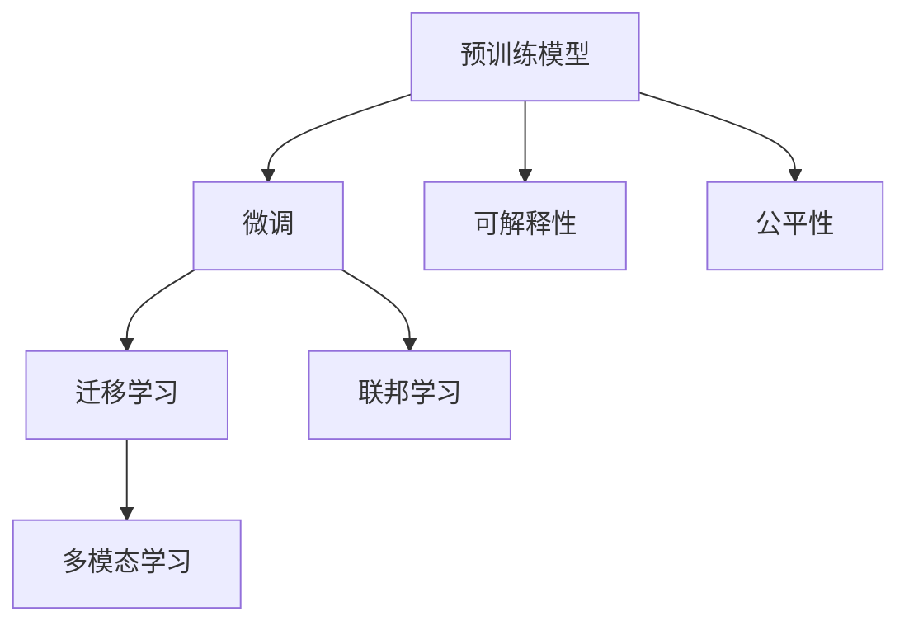

                 

# AI大模型创业：如何应对未来行业发展趋势？

## 1. 背景介绍

### 1.1 问题由来

在当今科技快速发展的时代，人工智能（AI）大模型已经成为各行业数字化转型的重要驱动力。从搜索引擎、推荐系统到智能客服、自动驾驶，大模型的应用已经渗透到了我们生活的方方面面。然而，随着市场竞争的加剧和技术要求的不断提高，AI大模型创业公司如何应对未来行业发展趋势，成为业界关注的焦点。

### 1.2 问题核心关键点

未来AI大模型行业的趋势主要集中在以下几个方面：

1. **模型规模的扩大**：预训练模型越来越大，参数量越来越多，模型性能和效果随之提升。
2. **多模态模型的兴起**：除了文本模型，图像、视频、语音等多模态数据也成为热门的研究方向。
3. **跨领域模型的应用**：模型的泛化能力和跨领域迁移能力成为研究重点。
4. **联邦学习与隐私保护**：模型如何在保护隐私的前提下进行分布式训练，成为研究难点。
5. **模型解释性与可解释性**：模型输出的可解释性成为关键，尤其在金融、医疗等高风险领域。
6. **伦理与公平性**：模型如何避免偏见和歧视，实现公平性和伦理性，成为必须考虑的问题。

## 2. 核心概念与联系

### 2.1 核心概念概述

为更好地理解AI大模型创业所面临的未来趋势，本节将介绍几个密切相关的核心概念：

- **预训练模型（Pre-trained Model）**：指在大规模无标签数据上预训练的模型，如BERT、GPT等，通常用于各类下游任务的微调（Fine-tuning）。
- **微调（Fine-tuning）**：在预训练模型的基础上，使用下游任务的标注数据进行优化，提升模型在特定任务上的性能。
- **迁移学习（Transfer Learning）**：将预训练模型知识迁移到下游任务，减少任务特定的数据需求。
- **联邦学习（Federated Learning）**：一种分布式学习方式，模型在不共享本地数据的情况下进行协同训练。
- **多模态学习（Multimodal Learning）**：将不同模态的数据整合到一个模型中进行联合训练，如文本与图像、语音的联合学习。
- **可解释性（Explainability）**：模型的决策过程透明、可理解，便于解释和审查。
- **公平性（Fairness）**：模型输出对不同群体或个体的公平性，避免偏见和歧视。

这些核心概念之间的逻辑关系可以通过以下Mermaid流程图来展示：



这个流程图展示了大模型创业过程中所涉及的关键概念及其之间的关系：

1. 预训练模型通过大规模数据训练，获得了广泛的语言、视觉、音频等知识。
2. 微调将预训练模型知识迁移到下游任务，提升了模型在特定领域的表现。
3. 迁移学习、联邦学习、多模态学习等技术，拓展了模型的应用边界和训练方式。
4. 可解释性和公平性确保模型输出透明、公正，满足了高风险领域的需求。

这些概念共同构成了AI大模型的学习与应用框架，使得AI大模型能够广泛地应用于各种行业，解决复杂问题。

## 3. 核心算法原理 & 具体操作步骤

### 3.1 算法原理概述

基于AI大模型的创业公司，其核心算法原理主要包括：

- **预训练模型**：在大规模无标签数据上进行预训练，学习通用的知识表示。
- **微调**：在预训练模型的基础上，使用下游任务的标注数据进行优化，提升模型在特定任务上的性能。
- **迁移学习**：通过共享预训练模型的特征表示，减少下游任务的训练时间。
- **联邦学习**：在保护数据隐私的前提下，通过分布式训练提升模型性能。
- **多模态学习**：将不同模态的数据整合到一个模型中进行联合训练，提升模型的泛化能力。

### 3.2 算法步骤详解

AI大模型创业公司基于以上原理，通常需要遵循以下步骤：

**Step 1: 选择预训练模型**
- 根据应用需求选择合适的预训练模型，如BERT、GPT-3等。

**Step 2: 数据预处理**
- 收集并清洗下游任务的标注数据，划分训练集、验证集和测试集。
- 对文本、图像、语音等数据进行格式转换和预处理。

**Step 3: 模型微调**
- 在预训练模型的基础上，使用下游任务的标注数据进行微调，提升模型在特定任务上的性能。
- 设置合适的学习率、优化器和正则化参数。

**Step 4: 模型评估与部署**
- 在测试集上评估微调后的模型性能。
- 将模型部署到实际应用中，持续优化和更新。

### 3.3 算法优缺点

AI大模型创业公司的算法有如下优缺点：

**优点**：
1. **高效性**：通过预训练和微调，可以在相对较短的时间内提升模型性能。
2. **广泛适用**：预训练模型可以应用于各种NLP、CV、Audio等任务，具有泛化能力强、跨领域迁移能力好等优点。
3. **可解释性**：部分预训练模型已经公开权重，方便理解和审查。

**缺点**：
1. **数据需求高**：预训练和微调需要大量的标注数据，获取和处理成本高。
2. **模型复杂**：预训练模型参数量大，计算资源需求高，模型复杂性增加。
3. **性能差异**：不同预训练模型和微调方法的效果有差异，需要根据具体任务选择合适的模型。

### 3.4 算法应用领域

AI大模型创业公司的算法在以下领域有广泛应用：

- **自然语言处理（NLP）**：文本分类、机器翻译、问答系统等。
- **计算机视觉（CV）**：图像识别、物体检测、人脸识别等。
- **语音识别（ASR）**：语音转文本、语音情感分析等。
- **推荐系统**：个性化推荐、广告推荐等。
- **金融风控**：信用评分、欺诈检测等。
- **医疗健康**：疾病诊断、医学影像分析等。

## 4. 数学模型和公式 & 详细讲解 & 举例说明

### 4.1 数学模型构建

假设预训练模型为 $M_{\theta}$，其中 $\theta$ 为预训练得到的模型参数。给定下游任务 $T$ 的标注数据集 $D=\{(x_i, y_i)\}_{i=1}^N$，微调的目标是找到新的模型参数 $\hat{\theta}$，使得：

$$
\hat{\theta}=\mathop{\arg\min}_{\theta} \mathcal{L}(M_{\theta},D)
$$

其中 $\mathcal{L}$ 为针对任务 $T$ 设计的损失函数，用于衡量模型预测输出与真实标签之间的差异。常见的损失函数包括交叉熵损失、均方误差损失等。

### 4.2 公式推导过程

以二分类任务为例，假设模型 $M_{\theta}$ 在输入 $x$ 上的输出为 $\hat{y}=M_{\theta}(x) \in [0,1]$，表示样本属于正类的概率。真实标签 $y \in \{0,1\}$。则二分类交叉熵损失函数定义为：

$$
\ell(M_{\theta}(x),y) = -[y\log \hat{y} + (1-y)\log (1-\hat{y})]
$$

将其代入经验风险公式，得：

$$
\mathcal{L}(\theta) = -\frac{1}{N}\sum_{i=1}^N [y_i\log M_{\theta}(x_i)+(1-y_i)\log(1-M_{\theta}(x_i))]
$$

根据链式法则，损失函数对参数 $\theta_k$ 的梯度为：

$$
\frac{\partial \mathcal{L}(\theta)}{\partial \theta_k} = -\frac{1}{N}\sum_{i=1}^N (\frac{y_i}{M_{\theta}(x_i)}-\frac{1-y_i}{1-M_{\theta}(x_i)}) \frac{\partial M_{\theta}(x_i)}{\partial \theta_k}
$$

其中 $\frac{\partial M_{\theta}(x_i)}{\partial \theta_k}$ 可进一步递归展开，利用自动微分技术完成计算。

### 4.3 案例分析与讲解

假设有一家AI大模型创业公司，其目标任务是情感分析。公司选择BERT作为预训练模型，使用IMDB影评数据集进行微调。微调过程中，采用Adam优化器，学习率为2e-5，训练1000个epoch。以下是具体代码实现：

```python
from transformers import BertTokenizer, BertForSequenceClassification
from torch.utils.data import DataLoader, Dataset
from sklearn.model_selection import train_test_split
from torch import nn, optim

# 数据预处理
def preprocess_data(texts, labels, tokenizer):
    encodings = tokenizer(texts, return_tensors='pt', padding=True, truncation=True)
    input_ids = encodings['input_ids']
    attention_mask = encodings['attention_mask']
    labels = torch.tensor(labels, dtype=torch.long)
    return input_ids, attention_mask, labels

# 加载数据集
train_texts, test_texts, train_labels, test_labels = train_test_split(train_data['text'], train_data['label'], test_size=0.2)
train_dataset = Dataset(train_texts, train_labels, tokenizer)
test_dataset = Dataset(test_texts, test_labels, tokenizer)

# 构建模型
model = BertForSequenceClassification.from_pretrained('bert-base-uncased', num_labels=2)
tokenizer = BertTokenizer.from_pretrained('bert-base-uncased')

# 微调
device = 'cuda' if torch.cuda.is_available() else 'cpu'
model.to(device)
optimizer = optim.Adam(model.parameters(), lr=2e-5)

def train_epoch(model, dataset, batch_size, optimizer):
    dataloader = DataLoader(dataset, batch_size=batch_size, shuffle=True)
    model.train()
    epoch_loss = 0
    for batch in dataloader:
        input_ids, attention_mask, labels = batch['input_ids'].to(device), batch['attention_mask'].to(device), batch['labels'].to(device)
        model.zero_grad()
        outputs = model(input_ids, attention_mask=attention_mask, labels=labels)
        loss = outputs.loss
        epoch_loss += loss.item()
        loss.backward()
        optimizer.step()
    return epoch_loss / len(dataloader)

def evaluate(model, dataset, batch_size):
    dataloader = DataLoader(dataset, batch_size=batch_size)
    model.eval()
    preds, labels = [], []
    with torch.no_grad():
        for batch in dataloader:
            input_ids, attention_mask, labels = batch['input_ids'].to(device), batch['attention_mask'].to(device), batch['labels']
            outputs = model(input_ids, attention_mask=attention_mask)
            batch_preds = outputs.logits.argmax(dim=1).to('cpu').tolist()
            batch_labels = labels.to('cpu').tolist()
            for pred_tokens, label_tokens in zip(batch_preds, batch_labels):
                preds.append(pred_tokens[:len(label_tokens)])
                labels.append(label_tokens)
    print(classification_report(labels, preds))

# 训练与评估
epochs = 1000
batch_size = 16

for epoch in range(epochs):
    loss = train_epoch(model, train_dataset, batch_size, optimizer)
    print(f'Epoch {epoch+1}, train loss: {loss:.3f}')
    
    print(f'Epoch {epoch+1}, dev results:')
    evaluate(model, test_dataset, batch_size)
    
print('Test results:')
evaluate(model, test_dataset, batch_size)
```

## 5. 项目实践：代码实例和详细解释说明

### 5.1 开发环境搭建

在进行AI大模型创业项目的开发前，需要准备好开发环境。以下是使用Python进行PyTorch开发的环境配置流程：

1. 安装Anaconda：从官网下载并安装Anaconda，用于创建独立的Python环境。

2. 创建并激活虚拟环境：
```bash
conda create -n pytorch-env python=3.8 
conda activate pytorch-env
```

3. 安装PyTorch：根据CUDA版本，从官网获取对应的安装命令。例如：
```bash
conda install pytorch torchvision torchaudio cudatoolkit=11.1 -c pytorch -c conda-forge
```

4. 安装Transformers库：
```bash
pip install transformers
```

5. 安装各类工具包：
```bash
pip install numpy pandas scikit-learn matplotlib tqdm jupyter notebook ipython
```

完成上述步骤后，即可在`pytorch-env`环境中开始项目开发。

### 5.2 源代码详细实现

以下是使用PyTorch进行情感分析任务微调的完整代码实现。

```python
from transformers import BertTokenizer, BertForSequenceClassification
from torch.utils.data import DataLoader, Dataset
from sklearn.model_selection import train_test_split
from torch import nn, optim
from sklearn.metrics import classification_report

# 数据预处理
def preprocess_data(texts, labels, tokenizer):
    encodings = tokenizer(texts, return_tensors='pt', padding=True, truncation=True)
    input_ids = encodings['input_ids']
    attention_mask = encodings['attention_mask']
    labels = torch.tensor(labels, dtype=torch.long)
    return input_ids, attention_mask, labels

# 加载数据集
train_texts, test_texts, train_labels, test_labels = train_test_split(train_data['text'], train_data['label'], test_size=0.2)
train_dataset = Dataset(train_texts, train_labels, tokenizer)
test_dataset = Dataset(test_texts, test_labels, tokenizer)

# 构建模型
model = BertForSequenceClassification.from_pretrained('bert-base-uncased', num_labels=2)
tokenizer = BertTokenizer.from_pretrained('bert-base-uncased')

# 微调
device = 'cuda' if torch.cuda.is_available() else 'cpu'
model.to(device)
optimizer = optim.Adam(model.parameters(), lr=2e-5)

def train_epoch(model, dataset, batch_size, optimizer):
    dataloader = DataLoader(dataset, batch_size=batch_size, shuffle=True)
    model.train()
    epoch_loss = 0
    for batch in dataloader:
        input_ids, attention_mask, labels = batch['input_ids'].to(device), batch['attention_mask'].to(device), batch['labels'].to(device)
        model.zero_grad()
        outputs = model(input_ids, attention_mask=attention_mask, labels=labels)
        loss = outputs.loss
        epoch_loss += loss.item()
        loss.backward()
        optimizer.step()
    return epoch_loss / len(dataloader)

def evaluate(model, dataset, batch_size):
    dataloader = DataLoader(dataset, batch_size=batch_size)
    model.eval()
    preds, labels = [], []
    with torch.no_grad():
        for batch in dataloader:
            input_ids, attention_mask, labels = batch['input_ids'].to(device), batch['attention_mask'].to(device), batch['labels']
            outputs = model(input_ids, attention_mask=attention_mask)
            batch_preds = outputs.logits.argmax(dim=1).to('cpu').tolist()
            batch_labels = labels.to('cpu').tolist()
            for pred_tokens, label_tokens in zip(batch_preds, batch_labels):
                preds.append(pred_tokens[:len(label_tokens)])
                labels.append(label_tokens)
    
    print(classification_report(labels, preds))

# 训练与评估
epochs = 1000
batch_size = 16

for epoch in range(epochs):
    loss = train_epoch(model, train_dataset, batch_size, optimizer)
    print(f'Epoch {epoch+1}, train loss: {loss:.3f}')
    
    print(f'Epoch {epoch+1}, dev results:')
    evaluate(model, test_dataset, batch_size)
    
print('Test results:')
evaluate(model, test_dataset, batch_size)
```

## 6. 实际应用场景

### 6.1 智能客服系统

智能客服系统是大模型创业公司的重要应用场景之一。利用大模型，企业可以快速构建能够自动处理客户咨询、解决问题的人工智能客服系统，提升客户体验，降低运营成本。

通过预训练模型和微调技术，智能客服系统能够学习大量历史对话数据，理解用户意图，生成自然流畅的回复。当用户提出问题时，系统能够快速识别并生成合适的答案，实现7x24小时不间断服务。

### 6.2 金融舆情监测

金融舆情监测是大模型创业公司在金融领域的重要应用。通过预训练模型和微调技术，企业能够实时监测市场舆情，预警潜在风险，保障金融安全。

在金融舆情监测中，大模型可以学习金融领域相关的新闻、报道、评论等文本数据，并对其进行主题标注和情感标注。通过微调，模型能够自动识别舆情变化趋势，一旦发现负面信息激增等异常情况，系统便会自动预警，帮助金融机构快速应对潜在风险。

### 6.3 个性化推荐系统

个性化推荐系统是大模型创业公司的重要业务之一。利用大模型，企业能够学习用户行为数据，为用户推荐个性化内容，提升用户体验和满意度。

在个性化推荐中，大模型可以学习用户浏览、点击、评论、分享等行为数据，并提取和用户交互的物品标题、描述、标签等文本内容。通过微调，模型能够从文本内容中准确把握用户的兴趣点，在生成推荐列表时，先用候选物品的文本描述作为输入，由模型预测用户的兴趣匹配度，再结合其他特征综合排序，便可以得到个性化程度更高的推荐结果。

### 6.4 未来应用展望

随着AI大模型技术的不断发展，未来大模型创业公司将面临更多新的应用场景。以下是一些可能的未来应用方向：

- **智慧医疗**：利用大模型，企业可以构建智慧医疗系统，实现疾病诊断、医学影像分析等任务，提升医疗服务水平。
- **智能教育**：通过大模型，企业可以构建智能教育平台，提供个性化学习推荐、智能作业批改等服务，促进教育公平。
- **智慧城市**：利用大模型，企业可以构建智慧城市系统，实现城市事件监测、舆情分析、应急指挥等功能，提升城市管理水平。
- **自动驾驶**：通过大模型，企业可以构建自动驾驶系统，实现车辆感知、决策、控制等功能，推动自动驾驶技术的普及应用。
- **语音交互**：利用大模型，企业可以构建语音交互系统，实现智能音箱、智能语音助手等功能，提升用户生活便捷性。

未来，AI大模型创业公司需要不断拓展应用边界，提升技术水平，满足各行业数字化转型的需求，创造更多商业价值。

## 7. 工具和资源推荐

### 7.1 学习资源推荐

为了帮助AI大模型创业公司系统掌握相关技术，这里推荐一些优质的学习资源：

1. **《Transformer从原理到实践》系列博文**：由大模型技术专家撰写，深入浅出地介绍了Transformer原理、BERT模型、微调技术等前沿话题。
2. **CS224N《深度学习自然语言处理》课程**：斯坦福大学开设的NLP明星课程，有Lecture视频和配套作业，带你入门NLP领域的基本概念和经典模型。
3. **《Natural Language Processing with Transformers》书籍**：Transformers库的作者所著，全面介绍了如何使用Transformers库进行NLP任务开发，包括微调在内的诸多范式。
4. **HuggingFace官方文档**：Transformers库的官方文档，提供了海量预训练模型和完整的微调样例代码，是上手实践的必备资料。
5. **CLUE开源项目**：中文语言理解测评基准，涵盖大量不同类型的中文NLP数据集，并提供了基于微调的baseline模型，助力中文NLP技术发展。

通过对这些资源的学习实践，相信你一定能够快速掌握AI大模型的微调技术，并用于解决实际的NLP问题。

### 7.2 开发工具推荐

高效的开发离不开优秀的工具支持。以下是几款用于AI大模型创业的常用工具：

1. **PyTorch**：基于Python的开源深度学习框架，灵活动态的计算图，适合快速迭代研究。大部分预训练语言模型都有PyTorch版本的实现。
2. **TensorFlow**：由Google主导开发的开源深度学习框架，生产部署方便，适合大规模工程应用。同样有丰富的预训练语言模型资源。
3. **Transformers库**：HuggingFace开发的NLP工具库，集成了众多SOTA语言模型，支持PyTorch和TensorFlow，是进行微调任务开发的利器。
4. **Weights & Biases**：模型训练的实验跟踪工具，可以记录和可视化模型训练过程中的各项指标，方便对比和调优。与主流深度学习框架无缝集成。
5. **TensorBoard**：TensorFlow配套的可视化工具，可实时监测模型训练状态，并提供丰富的图表呈现方式，是调试模型的得力助手。
6. **Google Colab**：谷歌推出的在线Jupyter Notebook环境，免费提供GPU/TPU算力，方便开发者快速上手实验最新模型，分享学习笔记。

合理利用这些工具，可以显著提升AI大模型创业的开发效率，加快创新迭代的步伐。

### 7.3 相关论文推荐

AI大模型创业公司的算法在以下方向有大量研究：

1. **Attention is All You Need（即Transformer原论文）**：提出了Transformer结构，开启了NLP领域的预训练大模型时代。
2. **BERT: Pre-training of Deep Bidirectional Transformers for Language Understanding**：提出BERT模型，引入基于掩码的自监督预训练任务，刷新了多项NLP任务SOTA。
3. **Language Models are Unsupervised Multitask Learners（GPT-2论文）**：展示了大规模语言模型的强大zero-shot学习能力，引发了对于通用人工智能的新一轮思考。
4. **Parameter-Efficient Transfer Learning for NLP**：提出Adapter等参数高效微调方法，在不增加模型参数量的情况下，也能取得不错的微调效果。
5. **Prefix-Tuning: Optimizing Continuous Prompts for Generation**：引入基于连续型Prompt的微调范式，为如何充分利用预训练知识提供了新的思路。
6. **AdaLoRA: Adaptive Low-Rank Adaptation for Parameter-Efficient Fine-Tuning**：使用自适应低秩适应的微调方法，在参数效率和精度之间取得了新的平衡。

这些论文代表了大模型创业公司的算法研究的发展脉络。通过学习这些前沿成果，可以帮助创业者把握学科前进方向，激发更多的创新灵感。

## 8. 总结：未来发展趋势与挑战

### 8.1 总结

本文对AI大模型创业公司在未来发展趋势进行了全面系统的介绍。首先阐述了AI大模型创业的背景和意义，明确了微调在拓展预训练模型应用、提升下游任务性能方面的独特价值。其次，从原理到实践，详细讲解了微调的数学原理和关键步骤，给出了微调任务开发的完整代码实例。同时，本文还广泛探讨了微调方法在智能客服、金融舆情、个性化推荐等多个行业领域的应用前景，展示了微调范式的巨大潜力。此外，本文精选了微调技术的各类学习资源，力求为创业者提供全方位的技术指引。

通过本文的系统梳理，可以看到，AI大模型微调技术正在成为NLP领域的重要范式，极大地拓展了预训练语言模型的应用边界，催生了更多的落地场景。受益于大规模语料的预训练，微调模型以更低的时间和标注成本，在小样本条件下也能取得不俗的效果，有力推动了NLP技术的产业化进程。未来，伴随预训练语言模型和微调方法的持续演进，相信NLP技术将在更广阔的应用领域大放异彩，深刻影响人类的生产生活方式。

### 8.2 未来发展趋势

展望未来，AI大模型创业公司将面临以下发展趋势：

1. **模型规模的扩大**：预训练模型越来越大，参数量越来越多，模型性能和效果随之提升。
2. **多模态模型的兴起**：除了文本模型，图像、视频、语音等多模态数据也成为热门的研究方向。
3. **跨领域模型的应用**：模型的泛化能力和跨领域迁移能力成为研究重点。
4. **联邦学习与隐私保护**：模型如何在保护数据隐私的前提下进行分布式训练，成为研究难点。
5. **模型解释性与可解释性**：模型的决策过程透明、可理解，便于解释和审查。
6. **公平性**：模型输出对不同群体或个体的公平性，避免偏见和歧视。

以上趋势凸显了AI大模型微调技术的广阔前景。这些方向的探索发展，必将进一步提升AI大模型创业公司的模型性能和应用边界，为构建人机协同的智能系统铺平道路。

### 8.3 面临的挑战

尽管AI大模型微调技术已经取得了瞩目成就，但在迈向更加智能化、普适化应用的过程中，它仍面临诸多挑战：

1. **标注成本瓶颈**：预训练和微调需要大量的标注数据，获取和处理成本高。
2. **模型鲁棒性不足**：当前微调模型面对域外数据时，泛化性能往往大打折扣。
3. **推理效率有待提高**：大模型推理速度慢、内存占用大，需要优化资源利用。
4. **可解释性亟需加强**：当前微调模型更像是"黑盒"系统，难以解释其内部工作机制和决策逻辑。
5. **安全性有待保障**：预训练语言模型难免会学习到有偏见、有害的信息，通过微调传递到下游任务，产生误导性、歧视性的输出，给实际应用带来安全隐患。
6. **知识整合能力不足**：现有的微调模型往往局限于任务内数据，难以灵活吸收和运用更广泛的先验知识。

正视AI大模型创业公司所面临的这些挑战，积极应对并寻求突破，将是大模型创业公司的关键。相信随着学界和产业界的共同努力，这些挑战终将一一被克服，AI大模型微调技术必将在构建安全、可靠、可解释、可控的智能系统铺平道路。

### 8.4 研究展望

未来，AI大模型创业公司需要在以下几个方面寻求新的突破：

1. **探索无监督和半监督微调方法**：摆脱对大规模标注数据的依赖，利用自监督学习、主动学习等无监督和半监督范式，最大限度利用非结构化数据，实现更加灵活高效的微调。
2. **研究参数高效和计算高效的微调范式**：开发更加参数高效的微调方法，在固定大部分预训练参数的同时，只更新极少量的任务相关参数。同时优化微调模型的计算图，减少前向传播和反向传播的资源消耗，实现更加轻量级、实时性的部署。
3. **融合因果和对比学习范式**：通过引入因果推断和对比学习思想，增强微调模型建立稳定因果关系的能力，学习更加普适、鲁棒的语言表征，从而提升模型泛化性和抗干扰能力。
4. **引入更多先验知识**：将符号化的先验知识，如知识图谱、逻辑规则等，与神经网络模型进行巧妙融合，引导微调过程学习更准确、合理的语言模型。同时加强不同模态数据的整合，实现视觉、语音等多模态信息与文本信息的协同建模。
5. **结合因果分析和博弈论工具**：将因果分析方法引入微调模型，识别出模型决策的关键特征，增强输出解释的因果性和逻辑性。借助博弈论工具刻画人机交互过程，主动探索并规避模型的脆弱点，提高系统稳定性。
6. **纳入伦理道德约束**：在模型训练目标中引入伦理导向的评估指标，过滤和惩罚有偏见、有害的输出倾向。同时加强人工干预和审核，建立模型行为的监管机制，确保输出符合人类价值观和伦理道德。

这些研究方向的探索，必将引领AI大模型微调技术迈向更高的台阶，为构建安全、可靠、可解释、可控的智能系统铺平道路。面向未来，AI大模型创业公司需要不断拓展应用边界，提升技术水平，满足各行业数字化转型的需求，创造更多商业价值。

## 9. 附录：常见问题与解答

**Q1：AI大模型创业公司的核心竞争力是什么？**

A: AI大模型创业公司的核心竞争力主要体现在以下几个方面：

1. **技术优势**：拥有领先的预训练模型和微调技术，能够快速响应市场需求，提供高效、精准的解决方案。
2. **数据积累**：具备丰富的数据积累和标注资源，能够提供高质量的训练数据和标注服务。
3. **团队实力**：拥有高素质的研发团队，能够快速迭代优化模型和算法，提升产品竞争力。
4. **应用场景**：具备广泛的应用场景和行业经验，能够提供定制化的解决方案，满足不同领域的需求。
5. **客户服务**：提供完善的客户服务和支持体系，能够快速响应客户需求，解决问题。

**Q2：AI大模型创业公司如何应对数据标注成本高的问题？**

A: AI大模型创业公司可以通过以下几种方式应对数据标注成本高的问题：

1. **半监督学习**：利用少量标注数据和大量未标注数据进行联合训练，提升模型性能。
2. **主动学习**：在训练过程中主动选择最有信息量的样本进行标注，减少标注数据需求。
3. **弱监督学习**：利用弱标注数据进行训练，降低标注成本。
4. **众包标注**：利用众包平台，借助众包标注降低标注成本。
5. **数据合成**：利用数据生成技术，生成高质量的合成数据进行训练。

**Q3：AI大模型创业公司如何提升模型鲁棒性？**

A: AI大模型创业公司可以通过以下几种方式提升模型鲁棒性：

1. **对抗训练**：引入对抗样本，训练模型对对抗攻击的鲁棒性。
2. **正则化**：使用L2正则、Dropout等正则化技术，避免模型过拟合，提升泛化能力。
3. **多模型集成**：训练多个微调模型，取平均输出，抑制过拟合。
4. **参数共享**：共享预训练模型的部分参数，减少过拟合风险。
5. **模型裁剪**：去除不必要的层和参数，减小模型尺寸，提高推理速度。

**Q4：AI大模型创业公司如何提升模型可解释性？**

A: AI大模型创业公司可以通过以下几种方式提升模型可解释性：

1. **可解释性技术**：利用可解释性技术，如LIME、SHAP等，解释模型输出。
2. **规则融合**：将符号化的先验知识与神经网络模型结合，增强模型的可解释性。
3. **多模型融合**：通过多模型融合，生成更透明、可解释的输出。
4. **可视化工具**：利用可视化工具，展示模型的内部工作机制和决策逻辑。
5. **专家审查**：引入专家审查机制，对模型输出进行人工审查和验证。

**Q5：AI大模型创业公司如何避免模型偏见和歧视？**

A: AI大模型创业公司可以通过以下几种方式避免模型偏见和歧视：

1. **数据清洗**：清洗数据集中的偏见和歧视样本，确保训练数据的公正性。
2. **公平性算法**：引入公平性算法，如平衡分类、减少误差等，提升模型的公平性。
3. **偏见检测**：利用偏见检测技术，识别和过滤模型中的偏见和歧视。
4. **多样性训练**：在训练过程中引入多样性数据，提升模型的公平性。
5. **人工干预**：通过人工干预和审核，确保模型输出符合公平性和伦理性。

**Q6：AI大模型创业公司如何提升模型性能？**

A: AI大模型创业公司可以通过以下几种方式提升模型性能：

1. **超参数调优**：利用超参数调优技术，寻找最优的超参数组合。
2. **模型融合**：利用模型融合技术，提升模型性能。
3. **知识迁移**：将预训练模型知识迁移到下游任务，提升模型泛化能力。
4. **硬件加速**：利用硬件加速技术，提高模型训练和推理速度。
5. **数据增强**：利用数据增强技术，提升模型的泛化能力。

综上所述，AI大模型创业公司需要不断探索新技术、新方法，才能在激烈的市场竞争中保持竞争力，创造更多商业价值。

---

作者：禅与计算机程序设计艺术 / Zen and the Art of Computer Programming

