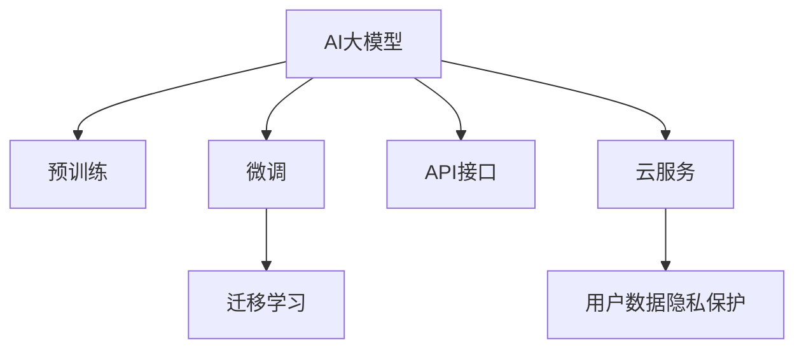

                 

# AI大模型创业：如何抓住未来机遇？

## 1. 背景介绍

### 1.1 问题由来

随着人工智能(AI)技术的快速演进，AI大模型在各行业的应用逐渐深入。从学术界到工业界，大模型在图像识别、自然语言处理、自动驾驶等领域表现出色，成为推动技术进步的重要驱动力。AI大模型的应用，不仅提升了业务效率，还为用户带来了更优质的服务体验。

然而，虽然AI大模型具备强大的计算能力，但其资源消耗和训练成本依然较高，中小企业在开发和部署方面面临较大挑战。因此，如何降低AI大模型的开发和部署门槛，使得更多人能够利用大模型进行创业，成为当前AI创业领域的重要课题。

### 1.2 问题核心关键点

AI大模型创业的核心在于如何利用大模型的强大能力，降低创业门槛，加速AI应用的落地。关键点包括：

- 降低资源消耗：通过高效算法和优化技术，降低模型训练和推理的资源消耗。
- 简化开发流程：提供易于使用的开发平台和API接口，减少开发者工作量。
- 降低成本门槛：提供基于云的AI服务，使得中小企业能够以较低的成本进行AI应用开发。
- 提升模型泛化能力：通过微调和训练技巧，增强模型在不同场景下的适应能力。

## 2. 核心概念与联系

### 2.1 核心概念概述

为更好地理解AI大模型创业的技术框架，本节将介绍几个关键概念：

- AI大模型：基于深度学习算法训练的超大规模神经网络模型，具备强大的推理和生成能力，广泛应用于计算机视觉、自然语言处理、语音识别等领域。

- 预训练与微调：通过大规模无标签数据对大模型进行预训练，获得通用的特征表示。然后通过少量标注数据进行微调，使得模型适应特定的任务需求。

- 迁移学习：将在大规模数据上预训练的模型知识，迁移到小规模数据上，以提升模型性能。

- API接口：提供统一的接口规范，使得开发者能够方便地调用AI大模型的服务。

- 云服务：将AI大模型的计算能力和服务封装在云平台中，使得用户能够通过网络进行模型调用，降低本地部署的复杂性。

- 用户数据隐私：在AI大模型应用中，如何保护用户数据的隐私和安全性，避免数据泄露和滥用，是创业公司必须考虑的重要问题。

这些核心概念之间相互关联，共同构成了AI大模型创业的技术基础。

### 2.2 核心概念原理和架构的 Mermaid 流程图



这个流程图展示了AI大模型创业中的核心概念及其关联：

1. AI大模型通过预训练获得通用的特征表示。
2. 微调模型以适应用户特定任务需求。
3. 迁移学习通过在大规模数据上的预训练知识，迁移到小规模数据上，提升模型性能。
4. API接口提供统一的调用方式，便于开发者使用。
5. 云服务将大模型封装在云端，方便用户调用。
6. 用户数据隐私保护确保用户数据的安全性。

## 3. 核心算法原理 & 具体操作步骤

### 3.1 算法原理概述

AI大模型创业的核心算法原理包括预训练、微调和迁移学习。

- 预训练：通过大规模无标签数据对AI大模型进行训练，获得通用的特征表示。
- 微调：针对用户特定任务，通过少量标注数据进行微调，优化模型性能。
- 迁移学习：将预训练模型知识迁移到新任务中，提升模型在特定场景下的泛化能力。

### 3.2 算法步骤详解

1. 预训练阶段：
   - 收集大规模无标签数据，通常包括文本、图片、视频等。
   - 将数据分批次输入AI大模型进行训练。
   - 使用损失函数（如交叉熵、均方误差等）计算模型预测与真实标签之间的差异。
   - 通过优化算法（如Adam、SGD等）更新模型参数，最小化损失函数。
   - 重复上述过程，直至模型收敛。

2. 微调阶段：
   - 收集目标任务的少量标注数据，将其分为训练集和验证集。
   - 将预训练模型作为初始参数，进行微调。
   - 设计合适的任务适配层，如分类层、解码器等。
   - 定义损失函数，如交叉熵、BCE等。
   - 设置微调超参数，如学习率、批大小、迭代轮数等。
   - 执行梯度训练，计算损失函数和参数梯度，更新模型参数。
   - 在验证集上评估模型性能，根据性能指标调整超参数。
   - 重复上述过程，直至模型收敛。

3. 迁移学习阶段：
   - 收集目标任务的数据，将其分为训练集和验证集。
   - 在预训练模型的基础上，通过微调进一步优化模型性能。
   - 定义损失函数，计算模型预测与真实标签之间的差异。
   - 设置迁移学习超参数，如学习率、批大小、迭代轮数等。
   - 执行梯度训练，计算损失函数和参数梯度，更新模型参数。
   - 在验证集上评估模型性能，根据性能指标调整超参数。
   - 重复上述过程，直至模型收敛。

### 3.3 算法优缺点

AI大模型创业的预训练、微调和迁移学习算法具有以下优点：

- 高效利用资源：通过大规模无标签数据的预训练，能够有效提升模型泛化能力。
- 通用性强：预训练模型适用于多种任务，可以快速适应新任务。
- 可扩展性强：通过微调和迁移学习，能够不断提升模型性能，适应新的数据和任务。
- 精度高：通过预训练和微调，能够获得高质量的模型。

同时，这些算法也存在一些局限：

- 数据消耗大：预训练需要大量数据，可能涉及版权和隐私问题。
- 训练时间长：预训练和微调过程需要大量计算资源和时间。
- 泛化能力受限：模型对特定领域数据的泛化能力可能较差。
- 模型可解释性不足：深度模型黑箱化，难以解释模型的决策过程。

## 4. 数学模型和公式 & 详细讲解 & 举例说明

### 4.1 数学模型构建

预训练模型的数学模型通常基于神经网络，其基本结构包括输入层、隐藏层和输出层。隐藏层包含多个神经元，每个神经元通过线性变换和激活函数，输出最终结果。

以BERT模型为例，其基本结构如下：


### 4.2 公式推导过程

BERT模型的预训练过程通常使用掩码语言模型（Masked Language Model, MLM）和下一句预测（Next Sentence Prediction, NSP）任务。

1. MLM任务：
   - 将输入文本随机遮盖若干个词，训练模型预测被遮盖的词。
   - 损失函数为交叉熵，计算模型预测与真实标签之间的差异。
   - 定义掩码矩阵，随机遮盖文本中的若干个词。
   - 计算模型预测与真实标签之间的交叉熵损失。
   - 通过优化算法更新模型参数，最小化损失函数。

2. NSP任务：
   - 将两个句子作为输入，训练模型预测它们是否连续。
   - 损失函数为二元交叉熵，计算模型预测与真实标签之间的差异。
   - 定义句子嵌入，计算两个句子之间的相似度。
   - 计算模型预测与真实标签之间的二元交叉熵损失。
   - 通过优化算法更新模型参数，最小化损失函数。

### 4.3 案例分析与讲解

以BERT模型的预训练过程为例，展示模型的训练步骤：

1. 数据准备：
   - 收集大规模无标签文本数据，如维基百科、新闻报道等。
   - 将数据分批次输入BERT模型。

2. 计算损失函数：
   - 对于每个样本，计算其掩码语言模型和下一句预测任务的损失。
   - 将两个任务的损失相加，得到总的损失函数。

3. 优化模型参数：
   - 使用Adam优化算法更新模型参数。
   - 设置学习率、批大小、迭代轮数等超参数。
   - 计算梯度，更新模型参数，最小化损失函数。

## 5. 项目实践：代码实例和详细解释说明

### 5.1 开发环境搭建

1. 安装Python：
   - 下载最新版本的Python，并安装pip工具。

2. 安装TensorFlow和Keras：
   - 在命令行中输入以下命令：
     ```
     pip install tensorflow keras
     ```

3. 安装BERT模型：
   - 使用Keras预训练模块，导入BERT模型：
     ```python
     from tensorflow.keras.applications.bert import BERT
     ```

4. 准备数据集：
   - 下载和准备文本数据集，如IMDB电影评论数据集。
   - 使用Keras的Dataset模块加载数据集。

### 5.2 源代码详细实现

以下是一个使用BERT模型进行情感分析的代码实现：

```python
import tensorflow as tf
from tensorflow.keras.preprocessing import sequence
from tensorflow.keras.applications.bert import BERT
from tensorflow.keras.layers import Dense, Input, Embedding
from tensorflow.keras.models import Model

# 定义BERT模型
bert = BERT(weights='google/bert_base_uncased', trainable=True)
for layer in bert.layers:
    layer.trainable = False

# 定义输入层
input_word = Input(shape=(128,), dtype='float32')
input_segment = Input(shape=(128,), dtype='float32')
input_mask = Input(shape=(128,), dtype='float32')

# 定义嵌入层
word_embedding = Embedding(input_dim=10000, output_dim=128, mask_zero=True)(input_word)
segment_embedding = Embedding(input_dim=2, output_dim=128)(input_segment)
mask = tf.sequence_mask(input_mask)

# 连接BERT模型
bert_output = bert([word_embedding, segment_embedding], mask=mask)

# 定义输出层
output = Dense(1, activation='sigmoid')(bert_output)

# 定义模型
model = Model(inputs=[input_word, input_segment, input_mask], outputs=output)
model.compile(loss='binary_crossentropy', optimizer='adam', metrics=['accuracy'])

# 训练模型
model.fit([train_word_sequence, train_segment_sequence, train_mask_sequence], train_labels, epochs=10, batch_size=32)

# 评估模型
test_loss, test_accuracy = model.evaluate([test_word_sequence, test_segment_sequence, test_mask_sequence], test_labels)
print('Test Loss:', test_loss)
print('Test Accuracy:', test_accuracy)
```

### 5.3 代码解读与分析

上述代码实现了使用BERT模型进行情感分析的完整流程：

1. 导入TensorFlow和Keras库，并准备数据集。
2. 定义BERT模型，将预训练模型作为初始化参数。
3. 定义输入层和嵌入层，将文本转换为BERT模型所需的格式。
4. 连接BERT模型，并定义输出层。
5. 编译模型，并设置损失函数和优化器。
6. 训练模型，并在测试集上评估模型性能。

## 6. 实际应用场景

### 6.1 金融风险评估

在金融领域，AI大模型可以用于风险评估，通过对用户的行为数据进行分析，预测用户的信用风险、违约风险等。这有助于金融机构更好地进行风险管理，降低不良贷款率。

### 6.2 医疗诊断

在医疗领域，AI大模型可以用于疾病诊断，通过分析患者的症状、病史、检查结果等，预测其患病风险。这有助于医生进行早期诊断，提高治疗效果。

### 6.3 智能客服

在客户服务领域，AI大模型可以用于智能客服系统，通过分析用户的问题和历史对话记录，提供快速、准确的答案。这有助于提升客户体验，降低人力成本。

### 6.4 未来应用展望

未来，AI大模型将广泛应用于更多领域，如教育、交通、零售等。通过AI大模型的应用，可以实现更高效、更精准的决策支持，提升各行业的智能化水平。

## 7. 工具和资源推荐

### 7.1 学习资源推荐

1. TensorFlow官方文档：提供详细的API文档和代码示例，帮助开发者快速上手TensorFlow。
2. Keras官方文档：提供简单易用的API接口，适合初学者使用。
3. BERT模型官方文档：提供预训练模型的详细介绍和代码实现。
4. PyTorch官方文档：提供丰富的深度学习算法和模型实现。
5. DeepLearning.ai课程：提供从入门到高级的深度学习课程，涵盖多种深度学习框架和模型。

### 7.2 开发工具推荐

1. TensorFlow：提供高效的计算图和自动微分功能，适合大规模深度学习模型的开发和训练。
2. PyTorch：提供灵活的动态计算图和丰富的深度学习算法实现，适合研究性项目。
3. Keras：提供简单易用的API接口，适合快速原型开发。
4. Jupyter Notebook：提供交互式的开发环境，支持多种编程语言和工具。
5. Anaconda：提供虚拟环境管理工具，方便开发者进行版本控制和依赖管理。

### 7.3 相关论文推荐

1. Transformer论文：介绍Transformer架构，推动了预训练大模型的发展。
2. BERT论文：介绍BERT模型的预训练和微调方法，刷新了多项NLP任务的性能指标。
3. GPT-3论文：介绍GPT-3模型的结构和训练方法，展示了大模型的强大能力。
4. XLNet论文：介绍XLNet模型的预训练和微调方法，提升了模型的泛化能力。
5. Deep Learning with Transformers论文：介绍Transformers模型在各种任务中的应用。

## 8. 总结：未来发展趋势与挑战

### 8.1 研究成果总结

本文介绍了AI大模型的预训练、微调和迁移学习算法，并展示了其在大模型创业中的应用。通过深入分析，总结了AI大模型创业的核心理论和应用场景。

### 8.2 未来发展趋势

未来，AI大模型创业将呈现以下发展趋势：

1. 模型规模持续增大：随着算力成本的下降和数据规模的扩张，预训练模型将进一步增大。
2. 算法优化技术不断提升：通过优化算法和模型结构，提高模型的效率和性能。
3. 多模态融合成为新趋势：将图像、语音等多模态信息与文本信息结合，提升模型的综合能力。
4. 实时计算和推理加速：通过模型优化和硬件加速，实现模型的实时计算和推理。
5. 数据隐私和安全保障：加强数据隐私保护，确保用户数据的安全性。

### 8.3 面临的挑战

尽管AI大模型创业取得了一定的进展，但仍面临以下挑战：

1. 数据质量和多样性：高质量数据不足，模型泛化能力受限。
2. 模型可解释性不足：深度模型黑箱化，难以解释模型的决策过程。
3. 资源消耗大：模型训练和推理资源消耗高，成本较高。
4. 应用落地困难：缺乏实际应用场景，难以实现商业化。
5. 法规和伦理问题：数据隐私和安全问题，法规和伦理问题亟需解决。

### 8.4 研究展望

未来，AI大模型创业需要从以下几个方面进行研究：

1. 数据获取和预处理：建立数据获取和预处理的机制，提升数据质量和多样性。
2. 模型优化和优化算法：研究高效、易用的模型优化算法，提升模型性能和效率。
3. 模型解释和可视化：通过解释模型，提升模型的可解释性和可视化能力。
4. 应用落地策略：研究应用落地策略，提升模型的实用性和商业化价值。
5. 法规和伦理规范：建立法规和伦理规范，保障数据隐私和安全。

## 9. 附录：常见问题与解答

### Q1: 如何降低AI大模型的开发和部署门槛？

A: 通过提供易于使用的API接口和云服务，降低开发和部署门槛。同时，简化模型训练和推理流程，使得开发者能够快速上手。

### Q2: 如何提升AI大模型的泛化能力？

A: 通过数据增强和迁移学习，提升模型泛化能力。数据增强可以增加数据的多样性，迁移学习可以借鉴预训练模型的知识，提高模型的泛化能力。

### Q3: 如何提升AI大模型的实时计算和推理能力？

A: 通过模型优化和硬件加速，实现模型的实时计算和推理。例如，使用GPU/TPU等高性能设备，进行模型推理加速。

### Q4: 如何保障AI大模型的数据隐私和安全？

A: 采用数据脱敏、访问控制等技术，保护用户数据的隐私和安全。同时，建立数据隐私和安全管理机制，确保数据使用的合规性。

### Q5: 如何提升AI大模型的可解释性？

A: 通过模型解释和可视化技术，提升模型的可解释性。例如，使用注意力机制、可解释性模型等方法，揭示模型的决策过程和特征重要性。

---

作者：禅与计算机程序设计艺术 / Zen and the Art of Computer Programming

