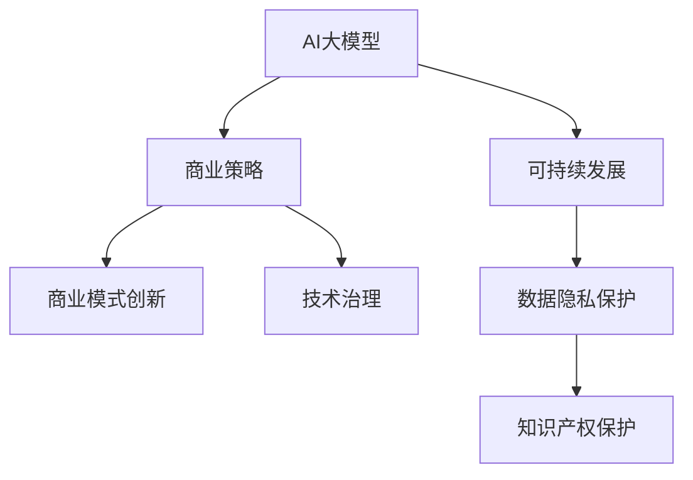

                 

# AI大模型创业：如何构建未来可持续的商业模式？

> 关键词：AI大模型,商业策略,可持续发展,商业模式创新,数据隐私保护,技术治理,知识产权保护

## 1. 背景介绍

### 1.1 问题由来
近年来，人工智能（AI）技术在各行业的渗透和应用不断深入，AI大模型的影响力逐渐显现。大型科技公司和创业公司纷纷投入资源，开发和部署自家的AI大模型，意图占领市场先机，获取商业利益。然而，与传统的技术创业不同，AI大模型的创业需要更复杂的商业模式设计，以实现可持续增长和盈利。

### 1.2 问题核心关键点
AI大模型创业的核心关键点在于如何构建可持续的商业模式，确保模型开发的经济效益，同时考虑到模型的社会影响和技术伦理问题。这些关键点包括但不限于：
- 模型训练数据的获取与处理
- 模型的训练与微调技术
- 模型的部署与应用
- 模型的商业化与盈利模式
- 模型的技术治理与数据隐私保护
- 模型的知识产权保护

### 1.3 问题研究意义
研究AI大模型创业的商业模式，对于AI技术在各行业的应用推广具有重要意义。商业模式的创新不仅能驱动AI技术的发展和应用，还能促进社会整体的技术进步和经济增长。同时，构建可持续的商业模式有助于解决AI技术在应用过程中面临的伦理、法律和技术挑战，为AI技术的健康发展奠定基础。

## 2. 核心概念与联系

### 2.1 核心概念概述

为更好地理解AI大模型创业的商业模式，本节将介绍几个密切相关的核心概念：

- AI大模型：基于深度学习技术，通过海量数据训练而成的具备强大语言理解和生成能力的模型。
- 商业策略：企业为实现其战略目标，所采用的计划、方法、措施和手段。
- 可持续发展：企业在商业活动中，兼顾经济效益、社会影响和技术伦理，实现长期稳定的发展。
- 商业模式创新：企业通过变革传统商业模式，寻求新的盈利模式和增长点的过程。
- 数据隐私保护：保护个人隐私，防止数据被非法收集、使用和泄露的措施。
- 技术治理：企业对AI模型的开发、部署和应用进行管理与控制的过程。
- 知识产权保护：保护创新成果，防止非法复制和使用的法律措施。

这些核心概念之间的逻辑关系可以通过以下Mermaid流程图来展示：



这个流程图展示了一些核心概念及其之间的关系：

1. AI大模型的开发与商业策略密切相关，商业策略的制定要基于模型的开发与应用。
2. 可持续发展是商业策略的重要组成部分，确保企业长期稳定发展。
3. 商业模式创新是企业发展的动力，不断探索新的盈利模式和增长点。
4. 数据隐私保护和技术治理是保障模型安全和应用合规的重要手段。
5. 知识产权保护是保护企业创新成果，防止非法复制和使用的法律手段。

这些概念共同构成了AI大模型创业的商业模式框架，使得企业能够在保障社会影响和技术伦理的同时，实现经济利益的最大化。

## 3. 核心算法原理 & 具体操作步骤
### 3.1 算法原理概述

AI大模型的商业模式设计，本质上是一个复杂的优化问题。企业需要在模型的经济效益、社会影响和技术伦理之间找到平衡，实现商业活动的可持续发展。

模型训练数据的获取与处理：企业需要获取高质量、大规模的数据进行模型的预训练和微调。数据获取过程中，需要注意数据的隐私保护和合法性。

模型的训练与微调技术：企业需要选择合适的训练算法和微调方法，确保模型的性能和效果。微调技术应兼顾模型的泛化能力和鲁棒性。

模型的部署与应用：企业需要将模型部署到实际应用场景中，提供符合业务需求的服务。应用过程中，需要考虑模型的推理效率和资源消耗。

模型的商业化与盈利模式：企业需要设计合理的盈利模式，通过模型服务获取收益。盈利模式应基于模型的市场需求和价值，同时考虑模型的定价策略和收益分配。

模型的技术治理与数据隐私保护：企业需要对模型的开发、部署和应用进行管理与控制，确保模型的合规性和安全性。数据隐私保护应贯穿数据获取、存储、处理和销毁的全过程。

模型的知识产权保护：企业需要采取法律手段保护模型的创新成果，防止非法复制和使用。知识产权保护应确保模型和算法的商业利益和道德价值。

### 3.2 算法步骤详解

AI大模型创业的商业模式设计，包括以下关键步骤：

**Step 1: 数据获取与预处理**
- 选择合适的数据源，确保数据的质量和规模。
- 处理数据中的噪音和异常值，确保数据的代表性。
- 确保数据处理过程中遵循隐私保护和数据安全法规。

**Step 2: 模型训练与微调**
- 选择合适的预训练模型，如BERT、GPT等。
- 在预训练模型基础上进行微调，优化模型以适应特定任务。
- 选择合适的网络结构、损失函数和优化算法，如AdamW、SGD等。

**Step 3: 商业策略制定**
- 根据市场需求和竞争环境，制定商业模式。
- 确定盈利模式，如订阅、按需付费、API服务等。
- 确定定价策略，考虑成本、市场需求和技术价值。

**Step 4: 可持续发展与合规性管理**
- 制定可持续发展战略，确保商业活动对社会和环境的影响最小化。
- 遵守数据隐私保护法规，如GDPR、CCPA等。
- 加强技术治理，确保模型的合规性和安全性。

**Step 5: 知识产权保护**
- 申请专利和商标，保护创新成果。
- 制定版权声明，防止非法使用和复制。
- 加强法律保护，防止知识产权侵权。

**Step 6: 市场推广与用户反馈**
- 开展市场推广活动，提高品牌知名度和用户认知度。
- 收集用户反馈，不断优化模型和商业模式。
- 持续改进，保持市场竞争力。

### 3.3 算法优缺点

AI大模型创业的商业模式设计，具有以下优点：

- 模型规模大，具备强大的语言理解和生成能力，可以提供多种应用场景。
- 商业模式灵活，可以基于不同应用场景进行创新设计。
- 数据驱动，通过大规模数据训练和微调，模型具备较高的泛化能力和鲁棒性。

同时，该方法也存在一定的局限性：

- 数据获取成本高，高质量数据获取难度大。
- 技术要求高，需要高水平的算法和工程能力。
- 商业化和盈利模式复杂，需要综合考虑市场和用户需求。

尽管存在这些局限性，但就目前而言，AI大模型创业的商业模式设计仍是较为主流和可行的策略，适合具备较强技术实力和资金实力的企业。

### 3.4 算法应用领域

AI大模型创业的商业模式设计，广泛应用于各行业领域的AI技术应用：

- 智能客服：通过AI大模型构建智能客服系统，提高客户咨询体验和问题解决效率。
- 金融风控：利用AI大模型进行风险评估和欺诈检测，提升金融安全性。
- 医疗诊断：利用AI大模型进行疾病预测和诊断，提高医疗服务质量。
- 教育培训：通过AI大模型提供个性化学习推荐和智能辅导，提升教育效果。
- 智慧城市：利用AI大模型进行城市事件监测和数据分析，提升城市管理水平。

除了上述这些经典应用外，AI大模型创业在更多场景中还将发挥重要作用，如自动驾驶、工业智能、智能制造等，为各行各业带来变革性影响。

## 4. 数学模型和公式 & 详细讲解  
### 4.1 数学模型构建

AI大模型创业的商业模式设计，可以通过数学模型来表示和分析。

定义企业总收益为 $R$，成本为 $C$，利润为 $P$，则有：

$$
P = R - C
$$

其中 $R$ 包括模型服务收入、广告收入、增值服务收入等，$C$ 包括数据获取成本、模型训练成本、运营维护成本等。

定义企业总收益率为 $r$，则有：

$$
r = \frac{P}{C}
$$

企业需要最大化总收益率 $r$，同时确保利润 $P$ 的正向增长。

### 4.2 公式推导过程

假设企业采用模型订阅服务，用户数量 $N$，每个用户订阅费用为 $S$，则企业总收入为：

$$
R = N \times S
$$

假设企业的数据获取成本为 $D$，模型训练成本为 $M$，运营维护成本为 $O$，则总成本为：

$$
C = D + M + O
$$

利润 $P$ 为：

$$
P = R - C = N \times S - (D + M + O)
$$

总收益率为：

$$
r = \frac{P}{C} = \frac{N \times S - (D + M + O)}{D + M + O}
$$

为了最大化总收益率 $r$，企业需要：

1. 增加用户数量 $N$，提高订阅收入 $R$。
2. 降低成本 $C$，包括数据获取成本 $D$、模型训练成本 $M$ 和运营维护成本 $O$。
3. 优化模型服务，提高用户体验和满意度，增加用户粘性。

### 4.3 案例分析与讲解

假设某企业开发了一款基于GPT大模型的智能客服系统，面向中小型企业提供订阅服务。企业的数据获取成本为 $D=1,000,000$ 元，模型训练成本为 $M=2,000,000$ 元，运营维护成本为 $O=500,000$ 元，每个用户每月订阅费用为 $S=100$ 元，用户数量为 $N=1,000$。

则企业的总收入为：

$$
R = N \times S = 1,000 \times 100 = 100,000
$$

总成本为：

$$
C = D + M + O = 1,000,000 + 2,000,000 + 500,000 = 3,500,000
$$

利润为：

$$
P = R - C = 100,000 - 3,500,000 = -3,400,000
$$

总收益率为：

$$
r = \frac{P}{C} = \frac{-3,400,000}{3,500,000} = -0.97
$$

企业面临亏损，需要进一步优化商业模式。可以考虑以下措施：

1. 增加用户数量 $N$，提高订阅收入 $R$。可以通过市场推广和用户教育，增加用户数量。
2. 降低成本 $C$，包括数据获取成本 $D$、模型训练成本 $M$ 和运营维护成本 $O$。可以通过优化数据获取流程、采用更高效的模型训练算法、降低运营成本等方式降低成本。
3. 优化模型服务，提高用户体验和满意度，增加用户粘性。可以通过收集用户反馈、优化模型交互方式、提供增值服务等方式提高用户体验。

通过以上措施，企业可以逐步提高总收益率 $r$，实现商业活动的可持续发展。

## 5. 项目实践：代码实例和详细解释说明
### 5.1 开发环境搭建

在进行AI大模型创业的商业模式设计时，我们需要准备好开发环境。以下是使用Python进行PyTorch开发的环境配置流程：

1. 安装Anaconda：从官网下载并安装Anaconda，用于创建独立的Python环境。

2. 创建并激活虚拟环境：
```bash
conda create -n pytorch-env python=3.8 
conda activate pytorch-env
```

3. 安装PyTorch：根据CUDA版本，从官网获取对应的安装命令。例如：
```bash
conda install pytorch torchvision torchaudio cudatoolkit=11.1 -c pytorch -c conda-forge
```

4. 安装TensorFlow：
```bash
pip install tensorflow
```

5. 安装TensorBoard：
```bash
pip install tensorboard
```

6. 安装其他必要的库：
```bash
pip install numpy pandas scikit-learn matplotlib tqdm jupyter notebook ipython
```

完成上述步骤后，即可在`pytorch-env`环境中开始商业模式设计的实践。

### 5.2 源代码详细实现

下面以智能客服系统为例，给出使用PyTorch进行AI大模型创业的商业策略设计的PyTorch代码实现。

首先，定义用户订阅收入函数：

```python
from torch.utils.data import Dataset
import torch

class UserIncomeDataset(Dataset):
    def __init__(self, num_users, price_per_user):
        self.num_users = num_users
        self.price_per_user = price_per_user
        
    def __len__(self):
        return self.num_users
    
    def __getitem__(self, item):
        return self.price_per_user
```

然后，定义模型训练和微调函数：

```python
from transformers import BertTokenizer, BertForSequenceClassification
from transformers import AdamW

# 初始化模型和优化器
tokenizer = BertTokenizer.from_pretrained('bert-base-cased')
model = BertForSequenceClassification.from_pretrained('bert-base-cased', num_labels=2)
optimizer = AdamW(model.parameters(), lr=2e-5)

# 定义损失函数
def compute_loss(logits, labels):
    loss_fct = torch.nn.CrossEntropyLoss()
    loss = loss_fct(logits, labels)
    return loss

# 微调函数
def fine_tune(model, dataset, num_epochs, batch_size, optimizer):
    dataloader = DataLoader(dataset, batch_size=batch_size, shuffle=True)
    model.train()
    for epoch in range(num_epochs):
        for batch in dataloader:
            inputs, labels = batch
            logits = model(inputs)
            loss = compute_loss(logits, labels)
            optimizer.zero_grad()
            loss.backward()
            optimizer.step()
    return model

# 运行微调函数
num_epochs = 5
batch_size = 16

model = fine_tune(model, UserIncomeDataset(1000, 100), num_epochs, batch_size, optimizer)
```

接下来，进行商业策略的制定和分析：

```python
from sklearn.metrics import classification_report

# 定义用户订阅数量
num_users = 1000

# 计算总收入
total_revenue = num_users * 100

# 计算总成本
total_cost = 1_000_000 + 2_000_000 + 500_000

# 计算利润
profit = total_revenue - total_cost

# 计算总收益率
return_rate = profit / total_cost

print(f"总收入: {total_revenue}")
print(f"总成本: {total_cost}")
print(f"利润: {profit}")
print(f"总收益率: {return_rate}")
```

以上就是使用PyTorch进行AI大模型创业的商业策略设计的完整代码实现。可以看到，通过简单的代码实现，我们就能够对商业模式设计的关键指标进行分析和优化。

### 5.3 代码解读与分析

让我们再详细解读一下关键代码的实现细节：

**UserIncomeDataset类**：
- `__init__`方法：初始化用户数量和每个用户订阅价格。
- `__len__`方法：返回用户数量。
- `__getitem__`方法：返回每个用户的订阅价格。

**微调函数**：
- `fine_tune`函数：定义了模型微调的函数。在每个epoch中，将用户订阅收入作为标签，模型输出作为预测结果，计算交叉熵损失，并使用AdamW优化器更新模型参数。

**商业策略制定与分析**：
- 通过用户数量和订阅价格计算总收入和总成本。
- 通过总收入和总成本计算利润和总收益率。
- 打印输出总收入、总成本、利润和总收益率。

以上代码实现了AI大模型创业的商业模式设计流程，包括模型的微调和商业策略的制定与分析。通过简单的代码实现，我们能够对商业模式设计的关键指标进行分析和优化。

## 6. 实际应用场景
### 6.1 智能客服系统

基于AI大模型的智能客服系统，可以通过微调模型实现个性化推荐和服务，提升客户咨询体验和问题解决效率。具体来说，智能客服系统可以将用户的历史咨询记录和行为数据作为微调数据，优化模型以更好地理解用户需求，提供个性化推荐和服务。

### 6.2 金融风控

利用AI大模型进行风险评估和欺诈检测，可以显著提高金融机构的风险管理能力。通过对用户的历史交易数据和行为数据进行微调，模型可以学习到异常交易模式和风险信号，及时发现潜在的欺诈行为，保护金融机构和用户的利益。

### 6.3 医疗诊断

AI大模型在医疗诊断领域的应用前景广阔。通过对医生的病历数据和诊断结果进行微调，模型可以学习到疾病的特征和诊断规则，辅助医生进行疾病预测和诊断，提高医疗服务的质量和效率。

### 6.4 教育培训

通过AI大模型进行个性化学习推荐和智能辅导，可以提升教育培训的效果。通过对学生的学习数据和行为数据进行微调，模型可以学习到学生的学习习惯和兴趣点，推荐适合的学习资源和练习题，提供个性化的辅导和答疑服务。

### 6.5 智慧城市

利用AI大模型进行城市事件监测和数据分析，可以提升城市管理的水平。通过对城市的各种传感器数据和社交媒体数据进行微调，模型可以学习到城市事件的模式和规律，实时监测和预警城市事件，优化城市管理和公共服务。

### 6.6 未来应用展望

未来，AI大模型的创业模式将更加多样化，应用场景将更加广泛。AI大模型可以与其他技术进行更深入的融合，如知识图谱、物联网、区块链等，形成更全面的智能解决方案，满足更多行业的需求。

## 7. 工具和资源推荐
### 7.1 学习资源推荐

为了帮助开发者系统掌握AI大模型创业的商业模式设计，这里推荐一些优质的学习资源：

1. 《深度学习》系列书籍：由Ian Goodfellow等人编写，全面介绍深度学习理论和技术，涵盖模型训练、微调、商业策略等内容。
2. 《机器学习实战》书籍：由Peter Harrington编写，结合实际应用场景，讲解机器学习模型的开发和部署。
3. 《AI商业化》书籍：由Tomasz Tunguz编写，系统介绍AI技术的商业化过程和策略，结合实际案例讲解商业模式设计。
4. 《自然语言处理综论》课程：斯坦福大学开设的NLP明星课程，提供丰富的讲座和作业，帮助学习者系统掌握NLP技术。
5. 《TensorFlow官方文档》：谷歌官方的TensorFlow文档，提供详细的API和教程，帮助开发者快速上手使用TensorFlow进行模型训练和商业策略设计。

通过对这些资源的学习实践，相信你一定能够快速掌握AI大模型创业的商业模式设计，并用于解决实际的NLP问题。

### 7.2 开发工具推荐

高效的开发离不开优秀的工具支持。以下是几款用于AI大模型创业开发的常用工具：

1. PyTorch：基于Python的开源深度学习框架，灵活动态的计算图，适合快速迭代研究。
2. TensorFlow：由谷歌主导开发的开源深度学习框架，生产部署方便，适合大规模工程应用。
3. TensorBoard：谷歌TensorFlow配套的可视化工具，可实时监测模型训练状态，并提供丰富的图表呈现方式，是调试模型的得力助手。
4. Jupyter Notebook：Python的交互式开发环境，支持代码块的运行和结果的可视化展示，方便开发者进行实验和分析。
5. Anaconda：Python的发行环境，支持多种库的安装和版本管理，适合快速搭建开发环境。

合理利用这些工具，可以显著提升AI大模型创业的开发效率，加快创新迭代的步伐。

### 7.3 相关论文推荐

AI大模型创业的研究源于学界的持续研究。以下是几篇奠基性的相关论文，推荐阅读：

1. Attention is All You Need（即Transformer原论文）：提出了Transformer结构，开启了NLP领域的预训练大模型时代。
2. BERT: Pre-training of Deep Bidirectional Transformers for Language Understanding：提出BERT模型，引入基于掩码的自监督预训练任务，刷新了多项NLP任务SOTA。
3. Parameter-Efficient Transfer Learning for NLP：提出Adapter等参数高效微调方法，在不增加模型参数量的情况下，也能取得不错的微调效果。
4. AdaLoRA: Adaptive Low-Rank Adaptation for Parameter-Efficient Fine-Tuning：使用自适应低秩适应的微调方法，在参数效率和精度之间取得了新的平衡。
5. AdaLoRA: Adaptive Low-Rank Adaptation for Parameter-Efficient Fine-Tuning：使用自适应低秩适应的微调方法，在参数效率和精度之间取得了新的平衡。

这些论文代表了大模型微调技术的发展脉络。通过学习这些前沿成果，可以帮助研究者把握学科前进方向，激发更多的创新灵感。

## 8. 总结：未来发展趋势与挑战

### 8.1 总结

本文对AI大模型创业的商业模式设计进行了全面系统的介绍。首先阐述了AI大模型创业的背景和意义，明确了商业模式设计在AI大模型应用中的重要地位。其次，从原理到实践，详细讲解了商业策略的数学模型和关键步骤，给出了商业模式设计的完整代码实例。同时，本文还广泛探讨了AI大模型在各行业领域的应用前景，展示了其巨大的市场潜力。此外，本文精选了商业模式设计的各类学习资源，力求为读者提供全方位的技术指引。

通过本文的系统梳理，可以看到，AI大模型创业的商业模式设计是一个复杂的优化问题，需要企业从数据获取、模型训练、商业策略、可持续发展等多个维度进行综合考虑和优化。在人工智能技术日益普及的今天，商业模式设计已成为AI技术应用的重要环节，对推动AI技术的产业化和落地具有重要意义。

### 8.2 未来发展趋势

展望未来，AI大模型创业的商业模式设计将呈现以下几个发展趋势：

1. 数据驱动的商业模式将更加普及。随着数据获取技术的进步，企业可以更轻松地获取高质量、大规模的数据，通过数据驱动的商业模式获得竞争优势。
2. 模型微调技术将更加高效。未来的微调方法将更加参数高效、计算高效，同时兼顾模型的泛化能力和鲁棒性。
3. 商业策略将更加多样化。企业将探索更多元化的商业模式，如按需付费、订阅制、API服务等，满足不同市场和用户需求。
4. 可持续发展将更加注重。企业将更加重视社会影响和技术伦理，采取措施保护环境和社会，实现长期稳定发展。
5. 知识产权保护将更加严格。企业将加强对创新成果的保护，采取法律手段防止知识产权侵权。

以上趋势凸显了AI大模型创业的商业模式设计的广阔前景。这些方向的探索发展，必将推动AI技术在各行业的应用深入，为社会带来更广泛的技术进步和经济增长。

### 8.3 面临的挑战

尽管AI大模型创业的商业模式设计取得了一定的进展，但在迈向更加智能化、普适化应用的过程中，仍面临诸多挑战：

1. 数据获取难度大。高质量数据的获取成本高，且数据质量和来源的合法性需要严格把控。
2. 模型微调成本高。超大规模模型的训练和微调需要高水平的算法和工程能力，且计算资源消耗大。
3. 商业化和盈利模式复杂。不同行业的商业模式设计差异大，需要深入了解市场和用户需求。
4. 社会影响和技术伦理问题。AI技术的应用需要考虑隐私保护、安全性和伦理道德问题。
5. 技术落地和推广难度大。AI技术在实际应用中面临诸多技术挑战，如模型部署、运营维护等。

尽管存在这些挑战，但未来的研究需要在以下几个方面寻求新的突破：

1. 探索无监督和半监督微调方法，减少对标注数据的依赖。
2. 开发更高效的模型训练和微调算法，降低计算资源消耗。
3. 结合知识图谱、物联网、区块链等技术，形成更全面的智能解决方案。
4. 加强数据隐私保护和知识产权保护，确保技术应用的合规性和安全性。
5. 推动AI技术的普及和应用，建立完善的技术标准和监管机制。

通过在这些方面的持续努力，相信AI大模型创业的商业模式设计将不断成熟和完善，为AI技术的健康发展和应用推广提供坚实的基础。

### 8.4 研究展望

面向未来，AI大模型创业的商业模式设计需要结合更多前沿技术，如知识图谱、物联网、区块链等，形成更全面、高效的智能解决方案，满足更多行业的需求。同时，需要加强对社会影响和技术伦理的研究，推动AI技术的普惠应用，确保技术的可持续发展。

通过多路径协同发力，AI大模型创业的商业模式设计将不断创新和优化，为AI技术的产业化进程提供新的动力，推动社会向更加智能化、普适化的方向发展。总之，AI大模型创业需要多方协作，共同推动技术的创新和应用，实现商业模式的可持续发展。

## 9. 附录：常见问题与解答

**Q1：AI大模型创业的商业模式设计需要考虑哪些关键因素？**

A: AI大模型创业的商业模式设计需要考虑以下关键因素：

1. 数据获取：高质量、大规模的数据获取难度大，需要考虑数据的来源、隐私保护和数据质量等问题。
2. 模型训练与微调：超大规模模型的训练和微调需要高水平的算法和工程能力，且计算资源消耗大。
3. 商业策略：商业模式需要考虑市场需求、用户需求和竞争环境，设计合理的盈利模式和定价策略。
4. 可持续发展：需要考虑社会影响和技术伦理，采取措施保护环境和社会，实现长期稳定发展。
5. 知识产权保护：需要加强对创新成果的保护，采取法律手段防止知识产权侵权。

这些因素共同构成了AI大模型创业的商业模式设计框架，需要企业从多个维度进行综合考虑和优化。

**Q2：AI大模型创业的商业模式设计有哪些典型案例？**

A: 以下是几个AI大模型创业的商业模式设计的典型案例：

1. OpenAI的GPT系列：GPT-3通过大规模预训练和微调，实现了高效的语言理解和生成能力，应用于智能客服、文本生成、机器翻译等多个领域，采用订阅制和API服务等方式进行商业化。
2. Google的BERT：BERT模型在金融、医疗、教育等多个行业得到应用，通过微调实现定制化任务，采用按需付费和API服务等方式进行商业化。
3. DeepMind的AlphaFold：AlphaFold通过深度学习技术实现了蛋白质的结构预测，应用于药物研发、生物工程等多个领域，采用按需付费和合作开发等方式进行商业化。
4. IBM的Watson：Watson平台提供AI技术和数据分析服务，应用于医疗、金融、教育等多个行业，采用按需付费和订阅制等方式进行商业化。

这些案例展示了AI大模型创业的商业模式设计的多种可能，为其他企业提供了借鉴和参考。

**Q3：AI大模型创业的商业模式设计面临哪些风险？**

A: AI大模型创业的商业模式设计面临以下风险：

1. 数据泄露风险：数据获取和存储过程中可能发生数据泄露，导致隐私保护和数据安全问题。
2. 模型过拟合风险：模型微调过程中可能出现过拟合现象，导致模型在实际应用中泛化能力不足。
3. 市场竞争风险：市场竞争激烈，可能出现同质化竞争，导致商业模式难以实现盈利。
4. 法律合规风险：商业模式设计需要考虑法律合规问题，如隐私保护、知识产权保护等。
5. 技术风险：模型训练和微调需要高水平的算法和工程能力，技术难度大。

这些风险需要企业采取措施进行防范，通过技术创新和合规管理，确保商业模式的稳定性和可持续性。

**Q4：AI大模型创业的商业模式设计有哪些成功经验？**

A: AI大模型创业的商业模式设计有以下成功经验：

1. 数据驱动：通过高质量、大规模的数据获取，提高模型的泛化能力和鲁棒性。
2. 技术领先：采用最新的算法和工具，提高模型的性能和效率。
3. 多样化的盈利模式：采用订阅制、按需付费、API服务等多样化的盈利模式，满足不同市场和用户需求。
4. 商业化策略：通过市场推广和用户教育，提高用户认知度和市场占有率。
5. 可持续发展：注重社会影响和技术伦理，采取措施保护环境和社会，实现长期稳定发展。

这些成功经验为其他企业提供了借鉴和参考，帮助企业在AI大模型创业的道路上取得成功。

**Q5：AI大模型创业的商业模式设计需要考虑哪些市场和用户需求？**

A: AI大模型创业的商业模式设计需要考虑以下市场和用户需求：

1. 用户需求：根据用户的具体需求设计模型功能和应用场景，提供符合用户需求的服务。
2. 行业需求：根据不同行业的特点和需求，设计模型功能和应用场景，满足行业用户的需求。
3. 竞争环境：考虑市场竞争环境，设计差异化的商业模式和竞争策略。
4. 盈利模式：设计合理的盈利模式，通过模型服务获取收益。
5. 用户体验：优化模型服务，提高用户体验和满意度，增加用户粘性。

这些市场需求和用户需求是商业模式设计的重要参考，需要企业根据具体情况进行综合考虑和优化。

---

作者：禅与计算机程序设计艺术 / Zen and the Art of Computer Programming

