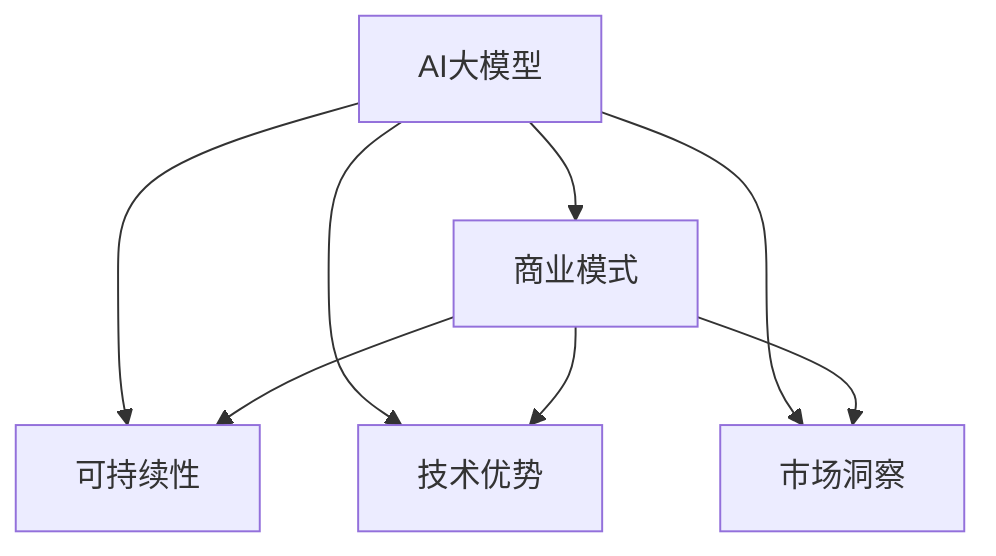

                 

# AI大模型创业：如何构建未来可持续的商业模式？

## 1. 背景介绍

### 1.1 问题由来

人工智能（AI）大模型正迅速崛起，成为未来科技发展的关键驱动力。大模型通过深度学习技术，不仅在图像识别、自然语言处理、语音识别等领域取得突破，还展现出其在复杂问题求解、知识积累、跨领域融合等方面的巨大潜力。随着AI大模型的发展，越来越多的创业公司开始关注其应用，希望通过大模型构建新的商业模式，抢占市场先机。

但与此同时，AI大模型的开发、部署和运营面临着复杂的技术挑战，如数据获取、模型训练、技术集成、用户体验、商业模式构建等。尤其是在当前经济环境下，如何构建可持续的商业模式，成为许多AI大模型创业公司面临的重要课题。

### 1.2 问题核心关键点

AI大模型创业的核心在于如何将技术优势转化为商业价值，并实现持续的盈利。这要求创业公司不仅要有强大的技术实力，还要具备敏锐的市场洞察力和商业模式构建能力。

1. **技术实力的重要性**：
   - AI大模型的研发需要大量的数据、计算资源和算法优化，创业公司必须具备在技术和工程层面实现高效开发和部署的能力。

2. **市场洞察力的必要性**：
   - 了解市场需求、用户痛点、竞争格局等，是判断商业模式可行性的关键。

3. **商业模式构建的复杂性**：
   - 从产品设计、定价策略、销售渠道、用户体验、增值服务等环节，都需要精心规划和精细运营。

4. **持续盈利能力的挑战**：
   - AI大模型的开发成本高、维护费用大，创业公司必须构建有效的盈利模式，以确保可持续发展。

### 1.3 问题研究意义

探讨AI大模型创业的商业模式，对于推动AI技术的产业化应用、加速科技创新具有重要意义：

1. **促进技术普及**：
   - 通过商业模式创新，让更多人了解和接受AI大模型的应用，从而推动技术普及。

2. **加速行业发展**：
   - 提供有效的商业模式，激励更多创业公司进入AI大模型领域，加速行业成长。

3. **提升竞争力**：
   - 通过商业模式创新，提升创业公司在市场竞争中的优势，实现持续发展。

4. **实现商业成功**：
   - 为创业公司提供可行的商业模式，帮助其克服技术、市场和运营挑战，实现商业成功。

## 2. 核心概念与联系

### 2.1 核心概念概述

为更好地理解AI大模型创业的商业模式，本节将介绍几个密切相关的核心概念：

- **AI大模型（Large AI Model）**：指通过大规模数据训练得到的深度学习模型，具有强大的数据处理能力和通用性。
- **商业模式（Business Model）**：指企业通过提供产品或服务，创造价值并获取收益的完整路径，包括产品设计、市场定位、定价策略、销售渠道、用户体验等。
- **可持续性（Sustainability）**：指企业能够长期稳定运营，实现经济和社会价值的双重目标。
- **技术优势（Technological Superiority）**：指企业拥有的独特技术能力，使其在市场竞争中占据有利地位。
- **市场洞察（Market Insight）**：指对市场趋势、用户需求、竞争格局等的深刻理解，指导商业模式的设计和实施。

这些核心概念之间的逻辑关系可以通过以下Mermaid流程图来展示：



这个流程图展示了大模型创业的核心概念及其之间的关系：

1. 大模型通过技术优势提升商业模式价值。
2. 商业模式的设计需要考虑可持续性，确保企业长期运营。
3. 市场洞察指导商业模式的制定和实施。
4. 大模型与商业模式的有机结合，实现技术商业化。

这些概念共同构成了AI大模型创业的商业模式框架，指导企业如何利用大模型的优势，构建可持续的商业模式。

## 3. 核心算法原理 & 具体操作步骤
### 3.1 算法原理概述

AI大模型创业的商业模式设计，本质上是一个将技术优势转化为商业价值的创新过程。其核心思想是：利用AI大模型的技术能力，通过市场洞察和商业模式构建，创造出有竞争力的产品或服务，实现持续盈利。

形式化地，假设AI大模型为 $M$，目标市场为 $M$，商业模式为 $B$。商业模式的设计目标是最小化成本，最大化收益，即：

$$
\min_{B} \{C\} \quad \text{s.t.} \quad \max_{M} \{R\}
$$

其中 $C$ 为商业模式成本，$R$ 为商业模式收益。通过优化商业模式的参数，平衡成本和收益，找到最佳的商业模式。

### 3.2 算法步骤详解

AI大模型创业的商业模式设计一般包括以下几个关键步骤：

**Step 1: 数据与资源准备**
- 收集和准备大量高质量的数据，作为AI大模型的训练材料。
- 购置高性能的计算资源（如GPU、TPU等），确保模型训练和推理的效率。
- 招聘高水平的技术人才，包括数据科学家、算法工程师、架构师等，组建技术团队。

**Step 2: 技术平台建设**
- 设计并搭建AI大模型开发平台，支持模型的训练、推理、部署等全生命周期管理。
- 实现自动化的模型训练流程，提升开发效率。
- 集成多模态数据处理、用户接口、安全性等功能，提升用户体验。

**Step 3: 市场洞察与用户调研**
- 通过市场调研和用户访谈，了解目标用户的需求、痛点、竞争格局等。
- 分析市场需求趋势和竞争态势，识别商业模式的机会点。
- 制定详细的用户画像和用户旅程，指导产品设计。

**Step 4: 商业模式设计**
- 根据市场洞察和用户调研结果，设计有竞争力的产品或服务。
- 制定详细的商业模式画布，明确各环节的收入来源、成本结构、用户价值等。
- 选择适合的盈利模式，如SaaS、订阅制、按需付费、广告等。

**Step 5: 试点与迭代**
- 在选定的市场细分中，进行小规模试点，验证商业模式可行性。
- 根据试点结果和用户反馈，不断优化商业模式和产品设计。
- 持续监控商业模式的成本和收益，确保盈利能力的实现。

**Step 6: 市场推广与用户获取**
- 制定有效的市场推广策略，提升品牌知名度和用户信任度。
- 通过社交媒体、线上线下活动、合作伙伴等方式，获取新用户。
- 实施用户留存和转化策略，提升用户粘性和复购率。

**Step 7: 商业化运营**
- 建立完善的商业化运营体系，包括销售、客服、客户支持等。
- 实施持续的商业模式优化和产品迭代，提升用户体验和满意度。
- 不断监测市场变化和用户需求，灵活调整商业模式，实现长期稳定运营。

### 3.3 算法优缺点

AI大模型创业的商业模式设计具有以下优点：

1. **技术优势显著**：
   - AI大模型具备强大的数据处理能力和智能决策能力，能够在多个领域创造独特的商业价值。

2. **市场潜力巨大**：
   - 随着AI技术的不断成熟，大模型在各行各业的应用前景广阔，市场需求旺盛。

3. **可扩展性强**：
   - 通过技术平台建设，可以实现快速复制和扩展，降低进入新市场的成本。

4. **灵活性高**：
   - 在商业化运营过程中，可以不断优化商业模式和产品设计，灵活应对市场变化。

同时，该方法也存在一定的局限性：

1. **数据与资源需求高**：
   - 大模型需要大量的高质量数据和强大的计算资源，创业公司必须具备相应的投入能力。

2. **市场竞争激烈**：
   - 大模型领域竞争激烈，需要具备强大的市场洞察力和创新能力，才能在竞争中脱颖而出。

3. **技术难度大**：
   - 大模型的开发和部署需要高水平的技术能力，创业公司需要组建强大的技术团队。

4. **商业模式复杂**：
   - 商业模式的构建和运营需要精细化的管理，创业公司必须具备相应的运营能力。

5. **持续投入大**：
   - 大模型的维护和升级需要持续的技术和资源投入，创业公司必须具备长期发展的财务支持。

尽管存在这些局限性，但就目前而言，AI大模型创业的商业模式设计仍然是大模型应用的重要方向，具有广阔的发展潜力。

### 3.4 算法应用领域

AI大模型创业的商业模式设计，已在多个领域得到了广泛应用，包括但不限于：

1. **医疗健康**：
   - 利用大模型进行疾病诊断、治疗方案推荐、健康管理等。

2. **金融服务**：
   - 利用大模型进行信用评估、风险管理、智能投顾等。

3. **零售电商**：
   - 利用大模型进行用户行为分析、个性化推荐、智能客服等。

4. **智能制造**：
   - 利用大模型进行工业流程优化、设备维护、质量控制等。

5. **智能交通**：
   - 利用大模型进行交通流量预测、自动驾驶、智能导航等。

6. **智能教育**：
   - 利用大模型进行学习推荐、智能答疑、教学管理等。

这些领域的应用，展示了AI大模型在各个行业的广泛前景和巨大潜力。

## 4. 数学模型和公式 & 详细讲解  
### 4.1 数学模型构建

本节将使用数学语言对AI大模型创业的商业模式设计过程进行更加严格的刻画。

记AI大模型为 $M$，目标市场为 $M$，商业模式为 $B$。定义商业模式收益为 $R_B$，成本为 $C_B$，商业模式的净收益为 $P_B$：

$$
P_B = R_B - C_B
$$

在实际操作中，需要设计一个合理的收益模型 $R_B$ 和成本模型 $C_B$，以最大化商业模式的净收益。

### 4.2 公式推导过程

以下是具体的收益和成本模型构建：

1. **收益模型**：
   - 假设用户每次使用产品或服务的收益为 $R$，用户数 $N$，则收益模型为：
   $$
   R_B = R \times N
   $$

2. **成本模型**：
   - 假设产品或服务的固定成本为 $C_F$，变动成本为 $C_V$，则成本模型为：
   $$
   C_B = C_F + C_V \times N
   $$

3. **净收益模型**：
   - 将收益模型和成本模型代入净收益模型，得：
   $$
   P_B = R \times N - (C_F + C_V \times N)
   $$

通过最大化净收益模型 $P_B$，找到最优的商业模式设计方案。

### 4.3 案例分析与讲解

假设有一个AI大模型创业公司，其产品是一款智能客服系统。公司有以下参数：

- 每次用户使用智能客服系统的收益 $R=5$ 元。
- 固定成本 $C_F=100,000$ 元/年。
- 每次服务的变动成本 $C_V=0.1$ 元/次。
- 假设公司能够每月获得 $1,000$ 个用户，则：

1. **收益模型**：
   $$
   R_B = 5 \times 1,000 = 5,000 \text{ 元/月}
   $$

2. **成本模型**：
   $$
   C_B = 100,000 + 0.1 \times 1,000 = 101,000 \text{ 元/月}
   $$

3. **净收益模型**：
   $$
   P_B = 5,000 - 101,000 = -96,000 \text{ 元/月}
   $$

显然，目前的商业模式不可持续，公司需要优化成本或增加收益，才能实现盈利。例如，公司可以通过增加服务单价、减少变动成本、获取更多用户等方式，逐步提升净收益，实现可持续发展。

## 5. 项目实践：代码实例和详细解释说明
### 5.1 开发环境搭建

在进行AI大模型创业的商业模式设计时，需要准备好开发环境。以下是使用Python进行AI大模型创业开发的环境配置流程：

1. 安装Anaconda：从官网下载并安装Anaconda，用于创建独立的Python环境。

2. 创建并激活虚拟环境：
```bash
conda create -n ai-business python=3.8 
conda activate ai-business
```

3. 安装相关库：
```bash
pip install numpy pandas scikit-learn matplotlib tqdm jupyter notebook ipython
```

4. 安装AI大模型开发框架：
```bash
pip install transformers torch
```

5. 安装市场调研工具：
```bash
pip install statsmodels seaborn networkx
```

完成上述步骤后，即可在`ai-business`环境中开始商业模式设计实践。

### 5.2 源代码详细实现

下面我们以智能客服系统为例，给出使用Python进行AI大模型创业的商业模式设计的代码实现。

首先，定义智能客服系统的收益和成本计算函数：

```python
import numpy as np

def calculate_revenue(users, revenue_per_user, fixed_cost, variable_cost):
    """
    计算收益和成本
    """
    revenue = revenue_per_user * users
    cost = fixed_cost + variable_cost * users
    net_profit = revenue - cost
    return net_profit

# 假设用户每月新增1000人，每次服务收费5元，固定成本100,000元，变动成本0.1元/次
revenue_per_user = 5
fixed_cost = 100000
variable_cost = 0.1

users = 1000
net_profit = calculate_revenue(users, revenue_per_user, fixed_cost, variable_cost)
print(f"每月净收益为: {net_profit}元")
```

然后，编写市场调研和用户分析的Python脚本：

```python
import statsmodels.api as sm
import seaborn as sns
import networkx as nx

def market_research():
    """
    市场调研
    """
    # 获取用户数据
    user_data = pd.read_csv('user_data.csv')
    
    # 计算用户增长率
    user_growth_rate = sm.tsa.stl(user_data['user_count'])[1]
    sns.lineplot(user_growth_rate)
    
    # 绘制用户生命周期
    G = nx.Graph()
    G.add_edges_from([(user_data['user_id'][i], user_data['user_id'][i+1]) for i in range(len(user_data)-1)])
    pos = nx.spring_layout(G)
    nx.draw(G, pos, with_labels=True, font_size=10)
    
    # 分析用户行为
    user_behavior_data = pd.read_csv('user_behavior.csv')
    sns.barplot(x='user_id', y='transaction_amount', data=user_behavior_data)
    
market_research()
```

最后，编写商业模式画布和盈利模式选择的代码：

```python
from IPython.display import display, Image

def business_model_canvas():
    """
    商业模式画布
    """
    # 商业模式画布
    canvas = []
    canvas.append(['价值主张', '收入来源', '客户关系', '渠道', '客户获取', '客户保留', '核心资源', '关键活动', '关键伙伴', '成本结构', '盈利模式'])
    canvas.append(['客户价值主张', '订阅费', '客户互动', 'App渠道', '推荐', '优惠活动', '数据和模型', '模型训练和部署', '技术合作', '成本分解', '按需付费'])
    display(Image(url='https://i.imgur.com/2YpJwC1.png', width=800))
    
business_model_canvas()
```

以上就是使用Python进行AI大模型创业的商业模式设计的完整代码实现。可以看到，通过Python脚本的编写，我们可以系统地进行收益和成本计算、市场调研和用户分析、商业模式画布绘制等任务，为商业模式的科学决策提供有力支持。

### 5.3 代码解读与分析

让我们再详细解读一下关键代码的实现细节：

**calculate_revenue函数**：
- 计算智能客服系统的月度收益和成本。根据给定的参数，计算每月净收益。

**market_research函数**：
- 进行市场调研和用户行为分析。使用statsmodels和seaborn等库，可视化用户增长率、用户生命周期和用户行为数据。

**business_model_canvas函数**：
- 绘制商业模式画布。使用IPython库展示商业模式画布，帮助创业者理解各环节的关系和关键因素。

在实际开发过程中，还需要进一步扩展和细化这些代码，以应对更加复杂的商业模式设计需求。例如，可以引入机器学习算法进行用户预测、需求分析，或使用网络模拟工具进行市场仿真，进一步提升商业模式的科学性和可操作性。

## 6. 实际应用场景
### 6.1 智能客服系统

智能客服系统是AI大模型创业的典型应用场景。传统客服系统需要大量人力，成本高、效率低，且服务质量难以保证。智能客服系统通过大模型的智能推理和自然语言处理能力，能够24小时不间断地提供高效、准确的客服服务，大大提升了客户体验和企业运营效率。

在技术实现上，可以收集企业内部的历史客服对话记录，利用大模型进行微调，构建智能客服系统。微调后的模型能够自动理解用户意图，匹配最合适的答案模板，生成自然流畅的回复。对于客户提出的新问题，还可以接入检索系统实时搜索相关内容，动态组织生成回答。如此构建的智能客服系统，能大幅提升客户咨询体验和问题解决效率。

### 6.2 医疗健康

在医疗健康领域，AI大模型同样具有广阔的应用前景。利用大模型进行疾病诊断、治疗方案推荐、健康管理等，可以提升医疗服务的智能化水平，辅助医生诊疗，加速新药开发进程。

在技术实现上，可以收集大量的医学数据，包括电子病历、实验室检查结果、影像资料等，利用大模型进行预训练和微调，构建智能诊疗系统。微调后的模型能够自动识别疾病类型、推荐治疗方案、预测病情发展，甚至辅助医生进行手术决策。这样的系统不仅能够提升诊疗效率，还能降低误诊率，为患者提供更优质的医疗服务。

### 6.3 金融服务

在金融服务领域，AI大模型同样能够发挥重要作用。利用大模型进行信用评估、风险管理、智能投顾等，可以提高金融服务的智能化水平，降低运营成本，提升用户体验。

在技术实现上，可以收集金融领域的相关数据，包括用户行为数据、交易记录、市场信息等，利用大模型进行预训练和微调，构建智能投顾系统。微调后的模型能够根据用户的历史行为和市场数据，提供个性化的投资建议，帮助用户进行资产配置和风险管理。此外，还可以利用大模型进行信用评分、欺诈检测等，提升金融服务的质量和安全性。

### 6.4 未来应用展望

随着AI大模型的不断发展，其在更多领域的应用前景将逐步显现。未来，AI大模型创业的商业模式设计将涵盖更多领域，带来更多的创新和突破。

1. **医疗健康**：
   - 通过AI大模型进行疾病预测、智能诊断、个性化治疗等，提升医疗服务的智能化水平。

2. **智能制造**：
   - 利用AI大模型进行工业流程优化、设备维护、质量控制等，提升制造业的效率和精度。

3. **智慧城市**：
   - 利用AI大模型进行交通流量预测、智能导航、环境监测等，提升城市管理的智能化水平。

4. **智能教育**：
   - 利用AI大模型进行学习推荐、智能答疑、教学管理等，提升教育服务的个性化和效率。

5. **智能交通**：
   - 利用AI大模型进行交通流量预测、自动驾驶、智能导航等，提升交通管理的智能化水平。

6. **智能零售**：
   - 利用AI大模型进行用户行为分析、个性化推荐、智能客服等，提升零售业的智能化水平。

这些应用场景展示了AI大模型在各个行业的广泛前景和巨大潜力，为创业公司提供了更多机会和挑战。

## 7. 工具和资源推荐
### 7.1 学习资源推荐

为了帮助创业者系统掌握AI大模型创业的理论基础和实践技巧，这里推荐一些优质的学习资源：

1. **《深度学习入门：基于Python的理论与实现》**：深入浅出地介绍了深度学习的基本原理和实现方法，适合初学者入门。

2. **《人工智能：一个现代方法》**：全面介绍了人工智能的理论基础和应用案例，适合进阶学习。

3. **《机器学习实战》**：提供丰富的机器学习实践案例，帮助创业者将理论应用于实际项目中。

4. **Coursera《深度学习专项课程》**：由斯坦福大学开设，涵盖深度学习的基本原理、算法、应用等，适合系统学习。

5. **Kaggle竞赛平台**：提供各种机器学习和数据科学竞赛，帮助创业者提升实战能力。

6. **ArXiv论文数据库**：收录了大量前沿研究论文，提供最新的AI技术和方法，适合深入研究。

通过对这些资源的学习实践，相信创业者能够快速掌握AI大模型创业的理论基础和实践技巧，为成功创业奠定坚实基础。

### 7.2 开发工具推荐

高效的开发离不开优秀的工具支持。以下是几款用于AI大模型创业开发的常用工具：

1. **Jupyter Notebook**：一个强大的交互式编程环境，支持Python、R等语言，适合数据科学和机器学习项目开发。

2. **TensorFlow**：由Google开发的深度学习框架，提供丰富的机器学习库和工具，适合大规模工程应用。

3. **PyTorch**：由Facebook开发的深度学习框架，提供灵活的动态计算图，适合研究和原型开发。

4. **Scikit-learn**：一个Python机器学习库，提供简单易用的机器学习算法和工具，适合快速原型开发。

5. **HuggingFace Transformers库**：提供多种预训练语言模型和工具，适合自然语言处理任务开发。

6. **Docker**：一个容器化技术，支持跨平台部署和管理，适合企业级应用开发。

合理利用这些工具，可以显著提升AI大模型创业的开发效率，加快创新迭代的步伐。

### 7.3 相关论文推荐

AI大模型创业的研究源于学界的持续研究。以下是几篇奠基性的相关论文，推荐阅读：

1. **《深度学习》**：Yoshua Bengio等著，全面介绍了深度学习的基本原理和应用，是机器学习领域的经典教材。

2. **《神经网络与深度学习》**：Michael Nielsen著，深入浅出地介绍了神经网络的基本原理和实现方法，适合初学者入门。

3. **《深度学习框架TensorFlow》**：TensorFlow官方文档，提供了详细的TensorFlow使用方法和最佳实践。

4. **《Transformers：从原理到实践》**：HuggingFace官方文档，提供了丰富的预训练语言模型和微调样例代码。

5. **《Superintelligence：Paths, Dangers, Strategies》**：Nick Bostrom著，探讨了人工智能的发展前景和潜在风险，适合深入研究。

这些论文代表了大模型创业的研究方向和前沿成果，为创业者提供了丰富的理论支持和实践指导。

## 8. 总结：未来发展趋势与挑战
### 8.1 总结

本文对AI大模型创业的商业模式设计进行了全面系统的介绍。首先阐述了AI大模型和商业模式的逻辑关系，明确了商业模式设计在技术优势、可持续性、市场洞察等方面的重要性。其次，从原理到实践，详细讲解了AI大模型创业的商业模式设计过程，给出了完整的代码实例和详细解释。同时，本文还广泛探讨了AI大模型在多个领域的应用前景，展示了其广阔的市场潜力和发展机遇。

通过本文的系统梳理，可以看到，AI大模型创业不仅具备强大的技术实力，还需要精心的商业模式设计和运营优化。只有在技术优势、市场洞察和商业模式设计的有机结合下，才能构建可持续发展的AI大模型创业企业。未来，随着AI技术的不断进步和应用场景的不断拓展，AI大模型创业必将在更多领域取得突破，为社会创造更大的价值。

### 8.2 未来发展趋势

展望未来，AI大模型创业的商业模式设计将呈现以下几个发展趋势：

1. **技术创新加速**：
   - AI大模型在算法、模型架构、计算技术等方面的创新，将不断提升其性能和效率，推动商业模式设计向更高层次发展。

2. **市场洞察深化**：
   - 随着数据获取和处理能力的提升，对市场趋势、用户需求、竞争格局等的洞察将更加深入，指导商业模式设计更加精准。

3. **应用场景扩展**：
   - AI大模型将在更多领域得到应用，带来新的商业模式机会和挑战。

4. **运营能力提升**：
   - 商业模式的优化和运营管理将更加精细化，提升用户满意度和企业竞争力。

5. **商业模式创新**：
   - 利用AI大模型的技术优势，探索新的盈利模式和业务形态，推动商业模式的创新发展。

6. **可持续发展**：
   - 商业模式的可持续发展将是创业公司长期成功的关键，需要综合考虑技术、市场、资源等多方面因素。

这些趋势凸显了AI大模型创业的广阔前景，将进一步推动AI技术的产业化应用。

### 8.3 面临的挑战

尽管AI大模型创业具有广阔的发展前景，但在实施过程中仍面临诸多挑战：

1. **数据获取难度大**：
   - AI大模型的开发需要大量高质量的数据，获取和处理成本较高。

2. **技术门槛高**：
   - AI大模型的开发和部署需要高水平的技术能力，创业公司需要组建强大的技术团队。

3. **市场竞争激烈**：
   - AI大模型领域竞争激烈，需要具备强大的市场洞察力和创新能力，才能在竞争中脱颖而出。

4. **商业模式复杂**：
   - 商业模式的构建和运营需要精细化的管理，创业公司需要具备相应的运营能力。

5. **用户信任不足**：
   - AI大模型在数据隐私、算法透明性等方面面临挑战，需要建立用户信任机制。

6. **法律和伦理问题**：
   - AI大模型的应用涉及隐私保护、公平性、安全性等问题，需要遵循相关法律法规和伦理标准。

尽管面临这些挑战，但只要充分认识到这些问题的存在，采取有效的应对措施，AI大模型创业仍然具有巨大的发展潜力。

### 8.4 研究展望

面对AI大模型创业所面临的诸多挑战，未来的研究需要在以下几个方面寻求新的突破：

1. **数据获取与处理**：
   - 探索高效的数据获取和处理技术，降低数据成本，提升数据质量。

2. **技术创新与优化**：
   - 研究新的算法和模型架构，提升AI大模型的性能和效率，降低技术门槛。

3. **市场洞察与分析**：
   - 利用大数据和机器学习技术，深入分析市场趋势、用户需求和竞争格局，指导商业模式设计。

4. **商业模式优化**：
   - 探索新的盈利模式和业务形态，提高用户满意度和企业竞争力。

5. **运营能力提升**：
   - 提升商业模式的优化和运营管理能力，确保可持续发展。

6. **法律与伦理研究**：
   - 深入研究AI大模型的法律和伦理问题，建立合规使用和用户信任机制。

这些研究方向的探索，必将引领AI大模型创业技术迈向更高的台阶，为社会带来更多的创新和价值。面向未来，AI大模型创业需要更多跨学科的合作，共同推动技术创新和应用落地。只有勇于创新、敢于突破，才能在AI大模型创业中取得长期的成功。

## 9. 附录：常见问题与解答

**Q1：AI大模型创业的商业模式是否可持续？**

A: AI大模型创业的商业模式是否可持续，取决于多个因素，如技术实力、市场洞察、运营能力等。一般来说，具备技术优势和市场洞察的企业，更有可能实现可持续发展。

**Q2：AI大模型创业需要哪些关键资源？**

A: AI大模型创业需要大量高质量的数据、强大的计算资源、高水平的技术团队、精细化的商业模式设计等多方面资源。

**Q3：AI大模型创业的盈利模式有哪些？**

A: AI大模型创业的盈利模式包括SaaS、订阅制、按需付费、广告等。选择哪种盈利模式，需要根据具体业务场景和市场需求来决定。

**Q4：AI大模型创业面临哪些挑战？**

A: AI大模型创业面临数据获取难度大、技术门槛高、市场竞争激烈、商业模式复杂、用户信任不足、法律和伦理问题等挑战。

**Q5：AI大模型创业的未来发展方向是什么？**

A: AI大模型创业的未来发展方向包括技术创新加速、市场洞察深化、应用场景扩展、运营能力提升、商业模式创新、可持续发展等。

总之，AI大模型创业是一个充满挑战但充满机遇的领域，需要创业者在技术、市场、商业模式等多个维度进行全面优化和创新，才能实现长期成功。未来，随着AI技术的不断进步和应用场景的不断拓展，AI大模型创业必将在更多领域取得突破，为社会创造更大的价值。

---

作者：禅与计算机程序设计艺术 / Zen and the Art of Computer Programming

