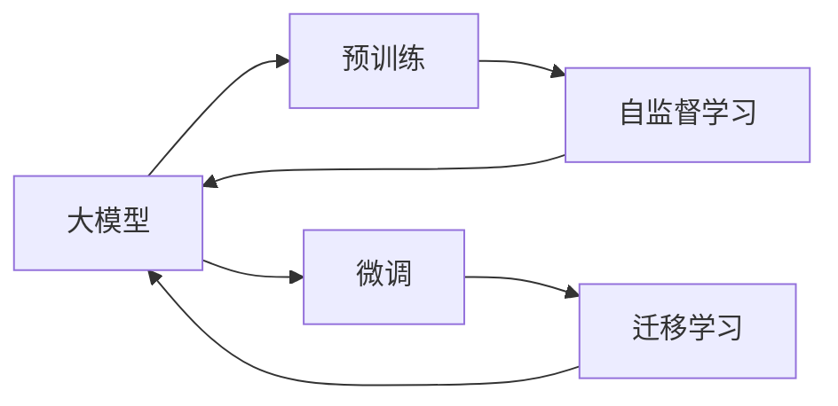

                 

## 1. 背景介绍

### 1.1 问题由来

随着深度学习技术的发展，人工智能(AI)大模型正成为科技公司与创业团队竞争的热点。大模型，特别是基于Transformer架构的预训练模型，通过在海量数据上进行自监督学习，形成了强大的语言理解与生成能力。这些模型已经在自然语言处理(NLP)、计算机视觉、语音识别等多个领域展现出卓越的性能。

近年来，众多创业团队聚焦于大模型技术的开发与应用，试图利用这些模型快速构建具备广泛通用性的AI产品，推动行业数字化转型。然而，大模型的开发与部署并非易事，伴随其高效表现而来的是一系列挑战与问题。本文将对大模型创业过程中所面临的挑战与机遇进行全面系统的分析、思考与探讨。

### 1.2 问题核心关键点

大模型创业的核心挑战在于如何高效地开发、训练、部署并维护大规模的AI模型，同时确保模型的高效性、稳定性和安全性。这些挑战主要体现在以下几个方面：

1. **数据与计算资源：** 训练大模型需要海量数据与高性能计算资源，这对创业团队的数据收集、存储与计算能力提出了高要求。
2. **算法复杂度：** 大模型的训练与微调算法复杂，需要丰富的算法积累与实践经验。
3. **模型性能与效率：** 大模型往往具有较大的参数规模与较长的推理时间，影响用户体验与产品效率。
4. **安全性与隐私保护：** 大模型涉及大量敏感数据，如何保障数据隐私与模型安全性是重要课题。
5. **可解释性与透明性：** 模型的决策过程复杂，如何提供透明的解释与可解释性，增加用户信任。
6. **产业化挑战：** 如何将大模型有效应用于实际场景，提升业务价值，实现商业变现。

本文将围绕这些关键点，深入分析大模型创业的挑战与机遇，探讨可能的解决方案与应对策略。

## 2. 核心概念与联系

### 2.1 核心概念概述

为更好理解大模型创业的挑战与机遇，需对几个核心概念进行概述：

- **大模型(Large Model)：** 指参数规模大、功能强大的深度学习模型，如GPT-3、BERT等。这些模型通常以Transformer架构为骨干，通过在大规模数据上预训练，具备强大的语言理解与生成能力。
- **预训练(Pre-training)：** 指在大规模无标签数据上进行自监督学习，使模型获得通用的语言表示。
- **微调(Fine-tuning)：** 指在预训练模型的基础上，针对特定任务进行训练，优化模型在该任务上的表现。
- **迁移学习(Transfer Learning)：** 指将一个领域的知识迁移到另一个领域的策略，大模型预训练-微调即是典型的迁移学习应用。
- **自监督学习(Self-supervised Learning)：** 指通过设计任务，利用无标签数据训练模型，减少对标注数据的依赖。
- **计算图(Computation Graph)：** 描述模型计算过程的图结构，深度学习模型通过计算图实现前向传播与反向传播。

这些概念之间存在密切联系，共同构成了大模型创业的技术框架。以下是一个Mermaid流程图，展示了这些概念之间的相互关系：



通过理解这些核心概念，我们可以更好地把握大模型创业的技术要点与挑战。

## 3. 核心算法原理 & 具体操作步骤

### 3.1 算法原理概述

大模型创业的核心在于如何高效利用这些预训练模型的优势，同时应对数据、计算、算法等方面的挑战。以NLP领域的大模型为例，其创业流程大致包括以下几个步骤：

1. **数据准备：** 收集并预处理用于模型训练的标注数据集，确保数据的多样性与代表性。
2. **模型选择与加载：** 选择适合的预训练模型，如GPT-3、BERT等，并在开发环境中部署加载。
3. **微调模型：** 在预训练模型的基础上，使用标注数据集进行微调，优化模型在特定任务上的表现。
4. **模型部署与集成：** 将微调后的模型集成到实际应用系统中，如聊天机器人、文本生成器等。
5. **效果评估与迭代优化：** 在实际应用中不断收集用户反馈，评估模型效果，进行模型迭代与优化。

### 3.2 算法步骤详解

#### 3.2.1 数据准备

数据是大模型创业的基础，其准备过程包括数据收集、数据清洗、数据增强等多个环节：

1. **数据收集：** 收集与任务相关的标注数据，如文本分类、命名实体识别等任务的数据集。
2. **数据清洗：** 清洗数据，去除噪音与异常值，确保数据质量。
3. **数据增强：** 通过数据扩充技术，如回译、同义词替换等，增加数据多样性，避免过拟合。

#### 3.2.2 模型选择与加载

选择合适的预训练模型是创业成功的关键之一：

1. **模型选择：** 根据任务需求选择合适的预训练模型。如GPT-3适用于文本生成，BERT适用于命名实体识别。
2. **模型加载：** 使用深度学习框架（如PyTorch、TensorFlow等）加载模型，并进行必要的预处理，如参数初始化、动态图构建等。

#### 3.2.3 微调模型

模型微调是提高大模型在特定任务上表现的核心步骤：

1. **模型适配：** 根据任务需求，在预训练模型的顶层添加任务相关的输出层与损失函数。
2. **模型训练：** 使用标注数据集训练模型，选择合适的优化器（如AdamW、SGD等）与学习率，避免过拟合。
3. **效果评估：** 在验证集上评估模型性能，调整超参数，优化模型表现。

#### 3.2.4 模型部署与集成

将微调后的模型集成到实际应用系统中，需考虑模型性能与系统架构：

1. **模型裁剪与压缩：** 针对应用场景，对模型进行裁剪与压缩，减小模型参数量与推理时间。
2. **模型部署：** 将模型部署到服务器、云平台等环境中，确保模型稳定运行。
3. **系统集成：** 将模型嵌入应用系统，如聊天机器人、文本摘要器等，提供API接口供用户调用。

#### 3.2.5 效果评估与迭代优化

模型上线后，需持续收集用户反馈，进行效果评估与迭代优化：

1. **用户反馈收集：** 通过问卷调查、用户反馈等方式收集模型表现数据。
2. **效果评估：** 使用评估指标（如精确率、召回率、F1值等）评估模型效果。
3. **模型优化：** 根据评估结果，进行模型参数调整、数据增强等优化操作。

### 3.3 算法优缺点

大模型创业在带来诸多机遇的同时，也存在诸多挑战：

**优点：**

1. **高性能表现：** 大模型在特定任务上表现优异，可快速提升产品性能。
2. **通用性：** 预训练模型适用于多种任务，减少从头开发的成本与时间。
3. **灵活性：** 微调方法可针对特定任务进行优化，提升模型针对性。
4. **可扩展性：** 大模型适用于多种行业领域，具有广阔的应用前景。

**缺点：**

1. **数据依赖：** 微调模型依赖于标注数据，数据收集与处理成本高。
2. **计算资源要求高：** 大模型训练与推理需要高性能计算资源，创业团队需投入大量资金。
3. **模型复杂度：** 大模型训练与微调算法复杂，需具备丰富的算法经验与技术积累。
4. **安全性与隐私保护：** 大模型涉及敏感数据，需加强数据隐私保护与模型安全性。
5. **可解释性：** 大模型决策过程复杂，需提供透明的解释与可解释性，增加用户信任。
6. **产业化挑战：** 如何将模型有效应用于实际场景，提升业务价值，实现商业变现，仍需进一步探索。

### 3.4 算法应用领域

大模型创业技术已在多个行业领域得到广泛应用，涵盖自然语言处理、计算机视觉、语音识别等多个方向。以下是几个典型应用场景：

1. **自然语言处理(NLP)：** 聊天机器人、文本生成、文本分类、命名实体识别、问答系统等。
2. **计算机视觉(CV)：** 图像分类、物体检测、图像生成、视频分析等。
3. **语音识别(SR)：** 语音转文本、语音情感识别、语音翻译等。
4. **医疗健康：** 医学影像分析、疾病诊断、智能问诊等。
5. **金融行业：** 风险评估、欺诈检测、投资咨询等。
6. **教育领域：** 智能辅导、作业批改、知识推荐等。

## 4. 数学模型和公式 & 详细讲解  
### 4.1 数学模型构建

#### 4.1.1 定义

假设大模型为 $M_{\theta}$，其中 $\theta$ 为模型参数。假定有 $N$ 个标注数据 $\{(x_i, y_i)\}_{i=1}^N$，其中 $x_i$ 为输入，$y_i$ 为标签。

微调目标为最小化经验风险 $\mathcal{L}(\theta)$，其中：

$$
\mathcal{L}(\theta) = \frac{1}{N}\sum_{i=1}^N \ell(M_{\theta}(x_i),y_i)
$$

其中 $\ell$ 为损失函数，$\ell(M_{\theta}(x_i),y_i)$ 表示模型 $M_{\theta}$ 在输入 $x_i$ 上输出的预测值与真实标签 $y_i$ 的差异。

#### 4.1.2 实例

以文本分类任务为例，假设输入为文本 $x$，输出为标签 $y$，微调目标为最小化交叉熵损失：

$$
\mathcal{L}(\theta) = -\frac{1}{N}\sum_{i=1}^N [y_i\log M_{\theta}(x_i)+(1-y_i)\log(1-M_{\theta}(x_i))]
$$

其中 $M_{\theta}(x)$ 为模型在输入 $x$ 上的输出概率分布，$\log$ 为对数函数。

### 4.2 公式推导过程

#### 4.2.1 交叉熵损失

交叉熵损失函数定义为：

$$
\ell(M_{\theta}(x),y) = -[y\log M_{\theta}(x_i)+(1-y)\log(1-M_{\theta}(x_i))]
$$

其导数为：

$$
\frac{\partial \ell(M_{\theta}(x),y)}{\partial \theta} = -\frac{y}{M_{\theta}(x)}-\frac{1-y}{1-M_{\theta}(x)}
$$

利用链式法则，损失函数对参数 $\theta$ 的梯度为：

$$
\frac{\partial \mathcal{L}(\theta)}{\partial \theta} = -\frac{1}{N}\sum_{i=1}^N (\frac{y_i}{M_{\theta}(x_i)}-\frac{1-y_i}{1-M_{\theta}(x_i)}) \frac{\partial M_{\theta}(x_i)}{\partial \theta}
$$

其中 $\frac{\partial M_{\theta}(x_i)}{\partial \theta}$ 可通过反向传播算法高效计算。

### 4.3 案例分析与讲解

#### 4.3.1 实例：文本分类

假设任务为文本分类，输入为文本 $x$，输出为标签 $y$，微调目标为最小化交叉熵损失：

1. **数据准备：** 收集文本分类数据集，并进行预处理。
2. **模型选择与加载：** 选择预训练的BERT模型，加载模型并进行必要的预处理。
3. **模型适配：** 在模型顶部添加线性分类器与交叉熵损失函数。
4. **模型训练：** 使用标注数据集训练模型，调整学习率与批大小等超参数，避免过拟合。
5. **效果评估：** 在验证集上评估模型性能，调整超参数，优化模型表现。
6. **模型部署与集成：** 将模型部署到实际应用中，提供API接口供用户调用。

## 5. 项目实践：代码实例和详细解释说明

### 5.1 开发环境搭建

开发环境搭建是大模型创业的基础，以下是一个典型的Python开发环境配置流程：

1. **安装Anaconda：** 从官网下载并安装Anaconda，创建独立的Python环境。
```bash
conda create -n pytorch-env python=3.8
conda activate pytorch-env
```

2. **安装PyTorch：** 从官网获取对应的安装命令，如：
```bash
conda install pytorch torchvision torchaudio cudatoolkit=11.1 -c pytorch -c conda-forge
```

3. **安装Transformers库：** 
```bash
pip install transformers
```

4. **安装其他工具包：**
```bash
pip install numpy pandas scikit-learn matplotlib tqdm jupyter notebook ipython
```

完成上述步骤后，即可在 `pytorch-env` 环境中进行开发。

### 5.2 源代码详细实现

以下是一个简单的Python代码示例，用于文本分类任务的大模型微调：

```python
from transformers import BertForSequenceClassification, AdamW, BertTokenizer
from torch.utils.data import DataLoader, Dataset
import torch

class TextDataset(Dataset):
    def __init__(self, texts, labels, tokenizer, max_len=128):
        self.texts = texts
        self.labels = labels
        self.tokenizer = tokenizer
        self.max_len = max_len
        
    def __len__(self):
        return len(self.texts)
    
    def __getitem__(self, item):
        text = self.texts[item]
        label = self.labels[item]
        
        encoding = self.tokenizer(text, return_tensors='pt', max_length=self.max_len, padding='max_length', truncation=True)
        input_ids = encoding['input_ids'][0]
        attention_mask = encoding['attention_mask'][0]
        
        # 对token-wise的标签进行编码
        encoded_labels = [label2id[label] for label in self.labels] 
        encoded_labels.extend([label2id['O']] * (self.max_len - len(encoded_labels)))
        labels = torch.tensor(encoded_labels, dtype=torch.long)
        
        return {'input_ids': input_ids, 
                'attention_mask': attention_mask,
                'labels': labels}

# 标签与id的映射
label2id = {'O': 0, 'C': 1}  # 假设只有两个类别
id2label = {v: k for k, v in label2id.items()}

# 创建dataset
tokenizer = BertTokenizer.from_pretrained('bert-base-cased')

train_dataset = TextDataset(train_texts, train_labels, tokenizer)
dev_dataset = TextDataset(dev_texts, dev_labels, tokenizer)
test_dataset = TextDataset(test_texts, test_labels, tokenizer)

# 定义模型和优化器
model = BertForSequenceClassification.from_pretrained('bert-base-cased', num_labels=len(label2id))

optimizer = AdamW(model.parameters(), lr=2e-5)

# 训练与评估函数
device = torch.device('cuda') if torch.cuda.is_available() else torch.device('cpu')
model.to(device)

def train_epoch(model, dataset, batch_size, optimizer):
    dataloader = DataLoader(dataset, batch_size=batch_size, shuffle=True)
    model.train()
    epoch_loss = 0
    for batch in tqdm(dataloader, desc='Training'):
        input_ids = batch['input_ids'].to(device)
        attention_mask = batch['attention_mask'].to(device)
        labels = batch['labels'].to(device)
        model.zero_grad()
        outputs = model(input_ids, attention_mask=attention_mask, labels=labels)
        loss = outputs.loss
        epoch_loss += loss.item()
        loss.backward()
        optimizer.step()
    return epoch_loss / len(dataloader)

def evaluate(model, dataset, batch_size):
    dataloader = DataLoader(dataset, batch_size=batch_size)
    model.eval()
    preds, labels = [], []
    with torch.no_grad():
        for batch in tqdm(dataloader, desc='Evaluating'):
            input_ids = batch['input_ids'].to(device)
            attention_mask = batch['attention_mask'].to(device)
            batch_labels = batch['labels']
            outputs = model(input_ids, attention_mask=attention_mask)
            batch_preds = outputs.logits.argmax(dim=2).to('cpu').tolist()
            batch_labels = batch_labels.to('cpu').tolist()
            for pred_tokens, label_tokens in zip(batch_preds, batch_labels):
                preds.append(pred_tokens[:len(label_tokens)])
                labels.append(label_tokens)
                
    print(classification_report(labels, preds))

# 训练与评估流程
epochs = 5
batch_size = 16

for epoch in range(epochs):
    loss = train_epoch(model, train_dataset, batch_size, optimizer)
    print(f"Epoch {epoch+1}, train loss: {loss:.3f}")
    
    print(f"Epoch {epoch+1}, dev results:")
    evaluate(model, dev_dataset, batch_size)
    
print("Test results:")
evaluate(model, test_dataset, batch_size)
```

### 5.3 代码解读与分析

以上代码示例展示了一个基本的文本分类任务的微调流程。具体分析如下：

1. **TextDataset类：** 用于数据处理，将文本数据转换为模型可用的输入格式。
2. **label2id和id2label字典：** 定义标签与数字id之间的映射关系。
3. **训练与评估函数：** 使用PyTorch的DataLoader对数据集进行批次化加载，供模型训练和推理使用。
4. **训练流程：** 定义总的epoch数和batch size，开始循环迭代。
5. **效果评估：** 在验证集和测试集上评估模型性能。

### 5.4 运行结果展示

在实际应用中，可以通过可视化工具（如TensorBoard）监控模型训练过程中的各项指标，如损失、准确率等，确保模型稳定收敛。

## 6. 实际应用场景

### 6.1 智能客服系统

智能客服系统是AI大模型创业的热门应用场景之一，旨在提升客户咨询体验，提高服务效率。

#### 6.1.1 数据准备

收集企业内部的历史客服对话记录，将问题和最佳答复构建成监督数据，用于训练模型。

#### 6.1.2 模型训练与微调

选择预训练的对话模型（如GPT-3、MPLUGO等），在对话数据集上微调模型。

#### 6.1.3 模型部署

将微调后的模型集成到客服系统中，使用户能够与AI客服进行自然对话。

### 6.2 金融舆情监测

金融舆情监测是AI大模型创业的另一重要应用，帮助金融机构及时监测市场舆论动向，规避金融风险。

#### 6.2.1 数据准备

收集金融领域相关的新闻、报道、评论等文本数据，并进行主题标注和情感标注。

#### 6.2.2 模型训练与微调

选择预训练的文本分类模型（如BERT、RoBERTa等），在标注数据集上微调模型。

#### 6.2.3 模型部署

将微调后的模型集成到舆情监测系统中，实时监测市场舆情变化。

### 6.3 个性化推荐系统

个性化推荐系统是AI大模型创业的另一热门应用，帮助用户发现感兴趣的物品。

#### 6.3.1 数据准备

收集用户浏览、点击、评论、分享等行为数据，提取物品的标题、描述、标签等文本内容。

#### 6.3.2 模型训练与微调

选择预训练的文本分类模型（如BERT、RoBERTa等），在标注数据集上微调模型。

#### 6.3.3 模型部署

将微调后的模型集成到推荐系统中，为用户提供个性化推荐。

## 7. 工具和资源推荐

### 7.1 学习资源推荐

为帮助开发者掌握大模型微调的理论基础与实践技巧，以下是几个推荐的资源：

1. **《Transformer from Principle to Practice》系列博文：** 深入浅出地介绍了Transformer原理、BERT模型、微调技术等前沿话题。
2. **CS224N《Deep Learning for NLP》课程：** 斯坦福大学开设的NLP明星课程，提供Lecture视频和配套作业，带入门NLP领域的基本概念和经典模型。
3. **《Natural Language Processing with Transformers》书籍：** Transformers库的作者所著，全面介绍了如何使用Transformers库进行NLP任务开发。
4. **HuggingFace官方文档：** Transformers库的官方文档，提供海量预训练模型和完整的微调样例代码。
5. **CLUE开源项目：** 中文语言理解测评基准，涵盖大量不同类型的中文NLP数据集，并提供了基于微调的baseline模型。

### 7.2 开发工具推荐

以下是几款常用的开发工具，用于大模型微调的开发与部署：

1. **PyTorch：** 基于Python的开源深度学习框架，适合快速迭代研究。
2. **TensorFlow：** 由Google主导开发的开源深度学习框架，适合大规模工程应用。
3. **Transformers库：** HuggingFace开发的NLP工具库，支持多种预训练模型。
4. **Weights & Biases：** 模型训练的实验跟踪工具，记录和可视化模型训练过程中的各项指标。
5. **TensorBoard：** TensorFlow配套的可视化工具，实时监测模型训练状态。

### 7.3 相关论文推荐

大模型微调技术的不断发展源于学界的持续研究，以下是几篇重要的相关论文，推荐阅读：

1. **Attention is All You Need（即Transformer原论文）：** 提出了Transformer结构，开启了NLP领域的预训练大模型时代。
2. **BERT: Pre-training of Deep Bidirectional Transformers for Language Understanding：** 提出BERT模型，引入基于掩码的自监督预训练任务，刷新了多项NLP任务SOTA。
3. **Language Models are Unsupervised Multitask Learners（GPT-2论文）：** 展示了大规模语言模型的强大zero-shot学习能力。
4. **Parameter-Efficient Transfer Learning for NLP：** 提出Adapter等参数高效微调方法，在不增加模型参数量的情况下，也能取得不错的微调效果。
5. **Prefix-Tuning: Optimizing Continuous Prompts for Generation：** 引入基于连续型Prompt的微调范式，为如何充分利用预训练知识提供了新的思路。
6. **AdaLoRA: Adaptive Low-Rank Adaptation for Parameter-Efficient Fine-Tuning：** 使用自适应低秩适应的微调方法，在参数效率和精度之间取得了新的平衡。

## 8. 总结：未来发展趋势与挑战

### 8.1 总结

本文系统分析了基于大模型的创业挑战与机遇，从数据准备、模型选择、微调训练到模型部署，全面介绍了大模型创业的流程与技术要点。通过深入理解这些关键概念与技术，相信读者能更好地把握大模型创业的核心内容，并应用于实际场景中。

### 8.2 未来发展趋势

展望未来，大模型创业技术将呈现以下几个发展趋势：

1. **模型规模持续增大：** 预训练模型参数量将持续增长，带来更高的语言理解与生成能力。
2. **微调方法日趋多样化：** 未来将出现更多参数高效的微调方法，如Prefix-Tuning、LoRA等，在保证模型性能的同时，减少计算资源消耗。
3. **持续学习成为常态：** 大模型需不断学习新数据，保持性能与时俱进。
4. **数据依赖降低：** 无监督和半监督微调方法将逐渐普及，减少对标注样本的依赖。
5. **多模态微调崛起：** 大模型将更好地整合视觉、语音等多模态信息，提升跨领域迁移能力。
6. **通用性增强：** 大模型将具备更强的常识推理和跨领域迁移能力，逐步迈向通用人工智能。

### 8.3 面临的挑战

尽管大模型创业技术发展迅速，但仍面临诸多挑战：

1. **数据与计算资源：** 数据收集与计算资源投入高，创业团队需投入大量资金。
2. **模型复杂度：** 训练与微调算法复杂，需具备丰富的算法经验与技术积累。
3. **模型性能与效率：** 大模型推理时间较长，影响用户体验。
4. **安全性与隐私保护：** 大模型涉及敏感数据，需加强数据隐私保护与模型安全性。
5. **可解释性：** 大模型决策过程复杂，需提供透明的解释与可解释性。
6. **产业化挑战：** 如何将模型有效应用于实际场景，提升业务价值。

### 8.4 研究展望

面对这些挑战，未来的研究需从以下几个方面寻求突破：

1. **探索无监督和半监督微调方法：** 减少对标注样本的依赖，利用自监督学习、主动学习等方法。
2. **研究参数高效与计算高效的微调范式：** 开发更多参数高效的微调方法，提高模型性能与推理效率。
3. **融合因果与对比学习：** 增强模型建立稳定因果关系的能力，学习更加普适的语言表征。
4. **引入更多先验知识：** 将符号化的先验知识与神经网络模型结合，提升模型的通用性与鲁棒性。
5. **纳入伦理道德约束：** 在模型训练目标中引入伦理导向的评估指标，确保模型输出符合人类价值观和伦理道德。

通过这些研究方向的探索，相信大模型创业技术将迈向更高的台阶，为构建安全、可靠、可解释、可控的智能系统铺平道路。面向未来，需从数据、算法、工程、业务等多个维度协同发力，共同推动自然语言理解和智能交互系统的进步。

## 9. 附录：常见问题与解答

### Q1：大模型创业是否适用于所有NLP任务？

A: 大模型创业技术在大多数NLP任务上都能取得不错的效果，特别是对于数据量较小的任务。但对于一些特定领域的任务，如医学、法律等，仅依靠通用语料预训练的模型可能难以很好地适应。此时需要在特定领域语料上进一步预训练，再进行微调，才能获得理想效果。

### Q2：微调过程中如何选择合适的学习率？

A: 微调的学习率一般要比预训练时小1-2个数量级，如果使用过大的学习率，容易破坏预训练权重，导致过拟合。一般建议从1e-5开始调参，逐步减小学习率，直至收敛。

### Q3：采用大模型微调时会面临哪些资源瓶颈？

A: 大模型训练与推理需要高性能计算资源，创业团队需投入大量资金。GPU/TPU等高性能设备是必不可少的，但即便如此，超大批次的训练和推理也可能遇到显存不足的问题。

### Q4：如何缓解微调过程中的过拟合问题？

A: 常见的缓解策略包括数据增强、正则化、对抗训练等方法。

### Q5：如何提高大模型微调的效率？

A: 采用参数高效微调方法，如Prefix-Tuning、LoRA等，减少需优化的参数量。

### Q6：大模型创业的商业变现方式有哪些？

A: 大模型创业的商业变现方式包括SaaS、API接口、数据服务等。

通过本文的系统分析，相信读者能更好地把握大模型创业的核心要点，理解其面临的挑战与机遇，并从中寻找到新的突破方向。

