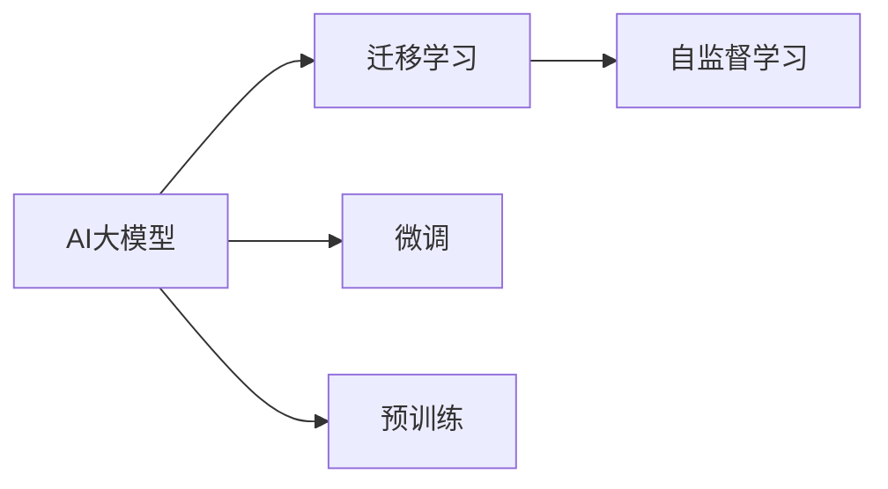

                 

# AI大模型创业：泡沫还是金矿？分析、思考与探讨

## 1. 背景介绍

在过去的几年中，人工智能大模型（AI Large Models, AI Large Models）的迅速崛起，给科技创业界带来了前所未有的热情与关注。这些大模型凭借其巨型的参数规模和卓越的泛化能力，在自然语言处理、图像识别、生成式内容创作等多个领域取得了突破性的进展。然而，随着市场的不断扩大，大模型创业所面临的挑战也愈发严峻。本文将从背景介绍、核心概念与联系、核心算法原理与操作步骤、数学模型和公式、项目实践、实际应用场景、工具和资源推荐、总结与展望等方面，对大模型创业的现状与未来进行深入分析、思考与探讨。

## 2. 核心概念与联系

### 2.1 核心概念概述

在大模型创业的讨论中，以下几个核心概念是不可或缺的：

- **AI大模型（AI Large Models）**：指的是参数规模达到数亿甚至数十亿的深度学习模型。这些模型能够学习到复杂的语言和视觉特征，并应用于诸如自然语言处理、计算机视觉、推荐系统等领域。
- **迁移学习（Transfer Learning）**：指利用已有的大模型在某项任务上的预训练成果，应用于新的、规模较小的数据集上，快速提升模型性能的方法。
- **微调（Fine-Tuning）**：在大模型的基础上，通过添加或修改部分层，使其适应新的特定任务，以优化模型在特定任务上的表现。
- **预训练（Pre-training）**：指在大规模无标注数据上对模型进行预训练，使其学习到通用的语言或视觉表示。
- **自监督学习（Self-Supervised Learning）**：一种利用数据的隐含信息进行无监督训练的技术，能够减少对标注数据的依赖，提高模型的泛化能力。

### 2.2 核心概念原理和架构的 Mermaid 流程图

以下是这些核心概念的 Mermaid 流程图，展示了它们之间的联系：



## 3. 核心算法原理 & 具体操作步骤

### 3.1 算法原理概述

AI大模型的核心算法原理主要基于深度神经网络，特别是Transformer架构。在大模型的预训练过程中，通过对大规模无标注数据进行自监督学习，模型学习到语言的上下文关系、词义关系等通用知识。在微调阶段，通过有监督学习，模型能够适应特定的任务需求，从而提升任务的性能。

### 3.2 算法步骤详解

1. **数据准备**：收集、处理和标注任务相关的数据，确保数据的质量和多样性。
2. **模型选择**：选择适当的预训练模型作为微调的起点。
3. **任务适配**：根据任务需求，设计或选择适合的任务适配层，如分类层、生成器等。
4. **模型微调**：在微调过程中，使用优化算法（如Adam、SGD等）对模型参数进行调整，以达到最优性能。
5. **模型评估**：在验证集上评估模型性能，并根据需要进行调整。
6. **模型部署**：将微调后的模型部署到生产环境中，进行实际应用。

### 3.3 算法优缺点

AI大模型及其微调技术具有以下优点：

- **通用性强**：预训练模型可以在多个任务上取得良好的性能，减少从头开始训练的难度和成本。
- **泛化能力强**：通过自监督学习，模型能够学习到通用的语言或视觉表示，适用于多样化的应用场景。
- **可扩展性强**：微调过程灵活，可以根据任务需求进行调整。

然而，也存在一些缺点：

- **计算资源要求高**：训练和微调大模型需要大量计算资源，包括GPU/TPU等硬件设备。
- **标注成本高**：微调模型需要大量高质量的标注数据，标注成本较高。
- **模型复杂度高**：大模型参数众多，模型复杂度较高，调试和优化难度大。

### 3.4 算法应用领域

AI大模型及其微调技术已经在自然语言处理、计算机视觉、推荐系统等多个领域得到了广泛应用：

- **自然语言处理**：包括文本分类、命名实体识别、机器翻译等任务。
- **计算机视觉**：如图像识别、图像生成、视频分析等。
- **推荐系统**：如商品推荐、新闻推荐等。
- **自动驾驶**：如环境感知、路径规划等。
- **金融科技**：如风险评估、客户服务机器人等。

## 4. 数学模型和公式 & 详细讲解 & 举例说明

### 4.1 数学模型构建

在大模型的预训练过程中，通常使用自监督学习任务，如语言建模、掩码语言模型等。以BERT为例，其数学模型可以表示为：

$$
\mathcal{L}_{\text{pre}}(\theta) = -\frac{1}{N}\sum_{i=1}^{N}\sum_{j=1}^{L}[\log p(w_i|w_{i-1}, ..., w_{i-L})]
$$

其中，$L$为上下文长度，$\theta$为模型参数，$p$为概率分布函数。

### 4.2 公式推导过程

以BERT模型为例，其预训练过程包括掩码语言模型和下一句预测任务。具体推导过程如下：

1. **掩码语言模型**：
   $$
   \mathcal{L}_{\text{mask}}(\theta) = -\frac{1}{N}\sum_{i=1}^{N}\sum_{j=1}^{L} \log p(w_i|w_{i-1}, ..., w_{i-L}, \tilde{w}_i)
   $$
   其中，$\tilde{w}_i$为随机掩码词。

2. **下一句预测**：
   $$
   \mathcal{L}_{\text{next}}(\theta) = -\frac{1}{N}\sum_{i=1}^{N}\log p(\text{Next Sentence}|\text{Sentence})
   $$

### 4.3 案例分析与讲解

以情感分析任务为例，假设有两个句子："我非常喜欢这个产品"和"这个产品很糟糕"。使用BERT模型进行预训练后，可以将其表示为向量形式。通过微调，使模型能够预测句子情感类别（正面或负面）。具体步骤如下：

1. **数据准备**：收集包含情感标签的句子数据集。
2. **模型微调**：在预训练模型的基础上，添加一个全连接层作为分类器，并在训练集上进行微调。
3. **模型评估**：在验证集上评估模型性能，如准确率、召回率等指标。
4. **模型部署**：将微调后的模型应用于新的文本情感分析任务。

## 5. 项目实践：代码实例和详细解释说明

### 5.1 开发环境搭建

在搭建开发环境时，需要安装以下依赖：

- Python 3.7+
- PyTorch >= 1.7
- Transformers
- TorchText
- HuggingFace Hub

```bash
pip install torch torchvision transformers torchtext
```

### 5.2 源代码详细实现

以下是使用PyTorch和Transformers库进行情感分析任务微调的代码实现：

```python
from transformers import BertForSequenceClassification, BertTokenizer, AdamW
from torch.utils.data import Dataset, DataLoader
import torch.nn.functional as F

class SentimentDataset(Dataset):
    def __init__(self, texts, labels):
        self.texts = texts
        self.labels = labels
        self.tokenizer = BertTokenizer.from_pretrained('bert-base-uncased')

    def __len__(self):
        return len(self.texts)

    def __getitem__(self, idx):
        text = self.texts[idx]
        label = self.labels[idx]
        encoding = self.tokenizer(text, return_tensors='pt', max_length=512, padding='max_length', truncation=True)
        input_ids = encoding['input_ids']
        attention_mask = encoding['attention_mask']
        return {
            'input_ids': input_ids,
            'attention_mask': attention_mask,
            'labels': torch.tensor(label, dtype=torch.long)
        }

# 定义模型
model = BertForSequenceClassification.from_pretrained('bert-base-uncased', num_labels=2)

# 定义优化器
optimizer = AdamW(model.parameters(), lr=1e-5)

# 定义数据集
train_dataset = SentimentDataset(train_texts, train_labels)
test_dataset = SentimentDataset(test_texts, test_labels)

# 定义训练函数
def train(model, data_loader, optimizer, device):
    model.to(device)
    model.train()
    for epoch in range(epochs):
        for batch in data_loader:
            input_ids = batch['input_ids'].to(device)
            attention_mask = batch['attention_mask'].to(device)
            labels = batch['labels'].to(device)
            outputs = model(input_ids, attention_mask=attention_mask)
            loss = F.cross_entropy(outputs.logits, labels)
            optimizer.zero_grad()
            loss.backward()
            optimizer.step()
        print(f'Epoch {epoch+1}, loss: {loss:.4f}')

# 训练模型
device = torch.device('cuda') if torch.cuda.is_available() else torch.device('cpu')
train(train_dataset, train_loader, optimizer, device)

# 评估模型
model.eval()
test_loss = 0
test_corrects = 0
with torch.no_grad():
    for batch in test_loader:
        input_ids = batch['input_ids'].to(device)
        attention_mask = batch['attention_mask'].to(device)
        labels = batch['labels'].to(device)
        outputs = model(input_ids, attention_mask=attention_mask)
        test_loss += F.cross_entropy(outputs.logits, labels).item()
        test_corrects += (torch.argmax(outputs.logits, dim=1) == labels).sum().item()
print(f'Test loss: {test_loss/len(test_loader):.4f}, Test accuracy: {test_corrects/len(test_loader):.4f}')
```

### 5.3 代码解读与分析

- **SentimentDataset**：定义了一个数据集类，用于处理和预处理情感分析任务的文本数据。
- **BertForSequenceClassification**：选择了Bert模型，并将其用于序列分类任务。
- **AdamW**：使用了AdamW优化器，并在模型上进行微调。
- **train函数**：定义了训练函数，其中包括了模型的前向传播、损失计算和反向传播。
- **test函数**：定义了模型在测试集上的评估函数，计算了测试集上的损失和准确率。

## 6. 实际应用场景

### 6.1 金融科技

在金融科技领域，AI大模型及其微调技术可以用于风险评估、欺诈检测、客户服务等多个方面。例如，通过微调BERT模型，可以自动分析客户的交易记录和行为数据，预测潜在的欺诈风险，或为客户提供个性化的理财建议。

### 6.2 医疗健康

在医疗健康领域，AI大模型及其微调技术可以用于疾病诊断、基因分析、医疗影像分析等多个方面。例如，通过微调BERT模型，可以自动分析病人的病历记录，诊断出可能的疾病类型，或对医学影像进行自动解读，提高医生的诊断效率。

### 6.3 自动驾驶

在自动驾驶领域，AI大模型及其微调技术可以用于环境感知、路径规划、智能导航等多个方面。例如，通过微调BERT模型，可以自动分析道路上的交通情况，规划最优行驶路径，或识别路标和交通标志，提高自动驾驶的安全性和准确性。

### 6.4 未来应用展望

随着AI大模型的不断发展，其在多个领域的应用前景愈发广阔：

- **医疗健康**：用于疾病诊断、基因分析、医疗影像分析等多个方面。
- **金融科技**：用于风险评估、欺诈检测、客户服务等多个方面。
- **自动驾驶**：用于环境感知、路径规划、智能导航等多个方面。
- **教育培训**：用于智能辅导、知识推荐、情感分析等多个方面。
- **游戏娱乐**：用于生成内容、角色互动、情感识别等多个方面。

## 7. 工具和资源推荐

### 7.1 学习资源推荐

- 《深度学习》（Ian Goodfellow等）：全面介绍了深度学习的基本原理和算法。
- 《自然语言处理综论》（Daniel Jurafsky和James H. Martin）：介绍了NLP领域的核心概念和技术。
- 《机器学习实战》（Peter Harrington）：提供了丰富的机器学习实践案例，包括TensorFlow和PyTorch的使用。
- Coursera和edX等在线教育平台：提供了大量的深度学习和NLP课程，涵盖从基础到高级的内容。
- GitHub：提供了大量的开源项目和代码示例，可以帮助读者快速上手。

### 7.2 开发工具推荐

- Jupyter Notebook：用于编写和执行Python代码，支持交互式开发。
- TensorBoard：用于可视化模型的训练过程和结果，帮助开发者进行调优。
- Weights & Biases：用于跟踪和可视化模型的训练过程，帮助开发者进行实验管理和对比。
- Kaggle：提供了丰富的数据集和竞赛，可以帮助开发者进行实践和创新。

### 7.3 相关论文推荐

- "Attention is All You Need"（NeurIPS 2017）：提出了Transformer架构，奠定了大模型研究的基础。
- "BERT: Pre-training of Deep Bidirectional Transformers for Language Understanding"（NAACL 2019）：提出了BERT模型，展示了大模型在NLP任务上的强大能力。
- "GPT-3: Language Models are Unsupervised Multitask Learners"（NIPS 2018）：展示了GPT模型在生成式NLP任务上的卓越表现。
- "Super-Convergence: Very Fast Training of ResNets Using Large Mini-Batches"（NIPS 2017）：提出了超快收敛算法，提升了深度学习的训练效率。
- "Fine-Tuning Large Language Models for Question Answering"（ACL 2020）：展示了大模型在问答任务上的强大能力。

## 8. 总结：未来发展趋势与挑战

### 8.1 研究成果总结

AI大模型及其微调技术在自然语言处理、计算机视觉、推荐系统等多个领域取得了显著的进展，推动了人工智能技术的快速发展和应用。

### 8.2 未来发展趋势

未来AI大模型及其微调技术的发展趋势包括：

- **模型规模扩大**：随着算力的提升和数据量的增加，AI大模型的参数规模将继续扩大，能够学习到更加复杂的语言和视觉特征。
- **多模态融合**：AI大模型将进一步融合多模态信息，如文本、图像、语音等，提升其在不同场景下的应用能力。
- **可解释性增强**：AI大模型将更加注重其可解释性，帮助开发者理解和调试模型，提高模型的可信度。
- **自适应学习**：AI大模型将更加注重其自适应学习能力，能够根据环境变化和数据分布进行动态调整和优化。
- **联邦学习**：AI大模型将更多采用联邦学习的方式，保护用户隐私，提升模型安全性和可靠性。

### 8.3 面临的挑战

AI大模型及其微调技术面临的挑战包括：

- **计算资源限制**：AI大模型的训练和微调需要大量的计算资源，如GPU/TPU等，这限制了其在某些场景下的应用。
- **数据隐私保护**：AI大模型需要大量的数据进行训练和微调，如何保护用户隐私和数据安全成为重要的课题。
- **模型泛化能力**：AI大模型在特定场景下的表现往往不够理想，如何提高其泛化能力和鲁棒性是重要的研究方向。
- **算法公平性**：AI大模型在应用过程中可能存在偏见和歧视，如何确保算法的公平性和公正性需要更多的研究。
- **算法透明度**：AI大模型的决策过程较为复杂，如何提高其透明度和可解释性是一个亟待解决的问题。

### 8.4 研究展望

未来，AI大模型及其微调技术的研究方向包括：

- **多模态大模型**：融合多模态信息，提升模型在多种场景下的应用能力。
- **小样本学习**：研究如何在少量数据下进行模型训练和微调，提升模型泛化能力。
- **自适应学习**：研究模型如何根据环境变化和数据分布进行动态调整和优化，提升模型适应性。
- **算法公平性**：研究如何确保算法的公平性和公正性，保护用户隐私和数据安全。
- **可解释性**：研究如何提高模型的可解释性和透明度，提升用户信任度。

## 9. 附录：常见问题与解答

**Q1：AI大模型创业是否容易成功？**

A：AI大模型创业的成功与否取决于多个因素，包括市场需求、技术实力、商业模式等。大模型创业需要较高的技术门槛和资金投入，但同时也具备广阔的市场前景。

**Q2：如何评估AI大模型的性能？**

A：评估AI大模型的性能需要考虑多个指标，如准确率、召回率、F1值等。对于不同的应用场景，需要根据具体任务选择合适的评估指标。

**Q3：AI大模型在实际应用中需要注意哪些问题？**

A：AI大模型在实际应用中需要注意模型鲁棒性、数据隐私保护、模型泛化能力等问题。此外，还需要考虑模型训练和微调所需的时间和资源成本。

**Q4：AI大模型创业有哪些潜在的风险？**

A：AI大模型创业存在数据泄露、模型偏见、算法不透明等风险。如何保护用户隐私、确保模型公平性和透明度，是创业过程中需要注意的重要问题。

**Q5：AI大模型创业需要哪些关键资源？**

A：AI大模型创业需要高质量的数据集、高性能的计算资源、经验丰富的技术团队、清晰明了的商业模式等关键资源。

总之，AI大模型创业虽然面临诸多挑战，但同时也具备巨大的发展潜力和市场机遇。通过深入研究和不断优化，AI大模型及其微调技术有望在未来得到更广泛的应用和认可。

---

作者：禅与计算机程序设计艺术 / Zen and the Art of Computer Programming

