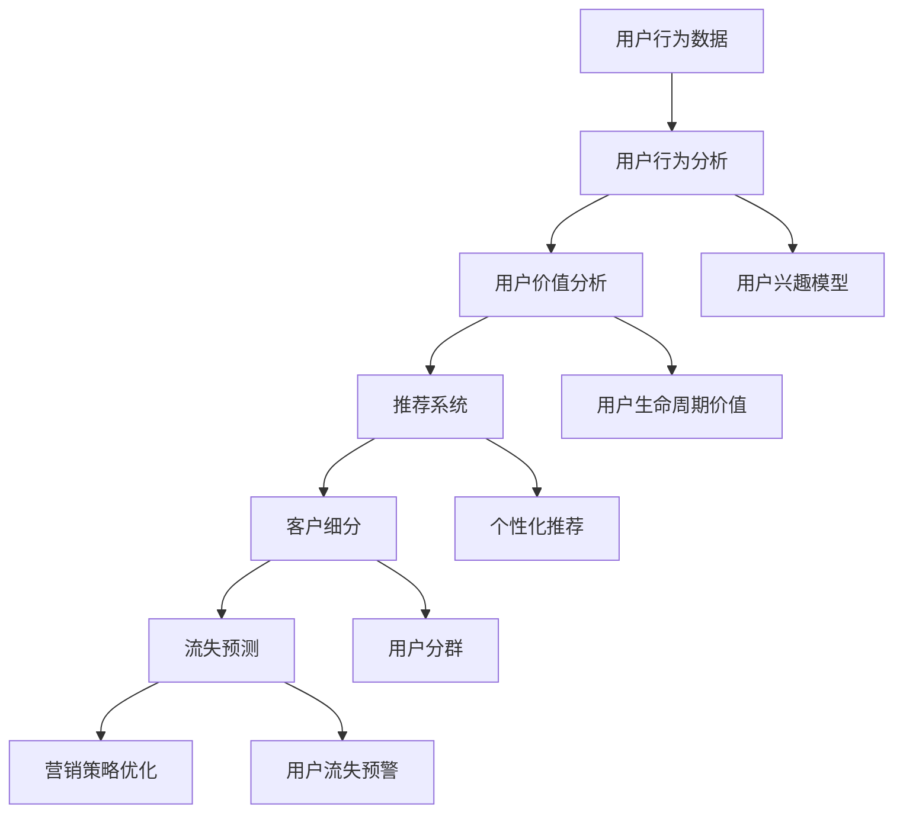

                 

# AI如何帮助电商企业进行用户价值分析

## 1. 背景介绍

随着电子商务的兴起，企业面临着日益激烈的市场竞争。电商企业在发展过程中需要关注的核心指标包括用户留存率、用户转化率、销售转化率、订单价值等。这些指标直接反映了用户的价值，是电商企业持续发展的重要保障。通过数据驱动的决策，企业可以更好地优化产品和服务，提升用户体验，进而增加企业的收入。

因此，如何准确分析用户价值，成为电商企业面临的重大挑战。AI技术，尤其是机器学习算法，为电商企业提供了有力的支持，能够帮助企业更好地理解用户行为和需求，从而提高用户价值。

## 2. 核心概念与联系

### 2.1 核心概念概述

为了更好地理解AI在电商企业用户价值分析中的应用，我们先要了解几个核心概念：

- **用户行为分析**：分析用户在不同场景下的行为模式，包括点击、浏览、购买、收藏等，以理解用户兴趣和需求。
- **用户价值分析**：通过量化用户行为，评估用户的长期价值，如消费金额、平均订单价值、生命周期价值等。
- **推荐系统**：根据用户行为数据，通过AI算法推荐符合用户兴趣的商品，从而提高用户转化率和订单价值。
- **客户细分**：将用户按照行为、属性等维度进行分类，便于制定个性化的营销策略。
- **流失预测**：预测用户流失的风险，及时采取措施挽留用户，降低流失率，提升用户留存率。

这些概念相互联系，共同构成了电商企业用户价值分析的基础框架。AI技术通过挖掘用户数据，自动发现其中的模式和规律，为电商企业提供强大的数据分析能力。

### 2.2 核心概念原理和架构的 Mermaid 流程图



此图展示了核心概念之间的联系。用户行为数据通过分析得到用户兴趣模型，进而用于推荐系统。用户价值分析通过量化用户行为，得出用户的生命周期价值。推荐系统根据个性化推荐提升用户转化率。客户细分通过用户分群，制定个性化的营销策略。流失预测通过预警用户流失，及时采取措施提升用户留存率。

## 3. 核心算法原理 & 具体操作步骤

### 3.1 算法原理概述

AI在电商企业用户价值分析中的主要算法原理包括以下几点：

- **协同过滤算法**：通过分析用户与商品之间的相似度，推荐用户可能感兴趣的商品。常用于推荐系统，提高用户转化率和订单价值。
- **内容推荐算法**：根据商品的属性和用户的行为，推荐符合用户兴趣的商品。常用于个性化推荐，提高用户满意度和粘性。
- **深度学习算法**：通过学习用户行为的复杂模式，预测用户流失风险，制定针对用户流失的预警和挽留策略。
- **聚类算法**：将用户按照兴趣、行为等维度进行分类，便于制定个性化的营销策略，提升用户价值。
- **关联规则挖掘**：分析用户购买行为，发现购买模式和关联规则，优化库存管理和营销策略。

这些算法原理共同构成了AI在电商企业用户价值分析中的基础框架。通过AI技术，电商企业可以更加深入地理解用户行为和需求，从而制定更加精准的营销策略，提升用户价值。

### 3.2 算法步骤详解

以协同过滤算法为例，以下是该算法的详细步骤：

**Step 1: 数据收集与预处理**
- 收集用户行为数据，包括浏览、购买、收藏等。
- 将数据进行清洗和预处理，去除噪音和无效数据。

**Step 2: 相似度计算**
- 根据用户行为数据，计算用户与商品之间的相似度。
- 常见的相似度计算方法包括余弦相似度、皮尔逊相关系数等。

**Step 3: 推荐列表生成**
- 根据相似度计算结果，生成推荐列表。
- 常见的推荐算法包括基于用户的协同过滤、基于物品的协同过滤等。

**Step 4: 模型评估**
- 使用评估指标（如准确率、召回率、F1值等）评估推荐系统的性能。
- 不断调整模型参数和推荐策略，提高推荐效果。

**Step 5: 部署与迭代**
- 将推荐系统部署到实际应用中。
- 定期收集用户反馈和行为数据，迭代优化推荐算法。

### 3.3 算法优缺点

协同过滤算法的优点包括：

- **高效性**：算法计算简单，可以处理大规模数据集。
- **泛化能力**：能够处理未见过的商品，发现用户可能感兴趣的新商品。
- **低成本**：无需额外的标注数据，仅需用户行为数据即可运行。

同时，协同过滤算法也存在一些缺点：

- **数据稀疏性**：用户行为数据可能稀疏，相似度计算结果不够准确。
- **冷启动问题**：新用户或新商品的相似度难以计算。
- **可扩展性**：随着数据量的增加，计算复杂度会上升。

为了克服这些缺点，研究人员提出了多种改进方法，如基于矩阵分解的协同过滤、基于深度学习的协同过滤等。

### 3.4 算法应用领域

AI在电商企业用户价值分析中的应用领域主要包括：

- **个性化推荐**：根据用户行为数据，推荐符合用户兴趣的商品，提升用户转化率和订单价值。
- **流失预测**：预测用户流失风险，及时采取措施挽留用户，降低流失率，提升用户留存率。
- **客户细分**：通过聚类算法将用户按照兴趣、行为等维度进行分类，制定个性化的营销策略，提升用户价值。
- **需求预测**：通过分析用户行为数据，预测用户未来的需求，优化库存管理和营销策略。
- **交叉销售**：发现用户购买行为中的关联规则，提升用户的购买频率和价值。

## 4. 数学模型和公式 & 详细讲解 & 举例说明

### 4.1 数学模型构建

为了更好地理解协同过滤算法的数学原理，我们构建以下模型：

设用户集为 $U$，商品集为 $I$，用户对商品的评分矩阵为 $R \in \mathbb{R}^{m \times n}$，其中 $m$ 为用户数量，$n$ 为商品数量。协同过滤算法的目标是通过用户行为数据 $R$，预测用户 $u$ 对未评价商品 $i$ 的评分 $r_{ui}$。

### 4.2 公式推导过程

协同过滤算法常见的有两种形式：基于用户的协同过滤和基于物品的协同过滤。以基于用户的协同过滤为例，推导如下：

**基于用户的协同过滤**
设用户 $u$ 的邻居集为 $N(u)$，则用户 $u$ 对商品 $i$ 的预测评分公式为：

$$
\hat{r}_{ui} = \sum_{v \in N(u)} \frac{r_{vi} r_{uv}}{\sqrt{ \sum_{j=1}^{n} r_{vj}^2} \sqrt{ \sum_{k=1}^{m} r_{ku}^2}} 
$$

其中，$\hat{r}_{ui}$ 为预测评分，$r_{vi}$ 为用户 $v$ 对商品 $i$ 的评分，$r_{uv}$ 为用户 $u$ 对用户 $v$ 的评分，$\sum_{j=1}^{n} r_{vj}^2$ 和 $\sum_{k=1}^{m} r_{ku}^2$ 分别为用户 $v$ 和用户 $u$ 的评分平方和。

**基于物品的协同过滤**
基于物品的协同过滤公式与基于用户的协同过滤类似，但使用物品的相似度矩阵 $S \in \mathbb{R}^{n \times n}$ 代替用户评分矩阵 $R$，并计算用户 $u$ 对商品 $i$ 的预测评分公式为：

$$
\hat{r}_{ui} = \sum_{j=1}^{n} s_{ij} \frac{r_{uj}}{\sqrt{ \sum_{k=1}^{n} r_{ik}^2} \sqrt{ \sum_{l=1}^{n} r_{jl}^2}} 
$$

其中，$s_{ij}$ 为物品 $i$ 和物品 $j$ 的相似度，$r_{uj}$ 为用户 $u$ 对物品 $j$ 的评分，$r_{ik}$ 和 $r_{jl}$ 分别为物品 $i$ 和物品 $j$ 的评分。

### 4.3 案例分析与讲解

假设电商企业有 10000 个用户和 10000 个商品，每个用户对商品有一个评分（1-5 分），我们可以使用协同过滤算法为用户推荐新的商品。

**基于用户的协同过滤**：
1. 计算每个用户的邻居集。
2. 计算每个用户和邻居的评分平方和。
3. 根据相似度计算公式，计算每个用户对每个商品的预测评分。
4. 对预测评分进行排序，推荐评分较高的商品。

**基于物品的协同过滤**：
1. 计算每个物品的相似度矩阵。
2. 计算每个物品和邻居的评分平方和。
3. 根据相似度计算公式，计算每个用户对每个物品的预测评分。
4. 对预测评分进行排序，推荐评分较高的商品。

## 5. 项目实践：代码实例和详细解释说明

### 5.1 开发环境搭建

在进行协同过滤算法实践前，我们需要准备好开发环境。以下是使用Python进行Scikit-Learn开发的环境配置流程：

1. 安装Anaconda：从官网下载并安装Anaconda，用于创建独立的Python环境。

2. 创建并激活虚拟环境：
```bash
conda create -n scikit-learn-env python=3.8 
conda activate scikit-learn-env
```

3. 安装Scikit-Learn：
```bash
conda install scikit-learn
```

4. 安装各类工具包：
```bash
pip install numpy pandas matplotlib seaborn 
```

5. 安装Jupyter Notebook：
```bash
pip install jupyter notebook
```

完成上述步骤后，即可在`scikit-learn-env`环境中开始协同过滤算法的实践。

### 5.2 源代码详细实现

以下是使用Scikit-Learn库实现基于用户的协同过滤算法的Python代码：

```python
from sklearn.metrics.pairwise import cosine_similarity
from sklearn.neighbors import NearestNeighbors

# 构建用户-商品评分矩阵
R = [[3, 4, 2, 5, 1],
     [4, 5, 3, 2, 5],
     [2, 4, 5, 3, 4],
     [5, 3, 2, 4, 5],
     [1, 2, 4, 3, 5]]

# 计算用户邻居
def find_neighbors(R, user_idx):
    # 去除用户自身评分，构建评分矩阵的子矩阵
    sub_matrix = np.delete(R, user_idx, axis=0)
    # 计算用户与商品间的余弦相似度
    similarity = cosine_similarity(sub_matrix[user_idx, :], sub_matrix)
    # 根据相似度对商品进行排序
    indices = np.argsort(similarity)
    # 获取邻居商品的索引
    return indices[indices > 0]

# 预测用户评分
def predict_user_score(R, user_idx, user_neighbors, num_neighbors):
    # 计算用户与邻居商品的评分平方和
    denominator = np.sum(R[user_neighbors, :]**2)
    # 计算用户对每个商品的预测评分
    predictions = np.dot(R[user_neighbors, :], R[user_neighbors, :])
    predictions = predictions / denominator**0.5
    # 对预测评分进行排序
    indices = np.argsort(predictions)
    # 选取评分最高的前 num_neighbors 个商品
    return indices[:num_neighbors]

# 使用协同过滤算法为用户推荐商品
def collaborative_filtering(R, user_idx, num_neighbors):
    # 计算用户邻居
    user_neighbors = find_neighbors(R, user_idx)
    # 预测用户评分
    predictions = predict_user_score(R, user_idx, user_neighbors, num_neighbors)
    # 返回推荐商品索引
    return predictions

# 测试
print(collaborative_filtering(R, 0, 5))
```

### 5.3 代码解读与分析

让我们再详细解读一下关键代码的实现细节：

**find_neighbors函数**：
- 输入参数包括评分矩阵 $R$ 和用户索引 $user_idx$。
- 首先删除用户自身的评分，构建评分矩阵的子矩阵。
- 使用余弦相似度计算用户与每个商品的相似度。
- 根据相似度对商品进行排序，返回评分较高的商品索引。

**predict_user_score函数**：
- 输入参数包括评分矩阵 $R$、用户索引 $user_idx$、用户邻居索引 $user_neighbors$、邻居数量 $num_neighbors$。
- 计算用户与邻居商品的评分平方和。
- 计算用户对每个商品的预测评分。
- 对预测评分进行排序，返回评分最高的前 $num_neighbors$ 个商品索引。

**collaborative_filtering函数**：
- 输入参数包括评分矩阵 $R$、用户索引 $user_idx$、邻居数量 $num_neighbors$。
- 调用 find_neighbors 函数获取用户邻居。
- 调用 predict_user_score 函数预测用户评分。
- 返回推荐商品索引。

**测试代码**：
- 使用协同过滤算法为用户索引为 0 的用户推荐前 5 个商品。

## 6. 实际应用场景

### 6.1 推荐系统

推荐系统是AI在电商企业用户价值分析中最常见的应用场景之一。推荐系统根据用户的行为数据，为用户推荐可能感兴趣的商品，从而提高用户转化率和订单价值。

例如，某电商企业使用协同过滤算法推荐系统，根据用户浏览、购买和收藏数据，为用户推荐相似的商品，提升用户满意度和粘性。通过不断优化推荐算法，该企业能够在短时间内显著提升用户转化率，增加订单价值。

### 6.2 用户流失预测

用户流失预测是AI在电商企业用户价值分析中的另一重要应用场景。通过预测用户流失风险，企业可以及时采取措施挽留用户，降低流失率，提升用户留存率。

例如，某电商企业使用基于深度学习的流失预测模型，根据用户的历史行为数据，预测用户的流失风险。企业根据预测结果，针对高流失风险用户进行挽留操作，通过个性化的营销策略提高用户留存率。

### 6.3 客户细分

客户细分是AI在电商企业用户价值分析中的基础应用之一。通过客户细分，企业可以制定个性化的营销策略，提升用户价值。

例如，某电商企业使用聚类算法，将用户按照行为和属性进行分类，分为高价值用户、潜力用户和流失用户。针对不同类型用户，企业采取不同的营销策略，如高价值用户进行个性化推荐，潜力用户进行邀请活动，流失用户进行电话回访等。

## 7. 工具和资源推荐

### 7.1 学习资源推荐

为了帮助开发者系统掌握AI在电商企业用户价值分析中的应用，这里推荐一些优质的学习资源：

1. **《推荐系统实战》系列博文**：由大模型技术专家撰写，深入浅出地介绍了推荐系统的基本概念和经典模型，包括协同过滤、内容推荐等。

2. **CS235《推荐系统》课程**：斯坦福大学开设的推荐系统课程，有Lecture视频和配套作业，带你入门推荐系统领域的基本概念和经典模型。

3. **《推荐系统理论与实践》书籍**：清华大学出版社出版的推荐系统书籍，全面介绍了推荐系统的理论基础和算法实现，是推荐系统开发的重要参考资料。

4. **Kaggle推荐系统竞赛**：Kaggle上举办的推荐系统竞赛，提供大量实际数据集和模型评估标准，适合实践练习推荐系统算法。

5. **Taylor等人的《推荐系统》书籍**：详细介绍了推荐系统的理论基础和算法实现，是推荐系统开发的重要参考资料。

通过对这些资源的学习实践，相信你一定能够快速掌握AI在电商企业用户价值分析中的应用，并用于解决实际的电商问题。

### 7.2 开发工具推荐

高效的开发离不开优秀的工具支持。以下是几款用于AI在电商企业用户价值分析开发的常用工具：

1. **PyTorch**：基于Python的开源深度学习框架，灵活动态的计算图，适合快速迭代研究。
2. **TensorFlow**：由Google主导开发的开源深度学习框架，生产部署方便，适合大规模工程应用。
3. **Scikit-Learn**：Python的科学计算库，提供简单易用的机器学习算法，适合快速原型开发。
4. **Jupyter Notebook**：免费的交互式编程环境，支持多种语言和库，方便调试和展示结果。
5. **Weights & Biases**：模型训练的实验跟踪工具，可以记录和可视化模型训练过程中的各项指标，方便对比和调优。
6. **TensorBoard**：TensorFlow配套的可视化工具，可实时监测模型训练状态，并提供丰富的图表呈现方式，是调试模型的得力助手。

合理利用这些工具，可以显著提升AI在电商企业用户价值分析任务的开发效率，加快创新迭代的步伐。

### 7.3 相关论文推荐

AI在电商企业用户价值分析的发展源于学界的持续研究。以下是几篇奠基性的相关论文，推荐阅读：

1. **《Amazon Customer Complaints: A Data Mining Approach》**：提出基于协同过滤的推荐系统，用于处理Amazon客户投诉数据，提出多级协同过滤模型，提高推荐效果。
2. **《A Collaborative Approach to Diverse Recommendations》**：提出基于协同过滤的推荐系统，使用基于余弦相似度的评分预测方法，提高推荐多样性。
3. **《Deep Personalized Recommendation Using Multiple Network Aggregates》**：提出基于深度学习的推荐系统，使用多网络融合技术，提高推荐精度。
4. **《Predicting User Churn in E-Commerce: A Deep Learning Approach》**：提出基于深度学习的用户流失预测模型，使用LSTM和双向RNN，提高预测精度。
5. **《Recommendation Systems for Diverse Business Scenarios》**：综述了电商场景中的推荐系统，包括协同过滤、内容推荐、混合推荐等，介绍了最新的推荐技术。

这些论文代表了大模型微调技术的发展脉络。通过学习这些前沿成果，可以帮助研究者把握学科前进方向，激发更多的创新灵感。

## 8. 总结：未来发展趋势与挑战

### 8.1 总结

本文对AI在电商企业用户价值分析中的应用进行了全面系统的介绍。首先阐述了电商企业在用户价值分析中面临的核心挑战，明确了AI技术在其中的独特价值。其次，从原理到实践，详细讲解了协同过滤算法的基本原理和操作步骤，给出了具体的代码实现和测试结果。同时，本文还广泛探讨了AI在电商企业中的多个应用场景，展示了AI技术在电商领域的应用前景。

通过本文的系统梳理，可以看到，AI在电商企业用户价值分析中具有巨大的潜力和应用价值。AI技术能够帮助电商企业更深入地理解用户行为和需求，从而制定更加精准的营销策略，提升用户价值。

### 8.2 未来发展趋势

展望未来，AI在电商企业用户价值分析中的应用将呈现以下几个发展趋势：

1. **多模态数据的融合**：电商企业的用户行为数据不仅包括文本数据，还包括图像、视频、语音等多模态数据。未来，AI将能够融合多种数据类型，更全面地了解用户需求和行为，提升推荐精度。
2. **深度学习的广泛应用**：深度学习技术在电商企业中的应用将越来越广泛，如用户行为预测、需求分析等，未来将有更多的深度学习算法应用于电商企业。
3. **个性化营销策略的优化**：AI将能够更深入地理解用户行为和需求，制定更加个性化的营销策略，提升用户转化率和满意度。
4. **智能客服的普及**：智能客服技术将越来越普及，未来将有更多的电商企业使用AI技术进行智能客服，提升用户购物体验。
5. **大数据的实时处理**：随着电商企业的数据量不断增长，AI将能够实现对大数据的实时处理和分析，及时发现用户行为变化，优化营销策略。

以上趋势凸显了AI在电商企业用户价值分析中的广阔前景。这些方向的探索发展，必将进一步提升AI在电商企业中的应用效果，推动电商企业不断创新和升级。

### 8.3 面临的挑战

尽管AI在电商企业用户价值分析中已经取得了显著成果，但在迈向更加智能化、普适化应用的过程中，它仍面临着诸多挑战：

1. **数据质量问题**：电商企业的数据质量往往存在问题，如数据噪音、数据稀疏等，影响了AI模型的性能。
2. **模型复杂性**：AI模型往往较为复杂，需要大量的计算资源和数据，难以在小型电商企业中应用。
3. **隐私保护**：电商企业需要保护用户的隐私，如何在用户数据保护和模型性能之间取得平衡，是一个难题。
4. **算法的解释性**：AI算法往往缺乏可解释性，电商企业难以理解模型的决策过程，增加了运营风险。
5. **技术的落地难度**：AI技术的落地需要技术、业务、数据等多方面的协同，难以在短期内实现。

正视AI在电商企业用户价值分析面临的这些挑战，积极应对并寻求突破，将是大模型微调走向成熟的必由之路。相信随着学界和产业界的共同努力，这些挑战终将一一被克服，AI在电商企业中的应用将更加广泛和深入。

### 8.4 研究展望

面向未来，AI在电商企业用户价值分析的研究将需要在以下几个方面寻求新的突破：

1. **数据质量的提升**：提高电商企业数据的质量，减少数据噪音和数据稀疏性，提升AI模型的性能。
2. **模型的简化和优化**：简化AI模型的结构，降低计算资源的需求，便于电商企业应用。
3. **隐私保护技术的研发**：开发更加安全的隐私保护技术，在保护用户隐私的同时，提高AI模型的性能。
4. **算法的解释性增强**：开发可解释性强的AI算法，帮助电商企业理解模型的决策过程，降低运营风险。
5. **技术的落地应用**：通过技术、业务、数据等多方面的协同，实现AI技术在电商企业的落地应用。

这些研究方向的探索，必将引领AI在电商企业用户价值分析技术迈向更高的台阶，为电商企业带来更加智能化、普适化的服务。总之，AI在电商企业用户价值分析中需要不断创新和突破，才能真正发挥其巨大的应用价值。

## 9. 附录：常见问题与解答

**Q1：AI在电商企业用户价值分析中的主要算法有哪些？**

A: AI在电商企业用户价值分析中主要应用以下算法：

1. 协同过滤算法：根据用户和商品之间的相似度，推荐用户可能感兴趣的商品。
2. 内容推荐算法：根据商品的属性和用户的行为，推荐符合用户兴趣的商品。
3. 深度学习算法：通过学习用户行为的复杂模式，预测用户流失风险，制定针对用户流失的预警和挽留策略。
4. 聚类算法：将用户按照兴趣、行为等维度进行分类，制定个性化的营销策略。
5. 关联规则挖掘：分析用户购买行为，发现购买模式和关联规则，优化库存管理和营销策略。

**Q2：如何进行基于用户的协同过滤算法？**

A: 基于用户的协同过滤算法主要步骤如下：

1. 构建用户-商品评分矩阵。
2. 计算用户邻居，即与用户行为相似的用户。
3. 计算用户对每个商品的预测评分。
4. 根据预测评分排序，推荐评分较高的商品。

**Q3：如何优化电商企业的推荐系统？**

A: 电商企业的推荐系统优化可以从以下几个方面入手：

1. 增加用户行为数据的维度，如浏览历史、搜索记录等。
2. 引入多模态数据，如图片、视频、语音等。
3. 使用深度学习算法，提高推荐精度。
4. 引入用户反馈数据，不断优化推荐算法。
5. 使用个性化推荐技术，提高用户满意度。

**Q4：如何降低用户流失率？**

A: 电商企业可以通过以下方法降低用户流失率：

1. 分析用户流失原因，制定针对性的挽留策略。
2. 使用基于深度学习的流失预测模型，及时预警用户流失风险。
3. 根据用户行为数据，制定个性化推荐，提升用户满意度。
4. 提供优质的客户服务，解决用户问题。
5. 定期进行用户回访，了解用户需求。

**Q5：如何提高电商企业的用户留存率？**

A: 电商企业可以通过以下方法提高用户留存率：

1. 分析用户流失原因，制定针对性的挽留策略。
2. 使用基于深度学习的流失预测模型，及时预警用户流失风险。
3. 根据用户行为数据，制定个性化推荐，提升用户满意度。
4. 提供优质的客户服务，解决用户问题。
5. 定期进行用户回访，了解用户需求。

总之，AI在电商企业用户价值分析中的应用具有巨大的潜力和应用价值。通过不断创新和突破，AI技术将为电商企业带来更加智能化、普适化的服务，推动电商企业不断创新和升级。

---

作者：禅与计算机程序设计艺术 / Zen and the Art of Computer Programming

