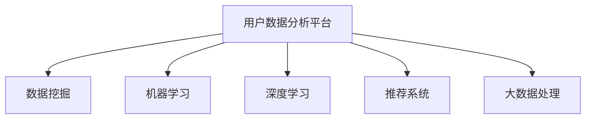

                 

## 1. 背景介绍

### 1.1 问题由来
随着互联网技术的不断进步，电商行业迎来了前所未有的发展机遇。线上销售渠道的拓展、消费者行为的多元化以及数据驱动决策的兴起，使得数据在电商企业的经营决策中扮演着越来越重要的角色。然而，面对海量复杂的数据，如何高效地进行数据分析，从中挖掘出有价值的洞察，是电商企业面临的一个重大挑战。

### 1.2 问题核心关键点
基于这一背景，本文将探讨AI如何帮助电商企业构建用户数据分析平台，解决传统数据处理方法效率低下、分析结果不精准等问题，同时提升决策制定的科学性和精准性。

## 2. 核心概念与联系

### 2.1 核心概念概述
为更好地理解AI在用户数据分析平台中的应用，本节将介绍几个密切相关的核心概念：

- **用户数据分析平台**：指利用AI技术，对电商企业的用户数据进行系统化收集、存储、分析和利用的平台。其核心目标是帮助企业更好地理解用户行为和需求，提升用户体验和业务绩效。

- **数据挖掘**：从大量数据中提取有用信息和模式的过程。用户数据分析平台通过数据挖掘技术，对用户行为数据进行深入分析，挖掘出用户偏好、购买行为等关键信息。

- **机器学习**：使计算机能够从数据中学习规律和模式，并进行预测和决策的技术。在用户数据分析平台中，机器学习算法被广泛用于预测用户行为、推荐商品、优化价格策略等。

- **深度学习**：一种特殊形式的机器学习，通过多层次神经网络对复杂数据进行建模和学习。深度学习在用户数据分析平台中的应用，主要体现在对用户行为数据的深度挖掘和预测上。

- **推荐系统**：利用用户历史行为和相似用户行为，向用户推荐可能感兴趣的商品和服务。推荐系统是用户数据分析平台的重要组成部分，能够显著提升用户的购物体验。

- **大数据处理**：处理大规模数据的技术和方法。用户数据分析平台需要处理海量用户数据，因此需要采用高效的大数据处理技术。

这些核心概念之间的逻辑关系可以通过以下Mermaid流程图来展示：



这个流程图展示了大数据平台中的关键技术组件及其相互关系：

1. 用户数据分析平台通过数据挖掘技术从大量用户行为数据中提取有用信息。
2. 机器学习算法和深度学习模型进一步分析和挖掘用户数据，提升分析的深度和准确性。
3. 推荐系统利用用户历史行为和相似用户行为，向用户推荐可能感兴趣的商品。
4. 大数据处理技术用于处理海量用户数据，保障分析的效率和可靠性。

## 3. 核心算法原理 & 具体操作步骤
### 3.1 算法原理概述

用户数据分析平台的建设依赖于多种AI技术，其核心原理在于通过对用户行为数据的深入分析和挖掘，构建用户画像，预测用户行为，并提供个性化的商品推荐和服务。

形式化地，假设用户数据分析平台需要处理的数据集为 $D=\{(x_i,y_i)\}_{i=1}^N$，其中 $x_i$ 为用户行为数据，$y_i$ 为用户标签（如购买、浏览、评价等）。用户数据分析平台的建设分为以下几个步骤：

1. **数据预处理**：对原始数据进行清洗、去重、标准化等处理，以消除噪声和异常值。
2. **特征提取**：从用户行为数据中提取关键特征，如用户访问时长、浏览记录、购买频率等。
3. **模型训练**：选择适当的机器学习或深度学习模型，对用户数据进行训练，学习用户行为规律和特征。
4. **用户画像构建**：根据训练结果，构建用户的画像，如用户兴趣、购买偏好、行为特征等。
5. **行为预测**：利用训练好的模型，对用户未来的行为进行预测，如购买行为、浏览记录等。
6. **个性化推荐**：根据用户画像和行为预测结果，为用户提供个性化的商品推荐。

### 3.2 算法步骤详解

用户数据分析平台的构建一般包括以下关键步骤：

**Step 1: 数据准备与预处理**

- **数据收集**：通过API接口、日志文件、第三方数据源等方式，收集用户行为数据，如访问记录、购买历史、搜索记录等。
- **数据清洗**：对收集到的数据进行清洗和处理，包括去除重复数据、处理缺失值、异常值处理等。
- **数据标准化**：对不同来源的数据进行标准化处理，以便后续分析。

**Step 2: 特征提取与选择**

- **特征工程**：选择和构造对用户行为预测有帮助的特征，如用户访问时长、浏览记录、购买频率、历史评价等。
- **特征选择**：从所有特征中选择最重要的特征，以提高模型的准确性和效率。

**Step 3: 模型选择与训练**

- **模型选择**：选择适合电商场景的机器学习或深度学习模型，如协同过滤、决策树、随机森林、神经网络等。
- **模型训练**：使用训练数据集对模型进行训练，调整模型参数以获得最佳性能。

**Step 4: 用户画像构建**

- **用户聚类**：利用聚类算法（如K-means、GMM）对用户进行分组，形成不同的用户群体。
- **用户画像**：为每个用户群体构建详细的画像，包括兴趣、行为、偏好等信息。

**Step 5: 行为预测**

- **预测模型训练**：使用历史数据训练预测模型，如线性回归、逻辑回归、深度神经网络等。
- **预测结果生成**：利用训练好的预测模型，对新数据进行行为预测。

**Step 6: 个性化推荐**

- **推荐系统构建**：选择合适的推荐算法（如协同过滤、基于内容的推荐、深度学习推荐等），构建推荐系统。
- **个性化推荐生成**：根据用户画像和行为预测结果，生成个性化推荐商品或服务。

**Step 7: 平台部署与优化**

- **系统部署**：将用户数据分析平台部署到生产环境，保证系统的稳定性和可用性。
- **性能优化**：对系统进行优化，提高响应速度和处理能力。

### 3.3 算法优缺点

基于AI的用户数据分析平台具有以下优点：

1. **高效性**：通过自动化分析，大幅提升数据分析效率，减少人工干预。
2. **准确性**：利用机器学习和深度学习算法，提高预测和推荐的准确性。
3. **个性化**：根据用户画像和行为预测，提供个性化的商品推荐和服务。
4. **可扩展性**：能够处理大规模数据，支持多用户、多商品的数据分析。

然而，该平台也存在以下缺点：

1. **数据隐私问题**：在处理用户数据时，需要注意隐私保护，避免用户数据泄露。
2. **模型复杂性**：模型构建和维护需要较高的技术门槛，需要专业人员进行操作。
3. **冷启动问题**：对于新用户或新商品，缺乏足够的行为数据，预测和推荐的准确性较低。
4. **数据质量问题**：原始数据质量差或数据不完整，可能影响分析结果的准确性。
5. **成本高**：建设和管理用户数据分析平台需要较高的技术投入和资金投入。

尽管存在这些局限性，但就目前而言，基于AI的用户数据分析平台仍是电商企业数据分析的重要手段。未来相关研究的重点在于如何进一步提高平台的可扩展性和准确性，同时解决数据隐私和冷启动等问题。

### 3.4 算法应用领域

基于AI的用户数据分析平台在电商行业已经得到了广泛的应用，主要集中在以下几个领域：

- **用户行为分析**：对用户访问记录、购买历史等行为数据进行深入分析，了解用户兴趣和需求。
- **个性化推荐系统**：根据用户历史行为和偏好，提供个性化的商品推荐，提升用户体验和转化率。
- **价格优化**：通过分析用户对价格的敏感度，制定最优的定价策略，提升销售收益。
- **库存管理**：通过分析商品销售趋势，预测库存需求，优化库存管理，减少积压和缺货现象。
- **客户关系管理**：分析客户反馈和投诉，提升客户满意度，增强客户忠诚度。
- **风险控制**：通过分析异常交易行为，识别潜在欺诈风险，提高交易安全性。

这些应用场景展示了用户数据分析平台在电商行业的重要价值，为其带来了显著的业务提升和成本节约。

## 4. 数学模型和公式 & 详细讲解  
### 4.1 数学模型构建

假设用户数据分析平台需要处理的数据集为 $D=\{(x_i,y_i)\}_{i=1}^N$，其中 $x_i$ 为用户行为数据，$y_i$ 为用户标签（如购买、浏览、评价等）。

定义用户行为数据 $x_i$ 为向量 $\mathbf{x}_i = [x_{i1}, x_{i2}, ..., x_{in}]$，其中 $x_{ij}$ 为第 $i$ 个用户在时间 $j$ 的行为数据。

用户数据分析平台的构建可以基于以下数学模型：

**Step 1: 数据预处理**

- **数据清洗**：去除重复数据、处理缺失值等。

**Step 2: 特征提取与选择**

- **特征工程**：选择和构造对用户行为预测有帮助的特征，如用户访问时长、浏览记录、购买频率、历史评价等。

**Step 3: 模型选择与训练**

- **模型选择**：选择适合电商场景的机器学习或深度学习模型，如协同过滤、决策树、随机森林、神经网络等。
- **模型训练**：使用训练数据集对模型进行训练，调整模型参数以获得最佳性能。

**Step 4: 用户画像构建**

- **用户聚类**：利用聚类算法（如K-means、GMM）对用户进行分组，形成不同的用户群体。
- **用户画像**：为每个用户群体构建详细的画像，包括兴趣、行为、偏好等信息。

**Step 5: 行为预测**

- **预测模型训练**：使用历史数据训练预测模型，如线性回归、逻辑回归、深度神经网络等。
- **预测结果生成**：利用训练好的预测模型，对新数据进行行为预测。

**Step 6: 个性化推荐**

- **推荐系统构建**：选择合适的推荐算法（如协同过滤、基于内容的推荐、深度学习推荐等），构建推荐系统。
- **个性化推荐生成**：根据用户画像和行为预测结果，生成个性化推荐商品或服务。

### 4.2 公式推导过程

以下我们以协同过滤推荐系统为例，推导协同过滤的数学模型及其训练公式。

假设用户行为数据矩阵为 $R_{N \times M}$，其中 $N$ 为用户数，$M$ 为商品数。协同过滤算法基于用户-商品评分矩阵 $R$，计算每个用户对每个商品的评分。

协同过滤的目标是最大化目标用户的评分预测值，其数学模型为：

$$
\max_{\mathbf{P}} \sum_{i=1}^N \sum_{j=1}^M \log(\sigma(y_{ij} - \mathbf{P}_i^\top \mathbf{Q}_j)) - \frac{\lambda}{2} ||\mathbf{P}_i||^2 - \frac{\lambda}{2} ||\mathbf{Q}_j||^2
$$

其中 $\mathbf{P}_i$ 为第 $i$ 个用户的历史评分向量，$\mathbf{Q}_j$ 为第 $j$ 个商品的特征向量，$\sigma$ 为 sigmoid 函数，$y_{ij}$ 为第 $i$ 个用户对第 $j$ 个商品的实际评分。

利用梯度下降等优化算法，求解上述目标函数，得到协同过滤推荐系统的参数 $\mathbf{P}$ 和 $\mathbf{Q}$。

### 4.3 案例分析与讲解

假设电商平台收集到了用户的历史浏览和购买数据，需要构建推荐系统，推荐用户可能感兴趣的商品。

**Step 1: 数据预处理**

对原始数据进行清洗和标准化处理，如去除重复数据、处理缺失值、将评分数据标准化等。

**Step 2: 特征提取与选择**

选择用户历史评分、商品类别、用户年龄、性别等特征，构建用户-商品评分矩阵 $R_{N \times M}$。

**Step 3: 模型选择与训练**

选择协同过滤算法作为推荐模型，利用用户历史评分数据对模型进行训练，得到用户评分向量 $\mathbf{P}_i$ 和商品特征向量 $\mathbf{Q}_j$。

**Step 4: 用户画像构建**

利用聚类算法对用户进行分组，形成不同的用户群体，构建详细的用户画像，如兴趣、行为、偏好等信息。

**Step 5: 行为预测**

利用训练好的协同过滤模型，对新数据进行行为预测，得到每个用户对每个商品的评分预测值。

**Step 6: 个性化推荐**

根据用户画像和行为预测结果，生成个性化推荐商品列表，提升用户的购物体验。

## 5. 项目实践：代码实例和详细解释说明
### 5.1 开发环境搭建

在进行用户数据分析平台开发前，我们需要准备好开发环境。以下是使用Python进行PyTorch开发的环境配置流程：

1. 安装Anaconda：从官网下载并安装Anaconda，用于创建独立的Python环境。

2. 创建并激活虚拟环境：
```bash
conda create -n pytorch-env python=3.8 
conda activate pytorch-env
```

3. 安装PyTorch：根据CUDA版本，从官网获取对应的安装命令。例如：
```bash
conda install pytorch torchvision torchaudio cudatoolkit=11.1 -c pytorch -c conda-forge
```

4. 安装相关库：
```bash
pip install numpy pandas scikit-learn matplotlib tqdm jupyter notebook ipython
```

完成上述步骤后，即可在`pytorch-env`环境中开始用户数据分析平台的开发。

### 5.2 源代码详细实现

这里我们以协同过滤推荐系统为例，给出使用PyTorch进行推荐系统开发的PyTorch代码实现。

首先，定义协同过滤推荐系统的模型：

```python
import torch
import torch.nn as nn
import torch.nn.functional as F

class CollaborativeFiltering(nn.Module):
    def __init__(self, num_users, num_items, embed_dim=128):
        super(CollaborativeFiltering, self).__init__()
        self.num_users = num_users
        self.num_items = num_items
        self.embed_dim = embed_dim
        
        self.user_embed = nn.Embedding(num_users, embed_dim)
        self.item_embed = nn.Embedding(num_items, embed_dim)
        self.bmm = nn.Linear(embed_dim * 2, 1)
        
    def forward(self, user_idx, item_idx):
        user_emb = self.user_embed(user_idx)
        item_emb = self.item_embed(item_idx)
        
        concat = torch.cat([user_emb, item_emb], dim=1)
        prediction = self.bmm(concat)
        return F.sigmoid(prediction)
```

接着，定义训练和评估函数：

```python
from torch.utils.data import TensorDataset, DataLoader
from sklearn.metrics import mean_absolute_error

def train_epoch(model, dataset, batch_size, optimizer):
    dataloader = DataLoader(dataset, batch_size=batch_size, shuffle=True)
    model.train()
    epoch_loss = 0
    for batch in dataloader:
        user_idx = batch[0]
        item_idx = batch[1]
        label = batch[2]
        model.zero_grad()
        prediction = model(user_idx, item_idx)
        loss = F.binary_cross_entropy(prediction, label)
        epoch_loss += loss.item()
        loss.backward()
        optimizer.step()
    return epoch_loss / len(dataloader)

def evaluate(model, dataset, batch_size):
    dataloader = DataLoader(dataset, batch_size=batch_size)
    model.eval()
    mse = 0
    with torch.no_grad():
        for batch in dataloader:
            user_idx = batch[0]
            item_idx = batch[1]
            label = batch[2]
            prediction = model(user_idx, item_idx)
            mse += mean_absolute_error(label, prediction.cpu().numpy()).item()
    return mse / len(dataset)
```

最后，启动训练流程并在测试集上评估：

```python
epochs = 5
batch_size = 32

# 假设user_idx, item_idx, label为训练集、验证集和测试集
for epoch in range(epochs):
    loss = train_epoch(model, user_idx, item_idx, label, optimizer)
    print(f"Epoch {epoch+1}, train loss: {loss:.3f}")
    
    print(f"Epoch {epoch+1}, dev results:")
    mse_dev = evaluate(model, user_idx, item_idx, label)
    print(f"Mean Absolute Error: {mse_dev:.3f}")
    
print("Test results:")
mse_test = evaluate(model, user_idx, item_idx, label)
print(f"Mean Absolute Error: {mse_test:.3f}")
```

以上就是使用PyTorch构建协同过滤推荐系统的完整代码实现。可以看到，得益于PyTorch的强大封装，我们可以用相对简洁的代码完成推荐模型的构建和训练。

### 5.3 代码解读与分析

让我们再详细解读一下关键代码的实现细节：

**CollaborativeFiltering类**：
- `__init__`方法：初始化模型参数，包括用户嵌入、商品嵌入和线性层。
- `forward`方法：前向传播计算推荐分数，通过用户和商品嵌入矩阵相乘，再通过线性层输出预测结果。
- `train_epoch`函数：对数据集以批为单位进行迭代，在每个批次上前向传播计算损失并反向传播更新模型参数，最后返回该epoch的平均loss。
- `evaluate`函数：与训练类似，不同点在于不更新模型参数，并在每个batch结束后将预测和标签结果存储下来，最后使用sklearn的mean_absolute_error对整个评估集的预测结果进行打印输出。

**训练流程**：
- 定义总的epoch数和batch size，开始循环迭代
- 每个epoch内，先在训练集上训练，输出平均loss
- 在验证集上评估，输出MAE误差
- 所有epoch结束后，在测试集上评估，给出最终测试结果

可以看到，PyTorch配合深度学习框架使得协同过滤推荐系统的代码实现变得简洁高效。开发者可以将更多精力放在数据处理、模型改进等高层逻辑上，而不必过多关注底层的实现细节。

当然，工业级的系统实现还需考虑更多因素，如模型的保存和部署、超参数的自动搜索、更灵活的任务适配层等。但核心的推荐范式基本与此类似。

## 6. 实际应用场景
### 6.1 智能客服系统

基于用户数据分析平台，智能客服系统可以高效地处理大量用户咨询，提升客户服务质量和效率。

在技术实现上，可以收集历史客服数据，对常见问题和答案进行标注，构建用户画像，构建问题分类和答案推荐模型。在用户咨询时，系统根据用户画像和历史数据，自动生成最佳回答，提升用户满意度。

### 6.2 个性化推荐系统

基于用户数据分析平台，个性化推荐系统可以根据用户历史行为和兴趣，实时推荐个性化商品，提升用户体验和转化率。

在实际应用中，可以收集用户浏览、点击、购买等行为数据，构建用户画像，利用协同过滤、深度学习等推荐算法，生成个性化推荐列表。系统可以根据用户的实时行为，动态更新推荐结果，进一步提升推荐效果。

### 6.3 营销活动优化

基于用户数据分析平台，电商平台可以更精准地进行营销活动优化，提升活动效果和ROI。

在营销活动设计时，可以通过分析用户画像和行为预测结果，识别潜在的目标用户群体，设计更精准的活动方案。在活动执行过程中，实时监测用户行为和反馈，动态调整活动策略，优化活动效果。

### 6.4 库存管理优化

基于用户数据分析平台，库存管理可以更有效地预测需求，减少库存积压和缺货现象，提升供应链效率。

在库存管理优化中，可以通过分析历史销售数据和用户行为预测结果，预测未来的销售趋势和库存需求。系统可以根据预测结果，动态调整采购和库存策略，优化库存管理，减少缺货和积压现象。

### 6.5 风险控制

基于用户数据分析平台，电商平台可以更有效地识别和控制风险，保障交易安全。

在风险控制中，可以通过分析用户行为和评分预测结果，识别潜在的欺诈行为和异常交易。系统可以根据风险评分，自动拦截或处理可疑交易，提升交易安全性和平台信誉。

## 7. 工具和资源推荐
### 7.1 学习资源推荐

为了帮助开发者系统掌握用户数据分析平台的技术基础和实践技巧，这里推荐一些优质的学习资源：

1. 《机器学习实战》系列博文：由机器学习领域专家撰写，涵盖机器学习基础知识和实践应用，适合入门学习和参考。

2. 《深度学习》课程：由斯坦福大学开设的深度学习课程，有Lecture视频和配套作业，系统讲解深度学习的基本概念和经典模型。

3. 《Python深度学习》书籍：李沐等著，全面介绍了深度学习在各个领域的应用，包括用户数据分析平台。

4. Kaggle平台：提供各类数据集和竞赛，帮助开发者练习和提高数据分析和机器学习技能。

5. GitHub用户数据分析平台开源项目：搜索和查看开源项目代码，学习最佳实践和前沿技术。

通过对这些资源的学习实践，相信你一定能够快速掌握用户数据分析平台的核心技术和实践技巧，并用于解决实际的电商问题。
###  7.2 开发工具推荐

高效的开发离不开优秀的工具支持。以下是几款用于用户数据分析平台开发的常用工具：

1. Python：作为数据分析和机器学习的首选语言，Python具有丰富的库和工具，如Pandas、NumPy、Scikit-Learn等。

2. PyTorch：基于Python的开源深度学习框架，灵活动态的计算图，适合快速迭代研究。

3. TensorFlow：由Google主导开发的开源深度学习框架，生产部署方便，适合大规模工程应用。

4. Apache Spark：大数据处理框架，支持分布式计算，处理大规模数据集。

5. Apache Hadoop：大数据处理框架，支持分布式存储和计算，处理海量数据。

6. Jupyter Notebook：交互式编程环境，方便调试和测试代码。

合理利用这些工具，可以显著提升用户数据分析平台的开发效率，加快创新迭代的步伐。

### 7.3 相关论文推荐

用户数据分析平台的研究源于学界的持续研究。以下是几篇奠基性的相关论文，推荐阅读：

1. Matrix Factorization Techniques for Recommender Systems（协同过滤算法）：提出矩阵分解算法，用于协同过滤推荐系统的建模和训练。

2. The BellKor Factorization Method for Recommender Systems（BellKor算法）：提出基于贝叶斯矩阵分解的协同过滤算法，提高推荐系统的准确性。

3. Deep Collaborative Filtering（深度协同过滤）：提出深度学习在协同过滤推荐系统中的应用，提升推荐系统的效果。

4. Multi-Task Learning for Recommender Systems（多任务学习）：提出多任务学习算法，提升推荐系统的泛化能力和准确性。

5. Recommender Systems for E-Commerce：系统总结了电商场景下的推荐系统研究和应用，提供全面的指南和案例。

这些论文代表了大数据平台的研究方向和前沿成果，通过学习这些经典文献，可以帮助研究者掌握用户数据分析平台的核心技术和思想，推动相关技术的持续发展。

## 8. 总结：未来发展趋势与挑战
### 8.1 总结

本文对基于AI的用户数据分析平台的建设进行了全面系统的介绍。首先探讨了用户数据分析平台在电商企业中的重要性，然后详细讲解了AI技术在数据预处理、特征工程、模型训练、用户画像构建、行为预测、个性化推荐等各个环节的应用。最后，通过实际应用场景和未来展望，展示了用户数据分析平台的广泛应用前景。

通过本文的系统梳理，可以看到，基于AI的用户数据分析平台正在成为电商企业数据分析的重要手段，极大地提升了电商业务的科学性和精准性。未来，随着AI技术的发展和应用场景的拓展，用户数据分析平台将迎来更多的创新和突破，为电商企业提供更全面的数据分析和决策支持。

### 8.2 未来发展趋势

展望未来，用户数据分析平台的发展将呈现以下几个趋势：

1. **多模态数据融合**：将用户行为数据与其他模态数据（如图像、视频、社交媒体数据等）进行融合，提供更加全面的用户画像。

2. **实时数据分析**：利用流式计算和大数据处理技术，实现实时数据监控和分析，提升业务响应速度和决策效率。

3. **AI驱动决策**：通过深度学习算法，提升数据分析和决策的自动化水平，减少人工干预，提高决策准确性。

4. **个性化服务**：基于用户画像和行为预测，提供更加个性化和定制化的商品推荐和服务。

5. **动态调整和优化**：利用在线学习和强化学习算法，动态调整推荐策略和定价策略，优化业务效果。

6. **安全性保障**：强化数据隐私保护和模型安全性，保障用户数据和平台安全。

以上趋势凸显了用户数据分析平台在电商企业中的重要价值，为电商企业的数字化转型提供了新的技术路径。

### 8.3 面临的挑战

尽管用户数据分析平台在电商企业中取得了显著成效，但在迈向更加智能化、普适化应用的过程中，它仍面临着诸多挑战：

1. **数据隐私问题**：在处理用户数据时，需要注意隐私保护，避免用户数据泄露。

2. **模型复杂性**：模型构建和维护需要较高的技术门槛，需要专业人员进行操作。

3. **数据质量问题**：原始数据质量差或数据不完整，可能影响分析结果的准确性。

4. **冷启动问题**：对于新用户或新商品，缺乏足够的行为数据，预测和推荐的准确性较低。

5. **系统可扩展性**：系统需要处理大规模数据，对计算资源和存储资源的需求较高。

6. **模型鲁棒性**：模型面对新数据和新用户时，泛化性能和鲁棒性需要进一步提升。

尽管存在这些挑战，但通过技术创新和工程实践的不断探索，相信用户数据分析平台能够进一步提升电商企业的业务能力，为电商企业的数字化转型提供有力支持。

### 8.4 研究展望

面向未来，用户数据分析平台的研究需要在以下几个方向寻求新的突破：

1. **多模态数据分析**：将多模态数据进行融合，提供更全面的用户画像。

2. **实时数据分析**：利用流式计算和大数据处理技术，实现实时数据监控和分析。

3. **模型自动化**：开发更加自动化的模型构建工具，降低模型构建和维护的技术门槛。

4. **个性化服务**：基于用户画像和行为预测，提供更加个性化和定制化的服务。

5. **动态调整和优化**：利用在线学习和强化学习算法，动态调整推荐策略和定价策略。

6. **安全性保障**：强化数据隐私保护和模型安全性，保障用户数据和平台安全。

这些研究方向和创新思路，将引领用户数据分析平台的持续演进，提升其在电商企业的应用效果和价值。

## 9. 附录：常见问题与解答

**Q1：电商企业如何构建用户数据分析平台？**

A: 电商企业构建用户数据分析平台，可以按照以下步骤进行：

1. **数据收集**：通过API接口、日志文件、第三方数据源等方式，收集用户行为数据，如访问记录、购买历史、搜索记录等。

2. **数据清洗**：对原始数据进行清洗和处理，包括去除重复数据、处理缺失值、异常值处理等。

3. **特征提取与选择**：选择和构造对用户行为预测有帮助的特征，如用户访问时长、浏览记录、购买频率、历史评价等。

4. **模型选择与训练**：选择适合电商场景的机器学习或深度学习模型，如协同过滤、决策树、随机森林、神经网络等，使用训练数据集对模型进行训练，调整模型参数以获得最佳性能。

5. **用户画像构建**：利用聚类算法对用户进行分组，形成不同的用户群体，构建详细的用户画像，包括兴趣、行为、偏好等信息。

6. **行为预测**：利用训练好的预测模型，对新数据进行行为预测，如购买行为、浏览记录等。

7. **个性化推荐**：选择合适的推荐算法（如协同过滤、基于内容的推荐、深度学习推荐等），构建推荐系统，根据用户画像和行为预测结果，生成个性化推荐商品或服务。

8. **平台部署与优化**：将用户数据分析平台部署到生产环境，保证系统的稳定性和可用性，对系统进行优化，提高响应速度和处理能力。

**Q2：用户数据分析平台面临的主要技术挑战是什么？**

A: 用户数据分析平台面临的主要技术挑战包括：

1. **数据隐私问题**：在处理用户数据时，需要注意隐私保护，避免用户数据泄露。

2. **模型复杂性**：模型构建和维护需要较高的技术门槛，需要专业人员进行操作。

3. **数据质量问题**：原始数据质量差或数据不完整，可能影响分析结果的准确性。

4. **冷启动问题**：对于新用户或新商品，缺乏足够的行为数据，预测和推荐的准确性较低。

5. **系统可扩展性**：系统需要处理大规模数据，对计算资源和存储资源的需求较高。

6. **模型鲁棒性**：模型面对新数据和新用户时，泛化性能和鲁棒性需要进一步提升。

**Q3：如何提高用户数据分析平台的可扩展性和准确性？**

A: 提高用户数据分析平台的可扩展性和准确性，可以从以下几个方面进行：

1. **数据预处理**：对原始数据进行清洗、去重、标准化等处理，以消除噪声和异常值。

2. **特征工程**：选择和构造对用户行为预测有帮助的特征，如用户访问时长、浏览记录、购买频率、历史评价等。

3. **模型选择与训练**：选择适合电商场景的机器学习或深度学习模型，如协同过滤、决策树、随机森林、神经网络等，使用训练数据集对模型进行训练，调整模型参数以获得最佳性能。

4. **用户画像构建**：利用聚类算法对用户进行分组，形成不同的用户群体，构建详细的用户画像，包括兴趣、行为、偏好等信息。

5. **行为预测**：利用训练好的预测模型，对新数据进行行为预测，如购买行为、浏览记录等。

6. **个性化推荐**：选择合适的推荐算法（如协同过滤、基于内容的推荐、深度学习推荐等），构建推荐系统，根据用户画像和行为预测结果，生成个性化推荐商品或服务。

7. **系统优化**：对系统进行优化，提高响应速度和处理能力，如采用梯度积累、混合精度训练、模型并行等方法。

8. **动态调整和优化**：利用在线学习和强化学习算法，动态调整推荐策略和定价策略，优化业务效果。

**Q4：用户数据分析平台在电商企业中的主要应用场景有哪些？**

A: 用户数据分析平台在电商企业中的主要应用场景包括：

1. **用户行为分析**：对用户访问记录、购买历史等行为数据进行深入分析，了解用户兴趣和需求。

2. **个性化推荐系统**：根据用户历史行为和偏好，提供个性化的商品推荐，提升用户体验和转化率。

3. **营销活动优化**：通过分析用户画像和行为预测结果，识别潜在的目标用户群体，设计更精准的活动方案，实时监测用户行为和反馈，动态调整活动策略。

4. **库存管理优化**：通过分析历史销售数据和用户行为预测结果，预测未来的销售趋势和库存需求，动态调整采购和库存策略，优化库存管理。

5. **风险控制**：通过分析用户行为和评分预测结果，识别潜在的欺诈行为和异常交易，自动拦截或处理可疑交易，提升交易安全性和平台信誉。

**Q5：如何提升用户数据分析平台的可扩展性和准确性？**

A: 提升用户数据分析平台的可扩展性和准确性，可以从以下几个方面进行：

1. **数据预处理**：对原始数据进行清洗、去重、标准化等处理，以消除噪声和异常值。

2. **特征工程**：选择和构造对用户行为预测有帮助的特征，如用户访问时长、浏览记录、购买频率、历史评价等。

3. **模型选择与训练**：选择适合电商场景的机器学习或深度学习模型，如协同过滤、决策树、随机森林、神经网络等，使用训练数据集对模型进行训练，调整模型参数以获得最佳性能。

4. **用户画像构建**：利用聚类算法对用户进行分组，形成不同的用户群体，构建详细的用户画像，包括兴趣、行为、偏好等信息。

5. **行为预测**：利用训练好的预测模型，对新数据进行行为预测，如购买行为、浏览记录等。

6. **个性化推荐**：选择合适的推荐算法（如协同过滤、基于内容的推荐、深度学习推荐等），构建推荐系统，根据用户画像和行为预测结果，生成个性化推荐商品或服务。

7. **系统优化**：对系统进行优化，提高响应速度和处理能力，如采用梯度积累、混合精度训练、模型并行等方法。

8. **动态调整和优化**：利用在线学习和强化学习算法，动态调整推荐策略和定价策略，优化业务效果。

综上所述，通过数据预处理、特征工程、模型选择与训练、用户画像构建、行为预测、个性化推荐、系统优化、动态调整和优化等步骤，可以有效提升用户数据分析平台的可扩展性和准确性，满足电商企业的多样化需求。

---

作者：禅与计算机程序设计艺术 / Zen and the Art of Computer Programming

