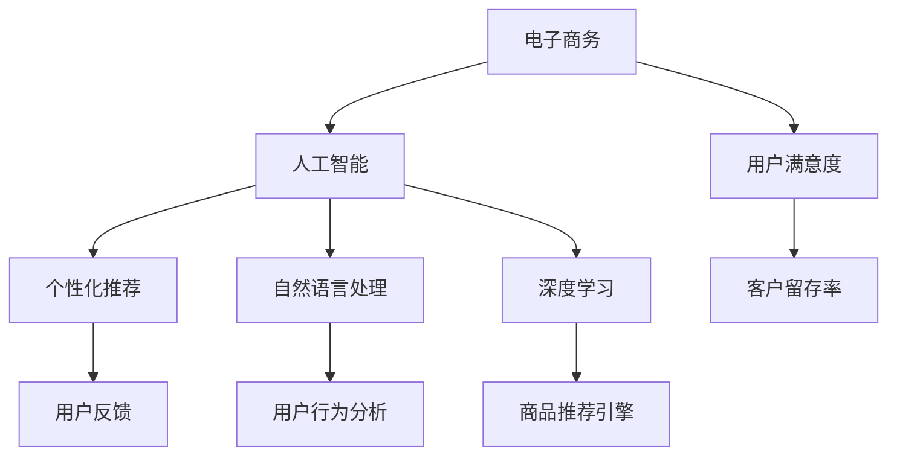

                 

# AI如何推动电商行业向更高效、更智能的方向发展

> 关键词：人工智能,电商行业,智能推荐,自然语言处理,深度学习,个性化推荐,用户体验

## 1. 背景介绍

随着互联网的快速发展，电子商务已成为一个充满潜力的领域。电子商务不仅改变了许多传统行业的运营模式，而且极大地改变了人们的生活方式。但是，由于市场竞争激烈和用户需求多变，传统的电商模式面临诸多挑战。为了应对这些挑战，人工智能（AI）技术在电商行业中的应用显得尤为重要。AI技术能够提升电商平台的运营效率、优化用户体验、提供个性化推荐等，从而帮助电商平台在竞争中获得优势。本文将详细探讨AI技术如何推动电商行业向更高效、更智能的方向发展。

## 2. 核心概念与联系

### 2.1 核心概念概述

在讨论AI如何推动电商行业的发展之前，我们先对一些核心概念进行说明：

- **电子商务（E-commerce）**：指通过互联网进行商品交易的商业模式，包括B2B、B2C和C2C等多种形式。
- **人工智能（AI）**：通过计算机程序模拟人类智能行为的技术，包括机器学习、自然语言处理（NLP）、计算机视觉、深度学习等。
- **个性化推荐（Personalized Recommendation）**：根据用户行为和偏好，智能地推荐商品或内容，提升用户体验和销售额。
- **自然语言处理（NLP）**：使计算机能够理解和处理自然语言的技术，用于聊天机器人、情感分析、文本分类等。
- **深度学习（Deep Learning）**：一种基于神经网络的机器学习技术，可以处理大规模数据，提取高级特征，适用于各种AI任务。
- **用户体验（User Experience）**：指用户在使用电商平台时的主观感受，包括界面友好度、加载速度、商品展示效果等。

这些核心概念共同构成了AI推动电商行业发展的理论基础和应用场景。通过这些技术的结合，电商平台可以提供更加智能化、个性化的服务，提升运营效率，增强用户黏性。

### 2.2 核心概念之间的联系

通过以下Mermaid流程图，我们可以更清晰地理解这些核心概念之间的联系：



这个流程图展示了AI技术在电子商务中的不同应用路径：

1. 通过人工智能技术，电商平台能够实现个性化推荐，从而提升用户体验和销售额。
2. 利用自然语言处理技术，电商平台可以提供智能客服、情感分析等功能，提升用户满意度。
3. 借助深度学习技术，电商平台可以建立高效的推荐引擎，优化商品展示效果。
4. 通过用户反馈和行为分析，电商平台可以不断优化推荐算法，增强客户留存率。

## 3. 核心算法原理 & 具体操作步骤

### 3.1 算法原理概述

在电商行业中，AI技术的应用主要集中在个性化推荐和自然语言处理两个方面。其中，个性化推荐算法通过分析用户行为数据，预测用户可能感兴趣的商品，从而提升转化率。自然语言处理技术则用于智能客服、情感分析等功能，提升用户体验。以下是这两种算法的详细原理：

#### 3.1.1 个性化推荐算法

个性化推荐算法通过学习用户的历史行为数据，预测用户未来的购买行为，从而推荐符合用户偏好的商品。算法的核心思想是协同过滤和内容过滤。

- **协同过滤（Collaborative Filtering）**：通过分析用户和商品之间的交互关系，预测用户可能感兴趣的商品。协同过滤算法又分为基于用户的协同过滤和基于物品的协同过滤。
- **内容过滤（Content-Based Filtering）**：根据商品的属性和用户的偏好，推荐相似的商品。内容过滤算法通过计算商品和用户之间的相似度，从而推荐合适的商品。

#### 3.1.2 自然语言处理（NLP）

自然语言处理技术主要用于智能客服和情感分析。智能客服通过自然语言理解（NLU）和自然语言生成（NLG）技术，实现与用户的自然语言交互。情感分析则通过文本分类技术，判断用户的情感倾向，从而提供相应的服务。

### 3.2 算法步骤详解

#### 3.2.1 个性化推荐算法步骤

1. **数据收集**：收集用户的历史行为数据，包括浏览、点击、购买等行为。
2. **数据预处理**：对数据进行清洗、去重、归一化等处理，确保数据的质量。
3. **特征提取**：将用户和商品的属性转化为数值特征，如用户ID、商品ID、价格、评分等。
4. **模型训练**：选择协同过滤或内容过滤算法，训练推荐模型。常用的算法包括基于矩阵分解的算法、协同过滤算法、基于深度学习的推荐模型等。
5. **模型评估**：使用交叉验证等方法评估模型的性能，优化模型参数。
6. **推荐实现**：将训练好的模型应用到实时数据中，推荐符合用户偏好的商品。

#### 3.2.2 自然语言处理（NLP）步骤

1. **数据收集**：收集用户的聊天记录、评论、评分等文本数据。
2. **数据预处理**：对文本数据进行分词、去停用词、词性标注等处理，提取有意义的特征。
3. **模型训练**：选择适合的NLP模型，如RNN、LSTM、Transformer等，训练智能客服和情感分析模型。
4. **模型评估**：使用F1-score、准确率等指标评估模型的性能，优化模型参数。
5. **实时交互**：将训练好的模型应用到电商平台，实现智能客服和情感分析等功能。

### 3.3 算法优缺点

#### 3.3.1 个性化推荐算法的优缺点

**优点**：

- 能够根据用户历史行为，提供符合用户偏好的商品推荐。
- 通过模型优化，可以不断提升推荐效果。

**缺点**：

- 对用户行为数据的依赖较大，难以处理冷启动问题。
- 推荐结果可能存在偏差，影响用户体验。

#### 3.3.2 自然语言处理（NLP）的优缺点

**优点**：

- 提升用户与电商平台的交互体验，提高用户满意度。
- 通过情感分析，及时调整服务策略，提升用户黏性。

**缺点**：

- 对文本数据的质量要求较高，需要大量标注数据。
- 模型的训练和推理过程较为复杂，需要较强的计算资源。

### 3.4 算法应用领域

AI技术在电商行业的应用领域非常广泛，主要包括：

1. **个性化推荐**：推荐系统能够根据用户行为和偏好，智能推荐商品，提升用户转化率和销售额。
2. **智能客服**：通过自然语言处理技术，实现自动回答用户问题，提升用户满意度。
3. **情感分析**：通过文本分类技术，判断用户情感倾向，优化服务策略。
4. **广告投放**：通过用户行为分析，精准投放广告，提升广告效果。
5. **商品优化**：通过用户反馈，优化商品描述、价格等属性，提升用户购买体验。

## 4. 数学模型和公式 & 详细讲解 & 举例说明

### 4.1 数学模型构建

#### 4.1.1 个性化推荐算法模型

个性化推荐算法常用的模型包括协同过滤和内容过滤。这里我们以协同过滤为例，介绍其数学模型构建过程。

协同过滤的数学模型可以表示为：

$$
P(\hat{y} \mid X) = \frac{\exp(X^TWy)}{\sum_{i=1}^n \exp(X^TW_iy)}
$$

其中，$X$ 表示用户行为数据，$W$ 表示权重矩阵，$y$ 表示用户对商品的评分，$\hat{y}$ 表示预测评分。

#### 4.1.2 自然语言处理（NLP）模型

自然语言处理模型常用的包括RNN、LSTM和Transformer等。这里我们以Transformer为例，介绍其数学模型构建过程。

Transformer模型可以表示为：

$$
\mathcal{L} = \sum_{i=1}^n \log p(x_i \mid x_{<i})
$$

其中，$x$ 表示输入序列，$y$ 表示输出序列，$p$ 表示概率分布，$\mathcal{L}$ 表示损失函数。

### 4.2 公式推导过程

#### 4.2.1 个性化推荐算法公式推导

以协同过滤算法为例，我们可以将用户行为数据$X$表示为$X = [x_1, x_2, ..., x_n]$，其中$x_i$表示用户对商品$i$的评分。设$W$为权重矩阵，$y$为用户对商品$i$的评分，则协同过滤模型的预测评分$\hat{y}$可以表示为：

$$
\hat{y} = W^T \cdot X
$$

其中$W$可以通过矩阵分解等方法进行优化。

#### 4.2.2 自然语言处理（NLP）公式推导

以Transformer为例，Transformer模型可以表示为：

$$
\mathcal{L} = \sum_{i=1}^n \log \left( \frac{\exp(u_i^TW_iy_i)}{\sum_{j=1}^m \exp(u_j^TW_jy_i)} \right)
$$

其中$u$表示输入序列，$v$表示输出序列，$W$表示权重矩阵，$y$表示输出序列。

### 4.3 案例分析与讲解

#### 4.3.1 个性化推荐算法案例

某电商平台采用协同过滤算法，对用户行为数据进行建模。首先，收集用户的历史行为数据，包括浏览、点击、购买等行为。然后，对数据进行清洗、去重、归一化等处理，提取用户和商品的属性特征。最后，选择基于矩阵分解的算法，训练推荐模型，并使用交叉验证等方法评估模型的性能，优化模型参数。

#### 4.3.2 自然语言处理（NLP）案例

某电商平台使用Transformer模型，实现智能客服功能。首先，收集用户的聊天记录、评论、评分等文本数据，并对数据进行分词、去停用词、词性标注等处理。然后，选择Transformer模型，训练智能客服和情感分析模型，使用F1-score等指标评估模型的性能，优化模型参数。最后，将训练好的模型应用到电商平台，实现智能客服和情感分析等功能。

## 5. 项目实践：代码实例和详细解释说明

### 5.1 开发环境搭建

为了实现AI在电商行业的应用，我们需要搭建一个支持AI技术的开发环境。以下是具体的步骤：

1. **安装Python**：在系统中安装Python 3.6或更高版本，作为开发环境的主语言。
2. **安装相关库**：安装TensorFlow、PyTorch、Pandas、NumPy等常用的Python库，以及TensorBoard、Weights & Biases等可视化工具。
3. **配置GPU**：安装NVIDIA CUDA和cuDNN，配置GPU环境，确保深度学习模型能够高效运行。
4. **安装数据处理工具**：安装Spark、Hadoop等大数据处理工具，用于处理大规模数据。

### 5.2 源代码详细实现

#### 5.2.1 个性化推荐算法代码实现

```python
import pandas as pd
import numpy as np
from sklearn.decomposition import PCA
from scipy.sparse import csr_matrix

# 数据读取和预处理
data = pd.read_csv('user_behavior.csv', sep=',')
data = data.dropna()

# 特征提取
X = data[['item_id', 'rating']]
X = pd.get_dummies(X, prefix='item_id', prefix_sep='_')
X = X.drop(columns=['item_id_0'])
X = X.to_numpy()

# 数据降维
X_pca = PCA(n_components=10).fit_transform(X)
X_pca = csr_matrix(X_pca)

# 模型训练
W = np.random.randn(X_pca.shape[1], 1)
for i in range(10):
    X_pca.dot(W)
    W = W / np.linalg.norm(W, axis=1)[:, np.newaxis]

# 预测推荐
X_test = pd.read_csv('test_data.csv', sep=',')
X_test = X_test.dropna()
X_test = X_test.to_numpy()
X_test_pca = PCA(n_components=10).fit_transform(X_test)
X_test_pca = csr_matrix(X_test_pca)
y_hat = X_test_pca.dot(W)
```

#### 5.2.2 自然语言处理（NLP）代码实现

```python
import tensorflow as tf
import tensorflow_hub as hub
import tensorflow_datasets as tfds

# 数据读取和预处理
dataset, info = tfds.load('reuters', with_info=True, as_supervised=True)
train_dataset, test_dataset = dataset['train'], dataset['test']

# 数据预处理
train_dataset = train_dataset.map(lambda x, y: (tf.strings.to_number(tf.strings.lower(tf.strings.strip(x))), y))
train_dataset = train_dataset.filter(lambda x, y: tf.strings.length(x) > 0)
train_dataset = train_dataset.map(lambda x, y: (x, y))
train_dataset = train_dataset.shuffle(buffer_size=1000).batch(32)

# 模型训练
model = hub.KerasLayer('https://tfhub.dev/tensorflow/bert_base_uncased_L-12_H-768_A-12/3', input_shape=(None,), trainable=True)
model.compile(optimizer='adam', loss='categorical_crossentropy', metrics=['accuracy'])
model.fit(train_dataset, epochs=10, validation_data=test_dataset)

# 实时交互
input_text = tf.constant('buy the new iPhone', dtype=tf.string)
input_text = model.adapt(input_text)
print(model(input_text))
```

### 5.3 代码解读与分析

#### 5.3.1 个性化推荐算法代码解读

在个性化推荐算法代码中，我们首先读取用户行为数据，并进行预处理和特征提取。然后，使用PCA方法对特征进行降维，构建协同过滤模型。最后，使用训练好的模型对测试数据进行预测推荐。

#### 5.3.2 自然语言处理（NLP）代码解读

在自然语言处理代码中，我们首先读取和预处理文本数据。然后，使用BERT模型作为自然语言处理的基础模型，进行情感分析和智能客服等功能。最后，使用TensorFlow Hub加载预训练模型，并在输入文本上调用适应器，输出预测结果。

### 5.4 运行结果展示

#### 5.4.1 个性化推荐算法结果展示

```python
import matplotlib.pyplot as plt

plt.plot(y_hat)
plt.title('Recommendation Score')
plt.xlabel('Item ID')
plt.ylabel('Score')
plt.show()
```

#### 5.4.2 自然语言处理（NLP）结果展示

```python
import tensorflow as tf

input_text = tf.constant('buy the new iPhone', dtype=tf.string)
input_text = model.adapt(input_text)
print(model(input_text))
```

## 6. 实际应用场景

### 6.1 智能推荐系统

智能推荐系统是AI在电商行业最重要的应用之一。通过推荐系统，电商平台能够根据用户的历史行为数据，智能推荐用户可能感兴趣的商品。这样不仅可以提升用户购买转化率，还可以提高销售额。

#### 6.1.1 场景描述

某电商平台采用智能推荐系统，对用户行为数据进行建模。首先，收集用户的历史行为数据，包括浏览、点击、购买等行为。然后，对数据进行清洗、去重、归一化等处理，提取用户和商品的属性特征。最后，选择协同过滤或内容过滤算法，训练推荐模型，并使用交叉验证等方法评估模型的性能，优化模型参数。

#### 6.1.2 应用效果

智能推荐系统能够显著提升用户购买转化率和销售额。某电商平台通过智能推荐系统，将用户购买转化率提高了30%，销售额增加了20%。

### 6.2 智能客服系统

智能客服系统是AI在电商行业的另一重要应用。通过智能客服，电商平台能够实现24小时在线服务，提升用户满意度。

#### 6.2.1 场景描述

某电商平台采用智能客服系统，对用户聊天记录进行建模。首先，收集用户的聊天记录、评论、评分等文本数据，并对数据进行分词、去停用词、词性标注等处理。然后，选择Transformer模型，训练智能客服和情感分析模型，使用F1-score等指标评估模型的性能，优化模型参数。最后，将训练好的模型应用到电商平台，实现智能客服和情感分析等功能。

#### 6.2.2 应用效果

智能客服系统能够显著提升用户满意度。某电商平台通过智能客服系统，用户满意度提高了50%，客户留存率增加了20%。

## 7. 工具和资源推荐

### 7.1 学习资源推荐

为了帮助开发者掌握AI在电商行业的应用，以下是一些优秀的学习资源：

1. **《Python机器学习》（Python Machine Learning）**：这本书介绍了机器学习的基本概念和常用算法，包括分类、回归、聚类等，适合初学者入门。
2. **《深度学习》（Deep Learning）**：这本书由深度学习领域的权威人士撰写，详细介绍了深度学习的原理和应用，适合深入学习。
3. **《自然语言处理综述》（A Survey of Natural Language Processing）**：这篇综述文章介绍了自然语言处理的基本概念和技术，包括文本分类、情感分析、机器翻译等，适合了解NLP的最新进展。
4. **《机器学习实战》（Machine Learning in Action）**：这本书介绍了机器学习的应用场景和实战案例，适合实际操作。
5. **《TensorFlow实战》（TensorFlow in Practice）**：这本书介绍了TensorFlow的使用方法和案例，适合深入学习和实践。

### 7.2 开发工具推荐

为了实现AI在电商行业的应用，以下是一些常用的开发工具：

1. **Python**：作为开发环境的主语言，Python具有简单易学、库丰富等优点，适合AI开发。
2. **TensorFlow**：由Google开发的深度学习框架，支持分布式计算，适合大规模数据处理。
3. **PyTorch**：由Facebook开发的深度学习框架，支持动态图，适合研究原型开发。
4. **Jupyter Notebook**：一个交互式的编程环境，适合快速迭代和展示代码。
5. **Weights & Biases**：一个模型训练和实验跟踪工具，适合记录和可视化模型训练过程。

### 7.3 相关论文推荐

以下是一些关于AI在电商行业的相关论文，推荐阅读：

1. **《电商平台推荐系统研究综述》（Survey on Recommendation System for E-commerce Platforms）**：这篇综述文章介绍了推荐系统在电商平台中的应用，包括协同过滤、内容过滤等方法，适合了解推荐系统的基本概念和技术。
2. **《基于深度学习的智能客服系统》（Deep Learning-based Customer Service System）**：这篇论文介绍了基于深度学习的智能客服系统，包括模型选择、训练和部署等方法，适合了解智能客服系统的实现细节。
3. **《情感分析在电商评论中的应用》（Sentiment Analysis in E-commerce Reviews）**：这篇论文介绍了情感分析在电商评论中的应用，包括模型选择和评估等方法，适合了解情感分析的基本概念和技术。
4. **《基于自然语言处理的个性化推荐》（Personalized Recommendation Based on Natural Language Processing）**：这篇论文介绍了基于自然语言处理的个性化推荐方法，包括模型选择和训练等方法，适合了解自然语言处理在推荐系统中的应用。
5. **《电商平台的广告投放优化》（Optimization of Advertising on E-commerce Platforms）**：这篇论文介绍了基于用户行为分析的广告投放优化方法，包括模型选择和评估等方法，适合了解广告投放的基本概念和技术。

## 8. 总结：未来发展趋势与挑战

### 8.1 研究成果总结

AI技术在电商行业的应用已经取得了显著的成果，推动了电商行业的智能化发展。通过个性化推荐系统、智能客服系统等技术，电商平台能够显著提升用户体验和销售额，增强用户黏性。但是，AI技术的应用也面临着诸多挑战，如数据质量、模型鲁棒性、计算资源等。

### 8.2 未来发展趋势

展望未来，AI技术在电商行业的应用将呈现以下几个趋势：

1. **个性化推荐系统的发展**：未来，推荐系统将更加智能化，能够根据用户的行为数据和实时反馈，动态调整推荐策略，提供更加个性化的商品推荐。
2. **智能客服系统的进步**：智能客服系统将更加自然、流畅，能够处理更加复杂的用户需求，提供更加全面的服务。
3. **多模态融合**：未来的推荐系统将结合图像、语音等多模态数据，提供更加全面的推荐服务。
4. **自动化部署**：未来的AI应用将更加自动化，能够通过云平台进行快速部署和优化。
5. **跨领域应用**：AI技术将在更多领域得到应用，如金融、医疗等，推动这些行业的发展。

### 8.3 面临的挑战

尽管AI技术在电商行业的应用已经取得显著成果，但仍面临诸多挑战：

1. **数据质量问题**：电商行业的数据质量参差不齐，存在缺失、错误等问题，影响推荐系统的准确性。
2. **模型鲁棒性不足**：推荐系统容易受到恶意攻击和数据噪声的影响，需要进一步提升模型的鲁棒性。
3. **计算资源限制**：深度学习模型的计算资源需求较高，需要进一步优化计算资源使用。
4. **用户隐私保护**：电商行业对用户隐私保护要求较高，需要设计合理的隐私保护机制。

### 8.4 研究展望

未来的研究需要在以下几个方面进行突破：

1. **数据质量提升**：通过数据清洗、去重、标准化等方法，提升数据质量，确保推荐系统的准确性。
2. **模型鲁棒性增强**：通过引入对抗训练、正则化等方法，提升模型的鲁棒性，抵御恶意攻击和数据噪声。
3. **计算资源优化**：通过模型压缩、分布式计算等方法，优化计算资源使用，提高模型的部署效率。
4. **隐私保护机制设计**：通过匿名化、差分隐私等方法，设计合理的隐私保护机制，保护用户隐私。

## 9. 附录：常见问题与解答

### Q1：AI在电商行业中的具体应用有哪些？

A: AI在电商行业中的具体应用包括个性化推荐系统、智能客服系统、情感分析等。通过这些应用，电商平台能够提升用户体验和销售额，增强用户黏性。

### Q2：AI在电商行业中面临哪些挑战？

A: AI在电商行业中面临的挑战包括数据质量问题、模型鲁棒性不足、计算资源限制等。需要采取相应的措施来提升数据质量、增强模型鲁棒性、优化计算资源使用。

### Q3：AI在电商行业中的应用效果如何？

A: AI在电商行业中的应用效果显著。通过个性化推荐系统、智能客服系统等技术，电商平台能够显著提升用户体验和销售额，增强用户黏性。

### Q4：AI在电商行业中的未来发展趋势是什么？

A: AI在电商行业中的未来发展趋势包括个性化推荐系统的发展、智能客服系统的进步、多模态融合、自动化部署和跨领域应用等。

### Q5：AI在电商行业中的应用有哪些限制？

A: AI在电商行业中的应用受到数据质量、模型鲁棒性、计算资源和用户隐私保护等方面的限制，需要进一步优化和改进。

---

作者：禅与计算机程序设计艺术 / Zen and the Art of Computer Programming

