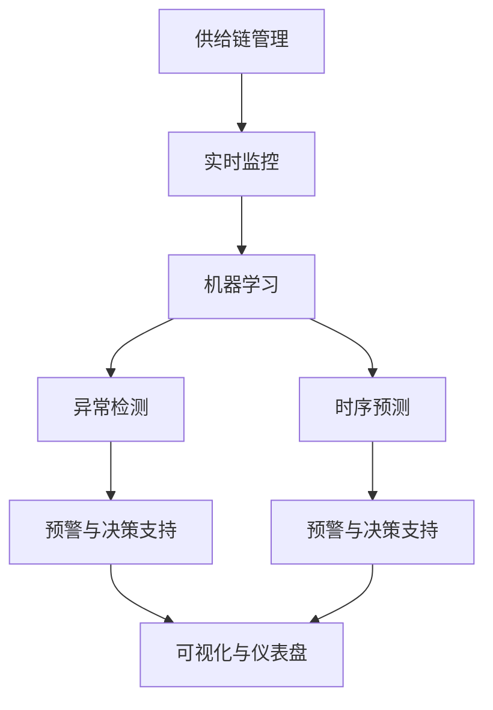

                 

# AI实时监控供给链的应用

## 1. 背景介绍

### 1.1 问题由来

在当今数字化、智能化时代，企业的供给链（Supply Chain）日益复杂。传统的人工监控方式存在信息不对称、响应迟缓等问题，难以实时掌握供应链各个环节的状态和风险。而人工智能（AI）技术，尤其是AI实时监控（Real-time Monitoring）在供给链管理中的应用，为这一问题提供了全新的解决方案。

### 1.2 问题核心关键点

AI实时监控供给链的核心在于利用先进的数据分析和机器学习算法，对供应链的各个环节进行实时监控和预测，及时发现异常并采取措施，确保供应链的顺畅和稳定。主要关键点包括：

- 数据采集与处理：获取供应链各环节的数据，并进行清洗、预处理，为AI算法提供可靠的输入。
- 实时监控模型：利用机器学习算法（如时序预测、异常检测等）构建实时监控模型，实现对供应链的动态监测。
- 预警与决策支持：根据模型输出，实现供应链异常预警，并提供决策建议，帮助管理者及时调整策略。
- 可视化与仪表盘：将监控结果和预警信息通过可视化的方式展现，方便管理者理解和决策。

### 1.3 问题研究意义

研究AI实时监控供给链的方法，对于提升供应链的透明度、响应速度、灵活性和成本效益具有重要意义：

1. 提升供应链透明度：AI实时监控可以实时监控供应链各环节的数据，提供实时的可视化和报告，帮助管理者全面了解供应链的状态。
2. 提高响应速度：通过实时监控，企业可以迅速发现供应链中的异常情况，及时采取应对措施，避免问题扩大。
3. 增强供应链灵活性：AI模型能够预测供应链的变化趋势，帮助企业提前做好准备，提升供应链的灵活性和韧性。
4. 降低运营成本：通过优化供应链管理，减少资源浪费和损失，降低运营成本。

## 2. 核心概念与联系

### 2.1 核心概念概述

为更好地理解AI实时监控供给链的方法，本节将介绍几个密切相关的核心概念：

- **供给链管理（Supply Chain Management, SCM）**：涉及企业采购、生产、库存、物流、分销等环节的管理过程，目标是确保产品从原材料采购到最终交付的整个过程高效、成本最低。
- **实时监控（Real-time Monitoring）**：指对供应链各环节进行实时数据采集和分析，以快速发现异常并及时响应。
- **机器学习（Machine Learning, ML）**：利用算法对数据进行学习和预测，实现自动化决策。
- **异常检测（Anomaly Detection）**：通过识别供应链中的异常数据，及时发现问题并采取措施。
- **时序预测（Time Series Forecasting）**：通过分析时间序列数据，预测供应链的趋势和变化。
- **可视化（Visualization）**：将监控结果以图表、仪表盘等形式展现，便于管理者理解和决策。

这些概念之间的逻辑关系可以通过以下Mermaid流程图来展示：



这个流程图展示了这个领域中主要概念之间的关系：

1. 供给链管理涉及多个环节，实时监控通过对这些环节的数据进行采集和分析，实现对供应链的动态监测。
2. 机器学习通过分析和预测供应链数据，构建实时监控模型，实现对供应链的自动化决策支持。
3. 异常检测和时序预测是机器学习中重要的子任务，分别用于检测异常和预测供应链的趋势变化。
4. 预警与决策支持基于异常检测和时序预测的结果，提供预警信息和决策建议，帮助管理者及时调整策略。
5. 可视化将监控结果和预警信息以直观的方式展现，便于管理者理解和决策。

这些概念共同构成了AI实时监控供给链的核心框架，使其能够在供应链管理中发挥强大的作用。

## 3. 核心算法原理 & 具体操作步骤
### 3.1 算法原理概述

AI实时监控供给链的核心算法原理基于机器学习和数据分析，通过以下几个关键步骤实现：

1. **数据采集与处理**：通过传感器、物联网设备等技术手段，实时采集供应链各环节的数据，并对数据进行清洗、预处理。
2. **实时监控模型构建**：利用机器学习算法（如时序预测、异常检测等）构建实时监控模型，对供应链数据进行动态监测。
3. **预警与决策支持**：根据模型的输出，实现供应链异常预警，并提供决策建议，帮助管理者及时调整策略。
4. **可视化与仪表盘展示**：将监控结果和预警信息通过可视化的方式展现，方便管理者理解和决策。

### 3.2 算法步骤详解

**Step 1: 数据采集与处理**

- **传感器与物联网设备**：部署传感器、RFID、摄像头等设备，实时采集供应链各环节的数据。
- **数据清洗与预处理**：清洗数据，去除噪音和异常点，进行归一化、缺失值处理等预处理操作。
- **数据存储与管理**：利用数据库或数据湖技术，存储和管理供应链数据，确保数据的可靠性和可访问性。

**Step 2: 实时监控模型构建**

- **特征工程**：提取供应链数据的特征，如时间戳、温度、湿度、库存量等。
- **算法选择**：选择合适的机器学习算法，如ARIMA、LSTM、XGBoost等，构建实时监控模型。
- **模型训练与调参**：利用历史数据对模型进行训练，并进行超参数调优，确保模型效果最优。

**Step 3: 预警与决策支持**

- **异常检测**：利用异常检测算法（如One-Class SVM、Isolation Forest等）检测供应链中的异常情况。
- **时序预测**：利用时间序列预测算法（如Prophet、ETS等）预测供应链的趋势变化。
- **决策建议**：根据异常检测和时序预测的结果，生成决策建议，如调整库存、优化物流路线等。

**Step 4: 可视化与仪表盘展示**

- **仪表盘设计**：设计可视化仪表盘，展示供应链的关键指标和监控结果。
- **数据实时更新**：通过API接口或定时任务，将监控结果实时更新到仪表盘中。
- **用户界面**：提供友好的用户界面，便于管理者进行操作和决策。

### 3.3 算法优缺点

AI实时监控供给链的方法具有以下优点：

1. **实时性**：通过实时监控，企业可以迅速发现供应链中的异常情况，及时采取应对措施，避免问题扩大。
2. **准确性**：机器学习算法能够从大量数据中提取特征和模式，提高监控的准确性。
3. **全面性**：通过多维度数据采集和分析，能够全面了解供应链的状态和风险。
4. **可扩展性**：系统架构设计灵活，可以支持不同规模和复杂度的供应链。

同时，该方法也存在一些局限性：

1. **数据依赖性**：实时监控的效果很大程度上依赖于数据的质量和完整性，数据采集和处理的准确性至关重要。
2. **模型复杂度**：构建实时监控模型需要选择合适的算法和调整参数，模型复杂度较高。
3. **计算资源需求**：实时监控需要大量的计算资源，特别是在数据量和模型规模较大时。
4. **可解释性**：复杂模型（如深度学习模型）的决策过程缺乏可解释性，管理者可能难以理解模型的输出。

尽管存在这些局限性，但AI实时监控方法在供应链管理中的应用，已经展示出其巨大的潜力，成为了现代供应链管理的重要工具。

### 3.4 算法应用领域

AI实时监控供给链的方法在多个领域得到了广泛的应用：

- **制造业**：通过实时监控生产线状态、设备运行情况等，提高生产效率，降低成本。
- **物流管理**：监控货物运输状态、仓库库存情况，优化物流路线，提升运输效率。
- **零售行业**：实时监控库存水平、销售数据，优化库存管理和需求预测，提高销售效率。
- **供应链金融**：实时监控供应链各环节的风险，提供信用评估和风险控制。
- **食品安全**：监控供应链各环节的温度、湿度等关键指标，保障食品安全。

## 4. 数学模型和公式 & 详细讲解 & 举例说明

### 4.1 数学模型构建

本节将使用数学语言对AI实时监控供给链的过程进行更加严格的刻画。

设供应链中某一环节的历史数据为 $D=\{(x_t,y_t)\}_{t=1}^N$，其中 $x_t$ 表示第 $t$ 时间点的数据，$y_t$ 表示相应的标签。

假设模型 $M_{\theta}(x)$ 能够对供应链数据进行预测和异常检测。其目标是最小化损失函数 $\mathcal{L}(\theta)$，其中 $\theta$ 为模型的参数。

**目标函数**：
$$
\min_{\theta} \mathcal{L}(\theta) = \frac{1}{N} \sum_{t=1}^N \ell(M_{\theta}(x_t),y_t)
$$

**损失函数**：
$$
\ell(M_{\theta}(x_t),y_t) = (M_{\theta}(x_t) - y_t)^2
$$

**优化算法**：
$$
\theta \leftarrow \theta - \eta \nabla_{\theta} \mathcal{L}(\theta)
$$

其中，$\eta$ 为学习率，$\nabla_{\theta} \mathcal{L}(\theta)$ 为损失函数对模型参数的梯度，可通过反向传播算法计算。

### 4.2 公式推导过程

以异常检测为例，使用One-Class SVM算法进行异常检测的推导：

**目标函数**：
$$
\min_{\theta} \mathcal{L}(\theta) = \frac{1}{2} \|w\|^2 + C \sum_{t=1}^N [\max(0,1-y_t M_{\theta}(x_t))]
$$

**约束条件**：
$$
\begin{cases}
y_t M_{\theta}(x_t) + 1 \geq w^T \varphi(x_t) + b \\
\varphi(x_t) = [x_t, 1]^T \in \mathbb{R}^{d+1}
\end{cases}
$$

**优化求解**：

1. **拉格朗日乘子法**：构造拉格朗日函数
$$
\mathcal{L}(\theta, \alpha, \beta) = \frac{1}{2} \|w\|^2 + C \sum_{t=1}^N [\max(0,1-y_t M_{\theta}(x_t))] + \alpha_t (y_t M_{\theta}(x_t) + 1 - w^T \varphi(x_t) - b) + \beta_t (w^T \varphi(x_t) - b)
$$
2. **求解极值问题**：对 $\theta$、$w$、$b$ 分别求偏导数，并令导数为0，得到最优解。
3. **解算拉格朗日乘子**：利用SMO算法求解拉格朗日乘子 $\alpha_t$、$\beta_t$，进一步计算 $w$ 和 $b$。

### 4.3 案例分析与讲解

**案例1：库存水平预测**

- **问题描述**：某零售公司需要预测未来几天的库存水平，以确保库存充足。
- **解决方案**：构建时间序列预测模型，利用历史销售数据和库存数据进行训练，实时预测库存水平。
- **实现步骤**：
  1. 采集历史销售和库存数据，进行清洗和预处理。
  2. 构建时间序列模型，如ARIMA、LSTM等，进行训练和调参。
  3. 实时获取最新的销售和库存数据，输入模型进行预测。
  4. 将预测结果通过仪表盘实时展示给管理者。

**案例2：物流运输监控**

- **问题描述**：某物流公司需要监控货物运输状态，预测运输延误风险。
- **解决方案**：构建异常检测和时序预测模型，实时监控货物运输数据。
- **实现步骤**：
  1. 采集货物运输数据，包括位置、速度、温度等。
  2. 构建异常检测模型，如Isolation Forest、One-Class SVM等，检测异常运输情况。
  3. 构建时间序列预测模型，如ETS、Prophet等，预测运输延误风险。
  4. 将异常检测和时序预测的结果通过仪表盘实时展示，提供预警和决策支持。

## 5. 项目实践：代码实例和详细解释说明

### 5.1 开发环境搭建

在进行AI实时监控供给链的实践前，我们需要准备好开发环境。以下是使用Python进行PyTorch和TensorFlow开发的典型环境配置流程：

1. 安装Anaconda：从官网下载并安装Anaconda，用于创建独立的Python环境。
```bash
conda create -n ai_monitor_env python=3.8 
conda activate ai_monitor_env
```

2. 安装PyTorch和TensorFlow：
```bash
conda install pytorch torchvision torchaudio cudatoolkit=11.1 -c pytorch -c conda-forge
conda install tensorflow -c tensorflow
```

3. 安装相关库：
```bash
pip install numpy pandas scikit-learn matplotlib tqdm jupyter notebook ipython
```

完成上述步骤后，即可在`ai_monitor_env`环境中开始项目实践。

### 5.2 源代码详细实现

下面以库存水平预测为例，给出使用PyTorch进行实时监控的Python代码实现。

首先，定义模型和优化器：

```python
import torch
from torch import nn, optim
import pandas as pd

class ARIMA(nn.Module):
    def __init__(self, input_size, output_size, hidden_size=64):
        super(ARIMA, self).__init__()
        self.rnn = nn.RNN(input_size, hidden_size, 1, batch_first=True, nonlinearity='relu')
        self.fc = nn.Linear(hidden_size, output_size)
    
    def forward(self, x, h):
        x = self.rnn(x, h)[0]
        x = self.fc(x)
        return x

input_size = 1
output_size = 1
hidden_size = 64
model = ARIMA(input_size, output_size, hidden_size)
optimizer = optim.Adam(model.parameters(), lr=0.01)
```

接着，定义数据处理函数：

```python
def load_data(file_path):
    data = pd.read_csv(file_path)
    x = data['in_stock'].values.reshape(-1, 1)
    y = data['out_stock'].values.reshape(-1, 1)
    return x, y

def preprocess_data(x, y):
    x = torch.from_numpy(x).float()
    y = torch.from_numpy(y).float()
    return x, y
```

然后，定义训练和评估函数：

```python
def train_epoch(model, optimizer, x_train, y_train):
    model.train()
    optimizer.zero_grad()
    y_pred = model(x_train, h)
    loss = nn.MSELoss()(y_pred, y_train)
    loss.backward()
    optimizer.step()
    return loss.item()

def evaluate(model, x_test, y_test):
    model.eval()
    with torch.no_grad():
        y_pred = model(x_test, h)
        loss = nn.MSELoss()(y_pred, y_test)
    return loss.item()
```

最后，启动训练流程并在测试集上评估：

```python
epochs = 100
batch_size = 64

for epoch in range(epochs):
    x_train, y_train = load_data('train.csv')
    x_train, y_train = preprocess_data(x_train, y_train)
    
    x_train = x_train[:batch_size].contiguous()
    y_train = y_train[:batch_size].contiguous()
    
    for i in range(0, len(x_train), batch_size):
        batch_x, batch_y = x_train[i:i+batch_size], y_train[i:i+batch_size]
        batch_loss = train_epoch(model, optimizer, batch_x, batch_y)
        print('Epoch: {}, Batch Loss: {}'.format(epoch+1, batch_loss))
    
    x_test, y_test = load_data('test.csv')
    x_test, y_test = preprocess_data(x_test, y_test)
    
    test_loss = evaluate(model, x_test, y_test)
    print('Test Loss: {}'.format(test_loss))
```

以上就是使用PyTorch对库存水平预测进行实时监控的完整代码实现。可以看到，借助PyTorch的强大功能，我们可以快速构建和训练ARIMA模型，实现对库存水平的实时预测。

### 5.3 代码解读与分析

让我们再详细解读一下关键代码的实现细节：

**ARIMA模型定义**：
- `nn.RNN`类：用于定义递归神经网络层，实现时间序列预测。
- `nn.Linear`类：用于定义全连接层，输出预测结果。

**数据加载与预处理**：
- `load_data`函数：读取CSV文件，提取输入和输出数据。
- `preprocess_data`函数：将数据转换为Tensor格式，并进行归一化处理。

**训练和评估函数**：
- `train_epoch`函数：在训练集上进行前向传播和反向传播，更新模型参数。
- `evaluate`函数：在测试集上进行前向传播，计算损失。

**训练流程**：
- 定义总的epoch数和batch size，开始循环迭代
- 每个epoch内，在训练集上训练，输出每个batch的损失
- 所有epoch结束后，在测试集上评估，输出测试集损失

可以看到，PyTorch使得构建和训练时间序列预测模型变得简洁高效。开发者可以将更多精力放在数据处理、模型改进等高层逻辑上，而不必过多关注底层的实现细节。

当然，工业级的系统实现还需考虑更多因素，如模型的保存和部署、超参数的自动搜索、更灵活的任务适配层等。但核心的实时监控范式基本与此类似。

## 6. 实际应用场景

### 6.1 智能仓储管理

AI实时监控在智能仓储管理中的应用，可以显著提升仓库管理效率，降低库存成本。通过实时监控库存水平、商品位置等信息，系统可以自动生成补货和盘点任务，减少人工干预，提高仓库运营效率。

在技术实现上，可以部署RFID、传感器等设备，实时采集仓库数据，通过机器学习模型进行分析和预测，生成补货和盘点建议。同时，系统还可以提供实时监控仪表盘，展示仓库状态和任务进度，便于管理者进行决策。

### 6.2 物流运输监控

在物流运输领域，AI实时监控可以实时监控货物运输状态，预测运输延误风险，优化物流路线和配送策略，提升运输效率和客户满意度。

系统可以采集货物位置、速度、温度等数据，通过异常检测模型实时监控运输状态，识别异常情况。同时，系统还可以利用时序预测模型预测运输延误风险，生成预警信息，提供决策支持。

### 6.3 供应链金融

AI实时监控在供应链金融中的应用，可以实现对供应链各环节的动态监测，评估供应链信用风险，提供信用评估和风险控制。

系统可以实时监控供应链的订单、库存、物流等数据，通过异常检测和时序预测模型进行分析和预测，生成信用评估和风险控制建议。同时，系统还可以提供实时监控仪表盘，展示供应链状态和风险情况，便于金融机构进行决策。

### 6.4 未来应用展望

随着AI实时监控技术的不断发展，其在供应链管理中的应用将更加广泛和深入。未来可能的应用场景包括：

1. **智能采购管理**：实时监控采购数据，预测采购需求，优化采购策略，提升采购效率。
2. **智能库存管理**：实时监控库存状态，优化库存水平，减少库存积压和缺货情况。
3. **智能物流管理**：实时监控物流状态，预测物流延误风险，优化物流路线和配送策略。
4. **智能供应链金融**：实时监控供应链数据，评估供应链信用风险，提供信用评估和风险控制。
5. **智能生产管理**：实时监控生产状态，预测生产异常，优化生产计划，提升生产效率。

这些应用场景将进一步拓展AI实时监控在供应链管理中的应用范围，提升供应链管理的智能化水平，为各行各业带来新的价值和效益。

## 7. 工具和资源推荐

### 7.1 学习资源推荐

为了帮助开发者系统掌握AI实时监控供给链的理论基础和实践技巧，这里推荐一些优质的学习资源：

1. **《Python数据科学手册》**：详细介绍了Python在数据科学中的应用，包括数据处理、机器学习等技术。
2. **《机器学习实战》**：介绍了机器学习的基本概念和常用算法，包括决策树、SVM、神经网络等。
3. **Coursera《机器学习》课程**：斯坦福大学的经典课程，涵盖机器学习的基本理论和实践技巧。
4. **Kaggle数据科学竞赛**：通过参与Kaggle竞赛，实践机器学习算法，提升实战能力。
5. **GitHub开源项目**：学习和贡献开源项目，提升项目开发能力和团队协作能力。

通过这些资源的学习实践，相信你一定能够快速掌握AI实时监控供给链的精髓，并用于解决实际的供应链问题。

### 7.2 开发工具推荐

高效的开发离不开优秀的工具支持。以下是几款用于AI实时监控供给链开发的常用工具：

1. **PyTorch**：基于Python的开源深度学习框架，灵活动态的计算图，适合快速迭代研究。
2. **TensorFlow**：由Google主导开发的开源深度学习框架，生产部署方便，适合大规模工程应用。
3. **Jupyter Notebook**：交互式编程环境，支持代码编写、数据可视化、结果展示等，非常适合数据分析和机器学习任务。
4. **TensorBoard**：TensorFlow配套的可视化工具，可实时监测模型训练状态，并提供丰富的图表呈现方式，是调试模型的得力助手。
5. **H2O.ai**：提供自动化机器学习平台，支持多种机器学习算法，适合非数据科学家使用。

合理利用这些工具，可以显著提升AI实时监控供给链的开发效率，加快创新迭代的步伐。

### 7.3 相关论文推荐

AI实时监控供给链的研究源于学界的持续研究。以下是几篇奠基性的相关论文，推荐阅读：

1. **"Real-time supply chain monitoring using artificial intelligence"**：详细介绍了AI实时监控在供应链中的应用。
2. **"Anomaly detection in supply chain using machine learning"**：介绍了异常检测算法在供应链中的应用。
3. **"Predictive maintenance for supply chain using machine learning"**：介绍了时序预测算法在供应链中的应用。
4. **"Visualizing supply chain data using big data analytics"**：介绍了数据可视化在供应链中的应用。
5. **"Automated supply chain optimization using machine learning"**：介绍了优化算法在供应链中的应用。

这些论文代表了大数据、机器学习在供应链管理中的应用趋势，提供了丰富的理论和技术支持。

## 8. 总结：未来发展趋势与挑战

### 8.1 总结

本文对AI实时监控供给链的方法进行了全面系统的介绍。首先阐述了AI实时监控在供应链管理中的重要性，明确了实时监控在提升供应链透明度、响应速度、灵活性和成本效益方面的独特价值。其次，从原理到实践，详细讲解了实时监控的数学原理和关键步骤，给出了实时监控任务开发的完整代码实例。同时，本文还广泛探讨了实时监控在智能仓储管理、物流运输监控、供应链金融等领域的实际应用，展示了实时监控范式的巨大潜力。

通过本文的系统梳理，可以看到，AI实时监控方法在供应链管理中的应用前景广阔，已经成为现代供应链管理的重要工具。未来，伴随预训练模型和微调方法的持续演进，AI实时监控技术必将更加智能、高效，为各行各业带来新的价值和效益。

### 8.2 未来发展趋势

展望未来，AI实时监控供给链技术将呈现以下几个发展趋势：

1. **模型智能化**：随着深度学习和大数据技术的不断进步，AI实时监控模型将变得更加智能化，能够处理更加复杂和多样的供应链数据。
2. **数据多样化**：除了传统的供应链数据，AI实时监控还将处理更多类型的数据，如物联网、传感器、图像等。
3. **实时性提升**：随着计算能力和网络带宽的提升，AI实时监控系统将实现更短的延迟和更快的响应速度。
4. **融合多模态数据**：未来AI实时监控将更加注重融合多模态数据，实现跨领域、跨系统的协同优化。
5. **增强交互性**：通过人机交互技术，AI实时监控系统将提供更加直观和智能的用户界面，提升用户体验。
6. **优化资源利用**：AI实时监控系统将更加注重资源利用效率，实现更加绿色、高效的运营。

这些趋势凸显了AI实时监控在供应链管理中的重要性和广阔前景，为供应链管理提供了新的思路和方法。

### 8.3 面临的挑战

尽管AI实时监控供给链技术已经取得了瞩目成就，但在迈向更加智能化、普适化应用的过程中，它仍面临着诸多挑战：

1. **数据采集难度**：实时监控需要采集大量的供应链数据，数据采集和处理的成本和难度较大。
2. **模型复杂度**：构建实时监控模型需要选择合适的算法和调整参数，模型复杂度较高。
3. **计算资源需求**：实时监控需要大量的计算资源，特别是在数据量和模型规模较大时。
4. **数据隐私和安全**：供应链数据的敏感性较高，数据隐私和安全问题需要引起重视。
5. **模型可解释性**：复杂模型（如深度学习模型）的决策过程缺乏可解释性，管理者可能难以理解模型的输出。
6. **模型鲁棒性**：模型在面对未知数据或异常情况时，可能出现失效或误判。

尽管存在这些挑战，但AI实时监控技术在供应链管理中的应用前景广阔，需要通过不断的技术创新和实践积累，逐步克服这些难题。

### 8.4 研究展望

面对AI实时监控供给链所面临的挑战，未来的研究需要在以下几个方面寻求新的突破：

1. **数据采集和处理**：研究和开发更高效、低成本的数据采集和处理技术，确保实时监控数据的质量和完整性。
2. **模型自动化和可解释性**：研究和开发更加自动化和可解释的机器学习模型，提升模型的可操作性和可理解性。
3. **资源优化**：研究和开发更加高效、低成本的计算资源优化技术，确保实时监控系统的稳定性和可靠性。
4. **跨模态数据融合**：研究和开发跨模态数据融合技术，实现多模态数据的协同优化和协同决策。
5. **智能决策支持**：研究和开发更加智能的决策支持系统，提供更加个性化和精准的决策建议。
6. **隐私保护**：研究和开发隐私保护技术，确保供应链数据的隐私和安全。

这些研究方向的探索，必将引领AI实时监控技术迈向更高的台阶，为供应链管理带来新的价值和效益。面向未来，AI实时监控技术还需要与其他人工智能技术进行更深入的融合，如知识表示、因果推理、强化学习等，多路径协同发力，共同推动供应链管理的进步。只有勇于创新、敢于突破，才能不断拓展供应链管理的边界，让智能技术更好地造福人类社会。

## 9. 附录：常见问题与解答

**Q1：AI实时监控供给链的实现过程需要哪些关键步骤？**

A: AI实时监控供给链的实现过程主要包括以下关键步骤：
1. **数据采集与处理**：通过传感器、RFID、摄像头等设备，实时采集供应链各环节的数据，并对数据进行清洗、预处理。
2. **实时监控模型构建**：利用机器学习算法（如时序预测、异常检测等）构建实时监控模型，对供应链数据进行动态监测。
3. **预警与决策支持**：根据模型的输出，实现供应链异常预警，并提供决策建议，帮助管理者及时调整策略。
4. **可视化与仪表盘展示**：将监控结果和预警信息通过可视化的方式展现，方便管理者理解和决策。

这些步骤相互配合，实现对供应链的全面、实时监控，提升供应链管理的智能化水平。

**Q2：AI实时监控系统如何提高供应链管理的响应速度？**

A: AI实时监控系统通过实时采集和分析供应链数据，快速发现异常情况，提供及时的预警和决策支持，从而提高供应链管理的响应速度。具体来说：
1. **实时数据采集**：通过传感器、RFID等设备，实时采集供应链各环节的数据，确保数据的及时性和准确性。
2. **异常检测**：利用异常检测算法（如One-Class SVM、Isolation Forest等）实时监控供应链中的异常情况，快速发现问题。
3. **预警与决策支持**：根据异常检测结果，实时生成预警信息，提供决策建议，帮助管理者及时调整策略。
4. **可视化与仪表盘展示**：通过仪表盘实时展示供应链状态和预警信息，便于管理者迅速了解情况，快速采取措施。

通过这些技术手段，AI实时监控系统能够在供应链管理中实现快速响应，避免问题扩大，提升供应链的灵活性和韧性。

**Q3：AI实时监控系统在供应链金融中的应用有哪些？**

A: AI实时监控系统在供应链金融中的应用主要包括：
1. **信用评估**：实时监控供应链各环节的数据，评估供应链的信用风险，提供信用评估报告。
2. **风险控制**：实时监控供应链中的异常情况，识别潜在风险，提供风险控制建议。
3. **信贷决策支持**：根据供应链数据，提供决策支持信息，帮助金融机构做出信贷决策。
4. **预警与预警信息展示**：实时生成预警信息，并通过仪表盘展示，便于金融机构进行决策。

通过AI实时监控系统，金融机构能够全面了解供应链的状态和风险，提高信用评估和风险控制的准确性，降低信贷风险。

**Q4：AI实时监控系统在物流运输监控中的应用有哪些？**

A: AI实时监控系统在物流运输监控中的应用主要包括：
1. **货物位置监控**：实时监控货物的位置和状态，确保货物按时送达。
2. **运输延误预测**：利用时序预测算法，预测货物运输的延误情况，提供预警信息。
3. **异常检测**：利用异常检测算法，实时监控货物运输的异常情况，提供预警信息。
4. **优化物流路线**：根据实时监控结果，优化物流路线，提升运输效率。
5. **实时预警信息展示**：通过仪表盘展示物流运输状态和预警信息，便于管理者进行决策。

通过AI实时监控系统，物流企业能够实时掌握货物运输状态，预测和预防运输延误，优化物流路线，提高运输效率和客户满意度。

**Q5：AI实时监控系统在智能仓储管理中的应用有哪些？**

A: AI实时监控系统在智能仓储管理中的应用主要包括：
1. **库存水平监控**：实时监控库存水平，预测库存需求，优化库存管理。
2. **货物位置监控**：实时监控货物位置，确保货物按时出库和入库。
3. **异常检测**：利用异常检测算法，实时监控仓库中的异常情况，提供预警信息。
4. **预警与决策支持**：根据异常检测结果，生成预警信息，提供决策建议。
5. **实时预警信息展示**：通过仪表盘展示仓库状态和预警信息，便于管理者进行决策。

通过AI实时监控系统，仓库能够实时掌握库存和货物状态，预测库存需求，优化库存管理，提高仓储效率和准确性。

---

作者：禅与计算机程序设计艺术 / Zen and the Art of Computer Programming

