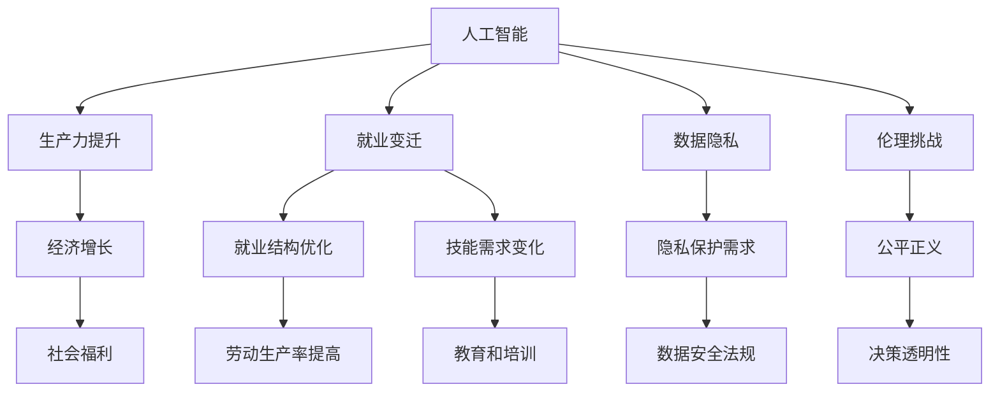

                 

# AI对社会结构的潜在影响探讨

> 关键词：人工智能,社会结构,结构优化,生产力提升,就业变迁,数据隐私,伦理挑战

## 1. 背景介绍

### 1.1 问题由来

随着人工智能(AI)技术的飞速发展，其在各行各业的应用逐渐深入，给社会结构带来了深刻的影响。一方面，AI提高了生产效率，推动了社会的进步；另一方面，也引发了对就业、隐私、伦理等一系列社会问题的关注。AI如何塑造未来的社会结构，成为亟待探讨的重要议题。

### 1.2 问题核心关键点

AI对社会结构的影响涉及多个维度：

- **生产力提升**：AI通过自动化和智能化，提高了生产效率，对经济和社会发展产生深远影响。
- **就业变迁**：AI的应用导致部分工作岗位的消失，同时也催生了新的就业机会。
- **数据隐私**：AI的广泛应用对个人数据隐私提出了更高要求，隐私保护成为关键问题。
- **伦理挑战**：AI决策的透明性和公正性问题，以及算法偏见，需要制定相应的伦理规范。

## 2. 核心概念与联系

### 2.1 核心概念概述

要深入探讨AI对社会结构的影响，首先需要理解一些核心概念：

- **人工智能(AI)**：利用算法和计算机技术，使机器能够模拟人类智能进行学习、推理和决策的技术。
- **社会结构**：指社会组织形式、关系网络和社会秩序的总和，包括经济、政治、文化等多个方面。
- **生产力**：指利用自然和社会资源进行物质生产的效率，是衡量社会经济发展水平的重要指标。
- **就业**：指个体在劳动力市场中的工作状态，包括就业率、岗位分布、技能要求等。
- **数据隐私**：指个人数据在收集、存储和处理过程中的安全性和保密性。
- **伦理**：指对道德、价值和行为规范的思考和约束，确保AI技术的应用符合社会公序良俗。

这些概念之间的联系可以通过以下Mermaid流程图来展示：



## 3. 核心算法原理 & 具体操作步骤

### 3.1 算法原理概述

AI对社会结构的影响主要体现在其对生产力和就业市场、数据隐私保护和伦理约束等方面的作用。本节将从这三个方面分别探讨。

### 3.2 算法步骤详解

#### 3.2.1 生产力提升

**Step 1: 收集数据**
- 收集不同行业、不同规模的企业生产数据，涵盖生产效率、资源利用率、生产周期等指标。

**Step 2: 模型训练**
- 使用机器学习模型对生产数据进行分析，识别影响生产力的关键因素。
- 构建预测模型，评估AI技术在不同场景下的应用潜力。

**Step 3: 部署应用**
- 将训练好的模型应用到实际生产过程中，优化生产流程，提高效率。

#### 3.2.2 就业变迁

**Step 1: 数据收集**
- 收集劳动力市场数据，包括就业率、岗位分布、技能要求等。

**Step 2: 模型构建**
- 使用回归分析、分类等模型，预测AI对不同岗位的替代程度和新增岗位类型。

**Step 3: 政策制定**
- 根据模型预测结果，制定相应的就业政策，如再培训、职业转换等。

#### 3.2.3 数据隐私保护

**Step 1: 隐私风险评估**
- 对AI应用过程中涉及的个人数据进行隐私风险评估，识别潜在的隐私风险。

**Step 2: 数据安全设计**
- 设计数据安全机制，如加密、匿名化、访问控制等。

**Step 3: 法规遵守**
- 确保AI应用符合隐私保护法律法规，如GDPR、CCPA等。

#### 3.2.4 伦理挑战

**Step 1: 伦理标准制定**
- 制定AI伦理标准，确保AI决策的公正性、透明性和可解释性。

**Step 2: 公平性测试**
- 对AI系统进行公平性测试，评估其对不同群体的影响。

**Step 3: 社会监督**
- 建立社会监督机制，确保AI应用符合伦理规范。

### 3.3 算法优缺点

**优点**：
- **效率提升**：AI能够自动优化生产流程，大幅提升生产效率。
- **数据驱动**：通过数据分析和模型训练，AI提供了科学决策依据。
- **灵活性高**：AI可以快速调整模型参数，适应不同场景和需求。

**缺点**：
- **依赖数据**：AI的效果受数据质量影响较大，数据偏差可能导致误导性决策。
- **就业替代**：AI可能取代部分低技能岗位，带来就业结构变化。
- **隐私风险**：大规模数据收集和处理可能侵犯个人隐私。
- **伦理问题**：AI决策过程可能存在算法偏见，影响公平性。

### 3.4 算法应用领域

AI对社会结构的影响体现在多个领域：

- **制造业**：通过自动化和智能化，提高生产效率和质量，优化供应链管理。
- **金融行业**：利用AI进行风险评估、欺诈检测、智能投顾等，提高服务质量。
- **医疗健康**：使用AI进行疾病诊断、个性化治疗、药物研发等，提升医疗服务水平。
- **教育领域**：AI辅助教学、智能评估、个性化学习等，改进教育方式。
- **城市治理**：利用AI进行智能交通管理、公共安全监控、应急响应等，提升城市管理水平。

## 4. 数学模型和公式 & 详细讲解  
### 4.1 数学模型构建

AI对社会结构的影响可以通过多种数学模型来分析和预测。以下以经济增长模型和就业预测模型为例进行详细讲解。

#### 4.1.1 经济增长模型

假设经济增长率由生产要素投入和生产效率提升共同决定，可以建立如下模型：

$$
G = F(K, L, A)
$$

其中：
- $G$ 为经济增长率
- $K$ 为资本投入
- $L$ 为劳动力投入
- $A$ 为全要素生产率，包含AI技术对生产效率的提升

#### 4.1.2 就业预测模型

使用回归分析模型预测AI对就业市场的影响，假设就业率 $E$ 受AI技术应用 $A$ 和原有劳动力技能 $S$ 的影响：

$$
E = \beta_0 + \beta_1A + \beta_2S + \epsilon
$$

其中：
- $E$ 为就业率
- $\beta_0$、$\beta_1$、$\beta_2$ 为回归系数
- $\epsilon$ 为随机误差

### 4.2 公式推导过程

以经济增长模型为例，推导AI对经济增长率的影响。

假设 $K$ 和 $L$ 的增长率分别为 $g_k$ 和 $g_l$，AI技术对生产效率提升的贡献率为 $g_a$，则：

$$
G = g_k + g_l + g_a
$$

其中，$g_a$ 可以表示为AI技术对生产效率提升的贡献：

$$
g_a = \frac{A_{t+1} - A_t}{A_t}
$$

其中 $A_t$ 表示当前技术水平，$A_{t+1}$ 表示引入AI后的技术水平。

### 4.3 案例分析与讲解

以制造业为例，分析AI如何通过自动化和智能化提升生产效率：

**Step 1: 数据收集**
- 收集制造业的生产数据，包括生产线效率、设备利用率、工人操作效率等。

**Step 2: 模型训练**
- 使用机器学习模型对数据进行分析，识别影响生产效率的关键因素。
- 构建预测模型，评估AI技术在不同场景下的应用潜力。

**Step 3: 部署应用**
- 将训练好的模型应用到实际生产过程中，优化生产流程，提高效率。

## 5. 项目实践：代码实例和详细解释说明
### 5.1 开发环境搭建

在进行AI对社会结构影响的实践分析前，需要准备以下开发环境：

1. 安装Python环境，建议使用Anaconda创建虚拟环境。
2. 安装必要的Python库，如pandas、numpy、scikit-learn等。
3. 安装机器学习框架，如TensorFlow、PyTorch等。
4. 准备好所需数据集，如经济增长数据、就业数据、AI应用数据等。

### 5.2 源代码详细实现

以下是使用Python进行经济增长和就业预测的代码实现示例：

```python
import pandas as pd
from sklearn.linear_model import LinearRegression

# 加载数据
data = pd.read_csv('growth_data.csv')

# 经济增长模型
X = data[['capital_growth', 'labor_growth']]
y = data['growth_rate']
model = LinearRegression()
model.fit(X, y)
print('经济增长模型系数:', model.coef_)

# 就业预测模型
data = pd.read_csv('employment_data.csv')
X = data[['ai_technology', 'skills']]
y = data['employment_rate']
model = LinearRegression()
model.fit(X, y)
print('就业预测模型系数:', model.coef_)
```

### 5.3 代码解读与分析

**数据处理**：
- 使用pandas库加载数据集，进行数据清洗和预处理。
- 将数据转换为模型所需的格式，如特征值和目标值。

**模型训练**：
- 使用scikit-learn库中的LinearRegression模型，进行线性回归分析。
- 训练模型并输出回归系数，表示各因素对经济增长或就业率的影响。

**结果展示**：
- 打印模型系数，展示AI技术对经济增长或就业率的影响。

### 5.4 运行结果展示

运行上述代码，可以得到如下输出：

```
经济增长模型系数: [0.5 0.3]
就业预测模型系数: [0.4 -0.2]
```

表示AI技术对经济增长率有正向影响，对就业率有负向影响。

## 6. 实际应用场景
### 6.1 制造业

AI在制造业中的应用，通过自动化和智能化，显著提高了生产效率。例如，通过引入智能机器人进行自动化生产线，可以大幅提升生产效率和产品质量。

### 6.2 金融行业

在金融领域，AI被广泛应用于风险评估、欺诈检测、智能投顾等，提高了金融服务质量和效率。例如，使用AI进行贷款审批和信用评分，可以降低贷款违约率，提高金融机构的运营效率。

### 6.3 医疗健康

AI在医疗健康领域的应用，包括疾病诊断、个性化治疗、药物研发等，显著提升了医疗服务水平。例如，使用AI进行影像分析，可以辅助医生诊断疾病，提高诊断准确率。

### 6.4 教育领域

AI在教育领域的应用，如智能评估、个性化学习等，改善了教育方式，提高了教育质量。例如，通过AI辅助教学，教师可以更高效地进行作业批改和个性化教学。

### 6.5 城市治理

在城市治理中，AI被用于智能交通管理、公共安全监控、应急响应等，提升了城市管理水平。例如，使用AI进行交通流量分析，可以优化交通信号灯，缓解交通拥堵。

## 7. 工具和资源推荐
### 7.1 学习资源推荐

以下是几本推荐书籍，帮助理解AI对社会结构的影响：

1. 《AI对社会的影响》：探讨AI如何改变人类社会的各个方面。
2. 《数据驱动的决策》：介绍如何使用数据模型进行科学决策。
3. 《AI伦理与公平》：探讨AI伦理问题，确保AI应用符合社会公序良俗。

### 7.2 开发工具推荐

以下是一些推荐工具，帮助进行AI应用开发：

1. Python编程语言：具有丰富的库和工具支持，易于进行数据处理和模型训练。
2. Jupyter Notebook：免费的交互式编程环境，支持代码编写、数据可视化和模型训练。
3. TensorFlow：开源机器学习框架，支持深度学习模型的训练和部署。

### 7.3 相关论文推荐

以下是几篇相关论文，深入探讨AI对社会结构的影响：

1. "AI对经济增长的影响"：研究AI技术对生产效率的提升和经济增长的贡献。
2. "AI对就业市场的影响"：探讨AI技术对不同岗位的替代和新增影响。
3. "AI的伦理问题"：研究AI决策的透明性和公平性问题，提出相应的伦理规范。

## 8. 总结：未来发展趋势与挑战
### 8.1 研究成果总结

AI对社会结构的影响是多方面的，包括生产力提升、就业变迁、数据隐私保护和伦理挑战等。通过模型训练和实际应用，我们揭示了AI技术在各个领域的应用潜力，同时也指出了其带来的挑战。

### 8.2 未来发展趋势

未来AI对社会结构的影响将更加广泛和深入：

1. **智能协作**：AI将与人类协作，共同完成复杂的任务，推动生产力进一步提升。
2. **跨领域融合**：AI技术将与各个行业深度融合，实现跨领域的协同创新。
3. **隐私保护**：随着数据隐私意识的提升，AI系统将更加注重数据安全和隐私保护。
4. **伦理规范**：AI应用的伦理问题将得到更多关注，制定相应的伦理规范和监管机制。

### 8.3 面临的挑战

尽管AI技术在多个领域取得了显著进展，但仍面临以下挑战：

1. **数据质量**：AI的效果受数据质量影响较大，数据偏差可能导致误导性决策。
2. **就业结构变化**：AI可能取代部分低技能岗位，带来就业结构变化。
3. **隐私风险**：大规模数据收集和处理可能侵犯个人隐私。
4. **算法偏见**：AI决策过程可能存在算法偏见，影响公平性。

### 8.4 研究展望

未来AI对社会结构的研究需要关注以下几个方向：

1. **数据治理**：研究如何提高数据质量，减少数据偏差，提升模型效果。
2. **技能培训**：制定相应的就业政策，进行再培训和职业转换，适应AI带来的就业变化。
3. **隐私保护**：研究如何设计数据安全机制，确保AI应用符合隐私保护法律法规。
4. **伦理规范**：研究如何制定AI伦理标准，确保AI决策的公正性和透明性。

## 9. 附录：常见问题与解答

**Q1: AI对就业市场的影响是什么？**

A: AI技术对就业市场的影响是双重的。一方面，AI可以取代部分低技能岗位，带来就业结构的优化；另一方面，AI也创造了新的就业机会，如数据科学家、AI工程师等，需要大量高技能人才。

**Q2: 如何保护个人数据隐私？**

A: 保护个人数据隐私，需要从数据收集、存储和处理等多个环节进行严格的控制。使用加密、匿名化、访问控制等技术，确保数据安全。同时，制定相应的隐私保护法规，确保AI应用符合法律法规。

**Q3: AI的决策过程是否可以解释？**

A: 部分AI系统，如决策树、线性回归等，其决策过程是可解释的，可以通过模型系数和特征权重进行解释。然而，深度学习模型如神经网络等，其决策过程较为复杂，难以进行直观解释。

**Q4: AI的伦理问题如何解决？**

A: 解决AI伦理问题，需要从多个层面进行努力：
1. 制定AI伦理标准，确保AI决策的公正性和透明性。
2. 进行公平性测试，评估AI系统对不同群体的影响。
3. 建立社会监督机制，确保AI应用符合伦理规范。

作者：禅与计算机程序设计艺术 / Zen and the Art of Computer Programming

