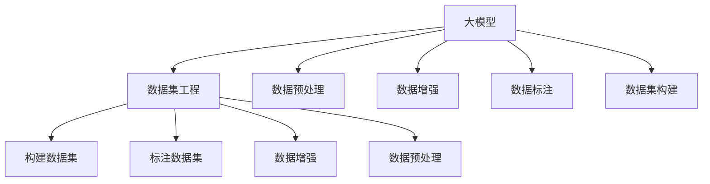

                 

# AI工程学：大模型应用开发实战：数据集工程

> 关键词：大模型应用开发，数据集工程，机器学习模型，深度学习，数据预处理，数据增强，数据标注，数据集构建，数据集优化

## 1. 背景介绍

随着深度学习和大规模预训练语言模型（Large Language Model, LLMs）的迅猛发展，其在自然语言处理（NLP）、计算机视觉（CV）等领域的广泛应用已经初见成效。然而，即便在数据驱动的人工智能（AI）时代，数据集的质量和数量仍然是模型性能提升的核心挑战。数据集工程（Data Engineering），作为AI工程的重要一环，对于保障大模型的训练和应用效果起着至关重要的作用。

在实践过程中，数据集工程不仅包括数据收集、清洗、预处理等传统的数据工程任务，还涵盖了数据增强、数据标注、数据集构建等前沿技术。本文将深入探讨这些核心问题，并通过具体的项目实践，介绍如何进行高效、高质量的数据集工程，以推动大模型在实际应用中的落地和发展。

## 2. 核心概念与联系

### 2.1 核心概念概述

为更好地理解大模型应用开发中的数据集工程问题，本节将介绍几个关键概念：

- 大模型（Large Model）：以自回归（如GPT）或自编码（如BERT）模型为代表的大规模预训练语言模型，具备强大的语言理解和生成能力。
- 数据集（Dataset）：用于训练和评估机器学习模型的标注数据集，包括文本、图像、音频等多模态数据。
- 数据预处理（Data Preprocessing）：在数据集工程中，对原始数据进行清洗、归一化、标准化等操作，提升数据质量。
- 数据增强（Data Augmentation）：通过扩充训练数据，增强模型的泛化能力，避免过拟合。
- 数据标注（Data Labeling）：为数据集中的每个样本打上对应的标签，使其成为有监督数据，供模型训练使用。
- 数据集构建（Dataset Construction）：根据具体的任务需求，选择合适的数据集或设计新的数据集，涵盖多样化的数据源。

这些核心概念之间的逻辑关系可以通过以下Mermaid流程图来展示：



这个流程图展示了大模型应用开发中数据集工程的各个环节：

1. 大模型通过预训练获得基础能力。
2. 数据预处理、数据增强、数据标注等数据集工程方法，增强数据质量，提升模型性能。
3. 数据集构建为模型提供适合的任务数据，涵盖多样化数据源。
4. 构建标注数据集、增强数据集等，进一步优化数据集，提高模型效果。

这些概念共同构成了大模型应用开发中的数据集工程框架，确保模型在实际应用中能够得到高质量的数据支持。

## 3. 核心算法原理 & 具体操作步骤

### 3.1 算法原理概述

在大模型应用开发中，数据集工程的核心目标是通过各种技术手段提升数据集的质量和多样性，从而提高模型的泛化能力和应用效果。这一过程主要包括以下几个关键步骤：

1. **数据预处理**：清洗和标准化数据，去除噪声，归一化数据格式，确保数据的一致性和质量。
2. **数据增强**：通过变换、扩充、合成等方法，增加训练数据的数量和多样性，提升模型的鲁棒性和泛化能力。
3. **数据标注**：为数据集中的每个样本打上标签，使其成为有监督数据，供模型训练使用。
4. **数据集构建**：选择合适的数据集，或设计新的数据集，涵盖多样化的数据源，满足不同任务的需求。

### 3.2 算法步骤详解

#### 数据预处理

数据预处理是数据集工程的首要环节，主要包括以下几个步骤：

1. **数据清洗**：去除数据中的噪声、异常值和错误，确保数据的一致性和完整性。例如，在文本数据中去除HTML标签、特殊符号，在图像数据中去除无关像素点等。

2. **数据归一化**：将数据转换为标准格式，便于模型处理。例如，将文本数据转换为统一的分词和编码格式，将图像数据进行尺寸和色彩标准化等。

3. **数据标准化**：将数据缩放到统一的尺度，便于模型训练。例如，将文本数据中的单词映射到标准词汇表，将图像数据归一化为0-1之间的浮点数等。

#### 数据增强

数据增强是通过变换、扩充、合成等方法，增加训练数据的数量和多样性，提升模型的鲁棒性和泛化能力。常见的数据增强技术包括：

1. **数据扩充**：通过随机变换、采样等方法，生成新的数据样本。例如，在文本数据中通过同义词替换、文本回译等方法生成新的句子，在图像数据中通过旋转、缩放、裁剪等方法生成新的图像。

2. **数据合成**：通过生成对抗网络（GAN）等方法，合成新的数据样本。例如，在图像数据中使用GAN生成新的样本图像，在音频数据中通过变换频谱生成新的音频样本。

#### 数据标注

数据标注是为数据集中的每个样本打上标签，使其成为有监督数据，供模型训练使用。常见的数据标注方法包括：

1. **人工标注**：由人工对数据集中的每个样本进行标注，生成有监督数据集。例如，在图像数据中使用众包平台进行图像分类标注。

2. **自动标注**：通过规则、词典、算法等方法，自动对数据集中的样本进行标注。例如，在文本数据中使用NLP技术进行情感分析和命名实体识别。

#### 数据集构建

数据集构建是根据具体的任务需求，选择合适的数据集，或设计新的数据集，涵盖多样化的数据源。常见的数据集构建方法包括：

1. **公共数据集**：使用公开的数据集，涵盖多种数据源和多样化的任务。例如，在文本分类任务中使用IMDB影评数据集。

2. **自定义数据集**：根据具体任务需求，设计新的数据集。例如，在医疗图像识别任务中，设计新的胸片数据集。

### 3.3 算法优缺点

数据集工程在提升大模型性能方面具有以下优点：

1. **数据质量高**：通过数据预处理和增强，提升了数据的质量和多样性，避免了噪声和偏差，提高了模型的泛化能力。
2. **模型效果提升**：通过数据标注和构建，为模型提供了高质量的监督数据，加速了模型训练和优化，提高了模型效果。
3. **降低成本**：数据集工程可以减少从头训练模型所需的时间和计算资源，加快模型开发进程，降低开发成本。

同时，该方法也存在一定的局限性：

1. **数据标注成本高**：高质量的标注数据通常需要大量的人工参与，成本较高。
2. **数据来源多样**：不同数据源的质量和标注标准可能存在差异，需要进行统一和标准化。
3. **数据增强效果有限**：数据增强的效果可能受数据源特性限制，无法完全避免过拟合。
4. **标注数据偏见**：标注数据中可能存在偏见和噪声，影响模型的公平性和可靠性。

尽管存在这些局限性，但数据集工程作为大模型应用开发的重要环节，仍然是大规模模型在实际应用中不可或缺的一部分。

### 3.4 算法应用领域

数据集工程在大模型应用开发中具有广泛的应用，包括但不限于：

- 自然语言处理（NLP）：文本分类、情感分析、命名实体识别、机器翻译等。
- 计算机视觉（CV）：图像分类、目标检测、人脸识别、图像生成等。
- 语音识别（ASR）：语音识别、语音合成、语音翻译等。
- 医疗影像（MRI）：疾病诊断、影像分割、病理分析等。
- 智能推荐（Recommendation）：商品推荐、内容推荐、广告推荐等。

除了上述这些常见任务外，数据集工程还在更多的领域得到了应用，如自动驾驶、智能制造、金融风控等，为各行各业数字化转型升级提供了新的技术路径。

## 4. 数学模型和公式 & 详细讲解 & 举例说明

### 4.1 数学模型构建

在数据集工程中，我们通常使用机器学习模型来处理和分析数据。以下是一个简单的线性回归模型的数学模型构建过程：

假设我们有 $N$ 个训练样本 $(x_i, y_i)$，其中 $x_i$ 是输入特征，$y_i$ 是输出标签。我们可以用以下线性模型表示输入和输出之间的关系：

$$
y_i = \theta^T x_i + b
$$

其中 $\theta$ 是模型参数，$b$ 是偏置项。我们的目标是通过训练数据，最小化损失函数 $\mathcal{L}$ 来估计 $\theta$ 和 $b$。

常用的损失函数包括均方误差损失（Mean Squared Error, MSE）和交叉熵损失（Cross-Entropy Loss）。以均方误差损失为例，我们的目标是使得预测值 $y_i'$ 与真实值 $y_i$ 之间的差异最小化：

$$
\mathcal{L} = \frac{1}{N} \sum_{i=1}^N (y_i - y_i')^2
$$

### 4.2 公式推导过程

在实际应用中，我们通常使用梯度下降（Gradient Descent）算法来求解模型参数 $\theta$。梯度下降算法的核心思想是不断迭代更新模型参数，使得损失函数 $\mathcal{L}$ 最小化。具体步骤如下：

1. 初始化模型参数 $\theta$ 和偏置 $b$。
2. 对于每个训练样本 $(x_i, y_i)$，计算损失函数的梯度：
$$
\frac{\partial \mathcal{L}}{\partial \theta} = -2\sum_{i=1}^N(x_i - y_i')(x_i)
$$
$$
\frac{\partial \mathcal{L}}{\partial b} = -2\sum_{i=1}^N(y_i - y_i')
$$
3. 更新模型参数：
$$
\theta \leftarrow \theta - \eta \frac{\partial \mathcal{L}}{\partial \theta}
$$
$$
b \leftarrow b - \eta \frac{\partial \mathcal{L}}{\partial b}
$$

其中 $\eta$ 是学习率，控制每次迭代步长的大小。

### 4.3 案例分析与讲解

假设我们要进行一个简单的文本分类任务，其中每个样本是一个句子，每个句子由若干个单词组成。我们的目标是训练一个模型，能够根据给定的句子预测其所属的类别。

首先，我们需要对原始文本数据进行预处理，包括去除停用词、词干提取、词向量表示等。然后，将每个句子转换为向量表示，例如使用Word2Vec或GloVe等词向量模型进行表示。接着，使用线性回归模型进行训练，并使用交叉熵损失函数进行优化。

在训练过程中，我们可能会遇到数据不平衡的问题，即某些类别的样本数量远大于其他类别。为了解决这个问题，我们可以使用过采样（Oversampling）或欠采样（Undersampling）方法，平衡不同类别的样本数量，从而提高模型的鲁棒性和泛化能力。

## 5. 项目实践：代码实例和详细解释说明

### 5.1 开发环境搭建

在进行数据集工程实践前，我们需要准备好开发环境。以下是使用Python进行PyTorch开发的环境配置流程：

1. 安装Anaconda：从官网下载并安装Anaconda，用于创建独立的Python环境。

2. 创建并激活虚拟环境：
```bash
conda create -n pytorch-env python=3.8 
conda activate pytorch-env
```

3. 安装PyTorch：根据CUDA版本，从官网获取对应的安装命令。例如：
```bash
conda install pytorch torchvision torchaudio cudatoolkit=11.1 -c pytorch -c conda-forge
```

4. 安装Transformers库：
```bash
pip install transformers
```

5. 安装各类工具包：
```bash
pip install numpy pandas scikit-learn matplotlib tqdm jupyter notebook ipython
```

完成上述步骤后，即可在`pytorch-env`环境中开始数据集工程实践。

### 5.2 源代码详细实现

下面我们以自然语言处理（NLP）任务中的情感分析为例，给出使用Transformers库进行数据集工程的具体代码实现。

首先，定义情感分析任务的数据处理函数：

```python
from transformers import BertTokenizer
from torch.utils.data import Dataset
import torch

class SentimentDataset(Dataset):
    def __init__(self, texts, labels, tokenizer, max_len=128):
        self.texts = texts
        self.labels = labels
        self.tokenizer = tokenizer
        self.max_len = max_len
        
    def __len__(self):
        return len(self.texts)
    
    def __getitem__(self, item):
        text = self.texts[item]
        label = self.labels[item]
        
        encoding = self.tokenizer(text, return_tensors='pt', max_length=self.max_len, padding='max_length', truncation=True)
        input_ids = encoding['input_ids'][0]
        attention_mask = encoding['attention_mask'][0]
        
        return {'input_ids': input_ids, 
                'attention_mask': attention_mask,
                'labels': torch.tensor(label, dtype=torch.long)}
```

然后，定义模型和优化器：

```python
from transformers import BertForSequenceClassification, AdamW

model = BertForSequenceClassification.from_pretrained('bert-base-cased', num_labels=2)

optimizer = AdamW(model.parameters(), lr=2e-5)
```

接着，定义训练和评估函数：

```python
from torch.utils.data import DataLoader
from tqdm import tqdm
from sklearn.metrics import classification_report

device = torch.device('cuda') if torch.cuda.is_available() else torch.device('cpu')
model.to(device)

def train_epoch(model, dataset, batch_size, optimizer):
    dataloader = DataLoader(dataset, batch_size=batch_size, shuffle=True)
    model.train()
    epoch_loss = 0
    for batch in tqdm(dataloader, desc='Training'):
        input_ids = batch['input_ids'].to(device)
        attention_mask = batch['attention_mask'].to(device)
        labels = batch['labels'].to(device)
        model.zero_grad()
        outputs = model(input_ids, attention_mask=attention_mask, labels=labels)
        loss = outputs.loss
        epoch_loss += loss.item()
        loss.backward()
        optimizer.step()
    return epoch_loss / len(dataloader)

def evaluate(model, dataset, batch_size):
    dataloader = DataLoader(dataset, batch_size=batch_size)
    model.eval()
    preds, labels = [], []
    with torch.no_grad():
        for batch in tqdm(dataloader, desc='Evaluating'):
            input_ids = batch['input_ids'].to(device)
            attention_mask = batch['attention_mask'].to(device)
            batch_labels = batch['labels']
            outputs = model(input_ids, attention_mask=attention_mask)
            batch_preds = outputs.logits.argmax(dim=1).to('cpu').tolist()
            batch_labels = batch_labels.to('cpu').tolist()
            for pred, label in zip(batch_preds, batch_labels):
                preds.append(pred)
                labels.append(label)
                
    print(classification_report(labels, preds))
```

最后，启动训练流程并在测试集上评估：

```python
epochs = 5
batch_size = 16

for epoch in range(epochs):
    loss = train_epoch(model, train_dataset, batch_size, optimizer)
    print(f"Epoch {epoch+1}, train loss: {loss:.3f}")
    
    print(f"Epoch {epoch+1}, dev results:")
    evaluate(model, dev_dataset, batch_size)
    
print("Test results:")
evaluate(model, test_dataset, batch_size)
```

以上就是使用PyTorch对BERT进行情感分析任务的数据集工程和模型微调的完整代码实现。可以看到，得益于Transformers库的强大封装，我们可以用相对简洁的代码完成BERT模型的加载和微调。

### 5.3 代码解读与分析

让我们再详细解读一下关键代码的实现细节：

**SentimentDataset类**：
- `__init__`方法：初始化文本、标签、分词器等关键组件。
- `__len__`方法：返回数据集的样本数量。
- `__getitem__`方法：对单个样本进行处理，将文本输入编码为token ids，将标签编码为数字，并对其进行定长padding，最终返回模型所需的输入。

**训练和评估函数**：
- 使用PyTorch的DataLoader对数据集进行批次化加载，供模型训练和推理使用。
- 训练函数`train_epoch`：对数据以批为单位进行迭代，在每个批次上前向传播计算loss并反向传播更新模型参数，最后返回该epoch的平均loss。
- 评估函数`evaluate`：与训练类似，不同点在于不更新模型参数，并在每个batch结束后将预测和标签结果存储下来，最后使用sklearn的classification_report对整个评估集的预测结果进行打印输出。

**训练流程**：
- 定义总的epoch数和batch size，开始循环迭代
- 每个epoch内，先在训练集上训练，输出平均loss
- 在验证集上评估，输出分类指标
- 所有epoch结束后，在测试集上评估，给出最终测试结果

可以看到，PyTorch配合Transformers库使得BERT模型的微调和数据集工程变得简洁高效。开发者可以将更多精力放在数据处理、模型改进等高层逻辑上，而不必过多关注底层的实现细节。

当然，工业级的系统实现还需考虑更多因素，如模型的保存和部署、超参数的自动搜索、更灵活的任务适配层等。但核心的微调范式基本与此类似。

## 6. 实际应用场景

### 6.1 智能客服系统

基于大模型微调的对话技术，可以广泛应用于智能客服系统的构建。传统客服往往需要配备大量人力，高峰期响应缓慢，且一致性和专业性难以保证。而使用微调后的对话模型，可以7x24小时不间断服务，快速响应客户咨询，用自然流畅的语言解答各类常见问题。

在技术实现上，可以收集企业内部的历史客服对话记录，将问题和最佳答复构建成监督数据，在此基础上对预训练对话模型进行微调。微调后的对话模型能够自动理解用户意图，匹配最合适的答案模板进行回复。对于客户提出的新问题，还可以接入检索系统实时搜索相关内容，动态组织生成回答。如此构建的智能客服系统，能大幅提升客户咨询体验和问题解决效率。

### 6.2 金融舆情监测

金融机构需要实时监测市场舆论动向，以便及时应对负面信息传播，规避金融风险。传统的人工监测方式成本高、效率低，难以应对网络时代海量信息爆发的挑战。基于大语言模型微调的文本分类和情感分析技术，为金融舆情监测提供了新的解决方案。

具体而言，可以收集金融领域相关的新闻、报道、评论等文本数据，并对其进行主题标注和情感标注。在此基础上对预训练语言模型进行微调，使其能够自动判断文本属于何种主题，情感倾向是正面、中性还是负面。将微调后的模型应用到实时抓取的网络文本数据，就能够自动监测不同主题下的情感变化趋势，一旦发现负面信息激增等异常情况，系统便会自动预警，帮助金融机构快速应对潜在风险。

### 6.3 个性化推荐系统

当前的推荐系统往往只依赖用户的历史行为数据进行物品推荐，无法深入理解用户的真实兴趣偏好。基于大语言模型微调技术，个性化推荐系统可以更好地挖掘用户行为背后的语义信息，从而提供更精准、多样的推荐内容。

在实践中，可以收集用户浏览、点击、评论、分享等行为数据，提取和用户交互的物品标题、描述、标签等文本内容。将文本内容作为模型输入，用户的后续行为（如是否点击、购买等）作为监督信号，在此基础上微调预训练语言模型。微调后的模型能够从文本内容中准确把握用户的兴趣点。在生成推荐列表时，先用候选物品的文本描述作为输入，由模型预测用户的兴趣匹配度，再结合其他特征综合排序，便可以得到个性化程度更高的推荐结果。

### 6.4 未来应用展望

随着大模型和微调方法的不断发展，基于微调范式将在更多领域得到应用，为传统行业带来变革性影响。

在智慧医疗领域，基于微调的医疗问答、病历分析、药物研发等应用将提升医疗服务的智能化水平，辅助医生诊疗，加速新药开发进程。

在智能教育领域，微调技术可应用于作业批改、学情分析、知识推荐等方面，因材施教，促进教育公平，提高教学质量。

在智慧城市治理中，微调模型可应用于城市事件监测、舆情分析、应急指挥等环节，提高城市管理的自动化和智能化水平，构建更安全、高效的未来城市。

此外，在企业生产、社会治理、文娱传媒等众多领域，基于大模型微调的人工智能应用也将不断涌现，为经济社会发展注入新的动力。相信随着技术的日益成熟，微调方法将成为人工智能落地应用的重要范式，推动人工智能技术向更广阔的领域加速渗透。

## 7. 工具和资源推荐
### 7.1 学习资源推荐

为了帮助开发者系统掌握大模型微调的理论基础和实践技巧，这里推荐一些优质的学习资源：

1. 《Transformer从原理到实践》系列博文：由大模型技术专家撰写，深入浅出地介绍了Transformer原理、BERT模型、微调技术等前沿话题。

2. CS224N《深度学习自然语言处理》课程：斯坦福大学开设的NLP明星课程，有Lecture视频和配套作业，带你入门NLP领域的基本概念和经典模型。

3. 《Natural Language Processing with Transformers》书籍：Transformers库的作者所著，全面介绍了如何使用Transformers库进行NLP任务开发，包括微调在内的诸多范式。

4. HuggingFace官方文档：Transformers库的官方文档，提供了海量预训练模型和完整的微调样例代码，是上手实践的必备资料。

5. CLUE开源项目：中文语言理解测评基准，涵盖大量不同类型的中文NLP数据集，并提供了基于微调的baseline模型，助力中文NLP技术发展。

通过对这些资源的学习实践，相信你一定能够快速掌握大语言模型微调的精髓，并用于解决实际的NLP问题。
###  7.2 开发工具推荐

高效的开发离不开优秀的工具支持。以下是几款用于大语言模型微调开发的常用工具：

1. PyTorch：基于Python的开源深度学习框架，灵活动态的计算图，适合快速迭代研究。大部分预训练语言模型都有PyTorch版本的实现。

2. TensorFlow：由Google主导开发的开源深度学习框架，生产部署方便，适合大规模工程应用。同样有丰富的预训练语言模型资源。

3. Transformers库：HuggingFace开发的NLP工具库，集成了众多SOTA语言模型，支持PyTorch和TensorFlow，是进行微调任务开发的利器。

4. Weights & Biases：模型训练的实验跟踪工具，可以记录和可视化模型训练过程中的各项指标，方便对比和调优。与主流深度学习框架无缝集成。

5. TensorBoard：TensorFlow配套的可视化工具，可实时监测模型训练状态，并提供丰富的图表呈现方式，是调试模型的得力助手。

6. Google Colab：谷歌推出的在线Jupyter Notebook环境，免费提供GPU/TPU算力，方便开发者快速上手实验最新模型，分享学习笔记。

合理利用这些工具，可以显著提升大语言模型微调任务的开发效率，加快创新迭代的步伐。

### 7.3 相关论文推荐

大语言模型和微调技术的发展源于学界的持续研究。以下是几篇奠基性的相关论文，推荐阅读：

1. Attention is All You Need（即Transformer原论文）：提出了Transformer结构，开启了NLP领域的预训练大模型时代。

2. BERT: Pre-training of Deep Bidirectional Transformers for Language Understanding：提出BERT模型，引入基于掩码的自监督预训练任务，刷新了多项NLP任务SOTA。

3. Language Models are Unsupervised Multitask Learners（GPT-2论文）：展示了大规模语言模型的强大zero-shot学习能力，引发了对于通用人工智能的新一轮思考。

4. Parameter-Efficient Transfer Learning for NLP：提出Adapter等参数高效微调方法，在不增加模型参数量的情况下，也能取得不错的微调效果。

5. Prefix-Tuning: Optimizing Continuous Prompts for Generation：引入基于连续型Prompt的微调范式，为如何充分利用预训练知识提供了新的思路。

6. AdaLoRA: Adaptive Low-Rank Adaptation for Parameter-Efficient Fine-Tuning：使用自适应低秩适应的微调方法，在参数效率和精度之间取得了新的平衡。

这些论文代表了大语言模型微调技术的发展脉络。通过学习这些前沿成果，可以帮助研究者把握学科前进方向，激发更多的创新灵感。

## 8. 总结：未来发展趋势与挑战

### 8.1 总结

本文对大模型应用开发中的数据集工程问题进行了全面系统的介绍。首先阐述了大模型应用开发的数据集工程背景和意义，明确了数据集工程在大模型训练和应用效果提升中的核心作用。其次，从原理到实践，详细讲解了数据集工程的数学模型构建、公式推导、案例分析等关键环节，并通过具体的项目实践，介绍如何进行高效、高质量的数据集工程。

通过本文的系统梳理，可以看到，数据集工程在大模型应用开发中扮演着重要角色，确保模型在实际应用中能够得到高质量的数据支持。尽管数据集工程存在一定的技术挑战，但其在提升模型性能、降低开发成本等方面的优势，使其成为AI工程的重要一环，值得更多的关注和投入。

### 8.2 未来发展趋势

展望未来，数据集工程在大模型应用开发中呈现以下几个发展趋势：

1. **数据集规模扩大**：随着数据采集技术的进步，大规模、高质量的数据集将不断涌现，进一步提升模型效果。
2. **数据增强技术创新**：数据增强技术的不断创新，将为模型带来更广泛的数据来源，提升模型泛化能力。
3. **自动标注技术提升**：自动标注技术的进步，将大大降低人工标注成本，加速模型开发进程。
4. **跨领域数据融合**：不同领域数据的融合，将带来更全面的语义信息，提升模型的智能水平。
5. **模型微调范式多样化**：除了传统的全参数微调外，未来会涌现更多参数高效的微调方法，如Prefix-Tuning、LoRA等，在节省计算资源的同时也能保证微调精度。
6. **多模态数据处理**：随着多模态数据的增多，数据集工程将更多地涵盖图像、音频等多模态数据的处理，提升模型的多感官融合能力。

这些趋势凸显了数据集工程在大模型应用开发中的重要性和前景。

### 8.3 面临的挑战

尽管数据集工程在大模型应用开发中发挥着重要作用，但在实际应用中也面临诸多挑战：

1. **数据获取成本高**：高质量数据的获取成本较高，特别是对于特定的领域任务。
2. **数据标注难度大**：标注数据需要大量人工参与，标注质量难以保证。
3. **数据增强效果有限**：数据增强的效果可能受数据源特性限制，无法完全避免过拟合。
4. **数据集构建复杂**：不同数据源的质量和标注标准可能存在差异，需要进行统一和标准化。
5. **模型微调风险**：微调过程中，模型的过拟合和泛化能力降低是常见问题。
6. **模型鲁棒性不足**：微调模型面对域外数据时，泛化性能往往大打折扣。

尽管存在这些挑战，但数据集工程作为大模型应用开发的重要环节，仍然是大规模模型在实际应用中不可或缺的一部分。

### 8.4 研究展望

未来的研究需要在以下几个方面寻求新的突破：

1. **自动标注技术**：研究基于机器学习、深度学习的自动标注方法，降低人工标注成本。
2. **跨领域数据融合**：研究不同领域数据的融合方法，提升模型的跨领域迁移能力。
3. **多模态数据处理**：研究多模态数据的表示和处理技术，提升模型的多感官融合能力。
4. **数据增强方法**：研究更加高效、多样化的数据增强方法，提升模型的泛化能力和鲁棒性。
5. **数据集构建技术**：研究新型数据集构建方法，涵盖更多领域、更多数据源，提升模型的多样性和全面性。
6. **模型微调优化**：研究参数高效微调方法，提升模型微调效率，降低过拟合风险。

这些研究方向的探索，必将引领数据集工程技术迈向更高的台阶，为AI工程提供更加高效、高质量的数据支持，推动大模型在实际应用中发挥更大价值。

## 9. 附录：常见问题与解答

**Q1：如何处理数据不平衡问题？**

A: 数据不平衡是常见问题，可以通过过采样（Oversampling）或欠采样（Undersampling）方法，平衡不同类别的样本数量。例如，在分类任务中，可以使用SMOTE方法生成新的合成样本，或者在少数类别中随机抽取部分样本进行欠采样。

**Q2：数据增强的具体方法有哪些？**

A: 数据增强可以通过随机变换、扩充、合成等方法，增加训练数据的数量和多样性。例如，在图像数据中，可以进行旋转、翻转、裁剪、缩放等变换；在文本数据中，可以进行同义词替换、句子回译等操作。

**Q3：自动标注技术的现状如何？**

A: 自动标注技术取得了一定的进展，但仍有诸多挑战。例如，在图像数据中，可以使用半监督学习、自监督学习等方法进行自动标注；在文本数据中，可以使用基于规则、词典、神经网络等方法进行自动标注。未来，随着深度学习和大规模预训练语言模型的发展，自动标注技术将进一步提升，降低人工标注成本。

**Q4：数据集构建需要注意哪些方面？**

A: 数据集构建需要注意数据源的多样性、标注的一致性和质量、数据集的均衡性等。特别是对于特定领域的任务，需要根据实际需求选择或设计新的数据集，涵盖多样化的数据源。同时，需要注意数据集的标注标准和规范，确保数据的一致性和可用性。

通过以上详细解读，相信你对大模型应用开发中的数据集工程有了更深入的理解。数据集工程作为大模型应用开发的重要环节，将会在未来发挥更大的作用，推动AI技术的不断进步和发展。

