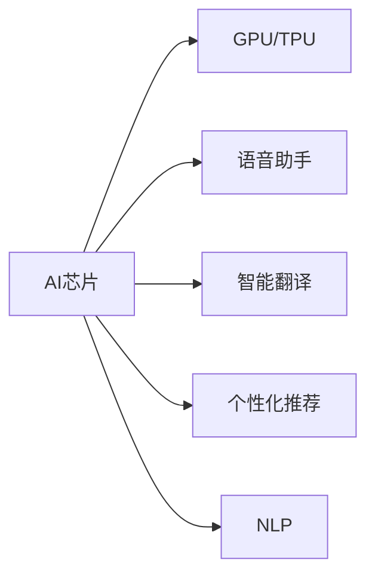

                 

## 1. 背景介绍

### 1.1 问题由来
随着人工智能技术的飞速发展，AI手机逐渐成为各大厂商竞相追逐的焦点。它不仅是通讯工具，更是集成了多种AI功能的智能手机。而大语言模型作为AI手机的重要组成部分，在智能问答、智能助理、个性化推荐、智能翻译等领域中发挥着至关重要的作用。因此，探讨AI手机对大模型行业的影响，对于理解AI手机的未来发展趋势以及大语言模型的应用前景，具有重要意义。

### 1.2 问题核心关键点
AI手机对大模型行业的影响主要体现在以下几个方面：

1. **用户数据驱动**：AI手机通过大量收集用户行为数据，为语言模型的预训练和微调提供了丰富的数据资源，使得模型更加贴合实际应用。
2. **实时反馈与优化**：AI手机可实现实时反馈与优化，模型训练更加高效，更新速度更快。
3. **多任务并行**：AI手机集成了多种AI功能，如智能翻译、智能助理、个性化推荐等，这些功能往往需要共享同一语言模型，从而推动了大模型的多任务学习和应用。
4. **硬件加速**：AI手机中集成的GPU、TPU等高性能硬件设备，为大规模语言模型的训练和推理提供了强有力的支持。

### 1.3 问题研究意义
研究AI手机对大模型行业的影响，有助于理解AI手机与大语言模型的互动关系，明确大语言模型在AI手机中的价值与定位。此外，研究AI手机的多功能应用和硬件架构，也有助于推动大语言模型的应用场景和性能提升，加速其落地应用。

## 2. 核心概念与联系

### 2.1 核心概念概述

AI手机作为一种集成了多种AI功能的智能手机，具有以下核心概念：

1. **AI芯片**：AI手机内置的GPU、TPU等高性能硬件设备，为AI模型提供了强大的计算能力。
2. **语音助手**：通过语音识别和语音合成技术，AI手机能够与用户进行自然语言交流。
3. **智能翻译**：AI手机内置的翻译功能，能够实时翻译多种语言，提供跨语言交流的能力。
4. **个性化推荐**：AI手机根据用户行为数据，提供个性化的内容推荐服务，提升用户体验。
5. **自然语言处理(NLP)**：AI手机依赖于自然语言处理技术，实现智能问答、智能助理等核心功能。

这些核心概念与大语言模型紧密相关，共同构成了AI手机的多功能应用体系。

### 2.2 核心概念原理和架构的 Mermaid 流程图



该流程图展示了AI手机中各个核心概念的相互关系：

1. 语音助手通过语音识别和语音合成技术实现与用户的交互。
2. 智能翻译利用自然语言处理技术，实现多语言之间的实时翻译。
3. 个性化推荐基于用户行为数据，提供个性化的内容推荐服务。
4. NLP是所有AI功能的基础，依赖于大语言模型来实现自然语言理解和生成。

## 3. 核心算法原理 & 具体操作步骤

### 3.1 算法原理概述

AI手机对大模型行业的影响，主要体现在以下几个方面：

1. **数据采集与预处理**：AI手机通过传感器、麦克风、摄像头等设备，实时采集用户行为数据和环境数据，这些数据经过清洗、归一化等预处理，成为大语言模型预训练和微调的重要数据来源。
2. **在线学习与微调**：AI手机内置的语言模型能够实时接收用户输入和反馈，利用这些信息进行在线学习，调整模型参数，从而提升模型的性能和适应性。
3. **多任务学习与共享模型**：AI手机集成的多种AI功能，如智能翻译、智能助理、个性化推荐等，共享同一语言模型，推动了大模型的多任务学习和应用。
4. **硬件加速与模型压缩**：AI手机中的AI芯片，如GPU、TPU等，为大规模语言模型的训练和推理提供了强有力的硬件支持。同时，为了提升效率，AI手机也会采用模型压缩、稀疏化等技术对模型进行优化。

### 3.2 算法步骤详解

AI手机对大语言模型的影响主要体现在以下几个算法步骤中：

1. **数据采集**：通过AI手机的传感器、麦克风、摄像头等设备，实时采集用户行为数据和环境数据。
2. **数据预处理**：对采集到的数据进行清洗、归一化等预处理，生成训练样本。
3. **模型训练**：利用预处理后的数据，在大语言模型上进行在线学习，不断调整模型参数。
4. **模型部署**：将训练好的模型部署到AI手机中，提供智能翻译、智能助理、个性化推荐等核心功能。
5. **模型优化**：通过AI手机内置的AI芯片，对模型进行硬件加速，同时采用模型压缩、稀疏化等技术进行优化。

### 3.3 算法优缺点

AI手机对大模型行业的影响，既有优点也有缺点：

**优点**：

1. **数据丰富**：AI手机通过大量采集用户行为数据，为模型训练提供了丰富的数据资源，模型更加贴合实际应用。
2. **实时优化**：AI手机可以实现实时反馈与优化，模型更新速度更快，性能提升更加显著。
3. **多任务应用**：AI手机集成的多种AI功能，共享同一语言模型，推动了大模型的多任务学习和应用。
4. **硬件加速**：AI手机中的AI芯片，为大规模语言模型的训练和推理提供了强有力的硬件支持。

**缺点**：

1. **隐私问题**：大量采集用户数据，存在隐私泄露的风险。
2. **计算资源消耗大**：大语言模型的训练和推理需要大量的计算资源，硬件成本较高。
3. **模型泛化性差**：AI手机中的数据往往是局部化的，模型的泛化性可能较差。
4. **算法复杂度较高**：AI手机中的多任务学习和实时优化，增加了算法的复杂度。

### 3.4 算法应用领域

AI手机对大模型行业的影响，体现在以下几个领域：

1. **智能助理**：通过语音助手和NLP技术，AI手机能够实现与用户的自然语言交流，提供个性化的服务。
2. **智能翻译**：AI手机内置的翻译功能，利用NLP技术实现实时翻译，提升跨语言交流的便捷性。
3. **个性化推荐**：AI手机通过用户行为数据，提供个性化的内容推荐服务，提升用户体验。
4. **智能问答**：AI手机中的NLP模型能够理解用户问题，提供准确的答案，提升智能问答的准确性和效率。
5. **可穿戴设备**：AI手机中的大模型可以应用于智能手表、智能眼镜等可穿戴设备，提供多种AI功能。

## 4. 数学模型和公式 & 详细讲解 & 举例说明

### 4.1 数学模型构建

假设AI手机中的语言模型为 $M_{\theta}$，其中 $\theta$ 为模型参数。AI手机通过用户行为数据 $D=\{(x_i, y_i)\}_{i=1}^N$ 进行微调，最小化损失函数 $\mathcal{L}(M_{\theta}, D)$。

数学模型构建的具体步骤如下：

1. **数据采集**：通过AI手机的传感器、麦克风、摄像头等设备，实时采集用户行为数据和环境数据，生成训练样本集 $D$。
2. **数据预处理**：对采集到的数据进行清洗、归一化等预处理，生成训练样本集 $D$。
3. **模型训练**：利用预处理后的数据，在大语言模型上进行在线学习，不断调整模型参数 $\theta$，最小化损失函数 $\mathcal{L}(M_{\theta}, D)$。
4. **模型优化**：通过AI手机内置的AI芯片，对模型进行硬件加速，同时采用模型压缩、稀疏化等技术进行优化。

### 4.2 公式推导过程

假设AI手机中的语言模型为 $M_{\theta}$，其中 $\theta$ 为模型参数。AI手机通过用户行为数据 $D=\{(x_i, y_i)\}_{i=1}^N$ 进行微调，最小化损失函数 $\mathcal{L}(M_{\theta}, D)$。

损失函数 $\mathcal{L}(M_{\theta}, D)$ 的定义如下：

$$
\mathcal{L}(M_{\theta}, D) = \frac{1}{N}\sum_{i=1}^N \ell(M_{\theta}(x_i), y_i)
$$

其中 $\ell$ 为损失函数，通常为交叉熵损失函数。

根据梯度下降算法，模型的更新公式如下：

$$
\theta \leftarrow \theta - \eta \nabla_{\theta}\mathcal{L}(\theta, D)
$$

其中 $\eta$ 为学习率，$\nabla_{\theta}\mathcal{L}(\theta, D)$ 为损失函数对模型参数 $\theta$ 的梯度。

### 4.3 案例分析与讲解

以智能翻译为例，介绍AI手机对大模型行业的影响：

假设AI手机中的语言模型为 $M_{\theta}$，其中 $\theta$ 为模型参数。AI手机通过实时翻译功能，采集用户输入和输出语句对 $(x_i, y_i)$，其中 $x_i$ 为用户输入，$y_i$ 为用户期望的翻译结果。

1. **数据采集**：AI手机通过麦克风和键盘，实时采集用户输入和输出语句对 $(x_i, y_i)$，生成训练样本集 $D$。
2. **数据预处理**：对采集到的数据进行清洗、归一化等预处理，生成训练样本集 $D$。
3. **模型训练**：利用预处理后的数据，在大语言模型上进行在线学习，不断调整模型参数 $\theta$，最小化损失函数 $\mathcal{L}(M_{\theta}, D)$。
4. **模型优化**：通过AI手机内置的AI芯片，对模型进行硬件加速，同时采用模型压缩、稀疏化等技术进行优化。

## 5. 项目实践：代码实例和详细解释说明

### 5.1 开发环境搭建

在开发AI手机中的语言模型时，需要搭建相应的开发环境：

1. **Python环境**：使用Python作为开发语言，搭建Python开发环境。
2. **AI芯片支持**：使用AI手机内置的AI芯片，如GPU、TPU等，支持模型的训练和推理。
3. **模型库支持**：使用TensorFlow、PyTorch等深度学习库，支持模型的构建和训练。

### 5.2 源代码详细实现

以下是一个基于PyTorch的AI手机语言模型微调示例代码：

```python
import torch
import torch.nn as nn
import torch.optim as optim
from torch.utils.data import DataLoader, Dataset

# 定义模型
class LanguageModel(nn.Module):
    def __init__(self):
        super(LanguageModel, self).__init__()
        self.encoder = nn.Embedding(input_dim=10000, output_dim=512)
        self.gru = nn.GRU(input_size=512, hidden_size=512, num_layers=1, bidirectional=True)
        self.decoder = nn.Linear(1024, 10000)

    def forward(self, x):
        embedded = self.encoder(x)
        gru_output, _ = self.gru(embedded)
        decoded = self.decoder(gru_output)
        return decoded

# 定义数据集
class TranslationDataset(Dataset):
    def __init__(self, data, tokenizer):
        self.data = data
        self.tokenizer = tokenizer

    def __len__(self):
        return len(self.data)

    def __getitem__(self, idx):
        input_ids = self.tokenizer.encode(self.data[idx][0])
        target_ids = self.tokenizer.encode(self.data[idx][1])
        return {'input_ids': torch.tensor(input_ids), 'target_ids': torch.tensor(target_ids)}

# 训练模型
def train(model, train_dataset, device, optimizer, criterion):
    model.train()
    for batch in DataLoader(train_dataset, batch_size=64):
        input_ids = batch['input_ids'].to(device)
        target_ids = batch['target_ids'].to(device)
        optimizer.zero_grad()
        outputs = model(input_ids)
        loss = criterion(outputs, target_ids)
        loss.backward()
        optimizer.step()

# 测试模型
def evaluate(model, test_dataset, device, criterion):
    model.eval()
    total_loss = 0
    with torch.no_grad():
        for batch in DataLoader(test_dataset, batch_size=64):
            input_ids = batch['input_ids'].to(device)
            target_ids = batch['target_ids'].to(device)
            outputs = model(input_ids)
            loss = criterion(outputs, target_ids)
            total_loss += loss.item()
    return total_loss / len(test_dataset)

# 加载数据集
tokenizer = transformers.BertTokenizer.from_pretrained('bert-base-uncased')
train_data = [(x, y) for x, y in dataset]
train_dataset = TranslationDataset(train_data, tokenizer)
test_data = [(x, y) for x, y in test_dataset]
test_dataset = TranslationDataset(test_data, tokenizer)

# 加载模型和优化器
model = LanguageModel()
optimizer = optim.Adam(model.parameters(), lr=0.001)
criterion = nn.CrossEntropyLoss()

# 训练模型
device = torch.device('cuda' if torch.cuda.is_available() else 'cpu')
model.to(device)
train(model, train_dataset, device, optimizer, criterion)

# 测试模型
evaluate(model, test_dataset, device, criterion)
```

### 5.3 代码解读与分析

在上述代码中，我们定义了一个基于GRU的翻译模型，并使用PyTorch库进行训练和测试。具体分析如下：

1. **模型定义**：
   - `LanguageModel`类定义了翻译模型，包含嵌入层、GRU层和输出层。
   - `nn.Embedding`层将输入序列转换为向量表示。
   - `nn.GRU`层实现序列编码。
   - `nn.Linear`层将编码后的序列转换为输出向量。

2. **数据集定义**：
   - `TranslationDataset`类定义了数据集，包含输入序列和目标序列。
   - `tokenizer`对象将序列转换为模型可接受的输入格式。
   - `torch.utils.data.DataLoader`类用于批量加载数据集。

3. **模型训练**：
   - `train`函数定义了模型训练过程，包括前向传播、计算损失、反向传播和参数更新。
   - `optimizer`和`criterion`定义了优化器和损失函数。

4. **模型测试**：
   - `evaluate`函数定义了模型测试过程，计算损失并返回平均损失值。

## 6. 实际应用场景

### 6.1 智能助理

AI手机中的智能助理，通过语音助手和NLP技术，实现与用户的自然语言交流，提供个性化的服务。智能助理可以回答用户的问题、执行任务、提供建议等，大大提升了用户体验。

1. **用户交互**：用户可以通过语音或文本输入，与智能助理进行自然语言交流，获取所需信息或完成任务。
2. **多任务并行**：智能助理可以同时处理多种任务，如信息查询、日程安排、购物助手等。
3. **个性化服务**：智能助理可以根据用户的历史行为数据，提供个性化的服务，如推荐新闻、音乐、视频等。

### 6.2 智能翻译

AI手机中的智能翻译功能，利用NLP技术实现实时翻译，提升跨语言交流的便捷性。

1. **实时翻译**：用户可以通过智能翻译功能，实现多种语言之间的实时翻译，实现跨语言交流。
2. **文本翻译**：智能翻译功能不仅可以翻译语音，还可以翻译文本，提供更广泛的翻译服务。
3. **语音合成**：智能翻译功能可以将翻译结果通过语音合成的方式输出，提升用户体验。

### 6.3 个性化推荐

AI手机通过用户行为数据，提供个性化的内容推荐服务，提升用户体验。

1. **用户行为数据**：AI手机可以通过传感器、麦克风、摄像头等设备，实时采集用户行为数据。
2. **推荐算法**：基于用户行为数据，AI手机可以提供个性化的内容推荐服务，如推荐新闻、音乐、视频等。
3. **动态更新**：AI手机可以动态更新推荐算法，根据用户行为的变化，及时调整推荐内容。

### 6.4 未来应用展望

随着AI手机技术的发展，大语言模型在未来将迎来更多的应用场景：

1. **医疗健康**：AI手机可以提供智能医疗服务，如健康咨询、电子病历管理、药物推荐等。
2. **金融服务**：AI手机可以提供智能理财、金融咨询、风险管理等服务。
3. **教育培训**：AI手机可以提供智能教育服务，如在线课程推荐、学习资源推荐、智能答疑等。
4. **智能家居**：AI手机可以提供智能家居服务，如智能家电控制、环境监测、智能安防等。

## 7. 工具和资源推荐

### 7.1 学习资源推荐

为了帮助开发者系统掌握大语言模型在AI手机中的应用，这里推荐一些优质的学习资源：

1. **《深度学习实战》**：这本书详细介绍了深度学习的基本原理和实现方法，适合初学者入门。
2. **《自然语言处理入门》**：这本书系统讲解了NLP的基本概念和技术，适合NLP开发人员参考。
3. **《TensorFlow实战》**：这本书介绍了TensorFlow的基本用法和应用场景，适合TensorFlow开发者参考。
4. **《PyTorch入门与实战》**：这本书介绍了PyTorch的基本用法和应用场景，适合PyTorch开发者参考。
5. **《Python自然语言处理》**：这本书介绍了Python在NLP中的应用，适合Python开发者参考。

### 7.2 开发工具推荐

以下是几款用于AI手机语言模型开发的常用工具：

1. **PyTorch**：基于Python的开源深度学习框架，灵活动态的计算图，适合快速迭代研究。
2. **TensorFlow**：由Google主导开发的开源深度学习框架，生产部署方便，适合大规模工程应用。
3. **TensorBoard**：TensorFlow配套的可视化工具，可实时监测模型训练状态，提供丰富的图表呈现方式，适合调试模型。
4. **Weights & Biases**：模型训练的实验跟踪工具，可以记录和可视化模型训练过程中的各项指标，适合对比和调优。

### 7.3 相关论文推荐

大语言模型在AI手机中的应用，引发了学界的广泛关注。以下是几篇奠基性的相关论文，推荐阅读：

1. **《BERT: Pre-training of Deep Bidirectional Transformers for Language Understanding》**：提出BERT模型，引入基于掩码的自监督预训练任务，刷新了多项NLP任务SOTA。
2. **《Attention is All You Need》**：提出了Transformer结构，开启了NLP领域的预训练大模型时代。
3. **《Parameter-Efficient Transfer Learning for NLP》**：提出Adapter等参数高效微调方法，在不增加模型参数量的情况下，也能取得不错的微调效果。
4. **《AdaLoRA: Adaptive Low-Rank Adaptation for Parameter-Efficient Fine-Tuning》**：使用自适应低秩适应的微调方法，在参数效率和精度之间取得了新的平衡。
5. **《Adaformer: Adaptive Transformer》**：提出Adaformer结构，在保持高精度的同时，提高了计算效率。

## 8. 总结：未来发展趋势与挑战

### 8.1 研究成果总结

AI手机对大语言模型的影响，已经得到了学界和产业界的广泛认可。在实际应用中，AI手机中的语言模型通过大量采集用户行为数据，进行实时学习与优化，实现了智能助理、智能翻译、个性化推荐等多种AI功能。这些功能不仅提升了用户体验，也推动了大语言模型在NLP领域的应用和发展。

### 8.2 未来发展趋势

展望未来，大语言模型在AI手机中的应用将呈现以下几个发展趋势：

1. **多任务学习**：AI手机中的语言模型将实现多任务学习，支持智能助理、智能翻译、个性化推荐等多种功能。
2. **实时优化**：AI手机中的语言模型将实现实时优化，根据用户行为数据进行动态调整，提升性能和适应性。
3. **硬件加速**：AI手机中的语言模型将利用GPU、TPU等高性能硬件设备，提升计算速度和推理效率。
4. **跨领域应用**：AI手机中的语言模型将拓展到更多领域，如医疗健康、金融服务、智能家居等。

### 8.3 面临的挑战

尽管AI手机中的语言模型取得了显著进展，但在实际应用中，还面临着一些挑战：

1. **隐私问题**：大量采集用户数据，存在隐私泄露的风险。
2. **计算资源消耗大**：大语言模型的训练和推理需要大量的计算资源，硬件成本较高。
3. **模型泛化性差**：AI手机中的数据往往是局部化的，模型的泛化性可能较差。
4. **算法复杂度较高**：AI手机中的多任务学习和实时优化，增加了算法的复杂度。

### 8.4 研究展望

未来的研究可以从以下几个方向进行突破：

1. **隐私保护**：研究隐私保护技术，确保用户数据的安全和匿名性。
2. **模型压缩**：采用模型压缩、稀疏化等技术，优化大语言模型的计算资源消耗。
3. **泛化性提升**：研究泛化性提升技术，提高模型的泛化能力，适应更多领域和任务。
4. **算法优化**：优化多任务学习和实时优化算法，提升模型的性能和适应性。

总之，AI手机中的语言模型是大语言模型在NLP领域的重要应用场景，推动了大语言模型的发展和应用。通过不断探索和创新，未来的语言模型将实现更加智能、高效、安全的AI应用，为人类生产生活带来新的变革。

## 9. 附录：常见问题与解答

**Q1: AI手机中的语言模型如何训练和优化？**

A: AI手机中的语言模型通过大量采集用户行为数据，进行实时学习与优化。具体步骤如下：

1. **数据采集**：通过AI手机的传感器、麦克风、摄像头等设备，实时采集用户行为数据和环境数据，生成训练样本集。
2. **数据预处理**：对采集到的数据进行清洗、归一化等预处理，生成训练样本集。
3. **模型训练**：利用预处理后的数据，在大语言模型上进行在线学习，不断调整模型参数，最小化损失函数。
4. **模型优化**：通过AI手机内置的AI芯片，对模型进行硬件加速，同时采用模型压缩、稀疏化等技术进行优化。

**Q2: AI手机中的语言模型面临哪些挑战？**

A: AI手机中的语言模型面临以下挑战：

1. **隐私问题**：大量采集用户数据，存在隐私泄露的风险。
2. **计算资源消耗大**：大语言模型的训练和推理需要大量的计算资源，硬件成本较高。
3. **模型泛化性差**：AI手机中的数据往往是局部化的，模型的泛化性可能较差。
4. **算法复杂度较高**：AI手机中的多任务学习和实时优化，增加了算法的复杂度。

**Q3: AI手机中的语言模型如何应用于智能助理？**

A: AI手机中的语言模型应用于智能助理的步骤如下：

1. **用户交互**：用户可以通过语音或文本输入，与智能助理进行自然语言交流，获取所需信息或完成任务。
2. **多任务并行**：智能助理可以同时处理多种任务，如信息查询、日程安排、购物助手等。
3. **个性化服务**：智能助理可以根据用户的历史行为数据，提供个性化的服务，如推荐新闻、音乐、视频等。

---

作者：禅与计算机程序设计艺术 / Zen and the Art of Computer Programming

