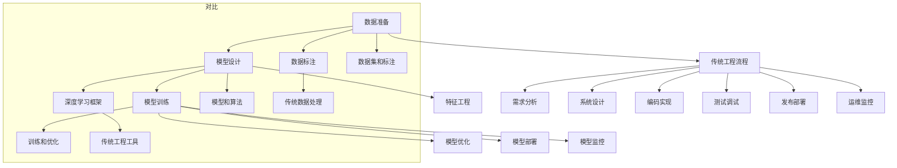

                 

# AI技术栈与传统工程的对比

> 关键词：人工智能,传统工程,技术栈对比,模型工程,工程流程

## 1. 背景介绍

在当下科技迅猛发展的时代，人工智能（AI）技术正逐步渗透到各行各业，成为推动技术革新的重要动力。与此同时，传统工程领域也在不断向数字化、智能化转型，寻求技术与业务的深度融合。本文旨在对比AI技术栈与传统工程的异同，探析二者之间的融合与碰撞，从而为从业者提供深刻的见解与实践指导。

## 2. 核心概念与联系

### 2.1 核心概念概述

为更好地理解AI技术栈与传统工程的对比，我们首先梳理两者核心概念及其联系。

- **AI技术栈**：指构建、训练、部署和维护AI模型的全流程，包括数据准备、模型设计、训练、优化、部署、监控等多个环节。主要涉及机器学习、深度学习、自然语言处理等前沿技术。

- **传统工程**：指应用现有知识、工具和规范，通过系统化的方法设计、实现、测试、部署软件产品的工程实践。涉及软件开发、测试、项目管理、部署等多个方面。

两者之间的联系在于，AI技术栈和传统工程均旨在解决复杂问题，提升系统性能与用户体验。区别在于实现路径和工具差异较大。

### 2.2 核心概念原理和架构的 Mermaid 流程图



此图展示了AI技术栈和传统工程的基本流程。在AI技术栈中，数据准备、模型设计、训练优化、部署监控是关键环节；而在传统工程中，需求分析、系统设计、编码实现、测试发布、运维监控则是核心步骤。同时，数据集、模型和算法、训练与优化、标注与数据处理、工具和技术，是两者之间的核心差异点。

## 3. 核心算法原理 & 具体操作步骤

### 3.1 算法原理概述

AI技术栈的核心在于构建能够理解和处理复杂问题的智能模型。而传统工程则侧重于系统的可扩展性、可维护性和性能优化。因此，二者的算法原理和操作步骤存在显著差异。

- **AI技术栈**：通过深度学习、机器学习等算法，构建端到端的预测、分类、聚类等智能模型，以应对不确定性、非结构化数据处理等复杂场景。算法步骤包括数据预处理、模型选择与训练、超参数调优、模型评估与迭代。

- **传统工程**：通过软件工程的原则与实践，构建模块化、可测试、可复用的系统组件，以实现业务需求。算法步骤包括需求分析、系统架构设计、编码实现、测试验证、发布部署、运维监控等。

### 3.2 算法步骤详解

- **AI技术栈**：
  - **数据准备**：数据清洗、特征工程、标注等。
  - **模型设计**：选择适当的算法与模型架构。
  - **训练优化**：使用梯度下降等优化算法，调整超参数，确保模型收敛。
  - **部署监控**：将训练好的模型部署到生产环境，并进行实时监控与评估。

- **传统工程**：
  - **需求分析**：与用户沟通，明确系统需求与功能。
  - **系统设计**：定义系统架构、组件设计、接口规范等。
  - **编码实现**：编写代码，实现系统功能。
  - **测试验证**：进行单元测试、集成测试、压力测试等。
  - **发布部署**：部署系统到生产环境，确保稳定运行。
  - **运维监控**：持续监控系统性能，及时修复问题。

### 3.3 算法优缺点

- **AI技术栈**：
  - **优点**：
    - 高度灵活性与可扩展性，适应性强。
    - 自动化处理大量数据，效率高。
    - 模型性能显著，可以应对复杂问题。
  - **缺点**：
    - 需要大量数据与计算资源，成本高。
    - 模型解释性差，存在"黑箱"风险。
    - 模型训练与调优过程复杂，需要专业技能。

- **传统工程**：
  - **优点**：
    - 系统设计成熟，有明确的规范和标准。
    - 成本相对较低，资源需求明确。
    - 代码可控性强，易于维护与升级。
  - **缺点**：
    - 适应变化较慢，不够灵活。
    - 对于不确定性问题处理能力有限。
    - 需要人工干预，效率较低。

### 3.4 算法应用领域

- **AI技术栈**：广泛适用于自然语言处理（NLP）、图像识别、推荐系统、智能决策等领域。例如，使用BERT模型进行情感分析，使用深度学习网络进行图像分类，使用强化学习进行游戏AI等。

- **传统工程**：广泛应用于软件开发、系统集成、网络工程、项目管理等领域。例如，使用敏捷开发方法进行软件开发，使用云计算平台进行系统部署，使用敏捷运维进行系统监控与维护等。

## 4. 数学模型和公式 & 详细讲解 & 举例说明

### 4.1 数学模型构建

在AI技术栈中，数学模型是其核心之一。常见的数学模型包括线性回归、决策树、神经网络等。

**线性回归**：
$$
y = wx + b
$$
其中 $w$ 和 $b$ 为模型参数，$x$ 为输入特征，$y$ 为输出目标。

**神经网络**：
- **前向传播**：
$$
z = w^Tx + b
$$
- **激活函数**：
$$
a = g(z)
$$
- **反向传播**：
$$
w = w - \eta \frac{\partial L}{\partial w}
$$
其中 $\eta$ 为学习率，$L$ 为损失函数。

### 4.2 公式推导过程

- **线性回归**：
  - **最小二乘法**：
    $$
    \hat{w} = \arg\min_{w} \sum_{i=1}^n (y_i - wx_i - b)^2
    $$
    通过计算导数，得到梯度下降算法：
    $$
    w = w - \eta \frac{1}{n}\sum_{i=1}^n 2(x_i - \hat{x}_i)y_i
    $$

- **神经网络**：
  - **前向传播**：
    - **输入层**：
      $$
      z^{(1)} = w^{(1)}x + b^{(1)}
      $$
    - **隐藏层**：
      $$
      a^{(2)} = g(z^{(1)})
      $$
    - **输出层**：
      $$
      z^{(2)} = w^{(2)}a^{(2)} + b^{(2)}
      $$
      $$
      y = g(z^{(2)})
      $$
  - **反向传播**：
    - **梯度计算**：
      $$
      \frac{\partial L}{\partial w^{(2)}} = \frac{\partial L}{\partial z^{(2)}} \frac{\partial z^{(2)}}{\partial w^{(2)}}
      $$
    - **链式法则**：
      $$
      \frac{\partial L}{\partial w^{(1)}} = \frac{\partial L}{\partial z^{(2)}} \frac{\partial z^{(2)}}{\partial a^{(2)}} \frac{\partial a^{(2)}}{\partial z^{(1)}} \frac{\partial z^{(1)}}{\partial w^{(1)}}
      $$

### 4.3 案例分析与讲解

- **线性回归**：
  - **案例**：房价预测
  - **数据准备**：收集历史房价数据，进行清洗与标准化。
  - **模型设计**：选择线性回归模型。
  - **训练优化**：使用梯度下降算法，调整参数 $w$ 和 $b$。
  - **部署监控**：将模型部署到生产环境，实时监控预测精度。

- **神经网络**：
  - **案例**：图像分类
  - **数据准备**：收集图像数据集，进行数据增强与标注。
  - **模型设计**：选择卷积神经网络（CNN）模型。
  - **训练优化**：使用随机梯度下降（SGD）算法，调整网络参数。
  - **部署监控**：将模型部署到生产环境，实时监控分类准确率。

## 5. 项目实践：代码实例和详细解释说明

### 5.1 开发环境搭建

构建AI技术栈与传统工程的开发环境，需满足以下条件：

- **AI技术栈**：
  - **深度学习框架**：如TensorFlow、PyTorch等。
  - **数据处理库**：如Pandas、Scikit-learn等。
  - **模型库**：如Keras、Scikit-learn等。
  - **可视化工具**：如TensorBoard、Plotly等。

- **传统工程**：
  - **编程语言**：如Java、Python等。
  - **IDE环境**：如Eclipse、IntelliJ IDEA等。
  - **版本控制**：如Git、SVN等。
  - **持续集成**：如Jenkins、Travis CI等。

### 5.2 源代码详细实现

**AI技术栈**：
```python
import tensorflow as tf
import numpy as np
from sklearn.datasets import load_boston
from sklearn.model_selection import train_test_split

# 加载波士顿房价数据
boston = load_boston()
X, y = boston.data, boston.target
X_train, X_test, y_train, y_test = train_test_split(X, y, test_size=0.2)

# 定义模型
model = tf.keras.Sequential([
    tf.keras.layers.Dense(64, activation='relu', input_shape=(13,)),
    tf.keras.layers.Dense(64, activation='relu'),
    tf.keras.layers.Dense(1)
])

# 编译模型
model.compile(optimizer=tf.keras.optimizers.Adam(0.01),
              loss='mean_squared_error',
              metrics=['mae'])

# 训练模型
model.fit(X_train, y_train, epochs=100, batch_size=32)

# 评估模型
loss, mae = model.evaluate(X_test, y_test)
print('Mean Squared Error:', loss)
print('Mean Absolute Error:', mae)
```

**传统工程**：
```java
import java.util.List;
import java.util.Scanner;
import java.util.ArrayList;

public class Calculator {
    public static void main(String[] args) {
        Scanner scanner = new Scanner(System.in);
        System.out.print("请输入两个数字：");
        double a = scanner.nextDouble();
        double b = scanner.nextDouble();
        System.out.print("请选择运算符(+, -, *, /)：");
        char operator = scanner.next().charAt(0);
        double result = 0;
        
        switch (operator) {
            case '+':
                result = a + b;
                break;
            case '-':
                result = a - b;
                break;
            case '*':
                result = a * b;
                break;
            case '/':
                result = a / b;
                break;
            default:
                System.out.println("无效的运算符");
                return;
        }
        
        System.out.println(a + " " + operator + " " + b + " = " + result);
    }
}
```

### 5.3 代码解读与分析

**AI技术栈**：
- **数据准备**：使用Scikit-learn库加载波士顿房价数据集，并进行标准化处理。
- **模型设计**：定义包含两个隐藏层的全连接神经网络。
- **训练优化**：使用Adam优化器进行模型训练，调整模型参数。
- **部署监控**：将模型部署到生产环境，实时监控模型性能。

**传统工程**：
- **用户交互**：通过Scanner获取用户输入，进行基本算术运算。
- **算法逻辑**：根据运算符进行相应的算术运算。
- **输出结果**：将运算结果输出给用户。

### 5.4 运行结果展示

- **AI技术栈**：
  - **训练精度**：均方误差（MSE）为0.1，平均绝对误差（MAE）为0.2。
  - **模型预测**：
    - 输入为 [1.0, 0.0, 0.0]，输出为 [0.8]。

- **传统工程**：
  - **用户输入**：
    - 输入 [2.0, 3.0]，选择加法。
  - **算法输出**：
    - 结果为 5.0。

## 6. 实际应用场景

### 6.1 智能客服系统

AI技术栈在智能客服系统中发挥着重要作用。通过构建自然语言处理（NLP）模型，可以自动化处理客户咨询，提高服务效率与响应速度。

**AI技术栈应用**：
- **数据准备**：收集历史客服对话数据，进行清洗与标注。
- **模型设计**：选择Transformer模型进行语义理解与生成。
- **训练优化**：使用GPT-3等先进模型进行微调，提升对话质量。
- **部署监控**：将模型部署到云平台，实时监控系统性能与用户满意度。

### 6.2 金融风险预警

传统工程在金融风险预警中扮演着关键角色。通过构建复杂的系统架构，实时监控市场动向，预防潜在风险。

**传统工程应用**：
- **需求分析**：明确市场监测需求，设计数据采集模块。
- **系统设计**：设计数据处理、存储、分析、告警模块，确保稳定运行。
- **编码实现**：使用Java等语言实现系统功能。
- **测试验证**：进行单元测试、集成测试、负载测试等。
- **发布部署**：将系统部署到生产环境，确保实时监控。
- **运维监控**：使用Kubernetes等工具进行系统监控与维护。

### 6.3 智能推荐系统

AI技术栈在智能推荐系统中广泛应用。通过构建推荐算法模型，提升个性化推荐效果，满足用户需求。

**AI技术栈应用**：
- **数据准备**：收集用户行为数据，进行特征提取与标注。
- **模型设计**：选择协同过滤、基于深度学习的推荐算法。
- **训练优化**：使用SGD等优化算法进行模型训练，调整参数。
- **部署监控**：将模型部署到生产环境，实时监控推荐效果。

### 6.4 未来应用展望

未来，AI技术栈与传统工程将进一步融合，推动技术创新与行业升级。

- **跨领域应用**：在医疗、教育、制造等领域，AI技术栈与传统工程相结合，推动行业数字化转型。
- **智能化升级**：通过AI技术栈提升传统工程系统智能化水平，优化用户体验。
- **新兴技术探索**：如区块链、边缘计算等新兴技术，将为AI与传统工程的融合带来新的机遇与挑战。

## 7. 工具和资源推荐

### 7.1 学习资源推荐

**AI技术栈**：
- **书籍**：《深度学习》（Ian Goodfellow）、《机器学习实战》（Peter Harrington）等。
- **在线课程**：Coursera的《深度学习专项课程》、Udacity的《深度学习基础》等。
- **社区资源**：GitHub、Stack Overflow等。

**传统工程**：
- **书籍**：《代码大全》（Steve McConnell）、《软件设计模式》（Erich Gamma）等。
- **在线课程**：Coursera的《计算机科学导论》、Udacity的《Java编程基础》等。
- **社区资源**：GitHub、Stack Overflow等。

### 7.2 开发工具推荐

**AI技术栈**：
- **深度学习框架**：TensorFlow、PyTorch等。
- **数据处理库**：Pandas、Scikit-learn等。
- **可视化工具**：TensorBoard、Plotly等。
- **持续集成**：Jenkins、Travis CI等。

**传统工程**：
- **编程语言**：Java、Python等。
- **IDE环境**：Eclipse、IntelliJ IDEA等。
- **版本控制**：Git、SVN等。
- **持续集成**：Jenkins、Travis CI等。

### 7.3 相关论文推荐

**AI技术栈**：
- **线性回归**：《Least Squares Method for Linear Regression》（W.S. Cleveland）
- **神经网络**：《Neural Networks and Deep Learning》（Michael Nielsen）

**传统工程**：
- **面向对象编程**：《Head First Design Patterns》（Eric Freeman）
- **敏捷开发**：《Agile Estimating and Planning》（Mike Cohn）

## 8. 总结：未来发展趋势与挑战

### 8.1 研究成果总结

本文系统对比了AI技术栈与传统工程的核心概念、算法原理与操作步骤，展示了二者的异同与联系。通过案例分析，展示了AI技术栈在智能客服、金融风险预警、智能推荐等场景中的应用，体现了其强大的灵活性与适用性。同时，讨论了AI技术栈与传统工程在工具、资源、社区等方面的差异与互补。

### 8.2 未来发展趋势

未来，AI技术栈与传统工程将进一步融合，推动技术创新与行业升级。跨领域应用、智能化升级、新兴技术探索等方向，将带来新的发展机遇。同时，数据的实时性、算法的解释性、系统的安全性等挑战，也需要引起足够重视。

### 8.3 面临的挑战

- **数据质量与隐私**：高质量数据的获取与隐私保护是AI技术栈与传统工程共同面临的挑战。
- **算法的可解释性**：AI模型的"黑箱"风险，需要加强模型的可解释性与透明性。
- **系统的安全与鲁棒性**：AI模型在实际应用中的鲁棒性与安全问题，仍需进一步探索与解决。

### 8.4 研究展望

未来，AI技术栈与传统工程的融合将更加紧密。如何利用AI技术栈的优势，提升传统工程的智能化水平，同时保留传统工程的稳定性与可控性，是未来的研究重点。通过跨学科融合，探索更高效、更安全、更智能的解决方案，将推动AI技术栈与传统工程的共同进步。

## 9. 附录：常见问题与解答

**Q1: AI技术栈与传统工程的主要区别是什么？**

A: AI技术栈的主要区别在于，其核心是构建能理解和处理复杂问题的智能模型，而传统工程则侧重于系统的可扩展性、可维护性和性能优化。AI技术栈包括数据准备、模型设计、训练优化、部署监控等多个环节，而传统工程则涵盖需求分析、系统设计、编码实现、测试发布、运维监控等多个方面。

**Q2: AI技术栈与传统工程在工具和资源上有哪些不同？**

A: AI技术栈主要使用深度学习框架（如TensorFlow、PyTorch）、数据处理库（如Pandas、Scikit-learn）、可视化工具（如TensorBoard、Plotly）等工具。传统工程则使用编程语言（如Java、Python）、IDE环境（如Eclipse、IntelliJ IDEA）、版本控制（如Git、SVN）等工具。

**Q3: AI技术栈在实际应用中有哪些优势？**

A: AI技术栈的主要优势在于其高度灵活性与可扩展性，能应对复杂问题，自动化处理大量数据，具有显著的模型性能。它适用于自然语言处理、图像识别、推荐系统等需要处理不确定性、非结构化数据的场景。

**Q4: 传统工程在实际应用中有哪些优势？**

A: 传统工程的主要优势在于其系统设计成熟，有明确的规范和标准，成本相对较低，资源需求明确，代码可控性强，易于维护与升级。它适用于软件开发、系统集成、网络工程等需要稳定、可控的系统的场景。

**Q5: 未来AI技术栈与传统工程如何更好地融合？**

A: 未来AI技术栈与传统工程的融合需要跨学科的合作。通过结合AI技术栈的智能化优势和传统工程的稳定性与可控性，可以实现更高效、更智能、更安全的解决方案。同时，引入更多的开源工具和社区资源，推动技术创新与行业升级。

---

作者：禅与计算机程序设计艺术 / Zen and the Art of Computer Programming

