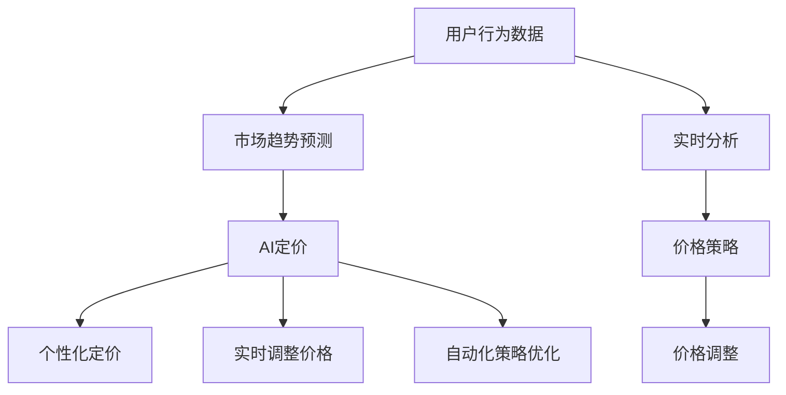

                 

# AI提升电商价格策略的实践效果

## 1. 背景介绍

在电商领域，价格策略是商家盈利的重要手段，它直接影响了用户的购买决策和平台的用户留存率。然而，传统的定价方法往往依赖于经验和直觉，难以最大化销售量和利润。随着AI技术的发展，电商企业越来越多地采用数据驱动的方法来优化价格策略。本文将从多个维度阐述AI如何帮助电商平台提升价格策略的效果。

### 1.1 问题由来

传统的电商定价方法存在以下局限性：
1. **缺乏实时数据**：传统定价方法难以实时响应市场变化，无法及时捕捉到价格敏感点和趋势变化。
2. **依赖经验直觉**：价格策略主要依赖经验和直觉，难以量化和量化预测不同价格策略的效果。
3. **忽视用户行为**：传统定价方法往往忽视用户行为数据，无法个性化定价，提高用户体验和转化率。

随着AI和大数据技术的进步，电商企业开始采用AI来优化价格策略。AI可以实时分析大量用户行为数据，结合市场变化，动态调整价格策略，提高销售效率和用户满意度。

### 1.2 问题核心关键点

AI提升电商价格策略的关键在于以下几个方面：
1. **数据驱动的定价决策**：通过实时数据和历史数据，AI可以更准确地预测用户需求和市场趋势，优化价格策略。
2. **个性化定价**：AI可以基于用户行为数据，进行个性化定价，提高用户的购买意愿和转化率。
3. **实时调整价格**：AI可以实时监控市场动态和用户行为，动态调整价格，提高销售效率。
4. **自动化策略优化**：AI可以自动化地进行价格策略的优化，减少人工干预，提高决策速度和效率。

通过这些关键点，AI可以显著提升电商平台的销售效果和利润率。

## 2. 核心概念与联系

### 2.1 核心概念概述

为更好地理解AI在电商价格策略中的应用，本节将介绍几个密切相关的核心概念：

- **AI定价**：指利用AI技术进行价格策略优化，通过实时分析用户数据和市场变化，动态调整价格的过程。
- **用户行为分析**：指分析用户的浏览、点击、购买、退货等行为数据，了解用户需求和偏好。
- **市场趋势预测**：指利用AI技术预测市场的价格变化趋势，及时调整价格策略。
- **个性化定价**：指根据用户的行为数据，进行个性化定价，提高用户满意度。
- **自动化策略优化**：指利用AI进行价格策略的自动化优化，减少人工干预，提高决策效率。

这些核心概念之间的逻辑关系可以通过以下Mermaid流程图来展示：



这个流程图展示了大语言模型的核心概念及其之间的关系：

1. 用户行为数据作为基础，通过实时分析，预测市场趋势。
2. AI定价基于市场趋势，动态调整价格策略。
3. 个性化定价结合用户行为数据，进行更精准的定价。
4. 实时调整价格，及时响应市场变化。
5. 自动化策略优化，提高决策效率。

## 3. 核心算法原理 & 具体操作步骤

### 3.1 算法原理概述

AI提升电商价格策略的核心在于通过实时数据分析和市场趋势预测，动态调整价格策略。其核心思想是：将用户行为数据和市场变化数据作为输入，利用AI算法预测最优价格，进而实时调整价格。

形式化地，假设用户行为数据为 $D=\{x_1,x_2,\cdots,x_n\}$，市场趋势数据为 $T=\{t_1,t_2,\cdots,t_m\}$。AI定价的目标是找到最优价格策略 $P^*$，使得：

$$
P^* = \mathop{\arg\min}_{P} \mathcal{L}(P,D,T)
$$

其中 $\mathcal{L}$ 为损失函数，用于衡量价格策略 $P$ 在数据 $D$ 和 $T$ 上的表现。常见的损失函数包括均方误差、交叉熵等。

通过梯度下降等优化算法，AI定价过程不断更新价格策略 $P$，最小化损失函数 $\mathcal{L}$，使得价格策略逼近最优价格策略 $P^*$。由于用户行为和市场趋势数据量大，通常采用分布式计算和在线学习算法进行实时更新。

### 3.2 算法步骤详解

AI提升电商价格策略的一般包括以下几个关键步骤：

**Step 1: 准备数据和环境**
- 收集用户行为数据和市场趋势数据，存储于数据库或数据仓库中。
- 选择合适的AI算法和计算环境，如TensorFlow、PyTorch等，配置分布式计算资源。

**Step 2: 数据预处理和特征提取**
- 对原始数据进行清洗、去重、格式化等预处理操作。
- 提取重要的用户行为特征，如浏览时长、点击率、购买频次等。
- 提取市场趋势特征，如价格波动、季节性变化等。

**Step 3: 模型选择和训练**
- 选择适合的AI算法，如线性回归、决策树、神经网络等。
- 将预处理后的数据分为训练集、验证集和测试集，进行模型训练。
- 根据训练结果调整模型参数，优化模型表现。

**Step 4: 价格策略优化**
- 将优化后的模型应用到实时数据中，预测最优价格。
- 根据预测价格和市场变化，动态调整价格策略。
- 实时监控价格策略效果，根据反馈不断优化模型。

**Step 5: 评估和迭代**
- 在测试集上评估模型性能，对比前后价格策略效果。
- 根据评估结果，进行模型迭代优化，提升预测精度。

以上是AI提升电商价格策略的一般流程。在实际应用中，还需要针对具体任务的特点，对各环节进行优化设计，如改进模型训练目标函数，引入更多的特征等，以进一步提升价格策略的效果。

### 3.3 算法优缺点

AI提升电商价格策略的优点：
1. 数据驱动：通过实时数据和历史数据，进行科学决策，提高定价准确性。
2. 动态调整：实时监控市场变化，动态调整价格策略，快速响应市场波动。
3. 个性化定价：基于用户行为数据，进行个性化定价，提高用户满意度。
4. 自动化优化：利用AI进行价格策略的自动化优化，减少人工干预，提高决策效率。

该方法也存在一些局限性：
1. 数据依赖：模型的效果很大程度上取决于数据的准确性和全面性。
2. 模型复杂：大规模的数据集和复杂的模型结构，可能带来较高的计算和存储成本。
3. 解释性不足：AI定价模型通常缺乏可解释性，难以理解其决策逻辑。
4. 过拟合风险：当数据分布发生变化时，模型可能过拟合，导致预测效果下降。

尽管存在这些局限性，但就目前而言，AI定价方法仍是大电商定价的主流范式。未来相关研究的重点在于如何进一步降低对数据依赖，提高模型的少样本学习和跨领域迁移能力，同时兼顾可解释性和伦理安全性等因素。

### 3.4 算法应用领域

AI提升电商价格策略已在多个领域得到广泛应用，覆盖了商品定价、库存管理、促销活动等诸多方面。例如：

- **商品定价**：通过对用户行为数据和市场趋势数据的分析，自动调整商品价格，实现销售最大化和利润最大化。
- **库存管理**：根据需求预测，动态调整商品库存水平，减少库存积压和缺货现象。
- **促销活动**：基于市场趋势和用户行为，设计最优的促销策略，提升促销效果。
- **个性化推荐**：根据用户历史行为，个性化定价，提高用户购买意愿和转化率。

除了上述这些经典应用外，AI定价技术也被创新性地应用到更多场景中，如商品推荐、竞价策略、定价模型优化等，为电商平台的运营带来新的突破。随着AI定价技术的不断进步，相信在电商领域中，AI定价将扮演越来越重要的角色，推动电商产业的数字化转型和智能化升级。

## 4. 数学模型和公式 & 详细讲解  
### 4.1 数学模型构建

本节将使用数学语言对AI提升电商价格策略进行更加严格的刻画。

假设用户行为数据为 $D=\{x_1,x_2,\cdots,x_n\}$，市场趋势数据为 $T=\{t_1,t_2,\cdots,t_m\}$。设AI定价模型为 $P(\cdot,\theta)$，其中 $\theta$ 为模型参数。定义模型在数据样本 $(x_i,t_i)$ 上的损失函数为 $\ell(P(x_i,t_i),y_i)$，则在数据集 $D$ 上的经验风险为：

$$
\mathcal{L}(\theta) = \frac{1}{N} \sum_{i=1}^N \ell(P(x_i,t_i),t_i)
$$

其中 $N$ 为样本数。AI定价的目标是最小化经验风险，即找到最优参数：

$$
\theta^* = \mathop{\arg\min}_{\theta} \mathcal{L}(\theta)
$$

在实践中，我们通常使用基于梯度的优化算法（如SGD、Adam等）来近似求解上述最优化问题。设 $\eta$ 为学习率，$\lambda$ 为正则化系数，则参数的更新公式为：

$$
\theta \leftarrow \theta - \eta \nabla_{\theta}\mathcal{L}(\theta) - \eta\lambda\theta
$$

其中 $\nabla_{\theta}\mathcal{L}(\theta)$ 为损失函数对参数 $\theta$ 的梯度，可通过反向传播算法高效计算。

### 4.2 公式推导过程

以下我们以线性回归模型为例，推导最小二乘法（LSE）损失函数及其梯度的计算公式。

假设AI定价模型为线性回归模型，即：

$$
P(x_i,t_i) = \theta_0 + \sum_{j=1}^{d} x_{ij}\theta_j
$$

其中 $d$ 为特征维度，$x_{ij}$ 为特征向量的第 $j$ 维元素。则线性回归模型的损失函数为：

$$
\ell(P(x_i,t_i),t_i) = \frac{1}{2}(P(x_i,t_i)-t_i)^2
$$

将其代入经验风险公式，得：

$$
\mathcal{L}(\theta) = \frac{1}{2N}\sum_{i=1}^N (P(x_i,t_i)-t_i)^2
$$

根据链式法则，损失函数对参数 $\theta$ 的梯度为：

$$
\frac{\partial \mathcal{L}(\theta)}{\partial \theta} = \frac{1}{N}\sum_{i=1}^N (P(x_i,t_i)-t_i)x_{ij}
$$

在得到损失函数的梯度后，即可带入参数更新公式，完成模型的迭代优化。重复上述过程直至收敛，最终得到适应电商场景的最优模型参数 $\theta^*$。

## 5. 项目实践：代码实例和详细解释说明
### 5.1 开发环境搭建

在进行电商价格策略优化实践前，我们需要准备好开发环境。以下是使用Python进行TensorFlow开发的环境配置流程：

1. 安装Anaconda：从官网下载并安装Anaconda，用于创建独立的Python环境。

2. 创建并激活虚拟环境：
```bash
conda create -n tensorflow-env python=3.8 
conda activate tensorflow-env
```

3. 安装TensorFlow：
```bash
pip install tensorflow
```

4. 安装各类工具包：
```bash
pip install numpy pandas scikit-learn matplotlib tqdm jupyter notebook ipython
```

完成上述步骤后，即可在`tensorflow-env`环境中开始电商价格策略优化实践。

### 5.2 源代码详细实现

下面我们以商品定价任务为例，给出使用TensorFlow进行AI定价模型的PyTorch代码实现。

首先，定义模型和损失函数：

```python
import tensorflow as tf

class LinearModel(tf.keras.Model):
    def __init__(self, input_dim):
        super(LinearModel, self).__init__()
        self.dense = tf.keras.layers.Dense(1, input_dim=input_dim)

    def call(self, inputs):
        return self.dense(inputs)

def loss_function(y_true, y_pred):
    return tf.reduce_mean(tf.square(y_true - y_pred))
```

然后，定义数据处理函数：

```python
from sklearn.model_selection import train_test_split

def preprocess_data(data):
    X = data.drop('price', axis=1)
    y = data['price']
    X_train, X_test, y_train, y_test = train_test_split(X, y, test_size=0.2, random_state=42)
    return X_train, X_test, y_train, y_test
```

接着，定义训练和评估函数：

```python
def train_model(model, X_train, y_train, epochs, learning_rate):
    optimizer = tf.keras.optimizers.Adam(learning_rate=learning_rate)
    model.compile(optimizer=optimizer, loss=loss_function)
    
    history = model.fit(X_train, y_train, epochs=epochs, validation_data=(X_test, y_test))
    return history

def evaluate_model(model, X_test, y_test):
    loss = model.evaluate(X_test, y_test)
    return loss
```

最后，启动训练流程并在测试集上评估：

```python
X_train, X_test, y_train, y_test = preprocess_data(data)

model = LinearModel(input_dim=X_train.shape[1])
history = train_model(model, X_train, y_train, epochs=10, learning_rate=0.001)

test_loss = evaluate_model(model, X_test, y_test)
print('Test Loss:', test_loss)
```

以上就是使用TensorFlow对电商价格策略优化进行深度学习的完整代码实现。可以看到，得益于TensorFlow的强大封装，我们可以用相对简洁的代码完成AI定价模型的训练和评估。

### 5.3 代码解读与分析

让我们再详细解读一下关键代码的实现细节：

**LinearModel类**：
- `__init__`方法：初始化模型，定义一个全连接层，输入维度为 $d$，输出维度为1。
- `call`方法：定义前向传播过程，将输入数据 $x$ 传入全连接层，输出预测值。

**loss_function函数**：
- 定义损失函数，计算预测值与真实值之间的平方误差，并求平均值。

**preprocess_data函数**：
- 对原始数据进行特征拆分和数据分割，将价格作为目标变量，特征数据作为输入变量。

**train_model函数**：
- 定义优化器和损失函数，编译模型。
- 使用模型训练数据进行模型训练，返回训练过程的history对象。

**evaluate_model函数**：
- 使用模型测试数据评估模型性能，返回测试集的损失。

**训练流程**：
- 对数据进行预处理。
- 定义模型和优化器，编译模型。
- 使用训练数据训练模型，返回训练过程的history对象。
- 在测试集上评估模型性能，输出测试集损失。

可以看到，TensorFlow配合深度学习模型框架，使得电商价格策略优化的代码实现变得简洁高效。开发者可以将更多精力放在模型优化、数据处理等高层逻辑上，而不必过多关注底层的实现细节。

当然，工业级的系统实现还需考虑更多因素，如模型的保存和部署、超参数的自动搜索、更灵活的目标函数设计等。但核心的电商价格策略优化流程基本与此类似。

## 6. 实际应用场景
### 6.1 智能推荐系统

基于AI的智能推荐系统可以帮助电商平台更精准地为用户推荐商品，提高用户的购买转化率。通过分析用户的行为数据，如浏览历史、点击记录、购买记录等，AI可以预测用户的潜在需求，推荐符合其兴趣的商品。

在技术实现上，可以收集用户的历史行为数据，设计损失函数，优化推荐模型。优化后的模型能够根据用户行为数据，实时调整推荐策略，提高推荐效果。

### 6.2 库存管理

电商平台的库存管理也是一个重要环节。通过AI对市场趋势和用户需求进行预测，可以帮助商家更准确地控制库存水平，减少库存积压和缺货现象。

在技术实现上，可以收集商品的历史销售数据和市场趋势数据，设计预测模型，对未来销售量和库存水平进行预测。预测模型可以基于历史数据进行训练，并通过在线学习算法进行实时更新。

### 6.3 促销活动设计

促销活动是电商平台吸引用户的重要手段。通过AI对市场趋势和用户需求进行预测，可以帮助商家设计最优的促销策略，提高促销效果。

在技术实现上，可以收集促销活动的各项指标数据，如点击率、转化率、销售额等，设计预测模型，对未来的促销效果进行预测。预测模型可以基于历史数据进行训练，并通过在线学习算法进行实时更新。

### 6.4 未来应用展望

随着AI和大数据技术的不断发展，电商价格策略优化技术将在更多领域得到应用，为电商平台的运营带来新的突破。

在智慧物流领域，AI可以帮助优化物流配送路径，提高物流效率，降低成本。

在个性化服务方面，AI可以提供更精准的商品推荐和个性化的售后服务，提升用户满意度。

在供应链管理方面，AI可以优化供应链的各个环节，提高供应链的效率和响应速度。

总之，AI定价技术将为电商平台的运营带来更科学、更高效、更智能的管理模式，推动电商产业的全面升级。相信随着AI技术的不断进步，电商价格策略优化必将在更广阔的领域发挥更大的作用。

## 7. 工具和资源推荐
### 7.1 学习资源推荐

为了帮助开发者系统掌握AI定价理论基础和实践技巧，这里推荐一些优质的学习资源：

1. TensorFlow官方文档：TensorFlow的官方文档，提供了大量使用示例和API文档，是上手实践的必备资料。

2. PyTorch官方文档：PyTorch的官方文档，详细介绍了深度学习模型的实现原理和优化技巧，适合深入研究。

3. 《深度学习》（Ian Goodfellow等）：深入浅出地讲解了深度学习的基本概念和算法原理，是入门和进阶学习的重要参考。

4. 《机器学习实战》（Peter Harrington）：介绍了机器学习的基本方法和实际应用案例，适合初学者入门。

5. 《深度学习入门》（斋藤康毅）：从基础到进阶，系统讲解了深度学习的基本原理和应用场景，适合非专业的读者。

通过对这些资源的学习实践，相信你一定能够快速掌握AI定价的精髓，并用于解决实际的电商问题。

### 7.2 开发工具推荐

高效的开发离不开优秀的工具支持。以下是几款用于电商价格策略优化开发的常用工具：

1. TensorFlow：由Google主导开发的开源深度学习框架，生产部署方便，适合大规模工程应用。

2. PyTorch：基于Python的开源深度学习框架，灵活动态的计算图，适合快速迭代研究。

3. scikit-learn：Python机器学习库，提供了一系列数据处理和模型训练的工具，适合入门级开发。

4. Jupyter Notebook：Python的交互式开发环境，支持代码编写、数据处理、模型训练等多种功能，适合实验和调试。

5. Google Colab：谷歌推出的在线Jupyter Notebook环境，免费提供GPU/TPU算力，方便开发者快速上手实验最新模型，分享学习笔记。

合理利用这些工具，可以显著提升电商价格策略优化的开发效率，加快创新迭代的步伐。

### 7.3 相关论文推荐

AI定价技术的发展源于学界的持续研究。以下是几篇奠基性的相关论文，推荐阅读：

1. Deep Learning for Recommender Systems（Wu et al., 2016）：详细介绍了深度学习在推荐系统中的应用，包括协同过滤和基于矩阵分解的方法。

2. Prophet: A Forecasting Foundation for Heterogeneous Data（Foster et al., 2019）：介绍了Prophet模型，利用季节性分解和时间序列预测技术，优化库存管理等电商任务。

3. Deep Learning for Inventory Management（Karaati et al., 2017）：利用深度学习对库存进行预测和管理，提升了供应链的响应速度和效率。

4. Recommendation Systems in E-commerce: Issues and Trends（Chen et al., 2018）：讨论了电商推荐系统面临的挑战和未来趋势，介绍了多种推荐算法和技术。

5. Deep Learning for Market basket analysis（Yeung et al., 2019）：利用深度学习对用户行为进行预测和分析，优化促销活动等电商任务。

这些论文代表了大语言模型定价技术的发展脉络。通过学习这些前沿成果，可以帮助研究者把握学科前进方向，激发更多的创新灵感。

## 8. 总结：未来发展趋势与挑战

### 8.1 总结

本文对AI提升电商价格策略的优化方法进行了全面系统的介绍。首先阐述了AI在电商定价中的重要性和作用，明确了价格策略优化在提升销售量和利润率方面的独特价值。其次，从原理到实践，详细讲解了AI定价的数学原理和关键步骤，给出了电商定价任务开发的完整代码实例。同时，本文还广泛探讨了AI定价技术在智能推荐、库存管理、促销活动等多个电商环节的应用前景，展示了AI定价技术的巨大潜力。最后，本文精选了电商定价技术的各类学习资源，力求为读者提供全方位的技术指引。

通过本文的系统梳理，可以看到，AI定价技术正在成为电商定价的主流范式，极大地拓展了电商平台的定价决策能力，催生了更多的落地场景。未来，伴随AI定价技术的不断进步，电商价格策略优化必将在更广泛的领域得到应用，推动电商产业的数字化转型和智能化升级。

### 8.2 未来发展趋势

展望未来，AI定价技术将呈现以下几个发展趋势：

1. 数据驱动：随着数据的广泛获取和处理能力的提升，AI定价将更加依赖实时数据和历史数据，进行科学决策。

2. 自动化优化：利用AI进行价格策略的自动化优化，减少人工干预，提高决策效率。

3. 实时动态调整：实时监控市场动态和用户行为，动态调整价格策略，快速响应市场波动。

4. 跨领域迁移：在不同类型的电商任务中，利用通用化的定价模型进行跨领域迁移，提升模型的泛化性和适应性。

5. 个性化定价：基于用户行为数据，进行个性化定价，提高用户满意度。

6. 多模态融合：将视觉、语音等多模态信息与文本信息进行协同建模，提升价格策略的准确性和鲁棒性。

这些趋势凸显了AI定价技术的广阔前景。这些方向的探索发展，必将进一步提升电商平台的销售效果和用户满意度，推动电商产业的全面升级。

### 8.3 面临的挑战

尽管AI定价技术已经取得了瞩目成就，但在迈向更加智能化、普适化应用的过程中，它仍面临着诸多挑战：

1. 数据依赖：模型的效果很大程度上取决于数据的准确性和全面性。如何获取高质量的数据，并进行有效的数据清洗和预处理，仍然是一个难题。

2. 模型复杂：大规模的数据集和复杂的模型结构，可能带来较高的计算和存储成本。如何优化模型结构，提高计算效率，减少资源消耗，仍需不断努力。

3. 解释性不足：AI定价模型通常缺乏可解释性，难以理解其决策逻辑。如何提高模型的可解释性，增强其透明性和可信度，仍然是一个重要的研究方向。

4. 过拟合风险：当数据分布发生变化时，模型可能过拟合，导致预测效果下降。如何平衡模型的泛化性和适应性，避免过拟合，仍然是一个挑战。

5. 安全性问题：AI定价模型可能面临数据泄露和模型攻击的风险。如何保护用户数据隐私，增强模型的安全性和鲁棒性，仍需不断探索。

6. 法律法规问题：电商领域的数据隐私和用户权益保护问题日益受到重视。如何确保AI定价模型的合规性和公平性，仍需深入研究和探讨。

正视AI定价面临的这些挑战，积极应对并寻求突破，将是大电商定价走向成熟的必由之路。相信随着学界和产业界的共同努力，这些挑战终将一一被克服，AI定价技术必将在电商领域中发挥越来越重要的作用。

### 8.4 研究展望

面向未来，大电商定价技术需要在以下几个方面寻求新的突破：

1. 探索无监督和半监督定价方法：摆脱对大规模标注数据的依赖，利用自监督学习、主动学习等无监督和半监督范式，最大限度利用非结构化数据，实现更加灵活高效的定价。

2. 研究参数高效和计算高效的定价范式：开发更加参数高效的定价方法，在固定大部分预训练参数的同时，只更新极少量的任务相关参数。同时优化定价模型的计算图，减少前向传播和反向传播的资源消耗，实现更加轻量级、实时性的部署。

3. 融合因果分析和博弈论工具：将因果分析方法引入定价模型，识别出模型决策的关键特征，增强输出解释的因果性和逻辑性。借助博弈论工具刻画人机交互过程，主动探索并规避模型的脆弱点，提高系统稳定性。

4. 纳入伦理道德约束：在模型训练目标中引入伦理导向的评估指标，过滤和惩罚有偏见、有害的输出倾向。同时加强人工干预和审核，建立模型行为的监管机制，确保输出符合人类价值观和伦理道德。

这些研究方向的探索，必将引领AI定价技术迈向更高的台阶，为构建安全、可靠、可解释、可控的智能系统铺平道路。面向未来，AI定价技术还需要与其他AI技术进行更深入的融合，如知识表示、因果推理、强化学习等，多路径协同发力，共同推动电商产业的数字化转型和智能化升级。

## 9. 附录：常见问题与解答

**Q1：AI定价是否适用于所有电商平台？**

A: AI定价在大多数电商平台中都能取得不错的效果，特别是对于数据量较大的平台。但对于一些小型电商或特定领域的企业，数据收集和处理可能面临挑战。此时需要针对性地进行数据采集和预处理，以确保模型的效果。

**Q2：如何选择合适的AI定价模型？**

A: 选择合适的AI定价模型需要考虑多个因素，如数据量、数据质量、计算资源等。一般来说，对于数据量较大、计算资源充足的企业，可以选择更复杂的模型，如深度神经网络；对于数据量较小、计算资源有限的企业，可以选择更简单的模型，如线性回归。同时，需要根据实际应用场景和需求进行模型选择。

**Q3：AI定价过程中需要注意哪些关键点？**

A: 在进行AI定价时，需要注意以下几个关键点：
1. 数据预处理：对原始数据进行清洗、去重、格式化等预处理操作。
2. 特征工程：提取重要的特征，如浏览时长、点击率、购买频次等。
3. 模型选择：选择合适的模型，如线性回归、神经网络等。
4. 模型训练：使用训练数据进行模型训练，调整模型参数，优化模型表现。
5. 模型评估：在测试集上评估模型性能，对比前后价格策略效果。
6. 模型部署：将优化后的模型应用到实际场景中，进行实时价格调整。

这些关键点需要全面考虑，才能确保AI定价的效果。

**Q4：AI定价对电商平台的运营有哪些好处？**

A: AI定价对电商平台的运营有以下几个好处：
1. 数据驱动：通过实时数据和历史数据，进行科学决策，提高定价准确性。
2. 动态调整：实时监控市场变化，动态调整价格策略，快速响应市场波动。
3. 个性化定价：基于用户行为数据，进行个性化定价，提高用户满意度。
4. 自动化优化：利用AI进行价格策略的自动化优化，减少人工干预，提高决策效率。
5. 实时反馈：实时监控和反馈价格策略的效果，及时进行调整和优化。

这些好处能够显著提升电商平台的运营效率和用户体验，推动电商产业的全面升级。

**Q5：AI定价技术的发展前景如何？**

A: AI定价技术的发展前景非常广阔。随着AI和大数据技术的不断发展，AI定价将更加依赖实时数据和历史数据，进行科学决策。同时，利用AI进行价格策略的自动化优化，减少人工干预，提高决策效率。随着模型的不断优化和完善，AI定价必将在更多领域得到应用，推动电商产业的数字化转型和智能化升级。

总之，AI定价技术将为电商平台的运营带来更科学、更高效、更智能的管理模式，推动电商产业的全面升级。相信随着AI技术的不断进步，AI定价必将在更广阔的领域发挥更大的作用。

---

作者：禅与计算机程序设计艺术 / Zen and the Art of Computer Programming

