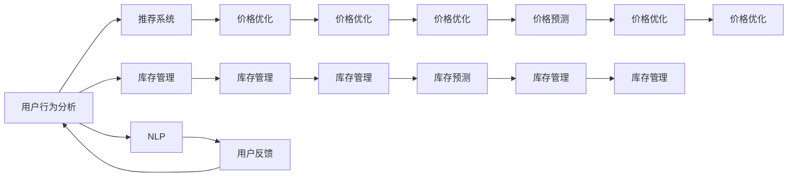

                 

## 1. 背景介绍

### 1.1 问题由来

在当前互联网高速发展的时代，电商平台已成为人们购物的重要渠道。然而，尽管电商平台在交易规模和用户数方面取得了巨大成就，但其运营效率的提升仍然是其面临的重要挑战。电商平台的运营效率不仅关系到用户体验和满意度，还直接影响其盈利能力和市场竞争力。AI技术的应用为电商平台的运营效率提升提供了新的可能。

### 1.2 问题核心关键点

电商平台的运营涉及多方面因素，包括用户行为分析、库存管理、价格优化、推荐系统等。AI技术在电商平台的运营中主要应用于以下几方面：

- **用户行为分析**：通过分析用户浏览、购买、评价等行为，构建用户画像，提供个性化推荐和精准营销。
- **库存管理**：实时监控库存状态，预测需求变化，避免缺货或积压。
- **价格优化**：根据市场需求、竞争对手定价和用户支付意愿，动态调整商品价格，提升销售额。
- **推荐系统**：基于用户历史行为和商品特征，生成个性化的商品推荐，提升转化率和客单价。

AI技术在电商平台中的应用，不仅能够提升运营效率，还能优化用户体验，增强市场竞争力。然而，如何在电商平台的复杂场景中高效地应用AI技术，仍是当前研究的重要课题。

## 2. 核心概念与联系

### 2.1 核心概念概述

在电商平台的AI应用中，涉及的核心概念包括：

- **用户行为分析**：通过分析用户行为数据，识别用户的兴趣偏好和购买意图，提供个性化推荐和精准营销。
- **库存管理**：实时监控库存状态，预测需求变化，优化库存水平和结构，避免缺货或积压。
- **价格优化**：根据市场需求、竞争对手定价和用户支付意愿，动态调整商品价格，提升销售额和市场份额。
- **推荐系统**：基于用户历史行为和商品特征，生成个性化的商品推荐，提升转化率和客单价。
- **自然语言处理(NLP)**：用于处理和理解用户评价、客服对话等文本数据，提升用户体验。
- **机器学习(ML)**：通过构建模型，预测用户行为、优化库存和定价、提高推荐系统的效果。

这些核心概念相互联系，共同构成了电商平台的AI应用框架，使其能够在复杂场景下实现高效、精准的运营。

### 2.2 核心概念原理和架构的 Mermaid 流程图



## 3. 核心算法原理 & 具体操作步骤
### 3.1 算法原理概述

在电商平台中，AI的应用主要基于以下算法原理：

- **用户行为分析**：使用协同过滤、内容推荐、基于深度学习的推荐算法等技术，分析用户历史行为数据，生成个性化推荐。
- **库存管理**：利用时间序列预测、深度学习模型等技术，实时监控库存状态，预测需求变化，优化库存水平和结构。
- **价格优化**：通过回归分析、优化算法等技术，预测市场需求、竞争对手定价和用户支付意愿，动态调整商品价格。
- **推荐系统**：使用矩阵分解、深度神经网络等技术，生成个性化的商品推荐，提升转化率和客单价。

### 3.2 算法步骤详解

**用户行为分析**

1. **数据收集**：收集用户的行为数据，包括浏览记录、购买记录、评价记录等。
2. **数据预处理**：对数据进行清洗、归一化、特征提取等预处理，减少噪声和缺失值。
3. **用户画像构建**：使用协同过滤、K-means聚类等方法，分析用户行为，构建用户画像。
4. **推荐生成**：根据用户画像和商品特征，使用协同过滤、深度学习等技术，生成个性化推荐。

**库存管理**

1. **数据收集**：收集库存数据，包括库存量、销售量、补货时间等。
2. **时间序列预测**：使用ARIMA、LSTM等模型，对库存数据进行时间序列预测。
3. **需求分析**：根据预测结果，分析市场需求和变化趋势。
4. **库存优化**：根据预测结果和需求分析，优化库存水平和结构。

**价格优化**

1. **数据收集**：收集商品定价数据，包括历史销售价格、市场价格等。
2. **需求分析**：使用回归分析、分类算法等技术，预测市场需求和用户支付意愿。
3. **竞争分析**：分析竞争对手的定价策略，制定合理的价格策略。
4. **价格调整**：根据预测结果和竞争分析，动态调整商品价格。

**推荐系统**

1. **数据收集**：收集用户行为数据和商品特征数据。
2. **模型训练**：使用深度神经网络、矩阵分解等技术，训练推荐模型。
3. **推荐生成**：根据用户画像和商品特征，生成个性化推荐。
4. **效果评估**：使用指标如点击率、转化率、客单价等，评估推荐效果。

### 3.3 算法优缺点

**用户行为分析**

- **优点**：能够提供个性化的推荐，提升用户体验和满意度。
- **缺点**：需要大量的用户行为数据，隐私保护问题较为突出。

**库存管理**

- **优点**：能够实时监控库存状态，避免缺货或积压。
- **缺点**：需要处理时间序列数据，模型复杂度较高。

**价格优化**

- **优点**：能够动态调整商品价格，提升销售额和市场份额。
- **缺点**：价格调整需要考虑市场需求和竞争对手定价，复杂度较高。

**推荐系统**

- **优点**：能够提供个性化的商品推荐，提升转化率和客单价。
- **缺点**：模型复杂度较高，需要大量数据训练。

### 3.4 算法应用领域

AI技术在电商平台的各个方面都有广泛的应用：

- **用户行为分析**：适用于个性化推荐、精准营销、用户画像构建等场景。
- **库存管理**：适用于库存优化、需求预测、库存补货计划制定等场景。
- **价格优化**：适用于价格调整、定价策略制定、竞争对手分析等场景。
- **推荐系统**：适用于商品推荐、内容推荐、个性化营销等场景。

## 4. 数学模型和公式 & 详细讲解 & 举例说明
### 4.1 数学模型构建

在电商平台的AI应用中，涉及的数学模型主要包括：

- **协同过滤**：使用用户-商品评分矩阵，预测用户对商品的评分。
- **深度神经网络**：用于生成个性化的推荐。
- **时间序列预测**：用于预测库存需求和价格变化。
- **回归分析**：用于预测市场需求和用户支付意愿。

### 4.2 公式推导过程

**协同过滤**

协同过滤基于用户-商品评分矩阵，预测用户对商品的评分。设用户-商品评分矩阵为 $R_{u,i}$，其中 $u$ 为用户，$i$ 为商品，$R_{u,i}$ 为用户的评分。协同过滤模型的公式如下：

$$
\hat{R}_{u,i} = \frac{\sum_{j}r_{u,j}r_{j,i}}{\sqrt{\sum_{j}r_{u,j}^2}\sqrt{\sum_{j}r_{j,i}^2}}
$$

其中 $r_{u,j}$ 为用户 $u$ 对商品 $j$ 的评分，$\hat{R}_{u,i}$ 为预测用户 $u$ 对商品 $i$ 的评分。

**深度神经网络**

深度神经网络用于生成个性化的推荐。设推荐模型为 $f(x)$，其中 $x$ 为用户的特征向量。推荐模型的公式如下：

$$
f(x) = \sigma(Wx+b)
$$

其中 $W$ 为权重矩阵，$b$ 为偏置项，$\sigma$ 为激活函数，$f(x)$ 为推荐结果。

**时间序列预测**

时间序列预测使用ARIMA模型，设库存需求序列为 $Y_t$，预测模型为 $\hat{Y}_t$。ARIMA模型的公式如下：

$$
\hat{Y}_t = ARIMA(Y_t, p, d, q)
$$

其中 $p$ 为自回归阶数，$d$ 为差分阶数，$q$ 为移动平均阶数。

**回归分析**

回归分析用于预测市场需求和用户支付意愿。设市场需求为 $Y$，用户支付意愿为 $X$，回归模型为 $Y=f(X)$。回归模型的公式如下：

$$
Y = aX + b
$$

其中 $a$ 和 $b$ 为回归系数。

### 4.3 案例分析与讲解

**协同过滤案例**

某电商平台使用协同过滤算法进行个性化推荐。数据集包含用户对商品的评分数据，其中每个用户对多个商品进行评分，每个商品被多个用户评分。协同过滤模型使用用户-商品评分矩阵，预测用户对商品的评分，从而生成个性化推荐。

```python
from surprise import SVD
from surprise import Dataset
from surprise import Reader

# 读取评分数据
data = Dataset.load_builtin('ml-100k')
reader = Reader(line_format='user item rating', sep=',')
data = Dataset.load_from_file('ratings.csv', reader=reader)

# 构建协同过滤模型
svd = SVD()
trainset = data.build_full_trainset()
svd.fit(trainset)
predictions = svd.test(testset)

# 生成个性化推荐
user_id = 1
item_id = 2
rating = svd.predict(user_id, item_id).est
print(rating)
```

**深度神经网络案例**

某电商平台使用深度神经网络进行个性化推荐。数据集包含用户的行为数据，如浏览记录、购买记录等。深度神经网络模型使用用户行为数据和商品特征，生成个性化推荐。

```python
import tensorflow as tf
from tensorflow.keras.layers import Dense
from tensorflow.keras.models import Sequential

# 构建深度神经网络模型
model = Sequential()
model.add(Dense(64, input_dim=5, activation='relu'))
model.add(Dense(1, activation='sigmoid'))
model.compile(loss='binary_crossentropy', optimizer='adam', metrics=['accuracy'])

# 训练模型
model.fit(X_train, y_train, epochs=50, batch_size=32, validation_data=(X_val, y_val))

# 生成个性化推荐
user_id = 1
item_id = 2
rating = model.predict(user_id, item_id)
print(rating)
```

**时间序列预测案例**

某电商平台使用ARIMA模型进行库存需求预测。数据集包含历史库存数据，ARIMA模型使用历史数据预测未来的库存需求。

```python
import pandas as pd
from statsmodels.tsa.arima_model import ARIMA

# 读取历史库存数据
data = pd.read_csv('inventory.csv', parse_dates=['date'], index_col='date')
data = data.resample('D').mean()

# 构建ARIMA模型
model = ARIMA(data, order=(1, 1, 1))
model_fit = model.fit()

# 预测未来库存需求
future_data = pd.date_range('2022-01-01', '2022-01-10', freq='D')
forecast = model_fit.forecast(steps=10)
print(forecast)
```

**回归分析案例**

某电商平台使用回归分析进行价格优化。数据集包含商品价格和市场需求数据，回归模型使用市场需求和商品特征预测价格。

```python
import numpy as np
from sklearn.linear_model import LinearRegression

# 读取商品价格和市场需求数据
data = pd.read_csv('price.csv')

# 构建回归模型
X = data[['feature1', 'feature2']]
y = data['price']
model = LinearRegression()
model.fit(X, y)

# 预测价格
new_data = np.array([[1, 2]])
price = model.predict(new_data)
print(price)
```

## 5. 项目实践：代码实例和详细解释说明
### 5.1 开发环境搭建

在进行AI应用开发前，我们需要准备好开发环境。以下是使用Python进行TensorFlow和PyTorch开发的环境配置流程：

1. 安装Anaconda：从官网下载并安装Anaconda，用于创建独立的Python环境。

2. 创建并激活虚拟环境：
```bash
conda create -n pytorch-env python=3.8 
conda activate pytorch-env
```

3. 安装TensorFlow和PyTorch：根据CUDA版本，从官网获取对应的安装命令。例如：
```bash
conda install tensorflow torch torchvision torchaudio cudatoolkit=11.1 -c pytorch -c conda-forge
```

4. 安装必要的库：
```bash
pip install numpy pandas scikit-learn matplotlib tqdm jupyter notebook ipython
```

完成上述步骤后，即可在`pytorch-env`环境中开始AI应用开发。

### 5.2 源代码详细实现

这里我们以推荐系统为例，给出使用TensorFlow和PyTorch进行个性化推荐开发的Python代码实现。

**用户行为分析**

```python
import tensorflow as tf
from tensorflow.keras.layers import Input, Embedding, Dot, Dense
from tensorflow.keras.models import Model

# 定义模型
user_input = Input(shape=(1,), dtype='int32', name='user')
item_input = Input(shape=(1,), dtype='int32', name='item')

# 用户和商品嵌入层
user_embed = Embedding(input_dim=1000, output_dim=100, name='user_embed')(user_input)
item_embed = Embedding(input_dim=1000, output_dim=100, name='item_embed')(item_input)

# 用户和商品嵌入层点积
dot = Dot(axes=2, normalize=True, name='dot')([user_embed, item_embed])

# 输出层
output = Dense(1, activation='sigmoid', name='output')(dot)

# 定义模型
model = Model(inputs=[user_input, item_input], outputs=output)

# 编译模型
model.compile(loss='binary_crossentropy', optimizer='adam', metrics=['accuracy'])

# 训练模型
model.fit(X_train, y_train, epochs=50, batch_size=32, validation_data=(X_val, y_val))
```

**库存管理**

```python
import pandas as pd
from statsmodels.tsa.arima_model import ARIMA

# 读取历史库存数据
data = pd.read_csv('inventory.csv', parse_dates=['date'], index_col='date')
data = data.resample('D').mean()

# 构建ARIMA模型
model = ARIMA(data, order=(1, 1, 1))
model_fit = model.fit()

# 预测未来库存需求
future_data = pd.date_range('2022-01-01', '2022-01-10', freq='D')
forecast = model_fit.forecast(steps=10)
print(forecast)
```

**价格优化**

```python
import numpy as np
from sklearn.linear_model import LinearRegression

# 读取商品价格和市场需求数据
data = pd.read_csv('price.csv')

# 构建回归模型
X = data[['feature1', 'feature2']]
y = data['price']
model = LinearRegression()
model.fit(X, y)

# 预测价格
new_data = np.array([[1, 2]])
price = model.predict(new_data)
print(price)
```

### 5.3 代码解读与分析

**用户行为分析**

1. **模型定义**：首先定义模型，包括用户输入和商品输入层，以及用户和商品嵌入层、点积层和输出层。
2. **模型编译**：编译模型，设置损失函数、优化器和评价指标。
3. **模型训练**：使用训练数据训练模型，并在验证数据上进行验证。

**库存管理**

1. **数据读取**：读取历史库存数据，并进行归一化处理。
2. **模型构建**：构建ARIMA模型，并使用历史数据进行拟合。
3. **预测需求**：使用ARIMA模型预测未来的库存需求。

**价格优化**

1. **数据读取**：读取商品价格和市场需求数据。
2. **模型构建**：构建线性回归模型，并使用历史数据进行拟合。
3. **预测价格**：使用回归模型预测新的商品价格。

### 5.4 运行结果展示

**用户行为分析**

```python
from surprise import Dataset
from surprise import Reader

# 读取评分数据
data = Dataset.load_builtin('ml-100k')
reader = Reader(line_format='user item rating', sep=',')
data = Dataset.load_from_file('ratings.csv', reader=reader)

# 构建协同过滤模型
svd = SVD()
trainset = data.build_full_trainset()
svd.fit(trainset)
predictions = svd.test(testset)

# 生成个性化推荐
user_id = 1
item_id = 2
rating = svd.predict(user_id, item_id).est
print(rating)
```

**库存管理**

```python
import pandas as pd
from statsmodels.tsa.arima_model import ARIMA

# 读取历史库存数据
data = pd.read_csv('inventory.csv', parse_dates=['date'], index_col='date')
data = data.resample('D').mean()

# 构建ARIMA模型
model = ARIMA(data, order=(1, 1, 1))
model_fit = model.fit()

# 预测未来库存需求
future_data = pd.date_range('2022-01-01', '2022-01-10', freq='D')
forecast = model_fit.forecast(steps=10)
print(forecast)
```

**价格优化**

```python
import numpy as np
from sklearn.linear_model import LinearRegression

# 读取商品价格和市场需求数据
data = pd.read_csv('price.csv')

# 构建回归模型
X = data[['feature1', 'feature2']]
y = data['price']
model = LinearRegression()
model.fit(X, y)

# 预测价格
new_data = np.array([[1, 2]])
price = model.predict(new_data)
print(price)
```

## 6. 实际应用场景
### 6.1 智能客服系统

基于AI的智能客服系统，能够全天候不间断地回答用户问题，提升客户体验和满意度。智能客服系统通常包括以下几个关键模块：

1. **自然语言理解(NLU)**：通过NLP技术，理解用户输入的文本，提取关键信息。
2. **知识库检索**：从知识库中检索出与用户问题相关的信息。
3. **对话生成**：使用基于深度学习的模型生成对话回复。
4. **用户意图识别**：识别用户的具体需求，提供精准的解决方案。

**智能客服系统案例**

某电商平台使用基于深度学习的对话生成模型进行智能客服。系统首先使用NLP技术理解用户输入的文本，从知识库中检索相关的信息，并使用基于深度学习的模型生成对话回复，从而实现智能客服。

```python
import tensorflow as tf
from tensorflow.keras.layers import Input, Embedding, LSTM, Dense
from tensorflow.keras.models import Model

# 定义模型
user_input = Input(shape=(100,), dtype='int32', name='user_input')
item_input = Input(shape=(100,), dtype='int32', name='item_input')

# 用户和商品嵌入层
user_embed = Embedding(input_dim=10000, output_dim=100, name='user_embed')(user_input)
item_embed = Embedding(input_dim=10000, output_dim=100, name='item_embed')(item_input)

# LSTM层
lstm = LSTM(128, return_sequences=True, name='lstm')(tf.concat([user_embed, item_embed], axis=1))

# 输出层
output = Dense(1, activation='sigmoid', name='output')(lstm)

# 定义模型
model = Model(inputs=[user_input, item_input], outputs=output)

# 编译模型
model.compile(loss='binary_crossentropy', optimizer='adam', metrics=['accuracy'])

# 训练模型
model.fit(X_train, y_train, epochs=50, batch_size=32, validation_data=(X_val, y_val))
```

## 7. 工具和资源推荐
### 7.1 学习资源推荐

为了帮助开发者系统掌握AI技术在电商平台中的应用，这里推荐一些优质的学习资源：

1. **TensorFlow官方文档**：提供了详尽的API文档和示例代码，适合深入学习TensorFlow。
2. **PyTorch官方文档**：提供了丰富的教程和代码示例，适合快速上手PyTorch。
3. **《深度学习》书籍**：斯坦福大学Andrew Ng教授的经典教材，深入浅出地介绍了深度学习的基本概念和算法。
4. **《Python深度学习》书籍**：Francois Chollet的经典著作，介绍了使用Keras构建深度学习模型的技术细节。
5. **Kaggle竞赛平台**：提供了大量的数据集和竞赛任务，适合实战练习。

### 7.2 开发工具推荐

高效的开发离不开优秀的工具支持。以下是几款用于AI应用开发的常用工具：

1. **TensorFlow**：由Google主导开发的深度学习框架，支持分布式训练，适合大规模工程应用。
2. **PyTorch**：Facebook开发的深度学习框架，灵活高效，适合研究开发。
3. **Jupyter Notebook**：支持Python代码的交互式开发和展示，适合数据科学和机器学习任务。
4. **Scikit-learn**：基于Python的机器学习库，提供了丰富的算法和工具函数。
5. **TensorBoard**：TensorFlow的可视化工具，支持模型训练和推理过程中的各项指标展示。

### 7.3 相关论文推荐

AI技术在电商平台的广泛应用得益于学界的持续研究。以下是几篇奠基性的相关论文，推荐阅读：

1. **《神经网络与深度学习》**：Michael Nielsen的经典教材，介绍了神经网络的基本概念和算法。
2. **《深度学习入门》**：斋藤康毅的入门书籍，介绍了深度学习的基本理论和实践。
3. **《神经网络及深度学习》**：周志华的深度学习入门书籍，介绍了深度学习的基本理论和实践。

## 8. 总结：未来发展趋势与挑战
### 8.1 总结

本文对AI技术在电商平台中的应用进行了全面系统的介绍。首先，阐述了AI技术在电商平台的运营中发挥的重要作用，包括用户行为分析、库存管理、价格优化和推荐系统等。其次，详细讲解了这些AI技术的算法原理和具体操作步骤，提供了代码实例和详细解释说明。最后，探讨了AI技术在电商平台的实际应用场景，以及未来的发展趋势和挑战。

通过本文的系统梳理，可以看到，AI技术在电商平台中的应用具有广阔的前景，能够显著提升运营效率和用户体验。未来，随着AI技术的不断进步和应用场景的不断扩展，AI技术将在电商平台的运营中发挥更大的作用。

### 8.2 未来发展趋势

展望未来，AI技术在电商平台中的应用将呈现以下几个发展趋势：

1. **深度学习模型不断进化**：深度学习模型将在电商平台的运营中发挥越来越重要的作用，如基于深度学习的推荐系统、对话生成模型等。
2. **数据和算力不断提升**：随着数据量的增加和计算能力的提升，AI技术在电商平台中的应用将更加广泛和深入。
3. **模型压缩和优化**：为了适应移动端和嵌入式设备，AI模型需要更加轻量化和高效化，需要进一步优化和压缩。
4. **跨模态信息融合**：将视觉、语音、文本等多种模态的信息融合，提升系统的综合感知能力。
5. **个性化推荐和定价策略优化**：基于深度学习和优化算法，提升个性化推荐和定价策略的精准度和效果。
6. **用户意图识别和行为预测**：通过深度学习和自然语言处理，提升用户意图识别和行为预测的准确度。

### 8.3 面临的挑战

尽管AI技术在电商平台的运营中具有巨大的潜力，但仍然面临诸多挑战：

1. **数据隐私和安全**：电商平台的运营需要大量的用户数据，如何保护用户隐私和数据安全是重要的挑战。
2. **模型鲁棒性和可解释性**：AI模型需要具备足够的鲁棒性和可解释性，以应对不同场景下的多样性和不确定性。
3. **计算资源和成本**：深度学习模型需要大量的计算资源和数据存储，如何高效利用计算资源和降低成本是重要的挑战。
4. **模型的公平性和透明性**：AI模型需要具备公平性和透明性，避免算法偏见和歧视。
5. **实时性和响应速度**：电商平台需要实时响应用户请求，如何提升模型的实时性和响应速度是重要的挑战。

### 8.4 研究展望

面向未来，AI技术在电商平台的运营中需要解决以下关键问题：

1. **跨模态信息融合**：将视觉、语音、文本等多种模态的信息融合，提升系统的综合感知能力。
2. **深度学习模型的压缩和优化**：通过模型压缩和优化技术，实现高效化和轻量化。
3. **公平和透明AI模型的构建**：构建公平和透明的人工智能模型，避免算法偏见和歧视。
4. **实时和响应速度的提升**：通过高效的算法和模型架构，提升系统的实时性和响应速度。

## 9. 附录：常见问题与解答

**Q1：AI技术在电商平台中的应用有哪些优势？**

A: AI技术在电商平台中的应用具有以下优势：

1. **提升运营效率**：通过AI技术，电商平台的运营效率得到显著提升，如库存管理、价格优化、个性化推荐等。
2. **优化用户体验**：AI技术能够提供个性化的推荐和服务，提升用户体验和满意度。
3. **增强市场竞争力**：AI技术能够帮助电商平台更好地理解市场需求，制定更加精准的营销策略，增强市场竞争力。
4. **降低成本**：AI技术能够自动化处理大量数据和任务，减少人力成本和时间成本。

**Q2：AI技术在电商平台的实施需要哪些关键步骤？**

A: AI技术在电商平台的实施需要以下关键步骤：

1. **数据收集和预处理**：收集和预处理用户行为数据、库存数据、商品数据等，构建数据集。
2. **模型构建和训练**：选择合适的模型架构和算法，训练模型。
3. **模型评估和优化**：使用评价指标评估模型效果，不断优化模型。
4. **系统集成和部署**：将训练好的模型集成到电商平台的运营系统中，并进行部署和优化。

**Q3：AI技术在电商平台的实施过程中需要注意哪些问题？**

A: AI技术在电商平台的实施过程中需要注意以下问题：

1. **数据隐私和安全**：电商平台的运营需要大量的用户数据，如何保护用户隐私和数据安全是重要的挑战。
2. **模型鲁棒性和可解释性**：AI模型需要具备足够的鲁棒性和可解释性，以应对不同场景下的多样性和不确定性。
3. **计算资源和成本**：深度学习模型需要大量的计算资源和数据存储，如何高效利用计算资源和降低成本是重要的挑战。
4. **模型的公平性和透明性**：AI模型需要具备公平性和透明性，避免算法偏见和歧视。
5. **实时性和响应速度**：电商平台需要实时响应用户请求，如何提升模型的实时性和响应速度是重要的挑战。

**Q4：如何构建公平和透明AI模型？**

A: 构建公平和透明AI模型需要从以下几个方面入手：

1. **数据多样性和代表性**：构建多样性和代表性的数据集，避免数据偏见。
2. **算法透明性**：选择透明和可解释的算法，提供模型决策的依据。
3. **公平性评估**：使用公平性评估指标，如F1-score、AUC等，评估模型的公平性。
4. **算法偏见检测**：使用偏见检测算法，检测模型中的算法偏见。
5. **模型解释**：提供模型解释和可视化，帮助用户理解模型的决策过程。

---

作者：禅与计算机程序设计艺术 / Zen and the Art of Computer Programming

