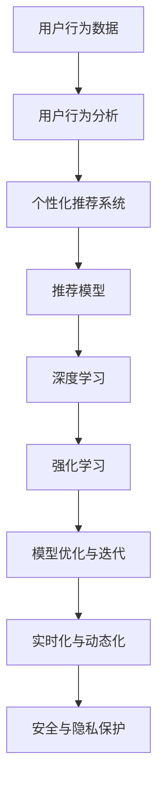

                 

# AI提升电商用户转化率的策略

> 关键词：人工智能,电商,用户转化率,个性化推荐,行为分析,模型优化

## 1. 背景介绍

### 1.1 问题由来

近年来，电子商务行业高速发展，各大电商平台争相抢占市场份额。电商竞争的焦点已不再是价格战，而是如何提升用户转化率，实现从流量到销量的有效转化。用户转化率（Conversion Rate, CR）是指访问电商网站的用户中有多少比例完成了购买或进行了其他期望的转化行为。用户转化率的高低直接影响电商平台的销售业绩和盈利能力。

随着数字化转型的加速，电商平台积累了海量用户数据，这些数据蕴含着用户行为、偏好和需求的信息。然而，仅仅依靠数据挖掘和统计分析，难以深入理解用户背后的动机和需求。如何利用AI技术提升电商用户转化率，成为当前电商行业的重要课题。

### 1.2 问题核心关键点

本研究聚焦于如何运用人工智能技术，特别是深度学习和大数据分析方法，提升电商平台的转化率。具体而言，包括以下几个关键点：

- **用户行为分析**：通过深度学习模型分析用户行为数据，挖掘用户兴趣、需求和潜在转化意图。
- **个性化推荐系统**：基于用户行为分析结果，提供个性化的商品推荐，满足用户需求，促进转化。
- **模型优化与迭代**：采用A/B测试等方法持续优化推荐模型，不断提高用户转化率。
- **实时化与动态化**：在用户行为发生时，动态更新推荐模型，提供即时的推荐服务。
- **安全与隐私保护**：确保数据安全和隐私保护，防止用户信息泄露。

这些关键点共同构成了提升电商用户转化率的完整框架，需要从技术、工程、业务等多个层面协同发力，才能实现预期的效果。

## 2. 核心概念与联系

### 2.1 核心概念概述

为更好地理解AI在电商用户转化率提升中的应用，本节将介绍几个密切相关的核心概念：

- **用户行为分析**：通过数据挖掘技术，分析用户在不同时间、不同场景下的行为模式，如浏览、点击、加购、下单等。
- **个性化推荐系统**：基于用户行为数据，构建推荐模型，实现个性化商品推荐，提高用户购买意愿。
- **深度学习**：一种强大的机器学习技术，通过多层神经网络对复杂数据进行建模，能够自动发现数据中的隐藏模式和规律。
- **强化学习**：通过与环境的互动，模型不断优化行为策略，以最大化预期收益。
- **模型优化与迭代**：采用A/B测试、超参数调优等方法，不断迭代优化推荐模型，提高预测准确性和转化效果。

这些核心概念之间的逻辑关系可以通过以下Mermaid流程图来展示：



这个流程图展示了几大核心概念及其之间的联系：

1. 用户行为数据是分析和推荐的起点。
2. 用户行为分析结果驱动个性化推荐系统，实现商品推荐。
3. 深度学习和强化学习是推荐系统的技术支撑。
4. 模型优化与迭代不断提升推荐模型效果。
5. 实时化和动态化确保推荐服务的时效性。
6. 安全与隐私保护保障用户数据安全。

这些概念共同构成了提升电商用户转化率的完整框架，需要在实践中综合运用。

## 3. 核心算法原理 & 具体操作步骤

### 3.1 算法原理概述

提升电商用户转化率的核心在于构建高效的个性化推荐系统。该系统通过深度学习和强化学习模型，分析用户行为数据，生成个性化推荐，最终提升用户购买意愿和转化率。

基于深度学习的推荐系统一般包括两个步骤：

1. **用户行为表示学习**：将用户行为数据编码为向量表示，捕捉用户兴趣和偏好。
2. **推荐模型预测**：根据用户和商品的向量表示，预测用户可能感兴趣的商品，实现个性化推荐。

常见的推荐算法有基于协同过滤、基于内容过滤、混合过滤等，每种方法都有其优缺点。本节将详细讨论基于深度学习的推荐算法。

### 3.2 算法步骤详解

#### 3.2.1 用户行为表示学习

用户行为表示学习旨在将用户的浏览、点击、购买等行为数据转换为向量表示，从而捕捉用户兴趣和偏好。具体步骤如下：

1. **数据预处理**：对原始行为数据进行清洗、归一化等处理，去除噪音和异常值，保证数据质量。

2. **特征工程**：选择和构造与转化相关的特征，如浏览时间、浏览频率、商品类别、品牌等。

3. **向量表示学习**：使用深度学习模型（如Word2Vec、FM、DNN等）对用户行为数据进行编码，生成用户向量。常用的向量表示模型包括：
   - **Word2Vec**：将用户的浏览记录和点击记录表示为词向量，捕捉用户对商品的兴趣。
   - **FM**：将用户行为数据编码为特征向量，捕捉用户的多样化兴趣。
   - **DNN**：使用深度神经网络对用户行为数据进行多层非线性建模，捕捉用户复杂的兴趣和偏好。

4. **模型评估**：使用评估指标如精确率、召回率、F1值等对模型进行评估，选择性能最优的模型。

#### 3.2.2 推荐模型预测

推荐模型预测旨在根据用户和商品的向量表示，预测用户可能感兴趣的商品。具体步骤如下：

1. **构建推荐模型**：选择适当的深度学习模型，如RNN、LSTM、GRU等，对用户和商品向量进行匹配，预测用户可能感兴趣的商品。

2. **训练推荐模型**：使用历史用户行为数据训练推荐模型，优化模型参数，提高预测准确性。

3. **预测推荐商品**：在用户进行浏览、点击等行为时，实时动态预测用户可能感兴趣的商品，进行个性化推荐。

4. **模型评估与优化**：使用A/B测试等方法评估推荐模型效果，根据用户反馈进行模型优化。

### 3.3 算法优缺点

基于深度学习的推荐系统具有以下优点：

1. **高精度**：通过多层神经网络对复杂数据进行建模，能够自动发现数据中的隐藏模式和规律，预测准确性高。
2. **自适应性**：模型能够根据用户行为动态调整推荐策略，提高用户满意度和转化率。
3. **可扩展性**：可以处理大规模数据，适应不同规模电商平台的需要。

同时，该方法也存在一定的局限性：

1. **数据依赖性强**：推荐模型的效果高度依赖于用户行为数据的完整性和质量，数据的缺失和噪音会影响模型效果。
2. **计算资源消耗大**：深度学习模型参数量较大，训练和推理时资源消耗较高，需要高性能计算资源支持。
3. **解释性差**：推荐模型本质上是一个"黑盒"系统，难以解释推荐结果背后的原因，用户信任度可能受到影响。

尽管存在这些局限性，但就目前而言，基于深度学习的推荐系统仍然是电商行业提升用户转化率的主要技术手段。未来相关研究的重点在于如何进一步降低对数据质量的要求，提高模型的可解释性，同时兼顾计算资源的利用效率。

### 3.4 算法应用领域

基于深度学习的推荐系统在电商领域已经得到了广泛的应用，涵盖了几乎所有商品推荐场景，例如：

- **商品推荐**：根据用户浏览和点击行为，推荐可能感兴趣的商品。
- **相关商品推荐**：推荐与用户当前浏览商品相关的商品，增加用户购买决策。
- **动态促销推荐**：根据用户行为，推荐当前优惠促销商品，提升用户购买意愿。
- **个性化套餐推荐**：根据用户偏好，推荐组合商品，满足用户多样化需求。

除了上述这些经典推荐场景外，推荐系统还被创新性地应用到更多场景中，如流失用户召回、商品价格预测、库存管理等，为电商行业带来了全新的突破。随着深度学习和大数据技术的发展，基于推荐系统的电商应用必将不断创新，进一步提升用户满意度和转化率。

## 4. 数学模型和公式 & 详细讲解 & 举例说明

### 4.1 数学模型构建

基于深度学习的推荐系统一般使用矩阵分解和深度神经网络进行建模。以基于矩阵分解的协同过滤算法为例，数学模型构建如下：

设用户行为矩阵为 $U$，商品特征矩阵为 $V$，用户向量表示为 $u$，商品向量表示为 $v$，推荐评分矩阵为 $R$，则协同过滤模型的目标为：

$$
R_{ij} = u_i^T V_j
$$

其中 $u_i$ 表示用户 $i$ 的向量表示，$V_j$ 表示商品 $j$ 的向量表示，$R_{ij}$ 表示用户 $i$ 对商品 $j$ 的评分，$u_i^T V_j$ 表示用户对商品的评分预测。

### 4.2 公式推导过程

以协同过滤模型的矩阵分解为例，推导预测评分 $R_{ij}$ 的计算公式：

设用户向量 $u_i$ 和商品向量 $v_j$ 分别包含 $n$ 维特征，则矩阵分解公式为：

$$
u_i = \alpha \sum_{k=1}^n u_{ik} \times b_k
$$

$$
v_j = \beta \sum_{k=1}^n v_{jk} \times c_k
$$

其中 $\alpha$ 和 $\beta$ 是可学习参数，$u_{ik}$ 和 $v_{jk}$ 是用户和商品的特征向量。

根据上述公式，可以推导出协同过滤模型的预测评分公式为：

$$
R_{ij} = \alpha \sum_{k=1}^n (u_{ik} \times c_k) \times \beta \sum_{k=1}^n (v_{jk} \times b_k)
$$

化简得：

$$
R_{ij} = \alpha \beta \sum_{k=1}^n u_{ik} v_{jk}
$$

### 4.3 案例分析与讲解

以协同过滤模型为例，假设用户 $i$ 对商品 $j$ 的评分预测公式为：

$$
\hat{R}_{ij} = \sum_{k=1}^n \hat{u}_{ik} \hat{v}_{jk}
$$

其中 $\hat{u}_{ik}$ 和 $\hat{v}_{jk}$ 分别为用户 $i$ 和商品 $j$ 的向量表示。

以用户 $i$ 对商品 $j$ 的评分预测为例，假设用户和商品特征矩阵分别为 $U$ 和 $V$，则协同过滤模型的预测评分公式为：

$$
\hat{R}_{ij} = u_i^T V_j
$$

假设 $u_i = [0.5, 0.3, 0.2]$，$V_j = [0.6, 0.4, 0.1]$，则：

$$
\hat{R}_{ij} = 0.5 \times 0.6 + 0.3 \times 0.4 + 0.2 \times 0.1 = 0.44
$$

这个预测评分可以与实际评分进行比较，用于评估模型效果。

## 5. 项目实践：代码实例和详细解释说明

### 5.1 开发环境搭建

在进行推荐系统开发前，我们需要准备好开发环境。以下是使用Python进行TensorFlow开发的环境配置流程：

1. 安装Anaconda：从官网下载并安装Anaconda，用于创建独立的Python环境。

2. 创建并激活虚拟环境：
```bash
conda create -n tf-env python=3.8 
conda activate tf-env
```

3. 安装TensorFlow：根据CUDA版本，从官网获取对应的安装命令。例如：
```bash
conda install tensorflow -c tensorflow -c conda-forge
```

4. 安装Pandas、Numpy、Matplotlib等工具包：
```bash
pip install pandas numpy matplotlib sklearn tqdm jupyter notebook ipython
```

完成上述步骤后，即可在`tf-env`环境中开始推荐系统开发。

### 5.2 源代码详细实现

下面以协同过滤推荐系统为例，给出使用TensorFlow对用户行为数据进行矩阵分解的PyTorch代码实现。

首先，定义用户行为数据：

```python
import tensorflow as tf
import numpy as np
import pandas as pd

# 加载用户行为数据
data = pd.read_csv('user_behavior.csv')
```

然后，构建协同过滤模型：

```python
# 构建用户特征矩阵U
U = tf.Variable(tf.random.normal([num_users, num_features]))

# 构建商品特征矩阵V
V = tf.Variable(tf.random.normal([num_items, num_features]))

# 构建评分矩阵R
R = tf.matmul(U, V, transpose_b=True)

# 定义损失函数
def loss_function(rated_matrix, predicted_matrix):
    return tf.reduce_mean(tf.square(rated_matrix - predicted_matrix))

# 定义优化器
optimizer = tf.optimizers.Adam()

# 定义训练函数
def train_model(rated_matrix, U, V):
    with tf.GradientTape() as tape:
        predicted_matrix = tf.matmul(U, V, transpose_b=True)
        loss = loss_function(rated_matrix, predicted_matrix)
    gradients = tape.gradient(loss, [U, V])
    optimizer.apply_gradients(zip(gradients, [U, V]))
```

最后，启动模型训练和评估：

```python
# 加载评分矩阵
rated_matrix = np.loadtxt('rating_matrix.csv')

# 训练模型
train_model(rated_matrix, U, V)

# 评估模型
predicted_matrix = tf.matmul(U, V, transpose_b=True)
print(loss_function(rated_matrix, predicted_matrix))
```

以上就是使用TensorFlow对协同过滤推荐系统进行矩阵分解的完整代码实现。可以看到，TensorFlow提供了简单易用的API，可以快速搭建和训练推荐模型。

### 5.3 代码解读与分析

让我们再详细解读一下关键代码的实现细节：

**用户行为数据**：
- 使用Pandas加载用户行为数据，方便后续数据处理。

**协同过滤模型**：
- 定义用户特征矩阵 $U$ 和商品特征矩阵 $V$，随机初始化参数。
- 根据用户和商品特征矩阵计算评分矩阵 $R$，使用矩阵乘法实现。
- 定义损失函数，计算预测评分与实际评分之间的均方误差。
- 定义优化器，使用Adam优化器更新模型参数。
- 定义训练函数，使用梯度下降优化器对模型进行训练。

**训练与评估**：
- 加载评分矩阵，传入训练函数进行模型训练。
- 使用训练好的模型计算预测评分，并与实际评分进行对比，计算损失。

可以看到，TensorFlow提供了完整的模型构建、训练和评估框架，极大地方便了深度学习模型的开发和优化。

## 6. 实际应用场景

### 6.1 智能推荐引擎

智能推荐引擎是提升电商用户转化率的重要手段。通过深度学习模型对用户行为进行分析和推荐，可以显著提升用户购买意愿和转化率。

在技术实现上，可以构建协同过滤、深度学习等多种推荐模型，根据用户的历史行为数据和实时行为数据，动态生成个性化推荐，提升用户转化率。智能推荐引擎不仅能够推荐商品，还可以推荐相关商品、相关活动、相关优惠等，丰富用户的购物体验，促进二次购买。

### 6.2 个性化营销活动

电商平台可以基于用户行为数据，构建用户画像，进行个性化的营销活动，提高用户转化率。

具体而言，可以收集用户浏览、点击、购买等行为数据，提取和用户交互的物品标题、描述、标签等文本内容。将文本内容作为模型输入，用户的后续行为（如是否点击、购买等）作为监督信号，在此基础上微调预训练语言模型。微调后的模型能够从文本内容中准确把握用户的兴趣点。在生成营销活动时，先用候选活动的内容作为输入，由模型预测用户的兴趣匹配度，再结合其他特征综合排序，便可以得到个性化程度更高的推荐结果。

### 6.3 动态定价策略

电商平台的商品价格往往随着市场需求变化而波动，动态定价策略能够帮助电商平台更好地匹配供需关系，提升转化率。

在动态定价中，可以根据用户行为数据，使用深度学习模型预测商品的市场需求和用户购买意愿，动态调整商品价格。例如，在用户浏览商品时，实时计算该商品的市场需求和用户的购买意愿，根据需求和意愿调整价格，吸引用户购买。

### 6.4 未来应用展望

随着深度学习和大数据技术的发展，基于推荐系统的电商应用将不断创新，为电商行业带来更多突破。

在智慧营销领域，推荐系统可以基于用户行为，动态生成个性化广告和营销活动，提升广告投放的精准性和转化率。

在智能供应链管理中，推荐系统可以基于用户需求和库存情况，动态生成补货计划和配送策略，优化供应链管理，提升用户满意度。

在智能客服领域，推荐系统可以基于用户历史行为和实时行为，动态生成个性化客服推荐，提升客服响应速度和质量。

总之，未来电商行业将更加依赖于智能推荐系统，通过深度学习和大数据技术，提升用户转化率和购物体验，实现业务增长和用户满意度的双赢。

## 7. 工具和资源推荐

### 7.1 学习资源推荐

为了帮助开发者系统掌握推荐系统的理论基础和实践技巧，这里推荐一些优质的学习资源：

1. 《推荐系统》课程：斯坦福大学开设的深度学习课程，涵盖推荐系统的基本概念和算法。
2. 《深度学习推荐系统：算法与实战》书籍：介绍推荐系统的算法原理和实现细节，适合实践开发。
3. 《TensorFlow实战推荐系统》书籍：介绍如何使用TensorFlow搭建和优化推荐系统，适合TensorFlow用户。
4. Kaggle推荐系统竞赛：参与推荐系统竞赛，了解推荐系统的最新趋势和技术进展。
5. Arxiv论文库：浏览和下载推荐系统的最新研究成果，了解前沿技术动态。

通过对这些资源的学习实践，相信你一定能够快速掌握推荐系统的精髓，并用于解决实际的电商问题。

### 7.2 开发工具推荐

高效的开发离不开优秀的工具支持。以下是几款用于推荐系统开发的常用工具：

1. TensorFlow：谷歌主导的深度学习框架，适合大规模模型训练和优化。
2. PyTorch：Facebook开源的深度学习框架，灵活高效，适合快速迭代。
3. Amazon SageMaker：亚马逊提供的云端机器学习平台，提供完整的开发、训练、部署流程。
4. Weights & Biases：模型训练的实验跟踪工具，记录和可视化模型训练过程，方便调试和优化。
5. TensorBoard：TensorFlow配套的可视化工具，实时监测模型训练状态，提供丰富的图表呈现方式。

合理利用这些工具，可以显著提升推荐系统的开发效率，加快创新迭代的步伐。

### 7.3 相关论文推荐

推荐系统的发展源于学界的持续研究。以下是几篇奠基性的相关论文，推荐阅读：

1. <i>Factorization Machines for Recommender Systems</i>：介绍因子分解机算法，解决稀疏性问题，提升推荐模型的效果。
2. <i>Deep Collaborative Filtering</i>：提出深度神经网络推荐模型，提升推荐系统的准确性和多样性。
3. <i>Learning Deep Architectures for Recommendation Systems with Missing Data</i>：提出基于深度学习的多模态推荐模型，解决缺失数据问题。
4. <i>Adaptive Processing for Recommender Systems</i>：提出自适应推荐算法，提升推荐系统的适应性和个性化。
5. <i>Scalable Recommender Systems: A survey</i>：综述推荐系统的发展历程和最新进展，提供系统的知识框架。

这些论文代表了大推荐系统的发展脉络。通过学习这些前沿成果，可以帮助研究者把握学科前进方向，激发更多的创新灵感。

## 8. 总结：未来发展趋势与挑战

### 8.1 总结

本文对基于深度学习的电商推荐系统进行了全面系统的介绍。首先阐述了电商行业提升用户转化率的重要性，明确了推荐系统在其中的关键作用。其次，从原理到实践，详细讲解了推荐系统的数学模型和关键步骤，给出了推荐系统开发的完整代码实例。同时，本文还广泛探讨了推荐系统在电商领域的应用前景，展示了推荐系统范式的巨大潜力。此外，本文精选了推荐系统的各类学习资源，力求为读者提供全方位的技术指引。

通过本文的系统梳理，可以看到，基于深度学习的推荐系统正在成为电商行业提升用户转化率的主要技术手段，极大地拓展了电商平台的业务边界，催生了更多的落地场景。未来，伴随深度学习和大数据技术的发展，推荐系统将不断创新，为电商行业带来更多突破。

### 8.2 未来发展趋势

展望未来，电商推荐系统将呈现以下几个发展趋势：

1. **推荐系统智能化**：引入更多AI技术，如强化学习、迁移学习、因果推断等，提升推荐系统的智能化水平。
2. **推荐系统实时化**：实时更新推荐模型，动态生成个性化推荐，满足用户即时需求。
3. **推荐系统跨域化**：拓展推荐系统到更多领域，如金融、医疗、教育等，提升跨领域推荐效果。
4. **推荐系统个性化**：利用多模态数据和知识图谱，提供更加个性化和精准的推荐服务。
5. **推荐系统透明化**：提升推荐系统的可解释性，增强用户对推荐结果的信任度。
6. **推荐系统协同化**：结合业务规则和专家知识，进行多路径协同推荐，提升推荐效果。

以上趋势凸显了电商推荐系统的发展方向，需要在技术和业务多个层面不断探索和优化。

### 8.3 面临的挑战

尽管电商推荐系统已经取得了显著成效，但在迈向更加智能化、个性化应用的过程中，它仍面临着诸多挑战：

1. **数据质量问题**：用户行为数据往往存在噪音和缺失，如何提升数据质量，提高模型效果，是重要挑战。
2. **模型计算资源消耗大**：深度学习模型计算资源消耗高，如何在保证性能的同时，优化计算资源使用，是技术难题。
3. **推荐结果可解释性差**：推荐系统本质上是一个"黑盒"系统，难以解释推荐结果背后的原因，用户信任度可能受到影响。
4. **跨域推荐效果差**：推荐系统在跨领域推荐时，效果往往大打折扣，如何提升跨域推荐能力，是关键问题。
5. **隐私和安全问题**：用户行为数据包含大量敏感信息，如何保护用户隐私，防止数据泄露，是重要挑战。

尽管存在这些挑战，但未来在数据治理、计算资源优化、模型解释性提升等方面，仍有很大的研究空间。相信随着学界和产业界的共同努力，这些挑战终将一一被克服，推荐系统必将在构建人机协同的智能电商中扮演越来越重要的角色。

### 8.4 研究展望

面对电商推荐系统所面临的种种挑战，未来的研究需要在以下几个方面寻求新的突破：

1. **跨领域推荐**：构建跨领域推荐模型，提升推荐系统在多领域的应用效果。
2. **实时推荐**：引入流式计算、实时数据处理技术，实现实时推荐，提升用户体验。
3. **混合推荐**：结合传统推荐算法和深度学习算法，构建混合推荐系统，提升推荐效果。
4. **个性化推荐**：利用多模态数据和知识图谱，提供更加个性化和精准的推荐服务。
5. **推荐系统透明化**：提升推荐系统的可解释性，增强用户对推荐结果的信任度。
6. **推荐系统协同化**：结合业务规则和专家知识，进行多路径协同推荐，提升推荐效果。

这些研究方向将推动推荐系统技术的进一步发展，提升电商平台的业务价值和用户满意度。相信随着技术的不断突破，推荐系统将更好地服务于电商行业，促进智能电商的繁荣发展。

## 9. 附录：常见问题与解答

**Q1：电商推荐系统的核心技术是什么？**

A: 电商推荐系统的核心技术主要是基于深度学习的推荐算法，包括协同过滤、基于内容过滤、混合过滤等。协同过滤算法是最常用的推荐算法之一，它通过矩阵分解和向量表示，捕捉用户和商品之间的隐式关联，实现推荐。

**Q2：电商推荐系统如何提升用户转化率？**

A: 电商推荐系统通过深度学习模型分析用户行为数据，挖掘用户兴趣和需求，生成个性化推荐，从而提升用户购买意愿和转化率。具体而言，推荐系统可以根据用户的历史行为数据和实时行为数据，动态生成个性化商品推荐，增加用户购买决策的可能性。

**Q3：电商推荐系统对标注数据的需求如何？**

A: 电商推荐系统一般对标注数据的需求较低，主要是依赖于用户行为数据进行推荐。但是，对于特定任务（如产品分类、情感分析等），可能需要标注数据进行微调，以提高推荐模型的准确性。

**Q4：电商推荐系统的计算资源消耗如何？**

A: 电商推荐系统的计算资源消耗较大，尤其是深度学习模型。在训练和推理阶段，需要高性能计算资源支持。因此，推荐系统需要在硬件资源和算法优化方面进行综合考虑，平衡模型性能和计算资源消耗。

**Q5：电商推荐系统的安全与隐私问题如何解决？**

A: 电商推荐系统需要在数据收集、处理和存储过程中，严格遵守数据保护法规，保障用户隐私安全。具体而言，可以采用数据匿名化、访问控制等技术，防止用户信息泄露。同时，需要在推荐模型中引入隐私保护技术，如差分隐私、联邦学习等，保障推荐过程的隐私安全。

以上是基于深度学习的电商推荐系统的全面介绍，希望能为你提供有价值的参考。未来，随着技术的不断进步，推荐系统将带来更多创新和突破，为电商行业带来更多的机遇和挑战。

