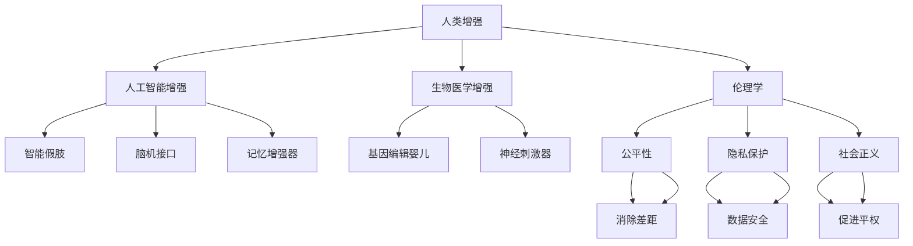
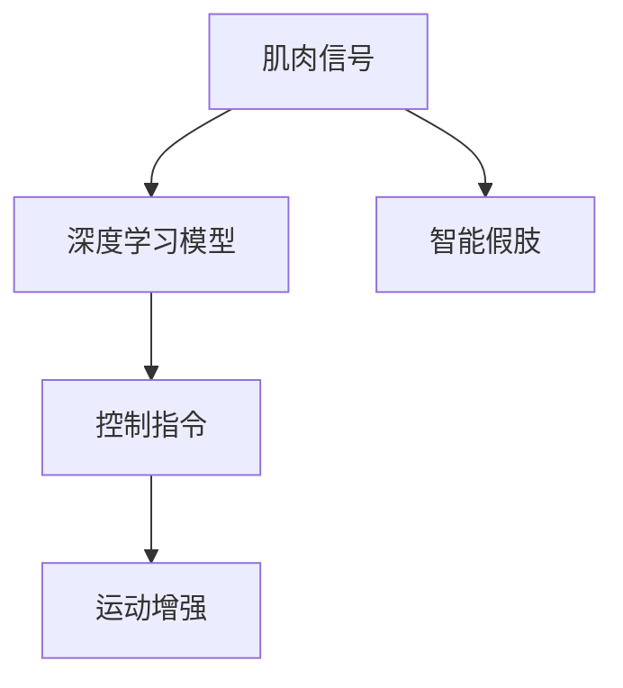

                 

# AI时代的人类增强：身体增强与道德考虑

> 关键词：人类增强,身体增强,人工智能,伦理学,法律框架,社会影响

## 1. 背景介绍

### 1.1 问题由来
随着人工智能(AI)技术的飞速发展，人类增强技术(Augmentation)正在成为未来科技发展的关键领域。通过人工智能与生物医学的结合，人类的感知、认知、运动等能力得到显著提升。然而，这一领域的发展也伴随着一系列伦理和社会问题，亟需相关法律法规和伦理框架的引导和规范。

### 1.2 问题核心关键点
人类增强技术的核心在于通过科技手段增强人类体能、智能和情感体验。其中包括如人工智能增强、生物医学增强等。其中，AI在人类增强中的应用尤为广泛，不仅涵盖物理领域如智能假肢、脑机接口等，还包括认知领域如记忆增强、智能学习系统等。这些技术的不断突破，为人类带来前所未有的生活变革，但也带来了道德、法律等多方面的挑战。

### 1.3 问题研究意义
研究AI时代的人类增强，对于明确技术的边界、保护人类的权益、推动科技伦理与法律进步，具有重要意义。一方面，可以通过合理规划和应用这些技术，提升人类的生活质量，减少疾病和劳动负担；另一方面，也能有效防范科技滥用带来的潜在风险，确保技术发展能够惠及全人类。

## 2. 核心概念与联系

### 2.1 核心概念概述

为更好地理解AI时代的人类增强及其伦理法律问题，本节将介绍几个密切相关的核心概念：

- 人类增强(Augmentation)：通过科技手段提高人类的各项生理和心理能力，如增强感官、记忆力、认知能力等。
- 人工智能增强(AI Augmentation)：通过人工智能技术实现的人类增强，包括智能假肢、脑机接口、记忆增强器等。
- 生物医学增强(Biomedical Augmentation)：利用生物医学技术如基因编辑、神经刺激等实现的人类增强，如基因编辑婴儿、神经刺激器等。
- 伦理学(Ethics)：研究人类增强技术应用中的道德问题，如公平性、隐私保护、社会正义等。
- 法律框架(Legal Framework)：通过立法对人类增强技术的应用进行规范，保护公众权益，防止滥用。

这些核心概念之间的逻辑关系可以通过以下Mermaid流程图来展示：



这个流程图展示的人类增强的核心概念及其之间的关系：

1. 人类增强包括人工智能增强和生物医学增强。
2. 人工智能增强涵盖智能假肢、脑机接口、记忆增强器等多个子领域。
3. 生物医学增强涉及基因编辑婴儿、神经刺激器等子领域。
4. 伦理学研究如何处理增强技术带来的伦理问题，如公平性、隐私保护、社会正义等。
5. 法律框架用以规范人类增强技术的应用，保护公众权益，防止滥用。

这些概念共同构成了AI时代人类增强的研究框架，为探讨技术应用及其道德法律问题提供了理论基础。

## 3. 核心算法原理 & 具体操作步骤
### 3.1 算法原理概述

人类增强技术涉及多种学科的交叉，其算法原理复杂多样。以下将以人工智能增强为例，简要介绍其核心算法原理。

人工智能增强的核心算法原理基于深度学习、神经网络和优化算法。通过收集大量数据，使用深度学习模型进行训练，优化算法不断调整模型参数，使模型能够准确预测并生成增强效果。这些技术主要包括：

- 深度学习模型：如卷积神经网络(CNN)、循环神经网络(RNN)、变换器(Transformer)等，用于处理结构化或非结构化数据。
- 神经网络结构：如递归神经网络(RNN)、长短时记忆网络(LSTM)、门控循环单元(GRU)等，用于处理序列数据。
- 优化算法：如随机梯度下降(SGD)、Adam、Adagrad等，用于调整模型参数，提高模型精度和泛化能力。

### 3.2 算法步骤详解

人工智能增强的一般操作步骤如下：

1. 数据收集：从不同来源收集与增强效果相关的数据，如人体动作数据、生物信号数据等。
2. 数据预处理：对数据进行清洗、标注、归一化等处理，以便模型训练。
3. 模型选择与训练：选择合适的深度学习模型，进行模型训练，优化算法调整模型参数。
4. 模型评估与调优：在测试集上评估模型效果，根据评估结果进行模型调优。
5. 部署与迭代：将模型部署到实际应用中，持续收集反馈数据，迭代改进模型。

### 3.3 算法优缺点

人工智能增强技术具有以下优点：

1. 精度高：深度学习模型具有强大的数据处理能力，能够生成高精度的增强效果。
2. 灵活性强：不同领域的增强需求可以通过定制模型满足，适用范围广。
3. 实时性：在硬件设备的支持下，可以实时生成增强效果，满足即时性需求。

同时，该技术也存在一些局限性：

1. 数据依赖：模型训练需要大量高质量标注数据，数据获取成本高。
2. 安全性问题：增强效果可能带来安全隐患，如过度依赖技术导致人类能力退化。
3. 伦理道德：增强技术的滥用可能导致伦理道德问题，如隐私侵犯、公平性不足等。
4. 可解释性：深度学习模型的"黑盒"特性，难以解释其内部决策逻辑。

### 3.4 算法应用领域

人工智能增强技术在多个领域具有广泛的应用前景，例如：

- 医疗领域：用于帮助残疾人士进行康复训练，增强运动能力。如智能假肢、脑机接口辅助治疗等。
- 体育领域：增强运动员的体能和技能，提高比赛成绩。如智能训练系统、运动数据分析等。
- 教育领域：通过智能学习系统，增强学生的认知和记忆能力，提升学习效果。如个性化学习平台、智能辅导系统等。
- 娱乐领域：增强娱乐体验，如虚拟现实(VR)、增强现实(AR)应用，提供沉浸式体验。如游戏增强、虚拟运动等。

此外，人工智能增强技术在工业生产、军事安全、航空航天等众多领域也有重要应用，推动了相关领域的数字化和智能化转型。

## 4. 数学模型和公式 & 详细讲解 & 举例说明

### 4.1 数学模型构建

本节将使用数学语言对人工智能增强的算法进行更详细的刻画。

假设输入数据为 $x \in \mathbb{R}^n$，输出为 $y \in \mathbb{R}^m$。使用深度学习模型进行训练，模型的参数表示为 $\theta$。定义损失函数 $L(\theta)$ 为模型输出与真实标签之间的均方误差，数学模型如下：

$$
\min_{\theta} \sum_{i=1}^N (y_i - f_\theta(x_i))^2
$$

其中 $N$ 为样本数量，$y_i$ 为第 $i$ 个样本的真实标签，$f_\theta(x_i)$ 为模型在输入 $x_i$ 上的预测输出。

### 4.2 公式推导过程

在深度学习模型中，神经网络是一个由多个层组成的函数映射。以单层神经网络为例，其数学模型可以表示为：

$$
f_\theta(x) = \sum_{i=1}^n w_i a_{i-1}(x) + b
$$

其中 $w_i$ 为权重，$a_{i-1}(x)$ 为前一层的输出，$b$ 为偏置。

通过反向传播算法，求解损失函数对模型参数 $\theta$ 的梯度，并使用优化算法更新参数。具体推导过程如下：

$$
\frac{\partial L}{\partial w_i} = -2 \sum_{j=1}^m \frac{\partial y_j}{\partial w_i} \frac{\partial y_j}{\partial f_\theta(x)} \frac{\partial f_\theta(x)}{\partial w_i}
$$

其中，$\frac{\partial y_j}{\partial f_\theta(x)}$ 为模型输出对输入的梯度，$\frac{\partial f_\theta(x)}{\partial w_i}$ 为模型参数对输入的梯度。

### 4.3 案例分析与讲解

以智能假肢为例，探讨如何通过深度学习技术实现人体运动增强。

假设输入为用户的肌肉信号，输出为智能假肢的控制指令。首先，通过传感器收集用户的肌肉信号，预处理后输入深度学习模型。模型输出控制指令，控制智能假肢的运动。训练过程如图：



模型训练时，需要大量标注数据，以监督学习方式进行。通过反向传播算法求解梯度，优化模型参数，使得模型能够准确地将肌肉信号映射为控制指令。训练后的模型可以实时处理用户的肌肉信号，生成对应的控制指令，实现智能假肢的运动增强。

## 5. 项目实践：代码实例和详细解释说明

### 5.1 开发环境搭建

在进行人工智能增强技术开发前，需要准备好开发环境。以下是使用Python进行PyTorch开发的环境配置流程：

1. 安装Anaconda：从官网下载并安装Anaconda，用于创建独立的Python环境。

2. 创建并激活虚拟环境：
```bash
conda create -n pytorch-env python=3.8 
conda activate pytorch-env
```

3. 安装PyTorch：根据CUDA版本，从官网获取对应的安装命令。例如：
```bash
conda install pytorch torchvision torchaudio cudatoolkit=11.1 -c pytorch -c conda-forge
```

4. 安装TensorFlow：由Google主导开发的开源深度学习框架，生产部署方便，适合大规模工程应用。同样有丰富的预训练语言模型资源。

5. 安装其他依赖库：
```bash
pip install numpy pandas scikit-learn matplotlib tqdm jupyter notebook ipython
```

完成上述步骤后，即可在`pytorch-env`环境中开始人工智能增强的开发实践。

### 5.2 源代码详细实现

下面我们以智能假肢控制为例，给出使用PyTorch进行深度学习模型训练的PyTorch代码实现。

```python
import torch
import torch.nn as nn
import torch.optim as optim
from torch.utils.data import DataLoader
import torchvision.transforms as transforms

# 定义模型
class DeepLearningModel(nn.Module):
    def __init__(self, input_size, output_size):
        super(DeepLearningModel, self).__init__()
        self.layers = nn.Sequential(
            nn.Linear(input_size, 64),
            nn.ReLU(),
            nn.Linear(64, 64),
            nn.ReLU(),
            nn.Linear(64, output_size),
        )
    
    def forward(self, x):
        return self.layers(x)

# 数据预处理
transform = transforms.Compose([
    transforms.ToTensor(),
    transforms.Normalize((0.5,), (0.5,))
])

# 定义训练集
train_dataset = MyDataset(train_data, train_labels, transform)
train_loader = DataLoader(train_dataset, batch_size=64, shuffle=True)

# 定义优化器
model = DeepLearningModel(input_size, output_size)
criterion = nn.MSELoss()
optimizer = optim.Adam(model.parameters(), lr=0.001)

# 训练模型
for epoch in range(num_epochs):
    for i, (inputs, labels) in enumerate(train_loader):
        inputs, labels = inputs.to(device), labels.to(device)
        optimizer.zero_grad()
        outputs = model(inputs)
        loss = criterion(outputs, labels)
        loss.backward()
        optimizer.step()
        print(f"Epoch {epoch+1}, Batch {i+1}, Loss: {loss.item():.4f}")
```

以上代码实现了一个简单的深度学习模型，用于处理智能假肢控制的数据。

### 5.3 代码解读与分析

让我们再详细解读一下关键代码的实现细节：

**MyDataset类**：
- `__init__`方法：初始化训练集数据和标签，以及数据预处理管道。
- `__len__`方法：返回数据集的样本数量。
- `__getitem__`方法：获取单个样本的数据和标签。

**DeepLearningModel类**：
- `__init__`方法：定义模型的层结构和初始化参数。
- `forward`方法：前向传播计算模型输出。

**数据预处理**：
- `transforms`模块提供了丰富的数据预处理工具，如归一化、张量转换等，方便模型的训练。

**训练模型**：
- `DataLoader`：用于对数据集进行批次化加载，供模型训练使用。
- `Adam`优化器：自适应学习率优化算法，适合深度学习模型的训练。
- `nn.MSELoss`：均方误差损失函数，用于衡量模型预测输出与真实标签之间的差异。

**模型训练**：
- `for`循环：迭代训练集数据，每次迭代前清除梯度。
- `to(device)`：将数据和标签转移到GPU或TPU设备进行计算。
- `optimizer.zero_grad()`：清除之前迭代中的梯度。
- `model(inputs)`：前向传播计算模型输出。
- `loss = criterion(outputs, labels)`：计算损失函数。
- `loss.backward()`：反向传播计算梯度。
- `optimizer.step()`：更新模型参数。

可以看到，PyTorch提供了灵活的数据处理、模型构建和训练工具，使得深度学习模型的开发变得简单高效。开发者可以更多地关注算法设计，而不必过多关注底层实现细节。

## 6. 实际应用场景

### 6.1 医疗康复

在医疗康复领域，人工智能增强技术可显著提升康复训练的效率和效果。如智能假肢、康复机器人等，通过深度学习模型进行实时处理和控制，帮助残疾人士恢复运动能力，改善生活质量。

具体而言，智能假肢结合传感器和深度学习模型，能够实时分析用户的肌肉信号，并生成对应的控制指令，使假肢运动更加自然和精确。此外，康复机器人通过深度学习模型分析用户动作，生成反馈信号，指导康复训练，提升训练效果。这些技术的应用，不仅减轻了医护人员的劳动负担，也加速了患者的康复进程。

### 6.2 体育训练

在体育领域，人工智能增强技术同样大显身手。如智能训练系统、运动数据分析等，通过深度学习模型处理和分析数据，提供精准的训练方案和评估结果。

智能训练系统通过传感器收集运动员的动作数据，结合深度学习模型进行分析，生成个性化训练计划。这些系统能够实时监测运动员的姿势、速度、力量等指标，给出即时反馈和建议。此外，运动数据分析系统通过深度学习模型分析运动员的表现数据，识别出训练中的不足和问题，提出改进方案。这些技术的应用，提高了运动员的训练效果，缩短了训练周期，提升了比赛成绩。

### 6.3 教育学习

在教育领域，人工智能增强技术能够显著提升学习效果，推动个性化学习的发展。如智能辅导系统、个性化学习平台等，通过深度学习模型处理和分析数据，提供定制化的学习资源和建议。

智能辅导系统通过深度学习模型分析学生的学习行为和成绩，生成个性化的学习建议。这些系统能够实时监测学生的学习进度和效果，提供及时的反馈和帮助。个性化学习平台通过深度学习模型分析学生的兴趣和学习风格，推荐合适的学习资源，提升学习效果。这些技术的应用，使得学习更加个性化和高效，提升了学生的学习体验和成绩。

### 6.4 未来应用展望

随着人工智能增强技术的不断发展，其应用前景将更加广阔。未来，该技术将在更多领域得到应用，为人类带来更丰富的体验和更高质量的生活。

在智慧医疗领域，人工智能增强技术将进一步推动医疗服务的智能化和精准化，辅助医生诊断和治疗，提升医疗服务的质量和效率。

在智能教育领域，人工智能增强技术将推动教育公平和个性化学习的发展，提升教育资源的分配和利用效率，培养更多优秀人才。

在智能工业领域，人工智能增强技术将推动工业生产的智能化和自动化，提升生产效率和产品质量，实现工业4.0的梦想。

此外，人工智能增强技术在智能家居、智能交通、智能安防等众多领域也将得到广泛应用，推动社会各领域的数字化和智能化转型。

## 7. 工具和资源推荐

### 7.1 学习资源推荐

为了帮助开发者系统掌握人工智能增强技术的理论基础和实践技巧，这里推荐一些优质的学习资源：

1. 《深度学习入门：基于Python的理论与实现》系列博文：由深度学习领域专家撰写，全面介绍了深度学习的基本概念和核心算法。

2. 《人工智能伦理与法律》课程：斯坦福大学开设的AI伦理课程，探讨了AI技术的伦理问题，为开发者提供了多角度思考。

3. 《人工智能应用与伦理》书籍：该书详细介绍了AI技术在各个领域的实际应用案例，并探讨了其伦理和社会问题。

4. IEEE《人工智能伦理》期刊：IEEE旗下的AI伦理期刊，刊登了大量AI伦理和社会问题的研究论文，提供了深入的理论探讨。

5. GitHub开源项目：GitHub上有大量AI增强技术的开源项目，包括智能假肢、康复机器人、个性化学习系统等，适合开发者学习实践。

通过对这些资源的学习实践，相信你一定能够快速掌握人工智能增强技术的精髓，并用于解决实际的AI问题。

### 7.2 开发工具推荐

高效的开发离不开优秀的工具支持。以下是几款用于人工智能增强技术开发的常用工具：

1. PyTorch：基于Python的开源深度学习框架，灵活的计算图，适合快速迭代研究。适用于深度学习模型的开发。

2. TensorFlow：由Google主导开发的开源深度学习框架，生产部署方便，适合大规模工程应用。同样有丰富的深度学习资源。

3. Keras：基于Python的深度学习框架，简单易用，适合快速搭建和训练模型。

4. Weights & Biases：模型训练的实验跟踪工具，可以记录和可视化模型训练过程中的各项指标，方便对比和调优。与主流深度学习框架无缝集成。

5. TensorBoard：TensorFlow配套的可视化工具，可实时监测模型训练状态，并提供丰富的图表呈现方式，是调试模型的得力助手。

6. Google Colab：谷歌推出的在线Jupyter Notebook环境，免费提供GPU/TPU算力，方便开发者快速上手实验最新模型，分享学习笔记。

合理利用这些工具，可以显著提升人工智能增强技术的开发效率，加快创新迭代的步伐。

### 7.3 相关论文推荐

人工智能增强技术的发展源于学界的持续研究。以下是几篇奠基性的相关论文，推荐阅读：

1. AlphaGo Zero: Mastering the Game of Go without Human Knowledge：通过深度强化学习，AlphaGo Zero实现了无需人类干预的自监督学习，展示了AI在复杂游戏中的潜力。

2. DeepMind Health: AI for Life-Saving Science and Medical Research：介绍了AI在医学研究中的应用，展示了AI在医疗领域的多样化应用。

3. Reinforcement Learning for Healthcare：探讨了AI在医疗领域的应用，包括医疗数据分析、智能诊断、个性化治疗等。

4. AI for Health: Recommendations on Ethical Considerations: A Report of the Council for AI in Health（AI in Health伦理指南）：由AI专家联合撰写，探讨了AI在医疗健康领域应用的伦理问题，提供了行动指南。

这些论文代表了大语言模型微调技术的发展脉络。通过学习这些前沿成果，可以帮助研究者把握学科前进方向，激发更多的创新灵感。

## 8. 总结：未来发展趋势与挑战

### 8.1 总结

本文对人工智能增强技术的背景、核心概念、算法原理、实践应用、伦理法律等方面进行了全面系统的介绍。首先阐述了人工智能增强技术的意义和应用前景，明确了其在医疗、体育、教育等多个领域的重要性。其次，从原理到实践，详细讲解了深度学习模型的构建和训练过程，给出了实际应用场景的代码实现。最后，本文探讨了人工智能增强技术的伦理和法律问题，提出了相关建议。

通过本文的系统梳理，可以看到，人工智能增强技术正在成为未来科技发展的重要方向，具有广阔的应用前景。未来，随着技术的不断进步，其在更多领域的应用将带来新的变革和机遇。

### 8.2 未来发展趋势

展望未来，人工智能增强技术将呈现以下几个发展趋势：

1. 技术不断进步：深度学习模型将继续发展，精度和效率不断提升，适用范围不断扩大。
2. 多模态融合：人工智能增强技术将更加注重多模态数据的融合，如视觉、语音、文本等的协同增强。
3. 个性化定制：随着个性化学习的需求增加，深度学习模型将更加注重个性化和定制化的开发。
4. 伦理法律规范：随着技术的广泛应用，伦理和法律问题将逐步得到重视，相关法律法规和伦理框架将逐步完善。
5. 社会影响评估：未来，社会各界将更加关注人工智能增强技术对社会的影响，积极推动技术的负责任应用。

以上趋势凸显了人工智能增强技术的广阔前景。这些方向的探索发展，将进一步推动人工智能技术在各个领域的落地应用，为人类社会带来更多的福祉。

### 8.3 面临的挑战

尽管人工智能增强技术已经取得了显著成果，但在迈向更广泛应用的过程中，仍面临诸多挑战：

1. 数据获取困难：高质量的训练数据难以获取，限制了深度学习模型的精度和适用范围。
2. 伦理道德问题：增强技术的滥用可能带来隐私、公平性等伦理道德问题，需要引起高度关注。
3. 技术壁垒高：深度学习模型的开发和训练需要高度的专业知识和丰富的经验，难以普及推广。
4. 法律框架缺乏：当前的相关法律框架尚未完善，难以全面规范人工智能增强技术的应用。
5. 技术冲突：增强技术可能与现有技术产生冲突，需要慎重考虑。

### 8.4 研究展望

面对人工智能增强技术所面临的挑战，未来的研究需要在以下几个方面寻求新的突破：

1. 数据获取策略：探索更加高效的数据获取和标注方法，如自动标注、半监督学习等。
2. 伦理道德框架：制定合理的伦理道德框架，明确技术应用的原则和底线。
3. 技术普及推广：推动人工智能增强技术的普及和应用，降低技术门槛。
4. 法律规范完善：建立完善的法律规范，保护公众权益，防止技术滥用。
5. 技术冲突解决：研究和解决增强技术与其他技术的冲突，实现协同发展。

只有通过多方合作，不断推进技术进步和规范完善，才能确保人工智能增强技术在实际应用中的合理性和安全性，推动人类社会的全面进步。

## 9. 附录：常见问题与解答

**Q1：人工智能增强技术是否适用于所有人群？**

A: 人工智能增强技术适用于大多数人群，但需要考虑个体差异。不同年龄段、健康状况的人群可能对增强技术的接受度和适应度不同，需要谨慎选择和应用。

**Q2：人工智能增强技术是否会导致人类的依赖？**

A: 过度依赖技术可能带来负面影响，如身体机能退化、注意力分散等。需要合理引导和规范技术应用，避免过度依赖。

**Q3：人工智能增强技术是否会带来隐私泄露的风险？**

A: 数据收集和处理过程中需要严格保护个人隐私，防止数据泄露。可以采用数据匿名化、加密传输等技术手段，降低隐私泄露的风险。

**Q4：人工智能增强技术是否存在偏见和歧视？**

A: 增强技术可能会学习到数据中的偏见和歧视，需要在使用前进行严格的筛选和预处理，确保技术的公平性。

**Q5：人工智能增强技术是否会被黑客攻击？**

A: 增强技术的复杂性和多样性可能成为黑客攻击的目标，需要采用多重安全防护措施，如数据加密、身份验证等，保护技术安全。

总之，人工智能增强技术在推动人类进步的同时，也需要严格关注伦理、法律和安全问题，确保技术的负责任应用，推动人类社会的全面发展。

