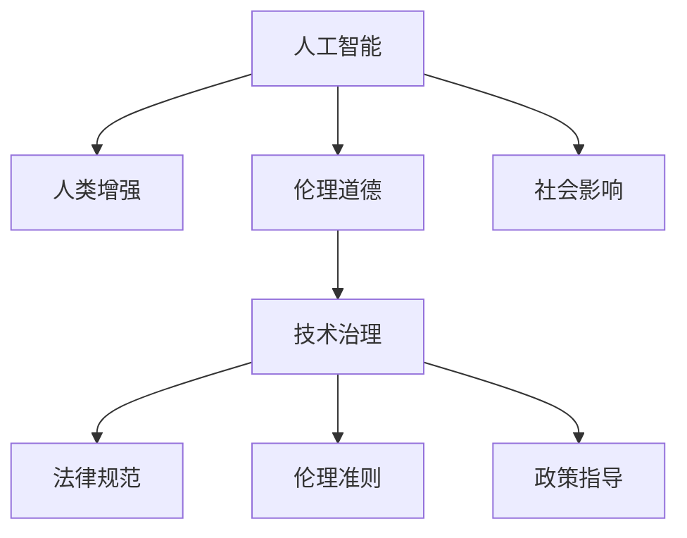

                 

# AI时代的人类增强：道德和社会影响

> 关键词：人工智能,人类增强,道德伦理,社会影响,技术治理,未来展望

## 1. 背景介绍

### 1.1 问题由来
人工智能(AI)技术的飞速发展，正在深刻改变着人类的生产生活方式。从自动驾驶、工业机器人到个性化推荐、智能客服，AI正逐渐渗透到各行各业，提升了效率，创造了价值。然而，随着AI技术的广泛应用，其道德和社会影响也越来越受到人们的关注。如何平衡技术进步与伦理道德，成为当今社会的重要课题。

### 1.2 问题核心关键点
AI技术的迅猛发展，伴随着一系列道德和社会问题：
1. **公平性与透明性**：AI决策过程的黑箱性质，使得模型难以解释，容易引起偏见和不公。
2. **隐私与安全**：AI系统对用户数据的处理和存储，引发了隐私泄露和数据滥用的风险。
3. **就业与经济**：自动化和智能化可能取代大量传统岗位，引发就业问题和经济结构变化。
4. **伦理与法律**：AI在医疗、司法等领域的运用，提出了新的伦理法律挑战。
5. **社会责任**：AI技术对社会治理和公共安全的影响，需要重新定义和平衡技术与人文的关系。

这些核心问题直接关系到AI技术的可持续发展和广泛应用。本文将从道德伦理和社会影响的视角，探讨AI技术在推动人类增强的同时，如何避免负面影响，确保其健康发展。

### 1.3 问题研究意义
理解和解决AI技术的道德和社会影响问题，对于实现技术与人文的和谐共生，推动AI技术的健康发展具有重要意义：

1. **提升公众信任**：通过明确的伦理规范和透明的决策过程，增强公众对AI技术的信任感，促进其广泛应用。
2. **促进技术创新**：理清伦理与社会责任，为AI技术的迭代优化提供方向，激发更多创新灵感。
3. **维护社会稳定**：通过法律和政策监管，保障AI技术在社会治理中的应用，避免引发社会冲突和伦理风险。
4. **推动可持续发展**：平衡AI技术与人类价值观，确保技术进步为全社会带来福祉，实现可持续发展。

## 2. 核心概念与联系

### 2.1 核心概念概述

为更好地理解AI技术对人类增强的道德和社会影响，本节将介绍几个密切相关的核心概念：

- **人工智能(AI)**：通过算法、计算和数据，使计算机系统具备类似于人的智能行为，如感知、学习、推理等。
- **人类增强(Enhanced Human)**：指通过AI技术提升人类的认知、体能、情感等多方面的能力，使其超越原始状态。
- **伦理道德(Ethics and Morality)**：指个人或组织在行为选择中的价值判断和道德准则，与技术应用密切相关。
- **社会影响(Societal Impact)**：指AI技术在社会层面引起的广泛变化，包括经济、就业、公共安全等方面。
- **技术治理(Governance of Technology)**：指通过法律、政策、伦理规范等手段，对技术应用进行管理和监督，确保其健康发展。

这些核心概念之间的逻辑关系可以通过以下Mermaid流程图来展示：



这个流程图展示了大语言模型的核心概念及其之间的关系：

1. 人工智能通过技术手段提升人类能力。
2. 人类增强通过AI技术带来多方面的能力提升。
3. 伦理道德约束AI技术的应用，避免负面影响。
4. 社会影响受到AI技术的广泛作用。
5. 技术治理通过法律、伦理等手段对AI进行管理和监督。

这些概念共同构成了AI技术的应用框架，使其能够在社会各个层面发挥积极作用，同时避免负面影响。

## 3. 核心算法原理 & 具体操作步骤
### 3.1 算法原理概述

AI技术的核心算法，如深度学习、强化学习、知识图谱等，通过算法迭代和优化，不断提升模型的性能。其基本原理是通过大量数据进行训练，学习复杂的特征表示和模式识别能力。但在大规模应用中，AI技术的道德和社会影响也不容忽视。

### 3.2 算法步骤详解

基于AI技术的人类增强过程，主要包括以下几个关键步骤：

**Step 1: 确定增强目标**
- 明确增强的目标和范围，如提升认知能力、改善决策质量、增强身体机能等。
- 根据具体需求，选择合适的AI技术和算法模型。

**Step 2: 数据准备**
- 收集相关的数据集，包括结构化数据和非结构化数据，如文本、图像、视频等。
- 确保数据的真实性和代表性，避免数据偏差和隐私泄露。

**Step 3: 模型训练**
- 选择合适的算法模型，进行预训练和微调。
- 设置合理的超参数，如学习率、批大小、迭代轮数等。
- 应用正则化技术，防止模型过拟合。

**Step 4: 模型评估**
- 在验证集上评估模型的性能，如准确率、召回率、F1分数等。
- 使用混淆矩阵、ROC曲线等可视化工具，分析模型预测结果。

**Step 5: 模型部署**
- 将训练好的模型集成到实际应用系统中，进行测试和部署。
- 确保系统的稳定性和安全性，避免数据泄露和模型滥用。

**Step 6: 监控与反馈**
- 实时监控模型的运行状态和性能指标，收集用户反馈。
- 根据反馈结果，调整模型参数和算法策略，不断优化模型性能。

### 3.3 算法优缺点

AI技术在提升人类能力方面，具有以下优点：
1. **高效性**：通过算法迭代和数据驱动，AI可以快速提升人类在特定任务上的表现。
2. **广泛适用性**：AI技术可以应用于多种场景，如医疗、教育、娱乐等，带来广泛的受益。
3. **创新性**：AI技术的不断进步，推动了新技术和新应用的开发，创造了新的经济价值。

然而，AI技术在应用过程中，也存在一些缺点：
1. **数据依赖性**：AI模型的性能高度依赖于数据质量，数据偏差可能导致模型偏见。
2. **黑箱性质**：AI模型的决策过程复杂，难以解释，容易引起伦理争议。
3. **技术依赖性**：AI技术的广泛应用，增加了对计算资源和技术人员的依赖。
4. **社会影响**：AI技术在提高效率的同时，可能引发就业、隐私等问题。

### 3.4 算法应用领域

AI技术在各个领域的应用，已经取得了显著成效，如：

- **医疗健康**：通过影像识别、自然语言处理等技术，提升医疗诊断和治疗效果。
- **教育培训**：利用智能辅导和个性化推荐，提高教育质量和学习效率。
- **金融服务**：通过数据分析和智能投顾，提升金融决策的准确性和效率。
- **智慧城市**：通过智能交通、环境监测等应用，提升城市治理和公共服务水平。
- **工业制造**：通过自动化和智能化，提升生产效率和产品质量。

这些应用展示了AI技术在提升人类能力方面的巨大潜力。但同时也带来了新的挑战和风险，需要我们在技术、伦理、社会等多个层面进行综合考量。

## 4. 数学模型和公式 & 详细讲解  
### 4.1 数学模型构建

AI技术的基础是数学模型，其核心思想是通过算法迭代，学习数据中的模式和规律。以下是几个常见的AI数学模型：

- **深度学习模型**：通过多层神经网络，对输入数据进行特征提取和模式识别。
- **强化学习模型**：通过与环境互动，通过奖励和惩罚机制，优化决策策略。
- **知识图谱模型**：通过图结构表示实体和关系，进行复杂推理和知识整合。

### 4.2 公式推导过程

以下是深度学习模型的核心公式推导：

**神经网络前向传播公式**：
$$
y_i = f_w(z_i) = f_w\left(\sum_j W_{ij}x_j + b_i\right)
$$
其中，$z_i$ 为输入层第 $i$ 个神经元的加权和，$W_{ij}$ 为权重矩阵，$x_j$ 为输入向量，$b_i$ 为偏置项，$f_w$ 为激活函数。

**损失函数**：
$$
L = \frac{1}{N}\sum_{i=1}^N(y_i - \hat{y}_i)^2
$$
其中，$y_i$ 为真实标签，$\hat{y}_i$ 为模型预测结果，$N$ 为样本数。

**反向传播算法**：
$$
\frac{\partial L}{\partial W_{ij}} = \frac{\partial L}{\partial y_i} \cdot \frac{\partial y_i}{\partial z_i} \cdot \frac{\partial z_i}{\partial W_{ij}}
$$

### 4.3 案例分析与讲解

以下以深度学习模型为例，分析其在提升人类能力方面的应用：

**人脸识别**：通过卷积神经网络(Convolutional Neural Network, CNN)，对输入的图像进行特征提取和分类，实现身份识别和认证。

**情感分析**：通过循环神经网络(Recurrent Neural Network, RNN)，对文本进行情感分类，分析用户的情绪和态度。

**机器翻译**：通过序列到序列模型(Sequence-to-Sequence, Seq2Seq)，对输入的文本进行编码和解码，实现语言之间的自动翻译。

**自然语言处理**：通过Transformer模型，对文本进行语言理解和生成，实现问答、对话等任务。

## 5. 项目实践：代码实例和详细解释说明
### 5.1 开发环境搭建

在进行AI技术项目开发前，我们需要准备好开发环境。以下是使用Python进行TensorFlow开发的完整环境配置流程：

1. 安装Anaconda：从官网下载并安装Anaconda，用于创建独立的Python环境。

2. 创建并激活虚拟环境：
```bash
conda create -n tf-env python=3.8 
conda activate tf-env
```

3. 安装TensorFlow：根据CUDA版本，从官网获取对应的安装命令。例如：
```bash
conda install tensorflow-gpu -c conda-forge
```

4. 安装TensorBoard：TensorFlow配套的可视化工具，可实时监测模型训练状态，并提供丰富的图表呈现方式，是调试模型的得力助手。
```bash
pip install tensorboard
```

5. 安装各类工具包：
```bash
pip install numpy pandas scikit-learn matplotlib tqdm jupyter notebook ipython
```

完成上述步骤后，即可在`tf-env`环境中开始AI技术项目的开发。

### 5.2 源代码详细实现

这里我们以图像分类任务为例，给出使用TensorFlow进行卷积神经网络训练的完整代码实现。

首先，定义模型结构：

```python
import tensorflow as tf
from tensorflow.keras import layers

class CNNModel(tf.keras.Model):
    def __init__(self):
        super(CNNModel, self).__init__()
        self.conv1 = layers.Conv2D(32, (3, 3), activation='relu', padding='same', input_shape=(224, 224, 3))
        self.pool1 = layers.MaxPooling2D((2, 2))
        self.conv2 = layers.Conv2D(64, (3, 3), activation='relu', padding='same')
        self.pool2 = layers.MaxPooling2D((2, 2))
        self.flatten = layers.Flatten()
        self.dense1 = layers.Dense(128, activation='relu')
        self.dense2 = layers.Dense(10, activation='softmax')
    
    def call(self, x):
        x = self.conv1(x)
        x = self.pool1(x)
        x = self.conv2(x)
        x = self.pool2(x)
        x = self.flatten(x)
        x = self.dense1(x)
        return self.dense2(x)
```

然后，定义训练函数：

```python
@tf.function
def train_step(images, labels):
    with tf.GradientTape() as tape:
        logits = model(images, training=True)
        loss = tf.keras.losses.sparse_categorical_crossentropy(labels, logits)
    gradients = tape.gradient(loss, model.trainable_variables)
    optimizer.apply_gradients(zip(gradients, model.trainable_variables))
    return loss

def train_epoch(model, dataset, batch_size, optimizer):
    dataset = dataset.shuffle(buffer_size=1024).batch(batch_size)
    losses = []
    for images, labels in dataset:
        loss = train_step(images, labels)
        losses.append(loss)
    return tf.reduce_mean(losses)
```

最后，启动训练流程：

```python
epochs = 10
batch_size = 32

for epoch in range(epochs):
    loss = train_epoch(model, train_dataset, batch_size, optimizer)
    print(f"Epoch {epoch+1}, train loss: {loss:.4f}")
```

以上就是使用TensorFlow进行卷积神经网络图像分类任务的完整代码实现。可以看到，TensorFlow提供了强大的深度学习框架和丰富的工具，使得AI技术项目的开发变得高效和便捷。

### 5.3 代码解读与分析

让我们再详细解读一下关键代码的实现细节：

**CNNModel类**：
- `__init__`方法：初始化卷积层、池化层、全连接层等关键组件，定义模型的网络结构。
- `call`方法：实现模型前向传播，输出预测结果。

**train_step函数**：
- 定义训练步骤，包括前向传播、损失计算、反向传播和参数更新。
- 使用自动微分技术，自动计算梯度并更新模型参数。

**train_epoch函数**：
- 定义一个epoch的训练过程，对每个批次进行前向传播和反向传播，计算平均损失。
- 在每个批次结束后，返回平均损失。

**训练流程**：
- 定义总的epoch数和batch size，开始循环迭代
- 每个epoch内，先在训练集上训练，输出平均loss
- 重复上述步骤直至收敛

可以看出，TensorFlow提供了一套完整的训练框架和工具，使得开发者可以专注于模型设计和数据处理，而不必过多关注底层的计算细节。

## 6. 实际应用场景
### 6.1 智能医疗

AI技术在医疗领域的应用，已经显著提升了疾病诊断和治疗的效果。通过图像识别、自然语言处理等技术，AI模型能够快速准确地分析医疗影像和病历，提供专业的诊断建议。

具体而言，可以收集大量的医学影像数据，对各类疾病进行标注和分类。在此基础上，对预训练的深度学习模型进行微调，使其能够准确识别疾病特征。将微调后的模型应用于实际医疗影像中，即可实现高效的疾病诊断和预测。

### 6.2 个性化教育

AI技术在教育领域的应用，有望实现个性化教育和高效教学。通过分析学生的学习行为和成绩，AI模型能够提供个性化的学习建议和辅导。

具体而言，可以收集学生的学习记录、测试成绩和反馈信息，构建学生画像。在此基础上，对预训练的深度学习模型进行微调，使其能够根据学生特征推荐学习内容和方式。将微调后的模型应用于实际教学系统中，即可实现高度个性化的教育服务。

### 6.3 金融风控

AI技术在金融领域的应用，有助于提升风险管理和投资决策的准确性。通过数据分析和机器学习，AI模型能够实时监测市场动态和风险，提供智能投顾和风险预警。

具体而言，可以收集历史交易数据和市场信息，对各类金融产品进行标注和分类。在此基础上，对预训练的深度学习模型进行微调，使其能够预测市场趋势和风险事件。将微调后的模型应用于金融决策系统中，即可实现智能化的风险管理和投资决策。

### 6.4 未来应用展望

随着AI技术的不断进步，其应用范围将进一步扩大，带来更多创新和突破：

- **智能城市**：通过AI技术，提升城市管理和服务水平，构建智慧城市治理体系。
- **智能制造**：通过自动化和智能化，提升生产效率和产品质量，推动制造业升级。
- **智能交通**：通过智能监控和调度，提升交通安全和效率，构建智慧交通系统。
- **智能家居**：通过语音识别和自然语言处理，提升家居控制和智能交互，创造美好生活。

## 7. 工具和资源推荐
### 7.1 学习资源推荐

为了帮助开发者系统掌握AI技术的原理和应用，这里推荐一些优质的学习资源：

1. 《深度学习》系列课程：斯坦福大学开设的深度学习课程，涵盖深度学习的基本概念和经典算法，适合初学者入门。
2. 《机器学习》系列书籍：周志华老师的《机器学习》，系统介绍了机器学习的基本原理和应用，是机器学习领域的经典教材。
3. 《TensorFlow实战》系列书籍：TensorFlow官方文档和教程，深入浅出地介绍了TensorFlow的原理和应用。
4. Kaggle平台：数据科学和机器学习竞赛平台，提供大量公开数据集和竞赛任务，有助于实战演练。
5. Coursera平台：提供各种人工智能和机器学习课程，涵盖深度学习、强化学习、计算机视觉等多个领域。

通过对这些资源的学习实践，相信你一定能够快速掌握AI技术的精髓，并用于解决实际的AI问题。

### 7.2 开发工具推荐

高效的开发离不开优秀的工具支持。以下是几款用于AI技术开发的常用工具：

1. TensorFlow：由Google主导开发的深度学习框架，生产部署方便，适合大规模工程应用。
2. PyTorch：基于Python的开源深度学习框架，灵活度高，适合研究和实验。
3. Keras：高级神经网络API，提供了高层次的API接口，适合快速原型设计和实验。
4. Jupyter Notebook：交互式编程环境，支持Python、R等语言，方便代码调试和分享。
5. Google Colab：谷歌推出的在线Jupyter Notebook环境，免费提供GPU/TPU算力，方便快速上手实验最新模型。

合理利用这些工具，可以显著提升AI技术项目的开发效率，加快创新迭代的步伐。

### 7.3 相关论文推荐

AI技术的发展源于学界的持续研究。以下是几篇奠基性的相关论文，推荐阅读：

1. AlphaGo论文：DeepMind团队开发的围棋AI程序，通过强化学习技术，取得人类级甚至超越人类的表现，引发了AI领域的重大突破。
2. ImageNet论文：AlexNet模型在ImageNet数据集上的训练和测试，展示了深度学习在图像分类任务上的强大能力。
3. GAN论文：生成对抗网络技术，通过对抗训练方式，生成逼真的图像和视频，推动了计算机视觉和生成模型的发展。
4. Transformer论文：Google团队提出的Transformer模型，通过自注意力机制，提升了自然语言处理的效率和效果。
5. GPT-3论文：OpenAI开发的GPT-3模型，通过大规模预训练和微调，实现了复杂的自然语言处理任务，展示了预训练语言模型的潜力。

这些论文代表了大语言模型微调技术的发展脉络。通过学习这些前沿成果，可以帮助研究者把握学科前进方向，激发更多的创新灵感。

## 8. 总结：未来发展趋势与挑战
### 8.1 总结

本文对AI技术在提升人类能力方面的道德和社会影响进行了全面系统的探讨。首先阐述了AI技术的发展背景和应用前景，明确了其对人类增强的巨大潜力。其次，从伦理道德和社会影响的视角，详细讲解了AI技术在医疗、教育、金融等领域的应用，展示了AI技术带来的广泛受益。最后，通过对未来发展趋势和面临挑战的分析，指出需要在技术、伦理、社会等多个层面进行综合考量，确保AI技术的健康发展。

通过本文的系统梳理，可以看到，AI技术在推动人类增强的同时，也带来了新的挑战和风险，需要我们在技术、伦理、社会等多个层面进行综合考量，确保AI技术的健康发展。

### 8.2 未来发展趋势

展望未来，AI技术的持续进步，将带来更多创新和突破：

1. **多模态融合**：AI技术将进一步拓展到视觉、语音、文本等多个模态，实现多模态信息的协同建模。
2. **个性化定制**：通过深度学习和大数据分析，AI技术将实现高度个性化的定制服务，满足不同用户的需求。
3. **智能化治理**：AI技术将应用于智慧城市、智慧交通等领域，提升社会治理和公共服务水平。
4. **自动化生产**：通过智能化和自动化，AI技术将推动制造业、农业等行业的转型升级，提高生产效率。
5. **知识图谱构建**：通过知识图谱技术，AI技术将构建复杂的知识体系，提升信息整合和推理能力。

这些趋势展示了AI技术在推动人类增强方面的巨大潜力，也将带来更多创新和突破。

### 8.3 面临的挑战

尽管AI技术的迅猛发展，但在迈向更加智能化、普适化应用的过程中，仍面临诸多挑战：

1. **数据隐私**：AI模型对数据的依赖性，引发了隐私泄露和数据滥用的风险，需要通过技术手段和法律监管加以解决。
2. **伦理争议**：AI模型在决策过程中可能引入偏见和不公，需要通过透明性和公平性评估加以解决。
3. **技术依赖**：AI技术的广泛应用，增加了对计算资源和技术人员的依赖，需要通过资源优化和人才培育加以解决。
4. **社会冲突**：AI技术在提高效率的同时，可能引发就业和经济问题，需要通过政策指导和社会共识加以解决。
5. **知识鸿沟**：AI技术的应用，可能加剧社会不同群体之间的知识鸿沟，需要通过教育和普及加以解决。

这些挑战凸显了AI技术在推动人类增强方面的复杂性和艰巨性，需要我们在技术、伦理、社会等多个层面进行综合考量，确保AI技术的健康发展。

### 8.4 研究展望

面对AI技术面临的诸多挑战，未来的研究需要在以下几个方面寻求新的突破：

1. **数据隐私保护**：开发更加安全可靠的数据加密和匿名化技术，确保数据隐私和安全性。
2. **伦理模型设计**：设计具有透明性和公平性的AI模型，通过解释性模型和公平性评估，避免模型偏见和歧视。
3. **技术普适化**：开发适合不同场景和用户需求的AI技术，提升技术的普适性和可接受性。
4. **社会治理体系**：构建AI技术的社会治理体系，通过法律、政策、伦理规范等手段，对技术应用进行管理和监督。
5. **教育普及推广**：加强AI技术的教育普及和公众理解，提升社会对AI技术的认知和接受度。

这些研究方向将引领AI技术的健康发展，为构建人机协同的智能社会铺平道路。

## 9. 附录：常见问题与解答

**Q1：AI技术的道德和伦理问题如何解决？**

A: AI技术的道德和伦理问题需要从多个层面进行解决：
1. **透明性和公平性**：通过模型解释性技术和公平性评估，提升模型的透明性和公平性。
2. **隐私保护**：采用数据加密和匿名化技术，保护用户隐私和数据安全。
3. **伦理规范**：制定和完善AI伦理规范，引导AI技术的健康发展。

**Q2：AI技术在医疗领域的应用需要注意哪些问题？**

A: AI技术在医疗领域的应用，需要注意以下问题：
1. **数据隐私**：保护患者隐私，防止数据泄露。
2. **模型偏见**：避免模型引入偏见和歧视，确保诊断和治疗的公平性。
3. **责任认定**：明确AI技术与人类医生的责任分配，确保医疗质量和安全。

**Q3：AI技术在教育领域的应用面临哪些挑战？**

A: AI技术在教育领域的应用，面临以下挑战：
1. **数据质量**：需要高质量的教育数据，避免数据偏差和噪音。
2. **模型泛化**：确保模型在多样化的教育场景中具有良好的泛化能力。
3. **师生互动**：需要在教学过程中充分考虑师生互动和情感因素，避免AI技术的冷漠化。

**Q4：AI技术在金融领域的应用需要注意哪些问题？**

A: AI技术在金融领域的应用，需要注意以下问题：
1. **模型透明性**：确保模型的透明性和可解释性，避免用户对模型的信任危机。
2. **数据隐私**：保护用户隐私，防止数据滥用。
3. **公平性和公正性**：避免模型引入偏见，确保金融决策的公平性和公正性。

**Q5：AI技术在智能城市中的应用需要注意哪些问题？**

A: AI技术在智能城市中的应用，需要注意以下问题：
1. **数据安全和隐私**：保护城市数据的安全和隐私，防止数据泄露和滥用。
2. **伦理规范**：制定和完善AI技术的伦理规范，避免技术滥用和伦理争议。
3. **社会接受度**：提升社会对AI技术的认知和接受度，避免社会抵制和抵触。

综上所述，AI技术在提升人类能力的同时，也带来了新的挑战和风险。通过多方面的综合考量和努力，我们可以在确保技术健康发展的同时，充分发挥AI技术的潜力，推动社会的进步和人类的增强。

---

作者：禅与计算机程序设计艺术 / Zen and the Art of Computer Programming

