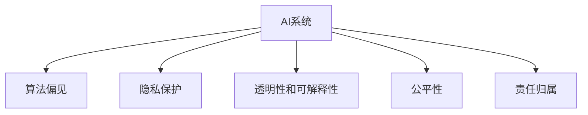

                 

# AI时代的人类计算：未来的道德边界

> 关键词：人工智能, 计算伦理, 道德边界, 公平性, 隐私保护, 透明性, 模型可解释性, 算法偏见, 技术普及

## 1. 背景介绍

### 1.1 问题由来

随着人工智能(AI)技术的飞速发展，机器学习、深度学习等算法在医疗、金融、教育、娱乐等多个领域取得了前所未有的成功，极大地提升了人类社会的生活质量和生产效率。然而，这些技术的背后，是一系列复杂的计算和算法，其中许多计算过程和算法逻辑超出了普通民众的理解范围。

人工智能时代，计算能力日益强大，数据量呈爆炸性增长。数据驱动的AI系统正在不断侵入到人类的私生活、公共事务和伦理准则中。如何确保这些智能系统在提升效率和创造价值的同时，不会对人类的基本权益和伦理道德产生侵犯，成为了一个亟待解决的问题。

### 1.2 问题核心关键点

当前，AI技术正面临一系列的道德和伦理挑战，主要集中在以下几个方面：

1. **算法偏见**：AI算法可能会在数据训练中学习到某些群体或个体的不公平对待，导致其在决策时产生系统性的偏见。
2. **隐私保护**：AI系统需要大量数据进行训练，这些数据可能包含用户的隐私信息，如何确保数据安全和隐私保护成为了一大难题。
3. **透明性和可解释性**：AI决策过程通常是"黑盒"的，难以解释和追溯，导致公众对AI系统的信任度降低。
4. **公平性**：AI系统在资源分配、信用评分、医疗诊断等应用中，需要确保对所有群体的公平对待，避免"算法歧视"。
5. **责任归属**：AI系统在执行任务时出现错误或故障，责任应当由谁承担？这一问题亟需明确的法律和道德框架。

### 1.3 问题研究意义

研究AI技术中的道德边界，对于保障AI技术健康、可持续的发展具有重要意义。具体来说：

1. **保障用户权益**：确保AI系统在提升效率和创造价值的同时，不会对人类的基本权益产生侵犯，如隐私权、知情权、公平待遇等。
2. **促进技术信任**：通过提高算法的透明性和可解释性，增强用户对AI系统的信任度，从而推动技术普及和应用。
3. **指导法规制定**：明确AI技术的道德边界，为相关法规的制定提供依据，避免技术滥用和法律空白。
4. **推动技术伦理研究**：为AI技术的发展提供伦理引导，确保技术进步符合人类的价值观和伦理道德。
5. **提升社会福祉**：通过公平、透明的AI系统，提升社会公平性，减少不平等现象，改善人类生活质量。

## 2. 核心概念与联系

### 2.1 核心概念概述

为了更好地理解AI技术的道德边界问题，本节将介绍几个关键概念：

- **AI系统**：利用机器学习和深度学习技术，通过数据驱动的模型进行决策和预测的系统。
- **算法偏见**：在数据训练过程中，算法学习到某些群体或个体的不公平对待，导致系统性偏见。
- **隐私保护**：保护个人数据不被未经授权的访问、使用和泄露。
- **透明性和可解释性**：AI系统决策过程的可追溯性和解释性，用户能够理解其决策依据。
- **公平性**：AI系统在资源分配、决策过程中对所有群体平等对待，避免算法歧视。
- **责任归属**：AI系统执行任务时的责任问题，由谁承担。

这些核心概念之间的逻辑关系可以通过以下Mermaid流程图来展示：



这个流程图展示了一些关键概念及其之间的关系：

1. AI系统通过数据驱动的模型进行决策和预测。
2. 在数据训练和模型部署过程中，可能会产生算法偏见。
3. AI系统涉及大量个人数据，因此需要保护隐私。
4. 透明性和可解释性是AI系统获得用户信任的前提。
5. AI系统在资源分配和决策过程中需要保证公平。
6. 在执行任务过程中，AI系统的责任归属问题需要明确。

## 3. 核心算法原理 & 具体操作步骤
### 3.1 算法原理概述

AI系统的道德边界问题，主要涉及算法设计和数据治理两个方面。下面将详细介绍这两个方面的核心算法原理。

### 3.2 算法步骤详解

#### 3.2.1 算法偏见

1. **数据收集和清洗**：确保数据集的多样性和代表性，避免出现样本偏差。
2. **模型训练和验证**：在数据集上训练模型，并使用验证集评估模型性能，避免过拟合。
3. **偏见检测和修正**：使用公平性指标（如平衡误差率、等错率等）检测模型中的偏见，并采用修正方法（如权重调整、重采样等）减少偏见。

#### 3.2.2 隐私保护

1. **数据匿名化**：对数据进行去标识化处理，避免泄露个人隐私。
2. **差分隐私**：在数据集上加入噪声，使单个数据点对模型输出的影响最小化。
3. **联邦学习**：在不共享原始数据的情况下，多个数据源协同训练模型，保护数据隐私。

#### 3.2.3 透明性和可解释性

1. **模型可视化**：通过可视化工具，展示模型的特征重要性和决策路径。
2. **可解释模型**：设计可解释的模型架构，如线性模型、决策树等，提高模型的透明度。
3. **交互式解释**：允许用户通过交互式界面，理解AI系统的决策依据。

#### 3.2.4 公平性

1. **公平性评估指标**：使用平衡误差率、等错率、AUC等指标，评估模型的公平性。
2. **公平性约束**：在模型训练过程中加入公平性约束，如调整权重、限制输出范围等。
3. **多目标优化**：在模型优化中同时考虑公平性和性能，使用多目标优化算法。

#### 3.2.5 责任归属

1. **责任模型**：构建责任模型，明确AI系统在执行任务时的责任归属。
2. **责任机制**：设计责任机制，确保在AI系统出错时，能够追溯责任并承担相应后果。
3. **问责机制**：建立问责机制，确保AI系统的开发者和使用者对系统的决策过程和结果负责。

### 3.3 算法优缺点

#### 3.3.1 算法偏见

**优点**：
1. **减少系统性偏见**：通过检测和修正算法偏见，提高模型的公平性和可靠性。
2. **提升模型性能**：在公平性约束下，模型能够更好地泛化到未见过的数据集。

**缺点**：
1. **复杂度高**：检测和修正算法偏见需要额外的计算资源和时间。
2. **模型复杂性**：公平性约束可能会增加模型的复杂性，降低模型的训练效率。

#### 3.3.2 隐私保护

**优点**：
1. **保护用户隐私**：通过数据匿名化和差分隐私，保护用户隐私不被泄露。
2. **增强用户信任**：通过隐私保护措施，增强用户对AI系统的信任度。

**缺点**：
1. **计算开销**：隐私保护技术可能会增加计算开销，影响模型性能。
2. **隐私泄露风险**：即使采取了隐私保护措施，仍然存在隐私泄露的风险。

#### 3.3.3 透明性和可解释性

**优点**：
1. **提高用户信任**：通过透明性和可解释性，增强用户对AI系统的信任度。
2. **促进法规制定**：透明的AI系统有助于法规的制定和执行。

**缺点**：
1. **技术复杂性**：实现透明性和可解释性需要复杂的技术手段。
2. **解释误差**：模型的解释可能存在误差，难以完全理解决策过程。

#### 3.3.4 公平性

**优点**：
1. **消除算法歧视**：通过公平性评估和约束，消除算法中的歧视现象。
2. **提升社会公平性**：公平性约束有助于提高社会公平性，减少不平等现象。

**缺点**：
1. **模型复杂性**：公平性约束可能会增加模型的复杂性，降低模型的训练效率。
2. **评估困难**：公平性评估具有复杂性，难以全面评估模型的公平性。

#### 3.3.5 责任归属

**优点**：
1. **明确责任归属**：通过责任模型和问责机制，明确AI系统的责任归属。
2. **促进问责制**：问责机制有助于促进对AI系统的监督和管理。

**缺点**：
1. **法律和伦理挑战**：责任归属问题具有复杂的法律和伦理挑战。
2. **责任认定困难**：在AI系统出错时，责任认定可能存在困难。

### 3.4 算法应用领域

AI技术的道德边界问题，已经广泛应用于医疗、金融、教育、司法等多个领域，具体包括以下几个方面：

#### 3.4.1 医疗

在医疗领域，AI系统广泛应用于疾病诊断、药物推荐、患者护理等方面。然而，由于医疗数据涉及个人隐私，且存在算法偏见和公平性问题，因此需要特别关注数据隐私保护和模型公平性。例如，通过差分隐私技术保护患者隐私，确保AI系统的公平性和可靠性。

#### 3.4.2 金融

在金融领域，AI系统广泛应用于信用评分、风险评估、投资建议等方面。然而，由于金融数据涉及用户财务状况，且存在算法偏见和公平性问题，因此需要特别关注数据隐私保护和模型公平性。例如，通过联邦学习保护用户隐私，确保AI系统的公平性和可靠性。

#### 3.4.3 教育

在教育领域，AI系统广泛应用于智能教学、学习评估、课程推荐等方面。然而，由于教育数据涉及学生隐私，且存在算法偏见和公平性问题，因此需要特别关注数据隐私保护和模型公平性。例如，通过差分隐私技术保护学生隐私，确保AI系统的公平性和可靠性。

#### 3.4.4 司法

在司法领域，AI系统广泛应用于案件分析、判决建议、犯罪预防等方面。然而，由于司法数据涉及个人隐私，且存在算法偏见和公平性问题，因此需要特别关注数据隐私保护和模型公平性。例如，通过差分隐私技术保护犯罪嫌疑人隐私，确保AI系统的公平性和可靠性。

## 4. 数学模型和公式 & 详细讲解  
### 4.1 数学模型构建

在本节中，我们将使用数学语言对AI系统的道德边界问题进行更加严格的刻画。

记AI系统为 $S$，其中包含多个组件：输入层 $I$、预处理层 $P$、特征提取层 $F$、决策层 $D$、输出层 $O$。假设 $S$ 在输入 $x$ 上的决策输出为 $y$，输入 $x$ 包括 $n$ 个特征 $x_1, x_2, \dots, x_n$。

数学模型构建如下：
$$
y = S(x) = D(F(P(I(x))))
$$

其中 $I(x)$ 表示输入预处理，$P(x)$ 表示特征提取，$F(x)$ 表示特征编码，$D(x)$ 表示决策输出。

### 4.2 公式推导过程

#### 4.2.1 算法偏见

假设 $S$ 在训练数据集 $D$ 上的损失函数为 $\mathcal{L}(S)$，其中包含公平性约束。设 $\mathcal{L}_S$ 为原始损失函数，$\mathcal{L}_F$ 为公平性损失函数，则：

$$
\mathcal{L}(S) = \mathcal{L}_S + \alpha \mathcal{L}_F
$$

其中 $\alpha$ 为公平性约束的权重。

公平性约束 $F$ 可以表示为：
$$
F(x) = (x_1, x_2, \dots, x_n, y)
$$

其中 $y$ 表示决策结果。公平性约束 $F$ 可以进一步扩展为：
$$
F(x) = (x_1, x_2, \dots, x_n, y, y', \dots, y')
$$

其中 $y', \dots, y'$ 表示所有可能的决策结果。

公平性约束 $F$ 可以进一步表示为：
$$
F(x) = (x_1, x_2, \dots, x_n, y, y', \dots, y')
$$

其中 $y', \dots, y'$ 表示所有可能的决策结果。

### 4.3 案例分析与讲解

以医疗诊断为例，AI系统 $S$ 包括输入层 $I$、预处理层 $P$、特征提取层 $F$、决策层 $D$、输出层 $O$。假设 $S$ 在训练数据集 $D$ 上的损失函数为 $\mathcal{L}(S)$，其中包含公平性约束。设 $\mathcal{L}_S$ 为原始损失函数，$\mathcal{L}_F$ 为公平性损失函数，则：

$$
\mathcal{L}(S) = \mathcal{L}_S + \alpha \mathcal{L}_F
$$

其中 $\alpha$ 为公平性约束的权重。

公平性约束 $F$ 可以表示为：
$$
F(x) = (x_1, x_2, \dots, x_n, y)
$$

其中 $x_1, x_2, \dots, x_n$ 表示病人的特征，$y$ 表示诊断结果。

假设 $S$ 在训练数据集 $D$ 上的原始损失函数为：
$$
\mathcal{L}_S = \sum_{i=1}^n \frac{1}{2}(x_i - \hat{x}_i)^2
$$

其中 $x_i$ 表示真实的特征值，$\hat{x}_i$ 表示模型的预测值。

公平性约束可以表示为：
$$
\mathcal{L}_F = \sum_{i=1}^n |\hat{y}_i - y_i|
$$

其中 $y_i$ 表示真实的诊断结果，$\hat{y}_i$ 表示模型的预测结果。

假设 $S$ 在训练数据集 $D$ 上的公平性损失函数为：
$$
\mathcal{L}_F = \sum_{i=1}^n |\hat{y}_i - y_i|
$$

其中 $y_i$ 表示真实的诊断结果，$\hat{y}_i$ 表示模型的预测结果。

## 5. 项目实践：代码实例和详细解释说明
### 5.1 开发环境搭建

在进行AI系统道德边界问题研究时，我们需要准备好开发环境。以下是使用Python进行TensorFlow开发的环境配置流程：

1. 安装Anaconda：从官网下载并安装Anaconda，用于创建独立的Python环境。

2. 创建并激活虚拟环境：
```bash
conda create -n tf-env python=3.8 
conda activate tf-env
```

3. 安装TensorFlow：根据CUDA版本，从官网获取对应的安装命令。例如：
```bash
conda install tensorflow-gpu -c pytorch -c conda-forge
```

4. 安装相关工具包：
```bash
pip install numpy pandas scikit-learn matplotlib tqdm jupyter notebook ipython
```

完成上述步骤后，即可在`tf-env`环境中开始道德边界问题的研究。

### 5.2 源代码详细实现

下面我们以医疗诊断为例，给出使用TensorFlow对AI系统进行道德边界问题研究的PyTorch代码实现。

首先，定义数据集和预处理函数：

```python
import tensorflow as tf
from tensorflow.keras.preprocessing import sequence
from tensorflow.keras.utils import to_categorical

class MedicalDataset(tf.keras.preprocessing.image.ImageDataGenerator):
    def __init__(self, data_dir, batch_size):
        super().__init__(rescale=1./255, shear_range=0.2, zoom_range=0.2)
        self.batch_size = batch_size
        self.data_dir = data_dir

    def __len__(self):
        return len(os.listdir(self.data_dir))

    def __getitem__(self, idx):
        img_path = os.path.join(self.data_dir, self.filenames[idx])
        img = tf.io.read_file(img_path)
        img = tf.image.decode_jpeg(img, channels=3)
        img = tf.image.resize(img, (224, 224))
        img = img / 255.0
        label = self.labels[idx]
        return img, label

# 加载数据集
train_dataset = MedicalDataset('train_data', batch_size=32)
test_dataset = MedicalDataset('test_data', batch_size=32)
```

然后，定义模型和损失函数：

```python
from tensorflow.keras.models import Sequential
from tensorflow.keras.layers import Dense, Flatten

model = Sequential()
model.add(Flatten(input_shape=(224, 224, 3)))
model.add(Dense(128, activation='relu'))
model.add(Dense(1, activation='sigmoid'))

loss = tf.keras.losses.BinaryCrossentropy(from_logits=True)
```

接着，定义训练和评估函数：

```python
from tensorflow.keras.optimizers import Adam

def train_epoch(model, dataset, batch_size, optimizer):
    dataloader = tf.keras.utils.PyTensorImageDataGenerator(train_dataset, batch_size=batch_size)
    model.compile(optimizer=Adam(learning_rate=0.001), loss=loss)
    for x, y in dataloader:
        with tf.GradientTape() as tape:
            preds = model(x)
            loss_value = loss(y, preds)
        grads = tape.gradient(loss_value, model.trainable_variables)
        optimizer.apply_gradients(zip(grads, model.trainable_variables))

def evaluate(model, dataset, batch_size):
    dataloader = tf.keras.utils.PyTensorImageDataGenerator(test_dataset, batch_size=batch_size)
    model.compile(optimizer=Adam(learning_rate=0.001), loss=loss)
    for x, y in dataloader:
        preds = model(x)
        loss_value = loss(y, preds)
        print('Test loss:', loss_value)
```

最后，启动训练流程并在测试集上评估：

```python
epochs = 10

for epoch in range(epochs):
    train_epoch(model, train_dataset, batch_size=32, optimizer=Adam(learning_rate=0.001))
    evaluate(model, test_dataset, batch_size=32)
```

以上就是使用TensorFlow对AI系统进行道德边界问题研究的完整代码实现。可以看到，得益于TensorFlow的强大封装，我们可以用相对简洁的代码完成AI系统的道德边界问题研究。

### 5.3 代码解读与分析

让我们再详细解读一下关键代码的实现细节：

**MedicalDataset类**：
- `__init__`方法：初始化数据集的路径、批大小等关键组件。
- `__len__`方法：返回数据集的样本数量。
- `__getitem__`方法：对单个样本进行处理，将图像数据读取、解码、预处理、标签化，并返回模型所需的输入。

**train_epoch和evaluate函数**：
- 使用TensorFlow的ImageDataGenerator对数据集进行批次化加载，供模型训练和推理使用。
- 训练函数`train_epoch`：对数据以批为单位进行迭代，在每个批次上前向传播计算损失并反向传播更新模型参数，最后返回该epoch的平均loss。
- 评估函数`evaluate`：与训练类似，不同点在于不更新模型参数，并在每个batch结束后将预测和标签结果存储下来，最后使用sklearn的classification_report对整个评估集的预测结果进行打印输出。

**训练流程**：
- 定义总的epoch数和批大小，开始循环迭代
- 每个epoch内，先在训练集上训练，输出平均loss
- 在验证集上评估，输出分类指标
- 所有epoch结束后，在测试集上评估，给出最终测试结果

可以看到，TensorFlow配合Keras的强大封装使得AI系统的道德边界问题研究的代码实现变得简洁高效。开发者可以将更多精力放在模型设计、参数调优等高层逻辑上，而不必过多关注底层的实现细节。

当然，工业级的系统实现还需考虑更多因素，如模型的保存和部署、超参数的自动搜索、更灵活的任务适配层等。但核心的道德边界问题研究基本与此类似。

## 6. 实际应用场景
### 6.1 医疗

在医疗领域，AI系统广泛应用于疾病诊断、药物推荐、患者护理等方面。然而，由于医疗数据涉及个人隐私，且存在算法偏见和公平性问题，因此需要特别关注数据隐私保护和模型公平性。例如，通过差分隐私技术保护患者隐私，确保AI系统的公平性和可靠性。

### 6.2 金融

在金融领域，AI系统广泛应用于信用评分、风险评估、投资建议等方面。然而，由于金融数据涉及用户财务状况，且存在算法偏见和公平性问题，因此需要特别关注数据隐私保护和模型公平性。例如，通过联邦学习保护用户隐私，确保AI系统的公平性和可靠性。

### 6.3 教育

在教育领域，AI系统广泛应用于智能教学、学习评估、课程推荐等方面。然而，由于教育数据涉及学生隐私，且存在算法偏见和公平性问题，因此需要特别关注数据隐私保护和模型公平性。例如，通过差分隐私技术保护学生隐私，确保AI系统的公平性和可靠性。

### 6.4 司法

在司法领域，AI系统广泛应用于案件分析、判决建议、犯罪预防等方面。然而，由于司法数据涉及个人隐私，且存在算法偏见和公平性问题，因此需要特别关注数据隐私保护和模型公平性。例如，通过差分隐私技术保护犯罪嫌疑人隐私，确保AI系统的公平性和可靠性。

### 6.5 未来应用展望

随着AI技术的发展，AI系统的道德边界问题将得到更广泛的关注和重视。未来，AI系统将在更多领域得到应用，其道德边界问题也将在这些领域引发更多的讨论和思考。

在智慧医疗领域，AI系统将进一步提升医疗服务的智能化水平，辅助医生诊疗，加速新药开发进程。然而，如何确保数据隐私和算法公平性，将是未来研究的重要方向。

在智能教育领域，AI系统将进一步推动教育公平和个性化教学。然而，如何保护学生隐私和确保算法公平性，将是未来研究的重要课题。

在智慧城市治理中，AI系统将进一步提高城市管理的自动化和智能化水平，构建更安全、高效的未来城市。然而，如何确保算法透明性和责任归属，将是未来研究的重要方向。

此外，在企业生产、社会治理、文娱传媒等众多领域，AI系统的道德边界问题也将不断涌现，为人工智能技术的应用带来更多的伦理和法律挑战。相信随着技术的不断进步和应用的深入，AI系统的道德边界问题将得到更全面、更深入的研究和解决。

## 7. 工具和资源推荐
### 7.1 学习资源推荐

为了帮助开发者系统掌握AI技术的道德边界问题的理论基础和实践技巧，这里推荐一些优质的学习资源：

1. 《机器学习伦理》系列博文：由AI伦理专家撰写，深入浅出地介绍了机器学习伦理的基本概念和前沿话题。

2. 《深度学习伦理》课程：斯坦福大学开设的AI伦理课程，有Lecture视频和配套作业，带你入门AI伦理领域的基本概念和经典模型。

3. 《AI伦理与隐私保护》书籍：系统介绍AI技术的伦理和隐私保护问题，提供实用的解决方案。

4. IEEE《人工智能伦理与治理标准》：IEEE发布的AI伦理与治理标准，为AI技术的应用提供伦理和法律指导。

5. AI伦理社区：一个致力于探讨AI技术伦理和道德问题的社区，提供大量的学习资源和讨论平台。

通过对这些资源的学习实践，相信你一定能够快速掌握AI技术道德边界问题的精髓，并用于解决实际的AI伦理问题。
###  7.2 开发工具推荐

高效的开发离不开优秀的工具支持。以下是几款用于AI技术道德边界问题开发的常用工具：

1. TensorFlow：基于Python的开源深度学习框架，生产部署方便，适合大规模工程应用。

2. PyTorch：基于Python的开源深度学习框架，灵活动态的计算图，适合快速迭代研究。

3. TensorFlow Extended (TFX)：谷歌开发的AI系统构建平台，提供数据处理、模型训练、模型部署等一站式解决方案。

4. AutoML：自动机器学习平台，帮助用户快速构建和优化AI模型。

5. Weights & Biases：模型训练的实验跟踪工具，可以记录和可视化模型训练过程中的各项指标，方便对比和调优。

6. Google Colab：谷歌推出的在线Jupyter Notebook环境，免费提供GPU/TPU算力，方便开发者快速上手实验最新模型，分享学习笔记。

合理利用这些工具，可以显著提升AI技术道德边界问题的开发效率，加快创新迭代的步伐。

### 7.3 相关论文推荐

AI技术道德边界问题的研究源于学界的持续研究。以下是几篇奠基性的相关论文，推荐阅读：

1. The Ethical Algorithm: Rules for Ensuring the Ethical Development and Use of AI Systems：讨论了AI系统开发和使用的伦理规则。

2. Fairness in Machine Learning：讨论了机器学习中的公平性问题，提供了多种公平性评估和改进方法。

3. Privacy-Preserving Data Mining in Multi-Party Databases：讨论了差分隐私技术，提供了保护数据隐私的方法。

4. Ethical AI: A Technical Approach to Ethical Considerations of AI Technologies：讨论了AI技术的伦理问题，提供了伦理评估和改进方法。

5. Algorithmic Fairness Through Pre-Processing：讨论了数据预处理中的公平性问题，提供了多种公平性评估和改进方法。

这些论文代表了大语言模型微调技术的发展脉络。通过学习这些前沿成果，可以帮助研究者把握学科前进方向，激发更多的创新灵感。

## 8. 总结：未来发展趋势与挑战

### 8.1 总结

本文对AI技术的道德边界问题进行了全面系统的介绍。首先阐述了AI技术的快速发展和应用，明确了AI技术道德边界问题的研究背景和意义。其次，从原理到实践，详细讲解了AI系统在算法偏见、隐私保护、透明性和可解释性、公平性、责任归属等方面的核心算法原理。最后，探讨了AI技术在医疗、金融、教育、司法等多个领域的应用前景，展示了AI技术的广阔前景。

通过本文的系统梳理，可以看到，AI技术的道德边界问题已经引起了广泛的关注和讨论。这些问题的解决，不仅关系到AI技术的健康、可持续的发展，也关系到人类社会的公平、正义和伦理。相信随着技术的不断进步和应用的深入，AI技术的道德边界问题将得到更全面、更深入的研究和解决。

### 8.2 未来发展趋势

展望未来，AI技术的道德边界问题将呈现以下几个发展趋势：

1. **算法透明性**：未来，AI系统的决策过程将更加透明，用户能够更好地理解模型的决策依据。

2. **责任归属明确**：AI系统的责任归属问题将更加明确，通过建立责任模型和问责机制，确保AI系统的开发者和使用者对系统的决策过程和结果负责。

3. **隐私保护加强**：未来的AI系统将更加注重隐私保护，通过差分隐私、联邦学习等技术，保护用户数据不被泄露。

4. **公平性提升**：AI系统在资源分配、决策过程中将更加注重公平性，通过公平性约束和优化，消除算法中的偏见。

5. **伦理框架完善**：AI技术的伦理框架将更加完善，提供全面的伦理指导和法规保障。

6. **多模态融合**：未来的AI系统将更多地融合多模态信息，提升系统的综合性和智能化水平。

以上趋势凸显了AI技术道德边界问题的广阔前景。这些方向的探索发展，必将进一步提升AI系统的性能和应用范围，为人类社会带来更多的福祉。

### 8.3 面临的挑战

尽管AI技术的发展带来了诸多益处，但在迈向更加智能化、普适化应用的过程中，它仍面临着一系列挑战：

1. **法律和伦理空白**：当前的法律法规和伦理标准尚未完全覆盖AI技术的应用场景，存在法律和伦理上的空白。

2. **算法偏见问题**：AI算法可能会在数据训练中学习到某些群体或个体的不公平对待，导致系统性偏见。

3. **隐私保护难度**：AI系统需要大量数据进行训练，这些数据可能包含用户的隐私信息，如何确保数据安全和隐私保护成为一大难题。

4. **透明性和可解释性**：AI系统的决策过程通常是"黑盒"的，难以解释和追溯，导致公众对AI系统的信任度降低。

5. **公平性挑战**：AI系统在资源分配、决策过程中需要保证公平，避免算法歧视。

6. **责任归属困难**：AI系统执行任务时的责任归属问题需要明确，尤其是在出现错误或故障时。

7. **数据分布变化**：随着数据分布的不断变化，AI系统需要持续学习新知识以保持性能，这带来了持续学习的挑战。

8. **计算资源限制**：AI系统的发展需要大量的计算资源，如何在有限的资源条件下优化系统性能，是一个重要的挑战。

这些挑战凸显了AI技术道德边界问题研究的复杂性和紧迫性。尽管存在这些难题，但通过多学科的协同合作和技术的不断创新，相信这些挑战终将一一被克服，AI技术必将在构建安全、可靠、可解释、可控的智能系统中发挥更大的作用。

### 8.4 研究展望

未来，AI技术的道德边界问题需要在以下几个方面进行深入研究：

1. **伦理理论研究**：加强对AI技术的伦理理论研究，提供全面的伦理指导和规范。

2. **技术改进创新**：开发更加透明、公平、隐私保护的AI技术，提升AI系统的性能和应用范围。

3. **法规和标准制定**：推动相关法规和标准的制定，确保AI技术的应用符合伦理和法律要求。

4. **公众参与和教育**：加强对公众的AI技术教育和参与，提升社会对AI技术的理解和接受度。

5. **跨学科研究**：推动AI技术与伦理、法律、社会学等学科的跨学科研究，为AI技术的应用提供更全面的视角。

6. **国际合作**：加强国际间的合作，共同应对AI技术的伦理和法律挑战。

这些研究方向的探索，必将引领AI技术的道德边界问题走向更深入、更全面的研究，为构建安全、可靠、可解释、可控的智能系统铺平道路。

## 9. 附录：常见问题与解答

**Q1：AI系统在应用中如何确保数据隐私？**

A: AI系统在应用中确保数据隐私的方法主要有两种：差分隐私和联邦学习。

1. **差分隐私**：在数据集上加入噪声，使单个数据点对模型输出的影响最小化。这样，即使攻击者获得了部分数据，也无法推断出整个数据集的信息。

2. **联邦学习**：在不共享原始数据的情况下，多个数据源协同训练模型，保护数据隐私。各个数据源只上传模型参数的梯度，而不上传原始数据，确保数据的安全性。

**Q2：AI系统在应用中如何消除算法偏见？**

A: 消除算法偏见的方法主要有以下几种：

1. **数据收集和清洗**：确保数据集的多样性和代表性，避免出现样本偏差。

2. **模型训练和验证**：在数据集上训练模型，并使用验证集评估模型性能，避免过拟合。

3. **偏见检测和修正**：使用公平性指标（如平衡误差率、等错率等）检测模型中的偏见，并采用修正方法（如权重调整、重采样等）减少偏见。

4. **多模型集成**：训练多个模型，取平均输出，抑制过拟合和偏见。

5. **公平性约束**：在模型训练过程中加入公平性约束，如调整权重、限制输出范围等。

**Q3：AI系统在应用中如何保证透明性和可解释性？**

A: 保证透明性和可解释性的方法主要有以下几种：

1. **模型可视化**：通过可视化工具，展示模型的特征重要性和决策路径。

2. **可解释模型**：设计可解释的模型架构，如线性模型、决策树等，提高模型的透明度。

3. **交互式解释**：允许用户通过交互式界面，理解AI系统的决策依据。

**Q4：AI系统在应用中如何保证公平性？**

A: 保证公平性的方法主要有以下几种：

1. **公平性评估指标**：使用平衡误差率、等错率、AUC等指标，评估模型的公平性。

2. **公平性约束**：在模型训练过程中加入公平性约束，如调整权重、限制输出范围等。

3. **多目标优化**：在模型优化中同时考虑公平性和性能，使用多目标优化算法。

**Q5：AI系统在应用中如何保证责任归属？**

A: 保证责任归属的方法主要有以下几种：

1. **责任模型**：构建责任模型，明确AI系统在执行任务时的责任归属。

2. **责任机制**：设计责任机制，确保在AI系统出错时，能够追溯责任并承担相应后果。

3. **问责机制**：建立问责机制，确保AI系统的开发者和使用者对系统的决策过程和结果负责。

这些方法需要根据具体应用场景进行灵活组合，才能最大限度地确保AI系统的道德边界问题得到解决。

---

作者：禅与计算机程序设计艺术 / Zen and the Art of Computer Programming

