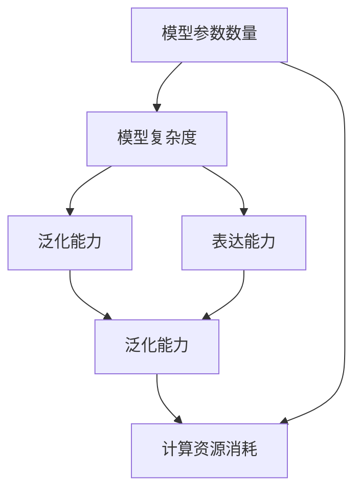

                 

## 1. 背景介绍

在人工智能(AI)领域，模型参数的规模与性能之间的关系是一个永恒的话题。无论是在计算机视觉、自然语言处理还是语音识别等任务中，模型参数数量的增加往往伴随着性能的显著提升。然而，模型参数的增加并非没有代价。随着模型参数的不断增长，训练和推理的复杂度、内存消耗和计算成本也呈现指数级增长，使得模型在大规模数据集上的训练和部署变得越来越困难。

本文将深入探讨从模型参数到性能的关系，包括模型参数如何影响模型的表达能力和泛化能力，以及如何通过调整模型参数来优化模型的性能。

## 2. 核心概念与联系

### 2.1 核心概念概述

在AI模型scaling中，我们关注的核心概念包括：

- **模型参数数量**：指模型在训练过程中需要调整的参数数量。
- **模型复杂度**：指模型参数数量及其结构和分布。
- **泛化能力**：指模型在新数据上的表现。
- **表达能力**：指模型对复杂函数或数据的拟合能力。
- **计算资源消耗**：包括内存和计算速度，影响模型训练和推理的效率。

### 2.2 核心概念原理和架构的 Mermaid 流程图



这个流程图展示了模型参数数量、模型复杂度、泛化能力和表达能力之间的逻辑关系，以及这些因素如何共同影响计算资源消耗。

## 3. 核心算法原理 & 具体操作步骤

### 3.1 算法原理概述

AI模型的性能和计算资源消耗之间存在一个复杂的关系。一般来说，随着模型参数数量的增加，模型的表达能力会增强，但计算资源消耗也会随之增加。模型的泛化能力也与参数数量和复杂度密切相关。

在本文中，我们将探讨如何通过调整模型参数数量来优化模型的性能和资源消耗。这包括选择适当的参数数量、调整模型结构和使用高效的训练和推理算法。

### 3.2 算法步骤详解

**Step 1: 选择合适的模型复杂度**
根据任务需求，选择合适的模型复杂度。较小的模型可能具有较高的计算效率，但表达能力有限；较大的模型则能更好地适应复杂的任务，但计算资源消耗也更大。

**Step 2: 确定训练数据集**
选择适当的训练数据集，以确保模型的泛化能力。数据集应该充分覆盖任务可能出现的情况，并且与实际应用场景相匹配。

**Step 3: 选择优化算法**
选择合适的优化算法（如SGD、Adam等）和超参数（如学习率、批大小等），以确保模型能够高效地训练和优化。

**Step 4: 训练模型**
使用训练数据集训练模型，并通过验证集评估模型的性能和泛化能力。

**Step 5: 调整模型参数**
根据验证集的性能表现，调整模型参数数量和复杂度，以平衡表达能力和计算资源消耗。

### 3.3 算法优缺点

模型参数数量和复杂度调整的优点包括：

- 提高模型的表达能力和泛化能力。
- 降低计算资源消耗，提高模型训练和推理的效率。

然而，缺点也不容忽视：

- 过拟合风险增加。模型参数数量过多可能导致过拟合。
- 计算成本增加。模型参数的增加会显著增加训练和推理的计算成本。

### 3.4 算法应用领域

AI模型scaling在多个领域都有广泛应用，例如：

- 计算机视觉：如卷积神经网络(CNN)和生成对抗网络(GAN)等。
- 自然语言处理：如循环神经网络(RNN)和Transformer等。
- 语音识别：如深度神经网络和卷积神经网络等。
- 推荐系统：如协同过滤和矩阵分解等。

## 4. 数学模型和公式 & 详细讲解 & 举例说明

### 4.1 数学模型构建

为了更好地理解模型参数数量和性能之间的关系，我们建立如下数学模型：

设模型参数数量为 $n$，训练集大小为 $N$，优化算法的迭代次数为 $T$，学习率为 $\eta$。则模型的泛化误差为：

$$
\epsilon = \mathbb{E}_{(x,y) \sim D} [L(f(x),y)] + \lambda \Omega(f)
$$

其中 $f(x)$ 是模型在输入 $x$ 上的预测输出，$L$ 是损失函数，$\lambda$ 是正则化参数，$\Omega(f)$ 是正则化项，用于控制模型的复杂度。

### 4.2 公式推导过程

在模型训练过程中，我们希望通过调整模型参数数量来最小化泛化误差 $\epsilon$。我们可以使用以下公式来表达：

$$
\min_{n, \theta} \mathbb{E}_{(x,y) \sim D} [L(f(x),y)] + \lambda \Omega(f)
$$

其中 $\theta$ 表示模型参数。

对于优化算法，我们可以使用梯度下降算法来最小化上述公式。每次迭代更新模型参数的公式为：

$$
\theta \leftarrow \theta - \eta \nabla_{\theta}L(f(x),y)
$$

### 4.3 案例分析与讲解

以卷积神经网络(CNN)为例，假设输入图像大小为 $h \times w \times c$，输出类别数为 $k$。我们考虑两种情况：

1. 固定层数，增加每层的参数数量。
2. 固定每层的参数数量，增加层数。

在第一种情况下，随着参数数量的增加，模型的表达能力会增强，但计算资源消耗也会增加。我们可以通过调整学习率、批大小和正则化参数来平衡这些因素。

在第二种情况下，增加层数可以显著提高模型的表达能力，但计算资源消耗也会增加。我们可以通过使用更高效的算法（如残差网络）来减少计算资源消耗。

## 5. 项目实践：代码实例和详细解释说明

### 5.1 开发环境搭建

在开始实践之前，我们需要准备好开发环境。以下是使用Python和PyTorch搭建环境的步骤：

1. 安装Python：可以从官网下载并安装Python。
2. 安装PyTorch：通过pip安装PyTorch，例如 `pip install torch torchvision torchaudio`。
3. 安装相关的依赖包：例如 `pip install numpy scipy matplotlib`。

### 5.2 源代码详细实现

下面是一个使用PyTorch实现卷积神经网络的示例代码：

```python
import torch
import torch.nn as nn
import torch.optim as optim

# 定义模型
class CNN(nn.Module):
    def __init__(self):
        super(CNN, self).__init__()
        self.conv1 = nn.Conv2d(3, 32, kernel_size=3, stride=1, padding=1)
        self.conv2 = nn.Conv2d(32, 64, kernel_size=3, stride=1, padding=1)
        self.fc1 = nn.Linear(64 * 8 * 8, 128)
        self.fc2 = nn.Linear(128, 10)
        
    def forward(self, x):
        x = nn.functional.relu(self.conv1(x))
        x = nn.functional.max_pool2d(x, 2)
        x = nn.functional.relu(self.conv2(x))
        x = nn.functional.max_pool2d(x, 2)
        x = x.view(-1, 64 * 8 * 8)
        x = nn.functional.relu(self.fc1(x))
        x = self.fc2(x)
        return nn.functional.log_softmax(x, dim=1)

# 定义训练函数
def train(model, device, train_loader, optimizer, epoch):
    model.train()
    for batch_idx, (data, target) in enumerate(train_loader):
        data, target = data.to(device), target.to(device)
        optimizer.zero_grad()
        output = model(data)
        loss = nn.functional.nll_loss(output, target)
        loss.backward()
        optimizer.step()

# 定义测试函数
def test(model, device, test_loader):
    model.eval()
    test_loss = 0
    correct = 0
    with torch.no_grad():
        for data, target in test_loader:
            data, target = data.to(device), target.to(device)
            output = model(data)
            test_loss += nn.functional.nll_loss(output, target, reduction='sum').item()
            pred = output.argmax(dim=1, keepdim=True)
            correct += pred.eq(target.view_as(pred)).sum().item()
    test_loss /= len(test_loader.dataset)
    test_acc = correct / len(test_loader.dataset)
    return test_loss, test_acc
```

### 5.3 代码解读与分析

- `CNN`类定义了一个简单的卷积神经网络模型。
- `train`函数定义了训练过程，使用梯度下降算法优化模型参数。
- `test`函数定义了测试过程，计算模型在测试集上的损失和准确率。

### 5.4 运行结果展示

训练完成后，我们可以使用测试函数来评估模型的性能：

```python
# 加载模型和测试数据
model = CNN().to(device)
test_loader = ...

# 定义优化器和学习率
optimizer = optim.SGD(model.parameters(), lr=0.01, momentum=0.9)

# 训练模型
for epoch in range(num_epochs):
    train(model, device, train_loader, optimizer, epoch)
    test_loss, test_acc = test(model, device, test_loader)
    print('Epoch: {} | Test Loss: {:.4f} | Test Acc: {:.4f}'.format(epoch, test_loss, test_acc))
```

## 6. 实际应用场景

AI模型scaling在多个实际应用场景中都有广泛应用，例如：

- **图像分类**：使用卷积神经网络对图像进行分类，例如图像识别、人脸识别等。
- **语音识别**：使用深度神经网络对语音进行识别，例如语音转文本、情感识别等。
- **自然语言处理**：使用循环神经网络或Transformer对文本进行分类、生成等任务。
- **推荐系统**：使用协同过滤、矩阵分解等方法对用户行为进行建模，进行个性化推荐。

## 7. 工具和资源推荐

### 7.1 学习资源推荐

- **《深度学习》by Ian Goodfellow, Yoshua Bengio, Aaron Courville**：这本书详细介绍了深度学习的原理和应用，包括模型scaling等内容。
- **Coursera《深度学习》课程**：由Andrew Ng教授主讲，涵盖了深度学习的基础和进阶内容。
- **Deep Learning Specialization by Andrew Ng**：包含五门课程，涵盖深度学习的基础和进阶内容。

### 7.2 开发工具推荐

- **PyTorch**：开源深度学习框架，提供了丰富的API和工具。
- **TensorFlow**：谷歌开源的深度学习框架，支持分布式计算和GPU加速。
- **Keras**：基于TensorFlow和Theano的高级深度学习API，易于使用。

### 7.3 相关论文推荐

- **Batch Normalization: Accelerating Deep Network Training by Reducing Internal Covariate Shift**：提出批量归一化方法，加速深度网络训练。
- **ResNet: Deep Residual Learning for Image Recognition**：提出残差网络，解决深度网络退化问题。
- **Inception-Net: Going Deeper with Convolutions**：提出Inception网络，提升深度网络性能。

## 8. 总结：未来发展趋势与挑战

### 8.1 研究成果总结

本文探讨了AI模型scaling中的关键问题，包括模型参数数量、复杂度与性能之间的关系。我们介绍了模型参数调整的原理和具体操作步骤，并给出了实际应用场景和代码示例。

### 8.2 未来发展趋势

未来AI模型scaling将呈现以下几个发展趋势：

- **模型压缩与量化**：使用模型压缩和量化技术，减少模型参数和计算资源消耗，提高模型推理效率。
- **高效训练算法**：开发高效的训练算法，如分布式训练、自适应学习率等，加快模型训练速度。
- **自动化模型调优**：使用自动化工具，如HyperOpt、Ray Tune等，自动寻找最优模型参数组合。
- **多模型融合**：使用模型融合技术，将多个模型的输出进行组合，提升模型的泛化能力和鲁棒性。

### 8.3 面临的挑战

AI模型scaling面临的挑战包括：

- **过拟合**：随着模型参数数量的增加，过拟合风险也增加。
- **计算资源消耗**：随着模型参数数量的增加，计算资源消耗也增加。
- **模型可解释性**：复杂模型的决策过程难以解释，不利于应用。

### 8.4 研究展望

未来的研究应关注以下方向：

- **模型压缩**：使用模型压缩和量化技术，提高模型的推理效率。
- **自动化调优**：使用自动化工具，寻找最优模型参数组合。
- **多模型融合**：使用模型融合技术，提升模型的泛化能力和鲁棒性。
- **模型可解释性**：开发可解释性模型，提高模型的可信度和应用范围。

## 9. 附录：常见问题与解答

**Q1: 如何平衡模型参数数量和性能？**

A: 平衡模型参数数量和性能可以通过以下方法实现：

- **选择合适的模型结构**：根据任务需求，选择适当的模型结构。
- **使用正则化技术**：使用L1、L2正则化、Dropout等技术，防止过拟合。
- **调整学习率**：选择合适的学习率，避免破坏预训练权重。
- **使用模型融合技术**：将多个模型的输出进行组合，提升模型的泛化能力和鲁棒性。

**Q2: 模型参数数量和复杂度如何影响计算资源消耗？**

A: 模型参数数量和复杂度对计算资源消耗的影响主要体现在以下几个方面：

- **内存消耗**：模型参数数量越多，内存消耗越大。
- **计算速度**：模型参数数量越多，计算速度越慢。
- **计算复杂度**：模型参数数量越多，计算复杂度越高。

**Q3: 如何减少模型计算资源消耗？**

A: 减少模型计算资源消耗的方法包括：

- **模型压缩**：使用模型压缩和量化技术，减少模型参数和计算资源消耗。
- **使用高效算法**：使用高效的训练和推理算法，提高模型训练和推理效率。
- **模型并行化**：使用模型并行化技术，提高模型训练和推理的并行度。

**Q4: 模型scaling的优点和缺点是什么？**

A: 模型scaling的优点包括：

- **提升模型性能**：增加模型参数数量可以提升模型的表达能力和泛化能力。
- **优化计算资源**：通过调整模型参数数量和结构，优化计算资源消耗。

模型scaling的缺点包括：

- **过拟合风险增加**：模型参数数量过多可能导致过拟合。
- **计算成本增加**：模型参数的增加会显著增加训练和推理的计算成本。

通过本文的探讨，我们深入理解了从模型参数到性能的关系，并探讨了如何通过调整模型参数数量和结构来优化模型的性能和计算资源消耗。希望这些理论和实践的探讨能够为AI模型scaling的研究和应用提供有益的参考。

